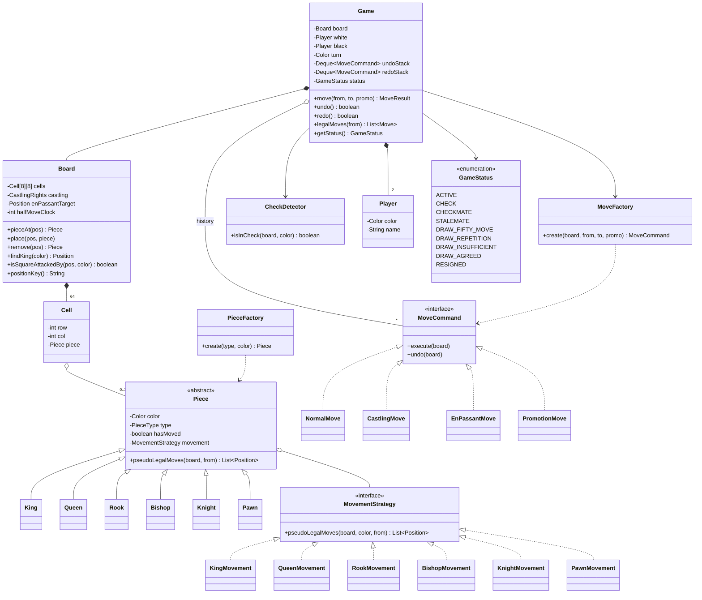
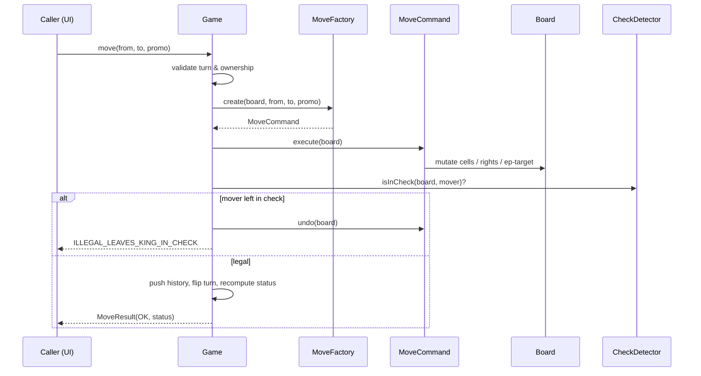

# Chess — Low-Level Design

> A staff-level LLD / machine-coding reference and last-minute revision artifact.
> Companion file: `Solution.java` (the single-file, read-and-revise implementation).

---

## 1. Problem statement

Design the object model and engine for a **two-player game of chess**. The system must model the 8×8 board, the six kinds of pieces with their distinct movement rules, alternating turns between White and Black, full **move validation** (including the rules that depend on game history — castling, en passant, promotion), detection of **check / checkmate / stalemate** and the major **draw** conditions, and **undo/redo** of moves. The deliverable is a clean, extensible OO design and a complete single-file Java solution that a senior engineer can read and recall under interview pressure.

This is a classic "lots of rules, one clean core" problem. The interview signal is *not* "do you know how a knight moves" — it is whether you can keep the rules out of the engine, isolate the genuinely hard, stateful rules (castling, en passant, check) behind clean abstractions, and not drown the design in special cases.

---

## 2. Clarifying / requirements questions to ask first

Lead with these before drawing a single class. They scope the problem and signal seniority.

**Functional scope**

- Is this a **rules engine for two humans** (validate moves, detect end states), or do we also need an **AI opponent / move search** (minimax, evaluation)? These are very different problems; I'll assume rules engine first and keep AI as an extension point.
- Do we need the *full* rule set: **castling, en passant, pawn promotion, fifty-move rule, threefold repetition, insufficient material**? Or just basic piece movement plus check/checkmate? (I'll design for the full set but layer it.)
- Is **undo/redo** required? How deep — single undo, or full game history? (Affects whether I use the Command pattern and how much per-move state I capture.)
- Do we need to **load/save** games (FEN / PGN import-export)? Or replay a game from a move list?
- Is there a **clock / time control** (blitz, increment)? Usually out of scope for the core engine but worth flagging.

**Non-functional**

- **Single process, in-memory**, or networked multiplayer with a server arbitrating moves? (Concurrency only matters in the latter.)
- Performance constraints? A legal-move check that "make the move, see if my king is attacked, unmake it" is O(pieces) per candidate and is fine for a UI; an engine doing millions of nodes/sec would need bitboards. I'll assume UI-grade performance.
- How is the move **input** expressed — algebraic notation ("Nf3", "e8=Q"), or (from, to) coordinates from a UI click? I'll model moves as (from, to, optional promotion) and treat notation as a separate parser/formatter concern.

**Scope-narrowing / edge**

- Should an **illegal move** throw, or return a result object the caller inspects? (I'll return a typed result — exceptions are clumsy for "user clicked a bad square".)
- Who decides **draw by agreement** / **resignation** — is that part of the engine API? (Yes, as explicit game-ending actions.)
- Under-promotion (to knight/bishop/rook) allowed, or auto-queen only? (Allow under-promotion; it's a real rule and cheap to support.)

**Assumed answers for this document:** rules engine for two players, full standard rule set, full undo/redo, in-memory single process, moves as (from, to, promotion), illegal moves returned as a typed `MoveResult`, AI and notation parsing left as clean extension points.

---

## 3. Finalized requirements & assumptions

**In scope**

- 8×8 board; standard starting position.
- Six piece types: King, Queen, Rook, Bishop, Knight, Pawn — each with correct movement and capture rules.
- Turn management (White moves first; strict alternation).
- Full legal-move validation: a move is legal only if it is geometrically valid for the piece, the path is unobstructed (except the knight), the destination is empty or an enemy, **and it does not leave the mover's own king in check**.
- Special moves: **castling** (king/queen side, with all its preconditions), **en passant**, **pawn promotion** (with under-promotion).
- End-state detection: **check, checkmate, stalemate**, plus draws by **fifty-move rule**, **threefold repetition**, **insufficient material**, **agreement**, and **resignation**.
- **Undo / redo** of moves restoring full state (including castling rights, en-passant target, clocks).

**Out of scope (explicitly)**

- AI / engine search and position evaluation (extension point provided).
- Network transport, persistence, matchmaking.
- Clock / time control enforcement.
- PGN/FEN parsing (the model is designed so a parser can sit on top, but the parser itself is not built).

**Key assumptions**

- Single-threaded core; if embedded in a server, one game instance is confined to one thread or guarded by the game's own lock.
- Coordinates: row 0..7 (rank 1..8), col 0..7 (file a..h). White's home rank is row 0.

---

## 4. Problem extensions / follow-up variations

These are the follow-ups interviewers love to bolt on. For each, the point is "does the design absorb it without a rewrite?"

| Extension | What it adds | Design impact |
|---|---|---|
| **Per-piece move validation** | Each piece's geometry | Already the core: each piece is a `MovementStrategy`. New piece ⇒ new strategy, zero engine changes. |
| **Check / checkmate / stalemate** | "King safety" predicate over the whole board | One method `isInCheck(color)` + "does the side to move have any legal move?". Checkmate = in check & no legal move; stalemate = not in check & no legal move. |
| **Castling** | Move depends on *history* (king/rook unmoved) and on squares not being attacked | Castling rights stored in `Board` state; generated as a special `CastlingMove` command that moves two pieces atomically. |
| **En passant** | Capture of a pawn that *just* double-stepped; target square is empty | `Board` holds an `enPassantTarget` square valid for exactly one ply; pawn strategy reads it; `EnPassantMove` removes the captured pawn from a different square than the destination. |
| **Promotion** | Pawn reaching last rank becomes another piece | `Move` carries an optional `promotionType`; the move command swaps the pawn for the chosen piece; under-promotion supported. |
| **Undo / redo** | Reverse any move, including special ones | **Command pattern**: each move is a command that captures enough state (captured piece, prior castling rights, prior en-passant target, half-move clock) to `undo()` itself; two stacks give redo. |
| **Draw conditions** | Fifty-move, threefold repetition, insufficient material | Half-move clock on `Board`; a position-hash multiset (Zobrist-style or FEN-key) for repetition; a material scan for insufficiency. Each is an independent checker. |
| **AI opponent** | Pick a move automatically | The legal-move generator already exists; an AI is a `Player` implementation that calls a `MoveStrategy`/search over generated moves. Clean seam, no engine change. |
| **Chess variants** (Chess960, atomic, king-of-the-hill) | Different setup or rules | Factory chooses starting layout; variant rules slot in via strategies and pluggable end-state checkers. |
| **Notation I/O (PGN/FEN)** | Serialize / deserialize | Separate `Serializer` reading/writing the model; the model already exposes everything needed. |

---

## 5. Core entities, responsibilities & relationships

- **`Game`** — the orchestrator / façade. Owns the `Board`, the two `Player`s, whose turn it is, the move history (undo/redo stacks), and the current `GameStatus`. Public API: `move(from,to,promotion)`, `undo()`, `redo()`, `getStatus()`, `legalMoves(square)`. Delegates "what's legal" to the board + rules, and "is the game over" to the end-state checkers.
- **`Board`** — the 8×8 grid of cells plus the *positional state that rules depend on*: castling rights, en-passant target square, half-move clock, and a repetition counter. Knows how to place/remove pieces, find a king, and answer **`isSquareAttackedBy(square, color)`** (the primitive that check detection is built on). It does **not** know about turns or game-over.
- **`Cell`** (a.k.a. Square) — a position `(row, col)` optionally holding a `Piece`. Lightweight value-ish object.
- **`Piece`** (abstract) — color + type + a reference to its **`MovementStrategy`**. Responsibility is deliberately thin: "what are my candidate (pseudo-legal) target squares from here?" It does *not* know about check.
- **`MovementStrategy`** (Strategy interface) — `pseudoLegalMoves(board, from)` for one piece type. Concrete: `KingMovement`, `QueenMovement`, `RookMovement`, `BishopMovement`, `KnightMovement`, `PawnMovement`. ("Pseudo-legal" = geometrically valid and respects obstruction/capture, but ignores whether it leaves your own king in check. Adjacent term: *pseudo-legal* moves are filtered down to *legal* moves by the king-safety test.)
- **`Move` / `MoveCommand`** (Command interface) — an executable, reversible action: `execute(board)` and `undo(board)`. Concrete: `NormalMove`, `CaptureMove` (often folded into normal), `CastlingMove`, `EnPassantMove`, `PromotionMove`. Each stores the state needed to reverse itself.
- **`MoveFactory`** — given (from, to, promotion) and the board, classifies the intent and builds the right `MoveCommand` (Factory).
- **`Player`** — White or Black; identity + (for an AI extension) a way to choose a move.
- **`GameStatus`** (State/enum) — `ACTIVE, CHECK, CHECKMATE, STALEMATE, DRAW_FIFTY_MOVE, DRAW_REPETITION, DRAW_INSUFFICIENT, DRAW_AGREED, RESIGNED`.
- **`PieceFactory`** — builds a piece of a given type+color wired to the correct movement strategy (Factory; also used by promotion).
- **End-state checkers** — `CheckDetector` and the draw rules; small, single-purpose collaborators the `Game` consults after each move.

Relationships: `Game` **composes** one `Board`, two `Player`s, and the history stacks. `Board` **composes** 64 `Cell`s; a `Cell` **associates** 0..1 `Piece`. `Piece` **has-a** `MovementStrategy` (composition over inheritance — see §6). `MoveCommand` **operates on** the `Board`. `MoveFactory` and `PieceFactory` **create** commands and pieces respectively.

---

## 6. Design patterns applied

| Pattern | Where | Why | Rejected alternative & *when not* to use |
|---|---|---|---|
| **Strategy** | Per-piece movement (`MovementStrategy`) | Each piece's geometry is an independent, swappable algorithm. Adding a variant piece = new strategy, no edits elsewhere (Open/Closed). | *Subclass `Piece` with an overridden `moves()`* — works, but conflates "what a piece **is**" (data: color/type/has-moved) with "how it **moves**" (algorithm), and makes variant rules (e.g. a piece that moves differently in a variant) require new subclasses. Skip Strategy only if you have exactly one rule set forever and value brevity over extensibility. |
| **Command** | `MoveCommand` with `execute`/`undo` | Moves must be **reversible** (undo/redo) and some move *two* pieces atomically (castling) or remove a piece from a non-destination square (en passant). Encapsulating each as a self-reversing object is the clean way to get undo and to keep the engine from special-casing. | *Recompute board from the start each undo*, or *store full board snapshots per ply* — snapshots are simple but memory-heavy and lose the "intent" of the move; recompute is O(n) per undo. Use snapshots only for a tiny history or when moves are too complex to invert. |
| **Factory** | `MoveFactory` (classify intent → command) and `PieceFactory` (type+color → wired piece) | Centralizes the messy "is this a castle? an en passant? a promotion?" classification and the "wire the right strategy" logic so callers and the promotion path stay clean. | *`new` scattered at call sites / big `switch` in `Game`* — leaks construction rules everywhere and violates SRP. Skip the factory only for trivially uniform construction. |
| **State** | `GameStatus` driving what actions are allowed | The game behaves differently when `ACTIVE` vs `CHECKMATE` vs `DRAW`; modeling status explicitly keeps "is this action allowed now" decisions in one place. | A full **State pattern with a class per state** is overkill here — the transitions are simple and computed from the board, so an enum + guard checks is clearer. Use full State classes if each state had rich, divergent behavior. |
| **Façade** | `Game` over board/rules/history | Gives the UI/network layer one small, intention-revealing API (`move`, `undo`, `legalMoves`, `status`) and hides the rules machinery. | Exposing `Board` + checkers directly — couples clients to internals. |
| *(Extension)* **Iterator / Memento / Observer** | move generation; per-move undo state; UI notifications | Generator yields legal moves (Iterator); the state a command captures to reverse itself is a small **Memento**; a UI could subscribe to board changes (Observer). | Mentioned as seams, not built, to avoid pattern-stuffing. |

**SOLID in play**

- **S**RP — `Piece` holds identity, `MovementStrategy` holds geometry, `Board` holds positional state + attack queries, `Game` orchestrates, checkers detect end states. Each has one reason to change.
- **O**CP — new piece type or variant rule = new Strategy/Command; the engine is closed for modification, open for extension.
- **L**SP — every `MovementStrategy` honors the same `pseudoLegalMoves` contract; the engine treats all pieces uniformly. Every `MoveCommand` is safely reversible.
- **I**SP — narrow interfaces (`MovementStrategy`, `MoveCommand`) instead of one fat `Piece` god-interface.
- **D**IP — `Game`/`Piece` depend on the `MovementStrategy` and `MoveCommand` *abstractions*, not concrete pieces or move types.

---

## 7. Class diagram



**Text UML (relationships in words)**

- `Game` *composes* `Board`, two `Player`s, and the undo/redo stacks of `MoveCommand`; it *uses* `MoveFactory` and `CheckDetector`; it *exposes* `GameStatus`.
- `Board` *composes* 64 `Cell`s; each `Cell` *associates* zero-or-one `Piece`.
- `Piece` is *abstract*; `King/Queen/Rook/Bishop/Knight/Pawn` *inherit* it; each `Piece` *has-a* `MovementStrategy` (composition).
- `MovementStrategy` is *realized by* the six concrete movement classes.
- `MoveCommand` is *realized by* `NormalMove`, `CastlingMove`, `EnPassantMove`, `PromotionMove`.

**Key public APIs**

```java
MoveResult move(Position from, Position to, PieceType promotion);
boolean    undo();
boolean    redo();
List<Move> legalMoves(Position from);     // legal, not just pseudo-legal
GameStatus getStatus();

// Board primitives
boolean    isSquareAttackedBy(Position p, Color attacker);
Position   findKing(Color color);

// Strategy
List<Position> pseudoLegalMoves(Board b, Color c, Position from);

// Command
void execute(Board b);
void undo(Board b);
```

---

## 8. Key flows

### 8.1 Making a move (the heart of the design)

1. `Game.move(from, to, promo)`: reject if game not `ACTIVE`, if `from` is empty, or if the piece there is not the side to move.
2. Generate **pseudo-legal** targets for that piece via its `MovementStrategy`. If `to` isn't among them (after special-move classification), return `ILLEGAL`.
3. Ask `MoveFactory` to build the concrete `MoveCommand` (normal / capture / castle / en passant / promotion).
4. `command.execute(board)` — apply it.
5. **King-safety filter:** if `CheckDetector.isInCheck(board, mover)` is now true, `command.undo(board)` and return `ILLEGAL_LEAVES_KING_IN_CHECK`. *(This "make → test → maybe unmake" is exactly why moves are reversible commands.)*
6. Update board state: castling rights, en-passant target (set only if a pawn double-stepped, else cleared), half-move clock (reset on pawn move/capture, else +1), repetition map.
7. Push command to undo stack, clear redo stack, flip the turn.
8. Recompute `GameStatus`: in check? does the opponent have *any* legal move? → ACTIVE / CHECK / CHECKMATE / STALEMATE; then the draw checkers. Return the result.

### 8.2 Castling preconditions (the classic gotcha checklist)

King and rook **both unmoved**; **no pieces between** them; the king is **not currently in check**; and the king does **not pass through or land on an attacked square**. Castling is the move that most exposes a weak design — note it needs *history* (hasMoved) and *attack queries on intermediate squares*, both of which the `Board` already provides.

### 8.3 Legal-move generation for a square

For each pseudo-legal target, build the command, execute, test own-king safety, undo, and keep it only if the king is safe. The same routine, run over *all* of a side's pieces, answers "does this side have any legal move?" — the basis of checkmate/stalemate.



---

## 9. Concurrency, edge cases & extensibility

**Concurrency.** The core engine is single-threaded by design — a chess game is inherently turn-based, so the natural concurrency model is *confinement*: one `Game` instance is owned by one thread (or one actor/session). In a networked server, the right approach is to serialize moves per game: each `Game` guarded by its own lock or processed on a single-threaded executor / actor mailbox, so the "execute → test check → maybe undo" sequence is atomic. Do **not** try to make `Board` internally thread-safe with fine-grained locks — the make/test/unmake invariant spans many cells and would be a deadlock farm; coarse per-game serialization is correct and simpler. Many independent games scale horizontally because they share nothing.

**Edge cases the design must handle**

- En passant is legal for **exactly one ply** after the double step — clear the target every move or it leaks. The captured pawn sits on a *different* square than the move's destination (handled by `EnPassantMove.undo`).
- Promotion with **under-promotion** — `Move` must carry the chosen type; defaulting to queen silently is a bug.
- Castling through/into check, or while in check — all forbidden; rely on `isSquareAttackedBy` for the king's path.
- A move that is geometrically legal but **leaves your own king in check** is illegal — the universal filter in §8.1 step 5 catches everything, including pins, without special-casing pins.
- **Stalemate vs checkmate**: both are "no legal move"; the discriminator is whether the king is currently in check. Easy to conflate.
- Draw bookkeeping: half-move clock resets on pawn move/capture; threefold needs a **position key** that includes side-to-move, castling rights, and en-passant target (not just piece placement) or you'll miscount.
- Undo must restore *all* hidden state — captured piece, castling rights, en-passant target, half-move clock, and `hasMoved` flags — which is precisely why each command captures its own memento.

**Extensibility.** New piece ⇒ new `MovementStrategy` + factory case. New special move ⇒ new `MoveCommand`. AI ⇒ a `Player` that searches the existing legal-move generator. Variants (Chess960, king-of-the-hill) ⇒ a different setup in `PieceFactory`/`Board` init plus pluggable end-state checkers. Notation/persistence ⇒ a serializer over the already-complete model. None of these touch `Game`'s core loop.

---

## 10. Likely interview questions

**Q1. Why a Strategy per piece instead of a `Piece` subclass that overrides `moves()`?**
Composition over inheritance: identity (color/type/hasMoved) and behavior (geometry) change for different reasons. Strategy lets a variant reuse the same `Piece` with a different movement, and keeps the engine depending on one abstraction. (SOLID: SRP + OCP + DIP.) *Probe: when would the subclass approach be fine?* — when the rule set is fixed forever and you value fewer types over extensibility.

**Q2. How do you detect check, and why is that one method enough?**
`isInCheck(color)` = `isSquareAttackedBy(findKing(color), opponent)`. Build `isSquareAttackedBy` by asking "could any enemy piece pseudo-legally move onto this square?" Because every legal move is filtered through "does it leave my king attacked?", you never need bespoke pin or discovered-check logic — they fall out for free. *Probe: performance?* — it's O(pieces) per candidate move; fine for UI. For an engine you'd switch to bitboards/attack tables.

**Q3. Checkmate vs stalemate — how do you tell them apart?**
Both are "the side to move has zero legal moves." Checkmate = that **and** the king is in check; stalemate = that **and** the king is **not** in check (a draw). The legal-move generator (make/test/unmake over all pieces) is the shared primitive.

**Q4. Why model moves as Command objects?**
Reversibility for undo/redo, atomic multi-piece moves (castling moves king + rook), and non-destination captures (en passant). Each command stores a memento of what it changed so `undo()` restores exactly. *Probe: alternative?* — full board snapshots per ply (simple, memory-heavy) or replay-from-start (O(n) undo). Commands win when history is long and moves are non-trivial. *Probe: redo?* — keep a second stack; a new move clears it.

**Q5. How does castling fit without polluting the engine?**
It's a `CastlingMove` command built by the factory only when preconditions hold: both pieces unmoved (needs `hasMoved` history), empty squares between, king not in/through/into check (needs `isSquareAttackedBy` on the path). The engine just executes a command; all the special logic lives in classification + the command itself.

**Q6. Where does en-passant state live, and what's the lifetime bug to avoid?**
`Board.enPassantTarget` is set only when a pawn double-steps and is valid for exactly the opponent's next ply. Forgetting to clear it (every other move) is the classic bug — a stale target lets illegal captures through.

**Q7. How do you support pawn under-promotion cleanly?**
`Move`/`PromotionMove` carries an optional `promotionType`; `PieceFactory` builds the chosen piece and the command swaps it in (and restores the pawn on undo). Auto-queening is just the default, not a hardcode.

**Q8. The fifty-move and threefold-repetition rules — how, without bloating the model?**
A `halfMoveClock` on the board (reset on pawn move/capture) handles fifty-move. Threefold needs a multiset of **position keys**, where the key includes piece placement **plus** side-to-move, castling rights, and en-passant target; increment on each move, declare a draw at three. Each is an independent checker the `Game` consults — OCP-friendly.

**Q9. (Senior signal) How would you add an AI opponent without changing the engine?**
The legal-move generator already exists. An AI is a `Player` implementation whose "choose move" calls a search (minimax/alpha-beta) over generated moves with an evaluation function. The seam is the `Player` abstraction + the move generator — zero engine changes. This is the payoff of keeping rules and orchestration separate.

**Q10. (Senior signal) Make this a multiplayer server — what changes?**
Nothing in the rules core. Wrap each `Game` in a session processed on a single-threaded executor / actor so moves serialize per game; the make→test→unmake invariant stays atomic without internal board locking. Persistence/notation become serializers over the existing model; an `Observer` pushes board updates to clients. The design's separation of concerns is exactly what makes this a config-and-transport change rather than a rewrite.

*Deep-probe follow-ups to expect:* "Show me where SRP would break if you put `isInCheck` on `Piece`." "How do pins work in your model?" (they don't need special code — the universal filter handles them). "How big is your undo memento and can you shrink it?"

---

## Part C — Cheat-sheet & self-test

**Patterns & decisions recap**

- **Strategy** = per-piece movement (swap rules, add pieces freely).
- **Command** = each move is execute/undo-able → undo/redo, atomic castling, en-passant capture-off-square.
- **Factory** = `MoveFactory` classifies intent into a command; `PieceFactory` wires piece+strategy (also used by promotion).
- **State (enum)** = `GameStatus` gates actions and encodes end conditions.
- **Façade** = `Game` is the one small API over board + rules + history.
- **The one trick that simplifies everything:** validate every move by *make → "is my king attacked?" → maybe unmake*. Pins, discovered checks, checkmate, stalemate all fall out of this + `isSquareAttackedBy`.
- **State that rules depend on lives on the Board:** castling rights, en-passant target (one-ply lifetime!), half-move clock, repetition keys. Undo restores all of it via each command's memento.

**5 self-test questions (no answers)**

1. Without looking, list every precondition for queen-side castling and say which collaborator answers each.
2. Sketch `isSquareAttackedBy(square, color)` — how do you reuse pseudo-legal generation, and why is the pawn a special case here?
3. Your threefold-repetition counter fires on positions that *look* identical but aren't truly repetitions. What did you leave out of the position key?
4. Write the exact state a `CastlingMove` must capture so `undo()` is correct.
5. You want to add a "Chess960" mode. Name every class you touch and confirm `Game`'s move loop is untouched.
