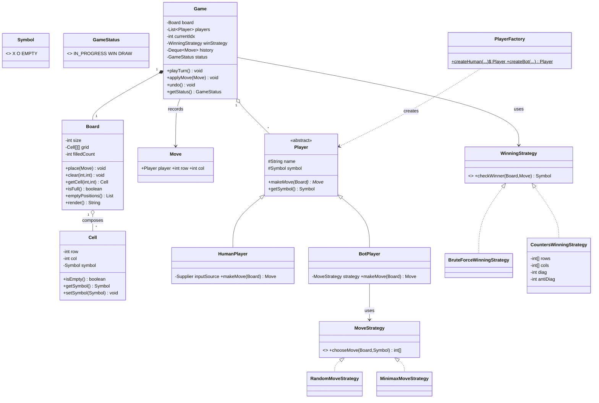

# Tic-Tac-Toe — LLD Design Doc

> Output from running `09-tic-tac-toe/PROMPT.md` (PART A + C). Companion code: `Solution.java` (PART B). The solution is a **review/revision artifact** — read it, don't compile it.

## 1. Problem statement
Design a Tic-Tac-Toe game. Two players alternately mark cells on an `N×N` board (classic is 3×3). A player wins by occupying a full row, column, or one of the two main diagonals with their symbol. If the board fills with no winner, the game is a draw. The design should generalize beyond 3×3, support human and bot players, detect wins efficiently, and be clean enough to extend (undo, more players, different win conditions) without rewrites.

## 2. Clarifying / requirements questions to ask first
Lead the round with these — never open with classes.

**Functional scope**
- **Board size:** fixed 3×3, or a general `N×N`? (Assume configurable `N`, default 3.)
- **Win condition:** full row/column/diagonal of one symbol? For general `N`, do we need `K`-in-a-row (like Gomoku/Connect-style), or always the full line? (Assume full line of length `N`; flag `K`-in-a-row as an extension.)
- **Number of players:** exactly two, or generalize to `M` players with `M` symbols? (Assume 2; design so more is cheap.)
- **Player types:** human only, or human-vs-bot / bot-vs-bot? What bot strength — random, rule-based, or optimal (minimax)? (Support a `Player` abstraction; provide a human and a bot.)
- **Symbols:** fixed `X`/`O`, or arbitrary marks? (Per-player symbol; default `X`/`O`.)
- **Moves:** do we need **undo / redo**? Move history / replay? (Treat undo as an extension that history enables.)
- **Draw detection:** declare draw when board is full with no winner, or detect "no winner possible" early? (Full-board draw for v1.)

**Non-functional / constraints**
- **Win-check performance:** is re-scanning the whole board per move acceptable, or do we want **O(1)** per-move win detection? (Show both; default to incremental counters.)
- **Concurrency:** is this a single in-process game loop, or a server hosting many concurrent games with moves arriving from threads? (Core is single-threaded; show how to make one game thread-safe.)
- **Input validation:** how to handle out-of-bounds, occupied cells, moves out of turn? (Reject with clear exceptions / result codes.)
- **Persistence / networking:** save and resume games, or purely in-memory? (In-memory v1.)

**Scope-narrowing**
- Console interaction or a GUI/API? (Design the *engine*; I/O is a thin adapter.)
- Is scoring across multiple rounds (best-of-N, leaderboards) needed? (Out of scope for v1; mention as extension.)

## 3. Finalized requirements & assumptions
Build an `N×N` Tic-Tac-Toe engine (default 3) for two players, each with a distinct symbol. Players alternate turns; a move places the current player's symbol in an empty cell. A player wins on completing any full row, column, or main/anti diagonal; the game draws when the board fills with no winner. Support **human** and **bot** players behind a common `Player` abstraction. Detect wins in **O(1) per move** using incremental row/column/diagonal counters (with a brute-force checker shown for contrast). Support **undo** via a move history. The engine is single-threaded by default; show a thread-safe variant for a multi-game server. I/O (console/GUI) is out of scope — we design the engine and demonstrate it from `main`.

## 4. Problem extensions / follow-up variations
| Extension | Design impact |
|---|---|
| **N×N generalization** | Parameterize board dimension; counters become arrays sized `N`. Already baked into v1. |
| **K-in-a-row (Gomoku-style)** | Full-line counters no longer suffice; win-check becomes a local scan around the last move in 4 directions → new `WinningStrategy` implementation, swapped via Strategy. |
| **O(1) win detection** | Maintain per-row, per-column, and two diagonal counters keyed by player; a line wins when its count hits `N`. Replaces O(N²) re-scan. |
| **Human vs bot (optimal)** | `BotPlayer` with a `MoveStrategy` — random, rule-based, or **minimax + alpha-beta**. Strategy keeps the engine ignorant of how a move is chosen. |
| **More than 2 players** | `Game` holds an ordered `List<Player>` and rotates an index; symbols and counters key by player, so nothing else changes. |
| **Undo / redo** | Push each `Move` to a history stack; undo pops, clears the cell, and **reverses the counter increments** (and any win flag). Redo replays. |
| **Early draw detection** | Track empty-cell count; optionally detect "no line can still be completed by anyone" to end early. |
| **Multi-round scoring / tournament** | A `Match`/`Scoreboard` wrapper around repeated `Game` instances. |
| **Persistence / replay** | Serialize the move history (event log); rebuild board by replaying. |

## 5. Core entities, responsibilities & relationships
- **`Symbol`** (enum: `X`, `O`, `EMPTY`) — the mark in a cell. Using an enum (not `char`) makes state explicit and extensible.
- **`Cell`** — one square: its position and current `Symbol`. Knows if it's empty.
- **`Board`** — the `N×N` grid of cells. Responsibilities: place a mark (validating bounds/occupancy), read a cell, report full/empty, render. Owns the cells (**composition**).
- **`Move`** — value object: which player, which `(row, col)`. Enables history/undo and decouples "decide a move" from "apply a move".
- **`Player`** (abstract) — has a name and `Symbol`; exposes `makeMove(Board)` returning a `Move`. Subtypes decide *how*.
  - **`HumanPlayer`** — obtains a move from input (injected supplier in the engine).
  - **`BotPlayer`** — delegates to a **`MoveStrategy`**.
- **`MoveStrategy`** (interface) — `chooseMove(Board, Symbol)`. Implementations: `RandomMoveStrategy`, `MinimaxMoveStrategy`.
- **`WinningStrategy`** (interface) — `checkWinner(Board, Move)` → optional winning symbol. Implementations: `BruteForceWinningStrategy` (O(N²) re-scan) and `CountersWinningStrategy` (O(1) incremental). Lets us swap win rules (full line vs K-in-a-row).
- **`GameStatus`** (enum: `IN_PROGRESS`, `WIN`, `DRAW`).
- **`Game`** — the orchestrator/engine. Holds the board, ordered players, current-turn index, chosen `WinningStrategy`, move history, and status. Drives the turn loop, applies moves, asks the strategy for a winner, detects draws, and supports `undo`.

Relationships: `Game` **composes** one `Board`; `Game` **aggregates** `Player`s and **uses** a `WinningStrategy`; `Board` **composes** `Cell`s; `BotPlayer` **uses** a `MoveStrategy`; `Move` is a value object passed between them.

## 6. Design patterns applied
- **Strategy — win detection (`WinningStrategy`).** *Where:* the rule that decides a winner. *Why:* full-line vs K-in-a-row vs custom rules vary independently of the engine; OCP lets us add a rule without touching `Game`. *Rejected alternative:* hard-coding win checks inside `Game` — simplest for a one-off 3×3, but every new rule edits the engine and risks regressions. *When not to:* if the rules are truly fixed forever, the indirection is overkill.
- **Strategy — bot move selection (`MoveStrategy`).** *Where:* how a `BotPlayer` picks its move. *Why:* random / rule-based / minimax are interchangeable; the engine and the player stay ignorant of the algorithm (SRP + OCP). *Rejected alternative:* `if (difficulty == HARD) minimax() else random()` branching inside `BotPlayer` — bloats the class and violates OCP. *When not to:* if only one trivial bot will ever exist.
- **State (lightweight) — `GameStatus`.** *Where:* `Game` transitions `IN_PROGRESS → WIN/DRAW`; moves are rejected once terminal. *Why:* makes legal transitions explicit and guards against moves after game-over. *Rejected alternative:* a full GoF State pattern with a class per state — overkill here because behavior per state is thin; an enum + guards is clearer. *When not to:* don't introduce State classes for two trivial states (would be pattern-stuffing).
- **Factory Method — `PlayerFactory`.** *Where:* constructing human vs bot players (and wiring the bot's strategy). *Why:* centralizes creation and keeps callers from knowing concrete classes (DIP). *Rejected alternative:* `new HumanPlayer(...)` / `new BotPlayer(...)` scattered at call sites — fine for a tiny demo but couples callers to concretions. *When not to:* if there's only ever one player type.
- **Value Object — `Move`.** Immutable record of an intended action; enables history, undo, and replay, and decouples "decide" from "apply".
- **(Optional) Decorator / wrapper — thread-safety.** A synchronized `Game` wrapper adds locking for a multi-game server without changing the core engine.

**SOLID in play:** **SRP** — `Board` stores grid state, `WinningStrategy` decides wins, `Player` decides moves, `Game` orchestrates. **OCP** — new win rules, bots, or player types plug in via Strategy/Factory without editing `Game`. **LSP** — any `Player`/`WinningStrategy`/`MoveStrategy` is substitutable. **ISP** — small focused interfaces (`makeMove`, `checkWinner`, `chooseMove`). **DIP** — `Game` depends on the `WinningStrategy` and `Player` abstractions, not concretes (injected in the constructor).

## 7. Class diagram



**Text UML (relationships & key APIs)**
- `Game ──*── Board` (composition: board lives and dies with the game)
- `Game ──o── Player[]` (aggregation: players can exist outside one game)
- `Game ──▷ WinningStrategy` (dependency, injected)
- `Board ──*── Cell[][]` (composition)
- `BotPlayer ──▷ MoveStrategy` (dependency)
- `HumanPlayer`, `BotPlayer ──▷ Player` (inheritance)

Key signatures: `Board.place(Move)`, `Board.clear(int,int)`, `Board.isFull()`, `Board.emptyPositions()`; `Player.makeMove(Board) → Move`; `MoveStrategy.chooseMove(Board, Symbol) → int[]`; `WinningStrategy.checkWinner(Board, Move) → Symbol|null`; `Game.playTurn()`, `Game.applyMove(Move)`, `Game.undo()`, `Game.getStatus()`.

## 8. Key flows

**Turn loop (per move)**
1. `Game` reads the current player from `players[currentIdx]`.
2. Player produces a `Move` via `makeMove(board)` (human: from input; bot: via its `MoveStrategy`).
3. `Game.applyMove` validates the move (in bounds, cell empty, game in progress) and calls `board.place(move)`.
4. `winStrategy.checkWinner(board, move)` is consulted — for the counters strategy this updates the affected row/col/diagonal counts and reports a win if any reached `N`.
5. If a winner → status `WIN`. Else if `board.isFull()` → status `DRAW`. Else advance `currentIdx` to the next player and push the move to history.

```mermaid
sequenceDiagram
    participant G as Game
    participant P as Player(current)
    participant B as Board
    participant W as WinningStrategy
    G->>P: makeMove(board)
    P-->>G: Move(row,col)
    G->>B: place(move)  %% validates bounds/occupancy
    G->>W: checkWinner(board, move)
    W-->>G: winner? (Symbol or null)
    alt winner present
        G->>G: status = WIN
    else board full
        G->>G: status = DRAW
    else
        G->>G: currentIdx = next; history.push(move)
    end
```

**Undo flow:** pop the last `Move` from history → `board.clear(row, col)` → if using counters, decrement the affected row/col/diagonal counts → reset status to `IN_PROGRESS` and step `currentIdx` back to the player who made that move.

## 9. Concurrency, edge cases & extensibility
**Concurrency.** A single game's turn loop is inherently sequential, so the core engine is intentionally **not** synchronized — adding locks everywhere would be needless contention. For a **server hosting many games**, each `Game` is independent state; route all moves for one game through a single owning thread (actor-style) or wrap that `Game`'s `applyMove`/`undo`/`getStatus` in a per-game lock (the optional synchronized wrapper). Never share one `Board` across threads without that guard, since `place` mutates `filledCount` and the counters — classic read-modify-write races.

**Edge cases.** Move out of bounds → reject (`IllegalArgumentException`/result code). Cell already occupied → reject, re-prompt the player. Move after game over (`WIN`/`DRAW`) → reject. Move out of turn → the engine, not the player, decides whose turn it is, so this can't happen through `playTurn`. Full board with no winner → `DRAW`. Undo with empty history → no-op. `N×N` with `N=1` → first move wins (degenerate but consistent). Bot with no empty cells → guarded by the draw check before it's asked to move.

**Extensibility.** The extensions in §4 land cleanly: K-in-a-row is a new `WinningStrategy`; smarter bots are new `MoveStrategy`s; more players is a longer `players` list with per-player counters; undo is already supported via history + counter reversal. The engine code (`Game`) does not change for any of these — that's the payoff of injecting the strategies (OCP/DIP).

## 10. Likely interview questions
1. **How do you check for a win in O(1) per move?** Keep per-row, per-column, and two diagonal counters per player. On a move at `(r,c)` by symbol `s`, increment `rows[r]`, `cols[c]`, `diag` if `r==c`, `antiDiag` if `r+c==N-1`; that line wins when its count reaches `N`. No board re-scan. *Follow-ups:* How does undo interact? (Decrement the same counters.) Multiple players? (Counters key by player, or store the line's "owner" symbol and reset on conflict.) K-in-a-row? (Counters break — switch to a local directional scan strategy.)
2. **Why a `WinningStrategy` interface instead of a method on `Board` or `Game`?** SRP and OCP: win rules vary (full line, K-in-a-row, custom) independently of grid storage and orchestration; the interface lets us add rules without editing `Game`. *Follow-up:* When is that over-engineering? (A locked-down 3×3-only game — then inline it.)
3. **How would you add an unbeatable bot?** A `MinimaxMoveStrategy` implementing `MoveStrategy`, scoring terminal boards (+win/−loss/0 draw), recursing over empty cells, with **alpha-beta pruning** to cut the search. The engine and `BotPlayer` are unchanged. *Follow-up:* Cost on large `N`? (Exponential — minimax is practical only for small boards; use heuristics/limited depth for big ones.)
4. **Why is `Move` a separate object?** It decouples *deciding* a move (player/strategy) from *applying* it (engine), and gives us a unit to store in history for undo/replay. *Follow-up:* Make it immutable? (Yes — value object; prevents accidental mutation in history.)
5. **How do you generalize from 3×3 to N×N?** Parameterize `size`; counters become arrays of length `N`; win threshold is `N`. The rest is size-agnostic. *Follow-up:* Memory? (O(N²) board + O(N) counters — fine.)
6. **Why an enum for `Symbol` rather than `char`?** Type safety, an explicit `EMPTY` state, easy iteration, and room to extend to more players' marks without magic characters. *Follow-up:* More than two players? (Add enum values or make symbols per-player data.)
7. **Where is the State pattern, and why not a full one?** `GameStatus` plus guards model the lifecycle; behavior per state is thin (only "can a move be applied?"), so an enum is clearer than a class-per-state. Introducing State classes here would be pattern-stuffing. *Follow-up:* When would full State pay off? (Rich, divergent per-state behavior — e.g., a multi-phase game with setup/play/scoring phases.)
8. **How do you support undo?** Push each applied `Move` to a stack; undo pops it, clears the cell, reverses counter increments, resets status to `IN_PROGRESS`, and steps the turn index back. *Follow-up:* Redo? (Keep a redo stack; pushing a fresh move clears it.)
9. **(Senior signal) Walk through SOLID in this design.** SRP across Board/Strategy/Player/Game; OCP via Strategy + Factory; LSP for substitutable players/strategies; ISP via tiny interfaces; DIP because `Game` depends on `WinningStrategy`/`Player` abstractions injected at construction. *Follow-up:* Which principle would you relax for a 30-minute machine-coding round? (Maybe skip the Factory and inject directly — but keep the Strategy seams.)
10. **(Senior signal) How would this scale to a server running thousands of concurrent games?** Each `Game` is isolated state; shard games across workers, pin each game to a single thread or per-game lock to avoid board races, keep the engine pure and stateless beyond the `Game` instance, and persist via the move-event log for resume/replay. *Follow-up:* Hot path? (Win check is O(1) with counters, so the bottleneck is I/O/networking, not game logic.)

---

## PART C — Cheat-sheet & self-test

**Patterns & key decisions (recap)**
- **Strategy ×2** — `WinningStrategy` (full-line counters vs brute force vs K-in-a-row) and `MoveStrategy` (random vs minimax). Both keep `Game` closed for modification.
- **Factory Method** — `PlayerFactory` centralizes human/bot creation and bot-strategy wiring.
- **State (lite)** — `GameStatus` enum + guards model the lifecycle without class-per-state overhead.
- **Value Object** — immutable `Move` enables history, undo, replay.
- **Composition** — `Game *— Board *— Cell`; strategies and players are injected (DIP).
- **O(1) win check** — per-row/col/diagonal counters updated incrementally; reverse them on undo.
- **Concurrency stance** — single game is sequential (no locks); many games → per-game lock or single-owner thread.

**5 self-test questions (no answers)**
1. Implement `CountersWinningStrategy` for `N×N` and show exactly which counters change for a move at `(r, c)` — and how undo reverses them.
2. The interviewer switches the rules to "first to get **K** in a row on an `N×N` board wins." Which class do you add, which do you leave untouched, and why do the full-line counters no longer work?
3. Sketch `MinimaxMoveStrategy.chooseMove` with alpha-beta pruning; what is its complexity on a 3×3 board, and why does it stop being viable as `N` grows?
4. Generalize the engine to `M` players. What changes in `Board`, the counters, and `Game`'s turn rotation — and what stays the same?
5. You must host 10,000 concurrent games on a thread pool. Describe your threading/locking model and explain precisely which shared mutable fields would race without it.
