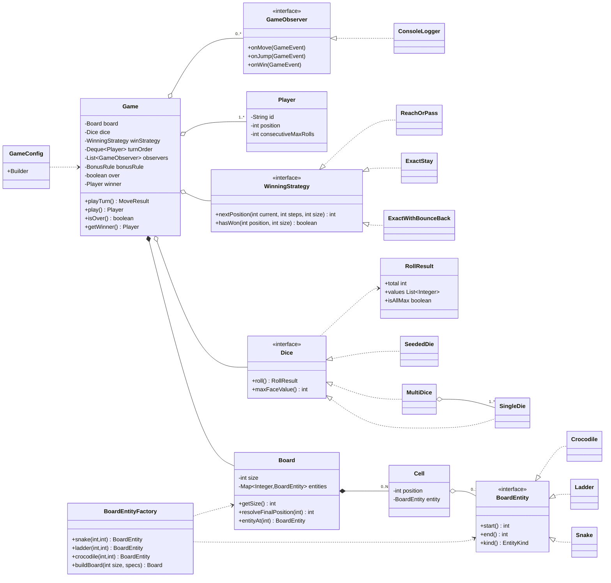
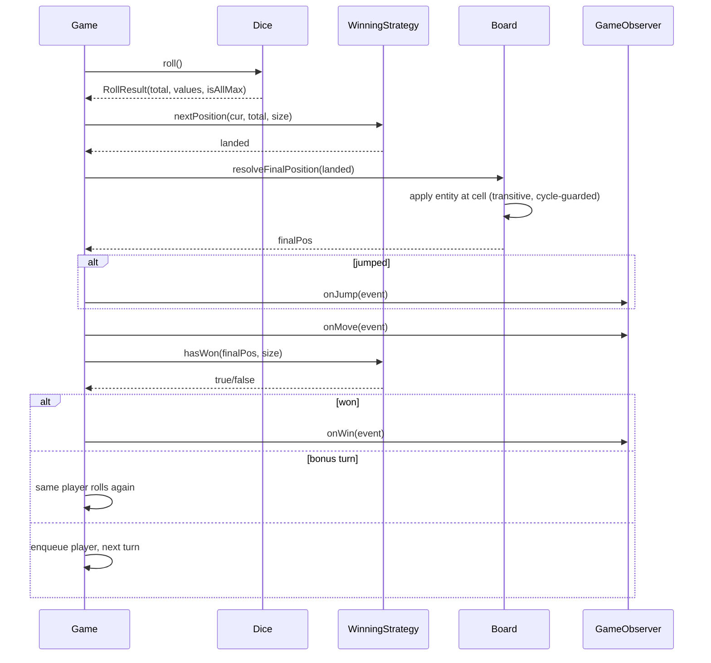

# LLD: Snake and Ladder — Design Document

> Audience: senior Java engineer revising for an LLD / machine-coding round. This is both a design reference and a last-minute revision artifact. Companion file: `Solution.java` (single-file, read-and-revise).

---

## PART A — Design Document

### 1. Problem statement

Design the game of **Snake and Ladder** (a.k.a. *Chutes and Ladders*).

The game is played on a board of numbered cells (classically 100 cells, a 10×10 grid laid out in boustrophedon / serpentine order). Two or more players each start off the board (position 0). On their turn, a player rolls one or more dice and advances by the rolled total. Some cells host the **mouth of a snake** (landing there slides the player *down* to the snake's tail) or the **bottom of a ladder** (landing there lifts the player *up* to the ladder's top). The first player to reach exactly the final cell wins.

Our job is to model the entities (Board, Cell, Snake, Ladder, Dice, Player, Game), encode the turn/movement rules cleanly, and make the design *configurable and extensible* so the common interviewer follow-ups (multiple dice, variable board size, special cells like crocodiles/mines, exact-finish vs overshoot, custom win conditions) drop in with minimal change.

> **Boustrophedon / serpentine layout** — the numbering snakes back and forth: row 1 goes left→right (1–10), row 2 right→left (11–20), and so on. It only matters if we render a grid; the movement logic treats the board as a 1-D track of positions `0..N`, so we keep that decoupling.

---

### 2. Clarifying / requirements questions to ask first

Lead with these in the room *before* writing a class. They split into functional, non-functional, and scope.

**Functional**
1. **Board size** — fixed 100 cells, or configurable `N`? Square grid only, or arbitrary length?
2. **Players** — how many? Min 2? Is there an upper bound? Fixed turn order, or randomized at start?
3. **Dice** — one die or multiple? Always 6-faced? Do we need *deterministic* dice for testing (seeded)?
4. **Snakes & ladders** — provided up front (config) or generated randomly? Can a snake's head equal a ladder's bottom on the same cell (collision)? Can chains exist (ladder top is another ladder's bottom)?
5. **Win condition** — must land *exactly* on the last cell, or does reaching/passing it win? If exact-finish, what happens on overshoot — stay put, or bounce back?
6. **Bonus roll on a six** — does rolling the max value grant an extra turn? Cap on consecutive sixes (e.g., three sixes forfeits the turn)?
7. **Start position** — do players start on cell 1, or off-board at position 0 and need a roll to enter?
8. **Snake-on-finish / consecutive jumps** — if a ladder lands you on a snake head, do you slide again (resolve transitively)?

**Non-functional**
9. **Concurrency** — is this a single-process turn-based simulation (single thread), or a server where multiple games run concurrently and players send moves from different threads?
10. **Extensibility** — which variants must we anticipate (crocodiles, mines, teleports, configurable rules)? This shapes how much indirection we invest in now.
11. **Observability** — do we need a move log / event stream (for replay, UI, analytics)?
12. **Testability/determinism** — must dice be injectable so games are reproducible?

**Scope-narrowing (what's in / out)**
13. Out of scope: networking, persistence, UI rendering, matchmaking, AI opponents — unless asked. We model the **engine**.
14. In scope: rules engine, board entities, turn loop, win detection, clean extension points.

> Stating the cut line ("I'll build the engine; UI/persistence are out unless you want them") is a senior signal — it shows you scope before you code.

---

### 3. Finalized requirements & assumptions

For a crisp, complete build I'll commit to these (each maps to a question above; all are easy to flex):

- **Board**: configurable size `N` (default 100). Internally a 1-D track of positions `0..N`. Players start at **position 0** (off board); reaching **position N** wins.
- **Players**: 2..M, fixed turn order in the sequence they were added (round-robin).
- **Dice**: pluggable. Default = one standard 6-faced die. Support `k` dice via a strategy. Dice are injectable for determinism (seeded RNG).
- **Snakes & Ladders**: provided via config (factory builds them with validation). A **Snake** goes from a higher cell to a lower cell; a **Ladder** from lower to higher. No two jump-entities may share the same start cell (validated).
- **Special cells (extension-ready)**: snakes and ladders are just two kinds of a general **Jump / BoardEntity** concept, so crocodiles, mines, teleports slot in without touching the engine.
- **Win condition**: pluggable strategy. Default = **exact finish with bounce-back** on overshoot (land beyond `N` → reflect back). Alternative bundled: "reach-or-pass wins."
- **Bonus roll**: configurable rule — rolling the max face grants an extra turn (default ON), with the classic *three-consecutive-max forfeits the turn* guard.
- **Jump resolution**: transitive — after a jump, re-check the destination for another entity (with cycle protection) so chains resolve. Default depth is bounded to avoid infinite loops on misconfigured boards.
- **Concurrency**: core engine is single-threaded turn loop (the natural model). I'll note exactly what to add for a multi-game server and make the engine *safe to drive from one thread per game*.
- **Observability**: an **Observer** event hook (move made, jump taken, player won) — optional, on by default with a console logger.

---

### 4. Problem extensions / follow-up variations

This is where senior candidates earn their stripes. For each: the ask, and the design impact.

| # | Extension | Design impact | Cost |
|---|-----------|---------------|------|
| 1 | **Multiple dice** | `Dice` becomes a *strategy* that returns a total + per-die values; engine just consumes the total. `MultiDice` composes N `SingleDie`s. | Trivial — no engine change. |
| 2 | **Variable board size / non-square** | Board already a 1-D track parametrized by `N`. Grid rendering (if any) is a separate concern. | Trivial. |
| 3 | **Special cells (crocodile, mine, teleport, mystery)** | All are `BoardEntity` implementations of `transform(position) -> newPosition` (or with side effects). Engine loops over "entity at cell" generically. | Low — add a class, register it. |
| 4 | **Exact-finish vs overshoot vs bounce-back** | `WinningStrategy` / move-resolution is a strategy. Three bundled: pass-wins, exact-stay, exact-bounce. | Low — swap a strategy. |
| 5 | **Bonus roll on six / consecutive-six forfeit** | A `TurnRule` / configurable flag inside the turn loop tracking consecutive max rolls. | Low — localized to turn loop. |
| 6 | **Multiple players & turn order** | `Queue<Player>` round-robin; add/remove players, randomize order at start. | Already built in. |
| 7 | **Different dice per game / loaded dice / seeded** | Inject any `Dice` implementation; `SeededDie(long seed)` for tests. | Trivial (DIP). |
| 8 | **Move log / replay / undo** | Observer captures an event stream → persisted/replayed. Undo needs Command (each move a reversible command). | Medium — Observer easy; undo needs Command. |
| 9 | **Concurrent games on a server** | Each `Game` is independent state; run one per thread/actor. Shared registries (config) made immutable. | Medium — see §9. |
| 10 | **Power-ups / skip-turn / freeze a player** | Player carries status flags; turn loop consults them. Or model as transient `BoardEntity` effects. | Low–medium. |
| 11 | **Configurable rules bundle** | A `GameConfig` (Builder) aggregates board, dice, win strategy, bonus rule, entities. | Already the entry point. |

The recurring theme: **everything variable is a strategy or a config**, and **everything on the board is a `BoardEntity`**. The engine loop stays tiny and stable (Open/Closed).

---

### 5. Core entities, responsibilities & relationships

| Entity | Responsibility | Knows about |
|--------|----------------|-------------|
| `Cell` | A position on the board; may hold one `BoardEntity`. | optional `BoardEntity` |
| `BoardEntity` (interface) | Given a landing position, compute the resulting position (and emit an event kind). Snakes/Ladders/Crocodiles implement it. | nothing (pure transform) |
| `Snake` / `Ladder` / `Crocodile` | Concrete jump entities; validate direction in ctor. | start, end |
| `Board` | Owns the cells `0..N`; resolves the final position after applying entity at a cell (transitively, with cycle guard). | `Cell[]`, `BoardEntity` map |
| `Dice` (interface) | `roll()` → `RollResult` (total + per-die). | RNG |
| `SingleDie`, `MultiDice`, `SeededDie` | Concrete dice strategies. | faces, count, RNG |
| `Player` | Identity + current position + transient status (e.g., consecutive sixes). | position |
| `WinningStrategy` (interface) | Given current pos + roll + board size, decide the *new candidate position* and whether it wins (handles overshoot policy). | board size |
| `MoveResult` / `GameEvent` | Value objects describing what happened (for observers/logging). | — |
| `GameObserver` (interface) | React to events (log, UI, analytics). | — |
| `Game` | The engine: turn loop, applies dice → winning strategy → board resolution, fires events, detects winner. | board, dice, players, strategy, observers, config |
| `BoardEntityFactory` | Build & validate snakes/ladders/specials from config; enforce no-collision, valid direction. | — |
| `GameConfig` (Builder) | Immutable bundle of all knobs; one place to assemble a game. | all of the above |

**Relationships (plain English):**
- `Board` **composes** `Cell`s (cells don't outlive the board).
- `Cell` **holds** at most one `BoardEntity` (association, optional).
- `Snake`, `Ladder`, `Crocodile` **implement** `BoardEntity` (inheritance/realization).
- `Game` **has-a** `Board`, `Dice`, `WinningStrategy`, list of `Player`, list of `GameObserver` (composition/aggregation via config).
- `SingleDie`/`MultiDice`/`SeededDie` **implement** `Dice`; `MultiDice` **composes** `SingleDie`s.
- `BoardEntityFactory` **creates** `BoardEntity`s.

---

### 6. Design patterns applied

For each: where, why, the rejected alternative, and when *not* to use it. (No pattern-stuffing — each earns its place.)

#### 6.1 Strategy — Dice
- **Where:** `Dice` interface with `SingleDie`, `MultiDice`, `SeededDie`.
- **Why:** dice behavior varies (one die, k dice, loaded, deterministic-for-test) but the engine only needs a total. Strategy isolates the variation and supports **DIP** (engine depends on the `Dice` abstraction) and **OCP** (new dice without touching the engine).
- **Rejected:** an `enum DiceType` + `switch` in the game. Rejected because every new dice type edits the engine (violates OCP) and can't carry per-implementation state (seed, count) cleanly.
- **When not:** if dice were truly fixed forever (always one 6-die), a plain method would do — strategy would be over-engineering.

#### 6.2 Strategy — Winning / overshoot policy
- **Where:** `WinningStrategy` with `ExactWithBounceBack`, `ExactStay`, `ReachOrPass`.
- **Why:** the end-of-board rule is the single most commonly *changed* rule in follow-ups. Encapsulating it makes the swap a one-liner and keeps the engine ignorant of the policy.
- **Rejected:** boolean flags (`boolean exactFinish, boolean bounce`) threaded through the engine. Rejected — flag combinations explode and read poorly; a strategy names each policy.
- **When not:** for a fixed ruleset with no variant requirement.

#### 6.3 Factory — Board entities
- **Where:** `BoardEntityFactory.snake(...)`, `.ladder(...)`, `.crocodile(...)`, and bulk build from config with validation.
- **Why:** centralizes **construction + validation** (snake must go down, ladder up, no two entities on the same start cell). Callers don't repeat invariant checks; invalid boards fail fast at build time. Supports OCP — adding a "crocodile" is a new factory method, not scattered `new`s.
- **Rejected:** scattering `new Snake(...)` across setup code. Rejected — validation gets duplicated or forgotten, and the no-collision invariant can't be enforced in one place.
- **When not:** if entities had no invariants and no family, direct `new` would be simpler.

#### 6.4 Observer — Game events
- **Where:** `GameObserver` (`onMove`, `onJump`, `onWin`); `ConsoleLogger` default.
- **Why:** decouples the engine from *reactions* (logging, UI, analytics, replay). Add/remove observers freely (OCP); engine doesn't know who's listening.
- **Rejected:** `System.out.println` sprinkled in the engine. Rejected — couples engine to a sink, untestable, no multi-listener.
- **When not:** if there's exactly one fixed sink and no chance of more — though even then, one observer is cheap insurance.

#### 6.5 Builder — GameConfig / Game assembly
- **Where:** `GameConfig.Builder` (board size, dice, win strategy, bonus rule, entities, players, observers).
- **Why:** many optional knobs with sane defaults; a telescoping constructor would be unreadable. Builder yields an **immutable** config (good for concurrency) and a fluent, self-documenting setup.
- **Rejected:** telescoping constructors / setters-on-a-mutable-Game. Rejected — order-dependent, error-prone, and mutable shared state hurts thread-safety.
- **When not:** with 1–2 params, a constructor is plainly better.

#### 6.6 (Composite-ish) Board-entity transform chaining
- **Where:** `Board.resolveFinalPosition` applies the entity at the landing cell, then re-checks the destination (bounded, cycle-guarded).
- **Why:** lets ladder→snake→ladder chains resolve uniformly without special-casing each combination.
- **Rejected:** hard-coding "apply at most one jump." Rejected if chains are allowed; kept simple (single jump) if the interviewer says chains are disallowed — a one-flag change.

**SOLID scorecard**
- **S (SRP):** Board resolves positions; Dice rolls; Strategy decides win; Factory builds/validates; Game orchestrates; Observer reacts. Each has one reason to change.
- **O (OCP):** new dice / win policy / board entity / observer = new class, no engine edit.
- **L (LSP):** any `Dice`, `WinningStrategy`, `BoardEntity` substitutes for its interface without surprising the engine (contracts: dice returns ≥1 total; entity returns a valid position).
- **I (ISP):** small focused interfaces (`Dice`, `WinningStrategy`, `BoardEntity`, `GameObserver`) — no fat "do-everything" interface.
- **D (DIP):** `Game` depends on abstractions (`Dice`, `WinningStrategy`, `GameObserver`, `BoardEntity`), injected via `GameConfig`.

---

### 7. Class diagram



**Text UML (quick recall):**
```
Game ──*── Board ──*── Cell ──0..1── BoardEntity {Snake|Ladder|Crocodile}
Game ──o── Dice {SingleDie|MultiDice|SeededDie} ──> RollResult
Game ──o── WinningStrategy {ExactWithBounceBack|ExactStay|ReachOrPass}
Game ──o── Player[1..*]   Game ──o── GameObserver[*] {ConsoleLogger}
BoardEntityFactory ──> builds/validates BoardEntity & Board
GameConfig.Builder ──> assembles Game (immutable config)
```

**Key public APIs / signatures:**
```java
interface Dice            { RollResult roll(); int maxFaceValue(); }
interface BoardEntity     { int start(); int end(); EntityKind kind(); }
interface WinningStrategy { int nextPosition(int current, int steps, int size); boolean hasWon(int pos, int size); }
interface GameObserver    { void onMove(GameEvent e); void onJump(GameEvent e); void onWin(GameEvent e); }

class Board { int getSize(); int resolveFinalPosition(int landed); BoardEntity entityAt(int pos); }
class Game  { MoveResult playTurn(); Player play(); boolean isOver(); Player getWinner(); }
```

---

### 8. Key flows

**Single turn (textual):**
1. `Game.playTurn()` dequeues the next `Player`.
2. Roll: `RollResult r = dice.roll()`.
3. Candidate: `int landed = winStrategy.nextPosition(player.position, r.total, board.size)` — this applies the overshoot policy (bounce-back / stay / pass).
4. Board resolution: `int finalPos = board.resolveFinalPosition(landed)` — applies any snake/ladder/special at `landed`, transitively with a cycle guard. Fire `onJump` if it moved.
5. Update player position; fire `onMove`.
6. Win check: `if (winStrategy.hasWon(finalPos, board.size))` → mark winner, fire `onWin`, stop.
7. Bonus: if `bonusRule.grantsExtraTurn(r)` and not at three-consecutive-max forfeit → same player goes again; else re-enqueue player at the back.

**Sequence diagram:**


---

### 9. Concurrency, edge cases & extensibility

**Concurrency / thread-safety**
- The natural model is a **single-threaded turn loop per game** — turns are inherently sequential, so no locking is needed inside one `Game`. This is the right default; don't synchronize what is never shared.
- **Server with many concurrent games:** each `Game` owns independent mutable state (`Player` positions, turn queue). Run **one game per thread/actor**, never share a `Game` across threads. Make shared, read-only data — `Board`, entity map, `GameConfig` — **immutable** (final fields, unmodifiable maps) so they're safe to share across games without locks.
- **If a single game must accept concurrent move submissions** (e.g., players on different connections): serialize turns through a single-threaded executor or a per-game lock, and validate "is it your turn?" — the engine stays simple while a thin queue enforces ordering. Avoid fine-grained locks on player state; the turn is the unit of atomicity.
- **RNG:** `java.util.Random` isn't thread-safe; per-game dice instances (not shared) sidestep it. `SeededDie` gives reproducible games for tests.

**Edge cases**
- **Overshoot at the end:** governed by `WinningStrategy`. Bounce-back reflects `size - (landed - size)`; stay keeps the player; pass wins.
- **Snake on the start/last cell:** factory rejects an entity whose start is `0` or `size` (no jump on terminal cells).
- **Entity collision:** two entities sharing a start cell → factory throws at build time (fail fast).
- **Chains / cycles:** transitive resolution is bounded (depth cap) and tracks visited cells to break a misconfigured cycle (e.g., ladder up → snake down → same ladder).
- **Single player / zero players:** require ≥2 (or ≥1 if "solo speedrun" allowed) — validated in builder.
- **All-sixes loop / griefing:** the *three consecutive max rolls forfeits* rule prevents an infinite bonus chain.
- **Ladder bottom = snake head conflict:** disallowed by collision validation; if allowed by rules, transitive resolution defines the outcome deterministically.
- **Player already past finish (impossible with bounce/exact):** asserted invariant — position always in `[0, size]`.

**Extensibility recap (how §4 lands):**
- New dice → implement `Dice`. New end-rule → implement `WinningStrategy`. New cell type → implement `BoardEntity` + register via factory. New reaction → implement `GameObserver`. New ruleset → assemble a different `GameConfig`. **The `Game` engine code does not change** for any of these — that's OCP paying off.

---

### 10. Likely interview questions

1. **Why is the board a 1-D track of `0..N` and not a 2-D grid?**
   Movement is linear; the serpentine grid is purely a *rendering* concern. Decoupling keeps the engine independent of board shape and makes "variable size" free. Convert to (row, col) only when drawing.

2. **Why Strategy for dice and win condition rather than flags?**
   They're the two most-varied rules in follow-ups. Strategies name each policy, isolate change (OCP), and let me inject deterministic dice for tests (DIP). Flags would multiply combinatorially and leak policy into the engine.

3. **Where does validation live and why?**
   In `BoardEntityFactory` at build time: snake goes down, ladder goes up, no two entities share a start cell, no entity on terminal cells. Centralized validation = fail fast and one source of truth (SRP). *Probe: where would you validate board size or player count?* In the `GameConfig.Builder`.

4. **How do you handle landing exactly on vs overshooting the final cell?**
   `WinningStrategy`. Default `ExactWithBounceBack` reflects the overshoot; `ExactStay` keeps you; `ReachOrPass` wins on reach-or-exceed. One-line swap. *Probe: bounce-back math?* `newPos = size - (landed - size)`.

5. **How would you add crocodiles / mines / teleports?**
   They're `BoardEntity`s with their own `transform`. Register via the factory; the engine loops over "entity at cell" generically — zero engine change. That generality is why snakes and ladders are modeled as one concept, not two special cases. *(senior signal — OCP/abstraction)*

6. **A ladder lands you on a snake head — what happens?**
   Configurable. Default transitive resolution re-checks the destination (cycle-guarded), so chains resolve deterministically. If the interviewer disallows chains, flip one flag to apply at most one jump. *(senior signal — anticipating ambiguity)*

7. **Make it thread-safe for a server running many games.**
   One `Game` per thread/actor (turns are sequential — no intra-game locking). Share only **immutable** data (`Board`, config). For concurrent move submissions to one game, serialize through a single-threaded executor and validate turn ownership. Don't over-synchronize. *(senior signal — knowing when NOT to lock)*

8. **How do you make games reproducible for testing?**
   Inject `SeededDie(seed)` via the config (DIP). Same seed + same config ⇒ identical game. Observers capture an event stream you can assert on.

9. **Why Observer instead of logging inline?**
   Decouples the engine from reactions; supports multiple sinks (log, UI, analytics, replay) and keeps the engine testable. Inline `println` couples and can't be turned off or multiplied.

10. **How would you support undo / replay?**
    Replay: persist the Observer event stream and re-apply. Undo: model each move as a **Command** with `execute`/`undo` capturing prior position and any jump — then maintain a command stack. This is the one place I'd add Command, only if undo is required (don't add it speculatively).

**Deep-probe follow-ups bundled above:** validation placement (Q3), bounce-back math (Q4), chain disambiguation (Q6), when-not-to-lock (Q7).

---

## PART C — Cheat-sheet & self-test

**Patterns used & key decisions (recap):**
- **Strategy** → `Dice` (single/multi/seeded) and `WinningStrategy` (exact-bounce/exact-stay/reach-pass): isolates the two most-varied rules; enables DIP + deterministic tests.
- **Factory** → `BoardEntityFactory`: centralizes construction + invariant validation (direction, no-collision, no-terminal) → fail fast.
- **Observer** → `GameObserver`/`ConsoleLogger`: decouple engine from logging/UI/replay.
- **Builder** → `GameConfig.Builder`: many optional knobs, immutable result (concurrency-friendly), fluent setup.
- **Generalization** → snakes/ladders/specials are one `BoardEntity` concept → new cell types are OCP-clean.
- **Engine design** → board is a 1-D track `0..N`; transitive, cycle-guarded jump resolution; single-threaded turn loop; immutable shared config for multi-game servers.
- **SOLID** → SRP (one job per class), OCP (extend via new classes), LSP (substitutable abstractions), ISP (small interfaces), DIP (engine depends on abstractions, injected via config).

**5 self-test questions (no answers):**
1. Sketch from memory the four interfaces (`Dice`, `BoardEntity`, `WinningStrategy`, `GameObserver`) and one concrete class each — what is each one's single responsibility?
2. Implement the bounce-back overshoot rule and explain what `ExactStay` and `ReachOrPass` do differently for a roll that overshoots.
3. A ladder's top is another snake's head, whose tail is the first ladder's bottom. What does `Board.resolveFinalPosition` do, and what guard prevents disaster?
4. You must run 10,000 games concurrently on a server. What state do you make immutable, what do you isolate per thread, and where (if anywhere) do you lock?
5. The interviewer adds "rolling three sixes in a row forfeits your turn." Where exactly does this logic live, and which classes change?
