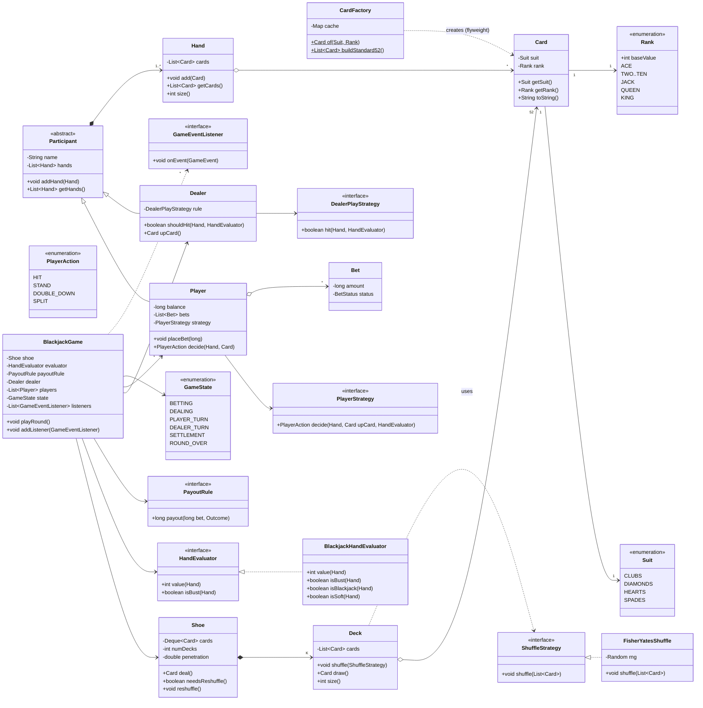
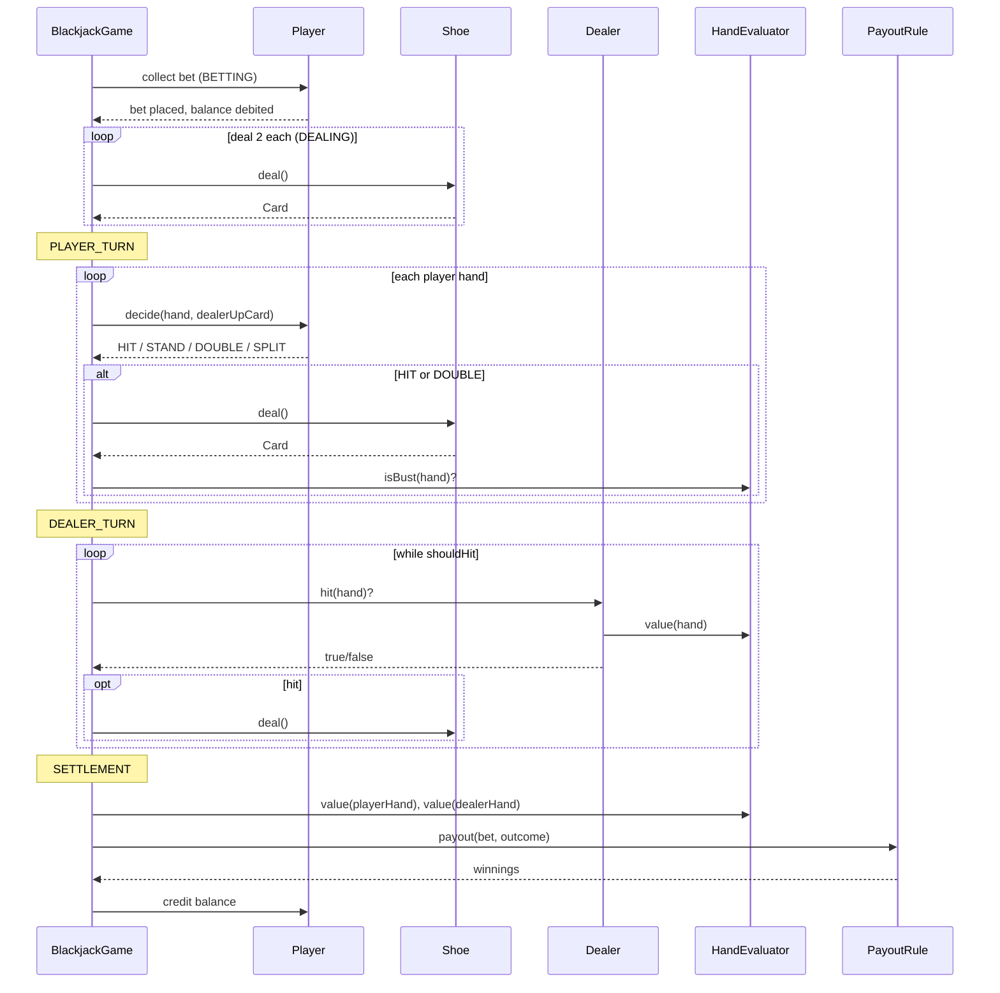

# LLD Design Document — Deck of Cards & Blackjack

> **Audience:** Senior Java engineer prepping for an LLD / machine-coding round.
> **Goal:** A reusable card-game core (`Card`, `Deck`, `Shoe`, `Hand`, `Player`, `Dealer`) on top of which **Blackjack** is implemented, with pluggable shuffling, scoring, and a clean game-round state machine. This document is PART A (design) + PART C (cheat-sheet). The companion `Solution.java` is PART B (single-file review artifact).

---

## 1. Problem statement

Design an object-oriented model for a **standard deck of 52 playing cards** and use it to implement the casino card game **Blackjack** (a.k.a. "21").

The core abstractions (card, deck, shoe, hand) must be **game-agnostic** so they can be reused for Poker, Rummy, War, etc. On top of that core we layer Blackjack-specific rules:

- A player tries to get a hand value as close to **21** as possible without exceeding it ("busting").
- **Number cards** are worth their pip value, **face cards** (J, Q, K) are worth **10**, and an **Ace** is worth **1 or 11** — whichever helps the hand most (a "soft" vs "hard" hand).
- The **dealer** plays by a fixed rule (typically "hit until 17, then stand").
- The game proceeds in **rounds**: bet → deal → player turns (hit/stand/double/split) → dealer turn → settle payouts.

We must support a **multi-deck shoe** (casinos use 4–8 decks), a swappable **shuffle algorithm**, **betting**, and advanced player actions like **double down** and **split**, while keeping the design extensible to other games.

> *Adjacent term — "LLD / OOD":* Low-Level Design / Object-Oriented Design: the class-level blueprint (entities, responsibilities, relationships, patterns) that sits below system/HLD architecture.

---

## 2. Clarifying / requirements questions to ask first

> A real round starts here. I'd ask the interviewer these **before** drawing a single class. Grouped by category.

### 2.1 Functional scope
1. **Which game(s)?** Just Blackjack, or a reusable card framework that Blackjack is one instance of? (Drives how generic the core must be.)
2. **Single table or multiple tables?** One dealer per table — how many player seats? (1 vs N players changes turn orchestration.)
3. **Player vs dealer only**, or player-vs-player pots (like Poker)? (Blackjack is player-vs-dealer; each player settles independently against the dealer.)
4. **Which Blackjack actions** must we support: Hit, Stand, Double Down, Split, Surrender, Insurance? (Each adds rules and state.)
5. **Dealer rule:** "Stand on soft 17" or "Hit on soft 17"? (A *soft 17* is 17 made with an Ace counted as 11.)
6. **Blackjack payout:** 3:2 or 6:5? Push on tie? Dealer blackjack handling?
7. **Betting model:** chips/balance per player? Min/max table limits? Or is betting out of scope?

### 2.2 Card/Deck mechanics
8. **Number of decks** in the shoe (1, 4, 6, 8)? Fixed or configurable?
9. **Shuffle:** do we need a real algorithm (Fisher-Yates), or is it a stub? Should it be swappable/seedable for testing? When does reshuffle happen (cut card / penetration)?
10. **Jokers / wild cards** in scope? (Standard Blackjack: no.)

### 2.3 Non-functional
11. **Concurrency:** single-threaded simulation, or concurrent players hitting a shared dealer/shoe over a network? (Determines thread-safety needs.)
12. **Determinism / testability:** must shuffles be reproducible (seeded RNG) for unit tests?
13. **Persistence:** in-memory only, or save/restore game state?
14. **Scale:** how many tables/games concurrently — does the deck/card model need to be memory-cheap (flyweight)?
15. **Interface:** CLI demo, library API, or full UI? (Affects whether we need an input/IO layer or just a programmatic API.)

### 2.4 Scope-narrowing (explicitly out)
16. Real-money handling, auth, networking, anti-cheat, RNG certification — assume **out of scope** unless told otherwise.

---

## 3. Finalized requirements & assumptions

For a 45–60 min machine-coding round I'll commit to a scope that is rich enough to show senior judgment but buildable:

**In scope**
- A **reusable card core**: `Suit`, `Rank` (enums), `Card`, `Deck`, `Shoe` (multi-deck), `Hand`.
- **Pluggable shuffle** via a `ShuffleStrategy` (default: seedable **Fisher-Yates**).
- **Pluggable scoring** via a `HandEvaluator` (Blackjack ace-soft/hard logic), so other games can drop in their own.
- **Blackjack game** with N players + 1 dealer, played in **rounds** governed by a **state machine**.
- Player **actions**: Hit, Stand, Double Down, Split. (Surrender/Insurance noted as extensions.)
- **Betting** with per-player balance, min/max limits, **3:2** blackjack payout, push on tie.
- **Dealer rule** configurable: stand vs hit on soft 17 (default: stand on 17, including soft 17 — easily switched).
- **Player decisions** abstracted behind a `PlayerStrategy` so we can plug a human (console), a bot, or a scripted player for the demo.

**Assumptions**
- Single table, single-threaded turn order, but the **shoe and core are written to be thread-safe-able** and I call out where locks would go.
- 6-deck shoe by default; reshuffle when penetration past a cut card threshold.
- Money is integer "chips"; no fractional currency, no real money.
- One human-equivalent decision-maker per seat; no side bets beyond the listed actions.

---

## 4. Problem extensions / follow-up variations

> This is where senior candidates earn signal. For each I note the **design impact** and how the chosen abstractions absorb it.

| # | Extension / follow-up | Design impact | How the design absorbs it |
|---|---|---|---|
| 1 | **Different shuffle algorithm** (Fisher-Yates, riffle/GSR, multiple passes, hardware RNG) | Need to swap the shuffle without touching Deck/Shoe | `ShuffleStrategy` interface — add a new impl, inject it. No core change. |
| 2 | **Multiple decks / shoe** with cut-card reshuffle | Card uniqueness assumptions break; reshuffle policy needed | `Shoe` composes K `Deck`s; tracks penetration; `needsReshuffle()` hook. |
| 3 | **Ace value logic (soft/hard)** | Scoring isn't a simple sum | `BlackjackHandEvaluator` computes best value ≤ 21, exposes `isSoft()`. Isolated in the evaluator. |
| 4 | **Dealer rule variants** (hit/stand soft 17) | Dealer's auto-play differs by casino | `DealerPlayStrategy` (or a config flag) drives dealer hits. Pluggable. |
| 5 | **Betting + bankroll + table limits** | Money lifecycle, validation, payouts | `Player.balance`, `Bet`, `PayoutRule` (3:2 vs 6:5) as a strategy. |
| 6 | **Double down** | One extra card, double stake, then forced stand | A `PlayerAction.DOUBLE_DOWN` handled in the PLAYER_TURN state. |
| 7 | **Split** | One hand becomes two; each played independently | `Hand` list per player; split creates a new `Hand`, deals one card to each. Turn loop iterates over hands. |
| 8 | **Insurance / Surrender / side bets** | New optional decision points | New `PlayerAction` enum values + state hooks; payout rules extended. |
| 9 | **Other card games (Poker, Rummy, War)** | Reuse core; different scoring & turn rules | Core (`Card/Deck/Shoe/Hand`) untouched; new `HandEvaluator` + new `Game` state machine. |
| 10 | **Concurrency / online multiplayer** | Shared shoe across threads; turn fairness | Synchronize `Shoe.deal()`; per-table lock; immutable `Card` (flyweight) is already thread-safe to share. |
| 11 | **Memory at scale (many tables)** | 52×K Card objects per table is wasteful | **Flyweight** `Card` via a `CardFactory` cache — share the 52 canonical cards across all shoes/tables. |
| 12 | **Event log / replay / spectators** | Need to observe state transitions | **Observer** pattern: `GameEventListener` notified on deal/hit/bust/settle. |

---

## 5. Core entities, responsibilities & relationships

| Entity | Responsibility (single, focused) | Key collaborators |
|---|---|---|
| `Suit` (enum) | The 4 suits (♣ ♦ ♥ ♠) | `Card` |
| `Rank` (enum) | Ranks A,2…10,J,Q,K + base pip value | `Card`, evaluator |
| `Card` | Immutable value object: suit + rank | everything; shared via flyweight |
| `CardFactory` | Vends canonical immutable `Card` instances (flyweight cache) | `Deck` |
| `Deck` | An ordered collection of 52 cards; can be shuffled | `Shoe`, `ShuffleStrategy` |
| `Shoe` | 1..K decks combined; deals cards; tracks penetration & reshuffle | `Game`, `Deck` |
| `ShuffleStrategy` (iface) | *How* to shuffle a list of cards | `Deck`/`Shoe` |
| `FisherYatesShuffle` | Default unbiased shuffle (seedable) | — |
| `Hand` | Cards held by a participant; add card; expose cards | `HandEvaluator`, `Player`, `Dealer` |
| `HandEvaluator` (iface) | Compute hand value/outcome for a game | `Hand`, `Game` |
| `BlackjackHandEvaluator` | Ace soft/hard, bust, blackjack detection | `Hand` |
| `Participant` (abstract) | Common: holds hands, name | `Player`, `Dealer` |
| `Player` | A seat: balance, bet(s), one-or-more hands, decision via strategy | `Game`, `PlayerStrategy` |
| `Dealer` | Special participant: plays by `DealerPlayStrategy`; owns nothing financial | `Game` |
| `PlayerStrategy` (iface) | Decide next action given a hand (human/bot) | `Player` |
| `DealerPlayStrategy` (iface) | Decide if dealer hits | `Dealer` |
| `PayoutRule` (iface) | Compute winnings for an outcome (3:2, 6:5) | `Game` |
| `Bet` | Stake amount + status | `Player` |
| `GameState` (enum/State) | Round phases & transitions | `Game` |
| `BlackjackGame` | Orchestrates a round; the state machine | all |
| `GameEventListener` (iface) | Observer hook for logging/UI | `BlackjackGame` |

**Relationship summary (text UML):**
- `Shoe` ◆—▶ `Deck` (composition; a shoe *owns* its decks) — `1 Shoe → K Deck`.
- `Deck`/`Shoe` ──▶ `ShuffleStrategy` (association/strategy injection).
- `Player`/`Dealer` ──▷ `Participant` (inheritance).
- `Participant` ◆—▶ `Hand` (composition; `Player` may own several hands after a split).
- `BlackjackGame` ──▶ `Shoe`, `HandEvaluator`, `PayoutRule`, `DealerPlayStrategy`, `List<Player>`, `Dealer` (associations).
- `Player` ──▶ `PlayerStrategy` (association).
- `BlackjackGame` ──▶ `*` `GameEventListener` (observer).
- `Card` created by `CardFactory` (flyweight) and shared read-only everywhere.

---

## 6. Design patterns applied

> Rule I follow: a pattern earns its place only if it removes a real, named change-axis. No pattern-stuffing.

### 6.1 Strategy — shuffling
- **Where:** `ShuffleStrategy` ← `FisherYatesShuffle` (and could add `RiffleShuffle`, `NoShuffle` for tests).
- **Why:** "How to shuffle" is a volatile, independent axis from "what a deck is." Injecting it keeps `Deck`/`Shoe` closed for modification but open for new algorithms (**OCP**).
- **Rejected alternative:** a `shuffle()` method with an `if (algo == …)` switch inside `Deck`. Rejected because every new algorithm edits `Deck` and grows a conditional — violates OCP/SRP.
- **When *not* to:** if there will only ever be one shuffle and it's trivial, a private method is fine — don't add an interface for a single forever-stable behavior.

### 6.2 Strategy — hand scoring (`HandEvaluator`)
- **Where:** `HandEvaluator` ← `BlackjackHandEvaluator`. Poker/Rummy would supply their own.
- **Why:** Scoring is *the* thing that differs per game; isolating it lets the same `Card/Hand` serve many games (reuse + OCP).
- **Rejected alternative:** put `getValue()` on `Hand`. Rejected because it hard-codes Blackjack rules into the reusable core — a `Hand` shouldn't know game rules (**SRP**).
- **When *not* to:** a one-game-only toy where `Hand` will never be reused.

### 6.3 Strategy — player & dealer decisions, and payouts
- **Where:** `PlayerStrategy` (human console / bot), `DealerPlayStrategy` (stand-17 / hit-soft-17), `PayoutRule` (3:2 / 6:5).
- **Why:** Decision-making and payout schedules vary by actor and casino. Pluggable strategies make the engine deterministic-testable (inject a scripted player/seeded RNG) — huge for unit tests.
- **Rejected alternative:** `Scanner`-based input baked into `Player`, and a hard-coded `1.5×` payout. Rejected: untestable, not configurable.
- **When *not* to:** if there's only a single fixed dealer rule and no betting, a method is enough.

### 6.4 State — game rounds (`GameState`)
- **Where:** round lifecycle `BETTING → DEALING → PLAYER_TURN → DEALER_TURN → SETTLEMENT → ROUND_OVER`.
- **Why:** Each phase allows only certain actions and has clear transitions; modeling it as explicit states prevents illegal operations (e.g., hitting during betting) and makes the flow readable.
- **Implementation choice:** I use an **enum-driven state machine inside `BlackjackGame`** (clear, compact, easy to recall in an interview). The full **GoF State pattern** (one class per state) is the alternative.
- **Rejected alternative / when not:** full State-object pattern is overkill for ~6 linear phases; reach for it only if states multiply, transitions get complex, or per-state behavior is large. I mention it as the upgrade path.

### 6.5 Factory — card creation & flyweight
- **Where:** `CardFactory.of(suit, rank)` returns cached immutable `Card`s; `Deck`/`Shoe` build from it.
- **Why:** Centralizes construction and enables the **Flyweight** optimization — only 52 `Card` objects ever exist, shared across every shoe and table. Cards are immutable so sharing is safe (**thread-safety for free**).
- **Rejected alternative:** `new Card(...)` everywhere → 52×K objects per shoe, duplicated, and no single place to enforce validity.
- **When *not* to:** if cards were mutable or carried per-instance state, flyweight wouldn't apply.

### 6.6 Observer — game events (extension hook)
- **Where:** `GameEventListener` notified on deal/hit/bust/blackjack/settle.
- **Why:** Lets UI, logging, analytics, and spectators subscribe without the engine knowing them (**DIP**, decoupling).
- **Rejected alternative:** `System.out.println` scattered in the engine — couples engine to a presentation concern.
- **When *not* to:** a pure library with no observers needed; then skip it.

### 6.7 Template Method (light) — `Participant`
- **Where:** abstract `Participant` holds shared hand bookkeeping; `Player`/`Dealer` specialize.
- **Why:** DRY for common hand operations while differing in money/decision behavior.

### SOLID scorecard
- **S**RP: `Card` (value), `Deck` (ordering), `Shoe` (dealing/penetration), `HandEvaluator` (scoring), `PayoutRule` (money) each do one thing.
- **O**CP: new shuffle/evaluator/payout/strategy = new class, no edits to existing ones.
- **L**SP: any `ShuffleStrategy`/`HandEvaluator`/`PlayerStrategy` is substitutable; `Player`/`Dealer` honor the `Participant` contract.
- **I**SP: small, focused interfaces (`ShuffleStrategy.shuffle`, `PayoutRule.payout`) — no fat interface.
- **D**IP: `BlackjackGame` depends on abstractions (strategies, evaluator, payout, listener), injected via constructor.

---

## 7. Class diagram

### 7.1 Mermaid `classDiagram`



### 7.2 Short text UML

```
Suit(enum)  Rank(enum, baseValue)
Card { Suit, Rank }                       -- immutable value object
CardFactory.of(Suit,Rank): Card           -- flyweight cache; buildStandard52()
ShuffleStrategy { shuffle(List<Card>) }   <|.. FisherYatesShuffle(seed?)
Deck { List<Card>; shuffle(strat); draw():Card; size() }
Shoe { Deque<Card>; numDecks; deal():Card; needsReshuffle(); reshuffle() }  *--> Deck
Hand { List<Card>; add(Card); getCards() }
HandEvaluator { value(Hand); isBust(Hand) } <|.. BlackjackHandEvaluator{ isBlackjack; isSoft }
Participant(abstract) { name; List<Hand> }  <|-- Player, Dealer
Player { balance; bets; PlayerStrategy; placeBet; decide() }
Dealer { DealerPlayStrategy; shouldHit(); upCard() }
PlayerStrategy { decide(Hand,upCard,eval):PlayerAction }
DealerPlayStrategy { hit(Hand,eval):boolean }
PayoutRule { payout(bet,Outcome):long }   <|.. 3:2 and 6:5 impls
PlayerAction(enum) HIT|STAND|DOUBLE_DOWN|SPLIT
GameState(enum)    BETTING→DEALING→PLAYER_TURN→DEALER_TURN→SETTLEMENT→ROUND_OVER
BlackjackGame { Shoe, HandEvaluator, PayoutRule, Dealer, List<Player>, state, listeners; playRound() }
GameEventListener { onEvent(GameEvent) }   -- observer
```

### 7.3 Key public APIs / signatures
```java
// Core
Card CardFactory.of(Suit s, Rank r);
List<Card> CardFactory.buildStandard52();
void ShuffleStrategy.shuffle(List<Card> cards);
Card Shoe.deal();           boolean Shoe.needsReshuffle();   void Shoe.reshuffle();
void Hand.add(Card c);      List<Card> Hand.getCards();

// Blackjack rules
int  BlackjackHandEvaluator.value(Hand h);   // best value <= 21 (ace soft/hard)
boolean BlackjackHandEvaluator.isBust(Hand h);
boolean BlackjackHandEvaluator.isBlackjack(Hand h);

// Decisions / money
PlayerAction PlayerStrategy.decide(Hand h, Card dealerUp, HandEvaluator e);
boolean DealerPlayStrategy.hit(Hand h, HandEvaluator e);
long PayoutRule.payout(long bet, Outcome o);

// Orchestration
void BlackjackGame.playRound();
void BlackjackGame.addListener(GameEventListener l);
```

---

## 8. Key flows

### 8.1 Round lifecycle (steps)
1. **BETTING** — each `Player` `placeBet(amount)`; validate vs balance and table min/max; debit stake.
2. **DEALING** — deal 2 cards to each player and the dealer (dealer's second card is the hidden "hole card"). Check naturals (blackjack).
3. **PLAYER_TURN** — for each player, for each of their `Hand`s: ask `PlayerStrategy.decide(...)`:
   - **HIT** → deal a card; if `isBust` → hand loses, move on.
   - **STAND** → done with this hand.
   - **DOUBLE_DOWN** → double the stake, deal exactly one card, force stand.
   - **SPLIT** → if the two cards share a rank, split into two hands, deal one card to each, play each.
4. **DEALER_TURN** — reveal hole card; while `DealerPlayStrategy.hit(...)` → deal. (Default: hit until ≥17.)
5. **SETTLEMENT** — for each player hand compare vs dealer; compute `Outcome` (PLAYER_BLACKJACK / WIN / PUSH / LOSE / BUST); credit via `PayoutRule`.
6. **ROUND_OVER** — emit events; if `shoe.needsReshuffle()` → reshuffle. Loop or stop.

### 8.2 Mermaid sequence diagram (one round)



### 8.3 Ace evaluation algorithm (the tricky bit)
```
sum = Σ baseValue(card)        // Ace counted as 1 here
aces = count(rank == ACE)
// promote one ace from 1 → 11 (add 10) while it keeps us <= 21
while (aces > 0 && sum + 10 <= 21) { sum += 10; aces--; }
return sum                      // "soft" if any ace is still counted as 11
```
This naturally yields the **best** legal value and lets `isSoft()` be derived (an ace was promoted).

---

## 9. Concurrency, edge cases & extensibility

### 9.1 Concurrency / thread-safety
- **Single-table default is single-threaded** — turns are sequential, so no locking needed in the happy path. I keep the engine simple and *call out* where to harden.
- **Shared shoe across threads (online):** `Shoe.deal()` / `reshuffle()` mutate shared state → guard with a `synchronized` method or a `ReentrantLock` so two seats can't draw the same card. The companion file makes `Shoe` synchronized to demonstrate.
- **Immutable `Card` + flyweight** are inherently thread-safe to share read-only — no synchronization needed on cards.
- **Player balance** updates should be atomic per player; if a player can act from multiple connections, guard `balance`/`bets` (e.g., `synchronized` on the player or `AtomicLong`).
- **RNG:** `java.util.Random` isn't thread-safe; per-shoe RNG or `ThreadLocalRandom`. Seedable RNG for deterministic tests.
- **State transitions:** only the game thread mutates `GameState`; if external events arrive, funnel them through a single-threaded command queue (actor style) to avoid races — mention as the scaling answer.

### 9.2 Edge cases
- **Empty/low shoe mid-deal** → `Shoe.deal()` must detect exhaustion and reshuffle (or throw a clear exception). Never silently fail.
- **Both player and dealer blackjack** → push (return stake), not a loss.
- **Player blackjack vs dealer non-blackjack** → 3:2 payout, not 1:1.
- **Multiple aces** (e.g., A-A) → algorithm promotes at most as many aces as stay ≤21 (A-A = 12, not 22).
- **Bust** → immediate loss regardless of dealer outcome (resolved at settlement, but the hand is dead).
- **Double-down with insufficient balance** → reject the action; fall back to a normal hit/stand prompt.
- **Split** legality: only when the two cards share rank; split aces often get **one card only** (a casino rule — make it a config flag). Re-splitting depth limit.
- **Bet validation** below min / above max / above balance → reject before dealing.
- **Ties on value but one is natural blackjack** → blackjack beats a 21 made from 3+ cards.

### 9.3 Extensibility recap (maps to §4)
- New shuffle / evaluator / payout / player/dealer strategy = **new class, zero edits** (OCP).
- New game (Poker) = reuse `Card/Deck/Shoe/Hand` + new `HandEvaluator` + new `Game` state machine.
- New actions (Insurance/Surrender) = extend `PlayerAction` + add a state hook + a `PayoutRule` tweak.
- New observers (UI/log/analytics) = implement `GameEventListener`, register, done.
- Many tables at scale = flyweight cards already shared; per-table game objects are cheap.

---

## 10. Likely interview questions

> 8–10 Q&A with crisp model answers, plus deep-probe follow-ups. ≥3 are senior-signal (pattern/SOLID/extension).

**Q1. How do you handle the Ace's dual value (1 or 11)?**
A: Sum all cards with aces as 1, then promote aces (+10 each) while the total stays ≤21. This finds the best legal value and tells us if the hand is "soft."
- *Probe:* What about A-A-9? → 1+1+9=11, promote one ace → 21 (soft). Promoting the second would bust, so we stop. ✔

**Q2. Why a Strategy for shuffling instead of a method on Deck?** *(senior-signal)*
A: Shuffle algorithm is an independent change-axis from "what a deck is." A `ShuffleStrategy` keeps `Deck` closed for modification but open to new algorithms (OCP), and lets me inject a seeded/`NoShuffle` strategy for deterministic tests. A method-with-switch would grow conditionals and edit `Deck` on every new algorithm.
- *Probe:* When would you *not* bother? → If there's only ever one trivial shuffle forever; then a private method is simpler.

**Q3. Where do game rules live so the core stays reusable?** *(senior-signal)*
A: In `HandEvaluator` (scoring) and the `Game` state machine, not in `Card/Deck/Hand`. The core is value/structure only. Poker just supplies a different evaluator and game class — `Card/Deck/Shoe/Hand` are untouched. That's SRP + OCP enabling reuse.
- *Probe:* Why not `hand.getValue()`? → It bakes Blackjack into a reusable type; a `Hand` shouldn't know game rules.

**Q4. Model the game rounds — how do you prevent illegal actions (hitting during betting)?**
A: A `GameState` machine (`BETTING→DEALING→PLAYER_TURN→DEALER_TURN→SETTLEMENT→ROUND_OVER`). Each phase only permits its actions and defines valid transitions; the engine rejects out-of-phase operations. Enum-driven here; upgrade to GoF State objects if states/transitions explode.
- *Probe:* When upgrade to full State pattern? → When per-state behavior is large or transitions are non-linear/numerous.

**Q5. How do you support a multi-deck shoe and reshuffling?**
A: `Shoe` composes K `Deck`s into one draw pile and tracks **penetration**; `needsReshuffle()` fires past a cut-card threshold; `reshuffle()` rebuilds and shuffles. `deal()` checks exhaustion. Number of decks is configurable.
- *Probe:* Why a cut card? → Casinos reshuffle before the shoe empties to defeat card counting and to keep play smooth.

**Q6. Make the design thread-safe for online multiplayer.**
A: `Card` is immutable + flyweight → safe to share. Guard mutable shared state: `synchronized Shoe.deal()/reshuffle()`, per-player balance atomicity, per-table RNG (or `ThreadLocalRandom`), and a single-threaded command funnel for state transitions. Default single-table sim stays lock-free.
- *Probe:* Two players draw at once — what breaks? → Without locking, both could read the same top card; synchronize `deal()`.

**Q7. How do Double Down and Split fit without rewriting the engine?**
A: They're `PlayerAction` values handled in `PLAYER_TURN`. Double = double stake + one card + forced stand. Split = create a second `Hand` (player owns `List<Hand>`), deal one card to each, play each in turn. The turn loop already iterates over a player's hands, so split slots in naturally.
- *Probe:* Splitting aces? → Often one-card-only per ace — make it a config flag (casino rule).

**Q8. Why Flyweight for cards, and is it worth it?** *(senior-signal)*
A: Cards are immutable value objects with only 52 distinct values. A `CardFactory` cache shares those 52 across every shoe/table, cutting memory at scale and giving a single construction/validation point. Immutability makes sharing thread-safe for free. For a single small game it's optional — but it's cheap and idiomatic.
- *Probe:* What breaks flyweight? → Mutable or per-instance state on `Card`; then you can't share.

**Q9. How would you make payouts configurable (3:2 vs 6:5, push rules)?**
A: A `PayoutRule` strategy injected into the game. The engine computes an `Outcome`; the rule maps `(bet, outcome) → winnings`. Swap rules per table without touching settlement logic (OCP/DIP).
- *Probe:* Insurance/surrender? → New `Outcome`/`PlayerAction` values + a rule extension; engine hooks them in their phases.

**Q10. How do you keep the simulation deterministic for tests?**
A: Inject a **seeded** RNG into `FisherYatesShuffle` and use scripted `PlayerStrategy`/`DealerPlayStrategy` implementations. The whole round becomes reproducible because every nondeterministic decision is behind an injectable strategy (DIP).
- *Probe:* Verify the shuffle is unbiased? → Fisher-Yates is provably uniform; statistical tests (chi-square on positions) over many runs confirm distribution.

---

# PART C — Cheat-sheet & self-test

### Patterns & key decisions (recap)
- **Strategy ×4:** `ShuffleStrategy` (Fisher-Yates), `HandEvaluator` (ace soft/hard scoring), `PlayerStrategy`/`DealerPlayStrategy` (decisions), `PayoutRule` (3:2/6:5) — each isolates a volatile axis (OCP/DIP) and makes tests deterministic.
- **State:** enum-driven round machine `BETTING→…→ROUND_OVER`; prevents illegal actions; upgrade path to GoF State objects.
- **Factory + Flyweight:** `CardFactory` vends and caches the 52 immutable canonical cards; cheap and thread-safe to share.
- **Observer:** `GameEventListener` decouples logging/UI/spectators from the engine.
- **Template Method (light):** abstract `Participant` shares hand bookkeeping for `Player`/`Dealer`.
- **Reusable core vs game rules:** `Card/Deck/Shoe/Hand` are game-agnostic; Blackjack lives in the evaluator + game state machine — so Poker/Rummy reuse the core.
- **SOLID:** SRP per class, OCP via strategies, LSP across all strategy impls, ISP small interfaces, DIP via constructor-injected abstractions.
- **Concurrency:** immutable cards safe to share; synchronize `Shoe.deal()`/`reshuffle()` and per-player balance for online; seedable RNG for tests.

### Self-test (no answers)
1. Trace the value of `A ♠, 6 ♥, A ♦, 3 ♣` step by step — is it soft or hard, and why?
2. Where exactly would you add **Insurance**, and which classes change (and which must *not*)?
3. A second player connects to the same table mid-round over the network — list every shared mutable field that now needs guarding and how.
4. Convert the enum-based state machine into the full GoF State pattern: what classes appear and what does `BlackjackGame` delegate?
5. You must reuse this core for **Poker**. Which classes do you keep untouched, which do you replace, and what new abstraction (if any) do you introduce?
