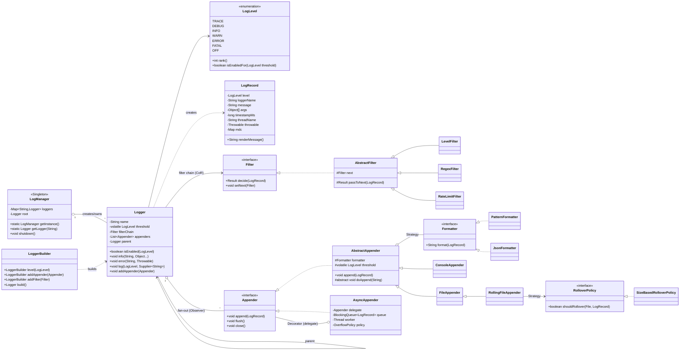
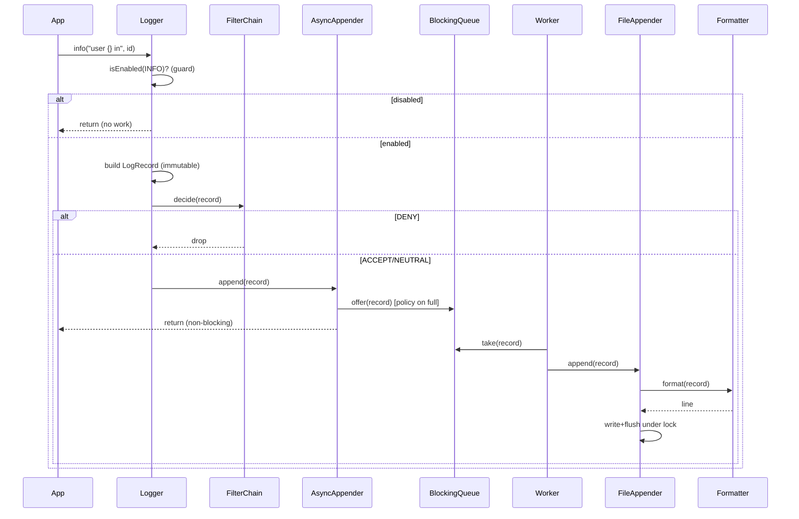

# LLD: Logging Framework

> A staff-engineer-grade low-level design + machine-coding revision artifact.
> Target reader: a senior Java engineer revising for an LLD / OOD / machine-coding round.
> Two deliverables: this design document (PART A + PART C) and `Solution.java` (PART B).

---

## PART A — Design Document

### 1. Problem statement

Design a **logging framework** — the kind of library an application links against to emit diagnostic
records (think Log4j, Logback, SLF4J, `java.util.logging`). The application code calls something like
`logger.info("user {} logged in", userId)`. The framework must:

- Accept log records tagged with a **severity level** (TRACE, DEBUG, INFO, WARN, ERROR, FATAL).
- **Filter** records so only those at or above a configured threshold (and passing custom rules) are emitted.
- **Format** each surviving record into text (plain pattern, JSON, etc.).
- **Route** each formatted record to one or more **destinations** — console, file, network, etc.
- Be **configurable** (programmatically and, conceptually, from a config file) without recompiling the app.
- Be **thread-safe** and **performant**: logging is on the hot path of nearly every request, so it must add
  minimal latency (ideally non-blocking via async logging) and never corrupt output under concurrency.

This is a classic LLD problem because it exercises *separation of concerns* (level vs. filter vs. format vs.
destination), several GoF patterns, and real concurrency concerns.

> **Adjacent term — "appender":** Log4j/Logback's name for a log *destination/sink* (console, file, socket).
> SLF4J/JUL call the same thing a *handler*. We'll use **Appender** in this doc.

---

### 2. Clarifying / requirements questions to ask first

A real round starts with questions, not classes. I'd ask the interviewer:

**Functional scope**
1. Are we building the **framework/library** (an API others call) or just an app that logs? (Framework.)
2. Which **log levels** must we support, and is the ordering the standard TRACE < DEBUG < INFO < WARN < ERROR < FATAL?
3. What **destinations (appenders)** are in scope? Console + file at minimum? Network/syslog/DB? (Console + file required; design must extend to others.)
4. What **output formats**? Plain text with a pattern (timestamp/level/thread/message)? **JSON / structured**? Both?
5. Do we need **parameterized messages** (`"x={}"`, args) and lazy message construction (suppliers) to avoid building strings that get filtered out?
6. Do we need **per-logger configuration** and a **logger hierarchy** (e.g. `com.foo` inherits from `com`), like Log4j? Or a single global config?
7. Is **filtering** just a level threshold, or do we need pluggable filters (by content, by marker, rate-limiting)?

**Non-functional / constraints**
8. **Throughput & latency**: expected log rate? Is **async (non-blocking) logging** required, or is synchronous acceptable?
9. **Thread-safety**: multiple threads logging concurrently to the same appender — must output never interleave/corrupt. Confirmed required.
10. **Durability**: on crash, is it OK to lose buffered async records, or must we flush? What's the backpressure policy when the async queue is full (block / drop / drop-oldest)?
11. **File management**: do we need **rolling files** (by size and/or time) and retention (keep N files)?
12. **Configurability**: programmatic builder only, or also reloadable from a file at runtime?
13. **Failure isolation**: if one appender throws (disk full), must other appenders still receive the record? (Yes — one bad sink shouldn't break logging.)

**Scope-narrowing / out of scope**
14. Distributed log aggregation, log shipping to ELK/Splunk, querying, dashboards — out of scope (that's infra, not the framework)?
15. Sampling, MDC/contextual data (per-thread key-values), markers — nice-to-have follow-ups?
16. Security/PII redaction — a filter concern we should leave as an extension point?

---

### 3. Finalized requirements & assumptions

**In scope (functional)**
- Levels: `TRACE, DEBUG, INFO, WARN, ERROR, FATAL` with natural ordering; `OFF` to disable.
- A **Logger** obtained by name; convenience methods `trace/debug/info/warn/error/fatal`.
- **Parameterized messages** with `{}` placeholders and **lazy `Supplier<String>`** overloads.
- **Level-threshold filtering** + a pluggable **Filter** chain (Chain of Responsibility) for custom rules.
- **Formatters** (Strategy): `PatternFormatter` (configurable pattern) and `JsonFormatter`.
- **Appenders**: `ConsoleAppender`, `FileAppender`, `RollingFileAppender` (size-based), plus an **AsyncAppender** wrapper.
- A configuration **Builder** to wire loggers → appenders → formatters → filters.
- A `LogManager` (Singleton) as the entry point that hands out loggers and holds global config.

**In scope (non-functional)**
- **Thread-safe**: concurrent logging never corrupts a single appender's output; config reads are safe.
- **Async option**: `AsyncAppender` buffers in a bounded queue, drained by a worker thread; configurable overflow policy (BLOCK / DROP).
- **Failure isolation**: an exception in one appender is caught and reported to an internal error stream; others proceed.
- **Performance**: filtered-out records short-circuit *before* formatting and string building (cheap `isEnabled(level)` guard).

**Assumptions**
- Single JVM (not distributed). Config is programmatic via Builder (file-based config noted as an extension).
- Logger hierarchy is **flat by default** but we include a simple parent/inheritance hook to show the extension.
- Time source is `System.currentTimeMillis()` / `Instant.now()`; injectable `Clock` for testability.

---

### 4. Problem extensions / follow-up variations

These are the follow-ups interviewers commonly bolt on. For each: the change and the design impact.

| # | Extension | What it means | Design impact (where it plugs in) |
|---|-----------|---------------|-----------------------------------|
| 1 | **More log levels / custom levels** | Add VERBOSE, or numeric custom levels | `LogLevel` as enum with `intValue()`; custom levels need a richer `Level` class (int + name). Comparison stays via `intValue()`. |
| 2 | **Per-logger thresholds & hierarchy** | `com.foo.Bar` inherits config from `com.foo` then `root` | Add `parent` link + effective-level resolution walking up the tree (like Log4j). `LogManager` caches resolved loggers. |
| 3 | **Pluggable filters** | Rate-limit, content match, marker-based, PII redaction | **Chain of Responsibility** of `Filter`s; each returns ACCEPT/DENY/NEUTRAL. Already designed in. |
| 4 | **Async logging** | Don't block app thread on slow I/O | **AsyncAppender** = Decorator over a delegate appender + bounded `BlockingQueue` + worker thread (Producer–Consumer). Overflow policy configurable. |
| 5 | **Rolling files** | Roll by size and/or time; keep N backups | `RollingFileAppender` with a **RolloverPolicy** strategy (size/time/composite) + a `FileNamingStrategy`. |
| 6 | **Structured / JSON output** | Machine-readable logs | New `JsonFormatter` (Strategy) — no other change. Add MDC fields to the record to enrich JSON. |
| 7 | **Configurability from file** | Reload `logging.json`/`.xml` at runtime | A `ConfigLoader` that builds the same object graph the Builder does; a watcher swaps config atomically (volatile reference). |
| 8 | **MDC / contextual data** | Per-thread key/values (requestId) auto-attached | `ThreadLocal<Map>` MDC; `LogRecord` snapshots it at creation; formatters/JSON can render it. |
| 9 | **Multiple appenders / fan-out** | One logger → console + file + network | Logger holds a `List<Appender>`; this is essentially **Observer** (record published to all subscribers). Already designed in. |
| 10 | **Backpressure & loss policy** | Queue full under burst | AsyncAppender policy enum: BLOCK (apply backpressure), DROP (newest), DISCARD_OLDEST. Make it explicit and configurable. |
| 11 | **Graceful shutdown / flush** | Don't lose buffered logs on exit | `close()`/`flush()` on appenders; `LogManager.shutdown()` drains async queues; register a JVM shutdown hook. |
| 12 | **Sampling** | Log only 1 in N of a noisy event | A `SamplingFilter` in the filter chain — trivial extension of #3. |

The big lesson: a clean pipeline **Logger → Filter chain → Formatter → Appender(s)** lets nearly every
extension drop into exactly one seam without touching the others (Open/Closed in action).

---

### 5. Core entities, responsibilities & relationships

| Entity | Responsibility |
|--------|----------------|
| **LogLevel** (enum) | Severity with an int rank; defines ordering and `isEnabledFor`. |
| **LogRecord** | Immutable value object: level, logger name, raw message + args (resolved lazily), timestamp, thread name, optional throwable, MDC snapshot. |
| **Logger** | Public API the app calls (`info`, `error`, …). Holds its threshold, filter chain, and appender list. Guards with `isEnabled` before building the record. |
| **LogManager** (Singleton) | Factory/registry for loggers; owns global/default config; provides `shutdown()`. |
| **Filter** | One link in the Chain of Responsibility; decides ACCEPT / DENY / NEUTRAL for a record. |
| **LevelFilter / RegexFilter / RateLimitFilter** | Concrete filters. |
| **Formatter** (Strategy) | Turns a `LogRecord` into a `String`. `PatternFormatter`, `JsonFormatter`. |
| **Appender** | A destination. Has a `Formatter` and its own threshold/filters; `append(record)`, `flush()`, `close()`. |
| **ConsoleAppender / FileAppender / RollingFileAppender** | Concrete sinks; each thread-safe internally. |
| **AsyncAppender** | Decorator over a delegate appender: enqueues records, worker drains them. |
| **RolloverPolicy** (Strategy) | Decides when/how a `RollingFileAppender` rolls (size/time). |
| **LoggerConfig / Builder** | Fluent assembly of the graph; validates and registers with `LogManager`. |

**Relationships**
- `LogManager` *composes* many `Logger`s (it creates and owns them).
- `Logger` *aggregates* a `List<Appender>` and a `Filter` chain; *has-a* level threshold.
- `Appender` *has-a* `Formatter` (Strategy) and *may have* its own `Filter`s.
- `AsyncAppender` *decorates* an `Appender` (same interface, wraps a delegate).
- `RollingFileAppender` *uses-a* `RolloverPolicy` (Strategy).
- `Filter` links form a *chain* (each holds a `next`).

---

### 6. Design patterns applied

> Rule of the round: every pattern needs a *why*, a *rejected alternative*, and a *when-not*.

**1. Strategy — Formatters (and RolloverPolicy).**
- *Where/why*: `Formatter` is an interface; `PatternFormatter` and `JsonFormatter` are interchangeable
  algorithms for turning a record into text. The appender depends on the abstraction, so adding XML/CSV
  output is a new class, zero edits elsewhere. Same pattern for `RolloverPolicy` (size vs. time).
- *Rejected alternative*: a giant `format(record, FormatType type)` with an `if/switch` — violates OCP, grows
  with every format, and mixes all formats' logic in one class.
- *When not*: if there were exactly one fixed format forever, a method would do; Strategy earns its keep only
  with variation.

**2. Chain of Responsibility — Filters.**
- *Where/why*: filtering needs *several* independent rules (threshold, regex, rate-limit, sampling) that each
  may pass/reject and can be composed in any order/length. CoR lets each filter decide ACCEPT/DENY/NEUTRAL and
  delegate to the next, so you add/remove/reorder rules freely.
- *Rejected alternative*: a single `boolean shouldLog(record)` mega-method — every new rule edits it (OCP
  violation) and you can't reorder or reuse rules per-appender.
- *When not*: if the only rule will ever be a level threshold, a simple comparison beats a chain.

**3. Singleton — LogManager.**
- *Where/why*: there must be exactly one registry of loggers and global config per JVM, reachable from anywhere
  (`LogManager.getLogger(X.class)`). Implemented as a thread-safe lazy holder (initialization-on-demand holder idiom).
- *Rejected alternative*: passing a logger factory through every constructor (DI) — cleaner for testing but
  ergonomically painful for a logging API that *every* class uses; SLF4J/Log4j all use a static manager.
- *When not*: if you need multiple isolated logging contexts (e.g., multi-tenant in one JVM) — then a managed
  context object (still injected) beats a global Singleton. Note the testability tradeoff and offer a reset hook.

**4. Observer (fan-out) — Logger → multiple Appenders.**
- *Where/why*: a logger "publishes" each surviving record to all registered appenders (subscribers). Adding a
  network appender at runtime = registering another observer; the logger doesn't change.
- *Rejected alternative*: hard-coding console+file in the logger — can't add destinations dynamically; couples
  the logger to concrete sinks.
- *When not*: if a record always goes to exactly one fixed sink. (Even then a list is cheap insurance.)

**5. Decorator — AsyncAppender (and could-be: BufferedAppender, EncryptingAppender).**
- *Where/why*: `AsyncAppender implements Appender` and wraps a delegate `Appender`, adding non-blocking queueing
  *without* changing the delegate. You can wrap *any* appender to make it async: `new AsyncAppender(fileAppender)`.
- *Rejected alternative*: baking async behavior into each concrete appender — duplicated queue/worker logic in
  every sink (DRY violation) and no way to mix-and-match.
- *When not*: if every appender must be async, you might fold it into a base class; but decorator keeps sync and
  async orthogonal and composable.

**6. Builder — configuration.**
- *Where/why*: wiring loggers, levels, multiple appenders, formatters, and filters has many optional parts;
  a fluent `Builder` reads clearly, validates at `build()`, and avoids telescoping constructors.
- *Rejected alternative*: a 10-arg constructor or many setters that leave objects half-initialized.
- *When not*: a 2-field object doesn't need a builder.

**7. (Honorable mention) Producer–Consumer** inside AsyncAppender (bounded `BlockingQueue` + worker thread) —
this is the concurrency idiom that *implements* the async behavior.

**SOLID in play**
- **SRP**: level vs. filter vs. format vs. sink vs. config each live in their own type.
- **OCP**: new formats/filters/sinks/policies are new classes; the pipeline isn't edited. This is the
  document's central theme.
- **LSP**: `AsyncAppender` and all concrete appenders are perfectly substitutable for `Appender`; any
  `Formatter` substitutes for another.
- **ISP**: `Appender`, `Formatter`, `Filter` are small, focused interfaces — clients depend only on what they use.
- **DIP**: `Logger` depends on the `Appender`/`Filter`/`Formatter` *abstractions*, never on `ConsoleAppender` etc.

---

### 7. Class diagram



**Brief text UML**

```
LogManager (Singleton) ──owns──> Logger*                        // registry/factory
Logger ──has──> LogLevel threshold
Logger ──has──> Filter (head of CoR chain)
Logger ──has──> List<Appender>           (Observer fan-out)
Logger ──parent──> Logger                 (hierarchy, optional)
Logger ──creates──> LogRecord (immutable value object)

Filter (interface) <|.. AbstractFilter <|.. {LevelFilter, RegexFilter, RateLimitFilter}
   AbstractFilter.next : Filter           (Chain of Responsibility)

Formatter (interface) <|.. {PatternFormatter, JsonFormatter}      (Strategy)

Appender (interface)
   <|.. AbstractAppender <|.. {ConsoleAppender, FileAppender <|.. RollingFileAppender}
   <|.. AsyncAppender ──delegate──> Appender                       (Decorator + Producer/Consumer)
   AbstractAppender ──has──> Formatter                             (Strategy)
   RollingFileAppender ──uses──> RolloverPolicy <|.. SizeBasedRolloverPolicy  (Strategy)

LoggerBuilder ──builds──> Logger                                   (Builder)
```

**Key public APIs / signatures**

```java
// Entry point
Logger log = LogManager.getLogger(MyClass.class);   // or getLogger("com.foo.Bar")

// Logging API (guard + lazy variants)
boolean isEnabled(LogLevel level);
void trace/debug/info/warn/error/fatal(String msg, Object... args);
void error(String msg, Throwable t);
void log(LogLevel level, Supplier<String> msgSupplier);   // lazy: no string built if filtered

// Filter
enum Result { ACCEPT, DENY, NEUTRAL }
Result decide(LogRecord r);

// Formatter
String format(LogRecord r);

// Appender
void append(LogRecord r);   void flush();   void close();

// Builder
Logger l = new LoggerBuilder("com.foo")
    .level(LogLevel.DEBUG)
    .addFilter(new RateLimitFilter(1000))
    .addAppender(new AsyncAppender(
        new RollingFileAppender("app.log", new JsonFormatter(),
                                new SizeBasedRolloverPolicy(10_000_000))))
    .addAppender(new ConsoleAppender(new PatternFormatter("%d %-5level [%thread] %logger - %msg%n")))
    .build();

LogManager.getInstance().shutdown();   // drains async queues, flushes & closes appenders
```

---

### 8. Key flows

**Synchronous log call (happy path)**
1. App calls `logger.info("user {} in", id)`.
2. `Logger` checks `isEnabled(INFO)` (cheap int compare vs. threshold + walk to parent if inheriting). If
   disabled → **return immediately** (no record, no formatting, no string built). *This guard is the #1 perf win.*
3. Build an immutable `LogRecord` (snapshot timestamp, thread name, MDC).
4. Run the **Filter chain**: each filter returns ACCEPT/DENY/NEUTRAL; DENY short-circuits and drops the record.
5. For each `Appender` in the list (Observer fan-out): the appender re-checks its own threshold/filters,
   calls its `Formatter.format(record)` (Strategy), then writes the string to its sink under a lock.
6. Exceptions from one appender are caught and reported to an internal error stream; remaining appenders proceed.

**Async log call**
- Same up to step 5. The `AsyncAppender` (Decorator) instead **enqueues** the record into a bounded
  `BlockingQueue` and returns immediately (app thread unblocked). A dedicated **worker thread** drains the queue
  and calls `delegate.append(record)` (which formats + writes). On queue-full, the configured **OverflowPolicy**
  applies (BLOCK = backpressure, DROP = discard newest).

**Rolling file write**
1. `RollingFileAppender.doAppend(line)` first asks `RolloverPolicy.shouldRollover(currentFile, record)`.
2. If yes: flush+close current stream, rename `app.log → app.log.1` (shift backups, drop oldest beyond N),
   open a fresh `app.log`.
3. Write the line; periodically flush.



---

### 9. Concurrency, edge cases & extensibility

**Thread-safety**
- **`LogRecord` is immutable** → freely shared across threads (between producer and async worker) with no locking.
- **Logger config reads** (`threshold`, appender list) use `volatile` / a `CopyOnWriteArrayList` so reconfiguration
  is visible and iteration is safe without locking the hot path.
- **Appender writes are serialized**: each appender guards its sink (e.g., `synchronized` on the writer, or a
  single-threaded async worker) so concurrent records never interleave within a destination's output.
- **AsyncAppender** uses a bounded `BlockingQueue` (classic Producer–Consumer). One worker thread = naturally
  serialized writes to the delegate, *and* it moves I/O off the app threads.
- **LogManager** is a thread-safe Singleton (holder idiom); `getLogger` uses `ConcurrentHashMap.computeIfAbsent`.

**Edge cases**
- *Filtered-out hot path*: guard before building the record/strings; offer `Supplier<String>` lazy overloads.
- *Appender throws (disk full, broken pipe)*: catch per-appender, report to an internal `StatusLogger`/stderr,
  keep other appenders alive; never let logging crash the app.
- *Async queue full*: explicit OverflowPolicy (BLOCK / DROP). Document the durability tradeoff.
- *Shutdown*: `LogManager.shutdown()` signals workers to drain, then flush+close all appenders; register a JVM
  shutdown hook so buffered records aren't silently lost.
- *Recursion / self-logging*: framework's own errors must not recurse into the framework (use stderr/StatusLogger).
- *Null message / null args*: render defensively (`"null"`), never throw from a log call.
- *Time ordering under async*: records carry their *creation* timestamp (snapshot at log time), so ordering in the
  file reflects call order, not worker-drain order.
- *Rollover race*: rollover decision + file swap happen under the appender's write lock so two threads can't both roll.

**Extensibility recap (ties back to §4)**
- New format → new `Formatter` (Strategy). New rule → new `Filter` (CoR). New sink → new `Appender`.
  Make any sink async → wrap in `AsyncAppender` (Decorator). New roll rule → new `RolloverPolicy` (Strategy).
  File-based config → a `ConfigLoader` that builds the same graph the `Builder` does, swapped via a volatile ref.
  Nothing in the core pipeline changes — that's OCP delivering.

---

### 10. Likely interview questions

**Q1. Why Chain of Responsibility for filters instead of a single boolean method?**
Because filtering is *multi-rule and composable*: threshold, regex, rate-limit, sampling, PII — each independent,
each potentially reordered or reused per-appender. CoR lets each rule decide ACCEPT/DENY/NEUTRAL and pass on,
so adding a rule is a new class (OCP) rather than editing a growing mega-method.
*Probe — why three results (ACCEPT/DENY/NEUTRAL) not boolean?* NEUTRAL means "no opinion, ask the next filter,"
which lets you express both allow-lists and deny-lists; a terminal default (e.g. ACCEPT) ends the chain.

**Q2. How do you keep logging fast on the hot path?**
Guard with `isEnabled(level)` *before* building the record or the message string; offer `Supplier<String>` lazy
overloads so disabled logs cost ~one int compare. Make records immutable to avoid locks. Push I/O off-thread with
the AsyncAppender. Avoid per-call allocation where possible.
*Probe — parameterized messages vs. string concat?* `info("x={}", x)` defers formatting until *after* the filter
passes, so a filtered-out DEBUG never builds the string — unlike `info("x=" + x)` which always concatenates.

**Q3. Walk me through AsyncAppender. What pattern(s) and what are the failure modes?**
It's a **Decorator** (same `Appender` interface, wraps a delegate) implementing **Producer–Consumer** (bounded
`BlockingQueue` + worker thread). The app thread enqueues and returns; the worker drains and writes. Failure modes:
queue full (overflow policy BLOCK/DROP), lost records on crash (durability tradeoff), and shutdown ordering (must
drain before close).
*Probe — why bounded not unbounded?* An unbounded queue turns a logging burst into an OOM; bounding makes
backpressure/loss an explicit, bounded decision.

**Q4. Why make LogManager a Singleton, and what's the downside?**
Exactly one logger registry + global config per JVM, reachable statically by every class — matches every real
framework. Downside: global mutable state hurts testability and blocks multi-context (multi-tenant) use. Mitigate
with a thread-safe holder, a `reset()`/reconfigure hook for tests, and the option to expose a `LoggerContext` you
can inject when isolation is needed.
*Probe — Singleton vs. dependency injection?* DI is cleaner for testing but ergonomically heavy for an API used
everywhere; most frameworks compromise with a static facade over an injectable context.

**Q5. How do you guarantee output from concurrent threads doesn't interleave?**
Serialize writes per appender: either `synchronized` around the writer, or route through a single-threaded async
worker (which is naturally serialized). The record itself is immutable so handing it between threads is safe.
*Probe — does `synchronized` kill throughput?* The critical section is just the write; with AsyncAppender the app
threads don't contend at all — only the single worker writes.

**Q6. (Senior signal) Where do SOLID principles show up, concretely?**
SRP: separate types for level/filter/format/sink/config. OCP (the centerpiece): new format/filter/sink/policy are
new classes, the pipeline is untouched. LSP: AsyncAppender substitutes any Appender. ISP: tiny focused interfaces.
DIP: Logger depends on `Appender`/`Formatter`/`Filter` abstractions, never concretes.

**Q7. (Senior signal) Justify Decorator for async over inheritance.**
Inheritance would force an `AsyncFileAppender`, `AsyncConsoleAppender`, … combinatorial explosion, and duplicate
queue/worker logic. Decorator composes the *behavior* (async) with any *sink* at runtime: `new AsyncAppender(any)`.
It keeps sync vs. async orthogonal.
*Probe — what if async should be the default everywhere?* Then a configurable flag or a base capability could fold
it in, but you lose the ability to mix; Decorator is the more flexible default.

**Q8. How would you add rolling files by *time* (daily) in addition to size?**
Add a `TimeBasedRolloverPolicy` (Strategy) and optionally a `CompositeRolloverPolicy` that ORs size+time. The
`RollingFileAppender` calls `shouldRollover` on its policy — no appender change. Backups are renamed via a
`FileNamingStrategy`. This is OCP again.

**Q9. How do you support per-logger levels with a hierarchy?**
Give each `Logger` a `parent` and resolve the *effective level* by walking up until a non-null threshold is found
(like Log4j). `LogManager` builds the tree from dotted names (`com.foo.Bar` → `com.foo` → `root`) and caches
resolved loggers in a `ConcurrentHashMap`.
*Probe — cost of walking the tree per call?* Cache the resolved effective level on the logger and invalidate on
reconfiguration, so the hot path stays an int compare.

**Q10. How would you make the framework configurable from a file at runtime?**
A `ConfigLoader` parses `logging.json`/`.xml` and constructs the *same object graph* the `Builder` produces, then
publishes it via a `volatile` config reference (atomic swap). A file watcher triggers reload; in-flight records use
whichever config they captured. No core code changes — config is just another way to build the graph.

---

## PART C — Cheat-sheet & self-test

**Patterns used (recap)**
- **Strategy** → `Formatter` (Pattern/JSON) and `RolloverPolicy` (size/time): swap algorithms, OCP.
- **Chain of Responsibility** → `Filter` chain (threshold/regex/rate-limit/sampling): composable rules.
- **Singleton** → `LogManager`: one registry + global config per JVM (with reset hook for tests).
- **Observer (fan-out)** → `Logger` publishes each record to a list of `Appender`s.
- **Decorator** → `AsyncAppender` wraps any `Appender` to add non-blocking queueing.
- **Builder** → fluent logger/appender configuration.
- **Producer–Consumer** → bounded `BlockingQueue` + worker inside `AsyncAppender`.

**Key design decisions (recap)**
- Pipeline = **Logger → Filter chain → Formatter → Appender(s)**; every extension drops into one seam.
- **Guard before build** (`isEnabled` + `Supplier` lazy) is the core performance lever.
- **Immutable `LogRecord`** → lock-free sharing across threads; **per-appender serialized writes** → no interleave.
- **Bounded async queue** → explicit backpressure/loss policy, no OOM.
- **Failure isolation** → one appender's exception never breaks logging.
- **Graceful shutdown** → drain queues, flush+close, JVM hook.

**5 self-test questions (no answers)**
1. Trace a `logger.debug("v={}", expensiveCall())` when DEBUG is below threshold — exactly what work is (not) done, and how do the guard and `Supplier` overload differ here?
2. Your AsyncAppender's queue is full during a traffic spike. Compare BLOCK vs. DROP vs. DISCARD_OLDEST for a payments service vs. an analytics pipeline.
3. Two threads log to the same `RollingFileAppender` exactly as it hits the size limit. What must be atomic, and where's the lock?
4. Add per-thread contextual data (requestId on every line) end-to-end. Which classes change and which don't, and why is that a sign of good design?
5. Justify Decorator over inheritance for async appenders, then name one situation where inheritance (or a base-class flag) would actually be the better call.
