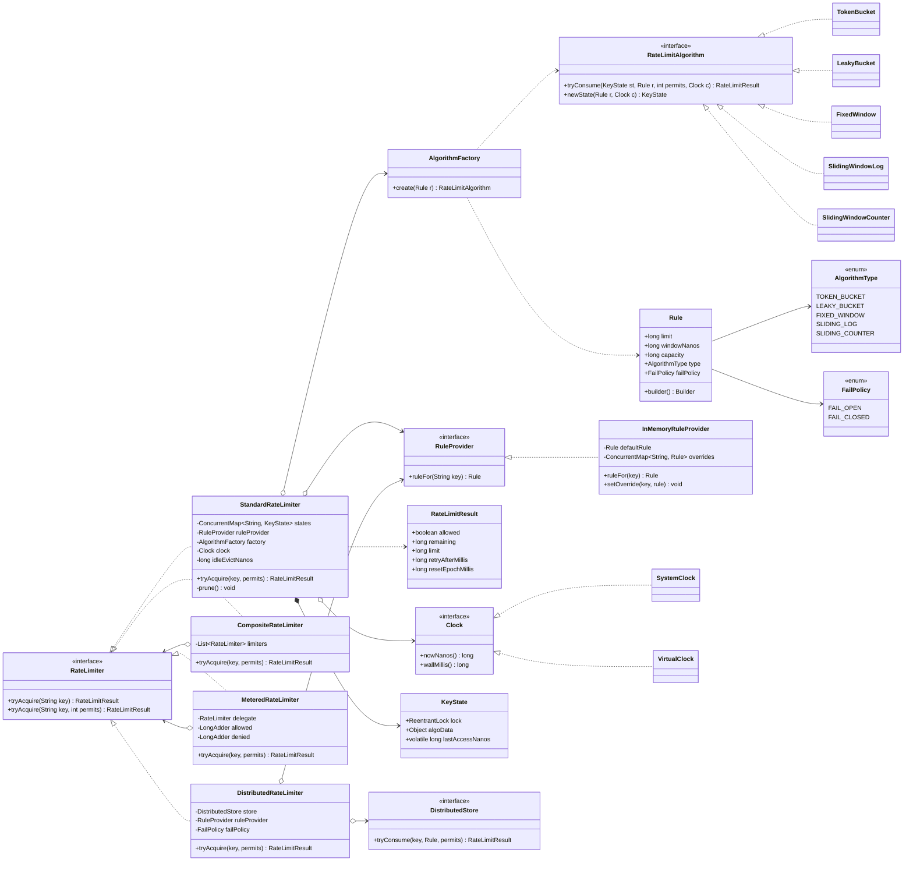

# LLD Design Document — Rate Limiter

> **Reader profile:** senior Java engineer revising for an LLD / machine-coding round.
> This document leads with clarifying questions, drives the design from requirements to
> patterns, gives a full class diagram, addresses concurrency and extensions, and ends
> with a cheat-sheet + self-test. The companion `Solution.java` is a single-file,
> read-and-revise artifact.

---

## PART A — Design Document

### 1. Problem statement

Design a **Rate Limiter**: a component that decides whether a given request is
**allowed** or **rejected (throttled)** based on a configured policy such as
"at most *N* requests per *T* time window" for a given *client/key*.

A rate limiter protects a system (an API gateway, a service, a database, a third-party
integration) from being overwhelmed. It is the gatekeeper that answers exactly one
question per call:

> `allow(clientKey) -> boolean`  (optionally returning *how long to wait* / remaining quota)

It must:

- Support **multiple algorithms** (token bucket, leaky bucket, fixed window, sliding window log, sliding window counter) behind **one interface**.
- Enforce limits **per key** (per user, per API key, per IP, per route).
- Be **thread-safe** — a high-QPS server calls it concurrently from many threads.
- Be **configurable** (limits, windows, algorithm) and **extensible** (new algorithms, distributed backends).

> **Adjacent term — "throttle":** to deliberately slow down or reject excess requests so a downstream stays healthy. "Throttled" = rejected because the caller exceeded its allowance.

---

### 2. Clarifying / requirements questions to ask first

A real round starts here. I would ask the interviewer:

**Functional scope**
1. Is this an **in-process library** (called inside one JVM) or a **distributed limiter** shared across many app servers (needs Redis / shared store)? This is the single biggest fork in the design.
2. What is the **unit of limiting** — per user ID, per API key, per IP, per (user, endpoint) tuple, or a global limit? Do we need *multiple tiers* at once (e.g. per-user **and** global)?
3. What does "allow" return — just a boolean, or also **remaining quota**, **retry-after / reset time**, and a **decision reason** (for `X-RateLimit-*` headers)?
4. Which **algorithm(s)** are required? Do we need burst tolerance (token bucket), smooth shaping (leaky bucket), or strict windowed counting (sliding window)? Should the algorithm be **pluggable / runtime-selectable**?
5. Are limits **static config** or must they be **changed at runtime** (hot reload, per-tenant overrides) without a redeploy?

**Non-functional / constraints**
6. Expected **throughput** (QPS) and **number of distinct keys**? This drives data-structure choice and memory (millions of keys ⇒ need eviction / TTL).
7. Latency budget for the `allow` check — is it on the hot request path (must be O(1), lock-light)?
8. On limiter **failure** (e.g. Redis down), should we **fail-open** (allow traffic) or **fail-closed** (reject)? Different SLAs want different defaults.
9. Accuracy vs. cost: is an **approximate** limiter acceptable (sliding-window-counter) or must it be **exact** (sliding-window-log, more memory)?
10. Clock source — can we assume a monotonic clock? Must behaviour be **testable** with a virtual/injectable clock?

**Scope-narrowing (what's in / out)**
11. Out of scope: the *transport* (HTTP filter/interceptor wiring), persistence of analytics, billing on overage? I'll assume yes unless told otherwise.
12. Do we need **memory cleanup** for idle keys (TTL / LRU eviction)?
13. Is there a need for **multiple rules per key** evaluated together (e.g. "100/sec AND 1000/min")?

> For this document I state my assumptions in §3 and design so the answers can flip without a rewrite.

---

### 3. Finalized requirements & assumptions

**In scope (what I'll build):**

- A **single-JVM, thread-safe** rate limiter as the core; a **distributed** variant is described and stubbed via an interface so the design extends to Redis.
- Core API: `RateLimiter.tryAcquire(String key)` returns a rich **`RateLimitResult`** (allowed, remaining, retryAfter, limit) — boolean is the degenerate case.
- **Per-key** limiting; a key is an opaque `String` (caller decides if it's userId, apiKey, IP, or a composite like `"user:42|GET /orders"`).
- **Pluggable algorithms** behind one `RateLimitAlgorithm`/strategy interface:
  - **Token Bucket** (default — allows bursts up to capacity, refills at a steady rate).
  - **Leaky Bucket** (smooths output to a fixed rate, queues conceptually).
  - **Fixed Window Counter** (simplest; suffers boundary bursts).
  - **Sliding Window Log** (exact; stores timestamps).
  - **Sliding Window Counter** (approximate; cheap, fixes boundary bursts).
- **Factory** to construct a limiter from a config (algorithm + params).
- **Injectable `Clock`** for testability and monotonic timing.
- **Configurable limits** with a **per-key override** mechanism and a sensible default.
- **Fail-open / fail-closed** policy is explicit and configurable.
- Idle-key **eviction** via a TTL so memory does not grow unbounded.

**Assumptions:**

- Single process is the primary target; correctness under concurrency is mandatory.
- Approximate sliding window is acceptable for the cheap path; exact log is available when needed.
- Clock is monotonic for elapsed-time math; wall clock only for human-readable reset times.
- Keys are bounded by an eviction policy (TTL on last access).

---

### 4. Problem extensions / follow-up variations

These are the common follow-ups; senior candidates pre-empt them. Each notes the **design impact**.

| # | Extension / follow-up | Design impact |
|---|---|---|
| 1 | **Per-user / per-API-key limits** | Already core: key is opaque. Add a **config resolver** mapping key → rule (default + overrides). No structural change. |
| 2 | **Multiple rules per key** ("100/s AND 5000/h") | Wrap several algorithm instances behind a **Composite** limiter that ANDs results; the most-restrictive `retryAfter` wins. |
| 3 | **Distributed enforcement (many servers)** | Swap the in-memory bucket store for a **shared store** (Redis). Token-bucket refill becomes a **Lua script** (atomic read-modify-write) or `INCR`+`EXPIRE` for fixed window. Introduce `DistributedRateLimiter` implementing the same interface — callers unaffected (Strategy + DIP pay off). Handle Redis latency/failure with the fail-open/closed policy. |
| 4 | **Different algorithms behind one interface** | This is the Strategy axis — already designed. Choose at runtime via the **Factory** + enum/config. |
| 5 | **Runtime-configurable limits / hot reload** | Rule lookup goes through a `RuleProvider` interface; back it with a file watcher or config service. Limiter reads the current rule per call (cheap volatile read). |
| 6 | **Tiered limits (free vs. premium tenants)** | `RuleProvider` returns different rules per key/tenant; no algorithm change. |
| 7 | **Return quota headers** (`X-RateLimit-Remaining`, `Retry-After`) | `RateLimitResult` already carries remaining/retryAfter/limit/reset. |
| 8 | **Cost-weighted requests** (a request can consume *N* tokens) | Generalize `tryAcquire(key)` to `tryAcquire(key, permits)`. Token/leaky bucket handle this naturally; windows decrement by `permits`. |
| 9 | **Eviction of idle keys** | TTL on last-access; a background sweeper or `computeIfAbsent` + periodic prune. Use `ConcurrentHashMap` with timestamped entries. |
| 10 | **Observability** (metrics on allow/deny) | Decorate the limiter (**Decorator** pattern) with a `MeteredRateLimiter` — no change to core logic. |
| 11 | **Graceful degradation if backend down** | `FailPolicy` strategy (FAIL_OPEN / FAIL_CLOSED) consulted in the catch path of the distributed limiter. |

---

### 5. Core entities, responsibilities & relationships

| Entity | Responsibility | Key relationships |
|---|---|---|
| `RateLimiter` (interface) | The public contract: `tryAcquire(key[, permits]) -> RateLimitResult`. | Implemented by `StandardRateLimiter`, `CompositeRateLimiter`, `MeteredRateLimiter`, `DistributedRateLimiter`. |
| `StandardRateLimiter` | Holds a per-key store of buckets; delegates the decision to a `RateLimitAlgorithm` chosen per key. Manages eviction. | *Composition*: has a `RuleProvider`, an `AlgorithmFactory`, a `Clock`, and a `ConcurrentMap<String, KeyState>`. |
| `RateLimitAlgorithm` (interface / Strategy) | Encapsulates ONE algorithm's decision logic over a mutable per-key state object. | Implemented by `TokenBucket`, `LeakyBucket`, `FixedWindow`, `SlidingWindowLog`, `SlidingWindowCounter`. |
| `Rule` | Value object: limit, window, algorithm type, burst/capacity, fail policy. Immutable. | Produced by `RuleProvider`. |
| `RuleProvider` (interface) | Resolves a key → `Rule` (default + overrides; supports hot reload). | Used by `StandardRateLimiter`. |
| `AlgorithmFactory` (Factory) | Builds the right `RateLimitAlgorithm` + initial state from a `Rule`. | Used by `StandardRateLimiter`. |
| `RateLimitResult` | Immutable outcome: allowed, remaining, limit, retryAfter, resetEpoch. | Returned to caller. |
| `Clock` (interface) | Abstracts time (`nowNanos`, `wallMillis`) for testability and monotonicity. | Injected everywhere timing is needed. |
| `FailPolicy` (enum) | FAIL_OPEN / FAIL_CLOSED for backend errors. | Used by distributed limiter. |
| `DistributedStore` (interface) | Abstracts the shared backend (Redis). Stub for the distributed extension. | Used by `DistributedRateLimiter`. |

> Each per-key bucket is guarded individually so different keys never contend (lock striping by key). See §9.

---

### 6. Design patterns applied

| Pattern | Where | Why | Rejected alternative & when-not |
|---|---|---|---|
| **Strategy** | `RateLimitAlgorithm` with token/leaky/fixed/sliding impls. | Algorithms vary independently and must be swappable per key/config. Classic *behaviour-varies* case. **OCP**: add an algorithm without touching the limiter. | *Big `if/switch` on an enum inside one class* — fine for 2 fixed algorithms, but violates OCP and bloats one class. Don't use Strategy if there's truly one algorithm forever. |
| **Factory Method / Simple Factory** | `AlgorithmFactory.create(Rule)`. | Centralizes the algorithm-selection logic so the limiter depends on the abstraction, not concrete `new TokenBucket(...)`. **DIP**. | *Reflection/registry map* — more dynamic but overkill for a fixed, known set; harder to read in revision. |
| **Composite** | `CompositeRateLimiter` ANDs several limiters (multi-rule). | Treat "one rule" and "many rules" uniformly behind `RateLimiter`. | *Caller loops over limiters manually* — leaks the AND-semantics and most-restrictive logic into every call site. |
| **Decorator** | `MeteredRateLimiter` wraps any `RateLimiter` to add metrics/logging. | Add cross-cutting concerns without modifying core; stackable (metrics + caching). **SRP/OCP**. | *Subclass each limiter* — combinatorial explosion; inheritance for orthogonal concerns is wrong. |
| **Builder** | `Rule.builder()...build()`. | Many optional params (capacity, refill, fail policy) ⇒ readable, immutable construction. | *Telescoping constructors* — unreadable and error-prone with many ints of the same type. |
| **Dependency Injection** | `Clock`, `RuleProvider`, `DistributedStore` injected. | Testability (virtual clock), swap backends. **DIP**. | *Static `System.nanoTime()` everywhere* — untestable, non-deterministic tests. |
| **Singleton (light)** | A shared `SystemClock` instance (stateless). | Avoid pointless allocation; stateless so safe. | Don't singleton the limiter itself — it holds per-key state and config you may want multiple of. |

**SOLID in play**
- **S**RP: each algorithm owns one decision rule; `StandardRateLimiter` owns key→state plumbing; `RuleProvider` owns config resolution.
- **O**CP: new algorithm or backend = new class implementing an interface; no edits to existing code.
- **L**SP: every `RateLimitAlgorithm`/`RateLimiter` is substitutable — same contract, same return type.
- **I**SP: small focused interfaces (`Clock`, `RuleProvider`, `DistributedStore`) rather than one fat "RateLimiterEngine".
- **D**IP: limiter depends on `RateLimitAlgorithm`, `Clock`, `RuleProvider` abstractions, not concretes.

> **Anti-pattern avoided:** *pattern-stuffing*. I deliberately do **not** use Visitor (no need to traverse a heterogeneous structure), Observer (metrics handled by Decorator), or Flyweight (state is inherently per-key, not shareable).

---

### 7. Class diagram



**Text UML (relationships at a glance):**

- `RateLimiter` is the root **interface**. `StandardRateLimiter`, `CompositeRateLimiter`, `MeteredRateLimiter`, `DistributedRateLimiter` **implement** it (LSP — all interchangeable).
- `StandardRateLimiter` **composes** (`*-->`) `KeyState` objects in a `ConcurrentHashMap`, and **aggregates** (`o-->`) a `RuleProvider`, `AlgorithmFactory`, `Clock`.
- `RateLimitAlgorithm` is the **Strategy** interface; five concrete strategies implement it.
- `AlgorithmFactory` **depends on** (`..>`) `Rule` (input) and produces a `RateLimitAlgorithm`.
- `CompositeRateLimiter` and `MeteredRateLimiter` **hold** other `RateLimiter`s (Composite / Decorator) — recursion on the same interface.
- `Rule` is built via **Builder** and references `AlgorithmType` + `FailPolicy` enums.

**Key public APIs / signatures:**

```java
interface RateLimiter {
    RateLimitResult tryAcquire(String key);
    RateLimitResult tryAcquire(String key, int permits);
}

interface RateLimitAlgorithm {
    KeyState newState(Rule rule, Clock clock);
    RateLimitResult tryConsume(KeyState state, Rule rule, int permits, Clock clock);
}

interface RuleProvider { Rule ruleFor(String key); }
interface Clock { long nowNanos(); long wallMillis(); }
```

---

### 8. Key flows

**8.1 `tryAcquire` happy path (in-process token bucket):**

1. Caller invokes `limiter.tryAcquire("user:42", 1)`.
2. `StandardRateLimiter` looks up the `Rule` via `ruleProvider.ruleFor(key)` (default or override).
3. It fetches/creates the per-key `KeyState` from the `ConcurrentHashMap` via `computeIfAbsent` (the factory builds initial algorithm data on first sight).
4. It **locks that key's** `ReentrantLock` (lock striping — other keys are unaffected).
5. It calls `algorithm.tryConsume(state, rule, permits, clock)`:
   - Token bucket: compute tokens to **refill** = `elapsedNanos * rate`; cap at `capacity`; if `tokens >= permits`, subtract and **allow**; else compute `retryAfter` and **deny**.
6. Update `lastAccessNanos`, unlock, return a `RateLimitResult` (allowed, remaining, retryAfter, reset).
7. Caller applies the decision (serve or 429) and sets quota headers from the result.

```mermaid
sequenceDiagram
    participant C as Caller
    participant L as StandardRateLimiter
    participant R as RuleProvider
    participant M as ConcurrentMap
    participant A as RateLimitAlgorithm
    C->>L: tryAcquire("user:42", 1)
    L->>R: ruleFor("user:42")
    R-->>L: Rule(TOKEN_BUCKET, 100/s, cap=100)
    L->>M: computeIfAbsent("user:42")
    M-->>L: KeyState (lock + tokens)
    L->>L: state.lock.lock()
    L->>A: tryConsume(state, rule, 1, clock)
    A->>A: refill by elapsed; check tokens>=1
    A-->>L: RateLimitResult(allowed, remaining=87, ...)
    L->>L: state.lastAccess = now; unlock
    L-->>C: RateLimitResult
```

**8.2 Composite (multi-rule) flow:** call each child limiter; if any **denies**, the composite denies and returns the result with the **largest `retryAfter`**; remaining = min across children.

**8.3 Distributed flow:** `DistributedRateLimiter.tryAcquire` delegates to `DistributedStore.tryConsume`, which runs an **atomic** server-side operation (Redis Lua: refill + check + decrement in one round trip). On `IOException`/timeout, consult `FailPolicy`: FAIL_OPEN ⇒ allow; FAIL_CLOSED ⇒ deny.

---

### 9. Concurrency, edge cases & extensibility

**Thread-safety (this is the heart of the problem):**

- **Per-key lock striping.** Each `KeyState` owns a `ReentrantLock`. Two requests for *different* keys never contend; only requests for the *same* key serialize — exactly the minimal critical section. The global map is a `ConcurrentHashMap`, so lookup/creation is lock-free for distinct keys.
- **Why not one global lock?** It would serialize the entire server at one mutex — the classic scalability killer. Why not fully lock-free? Token-bucket refill is a read-modify-write of two fields (tokens + lastRefill); doing it lock-free needs a CAS loop on a packed `long`/`AtomicLong` — possible (see token-bucket variant comment) but a short per-key lock is simpler and correct-by-inspection for revision.
- **`computeIfAbsent` is atomic** in `ConcurrentHashMap`, so two threads racing to create the same key get one shared `KeyState`.
- **Monotonic clock.** Elapsed-time math uses `System.nanoTime()` (monotonic), never `currentTimeMillis()` (can jump backwards on NTP correction) — avoids negative elapsed and free tokens.
- **Memory visibility.** `lastAccessNanos` is `volatile`; algorithm data is only touched under the per-key lock, so it's safely published.
- **Distributed atomicity.** Across servers, correctness requires the check+decrement to be atomic at the shared store — hence Redis Lua / `INCR`+`EXPIRE`, not read-then-write from the app.

**Edge cases:**

- **Burst at window boundary** (fixed window): 2× limit possible across the boundary — mitigated by sliding-window-counter or token bucket. Documented as a known fixed-window weakness.
- **Clock skew across servers** (distributed): rely on the store's time or a single authoritative clock; don't trust each app's wall clock.
- **`permits > capacity`**: an oversized request can never succeed — return denied with a clear reason rather than blocking forever.
- **First-ever request for a key**: bucket starts full (capacity) so it isn't unfairly throttled on a cold start.
- **Idle keys**: TTL eviction (`idleEvictNanos`); a prune pass removes `KeyState`s untouched beyond the TTL so the map doesn't grow unbounded with millions of one-shot keys.
- **Integer/long overflow** on token math: cap tokens at capacity; use `long` nanos.
- **Negative or zero permits**: validate and reject (`IllegalArgumentException`).

**Extensibility recap (how the design absorbs §4):**

- New algorithm ⇒ implement `RateLimitAlgorithm`, register in `AlgorithmFactory` — OCP.
- Distributed ⇒ `DistributedRateLimiter` + `DistributedStore` impl; callers unchanged — DIP/LSP.
- Metrics ⇒ wrap in `MeteredRateLimiter` — Decorator.
- Multi-rule ⇒ `CompositeRateLimiter` — Composite.
- Hot config ⇒ swap `RuleProvider` impl — DIP.
- Cost-weighted ⇒ `tryAcquire(key, permits)` overload — already in the interface.

---

### 10. Likely interview questions

1. **Q: Compare token bucket vs leaky bucket vs sliding window. When use which?**
   A: *Token bucket* allows bursts up to `capacity` then steady refill — best for APIs that tolerate spikes. *Leaky bucket* enforces a smooth constant output rate (no bursts) — good for shaping traffic to a fragile downstream. *Fixed window* is simplest but has 2× boundary bursts. *Sliding window log* is exact but O(requests) memory. *Sliding window counter* is approximate, O(1), and fixes boundary bursts cheaply — the usual production default alongside token bucket.

   | Algorithm | Burst handling | Memory | Accuracy | Boundary bug |
   |---|---|---|---|---|
   | Token bucket | allows up to capacity | O(1) | good | none |
   | Leaky bucket | smooths, no burst | O(1) | good | none |
   | Fixed window | none | O(1) | low | **yes (2×)** |
   | Sliding log | per-request | O(N) | exact | none |
   | Sliding counter | partial | O(1) | approx | mostly fixed |

2. **Q: How do you make it thread-safe without killing throughput?**
   A: Per-key lock striping — `ConcurrentHashMap<String, KeyState>` where each `KeyState` has its own `ReentrantLock`. Different keys never contend; same-key requests serialize over a tiny critical section. Avoid a single global lock.

3. **Q: Why inject a `Clock`?**
   A: Testability (virtual clock advances time deterministically — no `Thread.sleep` in tests) and correctness (force a monotonic source). It's DIP in action.

4. **Q (senior signal): Why Strategy here, and when would you NOT use it?**
   A: Algorithms vary independently and must be chosen per config — textbook Strategy, giving OCP (add an algorithm without touching the limiter). I'd skip it if there were exactly one algorithm forever; a `switch` would be simpler and Strategy would be speculative generality.

5. **Q: How does this go distributed?**
   A: Replace the in-memory store with Redis. The check+decrement must be **atomic** at the store — a Lua script does refill+test+consume in one round trip; fixed window can use `INCR` + `EXPIRE`. `DistributedRateLimiter` implements the same `RateLimiter` interface, so callers don't change. Handle Redis failure with a `FailPolicy` (fail-open vs fail-closed).

6. **Q: Fail-open or fail-closed when the backend is down?**
   A: Depends on the SLA. User-facing read APIs often **fail-open** (availability over strict limiting); payment/abuse-prevention paths **fail-closed**. Make it a config (`FailPolicy`) and consult it in the catch block.

7. **Q: What's the fixed-window boundary problem and the fix?**
   A: A client can send `limit` requests at the very end of window 1 and `limit` more at the start of window 2 — 2× the limit in a short span. Sliding-window-counter weights the previous window's count by the overlap fraction to smooth this; sliding-log is exact.

8. **Q (senior signal): How do you add metrics without touching the core?**
   A: Decorator — `MeteredRateLimiter` wraps any `RateLimiter`, increments allowed/denied counters, delegates the decision. Stackable with other decorators; SRP + OCP preserved.

9. **Q: How do you stop the key map from growing forever?**
   A: TTL eviction on `lastAccessNanos`; a periodic prune (or size-bounded LRU) removes idle `KeyState`s. Critical when keys are IPs / one-shot tokens numbering in the millions.

10. **Q (senior signal): Why a per-key lock and not an `AtomicLong` CAS loop?**
    A: You can do token bucket lock-free by packing `(tokens, lastRefillNanos)` into a `long` and CAS-looping — great under extreme contention. I chose a per-key `ReentrantLock` for *correctness-by-inspection* in a revision artifact and because per-key contention is already low; I'd switch to CAS only if profiling showed lock contention on hot keys.

**Deep-probe follow-ups:**

- *"Show the Redis Lua for token bucket."* — Read `tokens` and `last_refill`; compute refill from `now - last_refill`; cap at capacity; if `tokens >= permits` decrement and return 1 (+ remaining), else return 0 (+ retry-after); set `EXPIRE`. All atomic.
- *"Two limits at once — 10/s and 100/min?"* — Composite ANDs two limiters; deny if either denies; report the max retry-after.
- *"Cost-weighted requests?"* — `tryAcquire(key, permits)`; token/leaky subtract `permits`; reject if `permits > capacity`.

---

## PART C — Cheat-sheet & self-test

**Patterns used (recap):**
- **Strategy** — pluggable algorithms (`RateLimitAlgorithm`).
- **Factory** — `AlgorithmFactory` builds the algorithm from a `Rule`.
- **Composite** — `CompositeRateLimiter` ANDs multiple rules.
- **Decorator** — `MeteredRateLimiter` adds metrics around any limiter.
- **Builder** — immutable `Rule` construction.
- **Dependency Injection** — `Clock`, `RuleProvider`, `DistributedStore`.

**Key design decisions (recap):**
- One `RateLimiter` interface; everything (composite, metered, distributed) is substitutable (LSP/DIP).
- **Per-key lock striping** over `ConcurrentHashMap` for scalable thread-safety — never a global lock.
- **Monotonic `System.nanoTime()`** for elapsed math; injectable `Clock` for tests.
- **Token bucket** default (burst-tolerant); sliding-window-counter as cheap accurate option.
- **Fail-open/closed** is explicit config; **TTL eviction** bounds memory.
- Distributed correctness = **atomic** check+decrement at the shared store (Redis Lua).

**5 self-test questions (no answers):**
1. Re-derive the token-bucket refill formula and explain why `System.nanoTime()` (not `currentTimeMillis()`) is mandatory.
2. Where exactly is the critical section, and prove two requests on different keys never block each other.
3. Convert the in-memory `StandardRateLimiter` to distributed: what changes, what stays, and where does atomicity live?
4. Add a "120/min AND 5/sec" policy without modifying any existing class — which pattern and what does it return on partial denial?
5. Your limiter must emit `X-RateLimit-Remaining` and `Retry-After` headers and record Prometheus counters — wire both with zero edits to the core algorithm classes.
