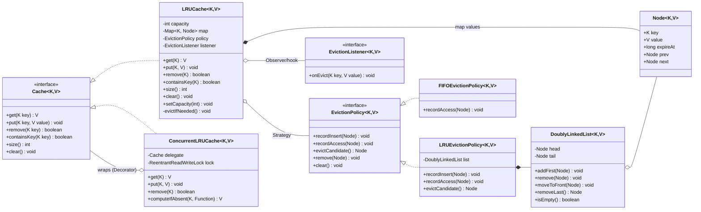
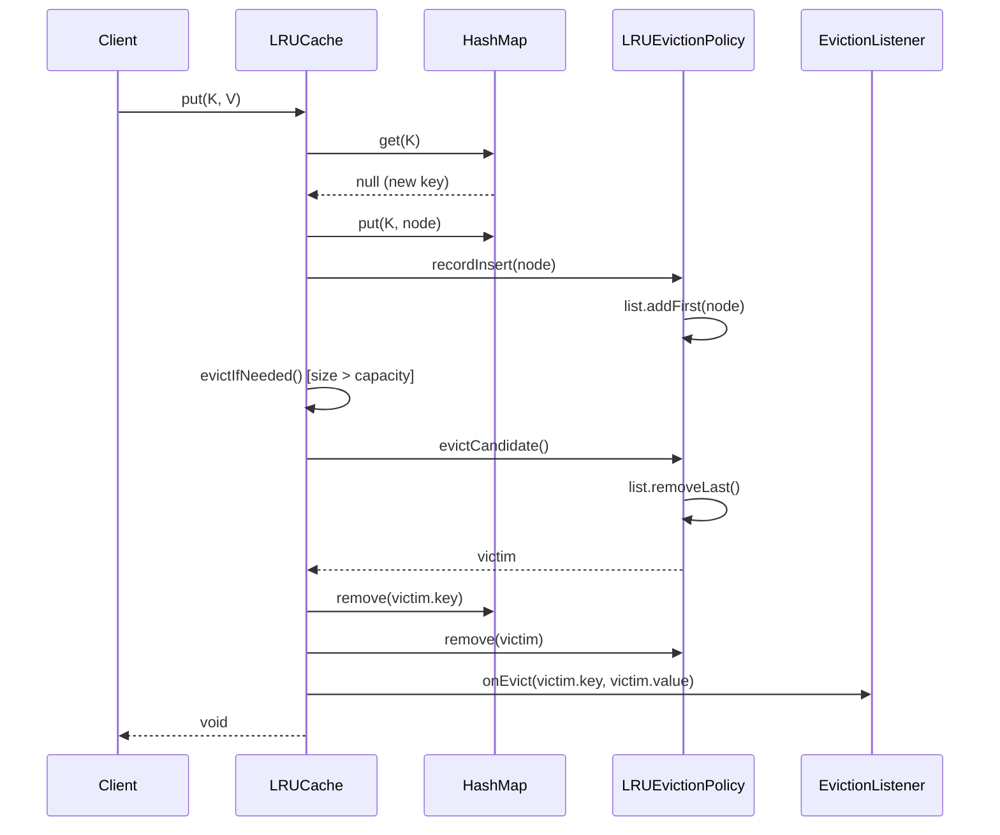

# LLD Design Document — LRU Cache

> **Audience:** Senior Java engineer prepping for an LLD / machine-coding round.
> **Goal of this doc:** apply the right data structures and patterns with explicit justification, give clean SOLID code you can recall under pressure, and anticipate the follow-ups interviewers stack on this problem.

---

## PART A — Design Document

### 1. Problem statement

Design an **LRU (Least Recently Used) cache**: a fixed-capacity, in-memory key→value store that supports two primary operations in **O(1) average time**:

- `get(key)` — return the value if the key is present, otherwise signal "miss". A successful `get` marks the key as *most recently used*.
- `put(key, value)` — insert or update a key. If inserting pushes the cache beyond its capacity, the **least recently used** entry is **evicted** to make room. A `put` also marks the key as most recently used.

"Recently used" is defined by access *recency*: every `get` or `put` on a key moves it to the front (MRU end); the entry that has gone the longest without an access sits at the back (LRU end) and is the eviction victim.

> **Why this problem is asked:** it is the canonical test of whether a candidate can *combine two data structures* (a hash map for O(1) lookup + a doubly-linked list for O(1) reordering) into one coherent abstraction, reason about pointer surgery without bugs, and then extend the design to thread-safety, TTL, and pluggable eviction policies.

---

### 2. Clarifying / requirements questions to ask first

A real round starts here — *never* with classes. I would group my questions:

**Functional scope**
1. What operations are required — just `get`/`put`, or also `remove(key)`, `containsKey`, `size`, `clear`, `getOrDefault`?
2. On `get(missing-key)` — return `null`, throw, or return an `Optional`/sentinel? (Important because `null` is ambiguous if `null` values are allowed.)
3. Are `null` keys or `null` values permitted? (Standard `HashMap` allows them; allowing `null` values complicates "miss vs. stored null".)
4. Does updating an existing key's value count as a "use" that refreshes recency? (Almost always yes.)
5. Is capacity fixed at construction, or must it support **resizing** at runtime?
6. On `put` when the key already exists and we're at capacity — do we update in place (no eviction) or is that a special case? (Update in place; no eviction needed.)

**Eviction semantics**
7. Is the policy strictly **LRU**, or should the design allow swapping in **LFU / FIFO / MRU** later? (Drives whether we invest in a Strategy abstraction.)
8. Do entries have a **TTL (time-to-live)** / expiry? If so, is expiry lazy (on access) or active (background sweeper)?
9. What's the eviction granularity — one entry per overflow, or could a single `put` of a large value require evicting *several* entries (size-weighted caches)?

**Non-functional**
10. **Concurrency:** single-threaded or must it be **thread-safe**? If concurrent, what's the read/write ratio and expected contention? (Decides plain vs. lock vs. striped/segmented design.)
11. Required time complexity — O(1) for both ops is the implied bar; confirm.
12. Expected capacity / memory budget — thousands or millions of entries? (Affects whether per-node overhead matters.)
13. Any **write-through / write-back** hook to a backing store (DB, disk), and **load-on-miss** behavior?
14. Are **metrics** (hit rate, eviction count) or **eviction listeners** required?
15. Generics — must it be a generic `Cache<K,V>` or a concrete `Integer→Integer`? (Interview default: make it generic.)

**Scope-narrowing / explicitly out of scope**
16. Distributed cache, persistence across restarts, serialization, cache coherence across nodes — in or out? (Usually **out** for an LLD round; note them as extensions.)

> For this document I lock in the answers in §3.

---

### 3. Finalized requirements & assumptions

**In scope (functional)**
- Generic `Cache<K, V>`.
- `V get(K key)` — returns value or `null` on miss; refreshes recency.
- `void put(K key, V value)` — insert/update; refreshes recency; evicts LRU on overflow.
- `boolean remove(K key)`, `boolean containsKey(K key)`, `int size()`, `void clear()`.
- Capacity fixed at construction (resizing covered as an extension in §4 and implemented as a bonus method).
- Eviction policy is **LRU**, but exposed via a **Strategy interface** so LFU/FIFO can be dropped in.
- Optional **eviction listener** callback (write-through / logging hook).

**Non-functional**
- **O(1) average** `get`/`put`/`remove` (amortized, hash-map dependent).
- A **thread-safe** variant is provided (`ConcurrentLRUCache`) using a single `ReentrantReadWriteLock`; a striped/segmented design is discussed in §4/§9.
- Pure JDK, no external libraries.

**Assumptions**
- Keys obey the `equals`/`hashCode` contract.
- `null` keys are rejected (throw `NullPointerException`); `null` values are rejected too, so `get` returning `null` unambiguously means "miss". (This is the clean default; I note in §9 how to support null values via a sentinel/`Optional`.)
- Capacity ≥ 1.
- Recency is updated on **both** successful `get` and `put`.

**Out of scope**
- Distribution, persistence, serialization, cross-process coherence.

---

### 4. Problem extensions / follow-up variations

This is where senior candidates separate themselves. Each row: the ask, and **how the design absorbs it**.

| # | Extension / follow-up | Design impact |
|---|------------------------|----------------|
| 1 | **Prove O(1) for get/put** | Lookup is `HashMap` O(1) avg; recency update is unlink+move-to-head on a **doubly-linked list with sentinels**, all pointer reassignments → O(1); eviction removes the tail node → O(1). No iteration anywhere. (See §8.) |
| 2 | **Thread-safe version** | Wrap mutating sections in a lock. Options: (a) `synchronized`/single `ReentrantLock` — simplest, correct, but serializes everything; (b) `ReentrantReadWriteLock` — *careful:* a "read" `get` still mutates the list, so it needs the **write** lock, limiting RW benefit; (c) **segmented / striped** cache: shard by `hash(key) % N`, each shard its own lock + list — near-linear scalability, but eviction becomes per-shard (approximate global LRU). Discussed in §9. |
| 3 | **TTL / expiry** | Add `expireAt` to each `Node`. **Lazy expiry:** on `get`, if expired, treat as miss + remove. **Active expiry:** a background `ScheduledExecutorService` sweeps, or a secondary structure (min-heap / time-bucketed wheel) ordered by expiry. Lazy is cheap and common; active reclaims memory promptly. |
| 4 | **Runtime capacity change** | `setCapacity(n)`: if `n < size`, evict from the tail until `size == n`; if larger, just raise the bound. O(k) where k = entries evicted. |
| 5 | **Generic K/V** | Already designed in: `Cache<K,V>`, `Node<K,V>`. |
| 6 | **Pluggable eviction (LRU/LFU/FIFO)** | The **Strategy pattern**: an `EvictionPolicy<K,V>` decides "which entry to evict" and "how to record an access". LRU = move-to-head DLL; FIFO = no reorder on access; LFU = frequency buckets / counts. The cache core delegates ordering to the policy. |
| 7 | **Write-through / load-on-miss hook** | An `EvictionListener<K,V>` (Observer) fires `onEvict(key, value)` so you can flush dirty entries to a backing store; a `CacheLoader<K,V>` (function) supplied at construction loads from the source on a miss (read-through). |
| 8 | **Size-weighted entries** | Each entry carries a `weight`; capacity becomes a total-weight budget; a single `put` may evict *several* tail entries until `currentWeight ≤ maxWeight`. Eviction loop already supports multi-evict. |
| 9 | **Metrics** | Wrap the cache in a **Decorator** that counts hits/misses/evictions, or have the cache expose counters. Keeps the core class single-responsibility. |
| 10 | **`getOrCompute` / memoization** | Add `computeIfAbsent(key, mappingFn)` — atomic in the concurrent variant under the write lock. |

---

### 5. Core entities, responsibilities & relationships

| Entity | Responsibility | Collaborators |
|--------|----------------|---------------|
| `Cache<K,V>` (interface) | Public contract: `get`, `put`, `remove`, `containsKey`, `size`, `clear`. | clients |
| `LRUCache<K,V>` | Orchestrates lookup + recency + eviction. Owns the map and the policy. **Does not** know low-level pointer wiring (delegates to the DLL via the policy). | `HashMap`, `EvictionPolicy`, `EvictionListener` |
| `Node<K,V>` | A cache entry: holds `key`, `value`, optional `expireAt`/`weight`, and `prev`/`next` pointers for the DLL. | `DoublyLinkedList` |
| `DoublyLinkedList<K,V>` | O(1) `addFirst`, `remove(node)`, `moveToFront(node)`, `removeLast`. Uses **sentinel head/tail** to kill null-checks. | `Node` |
| `EvictionPolicy<K,V>` (interface) | **Strategy:** `recordAccess(node)`, `recordInsert(node)`, `evictCandidate()` → the node to remove. | `DoublyLinkedList` (for LRU/FIFO) |
| `LRUEvictionPolicy<K,V>` | Concrete LRU: move accessed/inserted node to front; evict tail. | `DoublyLinkedList` |
| `EvictionListener<K,V>` (interface) | **Observer/hook:** `onEvict(K,V)` — write-through / logging. | client-supplied |
| `ConcurrentLRUCache<K,V>` | Thread-safe **decorator/wrapper** adding a `ReentrantReadWriteLock` around an `LRUCache`. | `LRUCache`, `ReentrantReadWriteLock` |

**Relationships (text UML)**
- `LRUCache` **implements** `Cache`.
- `LRUCache` **has-a** `HashMap<K, Node<K,V>>` (composition).
- `LRUCache` **has-a** `EvictionPolicy` (composition; the strategy).
- `LRUEvictionPolicy` **has-a** `DoublyLinkedList` (composition).
- `DoublyLinkedList` **aggregates** `Node`s.
- `LRUCache` **has-a (optional)** `EvictionListener` (association).
- `ConcurrentLRUCache` **wraps / delegates to** a `Cache` (decorator) and **implements** `Cache`.

---

### 6. Design patterns applied

> Principle: **don't pattern-stuff.** An LRU cache can be one class. I introduce a pattern only where a stated extension (§4) makes it pay for itself, and I name the alternative I rejected.

#### 6.1 Strategy — pluggable eviction policy
- **Where:** `EvictionPolicy<K,V>` with `LRUEvictionPolicy` (and sketched `FIFOEvictionPolicy`, `LFUEvictionPolicy`).
- **Why:** the *eviction algorithm* is the axis of variation (extension #6). Strategy lets `LRUCache` stay closed for modification but open for new policies (**OCP**). The cache delegates "which entry dies" rather than hard-coding LRU.
- **Rejected alternative:** inline the LRU list logic directly in `LRUCache` (simpler, fewer types). *When not to use Strategy:* if the interviewer says "LRU only, keep it minimal," collapse the policy into the cache — a Strategy with a single implementation is over-engineering. I keep it because the prompt explicitly lists pluggable LRU/LFU as an expected follow-up.

#### 6.2 Decorator — concurrency & metrics as add-on layers
- **Where:** `ConcurrentLRUCache` wraps any `Cache` and adds locking; a `MetricsCache` (described) could wrap to add hit/miss counters.
- **Why:** keeps the core `LRUCache` single-responsibility (**SRP**) — it does caching, not locking or telemetry. Cross-cutting concerns stack as decorators without touching the core.
- **Rejected alternative:** make `LRUCache` itself thread-safe with internal `synchronized` blocks. *When not to use Decorator:* if you *always* need locking and never the unsynchronized version, an internally-synchronized class is simpler and avoids a wrapper allocation. Decorator wins when you want to pay for safety only when needed and keep the fast single-thread path.

#### 6.3 Observer (callback hook) — eviction listener
- **Where:** `EvictionListener.onEvict(K,V)`, invoked whenever the cache evicts (or `remove`s) an entry.
- **Why:** enables write-through / write-back / logging (extension #7) without the cache knowing about the backing store (**DIP** — depend on the abstraction).
- **Rejected alternative:** the cache directly calls a concrete `Database.flush(...)`. *When not to use:* if there is genuinely no downstream consumer, the listener is dead weight — make it optional (nullable / no-op default), as I do.

#### 6.4 Factory method (light) — building configured caches
- **Where:** static builders like `LRUCache.of(capacity)` / a small `Builder` for capacity + policy + listener + TTL.
- **Why:** centralizes wiring of map+policy+listener so callers don't assemble internals. Marginal but improves readability.
- **Rejected alternative:** plain constructors — fine; I keep both. Don't introduce a full **Abstract Factory**; there's one product family.

#### 6.5 Sentinel / Null Object (idiom) — DLL head & tail guards
- **Where:** `DoublyLinkedList` keeps dummy `head` and `tail` nodes.
- **Why:** every insert/remove has non-null neighbors → **no special-casing** empty list or single element → fewer bugs. This is the single biggest correctness lever in the pointer code.

#### SOLID in play
- **SRP:** `LRUCache` (policy orchestration), `DoublyLinkedList` (pointer mechanics), `EvictionPolicy` (which-to-evict), `ConcurrentLRUCache` (locking) each have one reason to change.
- **OCP:** new eviction policies and new decorators require *no* edits to `LRUCache`.
- **LSP:** any `EvictionPolicy` and any `Cache` are substitutable; `ConcurrentLRUCache` honors the `Cache` contract.
- **ISP:** `Cache` is a small, focused interface; `EvictionListener` is one method.
- **DIP:** `LRUCache` depends on the `EvictionPolicy` and `EvictionListener` abstractions, not concretes.

---

### 7. Class diagram



**Brief text UML / key public APIs**

```
interface Cache<K,V>
    V       get(K key)
    void    put(K key, V value)
    boolean remove(K key)
    boolean containsKey(K key)
    int     size()
    void    clear()

class LRUCache<K,V> implements Cache<K,V>
    LRUCache(int capacity)
    LRUCache(int capacity, EvictionPolicy<K,V> policy, EvictionListener<K,V> listener)
    void setCapacity(int newCapacity)

interface EvictionPolicy<K,V>
    void      recordInsert(Node<K,V> node)
    void      recordAccess(Node<K,V> node)
    Node<K,V> evictCandidate()
    void      remove(Node<K,V> node)
    void      clear()

interface EvictionListener<K,V>
    void onEvict(K key, V value)

class ConcurrentLRUCache<K,V> implements Cache<K,V>   // Decorator + RW lock
    V computeIfAbsent(K key, Function<? super K,? extends V> fn)
```

---

### 8. Key flows

#### 8.1 `get(key)` — happy path and miss

1. `node = map.get(key)`.
2. If `node == null` → **miss**: return `null` (or trigger read-through loader if configured).
3. (TTL variant) If `node` is expired → remove it, fire listener, return `null`.
4. `policy.recordAccess(node)` → moves node to the MRU/front (LRU policy).
5. Return `node.value`.

All steps are O(1).

#### 8.2 `put(key, value)`

1. `node = map.get(key)`.
2. **Update case:** if present → set `node.value = value`, `policy.recordAccess(node)`, return.
3. **Insert case:** create `node`, `map.put(key, node)`, `policy.recordInsert(node)` (adds to front).
4. `evictIfNeeded()`: while `map.size() > capacity` → `victim = policy.evictCandidate()` (tail), `map.remove(victim.key)`, `policy.remove(victim)`, `listener.onEvict(victim.key, victim.value)`.

#### 8.3 Sequence diagram — `put` causing eviction



#### 8.4 Why each operation is O(1) (the proof interviewers want)

- **Lookup:** `HashMap.get/put/remove` are O(1) amortized (good `hashCode`, load factor bound).
- **Recency update:** unlink a node (`prev.next = next; next.prev = prev`) and splice at head — a *constant* number of pointer writes; no scan. Sentinels guarantee non-null neighbors, so no branch on empty/singleton.
- **Eviction:** the LRU victim is *always* `tail.prev` — direct access, O(1). We never search for it.
- **Space:** O(capacity) — one map entry + one node per key.

> The crux: the **map gives O(1) addressing into the list**, so we can reorder the list without ever traversing it. That pairing is the whole trick.

---

### 9. Concurrency, edge cases & extensibility

#### 9.1 Concurrency / thread-safety

The base `LRUCache` is **not** thread-safe — both `get` and `put` mutate shared state (map + list pointers). A concurrent `get` and `put`, or two `get`s, can corrupt the linked list (lost nodes, cycles) or the map.

**Key subtlety:** in an LRU cache, **`get` is a writer** — it reorders the list. So a naive `ReadWriteLock` where reads take the read lock is **wrong**: two concurrent `get`s would both mutate the list under shared read locks → corruption. Options, weakest→strongest contention handling:

| Approach | Mechanism | Pros | Cons |
|----------|-----------|------|------|
| **Single mutex** (`synchronized` / one `ReentrantLock`) | Lock around every op | Trivially correct; simple | Serializes everything; no read parallelism |
| **ReadWriteLock, but `get` takes the *write* lock** | RW lock; reads that mutate use write lock | Lets you keep read lock for truly read-only ops (`size`, `containsKey` with no reorder) | `get` (the common op) still serializes; limited gain |
| **Striped / segmented cache** | N independent shards, `shard = hash(key) % N`, each with its own lock + list | Near-linear scalability; contention ÷ N | Eviction is **per-shard** → only *approximate* global LRU; capacity split across shards |
| **Lock-free / CAS on DLL** | Atomic pointer CAS | Maximal throughput | Extremely hard to get right; rarely worth it in an interview — mention, don't build |

My provided `ConcurrentLRUCache` uses a **single `ReentrantReadWriteLock`** where **`get` acquires the write lock** (because it reorders) and only genuinely read-only methods (`size`, `containsKey` *without* recency bump) take the read lock. It also offers an atomic `computeIfAbsent`. This is the correct, defensible interview answer; I describe striping as the scale-out path.

> **Real-world note:** Java's `LinkedHashMap(capacity, 0.75f, true)` with `removeEldestEntry` overridden gives you an LRU map for free (single-threaded). Guava `CacheBuilder` and Caffeine are production choices; Caffeine uses ring buffers + the **TinyLFU** admission policy to get near-optimal hit rates with low contention. Naming these signals seniority.

#### 9.2 Edge cases

- **Capacity 0 / negative:** reject in constructor (`IllegalArgumentException`). Capacity must be ≥ 1.
- **`put` same key twice:** second call updates value and refreshes recency; size unchanged; no eviction.
- **`get` on empty cache / missing key:** returns `null` (miss). With null-values-allowed, must use a sentinel or `containsKey` to disambiguate.
- **Eviction when only one element and capacity 1:** sentinels make this branch-free; the lone node is both `head.next` and `tail.prev`.
- **`remove` of absent key:** no-op, returns `false`; does not fire eviction listener.
- **`null` key / value:** rejected with `NullPointerException` per assumptions (keeps "miss == null" clean).
- **TTL: entry expires between `containsKey` and `get`:** lazy expiry on `get` re-checks; don't trust a stale `containsKey`.
- **Re-entrancy in listener:** if `onEvict` calls back into the cache, a single non-reentrant lock would deadlock — `ReentrantReadWriteLock`/`synchronized` are reentrant, but mutating the cache from inside `onEvict` is still risky (iterator/state invalidation). Document that listeners should be side-effect-light.
- **Capacity shrink below size:** `setCapacity` evicts from the tail until `size == newCapacity`, firing listeners for each.
- **Hash collisions / bad `hashCode`:** degrades map to O(n) buckets; out of our control but worth stating.

#### 9.3 How the design absorbs the §4 extensions

- **Pluggable policy** → new `EvictionPolicy` impl; cache untouched (**OCP**).
- **TTL** → add `expireAt` to `Node` (already present) + lazy check in `get`/active sweeper; no API change.
- **Resize** → `setCapacity` already implemented.
- **Write-through / read-through** → `EvictionListener` (write) + a `CacheLoader` function (read) injected at construction.
- **Metrics** → a `MetricsCache` decorator wraps any `Cache`.
- **Concurrency** → `ConcurrentLRUCache` decorator; or swap to striping for scale.
- **Size-weighted** → `Node.weight` + weight-budget eviction loop (multi-evict already supported).

---

### 10. Likely interview questions

**Q1. Why a doubly-linked list and not a singly-linked one?**
Removing an arbitrary node in O(1) requires O(1) access to its *predecessor*. A singly-linked list would force an O(n) scan to find the prev pointer. The doubly-linked list (with sentinels) gives O(1) unlink. *Follow-up:* "Could you use an array/`ArrayDeque`?" — reordering in an array is O(n) (shifting); a deque can't remove an arbitrary middle element in O(1). The DLL+map pairing is what buys O(1) everywhere.

**Q2. Walk me through why both `get` and `put` are O(1).**
See §8.4: map lookup O(1); recency update is a constant number of pointer writes (no scan, thanks to map→node addressing); eviction targets `tail.prev` directly. *Follow-up:* "Amortized or worst case?" — amortized average, gated by `HashMap`; worst case degrades with pathological hashing or resize rehashing.

**Q3. Why is a naive `ReadWriteLock` wrong for an LRU cache?** *(senior signal)*
Because `get` **mutates** the recency list — it's a writer, not a reader. Two concurrent `get`s under shared read locks would both splice the list and corrupt it. Correct designs either (a) make `get` take the write lock, or (b) shard into striped segments. *Follow-up:* "How would you preserve true global LRU under striping?" — you can't cheaply; striping gives *approximate* LRU. For exact LRU at scale you batch accesses (ring buffers drained under a single lock), which is the Caffeine approach.

**Q4. Where did you apply the Strategy pattern and why not just hard-code LRU?** *(senior signal)*
Eviction policy is the axis of variation (LRU/LFU/FIFO). Strategy keeps `LRUCache` closed to modification (**OCP**) while open to new policies. *When NOT to:* if the requirement is "LRU only, minimal," a single-implementation Strategy is over-engineering — collapse it into the cache. I introduced it because pluggable eviction was an explicit follow-up. *Follow-up:* "Sketch LFU." — maintain per-node frequency + a structure of frequency buckets (each a DLL); on access, bump frequency and move the node to the next bucket; evict from the lowest-frequency bucket's LRU end. O(1) with the bucket-of-lists trick.

**Q5. How do you add TTL without breaking O(1)?**
Store `expireAt` on each node; on `get`, if `now > expireAt`, remove and treat as miss (**lazy expiry**, O(1)). For prompt reclamation, run an **active sweeper** (`ScheduledExecutorService`) or order entries by expiry in a min-heap (then expiry-pop is O(log n), separate from get/put). *Follow-up:* "Lazy vs active tradeoff?" — lazy is cheaper but lets dead entries occupy capacity until touched; active reclaims memory promptly at CPU cost.

**Q6. How do `null` values interact with `get` returning `null`?**
If `null` values are allowed, `get`→`null` is ambiguous (missing vs. stored null). Resolve by (a) forbidding null values (my default), (b) returning `Optional<V>`, or (c) wrapping in a sentinel `Holder`. *Follow-up:* "Which does `HashMap` do?" — allows null values; you'd pair `get` with `containsKey`, which itself can be racy under concurrency.

**Q7. The eviction listener calls back into the cache and you deadlock. Why, and how do you fix it?**
A non-reentrant lock taken twice on the same thread deadlocks; even with a reentrant lock, mutating cache state mid-eviction can break invariants. Fix: keep listeners side-effect-light, or **fire the callback *after* releasing the lock** by collecting evicted entries first and notifying outside the critical section. *Follow-up:* "Why notify after unlock?" — minimizes lock hold time and avoids re-entrancy/iterator-invalidation hazards.

**Q8. Could you just use `LinkedHashMap`?**
Yes for single-threaded LRU: `new LinkedHashMap<>(cap, 0.75f, /*accessOrder=*/true)` with `removeEldestEntry` overridden gives access-ordered eviction for free. I implement the map+DLL manually because the interview is testing that I can build the data structure, and because manual control is needed for striping, TTL, weights, and custom policies. *Follow-up:* "What does `accessOrder=true` cost?" — every `get` restructures the internal list (and is a structural-ish modification w.r.t. iterators), so it's not thread-safe and iteration during access is fragile.

**Q9. How would you make eviction size-weighted (a 10MB value should evict more than a 1KB one)?** *(senior signal)*
Give each `Node` a `weight`; track `currentWeight`; capacity becomes a weight budget; on `put`, evict from the tail in a loop until `currentWeight ≤ maxWeight` (may remove several entries). The core eviction loop already supports multi-evict; only the bound check changes. *Follow-up:* "What if a single value exceeds the whole budget?" — reject the put (or evict everything and still reject), and document the policy.

**Q10. How do you test this?**
Unit tests: basic get/put/update; eviction order (insert 3 into cap-2, assert oldest gone); recency refresh (get the oldest, insert, assert it survived); capacity 1; remove/contains/clear; TTL expiry with a controllable clock; listener fires on eviction with correct key/value. Concurrency: a stress test with N threads hammering get/put and an invariant check that `size ≤ capacity` and the list/map stay consistent. *Follow-up:* "How do you make TTL tests deterministic?" — inject a `Clock`/time supplier instead of `System.nanoTime`, so tests advance time manually.

---

## PART C — Cheat-sheet & self-test

### Patterns & key decisions recap
- **Data structure:** `HashMap<K, Node>` + **doubly-linked list with sentinel head/tail** → O(1) get/put/remove; map addresses into the list so reordering never scans.
- **Strategy** → `EvictionPolicy` (LRU/FIFO/LFU pluggable) so the cache obeys **OCP**.
- **Decorator** → `ConcurrentLRUCache` adds locking; `MetricsCache` could add telemetry — core stays **SRP**.
- **Observer hook** → `EvictionListener.onEvict` for write-through / logging (**DIP**), fired *after* unlock.
- **Sentinel/Null-Object idiom** → dummy head/tail nodes eliminate empty/singleton special-casing (the main correctness lever).
- **Concurrency gotcha:** `get` is a *writer* (it reorders), so a naive read-lock-on-get RW design is wrong; use a single write-locked path or **striped segments** for scale (approximate LRU).
- **TTL:** lazy expiry on `get` (O(1)) + optional active sweeper.
- **SOLID:** SRP (split cache / list / policy / locking), OCP (new policies & decorators), LSP/ISP/DIP via the small `Cache`, `EvictionPolicy`, `EvictionListener` interfaces.

### 5 self-test questions (no answers)
1. Why does a singly-linked list break the O(1) guarantee, and exactly which operation forces O(n)?
2. Your team enables a `ReadWriteLock` and lets `get` take the *read* lock for throughput. Demonstrate the concrete race that corrupts the linked list.
3. Sketch an LFU policy that keeps eviction O(1); what auxiliary structure makes "find the least-frequent entry" constant time?
4. Under striped/segmented locking, why is global LRU only approximate, and what would it take to make it exact again?
5. With TTL + a background sweeper running while clients call `get`, what invariants must hold so a client never reads an expired value, and where do you place the expiry check?
