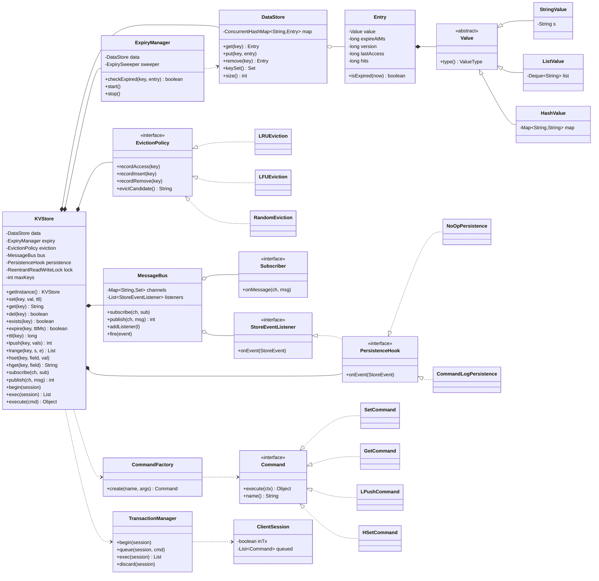
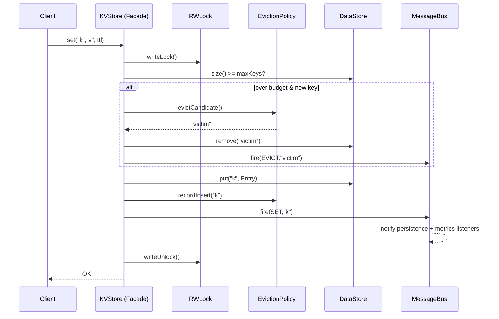

# LLD: In-Memory Key-Value Store (Redis-lite)

> A staff-engineer-grade low-level-design write-up plus a single-file Java review artifact. Read it top to bottom before a machine-coding round; the design is driven from **requirements → entities → responsibilities → patterns**, and every pattern is justified with a rejected alternative.

---

## PART A — Design Document

### 1. Problem statement

Design an **in-memory key-value (KV) store** — a "Redis-lite" — that lives inside a single process and serves reads/writes from RAM. The store maps keys (strings) to **typed values** (string, list, hash) and supports the operations you would expect from Redis:

- Basic CRUD: `SET`, `GET`, `DEL`, `EXISTS`.
- **TTL / expiry**: keys can be given a time-to-live and disappear automatically (both *lazy* expiry on access and *active* background expiry).
- **Multiple data types**: a value is not just a string — it can be a list (ordered sequence) or a hash (field→value map), each with its own operations (`LPUSH`, `HSET`, …).
- **Transactions**: `MULTI` / `EXEC` / `DISCARD` — queue a batch of commands and execute them atomically.
- **Eviction**: when a memory/key budget is hit, evict keys by a configurable policy (LRU, LFU, random).
- **Pub/Sub**: clients can `SUBSCRIBE` to channels and receive messages `PUBLISH`ed to them.
- **Persistence hook**: an extension point so state can be snapshotted/restored (an AOF/RDB-style seam) without baking a particular storage engine into the core.
- **Thread-safety**: many client threads hit the store concurrently.

The deliverable is the **object model and operation semantics** — not a wire protocol or networking layer. We expose an in-process API (`KVStore`) that a server front-end *could* sit on top of.

> **Adjacent term — KV store:** a database whose entire data model is "give me the value stored under this key." No SQL, no joins; O(1)-ish hash lookups.
> **Adjacent term — TTL (time-to-live):** a per-key countdown after which the key is considered expired and removed.
> **Adjacent term — AOF / RDB:** Redis's two persistence modes. AOF (append-only file) logs every write command; RDB is a point-in-time binary snapshot. We only design the *hook*, not the engine.

---

### 2. Clarifying / requirements questions to ask first

Lead the round with these. The interviewer's answers shrink or grow the problem dramatically, so never start drawing classes.

**Functional scope**
1. Which data types must we support — just strings, or also lists, hashes, sets, sorted sets? (We'll assume string + list + hash; sets/zsets are an extension.)
2. Which commands per type? (`SET/GET/DEL/EXISTS/INCR` for strings; `LPUSH/RPUSH/LPOP/LRANGE` for lists; `HSET/HGET/HGETALL/HDEL` for hashes.)
3. Do we need **TTL/expiry**? If yes, both lazy (on access) and active (background sweep)? What granularity — seconds or millis?
4. Are **transactions** in scope? `MULTI/EXEC/DISCARD` only, or also optimistic locking via `WATCH`? Should a failing command roll back the batch (Redis does *not* roll back) or abort it?
5. Is **eviction** required? Which policies (LRU / LFU / random / TTL-based)? Triggered by max-key-count or estimated memory?
6. Is **pub/sub** in scope? Synchronous fan-out in the publisher's thread, or async delivery? Pattern subscriptions (`PSUBSCRIBE`)?
7. Is **persistence** in scope, or just a hook/interface so we don't paint ourselves into a corner?

**Non-functional / constraints**
8. **Concurrency model**: single-threaded event loop like real Redis, or genuinely multi-threaded with concurrent clients? (This decides whether we need locks at all.) — We'll design for **multi-threaded** since the prompt calls out thread-safety.
9. Expected scale — number of keys, value sizes, QPS? Read-heavy or write-heavy? (Affects lock granularity and eviction-bookkeeping cost.)
10. Latency target — is O(1) average per op acceptable; any worst-case bounds?
11. Memory budget — hard cap that triggers eviction, or unbounded?
12. Durability — can we lose data on crash (pure cache), or must writes survive restart?

**Scope-narrowing / "what's out"**
13. Is the **network / RESP protocol** in scope or do we expose an in-process Java API? (Assume in-process.)
14. Clustering, replication, sharding across nodes — out of scope for LLD? (Yes, mention as horizontal-scale extension.)
15. Auth / ACL / multi-tenant namespaces — needed? (Assume out; note as extension.)
16. Do keys/values have type-mixing rules (e.g., `LPUSH` on a string key) — return a WRONGTYPE error? (Yes — match Redis.)

---

### 3. Finalized requirements & assumptions

**In scope (what we build):**

| Area | Decision |
|---|---|
| API surface | In-process `KVStore` facade; a server could wrap it later. |
| Data types | `StringValue`, `ListValue` (deque), `HashValue` (map). Type mismatch ⇒ `WrongTypeException`. |
| Core ops | `set/get/del/exists`, `incr`; list `lpush/rpush/lpop/rpop/lrange`; hash `hset/hget/hgetall/hdel`. |
| TTL | `expire(key, ttl)`, `ttl(key)`, `persist(key)`. **Lazy** expiry on every access + **active** background sweeper thread. Millisecond precision. |
| Transactions | `MULTI/EXEC/DISCARD` per client session. Commands queued, executed atomically under a global write lock at `EXEC`. Redis-style: queueing errors abort; runtime errors during EXEC do **not** roll back already-applied commands (documented). |
| Eviction | Pluggable `EvictionPolicy` (LRU / LFU / Random), triggered by `maxKeys` budget. |
| Pub/Sub | `subscribe/unsubscribe/publish`. Synchronous fan-out via Observer; subscribers receive on publisher thread (note async extension). |
| Persistence | `PersistenceHook` interface (Strategy) — `NoOp`, and a command-log seam. Not a full engine. |
| Concurrency | Multi-threaded. Thread-safe via a `ReentrantReadWriteLock` over the store + concurrent structures; transactions take the write lock. |
| Eviction/Expiry observability | Observer notifications on `EXPIRE`/`EVICT`/`SET`/`DEL` so persistence & metrics can subscribe. |

**Out of scope (call out, don't build):** networking/RESP, clustering/replication/sharding, durability guarantees beyond the hook, auth/ACL, `WATCH`-based optimistic CAS (mention only), sorted sets / streams.

**Assumptions:**
- Keys are `String`; values are typed objects, never `null`.
- "Atomic transaction" = serialized under the write lock, not MVCC.
- One JVM process; "memory budget" approximated by **key count** (`maxKeys`) to keep estimation simple — real memory sizing is an extension.
- Wall-clock expiry via `System.currentTimeMillis()`.

---

### 4. Problem extensions / follow-up variations

Senior signal lives here — show that each add-on slots into a seam you already left.

| Extension | What changes | Design impact (low, because…) |
|---|---|---|
| **More data types (set, zset, bitmap)** | New `Value` subclass + new `Command`s. | Open/Closed: add classes, touch nothing. `Value` hierarchy + Command registry absorb it. |
| **TTL: lazy + active** | Already built. Lazy check in `getEntry`; active `ExpirySweeper` thread samples and removes. | The `ExpiryManager` + Observer seam is the home; tune sample size like Redis. |
| **Transactions with `WATCH` (optimistic CAS)** | Track watched keys' versions; `EXEC` aborts if any changed. | Add a `version` to `Entry` and a watch-set to the session; `EXEC` validates before applying. No core surgery. |
| **Eviction policy swap** | LRU↔LFU↔Random↔TTL. | Strategy pattern: inject a different `EvictionPolicy`. Hot-swappable. |
| **Persistence (AOF/RDB)** | Real append-only log or snapshot. | Implement `PersistenceHook`; subscribe to the write-Observer to capture mutations. Core never imports IO. |
| **Async pub/sub** | Deliver on a dispatcher thread pool, not the publisher's. | Swap the `MessageBus` delivery strategy; Observer contract unchanged. |
| **Pattern subscriptions (`PSUBSCRIBE`)** | Glob-match channels. | `MessageBus` gains a pattern index; subscriber contract unchanged. |
| **Memory-based eviction (real bytes)** | Estimate value sizes; evict to a byte budget. | Replace the `maxKeys` trigger with a `SizeEstimator`; policy interface unchanged. |
| **Sharding / horizontal scale** | Hash keys to N independent `KVStore` shards (lock striping). | Wrap N stores behind a router; reduces lock contention. Each shard is today's design. |
| **Server front-end (RESP)** | Networking layer parses RESP → `Command` objects → `store.execute`. | Command pattern already turns ops into objects; the parser just builds them. |
| **Blocking ops (`BLPOP`)** | Wait until a list is non-empty. | Add condition variables keyed by list; Command becomes blocking-aware. |

---

### 5. Core entities, responsibilities & relationships

| Entity | Responsibility | Key relationships |
|---|---|---|
| `KVStore` (Facade, Singleton) | Public API; orchestrates lock, dispatch, expiry, eviction, pub/sub, persistence. | *composes* `DataStore`, `ExpiryManager`, `EvictionPolicy`, `MessageBus`, `PersistenceHook`, `CommandRegistry`. |
| `DataStore` | The actual `Map<String, Entry>`; raw get/put/remove. | holds `Entry` objects. |
| `Entry` | Wraps a `Value` + metadata (expireAt, version, access stats). | *has-a* `Value`. |
| `Value` (abstract) → `StringValue`, `ListValue`, `HashValue` | Type-specific data + behavior; enforces WRONGTYPE. | inheritance hierarchy. |
| `Command` (interface) + concrete commands (`SetCommand`, `GetCommand`, `LPushCommand`, …) | Encapsulate one operation as an object: `execute(context)`. | operate on `DataStore` via `ExecutionContext`. |
| `CommandRegistry` / `CommandFactory` | Parse name+args → `Command` instance. | produces `Command`. |
| `ExpiryManager` | Owns expiry policy: lazy check + `ExpirySweeper` background thread. | reads `Entry.expireAt`; notifies `MessageBus`/observers on expiry. |
| `EvictionPolicy` (Strategy) → `LRUEviction`, `LFUEviction`, `RandomEviction` | Pick a victim key when over budget. | observes access via `recordAccess`; called by `KVStore`. |
| `MessageBus` (Observer subject) | Pub/sub channels + internal store-event notifications. | notifies `Subscriber`s and `StoreEventListener`s. |
| `TransactionManager` / `Transaction` | Per-session command queue; atomic `EXEC`. | builds a list of `Command`, runs under write lock. |
| `ClientSession` | Holds a client's transaction state (and watch set, for the extension). | owns a `Transaction`. |
| `PersistenceHook` (Strategy) → `NoOpPersistence`, `CommandLogPersistence` | Extension point for durability. | subscribes to store events. |

**Relationship summary (UML verbs):**
- `KVStore` **composes** `DataStore`, `ExpiryManager`, `EvictionPolicy`, `MessageBus`, `PersistenceHook` (their lifetimes = the store's).
- `DataStore` **aggregates** `Entry`; `Entry` **composes** `Value`.
- `StringValue/ListValue/HashValue` **inherit** `Value`.
- Concrete commands **implement** `Command` and **depend on** `ExecutionContext` (which exposes `DataStore` + helpers).
- `EvictionPolicy` implementations **realize** the `EvictionPolicy` interface (Strategy).
- `MessageBus` keeps **associations** to `Subscriber` and `StoreEventListener` (Observer).

---

### 6. Design patterns applied

For each: **where**, **why**, **rejected alternative**, **when *not* to use**.

#### 6.1 Command — operations as objects
- **Where:** every store op is a `Command` (`SetCommand`, `LPushCommand`, …) with `execute(ExecutionContext)`.
- **Why:** transactions need to **queue and replay** operations; a network front-end needs to **parameterize** ops from parsed input; persistence needs to **log** them. Reifying an operation as an object gives queue/undo/log for free. This is the backbone that makes `MULTI/EXEC` and AOF trivial.
- **Rejected alternative:** a giant `switch(opName)` inside `KVStore`. Works for plain CRUD, but you can't queue a `switch` case, can't log it as a first-class object, and the method grows unboundedly (violates OCP/SRP).
- **When *not* to use:** if there were only a handful of fixed ops and no transactions/logging, the indirection is overkill — a method per op is clearer.

#### 6.2 Strategy — pluggable eviction (and persistence, and bus delivery)
- **Where:** `EvictionPolicy` (LRU/LFU/Random), `PersistenceHook` (NoOp/CommandLog), and the bus delivery mode.
- **Why:** eviction is a **policy that varies independently** of the store mechanics. Inject it; swap it at config time without touching `KVStore`. Same for persistence and delivery.
- **Rejected alternative:** subclass `KVStore` per policy (`LRUStore`, `LFUStore`) — explodes the type hierarchy and forbids runtime swap; inheritance for varying behavior is the classic Strategy anti-case.
- **When *not* to use:** if only one policy will ever exist, a plain method is simpler than an interface + impls.

#### 6.3 Singleton — the store instance
- **Where:** `KVStore` exposed as a process-wide singleton (`getInstance`), implemented with a thread-safe holder.
- **Why:** there is exactly **one** in-memory dataset per process; global access avoids threading a reference everywhere. Models Redis's one-dataspace reality.
- **Rejected alternative:** plain DI-managed bean. In a framework, prefer that (testability). We provide a **public constructor too** so tests/sharding can make multiple instances — Singleton is a convenience, not a straitjacket.
- **When *not* to use:** when you need multiple isolated stores (sharding, tests) — then construct directly. Avoid Singleton if it hides global mutable state from tests.

#### 6.4 Observer — pub/sub and store events
- **Where:** `MessageBus` notifies channel `Subscriber`s (pub/sub) and `StoreEventListener`s (SET/DEL/EXPIRE/EVICT for metrics & persistence).
- **Why:** publishers must not know subscribers; persistence/metrics must not be wired into core mutation code. Observer decouples producers from an open-ended set of consumers.
- **Rejected alternative:** `KVStore` calling persistence/metrics directly — tight coupling, and every new consumer edits core (OCP violation).
- **When *not* to use:** if there's exactly one fixed consumer and ordering/back-pressure matters a lot, a direct call (or a real queue) is simpler/safer than fan-out.

#### 6.5 Facade — `KVStore` as the front door
- **Where:** `KVStore` hides `DataStore` + `ExpiryManager` + `EvictionPolicy` + locks behind simple methods (`set`, `get`, `expire`).
- **Why:** callers get a clean API; the orchestration (lazy-expire → eviction → mutate → notify) lives in one place.
- **Rejected alternative:** expose subsystems directly — leaks invariants (forget to check expiry, forget to record access).

#### 6.6 Factory — `CommandFactory`/`CommandRegistry`
- **Where:** maps a command name + args to a `Command` object.
- **Why:** centralizes construction; a RESP parser or transaction builder just asks the factory. Keeps the Command set open for extension.
- **Rejected alternative:** `new SetCommand(...)` scattered at call sites — duplicated wiring, hard to extend.

#### 6.7 Template Method (light) — `Value.checkType` / op guards
- **Where:** base `Value` provides type-guard helpers; subclasses implement type-specific ops.
- **Why:** consistent WRONGTYPE behavior across types without copy-paste.

**SOLID in play:**
- **S (SRP):** `DataStore` stores; `ExpiryManager` expires; `EvictionPolicy` evicts; `MessageBus` notifies. Each has one reason to change.
- **O (OCP):** new data types / commands / policies = new classes, no edits to core dispatch.
- **L (LSP):** any `Value` subtype works wherever a `Value` is expected (with WRONGTYPE as a documented contract, not a violation); any `EvictionPolicy` is substitutable.
- **I (ISP):** narrow interfaces — `Command`, `EvictionPolicy`, `Subscriber`, `StoreEventListener`, `PersistenceHook` — no fat "do everything" interface.
- **D (DIP):** `KVStore` depends on the `EvictionPolicy`/`PersistenceHook` abstractions, injected, not concretes.

---

### 7. Class diagram



**Text UML (quick recall):**
```
KVStore (Facade+Singleton)
  ├─ composes DataStore ──aggregates── Entry ──composes── Value{String|List|Hash}
  ├─ composes ExpiryManager ──runs── ExpirySweeper (background thread)
  ├─ composes EvictionPolicy «interface» ◁── LRU | LFU | Random   (Strategy)
  ├─ composes MessageBus ──notifies── Subscriber, StoreEventListener   (Observer)
  ├─ composes PersistenceHook «interface» ◁── NoOp | CommandLog   (Strategy)
  ├─ uses CommandFactory ──creates── Command «interface» ◁── Set|Get|LPush|HSet…  (Command)
  └─ uses TransactionManager ──operates on── ClientSession (queued Commands)
Locking: ReentrantReadWriteLock — reads share, writes & EXEC exclusive.
```

**Key public APIs / signatures:**
```java
// Strings
void   set(String key, String value);
void   set(String key, String value, long ttlMs);
String get(String key);
long   incr(String key);
boolean del(String key);
boolean exists(String key);
// TTL
boolean expire(String key, long ttlMs);
long    ttl(String key);          // remaining ms, -1 no-ttl, -2 missing
boolean persist(String key);      // remove ttl
// Lists
int          lpush(String key, String... vals);
int          rpush(String key, String... vals);
String       lpop(String key);
List<String> lrange(String key, int start, int end);
// Hashes
boolean hset(String key, String field, String value);
String  hget(String key, String field);
Map<String,String> hgetall(String key);
// Pub/Sub
void subscribe(String channel, Subscriber s);
int  publish(String channel, String message);   // # receivers
// Transactions
void           multi(ClientSession s);
List<Object>   exec(ClientSession s);
void           discard(ClientSession s);
Object         execute(ClientSession s, Command c); // queues if in MULTI
```

---

### 8. Key flows

**8.1 `GET` with lazy expiry (read path)**
1. Acquire **read lock**.
2. `entry = data.get(key)`.
3. If `entry == null` → return null (miss).
4. If `entry.isExpired(now)` → upgrade intent: schedule removal; treat as miss. (Lazy expiry — we delete on access; the actual remove takes the write lock or is deferred to the sweeper to avoid lock upgrade.)
5. `eviction.recordAccess(key)`; `entry.lastAccess = now; entry.hits++`.
6. Return the string (or WRONGTYPE if not a `StringValue`).
7. Release read lock.

**8.2 `SET` with eviction (write path)**
1. Acquire **write lock**.
2. If `data.size() >= maxKeys` and key is new → `victim = eviction.evictCandidate()`; `data.remove(victim)`; fire `EVICT`.
3. Build/replace `Entry(StringValue, expireAt)`.
4. `data.put(key, entry)`; `eviction.recordInsert(key)`.
5. Fire `SET` store-event → persistence + metrics observers.
6. Release write lock.

**8.3 `MULTI` / `EXEC` (transaction)**
1. `MULTI`: mark session `inTx = true`.
2. Each subsequent command: validated cheaply (name known, arity ok). If invalid → mark session "dirty"; otherwise **queue** the `Command` (don't execute).
3. `EXEC`:
   a. If dirty → `DISCARD` semantics, throw.
   b. Acquire **write lock** (whole batch is atomic w.r.t. other writers).
   c. For each queued `Command`: `result = cmd.execute(ctx)`; collect results. (Redis-style: a runtime error on one command is recorded as a result; **already-applied commands are not rolled back** — documented limitation.)
   d. Release lock; clear session queue; return results.
4. `DISCARD`: drop the queue, `inTx = false`.

**8.4 Active expiry (background sweeper)**
1. `ExpirySweeper` wakes every `sweepIntervalMs`.
2. Samples up to N keys with TTLs; removes expired ones under the write lock.
3. Fires `EXPIRE` events. (Mirrors Redis's probabilistic active expiry.)



---

### 9. Concurrency, edge cases & extensibility

**Concurrency / thread-safety**
- **One `ReentrantReadWriteLock` over the store.** Reads take the read lock (concurrent); writes and `EXEC` take the write lock (exclusive). Simple, correct, and makes transactions atomic by construction.
- `DataStore` uses `ConcurrentHashMap` so even reads under the read lock are internally safe and the sweeper can read structure cheaply.
- **Lazy-expire under a read lock** can't `remove` (would need the write lock). We resolve this by treating an expired entry as a miss and either (a) deferring the physical delete to the sweeper, or (b) doing a tiny `computeIfPresent`-style conditional remove on the concurrent map (which is itself thread-safe) — the design notes both; the code uses conditional remove on the concurrent map to avoid lock upgrade.
- **Eviction bookkeeping** (LRU recency list / LFU counts) is mutated on the write path and on `recordAccess`; those structures are guarded by the same lock or are themselves concurrent (the LRU uses a `LinkedHashMap` guarded by the write/read lock; access recording on the read path uses a lightweight approximate update).
- **Pub/Sub delivery** is synchronous on the publisher's thread by default — a slow subscriber blocks the publisher. Extension: hand off to an executor (`MessageBus` async strategy) for isolation/back-pressure.
- **Sweeper / executor lifecycle:** daemon threads; `shutdown()` stops them cleanly.
- **Lock contention** is the scaling ceiling — mitigation is **lock striping / sharding** (N sub-stores keyed by `hash(key) % N`), each with its own lock. Each shard is exactly this design.

**Edge cases**
- WRONGTYPE: list/hash op on a string key → `WrongTypeException`.
- `incr` on non-integer string → error; on missing key → starts at 0→1.
- `ttl` semantics: `-2` missing, `-1` no expiry, else remaining ms.
- `expire` on a missing key → false.
- Negative/zero TTL → key expires immediately (treated as delete).
- `lpop`/`hget` on missing key → null; `lrange` clamps indices, supports negatives (Redis-style).
- Empty list/hash after pop/del → remove the key entirely (Redis collapses empties).
- Transaction with an unknown command queued → mark dirty, `EXEC` aborts.
- Eviction when all keys are equally valid → policy must still pick deterministically (LRU oldest, Random uniformly).
- Concurrent `SET` + active expiry on same key → write lock / conditional remove prevents a resurrected-zombie key.

**Extensibility recap** — every item in §4 maps to a seam: new types/commands via Command + Value hierarchy (OCP), policy swaps via Strategy injection, durability via the PersistenceHook Observer, scale via sharding the whole `KVStore`.

---

### 10. Likely interview questions

1. **Why the Command pattern instead of a `switch`?**
   Because transactions must *queue* operations and persistence must *log* them — both need an operation to be a first-class object you can store and replay. A `switch` can't be queued or logged, and it grows without bound (SRP/OCP). The tradeoff is more classes; justified the moment MULTI/EXEC or AOF appears.

2. **How do you implement TTL — lazy vs active, and why both?**
   Lazy: check `expireAt` on every access and treat expired as a miss (zero background cost, but cold expired keys linger and waste memory). Active: a sweeper samples keys and removes expired ones (reclaims memory, costs CPU). Redis uses both; lazy guarantees correctness on read, active bounds memory. *Probe — why sample instead of scan all?* Scanning all keys is O(n) and stalls; probabilistic sampling bounds work per tick.

3. **EXEC semantics: do you roll back on a mid-transaction error?**
   No — matching Redis. Commands are validated at queue time (syntax/arity); a *runtime* error during EXEC (e.g., WRONGTYPE) is reported as that command's result and the rest still apply. True rollback needs MVCC/undo logs, which we deliberately don't build. We document this clearly so it's a *decision*, not a bug. *Probe — how would you add real rollback?* Capture undo Commands per applied op and replay them in reverse on failure.

4. **How do you make it thread-safe, and where's the contention?**
   A single `ReentrantReadWriteLock`: shared reads, exclusive writes/EXEC; `ConcurrentHashMap` underneath. Contention ceiling is the write lock. Mitigate with **lock striping / sharding** — N independent stores keyed by `hash(key)%N`. *Probe — why not just `ConcurrentHashMap` and no lock?* Because transactions and multi-step ops (check-budget-then-evict-then-put) need a coarser atomicity boundary than a single map op.

5. **Pluggable eviction — show me LRU vs LFU and how you swap them. (senior signal)**
   `EvictionPolicy` is a Strategy injected into `KVStore`. LRU tracks recency (LinkedHashMap access-order); LFU tracks frequency counts (with aging to avoid stale-hot keys); Random is O(1) with no bookkeeping. Swapping is changing the injected instance — `KVStore` is closed for modification (OCP). Subclassing the store per policy would explode the hierarchy and forbid runtime swap.

6. **How does pub/sub fit, and why Observer? (senior signal)**
   `MessageBus` is the subject; channel `Subscriber`s and internal `StoreEventListener`s are observers. Publishers/mutations don't know consumers, so persistence and metrics attach without editing core mutation code (OCP, DIP). Default delivery is synchronous; the async extension swaps in an executor without changing the observer contract. Rejected: `KVStore` calling persistence/metrics directly (tight coupling).

7. **Singleton — isn't that an anti-pattern? (senior signal)**
   It models the one-dataset-per-process reality and gives ergonomic global access, but I also expose a public constructor so tests and sharding can create isolated instances. Pure Singleton would hide global mutable state from tests and forbid sharding — so it's a convenience, not a mandate (DIP via injected collaborators keeps it testable).

8. **What's the persistence story without building a database?**
   A `PersistenceHook` Strategy that's also a `StoreEventListener`: it subscribes to SET/DEL/EXPIRE/EVICT events and can append a command log (AOF-style) or snapshot. The core never imports IO. Default is `NoOpPersistence`. Swapping in `CommandLogPersistence` requires zero core changes.

9. **How do you handle type mismatches (WRONGTYPE)?**
   `Value` is an abstract base; each op down-casts via a guard that throws `WrongTypeException` if the stored value isn't the expected subtype. This keeps Redis-compatible semantics and centralizes the check (Template Method-ish helper).

10. **How would you scale this to multiple cores / nodes?**
    Single node: shard into N `KVStore` instances (lock striping) behind a router — near-linear write scaling until the router/GC is the bottleneck. Multiple nodes: consistent-hash keys across nodes (the cluster/replication layer), out of LLD scope but the per-node design is unchanged. *Probe — consistency across shards for a transaction?* Cross-shard transactions need 2PC or a coordinator; we keep transactions shard-local by design.

---

## PART C — Cheat-sheet & self-test

**Patterns used (recall map):**
- **Command** → operations as objects → enables MULTI/EXEC queueing + AOF logging.
- **Strategy** → `EvictionPolicy` (LRU/LFU/Random), `PersistenceHook` (NoOp/CommandLog), bus delivery → swap behavior without editing core.
- **Singleton** → one `KVStore` per process (with escape hatch constructor for tests/sharding).
- **Observer** → `MessageBus` for pub/sub *and* internal store events (persistence/metrics attach freely).
- **Facade** → `KVStore` hides the lock+expiry+eviction+notify orchestration.
- **Factory** → `CommandFactory` builds `Command`s for the parser/transaction builder.
- **Template-method (light)** → `Value` type guards for uniform WRONGTYPE.

**Key design decisions:**
- Multi-threaded with a `ReentrantReadWriteLock` (shared reads / exclusive writes & EXEC) over a `ConcurrentHashMap`; scale via sharding/lock-striping.
- TTL = lazy (on access) + active (sampling sweeper), millisecond precision.
- Redis-style transactions: queue-time validation, no runtime rollback (documented).
- Budget = `maxKeys`; memory-bytes eviction is an extension (`SizeEstimator`).
- Persistence/metrics are pure observers; core never imports IO.

**5 self-test questions (no answers):**
1. Sketch the lock acquisition order for `EXEC` that contains a `GET`, an `LPUSH`, and an `EXPIRE` — where exactly is the write lock taken and released, and why can't you take the read lock for the `GET` inside the transaction?
2. Implement `WATCH`/optimistic CAS on top of the existing `Entry.version`: what state goes on `ClientSession`, and what check does `EXEC` perform before applying?
3. The sweeper deletes an expired key at the same instant a client `SET`s it. Walk through the interleaving and show the design prevents a zombie/resurrected key.
4. Convert pub/sub from synchronous to async without changing the `Subscriber` contract — which class changes, and how do you handle a slow subscriber (back-pressure)?
5. You must enforce a real **byte** budget instead of `maxKeys`. What new collaborator do you add, what does the `EvictionPolicy` interface need (if anything), and how do you keep size estimation cheap on the write path?
