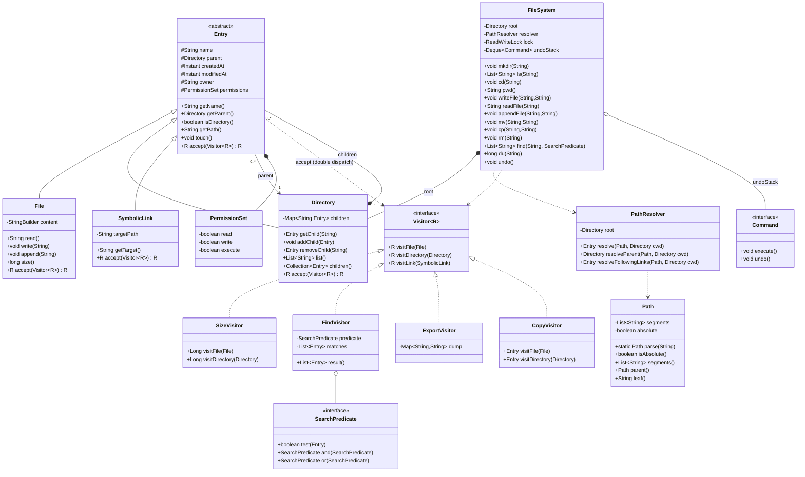
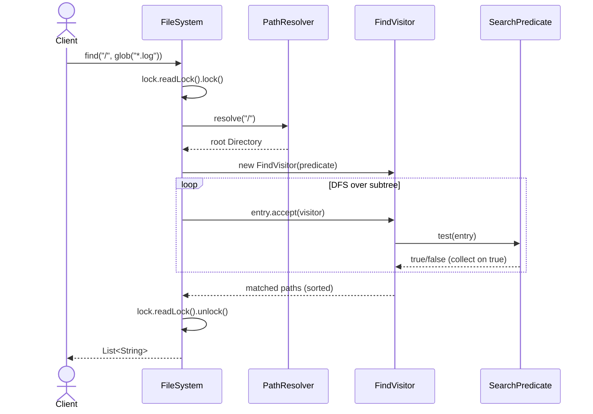

# In-Memory File System — Low-Level Design

> A staff-level LLD / machine-coding reference and last-minute revision artifact.
> Centerpiece pattern: **Composite** (the file/directory tree). Supporting cast: **Visitor**, **Singleton/Facade**, **Strategy**, **Iterator**, **Command (undo)**, and a **Builder** for paths.

---

## PART A — Design Document

### 1. Problem statement

Design an **in-memory file system**: a hierarchical store of **directories** and **files** that lives entirely in process memory (no disk, no DB). It must support the operations a Unix-like shell exposes against a tree of named entries:

- **Navigation & listing:** `mkdir`, `ls`, `cd`, `pwd`.
- **Content:** create/read/append/overwrite file content (`readFile`, `writeFile`, `appendFile`).
- **Mutation:** create, move/rename (`mv`), copy (`cp`), delete (`rm`, recursive).
- **Lookup:** resolve absolute and relative **paths**, including `.` and `..`.
- **Search:** `find` by name / glob / predicate across a subtree.
- **Metadata:** size, created/modified timestamps, type, permissions.

"In-memory" (an *adjacent term*): the entire structure is held in Java objects on the heap. There is no serialization to disk unless we explicitly add a persistence boundary. This frees us from I/O concerns but forces us to think hard about **concurrency** (multiple threads mutating one shared tree) and about a clean **persistence seam** for the inevitable follow-up.

This is the classic problem behind LeetCode 588 ("Design In-Memory File System") and 1166 ("Design File System"), generalized to a full machine-coding round.

---

### 2. Clarifying / requirements questions to ask first

A real round starts here — **never with classes**. I'd group questions so the interviewer can prune scope fast.

**Functional scope**
1. Which commands are in scope? Minimum `mkdir`, `ls`, `addFile/writeFile`, `readFile`, `cd`, `pwd`? Do we also need `mv`, `cp`, `rm -r`, `find`?
2. Are paths **absolute only** (LeetCode style), or do we maintain a **current working directory** and support **relative** paths with `.` / `..`?
3. `ls` semantics: does `ls` on a *file* return just that file's name (LeetCode behavior), and on a *directory* return children **sorted lexicographically**? Do we list hidden/dotfiles?
4. `mkdir` — does it create **intermediate** directories (`mkdir -p`), or fail if the parent is missing?
5. File content model: opaque **string**? Byte array? Append vs. overwrite vs. random-access seek/write at an offset?
6. What happens on conflicts — create a file where a directory exists, `mv` onto an existing target, delete a non-empty directory?

**Non-functional / constraints**
7. **Concurrency:** single-threaded interview toy, or must it be **thread-safe** for many concurrent readers/writers? If concurrent, what consistency do we need (per-node atomicity vs. whole-tree snapshot)?
8. Scale: thousands of entries (fits in memory trivially) or millions (do we care about per-directory lookup being O(1), memory overhead, lazy loading)?
9. Latency targets for `find` / search — is a full subtree walk acceptable, or do we need an index?
10. Is **case sensitivity** Unix-style (case-sensitive) or Windows-style (case-insensitive)?

**Scope-narrowing / extensions to confirm or defer**
11. **Permissions / ownership** (read/write/execute, users, groups)? In or out?
12. **Symbolic / hard links**? (Big design impact — turns a tree into a graph; raises cycle concerns.)
13. **Persistence**: must we snapshot to disk / reload, or is a clean seam for it enough?
14. **Quotas / max file size / max path length**?
15. **Observability**: do we need change notifications / a watch API (inotify-style)?
16. Do we need **undo** of mutating operations?

**My default assumptions (stated, then I build):** full relative-path support with a CWD, `mkdir -p` semantics, string content with append/overwrite, recursive delete, glob `find`, lexicographic `ls`, case-sensitive names, **thread-safe** via a single `ReadWriteLock` on the tree, permissions and symlinks designed-for-but-toggleable, persistence as a Visitor-based export seam, and an optional Command-based undo. I call out where each assumption changes the code.

---

### 3. Finalized requirements & assumptions

**In scope (built in Solution.java):**

| Capability | Detail |
|---|---|
| Tree of entries | `Directory` (has children) and `File` (has content) under a single `root` (`/`). |
| Path resolution | Absolute (`/a/b`) and relative (`a/b`, `.`, `..`) against a per-session CWD. |
| `mkdir(path)` | Creates intermediate dirs (`-p` semantics). Idempotent on existing dirs. |
| `ls(path)` | File → its name; Directory → sorted child names. |
| `writeFile / appendFile / readFile` | String content; auto-creates the file on write; append concatenates. |
| `cd(path)` / `pwd()` | Mutates / reports CWD. |
| `mv(src,dst)` / `cp(src,dst)` | Move (rename + reparent) and deep copy. |
| `rm(path)` | Recursive delete; refuses to delete root. |
| `find(path, predicate/glob)` | Subtree search via Visitor + Strategy. |
| Metadata | name, type, size (computed via Visitor), created/modified `Instant`. |
| Thread-safety | One `ReentrantReadWriteLock` guarding structural ops; reads share, writes exclude. |
| Size computation | **Visitor** that sums file bytes recursively. |
| Undo | **Command** objects recording inverse ops (optional, demoed). |

**Designed-for but feature-flagged (discussed, lightly coded):**
- **Permissions** (`PermissionSet` on each entry; enforced by a checking decorator/guard).
- **Symbolic links** (`SymbolicLink` entry; resolver detects and follows with cycle protection).
- **Persistence** (`ExportVisitor` serializing to a flat map; an importer rebuilds the tree).

**Out of scope (explicitly):** real disk I/O, byte-level random access, multi-user auth, distributed/replicated FS, journaling.

**Key invariants:**
- Exactly one `root`; `root.parent == null`; `root.name == "/"`.
- Every non-root entry has exactly one parent and a unique name **within** that parent.
- A `Directory`'s children map is keyed by name → entry.
- Names may not contain `/` and may not be `""`, `.`, or `..`.

---

### 4. Problem extensions / follow-up variations

This is where senior candidates separate. For each: the ask, and the **design impact**.

| # | Extension (interviewer adds…) | Design impact & how this design absorbs it |
|---|---|---|
| 1 | **`mkdir -p` vs. strict** | A flag on `mkdir`; resolver walks segment-by-segment, creating or failing. Already built `-p`; strict = stop on missing parent. Localized. |
| 2 | **Move / copy** | `mv` = detach node, re-key under new parent (rename = key change in same parent). `cp` = **Composite deep-clone** via a copy-Visitor. Composite makes both uniform across files/dirs. |
| 3 | **Search / `find`** | **Visitor** walks the subtree; a **Strategy** (`SearchPredicate`) decides matches (by name, glob, regex, size, mtime). Adding a new search rule = new Strategy, **zero** changes to the tree (Open/Closed). |
| 4 | **File content read/write, append, seek** | Content lives only on `File`. Append/overwrite are methods; random-access seek would add an offset param and switch content to a `byte[]`/rope. Directories untouched. |
| 5 | **Permissions / ownership** | Add `owner` + `PermissionSet` to `Entry`; a **guard** (decorator around the facade, or a check in each op) throws `AccessDeniedException`. Single Responsibility: enforcement stays out of `Directory`/`File`. |
| 6 | **Symbolic links** | New `SymbolicLink extends Entry` storing a target path. The **path resolver** follows links, with a hop counter to break cycles (`ELOOP`). Tree becomes a DAG/graph for traversal — Visitor must track visited to avoid infinite loops. |
| 7 | **Hard links** | Multiple directory entries point to the **same** `File` object; size accounting must dedupe by identity (Visitor tracks a `visited` set). Delete decrements a link count; node freed at zero. |
| 8 | **Concurrency / multi-thread** | Swap the single `ReadWriteLock` for **finer-grained per-directory locks** with consistent lock ordering (parent-before-child) to avoid deadlock; or copy-on-write snapshots for lock-free reads. |
| 9 | **Persistence / snapshot & restore** | **ExportVisitor** flattens tree → `(path, type, content, meta)` records; an importer replays them. The Visitor keeps serialization logic out of entities (SRP) and lets us add formats (JSON, binary) as new Visitors. |
| 10 | **Quotas / max size** | A `QuotaPolicy` (**Strategy**) consulted on write; rejects when a directory subtree exceeds its cap. Subtree size already available from the size-Visitor. |
| 11 | **Watch / change notifications** | **Observer**: entries publish create/modify/delete events; watchers subscribe to a path prefix. Mutating ops fire events after the lock is released. |
| 12 | **Undo / redo** | **Command** pattern: each mutating op returns a `Command` with `execute`/`undo`; a stack gives undo/redo. Demoed in Solution.java. |
| 13 | **Pluggable storage backend (memory vs. disk)** | Hide the tree behind a `FileSystem` **Facade**; back it with a `StorageEngine` interface. In-memory engine today; a disk/DB engine later — callers unchanged (Dependency Inversion). |

---

### 5. Core entities, responsibilities & relationships

**`Entry` (abstract)** — the Composite *component*. Common state: `name`, `parent`, `createdAt`, `modifiedAt`, `owner`, `permissions`. Common behavior: `isDirectory()`, `getPath()`, `accept(Visitor)`. Defines the uniform type clients program against.

**`File extends Entry`** — Composite *leaf*. Holds `content` (string/bytes). Knows its own size. No children.

**`Directory extends Entry`** — Composite *composite*. Holds `Map<String,Entry> children` (sorted or hashed). Operations to add/get/remove/list children. A directory's "size" is the recursive sum of its descendants (computed by the Visitor, not stored).

**`SymbolicLink extends Entry`** *(extension)* — Composite leaf-ish node holding a `targetPath`; resolved by the path resolver, not by holding children.

**`Path`** — value object: parses a string into segments, marks absolute vs. relative, normalizes. Immutable. (A small **Builder**/parser keeps parsing in one place.)

**`PathResolver`** — turns a `Path` + CWD into an `Entry` (or the parent + leaf-name for create ops). Handles `.`, `..`, missing segments, and (extension) symlink following with cycle limits. **Single Responsibility:** all path logic lives here, not scattered across `Directory`.

**`Visitor` + concrete visitors** — `SizeVisitor` (recursive byte sum), `FindVisitor` (collect matches per a `SearchPredicate`), `ExportVisitor` (serialize), `CopyVisitor` (deep clone). Adds operations over the tree **without touching** entry classes (Open/Closed).

**`SearchPredicate` (Strategy)** — `byName`, `glob`, `regex`, `largerThan`, `modifiedAfter`, composable with `and`/`or`. Decouples *what to match* from *how to walk*.

**`FileSystem` (Facade / single entry point)** — exposes the shell-like API (`mkdir`, `ls`, `cd`, `pwd`, `writeFile`, `readFile`, `mv`, `cp`, `rm`, `find`). Owns the `root`, the locking, and (optionally) the undo stack. A `Session` (or the facade itself) owns the CWD.

**`Command` (extension)** — `MkdirCommand`, `WriteCommand`, `RemoveCommand`, … each with `execute`/`undo`, pushed onto an undo stack.

**Relationships (text UML):**
```
Entry <|-- File
Entry <|-- Directory
Entry <|-- SymbolicLink        (extension)
Directory "1" *-- "0..*" Entry      (composition: children owned by directory)
Entry "0..*" --> "1" Directory      (association: child -> parent)
FileSystem "1" *-- "1" Directory    (owns root)
FileSystem ..> PathResolver         (uses)
FileSystem ..> Visitor              (uses: size/find/export)
PathResolver ..> Path               (uses)
FindVisitor o-- SearchPredicate     (Strategy)
FileSystem o-- Command              (undo stack; extension)
Entry ..> Visitor                   (accept: double-dispatch)
```

---

### 6. Design patterns applied

For each: **where**, **why**, **rejected alternative**, **when *not* to use**, plus **SOLID** in play.

#### 6.1 Composite — the centerpiece
- **Where:** `Entry` (component), `File` (leaf), `Directory` (composite holding children).
- **Why:** clients treat a single file and an entire directory subtree **uniformly** — `getPath()`, `accept(visitor)`, delete, copy all work on `Entry`. This is the natural model of a recursive filesystem tree.
- **Rejected alternative:** two unrelated classes with `instanceof` checks everywhere, or a single "node" class with a nullable children list. Both leak type-checks into every operation and violate Open/Closed.
- **When *not* to:** if there were no part–whole hierarchy (e.g., a flat key→blob store like S3 *keys*), Composite is overkill; a `Map<String,Blob>` suffices.
- **SOLID:** **LSP** (any `Entry` substitutes for the base in traversal); **OCP** (new entry types like `SymbolicLink` slot in).

#### 6.2 Visitor — operations over the tree without bloating entities
- **Where:** `SizeVisitor`, `FindVisitor`, `ExportVisitor`, `CopyVisitor`; `Entry.accept(Visitor)` does double-dispatch.
- **Why:** size, search, serialize, clone are **cross-cutting traversals**. Putting each as a method on `File`/`Directory` would bloat them and force edits to entity classes for every new operation. Visitor centralizes one operation per class and adds operations freely.
- **Rejected alternative:** a `recursiveSize()`/`recursiveCopy()`/`recursiveExport()` method on `Directory`. Works, but every new traversal edits the entities (OCP violation) and mixes unrelated concerns (SRP).
- **When *not* to:** if the set of entry types changes often but operations are stable, Visitor's tradeoff inverts (adding a new `Entry` type forces editing every visitor) — then prefer methods on the entries. Here, *operations* grow faster than *types*, so Visitor wins.
- **SOLID:** **OCP** (add `BackupVisitor` without touching `File`/`Directory`); **SRP** (each visitor = one job).

#### 6.3 Strategy — pluggable search/match (and quota) policy
- **Where:** `SearchPredicate` used by `FindVisitor`; `QuotaPolicy` (extension) on write.
- **Why:** *what counts as a match* (name, glob, regex, size, mtime) is a family of interchangeable algorithms, composable with `and`/`or`. Decoupled from *how we traverse* (the Visitor).
- **Rejected alternative:** flags/enums + a giant `switch` inside `find`. Adding a rule edits that switch (OCP violation) and the rules can't compose.
- **When *not* to:** if there's exactly one fixed matching rule forever, a plain method is simpler.
- **SOLID:** **OCP**, **DIP** (`FindVisitor` depends on the `SearchPredicate` abstraction).

#### 6.4 Facade — `FileSystem` as the single, simple entry point
- **Where:** `FileSystem` wraps root, resolver, locking, visitors, undo behind shell-like methods.
- **Why:** callers shouldn't juggle `PathResolver`, `Directory.children`, lock acquisition, and Visitor wiring. The facade gives a small, intention-revealing API and a place to enforce locking/permissions consistently.
- **Rejected alternative:** expose `Directory`/`PathResolver` directly. Leaks internals, scatters locking, makes thread-safety unenforceable.
- **When *not* to:** for a library meant to be composed in many ways, an over-eager facade can hide needed flexibility — but here the API surface is well-defined.
- **SOLID:** **SRP** (orchestration in one place), **DIP** (callers depend on the facade, not the tree internals).

#### 6.5 Singleton — *considered, used sparingly*
- **Where:** at most a single default `FileSystem` instance for a process, exposed via `FileSystem.getDefault()`; the real construction stays injectable.
- **Why:** a process often wants exactly one mounted FS, and tests/CLI grab the same handle.
- **Rejected alternative / caution:** a hard `enum` singleton with global mutable state hurts testability and concurrency. I keep the **constructor public and inject** the instance, offering Singleton only as a convenience accessor — avoiding the classic Singleton anti-pattern (hidden global state). This is the honest senior answer: "Singleton is *available* but I prefer DI."
- **When *not* to:** whenever you need multiple isolated filesystems (tests, multi-tenant) — then never route through the global.
- **SOLID:** preserves **DIP** by keeping injection as the primary path.

#### 6.6 Command — undo/redo of mutations *(extension)*
- **Where:** `MkdirCommand`, `WriteCommand`, `RemoveCommand`, `MoveCommand`, each `execute`/`undo`; an undo stack on the facade.
- **Why:** turns each mutating op into a reversible object → free undo/redo, op logging, and (future) transactional batching.
- **Rejected alternative:** ad-hoc inverse logic sprinkled in the facade. Hard to compose and to redo.
- **When *not* to:** if undo is never required, the indirection is dead weight.
- **SOLID:** **SRP** (each command owns its do/undo), **OCP** (new ops = new command classes).

#### 6.7 Iterator — uniform traversal *(supporting)*
- **Where:** a depth-first `Iterator<Entry>` over a subtree, reused by visitors and `find`.
- **Why:** one well-tested traversal; visitors/predicates consume entries without re-implementing recursion.
- **Rejected alternative:** copy-pasted recursion in each visitor.
- **SOLID:** **SRP**, **DRY**.

#### 6.8 (Mention) Builder / value object — `Path`
- **Where:** `Path` parses/normalizes a string once; immutable.
- **Why:** centralize parsing of `/`, `.`, `..`, trailing slashes; avoid string-bashing scattered everywhere.

**Patterns explicitly *not* used (anti-pattern-stuffing guard):** Flyweight (entries aren't numerous/identical enough), Abstract Factory (single concrete tree, no product families), Proxy as a separate class beyond the permission guard. I name these to show restraint.

---

### 7. Class diagram



**Brief text UML / key public APIs:**

```
FileSystem (Facade)
  void          mkdir(String path)            // -p semantics
  List<String>  ls(String path)               // file->[name]; dir->sorted children
  void          cd(String path)               // updates CWD
  String        pwd()                          // absolute path of CWD
  void          writeFile(String path, String content)   // create+overwrite
  void          appendFile(String path, String content)
  String        readFile(String path)
  void          mv(String src, String dst)
  void          cp(String src, String dst)     // deep copy via CopyVisitor
  void          rm(String path)                // recursive
  long          du(String path)                // size via SizeVisitor
  List<String>  find(String base, SearchPredicate p)     // Visitor + Strategy
  void          undo()                         // Command

Entry (Component)        : getName, getPath, isDirectory, accept(Visitor), touch
File (Leaf)              : read, write, append, size
Directory (Composite)    : addChild, getChild, removeChild, list, children
Visitor<R>               : visitFile, visitDirectory, visitLink
SearchPredicate          : test, and, or  (Strategy; static factories byName/glob/regex/largerThan)
PathResolver             : resolve, resolveParent (handles '.', '..', symlinks)
Path                     : parse, isAbsolute, segments, parent, leaf
```

---

### 8. Key flows

**Flow A — `writeFile("/a/b/c.txt", "hi")` (create-intermediate + create file):**
1. Acquire **write lock**.
2. `Path.parse("/a/b/c.txt")` → absolute, segments `[a,b,c.txt]`.
3. `resolver.resolveParent(path, cwd)` walks `/ → a → b`, **creating** missing dirs (`-p`); validates each existing segment is a directory.
4. In parent `b`, look up `c.txt`; if absent create a `File`, else reuse; set `content`, `touch()` timestamps.
5. (Extension) check `PermissionSet.write` on parent and on file; push a `WriteCommand` for undo.
6. Release lock.

**Flow B — `find("/", byName("*.log").and(largerThan(1024)))`:**
1. Acquire **read lock**.
2. Resolve base → `Entry`.
3. Build `FindVisitor(predicate)`; DFS the subtree (Iterator), calling `entry.accept(visitor)`.
4. Each node: `predicate.test(entry)` → collect path if true. Symlinks/hardlinks tracked in a `visited` set to avoid cycles/double counting.
5. Return sorted matching paths; release lock.

**Flow C — `du("/projects")` (size via Visitor):**
1. Read lock → resolve `/projects` → `SizeVisitor`.
2. `accept`: `visitDirectory` sums `visitFile` over leaves recursively; hard-linked files counted once via identity set.
3. Return total bytes.

```mermaid
sequenceDiagram
    actor Client
    participant FS as FileSystem (Facade)
    participant R as PathResolver
    participant D as Directory(parent)
    participant F as File
    Client->>FS: writeFile("/a/b/c.txt","hi")
    FS->>FS: lock.writeLock().lock()
    FS->>R: resolveParent(/a/b/c.txt, cwd)
    R->>D: walk /a/b creating missing dirs (-p)
    R-->>FS: parent Directory b
    FS->>D: getChild("c.txt")
    alt missing
        FS->>F: new File("c.txt"); D.addChild(F)
    end
    FS->>F: write("hi"); touch()
    FS->>FS: undoStack.push(WriteCommand)
    FS->>FS: lock.writeLock().unlock()
    FS-->>Client: void
```



---

### 9. Concurrency, edge cases & extensibility

**Concurrency / thread-safety**
- **Baseline (built):** one `ReentrantReadWriteLock` on the `FileSystem`. Reads (`ls`, `readFile`, `find`, `du`) take the **read lock** (shared); mutations (`mkdir`, `write`, `mv`, `cp`, `rm`) take the **write lock** (exclusive). Simple, correct, and adequate for an interview. CWD is per-`Session` (or thread-local) so navigation doesn't contend.
- **Why a single lock first:** the tree is one shared mutable structure; coarse locking is the *correct-by-inspection* baseline. I'd state the tradeoff: it serializes all writes globally.
- **Scaling up (discuss):**
  - **Per-directory locks** with a strict **lock ordering** (always parent before child, or order by path) to prevent deadlock during `mv`/`cp` that touch two subtrees. Acquire both endpoints' locks in canonical order.
  - **Copy-on-write / immutable snapshots:** readers get a lock-free consistent view; writers swap an atomic root reference. Great read throughput, costs write amplification.
  - Use `ConcurrentHashMap` for `Directory.children` if going lock-free per node; but cross-node invariants (rename + reparent) still need a higher-level guard.
- **Atomicity:** `mv` must be atomic — under coarse lock it already is; under fine locks, lock src-parent and dst-parent in order, validate no cycle (can't move a dir into its own descendant), then swap.

**Edge cases (and handling):**
- Root: `rm("/")` rejected; `cd("/")` resets to root; `pwd()` of root is `/`.
- `..` above root: clamp to root (Unix behavior).
- `.` segments: skipped during normalization.
- Name collisions: creating a file where a dir exists (or vice versa) → `IllegalStateException`/`FileAlreadyExistsException`.
- `mv` onto existing target: define policy (reject vs. overwrite); we reject by default.
- `mv` a directory into its own subtree → cycle → reject.
- Non-existent path on read/ls → `NoSuchFileException`.
- Empty path / `""` / names containing `/` → `IllegalArgumentException`.
- `ls` on a file → returns `[fileName]` (LeetCode parity).
- Trailing slashes / duplicate slashes normalized by `Path.parse`.
- Symlink cycles → resolver hop counter (`ELOOP`).
- Hard-link size double counting → identity `visited` set in `SizeVisitor`.
- Concurrent delete during read → read lock prevents torn reads; a deleted-then-accessed path → `NoSuchFileException`.

**Extensibility recap (how §4 lands):**
- New operation over the tree → **new Visitor**, no entity edits.
- New search rule → **new SearchPredicate**, composable.
- New entry type (symlink, device, pipe) → **subclass Entry** + a visitor method.
- Permissions / quotas → **guard + Strategy** at the facade; entities stay clean.
- Persistence → **ExportVisitor** + importer; swap backends behind the facade (DIP).
- Finer concurrency → swap the lock strategy behind the facade; callers unchanged.

---

### 10. Likely interview questions

**Q1. Why is Composite the right core, and what does it buy you?**
A part–whole hierarchy where leaves (files) and composites (directories) share a uniform interface (`Entry`). It lets every operation — path, delete, copy, traverse — work on `Entry` without `instanceof`, and lets new node types (symlink) slot in. The buy: uniform recursion and Open/Closed extensibility.

**Q2. Why Visitor over methods on `File`/`Directory`?** *(senior-signal)*
Operations (size, find, export, copy, backup) grow faster than node types here. Visitor keeps each operation in one class and adds operations without editing entities (OCP, SRP). The tradeoff I'd state aloud: if *types* changed more often than *operations*, Visitor inverts badly (every new type edits every visitor) — then I'd put methods on the entities. I pick based on the change axis.

**Q3. How do you compute directory size, and what's tricky?**
A `SizeVisitor` recursively sums file bytes. Tricky bits: hard links (count the underlying file once — track identity in a `visited` set) and symlinks (don't follow into cycles; typically count the link's own small size, not the target). Computed on demand, not stored, to avoid invalidation bugs — though I'd cache with dirty-propagation if `du` is hot.

**Q4. Make it thread-safe. Walk me through your choices.** *(senior-signal)*
Start with a single `ReentrantReadWriteLock`: shared reads, exclusive writes — correct and simple. State the cost: global write serialization. Scale path: per-directory locks with parent-before-child ordering to avoid deadlock (critical for `mv`/`cp` touching two subtrees), or copy-on-write snapshots for lock-free reads. I'd choose based on read/write ratio and contention.

**Q5. How does `mv` stay correct and atomic, especially moving a directory?**
Resolve src and dst parents; reject if dst exists (policy) or if dst is inside src's own subtree (cycle). Under the write lock the detach+reattach is atomic. Under fine-grained locks, acquire both parents' locks in canonical order, re-validate, then re-key. Rename is the special case of `mv` within the same parent (just change the map key + `name`).

**Q6. Add symbolic links. What breaks and how do you handle cycles?**
Add `SymbolicLink extends Entry` holding a target path; the resolver follows it. The tree becomes a graph, so traversal/visitors must track visited and the resolver must cap hops (`ELOOP`) to break `a -> b -> a`. Size/`find` decide whether to follow links (configurable). `Entry`/`Directory` need no changes beyond a new visitor method — Composite + Visitor absorb it.

**Q7. Add permissions without polluting the entity classes.** *(senior-signal)*
Put `owner` + `PermissionSet` on `Entry` (state), but enforce in a **guard** at the facade (or a decorator around it) that checks before each op and throws `AccessDeniedException`. Enforcement is a separate responsibility (SRP) and pluggable (different policies for different mounts). Entities don't grow `if (canRead)` checks.

**Q8. How would you persist and restore the in-memory FS?**
An `ExportVisitor` flattens the tree into `(path, type, content, metadata)` records (JSON/binary); an importer replays them to rebuild. Keeping serialization in a Visitor (not in entities) honors SRP and lets us add formats as new visitors. Behind the `FileSystem` facade we can later swap the in-memory `StorageEngine` for a disk-backed one with callers unchanged (DIP).

**Q9. Implement `find` with name + size + time filters. Design?**
A `FindVisitor` (traversal) parameterized by a `SearchPredicate` Strategy. Predicates: `byName`, `glob`, `regex`, `largerThan`, `modifiedAfter`, composed with `and`/`or`. New rule = new predicate, no change to the walk (OCP). Glob compiles to a regex once.

**Q10. Is Singleton appropriate for `FileSystem`?** *(senior-signal)*
Tempting (one mounted FS per process) but risky: global mutable state hurts tests and multi-tenancy. I keep the constructor public and **inject** the FS; I offer `getDefault()` only as a convenience. This dodges the Singleton anti-pattern while acknowledging the single-instance use case. For multiple isolated filesystems (tests), never route through the global.

**Deep-probe follow-ups:**
- *"Your read lock is held during a huge `find` — readers block all writers for seconds. Fix it."* → Copy-on-write snapshot of the subtree root reference so the walk runs lock-free on an immutable view; or chunk the walk and re-acquire, accepting weaker consistency.
- *"Two threads `mkdir -p /a/b/c` concurrently."* → Under the write lock it's serialized and idempotent. Lock-free version: use `children.computeIfAbsent` per segment so the loser reuses the winner's directory.
- *"`cp` of a 1M-node tree blocks everything."* → Deep-clone under a read lock of the source (CopyVisitor) into a detached subtree, then attach under a brief write lock — minimizing the exclusive window.

---

## PART C — Cheat-sheet & self-test

**Patterns & key decisions (recap):**
- **Composite** = the spine: `Entry`/`File`/`Directory`; uniform ops, easy new node types.
- **Visitor** = operations over the tree (`Size`, `Find`, `Export`, `Copy`) without editing entities — chosen because operations grow faster than types.
- **Strategy** = `SearchPredicate` (and `QuotaPolicy`): pluggable, composable match rules.
- **Facade** = `FileSystem`: one shell-like API; owns locking + undo; the seam for permissions/persistence/concurrency swaps.
- **Singleton** = offered as `getDefault()` only; DI is the primary path (anti-pattern avoided).
- **Command** = reversible mutations → undo/redo.
- **Iterator / Path value-object** = single DFS traversal; centralized path parsing.
- **Concurrency** = `ReentrantReadWriteLock` baseline (shared reads / exclusive writes); scale via per-directory ordered locks or COW snapshots.
- **SOLID** = OCP (visitors/strategies/new entries), SRP (resolver, visitors, guard each one job), LSP (Entry substitutability), DIP (callers depend on the facade/abstractions).

**5 self-test questions (no answers):**
1. If the interviewer says "no relative paths, absolute only (LeetCode 588)," which classes disappear or simplify, and what's the minimal design?
2. Sketch the lock-acquisition order for `mv("/a/x","/b/x")` under per-directory locks, and prove it can't deadlock against `mv("/b/y","/a/y")`.
3. You must support **hard links** with correct `du` and reference-counted deletion — what changes in `Directory`, `File`, `SizeVisitor`, and `rm`?
4. Add a **watch API** (notify on changes under a path prefix). Which pattern, where do events fire relative to the lock, and how do you avoid notifying while holding the write lock?
5. Convert the design to **copy-on-write** for lock-free reads: what becomes immutable, how does a writer publish a new version, and what's the memory/GC cost?
