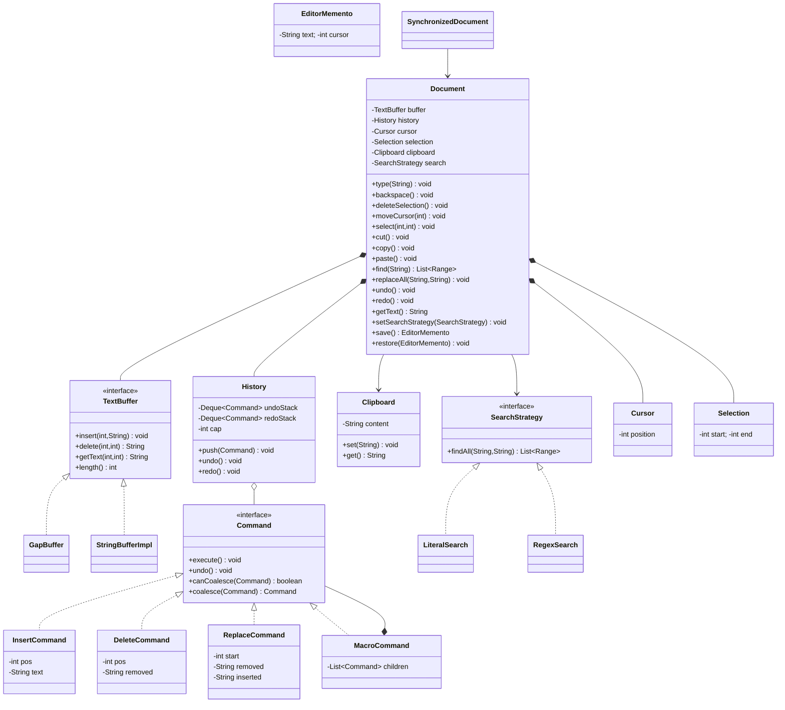

# LLD: Text Editor (with Undo/Redo)

> A staff-level low-level-design walkthrough and machine-coding revision artifact.
> Reader profile: senior Java engineer who knows OOP + GoF patterns and wants to see
> *applied* patterns with justification, SOLID, and production-quality code.

---

## PART A — Design Document

### 1. Problem statement

Design the core of a **text editor** — the in-memory document model and the operations a
user performs against it — with first-class **undo/redo**. The editor must support:

- Inserting and deleting text at a cursor position.
- A **cursor** and a **selection** (a contiguous range).
- **Cut / copy / paste** via a clipboard.
- **Find / replace** (literal and, as an extension, regex).
- Reversible **undo** and re-applicable **redo** of every mutating operation.
- An **efficient text buffer** so edits in the middle of a large document are not O(n) per keystroke.

We are designing the *model and command layer* of an editor (think the "engine" behind a
widget like a `JTextArea`, VS Code's text model, or a terminal editor's buffer), **not** the
rendering/GUI layer. The deliverable is the object model, the command pipeline, and the history
machinery — the parts an interviewer actually probes in an LLD round.

> **Adjacent term — "buffer":** the in-memory representation of the document's characters.
> A naive buffer is a single `String`/`char[]`; production editors use smarter structures
> (gap buffer, piece table, rope) so localized edits don't copy the whole document.

---

### 2. Clarifying / requirements questions to ask first

Before writing a single class, I'd ask the interviewer:

**Functional scope**
1. Is this a **plain-text** editor or do we need **rich text** (bold, fonts, colors)? Plain text changes the buffer; rich text needs spans/attributes.
2. Which operations must be **undoable**? Just insert/delete, or also cursor moves, find/replace, paste?
3. Is undo **linear** (single stack) or do we need **branching/tree** undo (like Vim's undo tree)?
4. Do we need **multi-level** undo/redo, or just one step? What's the max history depth (bounded or unbounded)?
5. Should **redo** be cleared the moment the user types after an undo (standard editor behavior)? (Almost always yes.)
6. Do we group keystrokes into one undo unit (typing "hello" = 1 undo) or is every char its own step? (i.e. do we need **command coalescing / transactions**?)
7. Cut/copy/paste: is the clipboard **internal** to the app or the **system clipboard**? Single entry or a **clipboard ring/history**?
8. Find/replace: case-sensitive toggle? whole-word? **regex**? replace-all vs replace-next? wrap-around search?
9. Single cursor or **multiple cursors / multiple selections** (modern editors)?

**Non-functional / scale**
10. Expected document size — a few KB, or multi-MB source files / logs? This decides buffer structure.
11. Edit pattern — mostly appends, or heavy random-access edits? (append-only favors different structures than scattered edits.)
12. **Concurrency:** single-user single-thread (typical desktop editor), or is the model accessed from multiple threads (autosave thread, background indexer, **collaborative editing**)?
13. Latency target per keystroke (must feel instant — sub-millisecond for typical edits).
14. Memory budget — can we afford snapshot-per-edit (Memento) or must undo be diff-based?

**Out of scope (confirm)**
15. Rendering, syntax highlighting, file I/O / persistence format, network/CRDT collaboration — in or out? (I'll assume **out**, but design a clean boundary so they can be added.)

**Assumed answers (stated so the design is concrete):** plain text; insert/delete/replace/paste are undoable; **linear** multi-level undo with **unbounded-but-capped** depth; redo cleared on new edit; typing coalesces into runs; **internal** single-entry clipboard (with a ring as an extension); find/replace literal with case toggle (regex as extension); single cursor + single selection (multi-cursor as extension); documents up to a few MB; predominantly local edits; **single-threaded model** with an optional thread-safe façade; persistence/collaboration out of scope but bounded.

---

### 3. Finalized requirements & assumptions

**Functional**
- `insert(text)` at cursor (replacing selection if one exists).
- `delete(count)` / backspace / delete selection.
- `replaceRange(start, end, text)` primitive that other ops build on.
- Cursor movement and selection (set/clear/extend).
- `cut`, `copy`, `paste` against an internal clipboard.
- `find(pattern)` returning match ranges; `replace`/`replaceAll`.
- `undo()` / `redo()`, multi-level, with run coalescing for typing.

**Non-functional**
- Edits at an arbitrary position should be ~O(edit size + small local shift), not O(document size), via a **gap buffer**.
- Undo/redo O(1) push/pop; memory bounded by a configurable history cap.
- Deterministic, side-effect-isolated commands (each command is the single owner of its inverse).
- Model is single-threaded by default; a `SynchronizedDocument` decorator provides coarse-grained thread safety when needed.

**Assumptions**
- Indices are character offsets into a logical sequence `[0, length]`. Cursor sits *between* characters.
- A selection is a half-open range `[start, end)` with `start <= end`.
- Undo restores both text **and** the cursor/selection that existed before the edit (good UX).

---

### 4. Problem extensions / follow-up variations

Interviewers love to bolt these on. For each: what it is and how the design absorbs it.

| Extension | What it adds | Design impact |
|---|---|---|
| **Undo/redo** (core) | Reverse/replay edits | `Command` + inverse, two `Deque`s as history. Already first-class. |
| **Cut / copy / paste** | Clipboard interaction | Cut = copy + delete = a **MacroCommand** (composite). Copy is non-mutating (no history entry). Paste = insert. No new core machinery. |
| **Find / replace** | Search + bulk edit | Search is read-only via a `SearchStrategy`. Replace/ReplaceAll = a `MacroCommand` of delete+insert so one Ctrl+Z reverts the whole replace-all. |
| **Efficient buffer** | Gap buffer / rope / piece table | Hidden behind a `TextBuffer` interface (Bridge/Strategy). Commands never touch the structure directly, so swapping it is local. |
| **Cursor & selection** | Caret + range, selection-aware ops | `Cursor`/`Selection` value objects; commands capture & restore them. |
| **Command coalescing / transactions** | Group keystrokes; "begin/end edit" | A `CompositeCommand` accumulator + a coalescing rule on `History.push` (merge consecutive same-kind inserts). |
| **Bounded history** | Cap memory | `History` evicts oldest from the bottom of the undo deque past a cap. |
| **Multi-cursor** | N carets, edit at each | Replace single `Cursor` with `List<Cursor>`; an edit becomes a `MacroCommand` over carets (apply right-to-left to keep offsets valid). |
| **Branching undo (undo tree)** | Non-linear history | Swap the two stacks for a tree of `HistoryNode`s; navigation picks a child instead of pop. |
| **Regex find/replace** | Pattern matching | New `SearchStrategy` impl (`RegexSearch`) — Strategy pattern pays off; no other change. |
| **Persistence / autosave** | Save to disk | `Memento` snapshots + a background saver; or serialize the command log (event sourcing). |
| **Collaborative editing** | Concurrent multi-user edits | Out of scope but bounded: commands carry offsets that need **operational transform (OT)** or **CRDT** to merge; our linear undo no longer suffices — see §9. |

---

### 5. Core entities, responsibilities & relationships

| Entity | Responsibility |
|---|---|
| `TextBuffer` (interface) | The character store. `insert(pos, str)`, `delete(pos, len)`, `getText(start,end)`, `length()`, `charAt`. |
| `GapBuffer` (impl) | Efficient mutable buffer: amortized cheap edits near a moving "gap". |
| `StringBufferImpl` (impl) | Simple `StringBuilder`-backed buffer (baseline / for comparison). |
| `Cursor` | A caret position (offset). |
| `Selection` | A range `[start,end)`; may be empty (no selection). |
| `Document` | The aggregate root. Owns the buffer, cursor, selection, clipboard, and `History`. Exposes user-level ops and **issues commands** through history. |
| `Command` (interface) | A reversible operation: `execute()`, `undo()`. The unit of undo/redo. |
| `InsertCommand`, `DeleteCommand`, `ReplaceCommand` | Concrete edits; each captures enough state to invert itself. |
| `MacroCommand` (Composite) | A command made of sub-commands (cut, replace-all). Undo replays children in reverse. |
| `History` | The undo/redo engine: two `Deque<Command>`, push/undo/redo, coalescing, capping. |
| `Clipboard` | Holds copied text (single entry; ring as extension). |
| `SearchStrategy` (interface) | `findAll(text, pattern)` → ranges. Impls: `LiteralSearch`, `RegexSearch`. |
| `EditorMemento` | Snapshot of document state (for snapshot-based undo / autosave). |
| `SynchronizedDocument` (Decorator) | Thread-safe wrapper around `Document`. |

**Relationships (text UML)**

```
Document ◆── TextBuffer        (composition: document owns its buffer)
Document ◆── History           (composition)
Document ◆── Cursor, Selection (composition)
Document ──> Clipboard         (association)
Document ──> SearchStrategy    (strategy, swappable)
History  ◇── Command           (aggregation: stacks hold commands)
Command  <|.. InsertCommand, DeleteCommand, ReplaceCommand, MacroCommand   (realization)
MacroCommand ◆── Command       (composite: holds children)
TextBuffer <|.. GapBuffer, StringBufferImpl
SearchStrategy <|.. LiteralSearch, RegexSearch
Command ──> Document           (commands act on the document/buffer they were given)
SynchronizedDocument ──> Document (decorator delegates)
```

---

### 6. Design patterns applied

For each: **where**, **why**, **rejected alternative**, **when *not* to use it**, plus the SOLID principle it serves.

**1. Command — the edit operations (`InsertCommand`, `DeleteCommand`, `ReplaceCommand`).**
- *Where/why:* Every mutating action is reified as an object that knows how to `execute()` and `undo()` itself. This is the backbone of undo/redo: the history is just a stack of commands. Encapsulating the request lets us queue, log, coalesce, and reverse it.
- *Rejected alternative:* **Snapshot-only (Memento) undo** — snapshot the whole document before each edit and restore on undo. Simpler to write but O(document size) memory **and** time per edit; unusable for large files and rapid typing. We keep Memento for *coarse* snapshots (autosave) where its simplicity wins.
- *When not to use:* if there were only one global "revert to last save" with no granular steps, Command is overkill — a single snapshot suffices.
- *SOLID:* **Open/Closed** (add a new edit type without touching history), **Single Responsibility** (each command owns exactly one reversible operation).

**2. Memento — `EditorMemento` for snapshot state.**
- *Where/why:* For autosave / "restore session" and as the diff baseline, capture document state without exposing internals (the buffer stays encapsulated). Also the clean way to save/restore cursor+selection around a command.
- *Rejected alternative:* exposing buffer internals so the caller copies them — breaks encapsulation, couples savers to the buffer impl.
- *When not to use:* per-keystroke undo (too heavy) — that's Command's job.
- *SOLID:* **Single Responsibility / encapsulation** — the originator controls what's snapshotted.

**3. Strategy — `SearchStrategy` (literal vs regex) and the `TextBuffer` family.**
- *Where/why:* Search algorithm and buffer representation are interchangeable behaviors. `Document` depends on the `SearchStrategy` / `TextBuffer` **interface**, so we swap literal↔regex or gap-buffer↔rope without touching the document.
- *Rejected alternative:* `if (regex) … else …` branches scattered through the document — violates OCP, grows untestable.
- *When not to use:* if there will only ever be one algorithm, an interface is premature abstraction.
- *SOLID:* **Open/Closed**, **Dependency Inversion** (Document depends on abstractions).

**4. Composite — `MacroCommand`.**
- *Where/why:* Cut (= copy + delete) and Replace-All (= many delete+insert) must undo/redo as **one** user step. `MacroCommand` *is-a* `Command` containing child commands; undo replays children in reverse. Client treats a group exactly like a leaf command.
- *Rejected alternative:* special-casing groups inside `History` — leaks composition into the engine; the engine should only ever see "a Command".
- *When not to use:* truly atomic single edits — wrapping them adds noise.
- *SOLID:* **Liskov Substitution** (a macro is usable anywhere a command is), **OCP**.

**5. Decorator — `SynchronizedDocument`.**
- *Where/why:* Add thread safety without polluting the single-threaded `Document` with locks. Wrap and delegate under a lock; callers that need it opt in.
- *Rejected alternative:* `synchronized` on every `Document` method always-on — pays locking cost even in the common single-thread case and bakes a concurrency policy into the core.
- *When not to use:* if the model is *always* multi-threaded, build locking in directly; if *always* single-threaded, skip it.
- *SOLID:* **Single Responsibility** (concurrency concern separated), **OCP**.

**6. (Light) Facade — `Document`.**
- *Where/why:* `Document` is the simple front for buffer + history + clipboard + search. Callers say `doc.type("hi")`, not "create InsertCommand, push to history, execute". Hides the command plumbing.
- *Rejected alternative:* exposing the command/history API directly to UI code — couples the UI to internals.
- *SOLID:* **Interface Segregation** (UI sees a small, intent-level API).

**Bridge note:** `TextBuffer` also reads as a Bridge — it decouples the document's *abstraction* (operations) from the buffer's *implementation* (gap/rope), letting both vary independently. In an LLD round I'd call it Strategy (we *swap* a behavior) but acknowledge the Bridge framing.

---

### 7. Class diagram



**Key public APIs / method signatures**

```java
// Buffer
interface TextBuffer {
    void insert(int pos, String s);
    String delete(int pos, int len);   // returns removed text (for undo)
    String getText(int start, int end);
    int length();
    char charAt(int i);
}

// Command
interface Command {
    void execute();
    void undo();
    default boolean canCoalesce(Command next) { return false; }
    default Command coalesce(Command next) { throw new UnsupportedOperationException(); }
}

// History
void push(Command c);     // executes-then-stores or stores already-executed; clears redo
void undo();              // pop undo → c.undo() → push to redo
void redo();              // pop redo → c.execute() → push to undo

// Document (facade)
void type(String s); void backspace(); void deleteSelection();
void cut(); void copy(); void paste();
List<Range> find(String pattern); void replaceAll(String find, String repl);
void undo(); void redo();
EditorMemento save(); void restore(EditorMemento m);
```

---

### 8. Key flows

**Typing a character (with coalescing)**
1. `Document.type("h")` — if a selection exists, first issue a `DeleteCommand` for it (as part of a macro).
2. Build `InsertCommand(cursorPos, "h")`.
3. `History.push(cmd)`: execute it (buffer.insert, advance cursor), **clear the redo stack**, then try to **coalesce** with the top of the undo stack — if the previous command was a contiguous insert of typed chars, merge into one (so "hello" undoes in a single step); else push as a new entry, evicting the oldest if over the cap.

**Undo**
1. `History.undo()` pops the top command.
2. `cmd.undo()` reverses the buffer change and restores the saved cursor/selection.
3. Push the command onto the redo stack.

**Cut (composite)**
1. `copy()` writes the selected text to the clipboard (non-mutating, no history entry).
2. Build `MacroCommand[ DeleteCommand(selection) ]` (here a single child, but the macro pattern generalizes).
3. `history.push(macro)` executes & records it as one undo step.

**Replace-All**
1. `search.findAll(text, pattern)` → list of ranges.
2. Walk ranges **right-to-left** (so earlier offsets stay valid) building a `ReplaceCommand` per match.
3. Wrap them in a `MacroCommand`; push once → a single Ctrl+Z reverts the whole replace-all.

```mermaid
sequenceDiagram
    participant U as User
    participant D as Document
    participant H as History
    participant C as InsertCommand
    participant B as TextBuffer
    U->>D: type("h")
    D->>C: new InsertCommand(pos,"h")
    D->>H: push(cmd)
    H->>C: execute()
    C->>B: insert(pos,"h")
    H->>H: clear redo; coalesce or push (evict if > cap)
    U->>D: undo()
    D->>H: undo()
    H->>C: undo()
    C->>B: delete(pos,1); restore cursor
    H->>H: move cmd to redo stack
```

---

### 9. Concurrency, edge cases & extensibility

**Concurrency / thread-safety**
- The desktop case is **single-threaded** (all edits on the UI/event thread) — the simplest correct model; we don't lock the hot path.
- When background threads touch the model (autosave reading, indexer), wrap with **`SynchronizedDocument`** (Decorator) for coarse-grained mutual exclusion. Reads and writes serialize on one lock — correct and simple; fine because edits are tiny and fast.
- **Why not fine-grained locking inside `GapBuffer`?** A single edit touches buffer + cursor + history atomically; locking only the buffer leaves cursor/history racy. Lock at the **operation** boundary (the document), not the data-structure boundary.
- **Collaborative editing** breaks the single-lock model: two users edit concurrently and you can't just serialize. You need **Operational Transformation (OT)** — transform one user's command against another's so offsets stay consistent — or a **CRDT** where each character has a globally-orderable id so concurrent edits commute. Either way, plain offset-based commands and a linear undo stack no longer suffice (undo becomes *selective/per-user* undo). Our `Command` abstraction is the right seam — commands would gain transform/rebase methods — but it's a substantial redesign, correctly out of scope here.

**Edge cases**
- Insert/delete at offset 0 and at `length()` (boundary of the buffer / gap).
- Delete of length 0, or count exceeding remaining text → clamp.
- Selection where `start == end` (empty) → cut/copy are no-ops.
- Paste with an empty clipboard → no-op (no history entry).
- Undo with an empty stack / redo with an empty stack → no-op.
- **Redo invalidation:** any new edit after an undo must clear redo (else you could "redo" into a now-impossible state).
- Coalescing must stop at boundaries — a cursor move, a paste, or a delete should not merge into a preceding typing run (otherwise undo granularity feels wrong).
- Replace-all on overlapping/zero-width matches (e.g. regex `a*`) — guard against infinite loops; advance past zero-width matches.
- Surrogate pairs / multi-`char` code points — offsets are by `char`; document that emoji may span two units (mention; full grapheme handling is an extension).
- History cap eviction must drop from the **bottom** (oldest) of the undo stack, never the top.

**Extensibility (how the design absorbs §4)**
- New edit kind → new `Command` subclass; history untouched (**OCP**).
- New search → new `SearchStrategy`; document untouched.
- Faster buffer (rope/piece table) → new `TextBuffer` impl; commands untouched.
- Multi-cursor → an edit becomes a `MacroCommand` over carets applied right-to-left.
- Branching undo → replace the two `Deque`s with a `HistoryNode` tree; commands unchanged.
- Persistence → serialize `EditorMemento` (state) or the command log (event sourcing).

---

### 10. Likely interview questions

**Q1. Why Command instead of just snapshotting the document for undo?**
Command stores only the *delta* (inserted/removed text + position), so push/undo are O(edit size) in time and memory. Whole-document snapshots are O(n) per edit — fatal for large files and fast typing. Snapshots remain useful for coarse autosave (Memento), not per-keystroke undo.

**Q2. How does redo work, and when is it cleared?**
Undo pops a command, calls `undo()`, and pushes it to the redo stack. Redo pops it back, calls `execute()`, pushes to undo. The redo stack is cleared on **any new edit** after an undo, because a fresh edit creates a new history branch and the old redo path is no longer reachable.

**Q3. How do you make "typing hello" one undo step instead of five?**
Command **coalescing**: when pushing an `InsertCommand` whose position is contiguous with the previous insert and both are user typing, merge them into one command. Coalescing is broken by cursor moves, deletes, pastes, or a timeout — those start a new undo unit.

**Q4. Why is `MacroCommand` a Composite, and where is it used?**
Cut and replace-all are multiple primitive edits that must undo as one unit. `MacroCommand` *is-a* `Command` holding children; undo replays them in reverse. The `History` engine only ever sees "a Command" — Liskov substitution — so grouping never leaks into the engine.

**Q5. Walk me through replace-all. Why right-to-left?**
Find all match ranges, then build per-match `ReplaceCommand`s **from the last match to the first** so that replacing one match doesn't shift the offsets of matches you haven't processed yet. Wrap in a `MacroCommand` → single undo.

**Q6. Why a gap buffer? Compare buffer structures. (senior signal)**

| Structure | Insert/delete at cursor | Random-access edit | Memory | Notes |
|---|---|---|---|---|
| `String`/`char[]` | O(n) (shift) | O(n) | tight | naive; fine for tiny docs |
| **Gap buffer** | **O(1) amortized** (near gap) | O(distance to move gap) | tight + gap | great for *localized* editing (how people actually type) |
| **Piece table** | O(log n) with index | O(log n) | append-only original + adds | used by VS Code; cheap undo, easy snapshots |
| **Rope** | O(log n) | O(log n) | tree overhead | great for huge files & big splices |

A gap buffer keeps a movable "hole" at the cursor; inserting fills the hole (no shifting). It wins for the common case (edits cluster where you're typing). For multi-MB files with scattered edits I'd pick a rope or piece table. The point for the design: all of these hide behind `TextBuffer`, so the choice is swappable.

**Q7. How would you add regex find/replace? (senior signal)**
Add a `RegexSearch implements SearchStrategy` using `java.util.regex`. `Document` depends on the interface, so nothing else changes — that's the Strategy pattern's payoff (OCP + DIP). Guard zero-width matches in replace-all.

**Q8. The model is now read by an autosave thread. What changes? (senior signal)**
Wrap the document in `SynchronizedDocument` (Decorator) so all ops serialize on one lock — the edit/cursor/history update stays atomic. I deliberately don't lock inside `GapBuffer`: a single edit spans buffer+cursor+history, so the atomicity boundary is the *operation*, not the data structure. If contention mattered I'd consider copy-on-read snapshots for the saver instead of holding the write lock.

**Q9. How would you support multiple cursors?**
Replace the single `Cursor` with `List<Cursor>`. An edit becomes a `MacroCommand` applying the same primitive at each caret, processed right-to-left to keep offsets valid; undo of the macro reverts all carets together.

**Q10. How far is this from collaborative editing? (senior signal)**
Conceptually far: concurrent remote edits can't be serialized by a single lock and a linear undo stack. You need OT or CRDT so concurrent commands merge with consistent offsets, plus per-user/selective undo. The `Command` abstraction is the right extension seam (add transform/rebase), but it's a major redesign — out of scope.

**Deep-probe follow-ups**
- *"Coalescing forever — what breaks?"* Undo granularity becomes useless (one giant step) and memory grows unbounded; break runs on non-typing events and/or a time/length threshold.
- *"Two commands, same effect, different objects — equals?"* Commands are identity-based history entries, not value objects; coalescing is explicit via `canCoalesce`, not `equals`. Avoid giving them value semantics.
- *"Where would a bounded history bite you?"* You can lose the ability to undo far back; evict oldest from the bottom, and consider persisting evicted commands to disk if "unlimited undo" is required.

---

## PART C — Cheat-sheet & self-test

**Patterns used (recap)**
- **Command** — reversible edits (`Insert`/`Delete`/`Replace`); backbone of undo/redo, stores deltas not snapshots.
- **Composite** — `MacroCommand` groups edits (cut, replace-all) into one undo step.
- **Strategy** — `SearchStrategy` (literal/regex) and `TextBuffer` family (gap/string) are swappable behaviors.
- **Memento** — `EditorMemento` snapshots state for autosave / restore without breaking encapsulation.
- **Decorator** — `SynchronizedDocument` adds thread-safety without touching the core.
- **Facade** — `Document` gives the UI an intent-level API over buffer+history+clipboard+search.

**Key decisions (recap)**
- Delta-based undo (Command) over snapshot undo for O(edit) cost.
- Redo stack cleared on every new edit; coalescing merges typing runs.
- Gap buffer for localized edits; hidden behind `TextBuffer` so it's swappable for a rope.
- Replace-all walks matches right-to-left and wraps them in a macro.
- Single-threaded core; opt-in thread safety via decorator; collaboration explicitly out of scope (needs OT/CRDT).
- SOLID: OCP (new commands/strategies w/o edits), DIP (depend on `TextBuffer`/`SearchStrategy`), SRP (one concern per class), LSP (`MacroCommand` substitutes a `Command`).

**Self-test (no answers)**
1. Trace the exact stack contents after: type "ab", undo, type "c", undo, redo. Where does coalescing kick in and when is redo cleared?
2. Implement `coalesce` for two adjacent `InsertCommand`s — what conditions must hold, and what should *stop* a coalesce?
3. Replace-all of `"a"` → `"aa"` in `"aaa"` — why does left-to-right corrupt offsets, and how does right-to-left fix it? What about regex `a*`?
4. You must support 1 GB log files with edits only near the end (append). Which `TextBuffer` and why? What changes in the commands?
5. Sketch the changes to turn linear undo into a branching undo tree. What new operations does the UI gain, and how does redo change?
