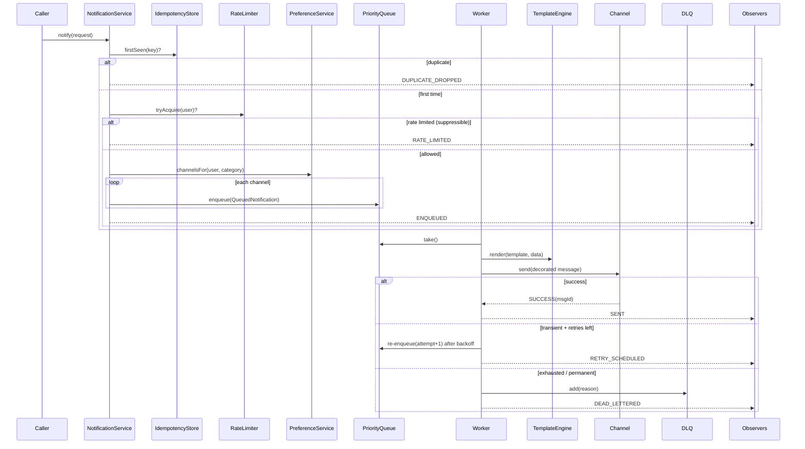

# LLD Design Document — Notification System

> A staff-level low-level-design walkthrough for a multi-channel Notification System,
> written as both a design reference and a last-minute revision artifact.
> PART A is the design doc; PART C is the cheat-sheet & self-test.
> (PART B — the single-file Java solution — lives in `Solution.java`.)

---

## PART A — Design Document

### 1. Problem statement

Design the back-end **Notification System** for a product that needs to deliver messages to users
across multiple channels — **Email, SMS, Push** (and later: in-app, webhook, Slack). A caller
(another service, or a background job) asks the system to notify a user of some event
(e.g. "order shipped", "OTP code", "password changed"). The system must:

- Pick the right **channel(s)** for the user, respecting their **preferences and opt-outs**.
- Render the message body from a reusable **template** plus per-request data.
- **Send** through a channel-specific provider (SES, Twilio, FCM, …).
- Be resilient: **retry** transient failures, push permanently-failed messages to a **dead-letter queue (DLQ)**.
- Enforce **rate limits** per user, honour **priority**, **deduplicate** repeated sends, and deliver **asynchronously** at scale.

The deliverable is a clean object-oriented core — the kind you'd whiteboard and then code in a
machine-coding round — not a full distributed cloud architecture. We keep the *boundaries* clear so
the in-memory design maps cleanly onto a real queue/worker deployment.

> **Adjacent term — DLQ (dead-letter queue):** a holding area for messages that could not be
> processed after all retries are exhausted, so they're not lost and can be inspected or replayed later.

---

### 2. Clarifying / requirements questions to ask first

Lead with these *before* drawing a single class. Group them so the interviewer sees structured thinking.

**Functional scope**
1. Which channels at launch — Email, SMS, Push? Which are "must" vs "nice-to-have / extension"?
2. Who calls us — internal services via an API, or do we also subscribe to an event bus (Observer)?
3. Single-recipient sends, or also **broadcast / topic** (one event → many users)?
4. Do we own **templating** (render body from template + variables), or does the caller pass a fully-rendered body?
5. Do we need **scheduling** ("send at 9am") or only immediate "send now"?
6. Is **read/seen tracking**, delivery receipts, or click tracking in scope?

**User preferences**
7. Can a user opt out per channel? Per category (marketing vs transactional)? Global "do not disturb" window / quiet hours?
8. Are some notifications **non-suppressible** (OTP, security alerts) regardless of preferences?
9. Channel **fallback** — if push fails or user has no push token, fall back to SMS/email?

**Non-functional / scale**
10. Expected volume — hundreds/sec or millions/day? Sync acceptable, or must enqueue and return immediately?
11. Latency target — is OTP "within seconds" while marketing is "within minutes" fine? (drives **priority**.)
12. Delivery guarantee — **at-least-once** (so we need **idempotency/dedup**) or best-effort?
13. **Rate limits** — max N notifications per user per window, to prevent spamming?
14. Multi-region / multi-tenant? Per-tenant config and quotas?

**Reliability & ops**
15. Retry policy — how many attempts, backoff strategy (fixed / exponential), per-channel override?
16. What happens after final failure — DLQ? Alert? Fallback channel?
17. Provider abstraction — one provider per channel, or multiple (e.g. Twilio + SNS for SMS) with failover?
18. Observability — metrics, audit log of every send attempt and its outcome?

**Out of scope (confirm)**
19. The actual provider SDK integrations (we mock them behind an interface).
20. Persistence engine choice, the API gateway, and auth — out of scope for the LLD core.

---

### 3. Finalized requirements & assumptions

For a focused, codeable design we commit to:

**Functional**
- `notify(NotificationRequest)` is the single entry point. A request targets **one user**, carries a
  **category**, **priority**, **templateId**, and a **data map** for rendering.
- The system resolves the user's **preferences** to decide *which channels* to use (with opt-out and quiet-hours),
  then renders and dispatches on each enabled channel.
- Channels supported: **Email, SMS, Push**. Adding a channel must not modify existing channel code (OCP).
- **Templating**: server-side render of subject/body from a `Template` + the request's data map.
- **Decorators** can wrap a rendered message to add a footer, localisation, or tracking pixel.
- **Retries** with pluggable `RetryPolicy` (exponential backoff); exhausted messages → **DLQ**.
- **Rate limiting** per user (token-bucket-ish window); **non-suppressible** categories bypass limits & opt-outs.
- **Dedup / idempotency** via a request `idempotencyKey` (skip if seen within a TTL window).
- **Priority** queue: high-priority (OTP) jumps ahead of bulk marketing.
- **Async delivery**: requests are enqueued; a pool of worker threads processes them.
- **Observer**: interested parties (audit logger, metrics) are notified of lifecycle events.

**Non-functional / assumptions**
- In-memory implementation, but every external dependency (provider, store, queue) is behind an interface,
  so it maps to a real deployment.
- **At-least-once** delivery → idempotency is required.
- Thread-safe: the service is a long-lived singleton-ish object hit by many producer threads and N workers.
- Single tenant, single region (multi-tenant is an extension).

---

### 4. Problem extensions / follow-up variations

These are the "what if" add-ons interviewers tack on. Senior signal = showing the design already absorbs them.

| # | Extension | Design impact | Where it plugs in |
|---|-----------|--------------|-------------------|
| 1 | **New channel** (in-app, WhatsApp, Slack, webhook) | Implement `Channel` + register in `ChannelFactory`. No edits to service or other channels. | OCP via Strategy + Factory |
| 2 | **User preferences / opt-out / quiet hours** | `PreferenceService` consulted before dispatch; filters channel list. | Pre-dispatch filter step |
| 3 | **Templating + localisation** | `TemplateEngine` renders; `LocaleDecorator` wraps for i18n. | Builder + Decorator |
| 4 | **Retries + DLQ** | `RetryPolicy` strategy + `DeadLetterQueue` sink. | Strategy + dedicated sink |
| 5 | **Rate limiting per user** | `RateLimiter` gate before enqueue/dispatch; rejected → drop or defer. | Guard interface |
| 6 | **Priority delivery** | `PriorityBlockingQueue` keyed on `Priority`; OTP ahead of bulk. | Queue ordering |
| 7 | **Async / scale-out** | Worker pool consuming the queue; in prod replace with Kafka + consumers. | Producer/consumer boundary |
| 8 | **Dedup / idempotency** | `IdempotencyStore` keyed on `idempotencyKey` with TTL. | Pre-dispatch guard |
| 9 | **Channel fallback** | If a channel fails terminally, try the next channel in the user's ordered list. | Dispatch loop policy |
| 10 | **Broadcast / topic** | Observer-style fan-out: a `Topic` has subscribers; one publish → many `NotificationRequest`s. | Observer (subscription) |
| 11 | **Scheduling / digests** | A scheduler enqueues at due time; digest batches many events into one send. | Pre-enqueue stage |
| 12 | **Multi-tenant quotas** | Tenant-scoped config, rate limits, templates. | Composite key on stores |
| 13 | **Delivery receipts / status webhooks** | Provider returns a messageId; async callback updates status. | Async status update path |

---

### 5. Core entities, responsibilities & relationships

| Entity | Responsibility |
|--------|----------------|
| `NotificationRequest` | Immutable value object: target user, category, priority, templateId, data map, idempotencyKey. Built via **Builder**. |
| `NotificationService` | Orchestrator / facade. Validates, dedups, rate-limits, resolves channels, enqueues, and on worker threads renders + dispatches. Notifies observers. |
| `Channel` (interface) | **Strategy** for "how to send on one medium". Implementations: `EmailChannel`, `SmsChannel`, `PushChannel`. |
| `ChannelFactory` | **Factory** creating/looking up a `Channel` by `ChannelType`. |
| `Message` | The rendered, channel-ready payload (subject + body + recipient address). |
| `MessageDecorator` | **Decorator** base; e.g. `FooterDecorator`, `TrackingPixelDecorator` add formatting without touching channels. |
| `Template` / `TemplateEngine` | Holds a template string; renders `Message` content from data map. |
| `PreferenceService` | Per-user channel opt-outs, ordered channel preference, quiet hours, category subscriptions. |
| `RateLimiter` | Per-user throttle; returns allow/deny. |
| `IdempotencyStore` | Tracks seen idempotency keys with TTL to drop duplicates. |
| `RetryPolicy` (interface) | **Strategy** deciding whether/when to retry; `ExponentialBackoffRetryPolicy`, `NoRetryPolicy`. |
| `DeadLetterQueue` | Sink for permanently-failed deliveries. |
| `NotificationObserver` (interface) | **Observer** for lifecycle events; `AuditLogObserver`, `MetricsObserver`. |
| `DeliveryResult` | Outcome of a send attempt (success / transient failure / permanent failure + messageId). |

**Relationships (text UML)**

```
NotificationService  ──uses──▶  ChannelFactory ──creates──▶ Channel «interface»
        │                                                     ▲   ▲   ▲
        │                                          EmailChannel SmsChannel PushChannel
        │──uses──▶ PreferenceService
        │──uses──▶ RateLimiter
        │──uses──▶ IdempotencyStore
        │──uses──▶ TemplateEngine ──renders──▶ Message
        │──uses──▶ RetryPolicy «interface» (ExponentialBackoff | NoRetry)
        │──uses──▶ DeadLetterQueue
        │──notifies──▶ NotificationObserver «interface» (AuditLog | Metrics)   [1..*]
        │──holds──▶ PriorityBlockingQueue<QueuedNotification>  ──consumed by──▶ Worker[ ]
NotificationRequest  ◀──built by── NotificationRequest.Builder
Message  ◀──wrapped by── MessageDecorator «abstract» (Footer | TrackingPixel)
```

- **Composition:** `NotificationService` owns its queue, worker pool, observer list.
- **Association:** service *uses* preference/rate-limit/idempotency/template/retry/DLQ collaborators (injected).
- **Inheritance / realization:** channels realize `Channel`; retry policies realize `RetryPolicy`; decorators extend `MessageDecorator`.

---

### 6. Design patterns applied

For each: **where**, **why**, **rejected alternative**, **when *not* to use**. SOLID called out throughout.

#### 6.1 Strategy — channel send & retry policy
- **Where:** `Channel` (how to send per medium) and `RetryPolicy` (how to retry).
- **Why:** the *algorithm* of sending varies by channel; the *algorithm* of backoff varies by need. Strategy lets us
  swap behaviour at runtime and add new ones without touching the orchestrator. Drives **OCP** and **DIP** —
  `NotificationService` depends on the `Channel`/`RetryPolicy` abstractions, not concretes.
- **Rejected alternative:** a giant `switch(channelType)` inside the service. Violates OCP (every new channel edits the service)
  and SRP (the service knows every channel's wire format).
- **When not to:** if there were exactly one channel forever, Strategy is overkill — a single method would do.

#### 6.2 Factory — channel creation
- **Where:** `ChannelFactory.get(ChannelType)`.
- **Why:** centralises construction/lookup of channels; the service asks for a channel by enum and stays ignorant of
  concrete classes and their dependencies. Pairs with Strategy (factory *produces* the strategy).
- **Rejected alternative:** `new EmailChannel()` scattered in the service — couples the orchestrator to concretes (DIP violation)
  and duplicates provider wiring.
- **When not to:** if channels were trivially constructed and created in exactly one place, a map literal would suffice.

#### 6.3 Builder — `NotificationRequest`
- **Why:** the request has many optional fields (priority, idempotencyKey, data, category). A telescoping constructor is
  unreadable; Builder yields a **fluent, immutable** value object — safe to share across threads.
- **Rejected alternative:** setters on a mutable bean → not thread-safe and allows half-built objects.
- **When not to:** for a 2-field value object, a constructor or record is clearer than a builder.

#### 6.4 Decorator — message formatting
- **Where:** `MessageDecorator` wrapping a `Message` (footer, tracking pixel, localisation).
- **Why:** stack cross-cutting formatting **dynamically** and in any combination without subclass explosion, and
  without channels knowing about footers. Honours **SRP** (each decorator does one thing) and **OCP**.
- **Rejected alternative:** subclasses like `FooteredTrackedMessage` → combinatorial blow-up; or `if (addFooter)` flags in
  the channel → SRP violation.
- **When not to:** if formatting is fixed and singular, a method on the template engine is simpler.

#### 6.5 Observer — lifecycle events / subscriptions
- **Where:** `NotificationObserver`s subscribe to the service; also models **topic subscriptions** (broadcast extension).
- **Why:** decouples "something happened" (enqueued, sent, failed, dead-lettered) from the reactions (audit, metrics, alerting).
  New observers attach without editing the service (**OCP**).
- **Rejected alternative:** the service directly calling logger + metrics + alerter → tight coupling, SRP creep.
- **When not to:** if there is exactly one fixed listener, a direct call is simpler than the registration machinery.

#### 6.6 Facade — `NotificationService`
- **Why:** presents a single `notify(...)` to callers while hiding dedup, rate-limit, preference, template, queue, retry, DLQ.
- **Rejected alternative:** making callers orchestrate those steps → leaks complexity, duplicated everywhere.

#### 6.7 Singleton-ish (lifecycle), and Producer–Consumer (concurrency)
- The service is intended as a **single long-lived instance** (one queue + worker pool). We inject rather than use a static
  singleton, to keep it testable. **Producer–Consumer** (a thread-safe priority queue feeding a worker pool) is the concurrency
  backbone for async + priority.

**SOLID scorecard**
- **S**RP: each class one reason to change (channel = wire format, retry policy = backoff, decorator = one format concern).
- **O**CP: new channels/retry policies/decorators/observers add code, don't edit existing.
- **L**SP: any `Channel` / `RetryPolicy` / `MessageDecorator` is substitutable for its abstraction.
- **I**SP: narrow interfaces (`Channel`, `RetryPolicy`, `NotificationObserver`) — no fat "do-everything" interface.
- **D**IP: orchestrator depends on abstractions (`Channel`, `RetryPolicy`, `IdempotencyStore`, …), injected at construction.

---

### 7. Class diagram

```mermaid
classDiagram
    class NotificationService {
        -ChannelFactory channelFactory
        -PreferenceService preferences
        -RateLimiter rateLimiter
        -IdempotencyStore idempotency
        -TemplateEngine templateEngine
        -RetryPolicy retryPolicy
        -DeadLetterQueue dlq
        -PriorityBlockingQueue~QueuedNotification~ queue
        -List~NotificationObserver~ observers
        +notify(NotificationRequest) void
        +registerObserver(NotificationObserver) void
        +shutdown() void
    }

    class NotificationRequest {
        -String userId
        -Category category
        -Priority priority
        -String templateId
        -Map~String,String~ data
        -String idempotencyKey
    }
    class NotificationRequestBuilder {
        +userId(String) Builder
        +category(Category) Builder
        +priority(Priority) Builder
        +templateId(String) Builder
        +data(String,String) Builder
        +idempotencyKey(String) Builder
        +build() NotificationRequest
    }

    class Channel {
        <<interface>>
        +type() ChannelType
        +send(Message) DeliveryResult
    }
    class EmailChannel
    class SmsChannel
    class PushChannel

    class ChannelFactory {
        +get(ChannelType) Channel
        +register(ChannelType, Channel) void
    }

    class Message {
        +String recipient
        +String subject
        +String body
        +ChannelType channelType
    }
    class MessageDecorator {
        <<abstract>>
        #Message wrapped
        +decorate() Message
    }
    class FooterDecorator
    class TrackingPixelDecorator

    class TemplateEngine {
        +render(String templateId, ChannelType, Map) Message
    }

    class PreferenceService {
        +channelsFor(userId, Category) List~ChannelType~
        +isSuppressible(Category) boolean
        +inQuietHours(userId) boolean
    }
    class RateLimiter {
        +tryAcquire(userId) boolean
    }
    class IdempotencyStore {
        +firstSeen(key) boolean
    }
    class RetryPolicy {
        <<interface>>
        +shouldRetry(attempt) boolean
        +backoffMillis(attempt) long
    }
    class ExponentialBackoffRetryPolicy
    class NoRetryPolicy
    class DeadLetterQueue {
        +add(QueuedNotification, String reason) void
    }
    class NotificationObserver {
        <<interface>>
        +onEvent(NotificationEvent) void
    }
    class AuditLogObserver
    class MetricsObserver
    class DeliveryResult {
        +Status status
        +String providerMessageId
    }

    NotificationService o--> ChannelFactory
    NotificationService o--> PreferenceService
    NotificationService o--> RateLimiter
    NotificationService o--> IdempotencyStore
    NotificationService o--> TemplateEngine
    NotificationService o--> RetryPolicy
    NotificationService o--> DeadLetterQueue
    NotificationService o--> "1..*" NotificationObserver
    NotificationRequest ..> NotificationRequestBuilder
    ChannelFactory ..> Channel
    Channel <|.. EmailChannel
    Channel <|.. SmsChannel
    Channel <|.. PushChannel
    Channel ..> Message
    Channel ..> DeliveryResult
    MessageDecorator <|-- FooterDecorator
    MessageDecorator <|-- TrackingPixelDecorator
    MessageDecorator ..> Message
    RetryPolicy <|.. ExponentialBackoffRetryPolicy
    RetryPolicy <|.. NoRetryPolicy
    NotificationObserver <|.. AuditLogObserver
    NotificationObserver <|.. MetricsObserver
    TemplateEngine ..> Message
```



**Key public APIs / signatures**

```java
// Entry point (Facade)
void notify(NotificationRequest req);
void registerObserver(NotificationObserver o);
void shutdown();

// Strategy — channel
interface Channel { ChannelType type(); DeliveryResult send(Message m); }

// Strategy — retry
interface RetryPolicy { boolean shouldRetry(int attempt); long backoffMillis(int attempt); }

// Factory
Channel get(ChannelType t);

// Builder
NotificationRequest req = NotificationRequest.builder()
    .userId("u1").category(Category.TRANSACTIONAL).priority(Priority.HIGH)
    .templateId("order_shipped").data("orderId","123")
    .idempotencyKey("evt-abc").build();

// Decorator
Message m = new FooterDecorator(new TrackingPixelDecorator(base)).decorate();

// Observer
interface NotificationObserver { void onEvent(NotificationEvent e); }
```

---

### 8. Key flows

**8.1 Submit (producer thread)**
1. `notify(req)` — validate non-null fields.
2. **Idempotency:** `idempotency.firstSeen(req.idempotencyKey)` — if duplicate, fire `DUPLICATE_DROPPED` event and return.
3. **Rate limit:** unless category is non-suppressible, `rateLimiter.tryAcquire(userId)` — if denied, fire `RATE_LIMITED` and return (or defer).
4. **Resolve channels:** `preferences.channelsFor(userId, category)` — applies opt-outs, quiet hours, ordering; non-suppressible categories ignore opt-out.
5. For each resolved channel, build a `QueuedNotification(req, channelType, attempt=0)` and **enqueue** into the priority queue.
6. Fire `ENQUEUED`; return immediately (async).

**8.2 Deliver (worker thread)**
1. `queue.take()` (blocks; highest priority first).
2. **Render:** `templateEngine.render(templateId, channelType, data)` → base `Message`.
3. **Decorate:** wrap with footer / tracking decorators → final `Message`.
4. `channel = channelFactory.get(channelType); result = channel.send(message)`.
5. On **SUCCESS** → fire `SENT(providerMessageId)`.
6. On **TRANSIENT_FAILURE** → if `retryPolicy.shouldRetry(attempt)`, schedule re-enqueue after `backoffMillis(attempt)` (attempt+1), fire `RETRY_SCHEDULED`; else `dlq.add(...)` + fire `DEAD_LETTERED`.
7. On **PERMANENT_FAILURE** → optional **channel fallback** (next channel in user's list); else `dlq.add(...)` + `DEAD_LETTERED`.



---

### 9. Concurrency, edge cases & extensibility

**Concurrency / thread-safety**
- **Producer–Consumer:** many threads call `notify`; a `PriorityBlockingQueue` (thread-safe, ordered by priority) feeds a fixed worker pool. No manual locking on the queue.
- **IdempotencyStore:** backed by a `ConcurrentHashMap` and uses `putIfAbsent` so concurrent duplicate requests resolve to exactly one winner (the *check-and-set must be atomic* — never `containsKey` then `put`).
- **RateLimiter:** per-user counters guarded so concurrent calls for the same user don't over-admit (atomic compare/decrement or per-user lock).
- **Observer list:** `CopyOnWriteArrayList` so observers can be added/removed while events fire, without `ConcurrentModificationException`.
- **Channels** should be stateless / thread-safe (they wrap provider clients); the same channel instance is shared across workers.
- **Retry scheduling:** a `ScheduledExecutorService` re-enqueues after backoff so workers aren't blocked sleeping.
- **Graceful shutdown:** drain the queue, stop accepting new work, await worker termination.

**Edge cases**
- User has **no enabled channel** (opted out of all) → drop with `NO_CHANNEL` event; non-suppressible categories still send on a default channel.
- **Missing template** or missing data variable → fail fast with a clear error; do not silently send a half-rendered body.
- **Duplicate idempotency key** arriving concurrently → exactly one send (atomic check above).
- **Quiet hours** for a non-urgent category → defer; urgent categories ignore quiet hours.
- **Permanent vs transient failure** classification — wrong classification either wastes retries (permanent treated as transient) or loses recoverable sends (transient treated as permanent); make the channel return a typed `DeliveryResult.Status`.
- **Poison message** that always throws → retries bounded, then DLQ; never infinite loop.
- **Rate-limit starvation of high priority** — high-priority/non-suppressible bypass limits so OTP is never throttled.

**Extensibility recap (ties to §4)**
- New channel → implement `Channel`, register in factory. (OCP)
- New retry behaviour → implement `RetryPolicy`. (Strategy)
- New formatting → add a `MessageDecorator`. (Decorator)
- New reaction (alerting, analytics) → add a `NotificationObserver`. (Observer)
- Scale-out → swap the in-memory queue for Kafka; workers become consumers. The boundaries don't move.

---

### 10. Likely interview questions

1. **Why Strategy for channels instead of inheritance from a base `Channel` class with overrides?**
   Strategy (interface + impls) keeps each channel independent and swappable, avoids a brittle base class that
   accumulates shared-but-not-really logic, and lets the factory hand back any impl. Inheritance would tempt
   protected shared state and tighter coupling. Both "realize an interface" — the key is we program to the interface (DIP).

2. **How do you guarantee a notification isn't sent twice?**
   At-least-once delivery means duplicates are possible, so we add idempotency: every request carries an
   `idempotencyKey`; `IdempotencyStore.firstSeen` does an atomic `putIfAbsent` with a TTL. Concurrent duplicates
   collapse to one winner. Note: with external providers true exactly-once is impossible end-to-end — we aim for
   "effectively once" up to our boundary.

3. **Walk me through retry + DLQ. What's transient vs permanent?**
   Channels return a typed result. Transient (timeout, 5xx, throttle) → `RetryPolicy` decides backoff & re-enqueue
   with attempt+1; permanent (invalid number, hard bounce) → no retry, go straight to DLQ or fallback channel.
   After max attempts, transient also goes to DLQ. DLQ entries carry the reason for inspection/replay.

4. **Where does priority live and how do you stop bulk traffic starving OTPs?**
   The work queue is a `PriorityBlockingQueue` ordered by `Priority` (ties broken FIFO via a sequence number to
   avoid starvation within a band). High-priority/non-suppressible categories also bypass the rate limiter, so
   OTP delivery is never throttled by a marketing burst.

5. **How do user preferences and opt-out fit without bloating the service?**
   A dedicated `PreferenceService` resolves the ordered channel list per user+category (opt-outs, quiet hours,
   subscriptions). The service just consults it — SRP. Non-suppressible categories (security/OTP) ignore opt-out.

6. **Why Decorator for formatting and not just template logic?**
   Decorators let us stack cross-cutting concerns (footer, tracking pixel, localisation) dynamically and in any
   order, with no subclass explosion and without channels knowing about them. Template logic owns the *content*;
   decorators own *wrapping/augmentation*. (SRP + OCP)

7. **(Senior signal) Your design adds a Slack channel and a per-channel retry policy. What changes?**
   Slack: implement `Channel`, register in `ChannelFactory` — zero edits elsewhere (OCP). Per-channel retry:
   make `Channel` expose its `RetryPolicy`, or key a `Map<ChannelType,RetryPolicy>` in the worker. Either way the
   orchestrator depends on the `RetryPolicy` abstraction (DIP), so it's an additive change.

8. **(Senior signal) Critique your own design — where would it hurt at 10× scale?**
   The in-memory `PriorityBlockingQueue` is a single-process bottleneck and loses messages on crash. At scale,
   replace it with a durable broker (Kafka/SQS) partitioned by user, persist idempotency in Redis with TTL, and
   move rate limits to a distributed token bucket. The OO core (channels, decorators, policies, observers) stays;
   only the queue/store implementations swap — which is exactly why we put them behind interfaces.

9. **How is thread-safety handled?**
   `PriorityBlockingQueue` for the queue, `ConcurrentHashMap` + `putIfAbsent` for idempotency, atomic per-user
   rate-limit updates, `CopyOnWriteArrayList` for observers, stateless channels shared across workers, and a
   `ScheduledExecutorService` for backoff so workers never block on sleep.

10. **(Senior signal) Why Observer here rather than just logging inline?**
    Lifecycle events (enqueued/sent/failed/dead-lettered) have many independent reactions (audit, metrics, alerting,
    analytics) that evolve separately. Observer decouples emission from reaction, so adding a metrics sink doesn't
    touch the service (OCP) and each observer stays single-purpose (SRP). Inline logging couples all of them into the orchestrator.

**Deep-probe follow-ups**
- *"Two requests with the same idempotency key arrive on two threads in the same nanosecond — exactly what runs?"*
  The atomic `putIfAbsent` returns `null` for exactly one thread (it wins and proceeds); the other gets the existing
  value and short-circuits to `DUPLICATE_DROPPED`. Never `containsKey`+`put` (that race admits both).
- *"A channel's provider is down for an hour — what does the user experience?"*
  Transient failures retry with exponential backoff (capped); meanwhile fallback channel may deliver. If still failing,
  DLQ + alert. We'd also add a circuit breaker so we stop hammering a dead provider and fail fast to fallback.
- *"How would you support a daily digest instead of per-event emails?"*
  Add a pre-enqueue aggregation stage keyed by user+category that buffers events and a scheduler flushes one combined,
  templated message per window — the Builder/Template/Channel pipeline downstream is unchanged.

---

## PART C — Cheat-sheet & self-test

**Patterns used (recap)**
- **Strategy** — `Channel` (per-medium send) and `RetryPolicy` (backoff). Swap/extend behaviour without editing the orchestrator. (OCP, DIP)
- **Factory** — `ChannelFactory` constructs/looks up channels by enum; orchestrator stays decoupled from concretes.
- **Builder** — `NotificationRequest` is immutable & thread-safe, built fluently with many optional fields.
- **Decorator** — `MessageDecorator` stacks footer / tracking / locale without subclass explosion or channel changes. (SRP, OCP)
- **Observer** — `NotificationObserver` fan-out of lifecycle events to audit/metrics/alerting; also models topic subscriptions.
- **Facade** — `NotificationService.notify(...)` hides dedup → rate-limit → preference → render → enqueue → retry → DLQ.
- **Producer–Consumer** — `PriorityBlockingQueue` + worker pool for async + priority delivery.

**Key design decisions (recap)**
- At-least-once → **idempotency** via atomic `putIfAbsent` + TTL.
- **Priority queue** with FIFO tie-break; high-priority/non-suppressible bypass rate limits and opt-outs.
- Typed `DeliveryResult` separates **transient (retry)** from **permanent (DLQ/fallback)**.
- Everything external (provider, queue, stores) sits **behind interfaces** so the in-memory design maps onto a real broker/Redis deployment with no OO-core changes.
- Thread-safety via concurrent collections, atomic check-and-set, `CopyOnWriteArrayList`, and a scheduled re-enqueue for backoff.

**5 self-test questions (no answers)**
1. Add a `WhatsAppChannel` with its own retry policy and a quiet-hours exemption — list every file/class you touch and confirm no existing class is edited.
2. Two identical requests race on the same idempotency key — write the exact concurrent code path that guarantees a single send, and name the wrong way to do it.
3. The bulk-marketing queue is starving OTPs. Explain precisely how priority + tie-breaking + rate-limit bypass prevent this, and where each lives.
4. Redesign the queue and idempotency store for a multi-process, crash-safe deployment — what swaps, and why does the OO core stay intact?
5. The interviewer asks for a daily digest plus per-event sends coexisting — where does aggregation plug in, and which existing components are unchanged?
