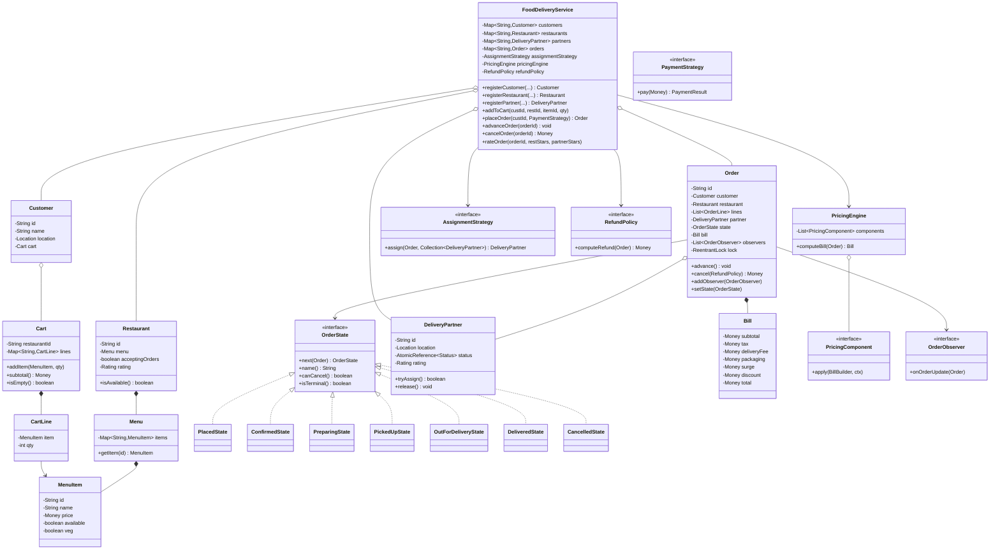
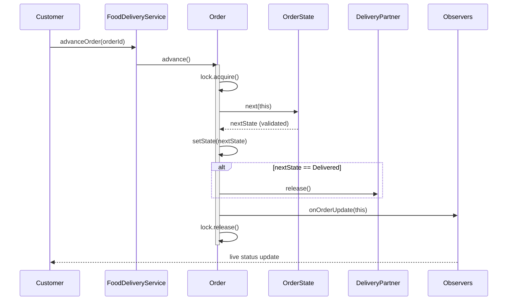

# LLD Design Document — Food Delivery Platform (Swiggy / Zomato)

> **Audience:** senior Java engineer revising for an LLD / machine-coding round.
> **Goal:** a complete, pattern-justified object-oriented design plus a self-contained Java review artifact.

---

## PART A — Design Document

### 1. Problem statement

Design the core domain model and orchestration logic for an **online food-delivery platform** (Swiggy / Zomato style). Customers browse nearby **restaurants**, view their **menus**, build a **cart**, place an **order**, and **pay**. The platform **assigns a delivery partner**, drives the order through a **lifecycle** (placed → confirmed → being prepared → picked up → out for delivery → delivered), and lets the customer **track** the order live. The system must also support **restaurant availability**, **dynamic / surge pricing**, **ratings**, and **cancellations**, while remaining **thread-safe** because many customers, restaurants, and partners act concurrently.

We are designing the **low-level object model and in-process orchestration**, not the distributed infrastructure (no real network, DB, or message broker). The deliverable models the entities, the order **state machine**, the **assignment / pricing strategies**, the **observer-based tracking**, and the concurrency guarantees, in a way that maps cleanly onto a real service.

What this is **not**: a full microservice architecture, payment gateway integration, geospatial indexing engine, or recommendation system. Those are mentioned as extensions but the LLD focuses on the object design.

---

### 2. Clarifying / requirements questions to ask first

A real round starts here — **never** with classes. I'd ask the interviewer:

**Functional scope**
1. Is this **single-restaurant per order**, or can a cart contain items from multiple restaurants? (Assume single-restaurant per order — the Swiggy default.)
2. Do we need the **discovery / search** layer (filter by cuisine, distance, rating), or is locating a restaurant out of scope and we start at "customer has chosen a restaurant"?
3. What are the exact **order states** and the legal transitions? Who is allowed to trigger each transition (customer, restaurant, partner, system)?
4. Is **delivery-partner assignment** automatic (system picks) or can the customer/restaurant pick? What's the assignment objective — nearest, least-loaded, highest-rated, round-robin?
5. Do we support **cancellation**? At which states is it allowed, and what are the refund rules per state?
6. Should **pricing** be static (sum of item prices) or include **taxes, delivery fee, packaging, surge multiplier, and coupons**? In what order do these apply?
7. Do we need **live tracking** push to the customer, and to how many subscribers (customer + maybe restaurant ops dashboard)?
8. **Ratings** — does the customer rate the restaurant, the partner, or both? Do ratings affect future assignment?

**Non-functional**
9. **Concurrency** — expected scale? Will the same order object be mutated by multiple threads (customer cancels while system assigns)? Must a single partner never be double-booked?
10. **Consistency** — is the in-memory store the source of truth, or a cache over a DB? (Assume in-memory authoritative for the LLD.)
11. **Idempotency** — can `placeOrder` / `pay` be retried safely?
12. **Latency / availability** targets — does assignment need to be sub-second? (Shapes whether we keep an in-memory partner index.)

**Scope-narrowing**
13. Inventory at item level (a dish sells out) — in or out of scope?
14. Scheduled / future orders, group orders, subscriptions (Swiggy One) — in scope?
15. Multiple payment methods + failure handling — how deep? (Model the strategy + a fake gateway; no real integration.)

**Out of scope (confirmed):** real geospatial routing, ETA ML, fraud, notifications transport (SMS/push infra), persistence layer, auth.

---

### 3. Finalized requirements & assumptions

**Functional (in scope)**
- Register customers, restaurants (each with a `Menu` of `MenuItem`s), and delivery partners.
- A customer builds a **Cart** scoped to **one restaurant**; add / update / remove items.
- **Place order** from a cart → creates an `Order` with a computed **bill** (subtotal, taxes, delivery fee, packaging, surge, discount, total).
- **Pricing** is composed via a **Strategy** (base, surge, coupon) with a clear application order.
- On placement, the system runs a **partner-assignment Strategy** to lock exactly one available partner.
- The order moves through a **state machine** with guarded transitions; each transition notifies subscribers (**Observer**) for live tracking.
- **Cancellation** allowed up to a cutoff state, with state-dependent refund.
- **Ratings** for restaurant and partner after delivery.
- **Restaurant availability** (open/closed, accepting orders) gates placement.

**Non-functional**
- **Thread-safe**: order state transitions are atomic; a partner is assigned to at most one active order at a time; cart mutations are safe per customer.
- **Extensible**: new states, new pricing rules, new assignment strategies, new observers without touching existing code (OCP).
- **In-memory**, pure JDK, single process.

**Key assumptions**
- One restaurant per order. Single currency, integer-cents money. Each delivery partner handles one active delivery at a time. The in-memory maps are the source of truth. Payment uses a stub gateway that can be told to succeed/fail.

---

### 4. Problem extensions / follow-up variations

Senior candidates earn signal by pre-empting these. For each: the realistic ask and the **design impact**.

| # | Extension | Design impact |
|---|-----------|---------------|
| 1 | **Order state machine grows** (e.g. `REJECTED_BY_RESTAURANT`, `RETURNED`, `PARTNER_UNAVAILABLE`) | Add a new `OrderState` class; existing states untouched (State pattern → OCP). Transition table lives inside each state, so blast radius is local. |
| 2 | **Smarter partner assignment** (nearest, least-loaded, rating-weighted, ML score) | New `AssignmentStrategy` implementation; injected via `Factory`/config. No change to order flow. |
| 3 | **Live tracking with many subscribers** (customer app, restaurant dashboard, ops) | Add more `OrderObserver`s; subject already broadcasts. Could swap to async dispatch (executor) without API change. |
| 4 | **Restaurant availability / item stock** | Availability check is a guard in `placeOrder`; item-level stock becomes an inventory check + decrement in the same critical section. |
| 5 | **Surge / dynamic pricing** | New `PricingStrategy` decorator in the chain; surge multiplier driven by a `DemandProvider`. Chain order is explicit and testable. |
| 6 | **Coupons / promotions** | Another pricing component; precedence rules (cap, stacking) encoded in the chain assembly, not scattered. |
| 7 | **Ratings affect assignment** | `RatingService` feeds the rating-weighted `AssignmentStrategy`; clean dependency, no order-flow change. |
| 8 | **Cancellation & refunds with rules per state** | Each `OrderState` answers `canCancel()` + a `RefundPolicy` Strategy computes refund. State owns the policy decision. |
| 9 | **Concurrency: no double-booking, no double-cancel** | Per-order lock for transitions; partner pool guarded by CAS/lock; idempotent `cancel`/`pay`. |
| 10 | **Scheduled / group / multi-restaurant orders** | Cart becomes a composite; order splits into sub-orders; assignment runs per sub-order. Bigger refactor — flag it as a v2. |
| 11 | **Notifications transport (SMS/push/email)** | Observers delegate to a `NotificationChannel` strategy; transport swappable. |
| 12 | **ETA estimation** | An `EtaEstimator` service consulted on transitions; pluggable (heuristic → ML). |

---

### 5. Core entities, responsibilities & relationships

**Actors / aggregates**
- **Customer** — identity, contact, location; owns a `Cart`; places orders; rates.
- **Restaurant** — identity, location, `Menu`, availability flag, accepts/prepares orders; rated.
- **MenuItem** — dish: id, name, price, veg flag, availability.
- **Menu** — collection of `MenuItem`s owned by a restaurant.
- **Cart** — mutable, restaurant-scoped collection of `CartLine` (item + qty); computes subtotal; converts to an order.
- **Order** — the central aggregate: customer, restaurant, line snapshot, assigned partner, **state**, **bill**, timestamps; mutated only through guarded transitions.
- **OrderState** — State-pattern object encapsulating allowed transitions and `canCancel()`.
- **DeliveryPartner** — identity, location, status (available/busy), rating; assigned to ≤1 active order.
- **Payment** — amount, method, status; produced by `PaymentService` via a `PaymentStrategy`.
- **Bill** — value object: subtotal, tax, deliveryFee, packaging, surge, discount, total (immutable).

**Services / strategies**
- **PricingEngine** — composes `PricingComponent`s (base → packaging/tax → surge → discount) to produce a `Bill`.
- **AssignmentStrategy** — chooses a partner (`NearestPartnerStrategy`, `LeastBusyStrategy`, `RoundRobinStrategy`).
- **OrderObserver** — notified on state change (`CustomerNotifier`, `RestaurantDashboard`, `TrackingService`).
- **RefundPolicy** — computes refund on cancellation given the state.
- **PaymentStrategy** — `CardPayment`, `UpiPayment`, `WalletPayment`, `CodPayment`.

**Orchestrator**
- **FoodDeliveryService** — facade tying registration, cart→order, pricing, assignment, payment, transitions, ratings; owns concurrency control.

**Relationships (text UML)**
```
Customer (1) ──owns──> (0..1) Cart
Cart (1) ──contains──> (*) CartLine ──refers──> (1) MenuItem
Restaurant (1) ──has──> (1) Menu ──contains──> (*) MenuItem
Order (1) ──snapshot──> (*) OrderLine        [composition: lines copied at placement]
Order (1) ──assigned──> (0..1) DeliveryPartner
Order (1) ──has-a──> (1) OrderState          [State pattern, swappable]
Order (1) ──has-a──> (1) Bill                [value object, immutable]
Order (1) ──notifies──> (*) OrderObserver    [Observer]
FoodDeliveryService ──uses──> AssignmentStrategy, PricingEngine, PaymentStrategy, RefundPolicy
PricingEngine ──composes──> (*) PricingComponent   [Decorator/Chain]
OrderState <|-- Placed, Confirmed, Preparing, PickedUp, OutForDelivery, Delivered, Cancelled
```

---

### 6. Design patterns applied

For each: **where**, **why**, **rejected alternative**, **when not** to use it.

#### 6.1 State — order lifecycle
- **Where:** `OrderState` interface with one concrete class per state; `Order` delegates `confirm()/prepare()/pickUp()/...` to its current state, which validates and returns the next state.
- **Why:** the lifecycle has many states and **state-dependent behavior** (legal transitions, `canCancel()`). State localizes each state's rules in its own class — adding `REJECTED` touches one new class, not a giant switch. Removes sprawling `if (status == …)` conditionals (OCP, SRP).
- **Rejected alternative:** an `enum OrderStatus` + a central `switch` in `Order.transition()`. Simpler for 3 states, but every new state edits the same method (OCP violation) and the transition matrix becomes unreadable.
- **When not:** if there are only 2–3 states with trivial transitions, an enum + guard map is leaner; State is over-engineering there.

#### 6.2 Strategy — partner assignment, pricing components, payment, refund
- **Where:** `AssignmentStrategy` (nearest / least-busy / round-robin), `PaymentStrategy`, `RefundPolicy`, and each `PricingComponent`.
- **Why:** these are **interchangeable algorithms** chosen at runtime/config. Strategy isolates each so we can A/B or swap without touching callers (OCP, DIP — the service depends on the abstraction).
- **Rejected alternative:** flags / `if-else` inside the service (`if (mode == NEAREST) …`). Couples the orchestrator to every algorithm and balloons with each new one.
- **When not:** if there will only ever be one algorithm, a plain method is fine — Strategy adds indirection for no payoff.

#### 6.3 Observer — live order tracking & notifications
- **Where:** `Order` (subject) holds `List<OrderObserver>`; on every state change it calls `onOrderUpdate(order)`. Concrete observers: customer notifier, restaurant dashboard, tracking feed.
- **Why:** tracking is a **one-to-many, decoupled broadcast**. The order needn't know who listens; subscribers come and go. Adding an ops dashboard = add an observer (OCP).
- **Rejected alternative:** the order calling each consumer directly (tight coupling, edits on every new consumer), or polling (wasteful, laggy).
- **When not:** with exactly one fixed consumer and no decoupling need, a direct call is simpler. Beware update storms / observer-ordering assumptions.

#### 6.4 Factory — state & strategy creation
- **Where:** `OrderStateFactory` returns the initial/next `OrderState`; `AssignmentStrategyFactory` / `PaymentFactory` resolve a strategy from an enum/config.
- **Why:** centralizes construction so the rest of the code is free of `new ConcretePlaced()` sprinkles; one place to evolve creation logic (DIP).
- **Rejected alternative:** `new` at every call site (scatters knowledge of concrete classes).
- **When not:** for a single trivial constructor, a factory is ceremony.

#### 6.5 Decorator / Chain — pricing pipeline
- **Where:** `PricingEngine` applies an ordered list of `PricingComponent`s (subtotal → tax + packaging → surge → discount) to build the `Bill`.
- **Why:** pricing is **composable and order-sensitive**; each rule is a unit, testable in isolation, and the chain order is explicit. Adding "loyalty cashback" = add one component.
- **Rejected alternative:** one fat `computeBill()` with all rules inline — brittle, untestable, violates SRP/OCP.
- **When not:** if the bill is just `sum(price*qty)` forever, skip it.

#### 6.6 Facade — `FoodDeliveryService`
- **Where:** single entry point for all use cases.
- **Why:** gives clients one coherent API and hides wiring/concurrency. **Rejected:** exposing every subsystem to the client (leaky, error-prone). **When not:** tiny systems where the subsystems are already simple.

#### 6.7 Value Object (immutability) — `Bill`, `Location`, `Money`
- **Why:** immutable values are inherently thread-safe and side-effect-free; cheap to share across threads. Reinforces concurrency safety.

**SOLID in play**
- **S**RP: `Order` owns state data; transition rules live in `OrderState`; pricing in `PricingEngine`; assignment in strategies.
- **O**CP: new states / strategies / observers / pricing rules added without editing existing code.
- **L**SP: any `OrderState` / `AssignmentStrategy` / `PaymentStrategy` is substitutable through its interface.
- **I**SP: small focused interfaces (`OrderObserver`, `PricingComponent`, `RefundPolicy`) — clients depend only on what they use.
- **D**IP: `FoodDeliveryService` depends on abstractions (strategies/observers), wired via factories/injection.

---

### 7. Class diagram



**Brief text UML / key public APIs**
- `FoodDeliveryService.placeOrder(customerId, PaymentStrategy) : Order` — validates restaurant availability, prices via `PricingEngine`, charges via `PaymentStrategy`, assigns via `AssignmentStrategy`, creates `Order` in `PlacedState`.
- `Order.advance() : void` — atomic, lock-guarded; delegates to `state.next(this)`; on success notifies observers; releases partner on `Delivered`.
- `Order.cancel(RefundPolicy) : Money` — guarded by `state.canCancel()`; transitions to `CancelledState`, releases partner, returns refund.
- `AssignmentStrategy.assign(order, partners) : DeliveryPartner` — returns a partner already CAS-locked (busy), or `null`.
- `PricingEngine.computeBill(order) : Bill` — runs the component chain.

---

### 8. Key flows

**8.1 Place order (steps)**
1. Resolve customer + their cart; reject if empty.
2. Resolve restaurant; **guard**: `restaurant.isAvailable()` (open + accepting) and all items available — else throw.
3. Snapshot cart lines into immutable `OrderLine`s.
4. `PricingEngine.computeBill(order)` → `Bill` (subtotal → tax+packaging → surge → discount).
5. `PaymentStrategy.pay(bill.total())` → on failure, abort (no order, no assignment).
6. `AssignmentStrategy.assign(order, availablePartners)` → CAS-lock one partner; if none, either queue or fail (we fail with a clear exception).
7. Create `Order` in `PlacedState`, register observers, clear the cart.
8. Notify observers (tracking begins).

**8.2 Lifecycle advance (sequence)**



**8.3 Cancellation**
1. `cancelOrder(orderId)` → acquire order lock.
2. If `!state.canCancel()` → throw (idempotent: cancelling an already-cancelled order is a no-op returning zero refund).
3. Compute refund via `RefundPolicy` (state-dependent: full before preparing, partial after, none once out for delivery).
4. Transition to `CancelledState`, release partner, notify observers, return refund.

**8.4 Rating** — only after `DeliveredState`; updates restaurant + partner `Rating` (running average), optionally feeding the rating-weighted assignment strategy.

---

### 9. Concurrency, edge cases & extensibility

**Thread-safety**
- **Order transitions** are guarded by a per-`Order` `ReentrantLock`, so concurrent `advance` / `cancel` on the same order serialize — no lost updates, no illegal interleavings (e.g. cancel racing a pickup).
- **Partner pool**: each `DeliveryPartner` holds an `AtomicReference<Status>`; `tryAssign()` does a `compareAndSet(AVAILABLE, BUSY)`. The first thread wins, so **no double-booking** even if two orders target the same partner simultaneously. `release()` resets to `AVAILABLE`.
- **Carts** are per-customer; mutations synchronize on the cart. A customer placing an order clears the cart under the same lock to avoid double-spend.
- **Registries** use `ConcurrentHashMap`.
- **Idempotency**: `cancel` on a terminal order returns zero refund without side effects; payment results carry a transaction id so retries are detectable.
- **Value objects** (`Bill`, `Money`, `Location`) are immutable → freely shared.
- **Observer dispatch**: synchronous here for determinism; can move to an `ExecutorService` for non-blocking fan-out without changing the contract (note: then observers must be thread-safe).

**Edge cases**
- Empty cart / item became unavailable between add and placement → reject at guard.
- Restaurant closed mid-flow → placement guard fails; in-flight orders continue.
- No available partner → fail fast with a typed exception (extension: queue + retry).
- Payment fails after pricing → no order created, no partner locked (order of operations matters: price → pay → assign).
- Double advance past `Delivered` / advance on `Cancelled` → `IllegalStateException` from the state object.
- Refund on a state that disallows cancellation → blocked by `canCancel()`.
- Concurrent advance + cancel → serialized by the order lock; whoever wins, the other sees the new state and is rejected.

**Extensibility recap (maps to §4)**
- New states → new `OrderState` class (OCP).
- New assignment objective → new `AssignmentStrategy` (DIP).
- New pricing rule / surge / coupon → new `PricingComponent` in the chain.
- New listeners (ops dashboard, ETA, SMS) → new `OrderObserver`.
- Per-state refund variants → new `RefundPolicy`.

---

### 10. Likely interview questions

1. **Why State over an enum + switch for the order lifecycle?**
   State puts each state's transition rules and `canCancel()` in its own class, so adding `REJECTED_BY_RESTAURANT` is a new class, not an edit to a central switch (OCP, SRP). The enum approach is fine for ≤3 trivial states but the transition matrix and conditionals explode as states grow. *Probe: how do you prevent illegal transitions?* Each state only knows its own legal `next()`; anything else throws `IllegalStateException`. *Probe: where does `canCancel()` live?* On the state, so the rule travels with the state.

2. **How do you guarantee a delivery partner is never double-booked under concurrency?**
   `AtomicReference<Status>` + `compareAndSet(AVAILABLE, BUSY)` — a lock-free CAS where the first thread wins; losers see `false` and the strategy tries the next partner. *Probe: why not `synchronized`?* CAS avoids contention on a shared monitor and scales better for the hot assignment path; `synchronized` would serialize all assignment attempts.

3. **Walk me through `placeOrder`'s order of operations and why.**
   Validate → price → **pay → assign**. Pay before assign so we don't lock a scarce partner for an order that can't be paid; price before pay so we charge the correct total. If assignment fails after payment, we refund (or queue). *Probe: is it idempotent?* Payment carries a txn id; a retried `placeOrder` can be deduped by an idempotency key (extension).

4. **How does live tracking work and why Observer?**
   `Order` is the subject; on each transition it broadcasts to `OrderObserver`s (customer, restaurant dashboard, tracking feed). Decouples the order from consumers — add a listener without touching the order (OCP). *Probe: async?* Move dispatch to an executor; then observers must be thread-safe and you accept eventual delivery.

5. **How is pricing structured for surge + coupons + taxes?**
   A `PricingEngine` runs an **ordered chain** of `PricingComponent`s: subtotal → tax+packaging → surge multiplier → discount, building an immutable `Bill`. Order is explicit and each rule is unit-testable. *Probe: stacking/caps?* Encoded in chain assembly (e.g. discount component clamps to a max), not scattered across the code.

6. **Cancellation refund rules — where do they live?**
   `state.canCancel()` gates whether cancellation is allowed; a `RefundPolicy` Strategy computes the amount based on the current state (full pre-prep, partial during prep, none once out for delivery). Keeps policy swappable and state-aware. *Probe: cancel a delivered order?* `canCancel()` is false → blocked; idempotent no-op if already cancelled.

7. **(Senior signal) Where could this design rot, and which pattern protects you?**
   The lifecycle and pricing are the volatile axes; State and the pricing chain absorb new states/rules without edits. The risk is **observer ordering / storms** and **strategy explosion** — mitigate with documented chain order and a factory that resolves strategies from config rather than scattering `new`.

8. **(Senior signal) Justify a pattern you deliberately did NOT use.**
   I avoided a **Command** pattern for transitions and a **Visitor** over states. Command would add an action object per transition with no current need for undo/queue/audit; if we later need an audit log or a transition queue, Command becomes justified. Visitor over states is premature — we don't have many cross-cutting operations over the state hierarchy yet.

9. **(Senior signal) How would you scale assignment from in-memory to a real fleet?**
   Replace `AssignmentStrategy` internals with a geospatial index (quadtree / S2 cells) and a scoring function (distance, load, rating, ETA). The interface is unchanged — the orchestrator and order flow don't move (DIP pays off). Locking moves to the partner service (optimistic concurrency / distributed lock).

10. **How do you test this design?**
    Unit-test each `OrderState.next()` for legal/illegal transitions; each `PricingComponent` in isolation; each `AssignmentStrategy` with crafted partner pools; concurrency tests hammering `tryAssign` from many threads to assert single winner; `cancel`/`advance` race tests asserting serialization. *Probe: how to test Observer?* Inject a spy observer and assert it's called once per transition with the right state.

---

## PART C — Cheat-sheet & self-test

**Patterns used (recap)**
- **State** — order lifecycle; each state owns its transitions + `canCancel()` (OCP/SRP).
- **Strategy** — partner assignment, payment, refund, each pricing rule (OCP/DIP).
- **Observer** — live tracking & notifications; order broadcasts to decoupled listeners.
- **Factory** — create states & resolve strategies from config (DIP).
- **Decorator / Chain** — ordered `PricingComponent` pipeline builds the `Bill`.
- **Facade** — `FoodDeliveryService` single entry point.
- **Value Object / Immutability** — `Bill`, `Money`, `Location` for thread-safe sharing.

**Key design decisions (recap)**
- Per-`Order` `ReentrantLock` serializes transitions; partner pool uses CAS (`AtomicReference`) to prevent double-booking.
- `placeOrder` order: validate → price → pay → assign (don't lock a partner for an unpayable order).
- Refund is state-dependent via `RefundPolicy`; cancellation gated by `canCancel()`.
- Immutable bill snapshot; cart cleared atomically on placement.
- All extension axes (states, pricing, assignment, listeners) are open for extension, closed for modification.

**5 self-test questions (no answers)**
1. Add a `REJECTED_BY_RESTAURANT` state that refunds fully and frees the partner — which classes change, and which must stay untouched?
2. The same partner is targeted by two orders in the same millisecond. Trace exactly what happens at the `compareAndSet` and what each thread observes.
3. Surge must apply *after* coupons but coupons must never make the total negative. How do you order and clamp the pricing chain?
4. You need to push tracking updates to 50k subscribers without blocking the transition. What changes, and what new thread-safety obligation appears?
5. A customer hits "cancel" at the exact moment the system advances to `OutForDelivery`. Which one wins, why, and what does the loser see?
