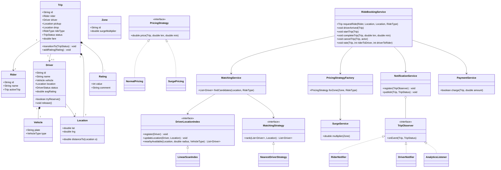
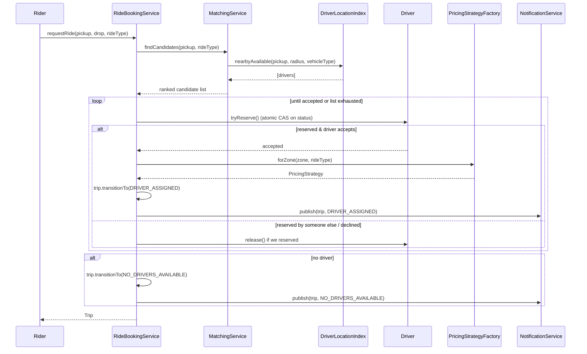

# Cab Booking System (Uber / Ola) — Low-Level Design

> A staff-level LLD / machine-coding revision artifact. Part A is the design document, Part C is a cheat-sheet and self-test. The companion `Solution.java` is the single-file review code.

---

## 1. Problem statement

Design the object model and core services for a ride-hailing platform (think Uber / Ola). A **Rider** opens the app, requests a ride from a pickup to a drop location, the system **matches** them with a nearby available **Driver**, computes a **fare** (with surge when demand is high), the driver progresses the **Trip** through a lifecycle (assigned → arrived → started → completed), payment is captured, and both parties **rate** each other. The system must handle many riders and drivers concurrently and must never assign the same driver to two trips at once.

We are designing the **in-memory core domain and services** (entities, state machine, matching, pricing, notifications) — not the network layer, persistence, or the mobile clients. The code is a single-process, thread-safe reference model.

---

## 2. Clarifying / requirements questions to ask first

Before writing a single class, this is what a strong candidate asks the interviewer. Group the questions so you cover functional scope, then constraints, then non-functional concerns.

**Functional scope**
- What are the core actions in v1 — request ride, match driver, run the trip lifecycle, pay, rate? Is **scheduling a ride for later** in scope, or only on-demand "now" rides?
- Do we support **multiple ride types** (e.g., Mini, Sedan, Premium, Pool)? Does ride type affect matching (vehicle class) and pricing?
- Is **carpool / ride-sharing (Pool)** — one trip with multiple riders along the route — required in v1, or a later extension?
- How is a driver matched — strictly **nearest available**, or do we factor in driver rating, ETA, acceptance rate, or fairness across drivers?
- Can a driver **decline** a request? If so, do we fall back to the next-nearest driver, and how many times before we tell the rider "no cars available"?
- Who can **cancel** and when — rider before pickup, driver after accepting, either side mid-trip? Are there cancellation fees?

**Constraints & rules**
- How do we get driver locations — continuous **GPS pings** we store as the latest known location? How fresh must they be to count as "available nearby"?
- What's the search radius for matching, and do we expand it if nothing is found?
- Is **surge pricing** required? Is it per-zone based on the demand/supply ratio, and is it a multiplier on the base fare?
- What does the fare formula look like — base fare + per-km + per-minute, with a minimum fare? Per ride type?

**Non-functional**
- Expected **scale** — how many concurrent riders/drivers in a city? This drives whether matching can be a simple in-memory scan or needs a geospatial index (quadtree / geohash / S2).
- **Consistency on assignment**: the hard invariant is that a driver is assigned to *at most one* active trip. How strict — strong consistency (locking) is expected here.
- **Latency** target for matching (riders expect a match in a couple of seconds).
- Do we need an **audit trail** of trip state transitions and pricing for disputes?
- Failure handling: payment failure, driver going offline mid-trip, app crash / reconnect.

For this document I lock the answers below.

---

## 3. Finalized requirements & assumptions

**In scope**
- Rider requests an on-demand ride: pickup `Location`, drop `Location`, desired `RideType`.
- `MatchingService` finds the nearest *available* driver of the right vehicle class within a search radius, expanding the radius up to a cap.
- A driver may **accept or decline**; on decline (or timeout) we offer the next-nearest candidate.
- `Trip` is a **state machine**: `REQUESTED → DRIVER_ASSIGNED → DRIVER_ARRIVED → IN_PROGRESS → COMPLETED`, plus terminal `CANCELLED` and `NO_DRIVERS_AVAILABLE`. Illegal transitions are rejected.
- **Pricing** is pluggable: a normal strategy (base + per-km + per-minute, min fare) and a **surge** strategy (multiplier driven by per-zone demand/supply).
- **Notifications** (Observer): rider and driver get push updates on every relevant trip event; an analytics listener records transitions.
- **Cancellation** by rider or driver before `IN_PROGRESS`, with the driver freed and made available again.
- **Ratings**: after completion both parties submit a 1–5 rating; a driver's average rating is maintained.
- **Concurrency**: assignment is atomic — a driver can be claimed by exactly one trip. Many requests may run in parallel.

**Out of scope (mentioned as extensions in §4)**
- Real geospatial index, map/routing/ETA service, persistence, networking, scheduled rides, true multi-rider Pool routing, fraud/payment-gateway internals.

**Assumptions**
- Distance is straight-line (Haversine) over `(lat, lng)` — good enough for the model; a real system calls a routing service.
- Driver location is the latest reported ping held in memory.
- One currency; payment is abstracted behind a `PaymentService` that we treat as succeeding/failing.

---

## 4. Problem extensions / follow-up variations

These are the follow-ups interviewers commonly bolt on. Listing them up front and showing the design already absorbs them is the senior signal.

| Extension | What it asks | Design impact |
|---|---|---|
| **Nearest-driver matching at scale** | Millions of drivers, sub-second match | Hide driver lookup behind a `DriverLocationIndex` interface. Swap the linear scan for a **quadtree / geohash / S2** index. Nothing else changes — Strategy/abstraction boundary already there. |
| **Surge pricing** | Price up when demand > supply | Already a `PricingStrategy`. Add `SurgePricingStrategy` that reads a `SurgeService` multiplier per `Zone`. Selected by a `PricingStrategyFactory` based on current zone surge. |
| **Ride types (Mini/Sedan/Premium/Pool)** | Vehicle class affects match + price | `RideType` enum carries a vehicle-class filter and a per-type rate card. Matching filters by class; pricing reads the rate card. |
| **Carpool / Pool** | One trip, multiple riders, shared route | `Trip` becomes capable of holding multiple `RiderLeg`s; matching considers route overlap and remaining seats. Bigger change — flagged as a v2 redesign of `Trip` aggregation, not a v1 hack. |
| **Driver decline / timeout fallback** | Offer to next driver | `MatchingService` returns a *ranked candidate list*; the booking flow walks it, offering each in turn until one accepts or the list is exhausted. |
| **Cancellation fees** | Charge late cancels | `CancellationPolicy` strategy decides fee based on trip state + elapsed time; fee flows into `PaymentService`. |
| **Scheduled rides** | Book for later | A `ScheduledTrip` queued by time; a scheduler triggers matching near the pickup time. State machine unchanged. |
| **ETA / routing** | Real distance & time | Replace Haversine with a `RoutingService` interface; pricing & matching consume its estimates. |
| **Driver fairness / incentives** | Don't always pick the same nearest driver | `MatchingStrategy` becomes pluggable: nearest, highest-rated, fairest (fewest recent rides). |

---

## 5. Core entities, responsibilities & relationships

**Entities (data + invariants)**
- `Location` — immutable `(latitude, longitude)`; knows how to compute distance to another location (Haversine).
- `Rider` — id, name, contact; references their active trip.
- `Driver` — id, name, `Vehicle`, current `Location`, `DriverStatus` (`OFFLINE / AVAILABLE / ON_TRIP`), average rating. The availability flag is the contended resource.
- `Vehicle` — plate, `VehicleType` (maps to allowed `RideType`s).
- `Trip` — the aggregate root for one ride: rider, driver, pickup, drop, `RideType`, `TripStatus`, fare, timestamps, ratings. Owns the legal state transitions.
- `Rating` — value 1–5 + optional comment, who → whom.
- `Zone` — a region used for surge; carries a current surge multiplier.

**Services (behavior / orchestration)**
- `DriverLocationIndex` — interface: register driver, update location, query "available drivers near X within radius for vehicle class". Default impl = linear scan; swappable for a geo-index.
- `MatchingService` — uses the index + a `MatchingStrategy` to produce a ranked list of candidate drivers.
- `PricingStrategy` (interface) + `NormalPricing`, `SurgePricing`; chosen by `PricingStrategyFactory`.
- `SurgeService` — tracks demand/supply per zone, exposes the multiplier.
- `PaymentService` — charges the rider for a completed (or cancelled-with-fee) trip.
- `NotificationService` / `TripObserver` — Observer fan-out on trip events (rider app, driver app, analytics).
- `RideBookingService` — the **facade** the client calls: `requestRide(...)`, `driverArrived`, `startTrip`, `completeTrip`, `cancelTrip`, `rate(...)`. Coordinates everything and enforces the concurrency invariant.

**Relationships**
- `Trip` **composes** references to one `Rider` and (once assigned) one `Driver`; **composes** two `Location`s and a `Fare`.
- `Driver` **has-a** `Vehicle` (composition) and a current `Location`.
- `RideBookingService` **uses** `MatchingService`, `PricingStrategyFactory`, `PaymentService`, `NotificationService` (association/dependency).
- `MatchingService` **uses** `DriverLocationIndex` and `MatchingStrategy`.
- `TripObserver` implementations are **registered with** the `NotificationService` (observer pattern).

---

## 6. Design patterns applied

> Rule of thumb honored here: every pattern earns its place with a tradeoff and a rejected alternative. No pattern-stuffing.

**State — Trip lifecycle.**
*Where:* `Trip`'s status transitions. *Why:* the rules ("you can only start a trip after the driver arrived", "you can't cancel a completed trip") are exactly state-dependent behavior; a state machine localizes the legal transitions and rejects illegal ones in one place. *Implementation note:* I model transitions through a guarded `transitionTo(...)` driven by an explicit allowed-transition map (a pragmatic state machine). *Alternative rejected:* a full GoF State with one class per state (`RequestedState`, `InProgressState`, …). For ~6 states with simple guards that is more boilerplate than insight; **when to prefer it:** if each state had rich, divergent behavior (different pricing accrual, different allowed commands), per-state classes would pay off. I call this out so the reader can defend either choice.

**Strategy — matching and pricing.**
*Where:* `MatchingStrategy` (nearest / highest-rated / fairest) and `PricingStrategy` (normal / surge). *Why:* both are interchangeable algorithms selected at runtime; isolating them keeps `RideBookingService` closed to modification when a new pricing rule or matching policy appears (**Open/Closed**). *Alternative rejected:* `if/else` on a "pricingMode" flag inside the service — every new mode edits the service and risks regressions. *When not to use:* if there were exactly one fixed algorithm forever, a plain method is simpler.

**Factory — pricing strategy selection (and entity creation).**
*Where:* `PricingStrategyFactory.forZone(zone, rideType)` returns normal vs surge based on current surge state; also a small `RideTypeRateCard` lookup. *Why:* centralizes the "which strategy now?" decision so callers don't branch on surge. *Alternative rejected:* constructing strategies inline at the call site (leaks selection logic everywhere).

**Observer — trip event notifications.**
*Where:* `NotificationService` notifies registered `TripObserver`s (rider, driver, analytics) on each transition. *Why:* the trip shouldn't know who cares about its events; observers can be added/removed without touching trip logic (loose coupling, **Open/Closed**). *Alternative rejected:* `RideBookingService` directly calling `riderApp.push()` / `driverApp.push()` / `analytics.log()` — couples it to every consumer. *When not to use:* if there were a single, fixed consumer, a direct call is fine.

**Facade — `RideBookingService`.**
*Where:* the single entry point the client uses. *Why:* hides the dance between matching, pricing, payment, notification, and state transitions behind a small API; also the natural place to enforce the assignment invariant. *Alternative rejected:* making the client orchestrate services itself (leaks domain rules to the edge).

**Singleton-ish service wiring (noted, not dogmatic).** Services are single instances wired once. I deliberately *inject* them rather than use static singletons so they stay testable — calling out that a hard Singleton would hurt testability is itself a senior signal.

**SOLID in play**
- **S** — `Trip` owns lifecycle, `MatchingService` owns matching, `PricingStrategy` owns fare math; no god-object.
- **O** — new pricing/matching/observer types plug in without editing the facade.
- **L** — every `PricingStrategy` / `MatchingStrategy` is fully substitutable behind its interface.
- **I** — narrow interfaces (`PricingStrategy`, `TripObserver`, `DriverLocationIndex`) instead of one fat "service" interface.
- **D** — `RideBookingService` depends on abstractions (`MatchingService`, `PricingStrategy`, `DriverLocationIndex`), not concretes.

---

## 7. Class diagram

**Text UML (relationships in words)**
- `RideBookingService` (facade) depends on → `MatchingService`, `PricingStrategyFactory`, `NotificationService`, `PaymentService`.
- `MatchingService` depends on → `DriverLocationIndex` (interface; `LinearScanIndex` impl) and `MatchingStrategy` (interface; `NearestDriverStrategy` impl).
- `PricingStrategy` interface ← `NormalPricing`, `SurgePricing`; produced by `PricingStrategyFactory` which reads `SurgeService`.
- `TripObserver` interface ← `RiderNotifier`, `DriverNotifier`, `AnalyticsListener`; held by `NotificationService` (observer registry).
- `Trip` composes two `Location`s, references one `Rider` and at most one `Driver`, owns its `Rating`s and its `TripStatus` state machine.
- `Driver` composes a `Vehicle`, references a current `Location`, owns its `DriverStatus` and an atomic reservation flag.

**Key public APIs**
- `Trip requestRide(Rider, Location pickup, Location drop, RideType)` — matches, assigns atomically, prices, notifies; returns the trip (possibly in `NO_DRIVERS_AVAILABLE`).
- `void driverArrived(Trip)` / `void startTrip(Trip)` / `void completeTrip(Trip, double km, double minutes)` — drive the state machine; completion triggers payment + notification.
- `void cancelTrip(Trip, Actor actor)` — legal only before `IN_PROGRESS`; frees the driver.
- `void rate(Trip, int riderToDriver, int driverToRider)` — post-completion ratings; updates driver average.

---

## 8. Key flows

**Request → match → assign (the critical-section flow)**

**Lifecycle after assignment**: `driverArrived` → `DRIVER_ARRIVED`; `startTrip` → `IN_PROGRESS` (record start time); `completeTrip(km, minutes)` → compute fare via the trip's pricing strategy → `PaymentService.charge` → `COMPLETED` → notify → driver `release()` back to `AVAILABLE`. Then `rate(...)` updates the driver's running average.

**Cancellation**: allowed only while status ∈ {`REQUESTED`, `DRIVER_ASSIGNED`, `DRIVER_ARRIVED`}. Transition to `CANCELLED`, free the driver, optionally apply a `CancellationPolicy` fee, notify both parties.

---

## 9. Concurrency, edge cases & extensibility

**The core invariant: one driver, one active trip.** Two riders may match the same nearest driver simultaneously. The fix is an **atomic reserve** on the driver, not a check-then-set. `Driver.tryReserve()` uses a compare-and-set (`AtomicReference<DriverStatus>` or a synchronized guard) flipping `AVAILABLE → ON_TRIP`; only the winner gets `true`, the loser moves to the next candidate. This avoids a global lock while guaranteeing no double-assignment. `release()` flips back to `AVAILABLE`.

**Trip state machine guards.** `transitionTo` checks an allowed-transition map and throws `IllegalStateException` on illegal moves (e.g., `startTrip` before `DRIVER_ARRIVED`, cancel after `COMPLETED`). This makes concurrent or out-of-order commands safe — the first valid transition wins, the rest are rejected. Each `Trip` synchronizes its own transitions, so trip-level operations are serialized without a global lock.

**Other edge cases**
- *No drivers in radius* → expand radius up to a cap; if still none, terminal `NO_DRIVERS_AVAILABLE`.
- *Driver declines / times out* → walk the ranked candidate list; release any driver we reserved before offering the next.
- *Driver goes offline mid-trip* → status check; in v1 the trip can be cancelled/reassigned (extension hook).
- *Payment fails on completion* → trip still `COMPLETED` for the ride, but flagged `paymentPending`; retried via `PaymentService` (don't trap the driver).
- *Stale location pings* → index should ignore drivers whose last ping is older than a freshness threshold (noted for the geo-index impl).
- *Double rating / rating before completion* → guarded; ratings only accepted post-`COMPLETED`.

**Concurrency primitives used**: per-driver atomic status (CAS) for reservation; per-trip synchronization for transitions; `ConcurrentHashMap` for the rider/driver/trip registries; the `DriverLocationIndex` reads under its own lock or a concurrent structure. Notifications are fanned out without holding domain locks.

**How the design absorbs §4 extensions**: matching scale → swap `DriverLocationIndex` impl; surge → add a `PricingStrategy` + factory branch; ride types → enrich `RideType`/rate card and matching filter; new consumers → register another `TripObserver`; fairness → swap `MatchingStrategy`. None of these touch the facade's public API — that's the payoff of the abstraction boundaries.

---

## 10. Likely interview questions

1. **How do you prevent the same driver being assigned to two riders at once?**
   Atomic compare-and-set on the driver's status (`AVAILABLE → ON_TRIP`). The matcher offers a *ranked candidate list*; the booking flow attempts `tryReserve()` on each — only the CAS winner proceeds, losers move on. No global lock, no check-then-act race.

2. **Why State for the trip lifecycle, and would you use the full GoF State pattern?**
   The legal commands depend entirely on current status, so centralizing transitions in a guarded state machine kills scattered `if` checks. I used a pragmatic transition-map machine because the per-state behavior is thin; full per-state classes are justified only when each state has rich divergent behavior. *Follow-up: where would you draw the line?* When states start owning distinct pricing accrual or command sets.

3. **Walk through pricing with surge.** `PricingStrategy` is the interface; `NormalPricing` = base + per-km + per-minute with a min fare; `SurgePricing` wraps it with a zone multiplier from `SurgeService`. `PricingStrategyFactory.forZone` picks the strategy at request time. New rules = new strategy, facade untouched (Open/Closed). *Follow-up: where is surge state stored?* Per `Zone`, recomputed from demand/supply.

4. **How does matching scale to millions of drivers?** Hide lookup behind `DriverLocationIndex`. v1 is a linear scan; production swaps in a quadtree / geohash / S2 cell index for `nearbyAvailable`. The interface is the seam — nothing above it changes. *Follow-up: why geohash vs quadtree?* Geohash gives cheap prefix bucketing for sharding; quadtree adapts to density.

5. **Why Observer for notifications instead of direct calls?** The trip/booking service shouldn't know its consumers. Observers (rider app, driver app, analytics) register and unregister freely; adding a fraud listener doesn't touch trip logic. Direct calls would couple the service to every consumer. *Follow-up: sync or async notify?* Async (queue/executor) so a slow consumer can't stall the trip.

6. **How do you handle a driver declining?** `MatchingService` returns ranked candidates, not a single driver. The flow offers each in turn with a timeout; any driver reserved-then-declined is `release()`d before the next offer. Exhausting the list → `NO_DRIVERS_AVAILABLE`.

7. **Where do ride types fit (Mini/Sedan/Premium)?** `RideType` carries a vehicle-class filter (matching filters `nearbyAvailable` by `VehicleType`) and a rate card (pricing reads per-type rates). Pure data + existing seams; no structural change.

8. **What happens if payment fails after a completed ride?** The ride is `COMPLETED` (driver freed, rated) but the trip is flagged payment-pending and retried via `PaymentService`. We never block the driver or the lifecycle on the payment outcome.

9. **(Senior signal) Why inject services rather than use Singletons?** Static singletons make unit testing and concurrency control painful and hide dependencies. Injecting `MatchingService`, `PricingStrategyFactory`, etc. keeps the facade testable and the wiring explicit (Dependency Inversion). *Follow-up: how do you test matching?* Inject a fake `DriverLocationIndex` returning canned candidates.

10. **(Senior signal) How would you add carpool/Pool?** This is a real `Trip` aggregation change, not a flag: a trip holds multiple `RiderLeg`s, matching considers route overlap + remaining seats, pricing splits fare. I'd flag it as a v2 redesign of the `Trip` aggregate rather than pretend the current model handles it — knowing what *doesn't* fit cleanly is itself the signal.

---

## Part C — Cheat-sheet & self-test

**Patterns used (recap)**
- **State** — `Trip` lifecycle via a guarded transition map; rejects illegal/out-of-order commands.
- **Strategy** — `PricingStrategy` (normal/surge) and `MatchingStrategy` (nearest/rated/fair), swappable at runtime.
- **Factory** — `PricingStrategyFactory` picks pricing per zone/surge; rate-card lookup per ride type.
- **Observer** — `NotificationService` fans trip events to rider/driver/analytics observers.
- **Facade** — `RideBookingService` is the single client entry point and the home of the concurrency invariant.

**Key design decisions (recap)**
- Atomic CAS reservation on `Driver` guarantees one-driver-one-trip without a global lock.
- `DriverLocationIndex` is the seam for scaling matching (linear scan → geo-index).
- Services are injected, not static singletons, for testability and explicit dependencies.
- Distance is Haversine in v1; routing/ETA is an interface-level extension.
- SOLID throughout: single responsibilities, open for extension via the four pattern seams, depend on abstractions.

**5 self-test questions (no answers)**
1. Sketch the exact CAS sequence two concurrent `requestRide` calls follow when they pick the same nearest driver — who wins and what does the loser do?
2. Draw the full `TripStatus` transition table including terminal states; mark which transitions `cancelTrip` is allowed from.
3. You must add "highest-rated driver within 2 km" matching. Which class do you add, which interface do you implement, and what stays untouched?
4. Surge is computed per zone from demand/supply. Where is that ratio tracked, and how does `PricingStrategyFactory` decide normal vs surge at request time?
5. Notifications are currently synchronous. What breaks under a slow consumer, and exactly how do you make the fan-out async without losing events?
