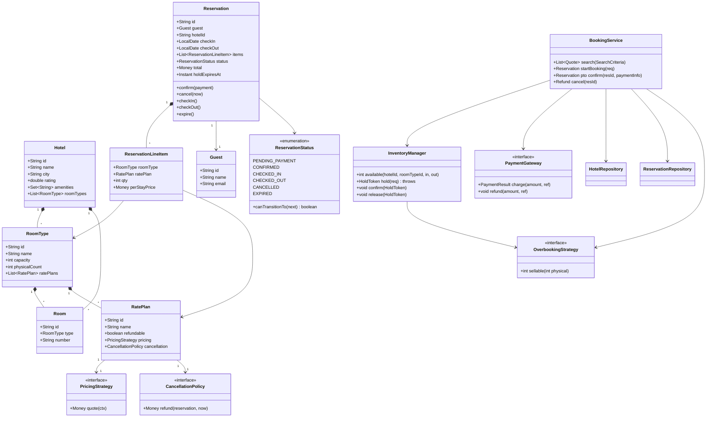
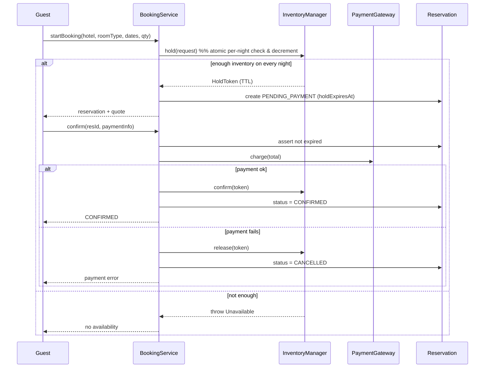

# Hotel Booking / Reservation — Low-Level Design

> A staff-level LLD / machine-coding reference and last-minute revision artifact.
> Companion file: `Solution.java` (a complete single-file implementation for reading & revision).

---

## 1. Problem statement

Design the object model and core services for a **hotel booking / reservation system**. The system manages a set of hotels, each containing rooms grouped by **room type** (e.g. *Deluxe*, *Suite*). Guests **search** for available rooms over a **date range**, **reserve** one or more rooms, **pay**, and later **cancel** or **modify** their booking. The single hardest requirement is **preventing double-booking** of the same physical room (or the same unit of an inventory bucket) for overlapping dates under concurrent requests, while supporting flexible **pricing / rate plans**, **cancellation policies**, **search filters**, and an optional **overbooking** strategy.

We are designing the **booking domain core** (entities + services), not the HTTP layer, persistence, or UI. We treat the storage as an in-memory abstraction so the concurrency logic is explicit and reviewable.

---

## 2. Clarifying / requirements questions to ask first

Lead with these in the round — *never* open with classes. Group them so the interviewer sees structured thinking.

**Functional scope**

1. Is a reservation for a **specific physical room** (room 412) or for a **room type / inventory bucket** ("a Deluxe room, assigned at check-in")? This is the single biggest modeling fork — most real systems book against a *bucket count*, not a named room.
2. Can one reservation contain **multiple rooms** and/or **multiple room types**? Multiple date ranges?
3. Do we support **modification** (change dates / room type) or only create + cancel?
4. Is **search** in scope, with filters (price, amenities, capacity, rating, location)? Sorting?
5. Do we need a **hold / temporary lock** while the guest enters payment (e.g. a 10-minute cart hold), or is reserve atomic with payment?
6. Cancellation: is there a **policy** (free until X hours before check-in, partial refund, non-refundable rate)?

**Non-functional / constraints**

7. Expected **scale**: rooms per hotel, hotels, peak concurrent booking attempts on the same room/date? This decides locking strategy (pessimistic vs optimistic).
8. Single-node in-memory, or **distributed** across services/DB? (Drives whether locks are JVM monitors or DB row locks / optimistic version columns / Redis leases.)
9. **Consistency** expectation: is brief overbooking acceptable (then reconcile), or must double-booking be *impossible*? Most hotels tolerate controlled overbooking on the bucket model.
10. Latency / throughput targets for search and for booking?

**Pricing & policy**

11. Is pricing **static per room type**, or **dynamic** (seasonal, day-of-week, occupancy-based, length-of-stay discount, promo codes)?
12. Multiple **rate plans** per room type (refundable vs non-refundable, breakfast-included)?
13. Currency / taxes / fees in scope?

**Lifecycle & edge**

14. Reservation **states** we must support (pending, confirmed, checked-in, checked-out, cancelled, expired, no-show)?
15. **Overbooking** allowed? If so, by what percentage and how do we handle a walk (relocating a guest)?
16. What happens to a hold if **payment fails or times out**?

**Out of scope (confirm):** auth/identity, loyalty points, channel-manager / OTA sync, housekeeping, real persistence, notifications.

---

## 3. Finalized requirements & assumptions

For this document I commit to a concrete, defensible scope and call out the fork explicitly.

**Functional**

- A `Hotel` owns many `Room`s; every `Room` has exactly one `RoomType`.
- Inventory is tracked **per (hotel, roomType, date)** as a **bucket count** — the realistic model — *and* I keep a `Room`/physical-assignment path so I can discuss both. Booking decrements the bucket for every night in `[checkIn, checkOut)`.
- A `Guest` searches by hotel + date range + occupancy, optionally filtered, and gets back available `RoomType`s with a computed **quote** (price for the stay).
- Booking is a **two-phase** flow: **HOLD** (soft reservation that reserves inventory for a short TTL) → **CONFIRM** (after payment). Holds **expire** and release inventory.
- `Reservation` moves through a **state machine**: `PENDING_PAYMENT → CONFIRMED → CHECKED_IN → CHECKED_OUT`, with `CANCELLED` and `EXPIRED` as terminal off-ramps.
- **Cancellation policy** computes a refund based on time-to-check-in and rate plan.

**Non-functional / assumptions**

- **Single JVM, in-memory** store so concurrency is explicit and reviewable. The double-booking defense is shown two ways: (a) per-key **pessimistic lock** around the check-then-decrement, and (b) **optimistic** CAS on a versioned inventory cell. I default to per-date-key locking and explain when optimistic wins.
- Date granularity is **per night**; a stay `[checkIn, checkOut)` is the half-open set of nights — the checkout day is **not** occupied.
- Money is modeled as `BigDecimal` (cents-safe) — never `double` for currency.
- Overbooking is supported as a **policy knob** (allow N over physical capacity) but defaults off.

---

## 4. Problem extensions / follow-up variations

These are the "senior shines here" add-ons. Each lists the **design impact**.

| Extension | Design impact |
|---|---|
| **Availability over date ranges** | Inventory keyed by `(hotel, roomType, LocalDate)`; a booking touches *every night* in the half-open range. Availability = `min` free count across all nights. |
| **Double-booking prevention** | Hold/confirm two-phase + atomic check-and-decrement per night. Choose pessimistic lock (per inventory key) **or** optimistic version CAS with retry. See §9. |
| **Holds / cart timeout** | `Reservation` in `PENDING_PAYMENT` with `expiresAt`; a sweeper (or lazy check) reclaims inventory on expiry. State machine guards illegal transitions. |
| **Pricing / rate plans** | `PricingStrategy` (Strategy pattern). Compose base + seasonal + occupancy + LOS discount + promo via a **chain of price rules** (Decorator/Composite over rules). Multiple `RatePlan`s per room type. |
| **Cancellation policy** | `CancellationPolicy` Strategy: refund = f(now, checkIn, ratePlan). Non-refundable plan = a policy returning 0. |
| **Search & filters** | `SearchCriteria` + `Specification`/predicate filters composed with AND/OR; `SortStrategy` for ordering (price asc, rating desc). |
| **Overbooking** | `OverbookingStrategy` decides the effective sellable count = physical + buffer. Adds a **walk / relocation** flow when oversold materializes. |
| **Multi-room / multi-type reservation** | Reservation holds a list of `LineItem`s; the hold step must be **all-or-nothing** across items (acquire all, else roll back) — a small transaction across inventory keys, ordered lock acquisition to avoid deadlock. |
| **Modification (change dates/type)** | Treat as **release old + hold new** atomically; recompute quote and refund/charge delta. |
| **Multi-currency / taxes** | `Money(amount, currency)`; pricing returns a breakdown (base, taxes, fees). |
| **Distributed deployment** | Replace JVM lock with DB row lock / `SELECT ... FOR UPDATE`, optimistic version column, or a Redis lease per inventory key; holds become rows with TTL. |

---

## 5. Core entities, responsibilities & relationships

**Entities (domain nouns)**

- **`Hotel`** — id, name, location, rating, amenities; owns `RoomType`s and `Room`s.
- **`RoomType`** — id, name (Deluxe/Suite), capacity, base attributes; the **inventory bucket** dimension.
- **`Room`** — a physical unit belonging to a `RoomType` (used for the physical-assignment variant and at check-in).
- **`RatePlan`** — a sellable price product on a room type (Refundable / Non-refundable / B&B), each with a `PricingStrategy` and `CancellationPolicy`.
- **`Guest`** — id, name, contact.
- **`Reservation`** — the aggregate: guest, hotel, line items, date range, status, total, hold expiry, payment ref. Owns its **state**.
- **`ReservationLineItem`** — (roomType, ratePlan, qty, per-night quote).
- **`Payment`** — amount, status, gateway ref (modeled via a `PaymentGateway` port).

**Services / supporting types**

- **`InventoryManager`** — source of truth for free counts per `(hotel, roomType, date)`; exposes atomic **hold / confirm / release**. *This is where double-booking is won or lost.*
- **`BookingService`** — orchestrates search → quote → hold → pay → confirm; coordinates `InventoryManager`, pricing, payment, and the reservation state machine.
- **`SearchService`** — applies `SearchCriteria` filters + `SortStrategy` over hotels/room types using `InventoryManager` for availability.
- **`PricingStrategy`** — computes a stay quote for a (roomType, ratePlan, dateRange, occupancy).
- **`CancellationPolicy`** — computes refund on cancel.
- **`OverbookingStrategy`** — effective sellable capacity.
- **`HoldReaper`** — expires stale holds (sweeper).

**Relationships (text UML)**

```
Hotel  1 ──*  RoomType         (composition: room types live in the hotel catalog)
Hotel  1 ──*  Room             (composition)
RoomType 1 ──* Room            (a room is of one type)
RoomType 1 ──* RatePlan        (sellable products on the type)
RatePlan 1 ──1 PricingStrategy        (strategy)
RatePlan 1 ──1 CancellationPolicy     (strategy)
Reservation 1 ──* ReservationLineItem (composition)
Reservation 1 ──1 Guest               (association)
Reservation "owns a" ReservationStatus (State)
BookingService ──> InventoryManager, PricingStrategy, PaymentGateway, repos (association/uses)
InventoryManager ──> InventoryCell per (hotel,roomType,date)
```

---

## 6. Design patterns applied

For each: **where / why / rejected alternative / when NOT to use**.

### State — reservation lifecycle
- **Where:** `Reservation` status transitions (`PENDING_PAYMENT → CONFIRMED → CHECKED_IN → CHECKED_OUT`, plus `CANCELLED`, `EXPIRED`).
- **Why:** transitions have rules ("can't cancel a checked-out stay", "can't confirm an expired hold"). State centralizes legal transitions and behavior per state, killing a sprawling `switch` on status.
- **Rejected alternative:** a status `enum` + `if/switch` in `BookingService`. Fine for 3 states; rots as states/guards grow and leaks lifecycle rules into the service.
- **When NOT to use:** very few states with trivial rules — an enum with a transition table is simpler. I implement it pragmatically with an `enum` that knows its allowed successors (a lightweight State), noted in §7.

### Strategy — pricing, search sort, cancellation, overbooking
- **Where:** `PricingStrategy`, `SortStrategy`, `CancellationPolicy`, `OverbookingStrategy`.
- **Why:** these are *policies that vary independently* and are swapped per rate plan / per request. Strategy gives Open/Closed extension — add a `SeasonalPricing` without touching `BookingService`.
- **Rejected alternative:** flags/params + branching inside one pricing method. Violates OCP and becomes untestable.
- **When NOT to use:** if there's exactly one fixed pricing rule forever — premature.

### Factory — reservations & rate-plan wiring
- **Where:** a `ReservationFactory` builds a fully-initialized `Reservation` (id, status, line items, quote, expiry) so construction rules live in one place; rate plans are assembled with their strategies.
- **Why:** non-trivial construction (id generation, default status, expiry computation) shouldn't be scattered.
- **Rejected alternative:** `new Reservation(...)` everywhere — duplicates invariants.
- **When NOT to use:** trivial value objects (`Money`) — just use a constructor.

### Repository — storage boundary
- **Where:** `HotelRepository`, `ReservationRepository`.
- **Why:** isolate the domain from persistence; in-memory now, DB later, without touching services. Enables swapping in DB-level locking for the distributed variant.
- **Rejected alternative:** services touching maps directly — couples domain to storage.

### Adapter / Port — payment gateway
- **Where:** `PaymentGateway` interface with a `MockPaymentGateway`.
- **Why:** the external payment system is a volatile dependency; an interface (port) lets us test and swap providers (Adapter for each real provider).

### (Supporting) Specification / Composite — search filters
- **Where:** composable `Predicate<RoomType>`-style filters in `SearchService`.
- **Why:** combine arbitrary AND/OR filters cleanly; each filter is single-responsibility.

**SOLID in play**

- **SRP:** `InventoryManager` only does counts/atomicity; `BookingService` orchestrates; pricing/cancellation live in their own strategies.
- **OCP:** new pricing/cancellation/overbooking rules added via new strategy classes, no edits to the orchestrator.
- **LSP:** any `PricingStrategy` is substitutable; `BookingService` depends only on the contract.
- **ISP:** narrow interfaces (`PricingStrategy`, `PaymentGateway`) instead of one fat "service".
- **DIP:** `BookingService` depends on abstractions (repos, gateway, strategies) injected in, not concretions.

---

## 7. Class diagram



**Key public APIs (signatures)**

```java
// Inventory — the atomicity boundary
int     available(String hotelId, String roomTypeId, LocalDate in, LocalDate out);
HoldToken hold(HoldRequest req);          // atomic all-or-nothing across nights; throws if unavailable
void    confirm(HoldToken token);          // turns a hold into committed inventory
void    release(HoldToken token);          // returns held units (cancel/expiry)

// Booking orchestration
List<Quote>  search(SearchCriteria c);
Reservation  startBooking(BookingRequest req);              // creates PENDING_PAYMENT + hold
Reservation  confirm(String reservationId, PaymentInfo p);  // charges + CONFIRMED
RefundResult cancel(String reservationId, Instant now);     // policy refund + release

// Strategies
Money quote(PricingContext ctx);
Money refund(Reservation r, Instant now);
int   sellable(int physical);
```

---

## 8. Key flows

### Booking (hold → pay → confirm)



### Cancellation
1. Load reservation; guard state (`CONFIRMED`/`PENDING_PAYMENT` cancellable; `CHECKED_OUT` not).
2. `refund = ratePlan.cancellationPolicy.refund(reservation, now)`.
3. `inventory.release(token)` for the held/confirmed nights.
4. `paymentGateway.refund(refund)`; set status `CANCELLED`.

### Hold expiry (reaper)
- Periodically (or lazily on access) scan `PENDING_PAYMENT` reservations with `holdExpiresAt < now`; `release` inventory; set status `EXPIRED`.

---

## 9. Concurrency, edge cases & extensibility

### Preventing double-booking — the core problem

The race: two requests both read "1 room free" for the same night, both decrement, and we oversell. The fix is to make **check-and-decrement atomic per inventory key**, across *every* night in the range.

**Option A — Pessimistic, per-key locking (my default)**
- Lock the inventory keys for the requested `(hotel, roomType, night)` set, **acquired in a canonical sorted order** to avoid deadlock, verify all nights have capacity, decrement all, release locks.
- Pros: simple to reason about, guarantees no oversell. Cons: lock contention on hot dates.
- In-JVM: a striped lock or a `ConcurrentHashMap` of per-key locks. Distributed: `SELECT ... FOR UPDATE` rows, or a Redis lease per key.

**Option B — Optimistic CAS on a versioned cell**
- Each inventory cell holds `(free, version)`. Read, compute, then `compareAndSet`; on failure, **retry** with bounded attempts.
- Pros: no blocking, great when contention is low. Cons: livelock/retry storms on hot dates; multi-night all-or-nothing is trickier (need to roll back partial decrements).
- I model the single-cell version with `AtomicInteger`/CAS in code to show the technique.

**Comparison**

| Approach | No oversell | Throughput under contention | Complexity | Best when |
|---|---|---|---|---|
| Pessimistic per-key lock | Strong | Lower (serializes hot keys) | Low | Hot dates, must-never-oversell |
| Optimistic version CAS | Strong (with retry) | High when low contention | Medium (retry + rollback) | Many keys, rarely contended |
| Hold + TTL on top of either | n/a (orthogonal) | — | — | Always — frees abandoned carts |

**Multi-night / multi-item atomicity:** acquire all needed keys (sorted) or CAS all cells; if any night lacks capacity, **roll back** the ones already taken. This is a tiny local transaction — emphasize **ordered acquisition** to prevent deadlock.

### Other concurrency points
- `Reservation` state transitions guarded so concurrent `confirm` and `expire` can't both succeed (compare-and-set on status / synchronized transition).
- Holds make the system **safe against slow payers**: inventory isn't lost forever if a guest abandons checkout.

### Edge cases
- `checkIn == checkOut` (zero nights) → reject. `checkOut < checkIn` → reject.
- Cancellation after check-in / no-show handling (policy-driven, often non-refundable).
- Payment success but confirm crashes → idempotent confirm keyed by reservation id; reconcile via held token.
- Hold expiring *during* payment → confirm must re-validate `holdExpiresAt`; if expired, fail and release.
- Overbooking realized (oversold) → `walk` flow: relocate guest, compensate.
- Daylight/timezone: store nights as hotel-local `LocalDate`.

### Extensibility (how the design absorbs §4)
- New pricing/cancel/overbooking rule → new Strategy class, zero orchestrator change (OCP).
- Distributed → swap `InventoryManager` impl (DB/Redis) behind the same interface (DIP).
- Multi-type reservation → already a list of line items; hold step iterates items.

---

## 10. Likely interview questions

**Q1. Room-vs-bucket: how do you model inventory and why?**
Book against a **per-(hotel, roomType, date) bucket count**, not a named room — that's how hotels actually sell (rooms assigned at check-in). It also makes availability a simple count and concurrency a `decrement`. Keep `Room` for physical assignment/housekeeping. *Probe: when book a specific room?* — accessible/connecting rooms, or apartment-style inventory: then lock the specific room's per-night cells.

**Q2. How exactly do you prevent double-booking?**
Two-phase **hold → confirm** plus an **atomic check-and-decrement per night**, all-or-nothing across the range. Pessimistic per-key locks (sorted acquisition) by default; optimistic version CAS with retry when contention is low. *Probe: deadlock?* — acquire keys in canonical order. *Probe: distributed?* — DB row locks / `FOR UPDATE` or Redis leases per key.

**Q3. Why a State pattern for the reservation, not just an enum?**
Transition rules and per-state behavior (can/can't cancel, expire, check-in) are real logic; State centralizes them and prevents illegal transitions, keeping `BookingService` thin (SRP). For only 2–3 states an enum-with-transition-table is enough — I use a lightweight enum that knows its successors. *Probe: who triggers EXPIRED?* — a reaper or lazy check on access.

**Q4. Where does Strategy earn its place, and where would it be over-engineering?**
Pricing, cancellation, sort, overbooking genuinely vary and get swapped per rate plan/request → Strategy (OCP). It'd be over-engineering for a single fixed pricing rule. *Probe: compose seasonal + LOS + promo?* — chain price rules (Decorator/Composite over rules) inside a `PricingStrategy`.

**Q5. Walk me through hold expiry. Why hold at all?**
Holds reserve inventory for a TTL so a slow/abandoning payer doesn't oversell or block forever. A reaper releases expired holds and sets `EXPIRED`. Confirm re-validates the hold isn't expired before charging. *Probe: race between expire and confirm?* — compare-and-set status; only one wins.

**Q6. How does pricing work for a multi-night stay with a promo?**
`PricingStrategy.quote(ctx)` sums per-night base × occupancy adjustments, applies LOS discount, then promo, returning a `Money` breakdown. Strategies compose. *Probe: taxes/fees/currency?* — return a `Money(amount, currency)` with a line breakdown; never use `double`.

**Q7. What's your cancellation/refund design?**
`RatePlan` carries a `CancellationPolicy` strategy: `refund = f(now, checkIn, plan)`. Non-refundable = policy returning 0; flexible = full refund until X hours prior, then partial. Cancel also releases inventory and refunds via the gateway. *Probe: no-show?* — policy returns 0, status moves to terminal.

**Q8. Design search with filters and sorting.**
`SearchService` takes `SearchCriteria`, builds composable predicate filters (price/amenities/capacity/rating) combined with AND, checks availability via `InventoryManager`, applies a `SortStrategy`. *Probe: scale?* — precompute availability indexes; this LLD keeps it in-memory.

**Q9. How is the design testable and swappable for production?**
Repositories and `PaymentGateway` are interfaces (Repository + Port/Adapter, DIP), so I inject in-memory fakes for tests and real DB/gateway in prod, and swap the `InventoryManager` for a DB/Redis impl without touching `BookingService`. *Probe: idempotent confirm?* — key by reservation id so a retried confirm doesn't double-charge.

**Q10. (Senior signal) Overbooking — model it and handle the fallout.**
`OverbookingStrategy.sellable(physical)` returns physical + buffer, used as the effective cap in `InventoryManager`. When oversell materializes at arrival, run a **walk** flow: relocate the guest to another room/hotel and compensate. *Probe: per-roomType buffer?* — yes, strategy can vary by type/season. *Probe: tradeoff?* — buffer too high → walks & reputation cost; too low → empty rooms; tune from no-show rates.

---

## PART C — Cheat-sheet & self-test

**Patterns used (recap)**
- **State** — reservation lifecycle & legal transitions.
- **Strategy** — pricing, cancellation, sort, overbooking (OCP).
- **Factory** — reservation construction / rate-plan assembly.
- **Repository** — storage boundary (DIP, swap to DB).
- **Adapter/Port** — `PaymentGateway`.
- **Specification/Composite** — composable search filters.

**Key design decisions (recap)**
- Inventory is a **per-(hotel, roomType, date) bucket**; a stay is the half-open night set `[checkIn, checkOut)`.
- **Hold → confirm** two-phase with TTL beats double-booking + handles slow payers.
- Atomic **check-and-decrement per night**; pessimistic per-key lock (sorted) by default, optimistic CAS as the low-contention alternative.
- Money is `BigDecimal`-backed `Money`; never `double`.
- Services depend on abstractions (repos, gateway, strategies) → DIP everywhere.

**Self-test (no answers)**
1. Two requests hit the last Deluxe room for the same 3 nights. Trace, line by line, why exactly one succeeds in both the pessimistic and the optimistic implementations — and where deadlock could occur.
2. A guest holds a room, payment is slow, the hold expires *mid-charge*. What sequence of checks prevents both oversell and a successful-charge-without-room?
3. Add a "non-refundable, breakfast-included, 10% LOS discount over 4 nights" rate plan **without** modifying `BookingService`. Which classes do you add?
4. Switch from single-JVM to a 3-node service + shared SQL DB. What changes in `InventoryManager`, and what stays the same?
5. The business wants 5% overbooking on weekends only. Where does that knob live, and what new flow must you add for when it bites?
