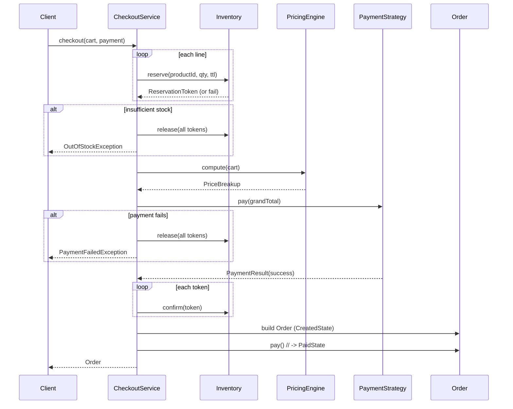

# LLD Design Document — Online Shopping Cart (Amazon)

> **Reader profile:** senior Java engineer prepping for an LLD / machine-coding round. This is a *design reference + last-minute revision artifact*. PART A is the full design, PART B is the single-file Java solution (`Solution.java`), PART C is a cheat-sheet and self-test.

---

# PART A — Design Document

## 1. Problem statement

Design the object model and core logic for an **online shopping cart** (Amazon-style e-commerce checkout subsystem). A user browses a **catalog** of products organized into nested **categories**, adds **products** to a **cart**, optionally moves things to a **wishlist**, applies **coupons/discounts**, and **checks out** — at which point we **reserve inventory**, compute a final price through a **pricing pipeline**, take a **payment** via one of several methods, and create an **order** that transitions through a lifecycle (placed → paid → shipped → delivered, with cancel/refund paths).

We are **not** building the HTTP API, the persistence layer, or the UI. We are building the **in-memory domain model**: the entities, their responsibilities, the pricing and checkout logic, and the concurrency control on shared inventory. The deliverable is clean, SOLID, pattern-driven Java that a reviewer can read and reason about.

> *Adjacent term — LLD (Low-Level Design):* the class-and-method level design of a single subsystem (entities, relationships, patterns, key algorithms), as opposed to HLD (High-Level Design) which is about services, datastores, and network topology.

---

## 2. Clarifying / requirements questions to ask first

A real round starts here. I would ask the interviewer:

**Functional scope**
1. Is this a **single user's session** or a multi-user system where many carts contend for the **same stock**? (Determines whether concurrency on inventory is in scope — it usually is for "Amazon".)
2. Should the cart support **guest** carts (anonymous) and **merge** into a user cart on login, or only logged-in users?
3. What **product types** — simple products only, or **variants** (size/color SKUs), **bundles**, and **digital vs physical** goods?
4. Is **catalog browsing** in scope (nested categories, search), or do we assume the product is already known?
5. What **discount/coupon** kinds must we support — percentage-off, flat-off, buy-X-get-Y, free-shipping, category-specific, cart-level vs item-level, **stackable** or mutually exclusive?
6. Which **payment methods** — credit card, wallet, UPI, gift card, COD (cash on delivery)? Can payment be **split** across methods?
7. What is the **order lifecycle** we must model (placed, paid, shipped, delivered, cancelled, returned/refunded)? Which transitions are allowed?
8. Is **wishlist** / save-for-later in scope, including moving items between cart and wishlist?

**Non-functional / constraints**
9. Expected **concurrency**: do we need thread-safety on inventory, or is this single-threaded for the interview? (I'll design thread-safe and note where.)
10. **Inventory reservation** semantics: do we decrement stock when added to cart, at checkout, or reserve-with-timeout? Overselling tolerance?
11. **Consistency** requirement: must "available stock" never go negative even under race? (Yes for money/stock — strong consistency.)
12. Currency, rounding, and tax handling — single currency, integer minor-units (paise/cents) or `BigDecimal`?

**Scope-narrowing (what's in / out)**
13. Out of scope: real payment-gateway integration (we'll mock a `PaymentGateway`), persistence/DB, network/API layer, auth, shipping-carrier integration, search ranking. In scope: domain entities, pricing pipeline, coupon engine, checkout orchestration, order state machine, inventory concurrency. **Agreed?**

I'll proceed on the assumptions below.

---

## 3. Finalized requirements & assumptions

**Functional (in scope)**
- **Catalog**: products organized into **nested categories** (a category can hold sub-categories and products). Browse/traverse uniformly.
- **Product**: id, name, unit price (in **minor units**, `long` cents — avoids float drift), category.
- **Cart**: holds `CartItem`s (product + quantity). Add/update/remove; compute subtotal; apply coupons; checkout.
- **Wishlist**: save products for later; move item cart ⇄ wishlist.
- **Inventory**: tracks `available` and `reserved` quantity per product. Supports **reserve** (with optional TTL), **confirm** (on payment), **release** (on cancel/timeout). **Thread-safe**, never oversells.
- **Pricing pipeline**: composable stages — item subtotal → item discounts → cart-level coupon → shipping → tax → final total. Each stage is a **Strategy**.
- **Coupons/discounts**: `PercentageOff`, `FlatOff`, `BuyXGetYFree`, `FreeShipping` — pluggable, with validation (min cart value, applicable categories).
- **Payment**: `CreditCard`, `Wallet`, `UPI`, `CashOnDelivery` — pluggable strategies behind a mock gateway.
- **Order**: created at checkout; **state machine** CREATED → PAYMENT_PENDING → PAID → SHIPPED → DELIVERED, plus CANCELLED and REFUNDED with guarded transitions.

**Non-functional / assumptions**
- Multi-user; **shared inventory is contended** → concurrency control required.
- Money as `long` minor units; rounding handled explicitly in pricing.
- Reservation is taken **at checkout start**, confirmed on payment success, released on failure/cancel/timeout.
- In-memory only; no DB/network. Single JVM. `PaymentGateway` is mocked.
- Coupons are **not stackable** by default (one cart-level coupon) but item-level discounts can coexist — kept simple, with a note on how to extend.

---

## 4. Problem extensions / follow-up variations

These are the common "now add X" follow-ups. The design is built so each is a localized change.

| Extension | What it touches | Design impact |
|---|---|---|
| **Stock reservation with TTL** | `Inventory` | Add `reservedUntil` timestamp + a sweeper that releases expired reservations. Already modeled via `reserve(qty, ttl)` and `releaseExpired()`. |
| **New discount type** (e.g., BOGO, tiered, coupon stacking) | Discount strategies | Implement a new `DiscountStrategy` / `Coupon`; register it. **No change** to cart/pricing engine (Open/Closed). |
| **New payment method** (gift card, EMI, split-pay) | Payment strategies | New `PaymentStrategy`; checkout calls the interface. Split-pay = a composite strategy iterating methods. |
| **Order placement → fulfillment** | `Order` state machine | Add states/transitions (PACKED, OUT_FOR_DELIVERY). The `OrderState` interface localizes each transition's rules. |
| **Wishlist & save-for-later** | `Wishlist`, `Cart` | Move semantics between two `ItemContainer`s; already modeled. |
| **Concurrency on stock** | `Inventory` | Per-product locking / atomic CAS so two checkouts can't oversell the last unit. Covered in §9. |
| **Price-calculation pipeline** | `PricingEngine` | Ordered list of `PricingStage`s (Chain-of-Responsibility-ish). Insert tax/shipping/loyalty stages without touching others. |
| **Product variants / bundles** | `Product` hierarchy | Introduce `VariantProduct` / `BundleProduct`; pricing reads `getUnitPrice()` polymorphically. |
| **Notifications on stock / price drop** | `Inventory`, `Product` | **Observer**: subscribers (email, wishlist alert) notified on `back-in-stock` / `price-change`. Modeled. |
| **Tax/locale rules** | Pricing stage | A `TaxStage` keyed by region — Strategy by region. |

---

## 5. Core entities, responsibilities & relationships

**Entities & responsibilities**

- **`Money`** — value object wrapping `long` minor units + currency; arithmetic + formatting. Immutable.
- **`Product`** — id, name, `Money` unitPrice, category ref. Plus `Subject` for price/stock observers.
- **`CatalogComponent`** (Composite) — common type for `Category` and `Product` leaf access; `getProducts()` traverses the tree.
  - **`Category`** — composite node: children = sub-categories + products.
  - (Product participates as the leaf via an adapter in the catalog tree.)
- **`Cart`** — collection of `CartItem`; holds an optional applied `Coupon`; delegates total to `PricingEngine`; orchestrates checkout via `CheckoutService`.
- **`CartItem`** — product + quantity; line subtotal.
- **`Wishlist`** — set of products; move-to-cart.
- **`Inventory`** — per-product stock with `available`/`reserved`; thread-safe reserve/confirm/release.
- **`DiscountStrategy` / `Coupon`** — pluggable price reductions with validation.
- **`PricingEngine` + `PricingStage`** — ordered pipeline computing the final `PriceBreakup`.
- **`PaymentStrategy` + `PaymentGateway`** — pluggable payment methods.
- **`Order` + `OrderState`** — checkout output with a guarded state machine.
- **`User`** — owns cart + wishlist.
- **`Observer` / `Subject`** — stock & price-change notifications.

**Relationships (text UML)**
```
User "1" o-- "1" Cart                 (aggregation; user has a cart)
User "1" o-- "1" Wishlist
Cart "1" *-- "many" CartItem          (composition; items die with cart)
CartItem "many" --> "1" Product       (association)
Category "1" *-- "many" CatalogComponent  (Composite: sub-categories + products)
Category --|> CatalogComponent        (inheritance)
ProductLeaf --|> CatalogComponent
Cart ..> PricingEngine                (uses)
PricingEngine "1" *-- "many" PricingStage (ordered pipeline)
PricingStage <|.. DiscountStage, ShippingStage, TaxStage
Coupon ..|> DiscountStrategy
CheckoutService ..> Inventory, PricingEngine, PaymentStrategy, Order
Order "1" *-- "1" OrderState          (State pattern; current state)
OrderState <|.. CreatedState, PaidState, ShippedState, ...
Product --|> Subject                  (Observer: notifies on stock/price)
Inventory ..> Subject                 (raises back-in-stock events)
PaymentStrategy <|.. CreditCard, Wallet, UPI, CashOnDelivery
```

---

## 6. Design patterns applied

For each: **where / why / rejected alternative / when-not**.

### 6.1 Strategy — discounts/coupons, pricing stages, payment methods
- **Where:** `DiscountStrategy` (PercentageOff, FlatOff, BuyXGetYFree, FreeShipping), `PaymentStrategy` (CreditCard/Wallet/UPI/COD), and each `PricingStage`.
- **Why:** these are families of interchangeable algorithms selected at runtime; new variants must not modify existing code. Strategy gives **Open/Closed** — add a class, register it.
- **Rejected alternative:** a big `switch`/`if-else` on a `discountType` enum inside the cart. Rejected because every new discount edits the cart (violates OCP) and bloats one class (SRP). 
- **When not:** if there were exactly one fixed pricing rule that never changes, a strategy interface is over-engineering — inline it.

### 6.2 Composite — catalog categories
- **Where:** `CatalogComponent` with `Category` (composite) and product leaves.
- **Why:** categories nest arbitrarily; we want to treat "a category" and "a product within it" **uniformly** when traversing/listing. Composite lets `getProducts()` recurse without the client knowing tree depth.
- **Rejected alternative:** parent-pointer flat lists with manual recursion in clients. Rejected: leaks tree structure to every caller, duplicates traversal logic.
- **When not:** a strictly two-level taxonomy (department → product) doesn't need Composite; a `Map<Category, List<Product>>` suffices.

### 6.3 State — order lifecycle
- **Where:** `Order` delegates `pay()/ship()/deliver()/cancel()/refund()` to a `OrderState`.
- **Why:** each state allows different transitions; encoding this as `if (status == ...)` scatters rules and is error-prone. State **localizes** each transition's legality in its own class and makes illegal transitions throw.
- **Rejected alternative:** an enum `OrderStatus` + a transition table / switch. The table is viable and compact; I prefer State here because each state also carries behavior (e.g., side-effects on entry), but I'd note the enum+table is perfectly acceptable and lighter for pure transition checks.
- **When not:** if the only thing varying is the *set of allowed next states* (no per-state behavior), an enum transition map is simpler.

### 6.4 Observer — stock and price-change notifications
- **Where:** `Product`/`Inventory` are `Subject`s; `StockObserver` (e.g., back-in-stock email, wishlist alert) subscribe.
- **Why:** decouples the inventory from the open-ended set of things interested in "back in stock" / "price dropped". Add subscribers without touching inventory (OCP, low coupling).
- **Rejected alternative:** inventory directly calling a notification service. Rejected: tight coupling, hard to add/remove listeners, violates Dependency Inversion.
- **When not:** if there's exactly one consumer and it never changes, a direct call is fine.

### 6.5 Builder — `Order` / `PriceBreakup` construction
- **Where:** building an immutable `Order` (many fields) and the `PriceBreakup` breakdown.
- **Why:** many optional/derived fields; telescoping constructors are unreadable. Builder gives readable, validated, immutable construction.
- **Rejected alternative:** setters on a mutable order — breaks immutability and invariants.
- **When not:** 2–3 fields → just a constructor.

### 6.6 Facade — `CheckoutService`
- **Where:** orchestrates reserve → price → pay → confirm/release → create order.
- **Why:** gives the cart/client one entry point and hides the multi-step protocol and rollback. 
- **Rejected alternative:** cart does it all — God object, hard to test.

### 6.7 Singleton-ish registries (used judiciously)
- **Where:** `Inventory` and `Catalog` are *application-scoped* services injected, not global statics. (I avoid classic Singleton to keep testability; noted as a tradeoff.)

**SOLID in play**
- **S**RP: `Cart` holds items; `PricingEngine` computes price; `Inventory` manages stock; `CheckoutService` orchestrates — no God object.
- **O**CP: new discount/payment/pricing-stage/order-state = new class, no edits to engines.
- **L**SP: every `DiscountStrategy`/`PaymentStrategy`/`OrderState` is fully substitutable behind its interface.
- **I**SP: small focused interfaces (`DiscountStrategy`, `PaymentStrategy`, `PricingStage`, `OrderState`) rather than one fat interface.
- **D**IP: `CheckoutService` depends on the `PaymentStrategy`/`Inventory` abstractions, not concretes.

---

## 7. Class diagram

```mermaid
classDiagram
    class Money {
        -long minorUnits
        -String currency
        +add(Money) Money
        +subtract(Money) Money
        +multiply(int) Money
        +percentage(int) Money
        +isNegative() boolean
    }

    class User {
        -String id
        -String name
        -Cart cart
        -Wishlist wishlist
    }

    class CatalogComponent {
        <<abstract>>
        +getName() String
        +getProducts() List~Product~
        +display(int) void
    }
    class Category {
        -List~CatalogComponent~ children
        +add(CatalogComponent) void
    }
    class ProductLeaf
    CatalogComponent <|-- Category
    CatalogComponent <|-- ProductLeaf

    class Product {
        -String id
        -String name
        -Money unitPrice
        -String categoryId
        +setPrice(Money) void
    }
    class Subject {
        <<abstract>>
        -List~StockObserver~ observers
        +subscribe(StockObserver) void
        +notifyBackInStock() void
        +notifyPriceChange(Money) void
    }
    Subject <|-- Product
    ProductLeaf ..> Product

    class StockObserver {
        <<interface>>
        +onBackInStock(Product) void
        +onPriceChange(Product, Money) void
    }

    class CartItem {
        -Product product
        -int quantity
        +lineSubtotal() Money
    }
    class Cart {
        -Map~String,CartItem~ items
        -Coupon coupon
        +addItem(Product,int) void
        +removeItem(String) void
        +applyCoupon(Coupon) void
        +priceBreakup(PricingEngine) PriceBreakup
    }
    class Wishlist {
        -Set~Product~ products
        +add(Product) void
        +moveToCart(Product, Cart) void
    }
    Cart "1" *-- "many" CartItem
    CartItem --> Product
    User o-- Cart
    User o-- Wishlist

    class DiscountStrategy {
        <<interface>>
        +apply(Cart, PriceContext) Money
        +isApplicable(Cart) boolean
    }
    class Coupon {
        -String code
        -DiscountStrategy strategy
    }
    DiscountStrategy <|.. PercentageOff
    DiscountStrategy <|.. FlatOff
    DiscountStrategy <|.. BuyXGetYFree
    DiscountStrategy <|.. FreeShipping
    Coupon o-- DiscountStrategy

    class PricingStage {
        <<interface>>
        +apply(PriceContext) void
    }
    class PricingEngine {
        -List~PricingStage~ stages
        +compute(Cart) PriceBreakup
    }
    PricingEngine "1" *-- "many" PricingStage
    PricingStage <|.. SubtotalStage
    PricingStage <|.. ItemDiscountStage
    PricingStage <|.. CouponStage
    PricingStage <|.. ShippingStage
    PricingStage <|.. TaxStage

    class Inventory {
        -Map~String,Stock~ stockByProduct
        +reserve(String,int,long) ReservationToken
        +confirm(ReservationToken) void
        +release(ReservationToken) void
        +releaseExpired() void
        +available(String) int
    }

    class PaymentStrategy {
        <<interface>>
        +pay(Money) PaymentResult
        +refund(Money) PaymentResult
    }
    PaymentStrategy <|.. CreditCardPayment
    PaymentStrategy <|.. WalletPayment
    PaymentStrategy <|.. UpiPayment
    PaymentStrategy <|.. CashOnDelivery

    class OrderState {
        <<interface>>
        +pay(Order) void
        +ship(Order) void
        +deliver(Order) void
        +cancel(Order) void
        +refund(Order) void
        +name() String
    }
    class Order {
        -String id
        -List~CartItem~ lines
        -PriceBreakup price
        -OrderState state
        +pay() void
        +ship() void
        +deliver() void
        +cancel() void
    }
    Order "1" *-- "1" OrderState
    OrderState <|.. CreatedState
    OrderState <|.. PaidState
    OrderState <|.. ShippedState
    OrderState <|.. DeliveredState
    OrderState <|.. CancelledState

    class CheckoutService {
        -Inventory inventory
        -PricingEngine pricingEngine
        +checkout(Cart, PaymentStrategy) Order
    }
    CheckoutService ..> Inventory
    CheckoutService ..> PricingEngine
    CheckoutService ..> PaymentStrategy
    CheckoutService ..> Order
```



**Key public APIs / signatures**
```java
// Cart
void addItem(Product p, int qty);
void updateQuantity(String productId, int qty);
void removeItem(String productId);
void applyCoupon(Coupon c);
PriceBreakup priceBreakup(PricingEngine engine);

// Inventory (thread-safe)
ReservationToken reserve(String productId, int qty, long ttlMillis);
void confirm(ReservationToken token);
void release(ReservationToken token);
int available(String productId);

// CheckoutService (Facade)
Order checkout(Cart cart, PaymentStrategy payment);

// Order (State)
void pay(); void ship(); void deliver(); void cancel(); void refund();

// PricingEngine
PriceBreakup compute(Cart cart);
```

---

## 8. Key flows

### 8.1 Checkout (happy path) — steps
1. `CheckoutService.checkout(cart, payment)`.
2. For each cart line, `inventory.reserve(productId, qty, ttl)` → collect `ReservationToken`s. If any reservation fails (insufficient stock) → release all already-taken tokens, throw `OutOfStockException`.
3. `pricingEngine.compute(cart)` runs the pipeline → `PriceBreakup` (subtotal, item discounts, coupon, shipping, tax, grand total).
4. `payment.pay(breakup.grandTotal())`. On failure → release all tokens, throw `PaymentFailedException`.
5. On success → `inventory.confirm(token)` for each (moves reserved → consumed).
6. Build `Order` (Builder) in `CreatedState`, then `order.pay()` → `PaidState`.
7. Return order.

### 8.2 Sequence diagram



### 8.3 Pricing pipeline
`PriceContext` flows through ordered stages, each mutating the running breakup:
`SubtotalStage` → `ItemDiscountStage` → `CouponStage` → `ShippingStage` → `TaxStage`. Grand total = subtotal − discounts − coupon + shipping + tax (clamped to ≥ 0).

---

## 9. Concurrency, edge cases & extensibility

### Concurrency / thread-safety
- **The contention point is `Inventory`.** Two users racing for the last unit must not both succeed.
- **Approach:** per-product lock striping. Each `Stock` holds its own state guarded by a `ReentrantLock` (or `synchronized` on the `Stock`); reserve does a check-and-decrement **atomically** under that lock. This gives fine-grained locking (different products don't block each other) and **never oversells**.
- **Alternative considered:** a single global lock on `Inventory` — correct but serializes *all* reservations; rejected for throughput. Or lock-free CAS on an `AtomicInteger available` — works for simple decrement but gets awkward once we also track `reserved` + per-token bookkeeping, so I use a short critical section per product.
- **Reservation TTL:** reservations carry an expiry; `releaseExpired()` (run by a sweeper thread / on access) returns abandoned reservations to `available`, preventing stock leaks from abandoned carts.
- **Order state machine** mutates a single order — guard `Order` transitions with synchronization if shared; in practice an order is owned by one checkout.
- Collections in `Cart` are per-user (no sharing) so they need not be concurrent; `Inventory` maps use `ConcurrentHashMap` for safe concurrent product access.

### Edge cases
- Add item with qty ≤ 0 → reject. Update to 0 → remove line.
- Coupon not applicable (below min cart value / wrong category / expired) → `isApplicable` returns false; engine ignores it (or surfaces a message).
- Final price computed negative (over-aggressive discount) → clamp to `Money.ZERO`.
- Payment success but `confirm` fails (shouldn't, since we hold reservations) → reservations already guarantee the units; confirm is bookkeeping.
- Empty cart checkout → reject.
- Duplicate add of same product → increment quantity, don't duplicate line.
- Partial stock (want 5, have 3) → fail the whole reservation (atomic), don't partially reserve (configurable).
- Money rounding: percentage discounts rounded half-up at the line, computed in minor units to avoid float error.

### Extensibility (how the design absorbs §4)
- New discount/payment/pricing-stage/order-state → new class implementing the interface; **zero edits** to engines (OCP).
- Variants/bundles → subclass `Product` or wrap; `getUnitPrice()` stays polymorphic.
- Coupon stacking → change `Cart` to hold a `List<Coupon>` and `CouponStage` to fold them (with stacking policy); engine shape unchanged.
- Notifications → register more `StockObserver`s.

---

## 10. Likely interview questions

**Q1. Why Strategy for discounts instead of an enum + switch?**
Each discount is a distinct algorithm with its own validation. Strategy makes adding `BuyXGetYFree` a new class with no edits to the cart or pricing engine (Open/Closed), and each strategy is independently testable. An enum+switch concentrates all discount logic in one growing method — every new type risks breaking existing ones. *Follow-up: when would the enum be acceptable?* When the set is fixed and tiny and the logic is one-liners — then Strategy is ceremony.

**Q2. How do you prevent overselling the last unit under concurrency?**
Reservation is a **check-and-decrement under a per-product lock**, so the read of `available` and the decrement are atomic. Two threads can't both see "1 available" and both succeed. I use per-product (striped) locking so unrelated products don't contend. *Follow-up: global lock vs striped vs CAS?* Global lock is simplest but serializes everything; CAS is lock-free but awkward with multi-field reserved/confirmed bookkeeping; striped lock is the balance.

**Q3. Why a pricing pipeline of stages rather than one `computeTotal()` method?**
Separation of concerns: subtotal, item discounts, coupon, shipping, tax are independent concerns that compose in a defined order. Each is a `PricingStage` you can insert/reorder/test in isolation (e.g., add `LoyaltyPointsStage` without touching tax). It's a Chain-of-Responsibility-flavored pipeline. *Follow-up: order dependence?* Stages are ordered; tax usually applies after discounts — the engine owns the ordering so it's explicit, not implicit.

**Q4. Why State for the order lifecycle over a status enum?**
Each state permits a different set of transitions and may carry entry behavior. State puts each transition's legality in its own class and makes illegal calls (e.g., `ship()` on a CANCELLED order) throw, instead of scattering `if (status==...)` checks. *Follow-up: when is enum+transition-table better?* When there's no per-state behavior — just allowed-next-state checks; then a map is lighter.

**Q5. When is inventory decremented — add-to-cart, checkout, or payment?**
At **checkout start** we *reserve* (so the price/payment step is backed by real stock), **confirm** on payment success, **release** on failure/timeout. Decrementing at add-to-cart causes stock to be held by browsers who never buy; decrementing only at payment risks overselling between price and pay. Reservation-with-TTL is the standard middle ground. *Follow-up: abandoned carts?* TTL + sweeper releases expired reservations.

**Q6. How does the cart-to-wishlist move stay consistent?**
Both are item containers; `moveToCart`/`moveToWishlist` is remove-from-one + add-to-other as a single operation owned by the `User`/`Wishlist`, so we never end up with the item in both or neither.

**Q7. How would you add split payment (pay part by wallet, part by card)?**
A `CompositePaymentStrategy` holding an ordered list of `(PaymentStrategy, Money)` allocations; it implements the same `PaymentStrategy.pay()` interface and iterates, rolling back already-charged legs if a later leg fails. The checkout code is unchanged — it just sees a `PaymentStrategy`. *(Senior signal: composing strategies + rollback.)*

**Q8. Money as double, BigDecimal, or long minor-units — why?**
`double` is out (binary float can't represent 0.10 exactly → drift). I use `long` minor units (cents/paise) for speed and exactness with explicit rounding; `BigDecimal` is the alternative when multi-currency precision/locale formatting dominates. *Follow-up: rounding for % discounts?* Round half-up at the line level in minor units.

**Q9. Where are the SOLID violations if a junior put everything in `Cart`?**
SRP (cart now prices, reserves stock, charges payment), OCP (every new discount/payment edits cart), DIP (cart depends on concrete `CreditCard`). The fix is exactly the extracted `PricingEngine`, `Inventory`, `CheckoutService`, and the strategy interfaces. *(Senior signal.)*

**Q10. How do you make the catalog browsable across nested categories without callers knowing the depth?**
Composite: `Category` and product leaves share `CatalogComponent`; `getProducts()` recurses, so a client can list "everything under Electronics" without manual tree walking. *(Senior signal: pattern + uniform treatment.)* *Follow-up: cycle safety?* Categories form a tree (no cycles by construction); if arbitrary graphs were allowed, track visited nodes.

---

# PART C — Cheat-sheet & self-test

### Patterns & key decisions recap
- **Strategy** → discounts, payment methods, pricing stages (Open/Closed for new variants).
- **Composite** → nested catalog categories (uniform traversal).
- **State** → order lifecycle (guarded transitions in per-state classes).
- **Observer** → back-in-stock / price-drop notifications (decoupled subscribers).
- **Builder** → immutable `Order` / `PriceBreakup`.
- **Facade** → `CheckoutService` hides reserve→price→pay→confirm/release.
- **Concurrency** → per-product striped locking on `Inventory`; reserve = atomic check-and-decrement; reservation TTL + sweeper; never oversells.
- **Money** → `long` minor units, explicit half-up rounding.
- **SOLID** → SRP-split services; OCP via strategy/state; DIP via interfaces at the checkout boundary.

### Self-test (no answers)
1. Walk the exact rollback sequence if payment fails *after* three of four lines were reserved. Which tokens get released and who triggers it?
2. Implement coupon **stacking** with a "max 1 percentage + 1 flat" policy — which classes change and which don't?
3. Replace per-product locks with a lock-free design — sketch the CAS loop for reserve and the failure retry.
4. Add an `OUT_FOR_DELIVERY` state between SHIPPED and DELIVERED — what transitions and classes do you add, and what stays untouched?
5. The interviewer says "make `Inventory` a Singleton." State two reasons that hurts testability and how dependency injection avoids them.
