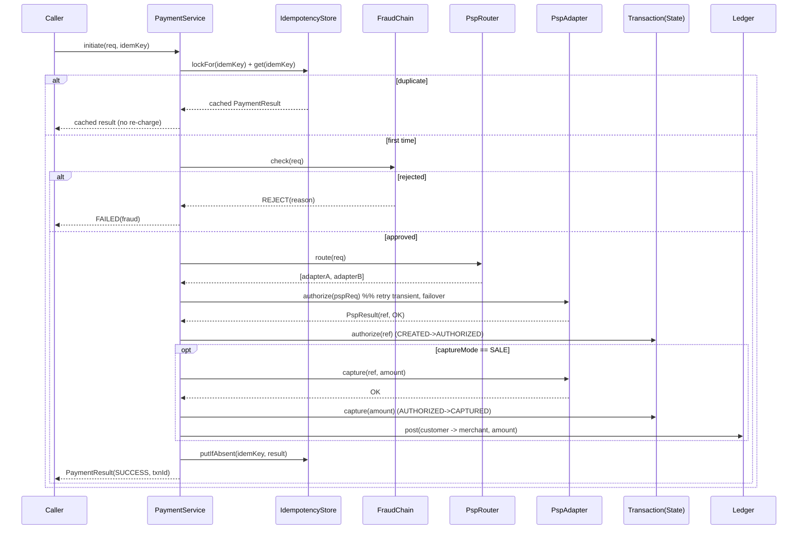

# LLD: Payment Gateway / Payment Processing

> A staff-level low-level-design reference and last-minute revision artifact.
> **PART A** is the full design document; **PART C** is the cheat-sheet & self-test.
> The companion `Solution.java` is **PART B** — a single-file, read-and-revise Java artifact.

---

## PART A — Design Document

### 1. Problem statement

Design the core of a **Payment Gateway** (sometimes called a *payment orchestration layer*). The system sits between a merchant's application and one or more **PSPs** (Payment Service Providers — the external companies that actually move money, e.g. Stripe, Razorpay, PayPal, a bank's acquiring network). A merchant asks our service to *charge* a customer using some **payment method** (card, UPI, wallet, net-banking). Our service must:

- Accept a payment request, **validate** it, run **fraud / risk checks**, and route it to an appropriate PSP.
- Manage the **lifecycle** of a transaction (created → authorized → captured → settled / failed / refunded) as an explicit state machine.
- Guarantee **idempotency** — a retried request (same idempotency key) must never charge the customer twice.
- Handle **asynchronous callbacks / webhooks** from PSPs (many payment rails confirm out-of-band), plus **retries** and **status reconciliation** when callbacks are lost.
- Support **refunds** (full and partial).
- Maintain a **ledger** of money movements with thread-safe balance updates.

> *Adjacent terms (for newcomers):*
> - **PSP / acquirer:** the third party that interacts with card networks / banks to actually settle money.
> - **Authorization vs capture:** *authorize* reserves funds on the customer's card; *capture* actually pulls them. Many flows authorize at checkout and capture on shipment.
> - **Settlement:** the bank-to-bank money transfer that completes days later.
> - **Webhook:** an HTTP callback the PSP sends us when a payment's status changes asynchronously.
> - **Idempotency key:** a client-supplied unique token so re-sending the same request is a no-op the second time.

We are designing the **in-process object model and orchestration logic**, not the HTTP layer, DB schema, or distributed infra (those are discussed as extensions).

---

### 2. Clarifying / requirements questions to ask first

Lead with these in the interview — *never* start drawing classes. Group them so the interviewer sees structured thinking.

**Functional scope**
1. Which **payment methods** must we support at launch — cards only, or also UPI, wallets, net-banking, BNPL? Is the set fixed or pluggable?
2. Do we integrate with **one PSP or many**? If many, who decides routing — static config, least-cost routing, or failover?
3. Is the flow **auth-then-capture** (two-step) or **sale** (single-step charge)? Do we need both?
4. Are **refunds** in scope? Full only, or partial and multiple partial refunds per transaction?
5. Do we need **recurring / subscription** charges, or only one-off payments?
6. Are payments **synchronous** (PSP answers immediately) or **asynchronous** (PSP confirms later via webhook), or both?

**Non-functional / constraints**
7. What is the expected **throughput** (TPS) and **latency** budget per charge?
8. **Idempotency** guarantee: must a duplicate request be impossible to double-charge? What's the dedup window / key scheme?
9. **Consistency** of the ledger — strict (no overdraw ever) or eventually consistent with reconciliation?
10. Is this **single-process** (machine-coding scope) or **distributed** (multiple nodes, shared DB)? This changes whether in-memory locks suffice.
11. **Availability / failover** expectations if a PSP is down — fail fast, queue, or route to backup PSP?

**Data / compliance / out-of-scope**
12. Do we store **PAN / card data** (PCI-DSS scope) or only tokenize via the PSP? (Almost always: tokenize, don't store raw card numbers.)
13. **Currency** — single currency or multi-currency with FX?
14. Is **fraud scoring** a simple rule chain or an external ML service we call?
15. What is explicitly **out of scope**: the merchant onboarding, payout/settlement reconciliation with banks, the actual PSP SDKs, persistence engine?

**Assumed answers for this document** (stated so the design is concrete) are in §3.

---

### 3. Finalized requirements & assumptions

**In scope (functional):**
- Multiple **payment methods**, pluggable: `CARD`, `UPI`, `WALLET`, `NETBANKING`.
- Multiple **PSPs**, integrated through adapters; routing by a pluggable router (default: first PSP that supports the method, with failover).
- **Two-step** (authorize → capture) *and* single-step **sale** (= authorize+capture).
- **Refunds**: full and multiple partial refunds, bounded by captured amount.
- **Idempotency**: every initiate carries an idempotency key; duplicates return the original result, never re-charge.
- **Async callbacks**: PSP can confirm later via a webhook handler; we also support **polling reconciliation** for lost callbacks.
- **Retries** on transient PSP failures with bounded attempts.
- **Fraud / validation** as a configurable **chain**.
- **Ledger** with thread-safe balance updates per account.

**Non-functional / assumptions:**
- **Single-process, multi-threaded** machine-coding scope (concurrency handled with in-JVM primitives). We note exactly what changes for distributed deployment in §9 and §10.
- We **tokenize** card data; we never persist a raw PAN. Card objects carry only a token + last4 + brand.
- **Single currency** per transaction; `Money` carries an ISO currency code so multi-currency is a later extension.
- Persistence abstracted behind repository interfaces; default impl is in-memory (`ConcurrentHashMap`).
- Idempotency dedup is in-memory with a key; in production this is a DB unique constraint / Redis (noted).

**Out of scope:** HTTP/REST layer, real PSP SDKs, real DB, settlement file reconciliation with banks, merchant onboarding, KYC.

---

### 4. Problem extensions / follow-up variations

Senior candidates win here — show you *designed for* these, even if not all coded.

| # | Extension / follow-up | Design impact | How our design absorbs it |
|---|---|---|---|
| 1 | **Add a new payment method** (e.g. BNPL, crypto) | Must not touch existing methods | New enum value + `PaymentMethod` subtype; PSP adapter declares support. **Open/Closed** via Strategy. |
| 2 | **Add a new PSP** (e.g. Adyen) | Must not touch core orchestration | New `PspAdapter` implementation; register with router. **Adapter** pattern isolates the foreign API. |
| 3 | **Least-cost / smart routing** | Routing decision becomes policy | `PspRouter` is an interface (Strategy); swap `FailoverRouter` for `LeastCostRouter`. |
| 4 | **Idempotency / no double charge** | Concurrent duplicate requests | Idempotency store with atomic put-if-absent + per-key lock; return cached result. |
| 5 | **Refunds (partial, multiple)** | Lifecycle + ledger | `REFUNDED`/`PARTIALLY_REFUNDED` states; ledger reverses; guard `sum(refunds) ≤ captured`. |
| 6 | **Async callbacks + lost webhooks** | State driven by external events | Webhook handler advances the State machine; **reconciliation** job polls PSP for stuck txns. |
| 7 | **Retries on transient PSP failure** | Distinguish transient vs terminal | Retry with bounded attempts + backoff; idempotency key reused so retry is safe. |
| 8 | **Fraud / risk scoring** | Pluggable, ordered checks | **Chain of Responsibility**: velocity, amount-limit, blacklist, external ML score. |
| 9 | **Distributed deployment** | In-JVM locks insufficient | Replace locks with DB row locks / optimistic versioning; idempotency → DB unique key; events → queue. |
| 10 | **Recurring / subscriptions** | Scheduled charges, stored mandate | New `Mandate` entity + scheduler; reuses initiate path with `MERCHANT_INITIATED` flag. |
| 11 | **Multi-currency / FX** | `Money` arithmetic, conversion | `Money` already carries currency; add `FxService`; ledger keeps per-currency balances. |
| 12 | **Webhook signature verification & replay** | Security | Verify HMAC signature in handler; dedupe by event id (idempotency again). |

---

### 5. Core entities, responsibilities & relationships

| Entity | Responsibility |
|---|---|
| **PaymentService** | Facade / orchestrator. Public API: `initiate`, `capture`, `refund`, `handleWebhook`, `reconcile`. Coordinates idempotency, fraud chain, routing, state transitions, ledger. |
| **PaymentRequest** | Immutable value object: amount (`Money`), method, customer/merchant ids, idempotency key, capture mode. |
| **Transaction** | Aggregate root for a single payment. Holds id, amount, method, current **State**, PSP ref, refunds, audit history. Mutations guarded. |
| **TransactionState** (interface) + concrete states | **State** pattern. Each state knows which transitions are legal (`authorize`, `capture`, `fail`, `refund`). |
| **PaymentMethod** (interface) + `CardMethod`, `UpiMethod`, `WalletMethod`, `NetBankingMethod` | **Strategy**: encapsulates method-specific validation and the `MethodType` used for routing. |
| **PspAdapter** (interface) + `StripeAdapter`, `RazorpayAdapter`, `MockPspAdapter` | **Adapter**: translates our canonical request to a PSP's API and back to a `PspResult`. |
| **PspRouter** (interface) + `FailoverRouter`, `LeastCostRouter` | **Strategy**: picks the adapter(s) for a request. |
| **FraudCheck** (interface) + handlers | **Chain of Responsibility**: ordered risk checks; any can reject. |
| **IdempotencyStore** | Atomic put-if-absent of (key → result); guards against double charge. |
| **Ledger** + **Account** | Thread-safe money movement; debit/credit entries; per-account balance. |
| **TransactionRepository** | Persistence abstraction (in-memory default). |
| **Money** | Immutable currency+amount value object with safe arithmetic. |
| **PaymentEvent / EventPublisher / Observer** | **Observer**: notify ledger, audit, notifications on state change. |

**Relationships (text UML):**
- `PaymentService` —▷ uses `IdempotencyStore`, `FraudCheck` (chain head), `PspRouter`, `TransactionRepository`, `Ledger`, `EventPublisher` *(composition/association via constructor injection)*.
- `Transaction` ◆— has-a `TransactionState` (composition; state swapped at runtime), has-many `Refund`, has-many audit `StateChange`.
- `PspRouter` ──▷ returns one or more `PspAdapter`.
- `CardMethod`/`UpiMethod`/... ──|▷ implement `PaymentMethod`.
- `StripeAdapter`/... ──|▷ implement `PspAdapter`.
- Concrete fraud handlers ──|▷ implement `FraudCheck`; linked in a chain.
- `Ledger` ◆— has-many `Account`; `Account` ◆— has-many `LedgerEntry`.

---

### 6. Design patterns applied

For each: **where**, **why**, **rejected alternative**, **when *not* to use**.

**1. Strategy — Payment method (`PaymentMethod`) and PSP routing (`PspRouter`).**
- *Where:* method-specific validation, and the algorithm that selects a PSP.
- *Why:* method/routing logic varies independently and must be pluggable (extensions 1 & 3). Each strategy is closed for modification, open for new ones — **OCP**.
- *Rejected:* a big `switch (methodType)` in `PaymentService`. Rejected because every new method edits core code (violates OCP) and bloats the orchestrator (violates SRP).
- *When not:* if methods were truly fixed forever and trivially different, a switch is simpler — don't over-abstract two near-identical branches.

**2. State — Transaction lifecycle (`TransactionState`).**
- *Where:* `CREATED, AUTHORIZED, CAPTURED, FAILED, REFUNDED, PARTIALLY_REFUNDED`.
- *Why:* legal transitions differ per state; encoding them as objects prevents illegal moves (you can't capture a `FAILED` txn) and removes nested conditionals. Each state is **SRP**-clean.
- *Rejected:* an `enum status` field plus `if/else` guards scattered across methods. Rejected because transition rules leak everywhere and are easy to violate; adding a state touches many methods.
- *When not:* if there are only 2–3 states and one transition, an enum + guard is fine; the State pattern's class explosion isn't worth it.

**3. Adapter — PSP integrations (`PspAdapter`).**
- *Where:* wrapping each external PSP's API behind a canonical `authorize/capture/refund` interface returning `PspResult`.
- *Why:* foreign APIs differ wildly (field names, auth, error codes). The adapter isolates that mess so the core speaks one language. New PSP = new adapter, zero core change (extension 2) — **DIP**, **OCP**.
- *Rejected:* calling PSP SDKs directly in `PaymentService`. Rejected: couples core to vendor APIs, untestable, and a PSP change ripples everywhere.
- *When not:* if you'll ever only have a single PSP whose API is already clean and stable, the adapter is ceremony — but in payments you almost always get a second PSP, so keep it.

**4. Chain of Responsibility — Fraud / validation (`FraudCheck`).**
- *Where:* ordered pipeline: schema validation → amount limit → velocity → blacklist → external risk score.
- *Why:* checks are independent, ordered, and individually toggleable; any link can short-circuit with a rejection. Adding/removing a check doesn't touch others — **OCP, SRP**.
- *Rejected:* one giant `validate()` method. Rejected: unreadable, untestable, and reordering/disabling a rule means surgery.
- *When not:* if there's exactly one fixed validation and no expected growth, a single method is clearer than a chain.

**5. Facade — `PaymentService`.**
- *Where:* the single entry point the merchant app calls.
- *Why:* hides the orchestration (idempotency, fraud, routing, state, ledger) behind a small API. Clients depend on a simple surface — **DIP / least knowledge**.
- *Rejected:* exposing each subsystem to the caller. Rejected: leaks complexity and ordering rules to clients.
- *When not:* for a tiny system with one subsystem, a facade adds an indirection layer for nothing.

**6. Observer — `EventPublisher` / `PaymentEventListener`.**
- *Where:* on every state change, notify ledger-poster, audit log, and notification sender.
- *Why:* decouples "payment succeeded" from the many reactions; add a listener without touching the service — **OCP**.
- *Rejected:* `PaymentService` calling ledger + audit + notifier inline. Rejected: couples orchestration to every side effect and grows unboundedly.
- *When not:* if there's exactly one consumer that must run synchronously and transactionally with the change, a direct call (or domain event in the same tx) may be simpler/safer.

**7. Factory (Method) — `PaymentMethodFactory` / adapter registry.**
- *Where:* create the right `PaymentMethod` from a `MethodType`, and look up adapters.
- *Why:* centralizes construction so callers don't `new` concrete strategies — **DIP**.
- *Rejected:* `new CardMethod()` sprinkled at call sites. Rejected: duplication and tight coupling to concretes.

**8. Singleton-ish wiring via constructor injection (not classic Singleton).**
- We deliberately **avoid** the classic Singleton anti-pattern for services; instead we inject collaborators (DIP, testability). We note this because interviewers probe it.

**SOLID recap:**
- **SRP:** each state/check/adapter/strategy has one reason to change.
- **OCP:** new method/PSP/fraud-check/listener = new class, no edits to core.
- **LSP:** every `PaymentMethod` / `PspAdapter` is substitutable through its interface.
- **ISP:** narrow interfaces (`PspAdapter` is just authorize/capture/refund/status; `FraudCheck` is one method).
- **DIP:** `PaymentService` depends on abstractions (`PspRouter`, `IdempotencyStore`, `FraudCheck`, `TransactionRepository`), injected in.

---

### 7. Class diagram

```mermaid
classDiagram
    class PaymentService {
        -IdempotencyStore idempotency
        -FraudCheck fraudChain
        -PspRouter router
        -TransactionRepository repo
        -Ledger ledger
        -EventPublisher events
        -RetryPolicy retry
        +initiate(PaymentRequest) PaymentResult
        +capture(String txnId, Money amount) PaymentResult
        +refund(String txnId, Money amount) PaymentResult
        +handleWebhook(WebhookEvent) void
        +reconcile(String txnId) void
    }

    class PaymentRequest {
        +String idempotencyKey
        +Money amount
        +MethodType methodType
        +Object methodDetails
        +String customerId
        +String merchantId
        +CaptureMode captureMode
    }

    class Transaction {
        -String id
        -Money amount
        -Money capturedAmount
        -MethodType methodType
        -TransactionState state
        -String pspRef
        -List~Refund~ refunds
        -List~StateChange~ history
        +authorize(String pspRef)
        +capture(Money amt)
        +fail(String reason)
        +refund(Money amt)
        +currentStatus() Status
    }

    class TransactionState {
        <<interface>>
        +authorize(Transaction, String pspRef)
        +capture(Transaction, Money)
        +fail(Transaction, String)
        +refund(Transaction, Money)
        +status() Status
    }
    class CreatedState
    class AuthorizedState
    class CapturedState
    class FailedState
    class RefundedState
    class PartiallyRefundedState

    class PaymentMethod {
        <<interface>>
        +type() MethodType
        +validate(PaymentRequest)
    }
    class CardMethod
    class UpiMethod
    class WalletMethod
    class NetBankingMethod

    class PspAdapter {
        <<interface>>
        +name() String
        +supports(MethodType) boolean
        +authorize(PspRequest) PspResult
        +capture(String pspRef, Money) PspResult
        +refund(String pspRef, Money) PspResult
        +fetchStatus(String pspRef) PspStatus
    }
    class StripeAdapter
    class RazorpayAdapter
    class MockPspAdapter

    class PspRouter {
        <<interface>>
        +route(PaymentRequest) List~PspAdapter~
    }
    class FailoverRouter
    class LeastCostRouter

    class FraudCheck {
        <<interface>>
        +setNext(FraudCheck)
        +check(PaymentRequest) FraudDecision
    }
    class AmountLimitCheck
    class VelocityCheck
    class BlacklistCheck
    class RiskScoreCheck

    class IdempotencyStore {
        <<interface>>
        +putIfAbsent(String, PaymentResult) PaymentResult
        +get(String) PaymentResult
        +lockFor(String) Lock
    }
    class Ledger {
        +post(Account from, Account to, Money)
        +reverse(entryId)
        +balance(accountId) Money
    }
    class Account
    class LedgerEntry
    class Money
    class EventPublisher
    class PaymentEventListener {
        <<interface>>
    }

    PaymentService o-- IdempotencyStore
    PaymentService o-- FraudCheck
    PaymentService o-- PspRouter
    PaymentService o-- TransactionRepository
    PaymentService o-- Ledger
    PaymentService o-- EventPublisher
    PaymentService ..> PaymentRequest
    PaymentService ..> Transaction

    Transaction *-- TransactionState
    Transaction *-- Refund
    Transaction *-- StateChange
    TransactionState <|.. CreatedState
    TransactionState <|.. AuthorizedState
    TransactionState <|.. CapturedState
    TransactionState <|.. FailedState
    TransactionState <|.. RefundedState
    TransactionState <|.. PartiallyRefundedState

    PaymentMethod <|.. CardMethod
    PaymentMethod <|.. UpiMethod
    PaymentMethod <|.. WalletMethod
    PaymentMethod <|.. NetBankingMethod

    PspAdapter <|.. StripeAdapter
    PspAdapter <|.. RazorpayAdapter
    PspAdapter <|.. MockPspAdapter

    PspRouter <|.. FailoverRouter
    PspRouter <|.. LeastCostRouter
    PspRouter ..> PspAdapter

    FraudCheck <|.. AmountLimitCheck
    FraudCheck <|.. VelocityCheck
    FraudCheck <|.. BlacklistCheck
    FraudCheck <|.. RiskScoreCheck

    Ledger *-- Account
    Account *-- LedgerEntry
    EventPublisher o-- PaymentEventListener
```



**Brief text UML / key public APIs:**

```
PaymentService
  + PaymentResult initiate(PaymentRequest)        // dedup -> fraud -> route -> authorize (+capture if SALE)
  + PaymentResult capture(String txnId, Money)    // AUTHORIZED -> CAPTURED, post to ledger
  + PaymentResult refund(String txnId, Money)     // CAPTURED -> (PARTIALLY_)REFUNDED, reverse ledger
  + void handleWebhook(WebhookEvent)              // async PSP confirmation advances state
  + void reconcile(String txnId)                  // poll PSP, fix stuck state

PspAdapter   : PspResult authorize/capture/refund; PspStatus fetchStatus; boolean supports(MethodType)
FraudCheck   : FraudDecision check(PaymentRequest)  (chain via setNext)
TransactionState : authorize/capture/fail/refund(Transaction,...)  Status status()
IdempotencyStore : PaymentResult putIfAbsent(key,result); Lock lockFor(key)
Ledger       : void post(from,to,Money); Money balance(accountId)
```

---

### 8. Key flows

**8.1 Initiate (SALE = auth + capture), happy path**



**8.2 Refund (partial)**
1. Look up txn; assert state is `CAPTURED` or `PARTIALLY_REFUNDED`.
2. Guard: `alreadyRefunded + refundAmt ≤ capturedAmount`.
3. Call `adapter.refund(pspRef, amt)` (retry transient).
4. On success: `txn.refund(amt)` → state becomes `PARTIALLY_REFUNDED` or `REFUNDED`; `ledger.post(merchant → customer, amt)`; publish event.

**8.3 Async authorization via webhook**
1. `initiate` returns `PENDING` after sending to PSP (PSP will confirm later).
2. PSP sends `WebhookEvent(pspRef, AUTHORIZED|FAILED)`; `handleWebhook` verifies signature, dedupes by event id, loads txn, advances state, posts ledger if captured, publishes event.

**8.4 Reconciliation (lost callback)**
- A scheduled job finds txns stuck in `CREATED`/`PENDING` past a threshold, calls `adapter.fetchStatus(pspRef)`, and applies the authoritative PSP status to the state machine — closing the gap left by a missed webhook.

---

### 9. Concurrency, edge cases & extensibility

**Concurrency / thread-safety**
- **Idempotency under concurrent duplicates:** two threads with the same key must not both charge. We take a **per-key lock** (`lockFor(key)`) so only one proceeds; the second sees the cached result. The store uses `putIfAbsent` semantics (atomic).
- **Transaction mutation:** each `Transaction` guards its state transitions with its own lock (or `synchronized`), so concurrent capture/refund/webhook can't corrupt state or double-apply.
- **Ledger balance:** `Account` balance updates are atomic. We use a per-account lock (or `AtomicReference<Money>` with CAS) so concurrent debits/credits are serialized and never lose updates. We never allow a balance to go negative for debit accounts (guarded).
- **State machine + webhook race:** a webhook and a reconciliation poll might both try to advance the same txn — the per-transaction lock + idempotent transitions (applying `AUTHORIZED` twice is a no-op) make this safe.
- **Distributed note:** in-JVM locks only protect one node. Distributed deployment replaces them with **DB row locks / optimistic versioning** (`@Version`), idempotency as a **unique DB constraint** (or Redis `SET NX`), and webhook/event dedup by id. This is the single most important "what changes at scale" answer.

**Edge cases**
- Duplicate idempotency key with a **different payload** → reject (key reuse with mismatched body is a client bug).
- **Refund exceeding** captured amount → reject before calling PSP.
- **Capture after authorization expiry** → many PSPs void auth after N days; `fetchStatus` reconciliation moves it to `FAILED/EXPIRED`.
- **PSP timeout / unknown result** → treat as *indeterminate*: do **not** assume failure; mark `PENDING` and reconcile (avoids double charge on retry because the idempotency key is reused at the PSP too).
- **Partial then full refund** crossing the boundary → state moves `PARTIALLY_REFUNDED` → `REFUNDED` exactly when sum equals captured.
- **Zero / negative amount, currency mismatch** → validated up front.
- **All PSPs down** → return a clear `FAILED(no_route)`; optionally queue (extension).

**Extensibility (how §4 lands)**
- New method/PSP/fraud-check/listener = a new class implementing the right interface + registration; **no edits** to `PaymentService`. That is the OCP payoff and the headline senior-signal.

---

### 10. Likely interview questions

**Q1. Why State for the lifecycle instead of an enum + if/else?**
Transitions are state-dependent and numerous (you can capture an `AUTHORIZED` txn but not a `FAILED` one). State objects localize each state's legal moves, make illegal transitions impossible by construction, and let me add a state without touching others (OCP). An enum with scattered guards leaks the transition table across many methods and rots. *Probe: when would you NOT?* If there were only 2 states/1 transition — then the class explosion isn't justified.

**Q2. How do you guarantee no double charge (idempotency)?**
Client sends an idempotency key. I take a per-key lock and check the store; if a result exists I return it without calling the PSP. The first writer atomically stores the result. The **same key is also passed to the PSP**, so even a retry that reaches the PSP is deduped there. *Probe: distributed?* Move the lock+dedup to a DB unique constraint or Redis `SET NX`; the in-JVM lock is replaced by a row lock or optimistic version. *Probe: PSP timeout?* Mark `PENDING` and reconcile — never assume failure and re-charge.

**Q3. PSP returns a timeout — did the charge happen or not?**
It's *indeterminate*. I must not retry blindly (could double charge) nor mark failed (could lose money). I keep `PENDING`, reuse the idempotency key on a bounded retry, and run reconciliation via `fetchStatus` to learn the authoritative outcome, then advance the state machine.

**Q4. Why Adapter for PSPs and not just call the SDKs?**
PSP APIs differ in fields, auth, and error codes. The adapter translates to one canonical interface so the core orchestration is vendor-agnostic, testable with a `MockPspAdapter`, and a new PSP is purely additive (OCP/DIP). *Probe: single PSP?* Still keep a thin adapter — payments almost always grow a second PSP, and the cost is tiny.

**Q5. How does the fraud chain work and why Chain of Responsibility?**
Ordered, independent checks; each can approve-and-pass or reject-and-stop. Adding/removing/reordering a check is local (OCP, SRP). A monolithic `validate()` would be unreadable and hard to toggle per merchant. *Probe: per-merchant config?* Build the chain from config so each merchant gets a different ordered set.

**Q6. How do you keep the ledger balance correct under concurrency?**
Per-account serialization (lock or CAS on an immutable `Money`), atomic debit+credit as a unit, and a non-negative guard on debit accounts. Double-entry: every movement is a paired debit/credit so the ledger always balances. *Probe: distributed?* Use DB transactions with row locks or an append-only event-sourced ledger with a projection.

**Q7. Sync vs async authorization — how does the same design handle both?**
SALE/auth that the PSP answers immediately advances state inline. Async rails return `PENDING`; the PSP's webhook later drives the *same* state machine via `handleWebhook`, and reconciliation covers lost webhooks. The state pattern means the source of the event (inline vs webhook vs poll) doesn't matter — the transition logic is one place.

**Q8. Where are the SOLID principles, concretely?**
SRP: each state/check/adapter does one thing. OCP: new method/PSP/check/listener is additive. LSP: any adapter/method is substitutable via its interface. ISP: narrow interfaces. DIP: `PaymentService` depends on injected abstractions, enabling test doubles. *Senior signal.*

**Q9. How would you add least-cost routing without breaking anything?**
`PspRouter` is a Strategy. Swap `FailoverRouter` for `LeastCostRouter` (sorts adapters by fee/success-rate). `PaymentService` is unchanged — it just consumes the routed list and tries them in order with failover. *Senior signal (extension justification).*

**Q10. Why a Facade and Observer here — isn't that pattern-stuffing?**
Facade gives clients one safe API and hides the mandatory ordering (dedup→fraud→route→state→ledger). Observer decouples side effects (ledger posting, audit, notifications) so they grow without touching orchestration. I'd *drop* Observer if there were a single, transactional consumer — that's the "when not to" discipline that avoids pattern-stuffing. *Senior signal.*

---

## PART C — Cheat-sheet & self-test

**Patterns used (recall map):**
- **Strategy** → `PaymentMethod` (validation per method) + `PspRouter` (routing policy). *Pluggable, OCP.*
- **State** → `TransactionState` lifecycle. *Legal transitions by construction.*
- **Adapter** → `PspAdapter` per PSP. *Vendor-agnostic core, DIP.*
- **Chain of Responsibility** → `FraudCheck` pipeline. *Ordered, toggleable checks.*
- **Facade** → `PaymentService`. *One safe entry point.*
- **Observer** → `EventPublisher`/listeners. *Decoupled side effects (ledger, audit, notify).*
- **Factory** → method/adapter construction. *No `new` of concretes at call sites.*

**Key design decisions (recall):**
- Idempotency = per-key lock + `putIfAbsent` + same key forwarded to PSP; distributed → DB unique / Redis `SET NX`.
- PSP timeout = `PENDING` + reconcile, never blind-retry.
- Two-step (auth→capture) and one-step (SALE) both flow through one state machine.
- Refund guarded by `sum(refunds) ≤ captured`; ledger is double-entry, per-account serialized, non-negative.
- DIP throughout: collaborators injected, not `new`-ed; test with `MockPspAdapter`.
- Distributed = swap in-JVM locks for row locks/optimistic versioning + queue for events.

**5 self-test questions (no answers):**
1. Two concurrent requests share an idempotency key but carry *different* amounts — what does your code do, and where exactly is that enforced?
2. A webhook for `txn-42` arrives *before* the synchronous `initiate` call has finished writing the transaction. How do you avoid losing or misordering the state transition?
3. You must add "Buy-Now-Pay-Later" with a brand-new PSP that only supports BNPL. List every class you add or touch — and prove `PaymentService` is untouched.
4. Reconciliation finds a txn the PSP reports as `CAPTURED` but our state says `FAILED`. Which is authoritative, what transition(s) do you apply, and how do you fix the ledger?
5. Move this from single-process to a 10-node cluster behind a load balancer. Name each in-memory mechanism that breaks and its distributed replacement.
