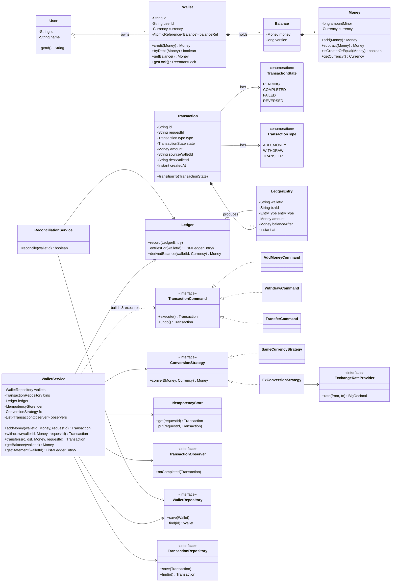

# LLD Design Document — Digital Wallet

> A staff-level low-level-design walkthrough and last-minute revision artifact.
> Target reader: a senior Java engineer in an LLD / machine-coding round who already knows OOP and the GoF patterns and wants to see the *right* patterns *applied with justification*.

---

## PART A — Design Document

### 1. Problem statement

Design the core of a **Digital Wallet** system (think the wallet inside a payments app such as Paytm, PhonePe, Google Pay, Amazon Pay, or the stored-value balance inside Uber/Swiggy).

A user owns one or more **wallets** (typically one per currency). A wallet holds a **balance** and supports these operations:

- **Add money / top-up** (credit from an external funding source such as a bank/card).
- **Withdraw money** (debit to an external sink such as a bank account).
- **Transfer money** to another user's wallet (an **atomic** debit-from-source + credit-to-destination).
- **View balance** and **transaction history** (a statement / ledger).

The hard parts — the things that separate a junior answer from a senior one — are:

- **Atomicity:** a transfer must either fully happen (debit *and* credit) or not at all. No money is ever created or destroyed.
- **No double-spend under concurrency:** two simultaneous debits on the same wallet must never push the balance negative or both succeed off a stale balance.
- **Idempotency:** a retried request (network timeout, client retry) must not be applied twice.
- **Auditability / reconciliation:** every balance change is explained by an immutable ledger; balance can always be re-derived from the ledger (double-entry bookkeeping).
- **Multi-currency:** wallets in different currencies, with FX on cross-currency transfers.

> **Adjacent term — "double-entry bookkeeping":** an accounting discipline where every financial event is recorded as at least two equal-and-opposite ledger postings (one debit, one credit) so that the sum of all postings is always zero. It is the canonical way to guarantee money is conserved and the books always balance.

### 2. Clarifying / requirements questions to ask first

Lead the round by *interviewing the interviewer*. Group the questions so it reads like a real scoping conversation.

**A. Functional scope**
1. Which operations are in scope: add money, withdraw, transfer wallet-to-wallet, balance enquiry, transaction history? Anything else (refunds, holds/authorizations, scheduled/recurring transfers, splitting bills)?
2. Is a transfer always wallet→wallet inside our system, or can it go to an external bank/card? (Determines whether we model external accounts.)
3. Is there one wallet per user or one wallet per (user, currency)? Can a user have multiple wallets?
4. Do we need transaction history / statements? Filterable by date, type, status?
5. Do we need to support **reversals / refunds** of a completed transaction?

**B. Money & correctness semantics**
6. Can a balance go negative (overdraft / credit line) or is it strictly non-negative?
7. What's the smallest unit — do we store money as integer minor units (paise/cents) to avoid floating-point error? (Strongly recommend yes.)
8. Are transfers **idempotent** — will clients send a client-supplied idempotency/request key so retries are safe?
9. Do we need **multi-currency** and **FX conversion** on cross-currency transfers? Who supplies the exchange rate, and is the rate locked at quote time?
10. Are there **limits** (per-transaction, daily, monthly caps; KYC tiers)?

**C. Non-functional**
11. Single-process in-memory (machine-coding scope) or distributed/multi-node? This decides whether we use in-JVM locking/CAS or a database with row locks / a distributed lock.
12. Expected concurrency: how many simultaneous operations on the *same* wallet? (Hot-wallet contention shapes the locking strategy.)
13. Consistency vs. availability: must balance be **strongly consistent** (read-your-writes, never oversell)? (Almost always yes for money.)
14. Latency / throughput targets? Durability — is an in-memory store acceptable for this exercise, or must it persist?
15. Audit/compliance: do we need an immutable, append-only ledger for reconciliation?

**D. Scope-narrowing (what I'll assume unless told otherwise)**
16. "I'll build an **in-process, thread-safe** wallet core with an in-memory store, money as integer minor units, a strictly non-negative balance, idempotent operations via a request key, an append-only double-entry ledger, and a pluggable multi-currency FX strategy. External bank/card rails are modeled behind an interface but stubbed. Distributed deployment and persistence are out of scope but I'll note the seams. Sound right?"

### 3. Finalized requirements & assumptions

**Functional**
- Create users and wallets; one wallet per **(user, currency)**.
- **Add money** (credit), **Withdraw** (debit), **Transfer** (atomic debit+credit), **Get balance**, **Get statement** (transaction history).
- Transfers may be **same-currency** or **cross-currency** (FX applied via a strategy).
- Every operation produces a **Transaction** with a lifecycle (`PENDING → COMPLETED | FAILED`, plus `REVERSED`).
- Each balance change is recorded as immutable **ledger entries** (double-entry: every transaction's postings net to zero).
- Operations are **idempotent** by client-supplied request key.

**Non-functional**
- **Strong consistency** for balances; **no double-spend**, **no overdraft** (balance ≥ 0).
- **Thread-safe** in a single JVM under concurrent access to the same wallet.
- **Atomicity** of multi-leg operations (transfer) without partial application.
- Money stored as **`long` minor units** + a `Currency` (never `double`/`float`).
- In-memory stores behind repository interfaces (swap for a DB later).

**Assumptions**
- Single process. Concurrency control = **optimistic CAS on a versioned balance** with a small retry loop (primary), with the option of pessimistic ordered locking for transfers. (Justified in §6 and §9.)
- FX rates come from a `ExchangeRateProvider`; rate is locked at quote/execution time.
- No partial transfers; a transfer is all-or-nothing.
- Limits/KYC modeled as a pluggable validation step but only lightly implemented.

### 4. Problem extensions / follow-up variations

These are the follow-ups interviewers pile on. For each: the ask, and the **design impact**.

| # | Extension | Design impact |
|---|-----------|---------------|
| 1 | **Atomic transfer (debit + credit)** | Wrap both legs in a `TransferService` that, under ordered locking *or* a two-phase CAS, applies both postings or neither. The **Command** pattern lets us encapsulate "transfer" as an executable+reversible unit. |
| 2 | **No double-spend under concurrency** | Versioned balance + **compare-and-set** (optimistic) retry loop, or per-wallet locks acquired in a **global deterministic order** (by wallet id) to avoid deadlock. Balance check and debit are one atomic step. |
| 3 | **Transaction history / statement** | Append-only `Ledger` keyed by wallet; `getStatement(walletId, filter)` reads immutable entries. No schema change to core balance logic. |
| 4 | **Add / withdraw money** | Model external funding/sink as a `FundingSource` behind an interface; add/withdraw become single-leg transactions whose counter-posting hits a system "external" account so double-entry still balances. |
| 5 | **Idempotent transactions** | A client `requestId` → result cache (`IdempotencyStore`). On replay, return the *original* result; never re-execute. Implemented as a guard in the service layer. |
| 6 | **Multi-currency + FX** | `Money(amount, currency)`; cross-currency transfer uses an `ExchangeRateProvider` + `ConversionStrategy` (**Strategy** pattern). Each wallet is single-currency; conversion happens between the two legs. |
| 7 | **Reconciliation** | Because the ledger is double-entry and append-only, `sum(credits) - sum(debits)` per wallet must equal the stored balance. A `ReconciliationService` recomputes balances from the ledger and flags drift. |
| 8 | **Reversals / refunds** | Each `Command` is **reversible**: store the inverse command; a refund posts compensating entries (it does *not* delete history). |
| 9 | **Holds / authorizations** (auth + capture) | Add an `availableBalance` vs. `ledgerBalance` split; a hold reserves funds (state on the transaction). Introduces more wallet states. |
| 10 | **Limits / KYC tiers** | A **Chain of Responsibility** of validators (per-txn cap, daily cap, KYC tier) runs before execution. |
| 11 | **Distributed / multi-node** | Replace in-JVM CAS with DB optimistic locking (a `version` column + `UPDATE ... WHERE version=?`) or a distributed lock (Redis/ZooKeeper). The **repository + service seams stay identical** — that's the payoff of the layering. |
| 12 | **Notifications / async side-effects** | **Observer** pattern: on transaction completion, notify subscribers (email/SMS/analytics) without coupling the core. |

### 5. Core entities, responsibilities & relationships

| Entity | Responsibility |
|--------|----------------|
| **`Money`** | Value object: `(long amountMinor, Currency)`. Immutable; arithmetic with same-currency guard. |
| **`User`** | Identity; owns wallets. |
| **`Wallet`** | Holds balance for one (user, currency). Exposes **atomic** `tryDebit` / `credit` guarded by a `version` (CAS) or lock. The *only* place balance mutates. |
| **`Transaction`** | Record of a money movement: id, type, status, amount(s), source/destination, timestamps, requestId. Has a **State** (`PENDING/COMPLETED/FAILED/REVERSED`). |
| **`LedgerEntry`** | Immutable single posting: (walletId, txnId, DEBIT/CREDIT, Money, balanceAfter, timestamp). |
| **`Ledger`** | Append-only store of `LedgerEntry`; source of truth for reconciliation & history. |
| **`WalletRepository` / `TransactionRepository`** | Persistence seams (in-memory impls). |
| **`IdempotencyStore`** | requestId → prior result; makes operations replay-safe. |
| **`ExchangeRateProvider` + `ConversionStrategy`** | FX rate lookup and conversion math (Strategy). |
| **`TransactionCommand`** (AddMoney/Withdraw/Transfer) | Encapsulates an operation as an executable + reversible unit (Command). |
| **`WalletService`** | Facade/orchestrator: validates, ensures idempotency, builds & executes commands, writes ledger, notifies observers. |
| **`ReconciliationService`** | Recomputes balances from the ledger; detects drift. |
| **`TransactionObserver`** | Side-effect hooks on completion (Observer). |

**Relationships (prose):**
- `User` **1..\*** `Wallet` (aggregation).
- `Wallet` **1** holds **1** `Money` balance (composition of value object).
- `WalletService` **uses** `WalletRepository`, `Ledger`, `IdempotencyStore`, `ConversionStrategy`, and a list of `TransactionObserver` (association/dependency).
- `Transaction` **has-a** `TransactionState` (State pattern); produces **2..\*** `LedgerEntry` (composition).
- `TransferCommand` **is-a** `TransactionCommand` (inheritance/realization).

### 6. Design patterns applied (which / where / why / rejected / when-not) + SOLID

> Principle: **don't pattern-stuff.** Each pattern below earns its place by solving a concrete problem; rejected alternatives are stated.

**1. Strategy — transaction-type behavior & FX conversion.**
- **Where:** `ConversionStrategy` (no-op for same currency, FX for cross-currency); optionally per-`TransactionType` fee/validation policies.
- **Why:** conversion/fee rules vary independently of the orchestration; new currencies/fee schemes plug in without touching `WalletService`. (Open/Closed.)
- **Rejected alternative:** `if (type == TRANSFER) ... else if ...` branching inside the service — violates OCP, grows unboundedly, hard to test in isolation.
- **When *not* to use:** if there were exactly one fixed conversion rule forever, a plain method is simpler — Strategy would be ceremony.

**2. Command — transactions as objects (`AddMoney`, `Withdraw`, `Transfer`).**
- **Where:** `TransactionCommand` with `execute()` and `undo()`.
- **Why:** uniform handling, easy to queue/log/retry, and **reversibility** falls out naturally (refunds = run the inverse). Decouples "what to do" from "who runs it." Enables a future transaction log / WAL.
- **Rejected alternative:** fat service methods (`transfer(...)`, `addMoney(...)`) with reversal logic copy-pasted — duplicates the inverse logic and couples orchestration to each operation.
- **When *not* to use:** if operations never need to be reified, queued, logged, or undone, direct methods are fine.

**3. State — transaction lifecycle.**
- **Where:** `TransactionState` (`PENDING`, `COMPLETED`, `FAILED`, `REVERSED`) governing legal transitions.
- **Why:** centralizes the legal-transition table; prevents illegal moves (e.g., `COMPLETED → PENDING`) and removes scattered status `if`s.
- **Rejected alternative:** an `enum status` field with ad-hoc checks — transition rules leak everywhere and drift.
- **When *not* to use:** a 2-state flag with trivial transitions doesn't justify a state machine.

**4. Optimistic concurrency (CAS) on a versioned balance — the core thread-safety mechanism.**
- **Where:** `Wallet` holds an `AtomicReference<Balance>` where `Balance = (Money, version)`; `tryDebit/credit` do a read-compute-`compareAndSet` retry loop.
- **Why:** wallets are usually *low-contention*; CAS avoids lock overhead and gives non-blocking progress. Maps 1:1 to DB optimistic locking later (`WHERE version = ?`).
- **Rejected alternative:** a coarse global lock (kills throughput) or per-wallet `synchronized` (fine, and we *do* use ordered locks for transfers — see below — but pure pessimistic locking blocks under contention and risks deadlock on multi-wallet ops).
- **When *not* to use:** extremely hot single wallets with constant contention — CAS retries thrash; a queue/actor per wallet (serialize) or pessimistic lock wins there.

**5. Ordered locking (deadlock avoidance) for the two-leg transfer.**
- **Where:** `TransferCommand` acquires both wallets' locks **in a deterministic global order** (by wallet id) so two opposing transfers (A→B and B→A) can't deadlock.
- **Why:** a transfer mutates two wallets; we need both changes atomic relative to other operations. Lock-ordering is the standard deadlock-avoidance technique.
- **Rejected alternative:** acquiring locks in arrival order (classic deadlock); or a single global lock (serializes *all* transfers).

**6. Repository — persistence abstraction.**
- **Where:** `WalletRepository`, `TransactionRepository`, in-memory now.
- **Why:** swap to a real DB without touching service logic (Dependency Inversion).
- **Rejected alternative:** services touching `HashMap`s directly — couples business logic to storage.

**7. Facade — `WalletService`.**
- **Where:** the single entry point clients call.
- **Why:** hides command construction, idempotency, ledger writes, locking, and notification behind a clean API.

**8. Observer — post-commit side effects.**
- **Where:** `TransactionObserver` notified on completion (notifications, analytics).
- **Why:** add side-effects without modifying the core (OCP); decouples policy from mechanism.
- **When *not* to use:** if there are no side effects, skip it.

**9. (Mentioned, not over-built) Chain of Responsibility — validation/limits.**
- **Where:** an ordered chain of `TransactionValidator` (amount > 0, sufficient funds pre-check, per-txn/daily limits, KYC).
- **Why:** each rule is independent and composable; easy to add/reorder.

**SOLID in play**
- **S**RP: `Wallet` only owns balance mutation; `Ledger` only records; `WalletService` only orchestrates; `Transaction` only models lifecycle.
- **O**CP: new transaction types (Command), currencies (Strategy), side-effects (Observer), validators (Chain) plug in without editing existing classes.
- **L**SP: every `TransactionCommand` honors `execute/undo`; every `ConversionStrategy` honors `convert` — substitutable.
- **I**SP: small focused interfaces (`ConversionStrategy`, `TransactionObserver`, repositories) rather than one god-interface.
- **D**IP: `WalletService` depends on abstractions (repos, strategy, observers), not concretions.

### 7. Class diagram



**Brief text UML**

```
WalletService (Facade/Orchestrator)
 ├─ uses WalletRepository, TransactionRepository, Ledger, IdempotencyStore
 ├─ uses ConversionStrategy (Strategy)  ── FxConversionStrategy → ExchangeRateProvider
 ├─ notifies TransactionObserver* (Observer)
 └─ builds & runs TransactionCommand* (Command)
        ├─ AddMoneyCommand  (1 leg: external → wallet)
        ├─ WithdrawCommand  (1 leg: wallet → external)
        └─ TransferCommand  (2 legs: src wallet → dst wallet, ordered locking)

Wallet  : balance mutation only; AtomicReference<Balance(Money,version)>; CAS debit/credit
Transaction : id, requestId, type, State (PENDING→COMPLETED|FAILED|REVERSED), amount
Ledger  : append-only LedgerEntry list; derivedBalance() powers ReconciliationService
Money   : immutable (long minor units + Currency)
```

**Key public APIs / signatures**

```java
Transaction addMoney(String walletId, Money amount, String requestId);
Transaction withdraw(String walletId, Money amount, String requestId);
Transaction transfer(String srcWalletId, String dstWalletId, Money amount, String requestId);
Money       getBalance(String walletId);
List<LedgerEntry> getStatement(String walletId);

// Wallet (the only mutator of balance)
boolean tryDebit(Money amount);   // CAS loop; false if insufficient funds
void    credit(Money amount);     // CAS loop; always succeeds

// Command
interface TransactionCommand { Transaction execute(); Transaction undo(); }

// Strategy
interface ConversionStrategy { Money convert(Money src, Currency target); }
```

### 8. Key flows

**8.1 Transfer (atomic, idempotent, possibly cross-currency)**

```mermaid
sequenceDiagram
    participant C as Client
    participant S as WalletService
    participant I as IdempotencyStore
    participant Cmd as TransferCommand
    participant Ws as Source Wallet
    participant Wd as Dest Wallet
    participant L as Ledger
    participant O as Observers

    C->>S: transfer(src, dst, amount, requestId)
    S->>I: get(requestId)
    alt replay
        I-->>S: prior Transaction
        S-->>C: return prior result (no re-execute)
    else first time
        S->>S: validate (amount>0, currencies, limits)
        S->>Cmd: build & execute()
        Cmd->>Cmd: lock(src, dst) in id order
        Cmd->>Ws: tryDebit(amount)  (CAS loop)
        alt insufficient funds
            Cmd-->>S: FAILED
            S->>I: put(requestId, FAILED txn)
            S-->>C: FAILED
        else debited
            Cmd->>Cmd: convertedAmt = fx.convert(amount, dst.currency)
            Cmd->>Wd: credit(convertedAmt) (CAS loop)
            Cmd->>L: record DEBIT(src) + CREDIT(dst)  // nets to zero
            Cmd->>Cmd: txn.transitionTo(COMPLETED); unlock
            S->>I: put(requestId, COMPLETED txn)
            S->>O: onCompleted(txn)
            S-->>C: COMPLETED
        end
    end
```

**8.2 Debit under concurrency (CAS, no double-spend)** — `Wallet.tryDebit`:
1. `cur = balanceRef.get()` (snapshot of `Money + version`).
2. If `cur.money < amount` → return `false` (insufficient).
3. `next = Balance(cur.money - amount, cur.version + 1)`.
4. `if balanceRef.compareAndSet(cur, next)` → success; else **another thread won** → loop to step 1.
   This makes the read-check-write a single atomic step, so two concurrent debits can never both succeed off the same stale balance.

**8.3 Add money / withdraw (single leg, double-entry preserved)**
- Add: `credit(wallet)` + ledger `CREDIT(wallet)` with the equal-and-opposite `DEBIT(SYSTEM_EXTERNAL)` posting → books balance.
- Withdraw: `tryDebit(wallet)` + ledger `DEBIT(wallet)` and `CREDIT(SYSTEM_EXTERNAL)`.

**8.4 Reconciliation**
- For each wallet: `derived = Σ credits − Σ debits` from the ledger. Assert `derived == wallet.getBalance()`; flag drift.

### 9. Concurrency, edge cases & extensibility

**Concurrency / thread-safety**
- **Single-wallet correctness:** `Wallet` mutates only via CAS on `AtomicReference<Balance>`; the balance check and decrement are one atomic step → **no double-spend, no negative balance** even under N concurrent debits.
- **Two-wallet (transfer) atomicity:** acquire per-wallet `ReentrantLock`s in **global id order** before the two legs, guaranteeing no lock-ordering deadlock (A→B vs B→A). Within the critical section the legs use the same CAS methods, so the design composes.
- **Idempotency under concurrent retries:** the `IdempotencyStore` uses `putIfAbsent`-style reservation; two concurrent calls with the same `requestId` resolve to a single executed transaction.
- **DB mapping:** in-JVM CAS ↔ optimistic locking (`UPDATE wallet SET balance=?, version=version+1 WHERE id=? AND version=?`); ordered in-JVM locks ↔ DB row locks acquired in deterministic order, all inside one DB transaction for true ACID.

**Edge cases**
- Amount ≤ 0 → reject. Currency mismatch on same-currency op → reject. Insufficient funds → `FAILED` (not exception-as-control-flow at the API boundary; we still return a `FAILED` transaction).
- Self-transfer (src == dst) → reject (or no-op).
- Unknown wallet/user → reject.
- FX rounding: round **once**, deterministically (banker's or half-up consistently), record both gross and converted amounts in the ledger.
- Partial failure of a transfer leg: because both legs are under the lock + the debit is checked first, we never credit then fail to debit; if the credit somehow can't proceed we **undo** the debit (Command.undo) before releasing locks.
- Reversal: never mutate or delete prior entries — post **compensating** entries and move the txn to `REVERSED`.

**Extensibility (how the design absorbs §4)**
- New txn type → new `TransactionCommand` (no service edits).
- New currency / FX source → new `ConversionStrategy` / `ExchangeRateProvider`.
- Limits/KYC → add validators to the chain.
- Notifications/analytics → add `TransactionObserver`s.
- Distributed → swap repository impls + locking strategy; **service/command/state code is untouched** — the whole point of the layering and DIP.

### 10. Likely interview questions (with model answers)

**Q1. How do you guarantee no double-spend under concurrency?**
Balance lives in an `AtomicReference<Balance>` where `Balance` carries a `version`. `tryDebit` reads a snapshot, checks sufficiency, computes the next balance, and `compareAndSet`s it; if another thread changed the balance in between, the CAS fails and we retry. The check-and-decrement is therefore a single atomic step — two concurrent debits can't both succeed off a stale balance, and the balance never goes negative. *Follow-up: what about a hot wallet where CAS thrashes?* Switch that wallet to a serialized executor (actor/queue) or a pessimistic lock; the `Wallet` API stays the same.

**Q2. How is a transfer made atomic across two wallets?**
`TransferCommand` locks both wallets in a deterministic global order (by id), debits the source (CAS), credits the destination (CAS), and writes both ledger postings, then commits the transaction state — all inside the critical section. If the debit fails (insufficient funds) nothing is credited; if a later step fails we `undo()` the debit before releasing locks. Ordered locking prevents the A→B / B→A deadlock. *Follow-up: in a DB?* Same logic inside one ACID transaction with row locks acquired in id order, or optimistic locking with retry.

**Q3. Why integer minor units instead of `double` or `BigDecimal` balances?**
`double` has binary floating-point rounding error — fatal for money. Storing `long` minor units (paise/cents) makes addition/subtraction exact and cheap. `BigDecimal` is used only transiently for FX multiplication, then rounded back to minor units deterministically. *Senior signal:* this is a value-object (`Money`) immutability + correctness decision, not a micro-optimization.

**Q4. How do you make operations idempotent?**
Clients pass a `requestId`. Before executing, the service consults an `IdempotencyStore`; if the id is present, it returns the original transaction without re-executing. The store reservation is concurrency-safe (`putIfAbsent`), so duplicate concurrent retries collapse to one execution. This is what makes client retries (after a timeout) safe. *Follow-up: TTL/eviction?* Keep keys for a bounded window matching the client retry policy; persist in the same store as transactions in a real system.

**Q5. Why double-entry ledger? Isn't a balance field enough?**
A balance field alone is unauditable and undebuggable. Double-entry records every movement as equal-and-opposite postings that net to zero, so money is provably conserved and the balance can be **re-derived** from the ledger at any time (reconciliation). It also gives a natural transaction history and makes reversals additive (compensating entries) rather than destructive.

**Q6. Walk me through your pattern choices and one you rejected.** *(senior signal)*
Command for transactions (uniform execute/undo → reversibility and a future WAL), Strategy for FX/fees (OCP across currencies), State for the transaction lifecycle (legal transitions in one place), Observer for side-effects, Repository for storage seams, Facade for the service API. **Rejected:** a Singleton "WalletManager" holding global maps and `if/else` per operation type — it violates SRP/OCP, is untestable, and concentrates contention. I also deliberately *didn't* use a heavyweight saga/orchestration framework — in a single process ordered locks + CAS are sufficient.

**Q7. How does cross-currency transfer work and where does rounding happen?** *(senior signal)*
Each wallet is single-currency. On transfer, the source is debited in its currency; the `FxConversionStrategy` converts the amount to the destination currency using a rate locked at execution time; the destination is credited the converted amount. Rounding happens exactly once, deterministically, when converting `BigDecimal` back to `long` minor units, and both gross and converted amounts are recorded in the ledger for audit. The rate source is behind `ExchangeRateProvider` so it's swappable/mreplayable.

**Q8. How would you scale this to multiple nodes?** *(senior signal)*
Move state to a DB; replace in-JVM CAS with optimistic locking (`version` column) or pessimistic row locks acquired in deterministic order inside one ACID transaction. Idempotency store and ledger become persistent tables. Hot wallets can be sharded by wallet id or serialized via a per-wallet partition (Kafka key / actor). The service/command/state layers are unchanged — only the repository and locking implementations swap, which is exactly why I put repositories behind interfaces.

**Q9. What happens on a partial failure mid-transfer?**
The debit is attempted first and checked; the credit only runs if the debit succeeded. If anything after the debit fails, `TransferCommand.undo()` re-credits the source before releasing the locks, and the transaction is marked `FAILED`. No partial state is observable because it all happens within the lock and the ledger postings are written together. In a DB it's one transaction that either commits both postings or rolls back.

**Q10. How do you support reversals/refunds without corrupting history?**
The ledger is append-only. A reversal posts **compensating** entries (mirror debit/credit) and transitions the original transaction to `REVERSED`, linking the reversal to it. Original entries are never edited or deleted, preserving the audit trail and keeping reconciliation valid.

**Deep-probe follow-ups**
- *"Your CAS retry loop — is it lock-free or wait-free, and can it livelock?"* Lock-free (system-wide progress), not wait-free (an individual thread can retry); under pathological contention it can spin, hence the hot-wallet fallback to serialization.
- *"Where exactly does the double-entry invariant get enforced in code?"* In the command: every command writes balanced postings, and `ReconciliationService.reconcile` is the runtime assertion.
- *"Why per-wallet locks *and* CAS — isn't that redundant?"* CAS handles single-wallet atomicity cheaply; the lock is only to make the *pair* of legs in a transfer atomic relative to each other and to ordering. Single-leg ops (add/withdraw) use CAS alone.

---

## PART C — Cheat-sheet & self-test

**Patterns used (recap)**
- **Command** — `TransactionCommand` (AddMoney/Withdraw/Transfer): reify operations; `execute`/`undo` → reversibility, logging, retry.
- **Strategy** — `ConversionStrategy` (same-currency vs FX): pluggable currency/fee logic (OCP).
- **State** — `TransactionState`: legal lifecycle transitions in one place.
- **Observer** — `TransactionObserver`: decoupled post-commit side-effects.
- **Repository** — storage seams (`WalletRepository`, `TransactionRepository`) for DIP and easy DB swap.
- **Facade** — `WalletService`: single clean entry point.
- **(Noted)** Chain of Responsibility — validators/limits.

**Key design decisions (recap)**
- Money = **`long` minor units + Currency**, immutable `Money` value object; never `double`.
- **Optimistic CAS** on a versioned `Balance` for single-wallet atomicity (no double-spend, no overdraft); **ordered per-wallet locks** for atomic two-leg transfers (deadlock-free).
- **Idempotency** via client `requestId` + `IdempotencyStore`.
- **Append-only double-entry ledger** is the source of truth; balance is re-derivable → reconciliation; reversals are compensating entries.
- All storage and policy behind **interfaces** so the same core runs single-process today and distributed later.

**5 self-test questions (no answers)**
1. Reimplement `tryDebit` from memory and explain why the check and decrement must be a single CAS — what breaks if you read the balance, then separately compareAndSet only the amount?
2. Two transfers, A→B and B→A, fire simultaneously. Show precisely how ordered locking by wallet id prevents deadlock, and what would happen without it.
3. A client retries a transfer after a timeout but the first attempt actually succeeded. Trace the path through `IdempotencyStore` and prove the money moves exactly once.
4. Add a **daily spend limit** per user. Which pattern do you extend, where does the check go, and what must stay unchanged in `WalletService`?
5. You must go multi-node. List every class you'd change and every class you'd keep, and state the new concurrency mechanism for single-wallet atomicity and for transfer atomicity.
