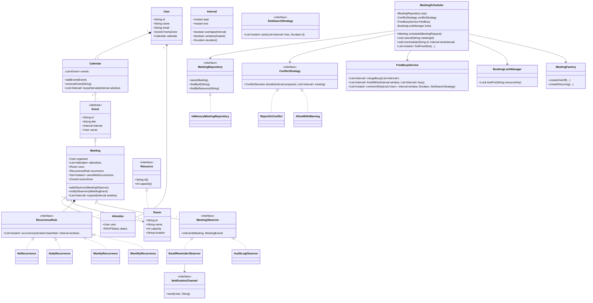
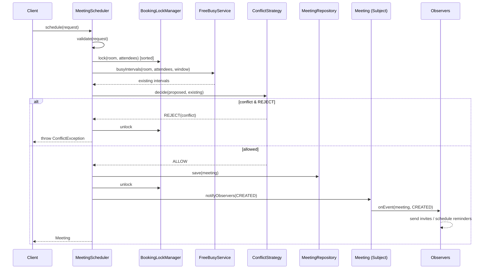

# LLD — Meeting Scheduler / Calendar

> A complete object-oriented design document **plus** a companion single-file Java review artifact (`Solution.java`).
> Reader profile: senior Java engineer revising for an LLD / machine-coding round. The emphasis is on *applying* the right patterns with justification, clean SOLID design, and production-quality code you can recall under pressure.

---

# PART A — Design Document

## 1. Problem statement

Design the core domain of a **meeting scheduler / calendar** system (think the booking engine behind Google Calendar / Outlook Calendar, or the "schedule a meeting" feature in a corporate suite).

The system must let users:

- Own a **calendar** of events.
- **Schedule meetings** with a set of attendees and (optionally) a physical **room**, over a time **interval**.
- **Detect conflicts** — an attendee or a room cannot be double-booked.
- **Find common free slots** across several attendees (the "find a time" feature).
- Support **recurring meetings** (daily / weekly / etc.) via a recurrence rule.
- Handle **time zones** so participants in different regions see correct local times.
- Send **reminders / invitations / notifications** (accept / decline / reschedule).
- Be **thread-safe** for concurrent booking (two organizers must not both grab the last meeting room for an overlapping slot).

We are designing the **low-level, in-memory domain model and service layer** — not the REST API, DB schema, or UI. Persistence and transport are abstracted behind repository/notifier interfaces.

> **Adjacent term — "LLD" (low-level design):** the class-level design of a single service or component: entities, their responsibilities, relationships, and the public methods/contracts between them. Contrasts with HLD (high-level design), which is about services, data stores, queues, and scaling.

---

## 2. Clarifying / requirements questions to ask first

A real round starts here. I would ask the interviewer, grouped by category. (I list the *questions*; the answers I assume are in §3.)

### Functional scope
1. Are we designing the **booking/domain engine** (in-memory) or the full distributed system with DB + API? Where do we draw the box?
2. What entities are in scope: just `Meeting`, or also `Room`, `Resource` (projector, car), `Group/Team`?
3. Do we need to **find common free slots** across attendees, or only detect conflicts on an explicitly chosen slot?
4. Must we support **recurring meetings**? Which recurrence types — daily, weekly, monthly, custom (RFC 5545 / iCal RRULE), or a simple subset?
5. For recurring series, must we support **exceptions** (cancel/modify a single occurrence) and an **end condition** (count / until-date / forever)?
6. Do attendees **RSVP** (accept / decline / tentative), and does an organizer see responses?
7. Reminders/notifications: just an interface to fire events, or do we implement delivery channels (email/push/SMS)?
8. Is **room booking** a hard constraint (room can hold only one meeting per slot) and does a room have a **capacity** we must validate against attendee count?
9. Can a meeting be **edited/rescheduled/cancelled**, and what happens to attendees/room on cancel?

### Non-functional / constraints
10. **Concurrency:** can multiple organizers book simultaneously? Single process or distributed? (Drives in-process locks vs. distributed lock / optimistic DB version.)
11. **Scale:** how many users / meetings / rooms? Does free-slot search need to be sub-linear (interval tree) or is a linear scan fine for the interview?
12. **Time zones & DST:** do participants span zones? Do we store UTC and render local? How do we treat recurring meetings across a DST boundary?
13. Conflict policy: **hard-block** on conflict, or **allow with warning** (overlapping personal events are sometimes OK but a room double-book never is)?
14. Consistency: is "no double booking" a strict invariant, or eventually-consistent with later reconciliation?

### Scope-narrowing / out-of-scope confirmation
15. Out of scope (confirm): auth, persistence layer details, network/serialization, billing, full iCal import/export, working-hours / holiday calendars, fairness/priority preemption. Agree?
16. Granularity of time — arbitrary `Instant`s, or quantized to 15/30-min slots?

---

## 3. Finalized requirements & assumptions

**In scope (functional):**

- `User` owns a `Calendar` of `Event`s. A `Meeting` is an `Event` with attendees and an optional `Room`.
- Schedule a meeting over a half-open interval **[start, end)** with N attendees and optional room.
- **Conflict detection** for any attendee and the room: reject if it overlaps an existing busy interval (hard-block for rooms and accepted attendees).
- **Find common free slots**: given a set of users, a search window, a duration, and an optional required room, return candidate start times.
- **Recurring meetings** via a `RecurrenceRule` (Strategy): `NONE`, `DAILY`, `WEEKLY`, `MONTHLY`, with an end condition (count or until). Per-occurrence cancellation supported (exception dates).
- **RSVP**: attendees `ACCEPT` / `DECLINE` / `TENTATIVE`; only accepted/needs-action attendees count as "busy".
- **Notifications** (Observer): invite sent, RSVP changed, meeting rescheduled/cancelled, reminder due — pushed to pluggable channels.
- **Time zones**: all instants stored in **UTC** (`java.time.Instant`); each user has a home `ZoneId` for rendering; recurrence is expanded in the organizer's zone so "9am every day" stays 9am local across DST.

**In scope (non-functional):**

- **Thread-safe** booking within a single JVM. Strict invariant: a room is never double-booked over overlapping intervals.
- Correct-by-inspection clean code; linear scan acceptable but the design leaves room for an interval-tree free/busy index.

**Out of scope (assumed):** real persistence/DB, networking/REST, auth, billing, full RFC-5545 RRULE, holidays/working-hours, priority preemption, calendar sharing/ACLs beyond owner. We expose interfaces (`MeetingRepository`, `NotificationChannel`) so these are pluggable.

**Key assumptions:**

- Intervals are **half-open `[start, end)`** so back-to-back meetings (9–10, 10–11) do **not** conflict. Overlap iff `a.start < b.end && b.start < a.end`.
- Time is `Instant` (UTC); display uses `ZonedDateTime`.
- Single-process, in-memory store; concurrency handled with per-resource locking.

---

## 4. Problem extensions / follow-up variations

These are the common follow-ups; senior candidates pre-empt them. Each notes the **design impact** — and the design in §6 is shaped so each is a small, localized change.

| # | Extension | Design impact |
|---|-----------|---------------|
| 1 | **Find common free slots** across attendees | A `FreeBusyService` merges each user's busy intervals, computes the complement within the window, intersects across users, filters by duration. Pluggable `SlotSearchStrategy` (earliest-fit vs. all-slots vs. business-hours-only). |
| 2 | **Recurring meetings** | `RecurrenceRule` Strategy expands a series into occurrences lazily within a window. New rule = new Strategy class; no change to scheduler. Exceptions held as a set of cancelled occurrence-starts on the series. |
| 3 | **Room capacity / multiple resources** | `Room implements Resource` with `capacity`; generalize to `Resource` (projector, car). Scheduler validates `attendees.size() <= room.capacity`. Booking any `Resource` reuses the same conflict/lock path. |
| 4 | **Time zones & DST** | Store UTC; expand recurrence in organizer `ZoneId` so wall-clock time is preserved across DST. Render per-viewer zone. No change to conflict math (always UTC `Instant`s). |
| 5 | **Reminders / notifications** | Observer: `Meeting` (subject) notifies `MeetingObserver`s on lifecycle events; a `ReminderObserver`/scheduler fires "T-15min" events. Channels (email/push) are `NotificationChannel` Strategy implementations. |
| 6 | **Concurrency on room booking** | Per-room lock (or striped locks) around the check-then-book critical section; or optimistic version + retry. Distributed → distributed lock / DB unique constraint on (room, slot). |
| 7 | **Conflict-resolution policy** | `ConflictStrategy` (Strategy): `REJECT`, `ALLOW_OVERLAP_WARN`, `SUGGEST_ALTERNATIVE`. Lets personal events overlap while rooms stay strict. |
| 8 | **Priority / preemption** | Add `priority` to meeting + a strategy that can bump lower-priority holds. Touches only the conflict strategy. |
| 9 | **Working hours / holidays** | A `CalendarConstraint` that marks non-bookable intervals as permanently busy; folds into free/busy as just more busy blocks. |
| 10 | **Waitlist / auto-rebook** | When a room frees up, an Observer notifies waitlisted requests (Observer + a queue). |

---

## 5. Core entities, responsibilities & relationships

| Entity | Responsibility |
|--------|----------------|
| `User` | Identity (id, name, email, home `ZoneId`); owns a `Calendar`. |
| `Calendar` | A user's collection of `Event`s; answers free/busy for a window. |
| `Event` (abstract) | Base: id, title, `Interval`, owner. |
| `Meeting` (extends `Event`) | Organizer, attendees (`Attendee` with RSVP), optional `Room`, optional `RecurrenceRule`, cancelled-occurrence set. Acts as **Subject** in Observer. |
| `Attendee` | (`User`, `RSVPStatus`) pair. |
| `Interval` | Immutable half-open `[start, end)` over `Instant`; `overlaps`, `contains`, `duration`. Value object. |
| `Room` / `Resource` | Bookable resource with id, name, capacity, location. |
| `RecurrenceRule` (interface) | **Strategy** — expand a base interval into occurrence start instants within a window. Impls: `NoRecurrence`, `DailyRecurrence`, `WeeklyRecurrence`, `MonthlyRecurrence`. |
| `ConflictStrategy` (interface) | **Strategy** — decide whether a proposed booking is allowed given existing busy intervals. Impls: `RejectOnConflict`, `AllowWithWarning`. |
| `SlotSearchStrategy` (interface) | **Strategy** — how to pick free slots (earliest-fit / all). |
| `MeetingObserver` (interface) | **Observer** — reacts to meeting lifecycle events. Impls: `EmailReminderObserver`, `AuditLogObserver`. |
| `NotificationChannel` (interface) | **Strategy/Bridge** — actual delivery (email, push, SMS, console). |
| `MeetingFactory` | **Factory** — builds `Meeting`s (one-off vs. recurring), wires defaults & observers. |
| `MeetingScheduler` (service) | Orchestrates: validates, runs conflict strategy under locks, books rooms atomically, persists, notifies. The **only** place that mutates booking state. |
| `FreeBusyService` | Computes merged busy intervals & free slots across users/rooms. |
| `BookingLockManager` | Striped per-resource locks for the check-then-act critical section. |
| `MeetingRepository` (interface) | Persistence abstraction; `InMemoryMeetingRepository` impl. |

**Relationships:**

- `User` *composes* `Calendar` (1—1, lifecycle-bound).
- `Calendar` *aggregates* `Event`s (1—*).
- `Meeting` *is-a* `Event` (inheritance); *aggregates* `Attendee`s; *references* a `Room` (association, 0..1); *has-a* `RecurrenceRule` (composition of a strategy).
- `Meeting` (Subject) *holds* `MeetingObserver`s (1—*, Observer).
- `MeetingScheduler` *uses* `ConflictStrategy`, `FreeBusyService`, `BookingLockManager`, `MeetingRepository`, `MeetingFactory` (dependency injection).

---

## 6. Design patterns applied

For each: **where**, **why**, **rejected alternative**, **when *not* to use**.

### 6.1 Strategy — `RecurrenceRule`, `ConflictStrategy`, `SlotSearchStrategy`, `NotificationChannel`
- **Where:** recurrence expansion, conflict policy, slot-search policy, delivery channel.
- **Why:** these are *interchangeable algorithms* that vary independently of the scheduler. New recurrence (e.g. "every weekday") or policy (`ALLOW_OVERLAP_WARN`) is a new class — **Open/Closed**. The scheduler depends on the abstraction, not concretes (**DIP**).
- **Rejected alternative:** `switch`/`enum` on a `RecurrenceType` inside the scheduler. Simpler for 2 cases, but every new type edits a giant method and risks regressions — violates OCP. Use the enum-switch only if the set is tiny, fixed, and trivial.
- **When *not*:** if there is genuinely one algorithm forever, an interface is ceremony.

### 6.2 Observer — `Meeting` (Subject) → `MeetingObserver`
- **Where:** meeting lifecycle (created, rescheduled, cancelled, RSVP changed, reminder due).
- **Why:** decouples *what happened* from *who reacts* (email, push, audit log, analytics). Adding a reaction never touches the scheduler — **OCP**, **SRP** (scheduler books; observers notify).
- **Rejected alternative:** scheduler calls `emailService.send(...)` directly. Tightly couples booking to notification, hard to test, can't add channels without editing core logic.
- **When *not*:** if there's exactly one synchronous side-effect that's part of the core transaction (then just call it).

### 6.3 Factory (Factory Method / simple factory) — `MeetingFactory`
- **Where:** constructing `Meeting`s (one-off vs. recurring), attaching default observers/recurrence.
- **Why:** centralizes non-trivial construction and keeps callers from juggling 6-arg constructors and wiring. **SRP** for object creation.
- **Rejected alternative:** Builder. For *very* many optional fields a Builder reads better; here the variation is mostly "kind of meeting", so a factory + a small builder for the recurring case is enough. (I include a fluent builder-ish factory.)
- **When *not*:** trivial objects — `new` is clearer than a factory.

### 6.4 Composite-ish value handling — `Interval` value object
- **Where:** all time math. Immutable, equals/hashCode by value.
- **Why:** pushes overlap/contains logic into one tested place; immutability makes it safe to share across threads (**thread-safe by design**).

### 6.5 Repository — `MeetingRepository`
- **Where:** persistence boundary.
- **Why:** swap in-memory ↔ DB without touching domain logic (**DIP**). Enables a DB unique-constraint strategy for distributed booking later.

### SOLID recap
- **S**RP: scheduler books; FreeBusyService computes; observers notify; repository stores.
- **O**CP: new recurrence/conflict/channel = new class.
- **L**SP: every `RecurrenceRule`/`ConflictStrategy` honors its contract; `Room` substitutes for `Resource`.
- **I**SP: small focused interfaces (`MeetingObserver`, `NotificationChannel`, `RecurrenceRule`) rather than one fat interface.
- **D**IP: scheduler depends on interfaces, injected via constructor.

> **Anti-pattern guard (don't pattern-stuff):** we deliberately did *not* add Visitor, Decorator, or a State machine for RSVP — a plain enum + guarded transitions is simpler and clearer for an interview.

---

## 7. Class diagram



### Brief text UML
```
User ──1:1 composition──> Calendar ──1:* aggregation──> Event
Event <|── Meeting  (inheritance)
Meeting ──*── Attendee ──> User
Meeting ──0..1──> Room (──|> Resource)
Meeting ──has-a──> RecurrenceRule {No|Daily|Weekly|Monthly}
Meeting (Subject) ──*──> MeetingObserver {EmailReminder, AuditLog} ──> NotificationChannel
MeetingScheduler ──uses──> {MeetingRepository, ConflictStrategy, FreeBusyService, BookingLockManager, MeetingFactory}
```

### Key public APIs
```java
Meeting schedule(MeetingRequest req);            // validates, conflict-checks under lock, books, notifies
void    cancel(String meetingId);
void    reschedule(String meetingId, Interval newInterval);
List<Instant> findFreeSlots(List<User> users, Interval window, Duration dur, Room roomOrNull);

boolean Interval.overlaps(Interval other);       // a.start < b.end && b.start < a.end
List<Instant> RecurrenceRule.occurrences(Instant baseStart, Interval window, ZoneId zone);
ConflictDecision ConflictStrategy.decide(Interval proposed, List<Interval> existing);
```

---

## 8. Key flows

### 8.1 Schedule a meeting (with room) — steps
1. Client builds a `MeetingRequest` (organizer, attendees, interval, optional room, optional recurrence).
2. `MeetingScheduler.schedule` validates input (start < end, capacity ≥ attendees, etc.).
3. Acquire locks for the **room** and (optionally) attendee calendars — sorted by key to avoid deadlock.
4. Gather existing busy intervals for the room and accepted attendees over the (expanded) occurrence set.
5. Run `ConflictStrategy.decide` for each occurrence. If `REJECT`, abort with the conflicting interval.
6. `MeetingFactory` builds the `Meeting`; attach observers; persist via `MeetingRepository`; add events to calendars and room.
7. Release locks. Notify observers `CREATED` → invites/reminders dispatched via channels.

### 8.2 Find common free slots — steps
1. For each user, collect busy intervals in the window (expanding recurring meetings).
2. Merge each user's intervals; take the union across all users (everyone-busy).
3. Compute the **complement** within the window = candidate free intervals.
4. If a room is required, intersect with the room's free intervals.
5. Apply `SlotSearchStrategy` to slice free intervals into start times of length `duration`.

### 8.3 Sequence diagram — schedule



---

## 9. Concurrency, edge cases & extensibility

### Concurrency / thread-safety
- **Critical section** is *check-then-book* — classic TOCTOU (time-of-check-to-time-of-use) race. Two organizers could both read "room free" then both book.
- **Solution:** `BookingLockManager` hands out a `ReentrantLock` per resource key (striped). We lock the **room** and the relevant calendars, **sorted by key** to prevent deadlock (consistent lock ordering), do check+book, then unlock.
- `Interval` is **immutable** → freely shared across threads.
- Calendar's event list is a `CopyOnWriteArrayList` (read-heavy busy queries) or guarded by its calendar lock.
- **Distributed variant:** replace in-JVM locks with a distributed lock (e.g., Redis/ZooKeeper) or push the invariant into the DB via a **unique constraint** on (room_id, time-bucket) + optimistic retry.

### Edge cases
- **Back-to-back** (10:00–11:00 then 11:00–12:00): half-open intervals → **not** a conflict.
- **Zero/negative duration**: rejected in validation.
- **Room capacity** < attendee count: rejected.
- **DST boundary**: "9am daily" expanded in organizer zone keeps wall-clock 9am even when UTC offset shifts; conflict math stays in UTC.
- **Recurring + single-occurrence cancel**: occurrence start added to `cancelledOccurrences`; expansion skips it.
- **Self-overlap when rescheduling**: when checking conflicts, exclude the meeting's own intervals.
- **Declined attendees**: not counted as busy; only `ACCEPTED`/`NEEDS_ACTION` count (configurable).
- **Empty free-slot result**: return empty list, not null.
- **Idempotent cancel**: cancelling an already-cancelled meeting is a no-op.

### Extensibility (maps to §4)
- New recurrence/conflict/slot policy/channel → new Strategy class, zero scheduler change.
- New side-effect (Slack notify, analytics) → new `MeetingObserver`.
- New bookable resource (projector, car) → implement `Resource`; same lock/conflict path.
- Swap storage → new `MeetingRepository`.

---

## 10. Likely interview questions

1. **Why half-open intervals?**
   So back-to-back meetings don't falsely conflict. Overlap iff `a.start < b.end && b.start < a.end`. It also makes complement/free-slot math clean and avoids off-by-one at boundaries.

2. **How do you find common free slots efficiently?**
   Merge each user's busy intervals (sort by start, coalesce), union across users, take the complement within the window, intersect with room availability, then slice by duration. Linear in #intervals after sort (O(n log n)). For scale, back it with an **interval tree** / segment index per resource for O(log n + k) queries.

3. **Why Strategy for recurrence/conflict and not an enum switch?**
   Each new recurrence or policy would edit one growing method (OCP violation, regression risk). Strategy makes each a self-contained, independently testable class the scheduler depends on via an interface (DIP). Enum-switch is fine only for a tiny fixed set.

4. **Where's the concurrency bug and how do you fix it?**
   The check-then-book TOCTOU race. Fix with a per-resource lock around the critical section, acquired in a consistent (sorted) order to avoid deadlock; or move the invariant to a DB unique constraint / distributed lock for multi-node.

5. **How do time zones and DST affect recurring meetings?**
   Store all instants in UTC for conflict math. Expand recurrence in the **organizer's `ZoneId`** so "9am daily" stays 9am local even when the UTC offset changes at a DST transition. Render each viewer's events in their own zone.

6. **Why Observer for notifications?**
   To decouple "what happened" (meeting created/cancelled) from "who reacts" (email, push, audit). Scheduler stays single-responsibility; new reactions are new observers (OCP). Direct calls would couple booking to delivery and hurt testability.

7. **How would you add room capacity and other resources?**
   Generalize `Room` to a `Resource` interface with `capacity()`. Scheduler validates `attendees ≤ capacity` and books any `Resource` through the same conflict/lock path. Projector/car/desk all reuse it (LSP).

8. **How do you handle editing one occurrence of a recurring series?**
   Keep a `cancelledOccurrences` set (exceptions) on the series; expansion skips those starts. To *modify* one occurrence, materialize it as a standalone meeting and add its start to the exception set (the "detached instance" pattern, like iCal `EXDATE`/override).

9. **What happens when you reschedule a meeting that has a room?**
   Re-run conflict detection for the new interval **excluding the meeting's own current intervals**, under the room lock; if clear, update and notify observers `RESCHEDULED`; attendees may be reset to `NEEDS_ACTION`.

10. **How would you make this distributed / multi-node?**
    Replace in-JVM locks with a distributed lock or rely on a DB unique constraint on (resource, slot) plus optimistic-locking retry; persist via the `MeetingRepository` impl; fire notifications through a queue for at-least-once delivery.

### Deep-probe follow-ups
- *"Show the exact overlap predicate and prove back-to-back is safe."* → `s1 < e2 && s2 < e1`; with half-open `[10,11)` and `[11,12)`, `11 < 12` true but `11 < 11` false → no overlap.
- *"Your lock manager could leak locks for transient keys — how do you bound memory?"* → striped fixed-size lock array (hash the key into N locks) instead of a per-key map, trading a little false contention for bounded memory.
- *"Free-slot search is O(n) per query — when do you switch to an interval tree, and what's the tradeoff?"* → switch when busy-set per resource is large or queries are hot; tree gives O(log n + k) queries but costs O(log n) inserts and more code/memory — premature for the interview scope.
- *"Senior signal: justify NOT using a State pattern for RSVP."* → only 4 states with trivial guarded transitions; a State class hierarchy adds files and indirection without taming real complexity. Use an enum + a guarded setter; revisit State only if transition logic grows side-effect-heavy.

---

# PART C — Cheat-sheet & self-test

**Patterns used:**
- **Strategy** — `RecurrenceRule` (recurrence), `ConflictStrategy` (booking policy), `SlotSearchStrategy` (free-slot picking), `NotificationChannel` (delivery). Interchangeable algorithms, OCP + DIP.
- **Observer** — `Meeting` is the Subject; `MeetingObserver`s (email reminder, audit) react to lifecycle events. Decouples booking from notification.
- **Factory** — `MeetingFactory` builds one-off vs. recurring meetings and wires defaults.
- **Repository** — `MeetingRepository` abstracts persistence.
- **Value object** — immutable `Interval` (thread-safe, single home for overlap math).

**Key design decisions:**
- Half-open `[start,end)` intervals; overlap iff `s1<e2 && s2<e1`.
- All instants in **UTC**; recurrence expanded in organizer's `ZoneId` for DST correctness.
- Thread-safety via **striped per-resource locks** in consistent (sorted) order around check-then-book.
- Scheduler is the single mutator; everything else is injected behind interfaces (DIP/SRP).
- Deliberately avoided State/Visitor/Decorator to prevent pattern-stuffing.

**Self-test (no answers):**
1. Write the overlap predicate and explain why merging busy intervals before complementing is necessary for correct free-slot search.
2. Two threads call `schedule` for the same room and overlapping times. Trace exactly where the lock is taken and released and prove no double-book.
3. A daily 9am meeting crosses a spring-forward DST boundary. What UTC instants are produced, and why expand in the organizer's zone?
4. Add a "every weekday" recurrence and a `SUGGEST_ALTERNATIVE` conflict policy. Which files change, and which don't?
5. Convert the single-JVM design to a 3-node cluster while preserving "no room double-book." What replaces `BookingLockManager`, and what new failure modes appear?
