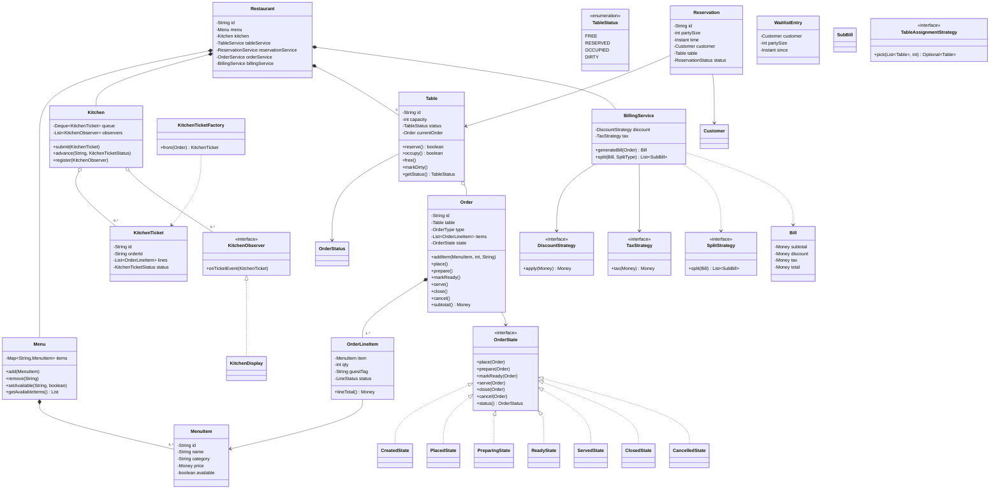
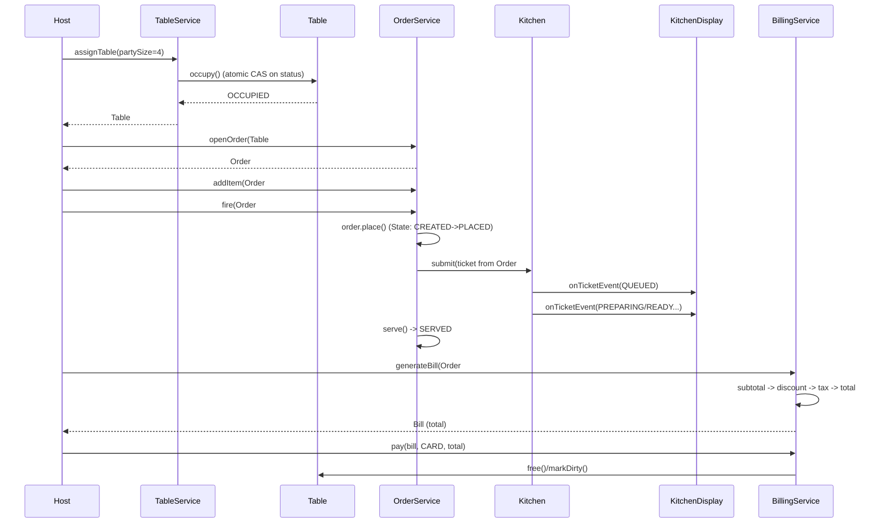

# Restaurant Management System — Low-Level Design

> A staff-engineer-grade LLD / machine-coding reference and last-minute revision artifact.
> Reader profile: senior Java engineer who knows OOP + GoF patterns and wants to see *how to apply* them with justification, clean SOLID design, and production-quality code.

---

# PART A — Design Document

## 1. Problem statement

Design the software that runs the floor and kitchen of a sit-down restaurant. The system must let staff:

- Manage **tables** (status: free, reserved, occupied, dirty/cleaning) and seat parties of varying sizes.
- Take **reservations** ahead of time and assign/seat them when guests arrive, with a **waitlist** when the restaurant is full.
- Maintain a **menu** (items, categories, price, availability) that managers can edit.
- Open an **order** per table, add/modify/cancel line items, and drive the order through its **lifecycle** (placed → in kitchen → being prepared → ready → served → closed).
- Stream order tickets to a **Kitchen Display System (KDS)** so cooks see incoming/queued tickets in real time.
- Generate a **bill** with configurable **taxes and discounts**, support **split bills** (by guest, by item, equally), and record payment.
- Operate safely under **concurrency** — multiple waiters acting on tables and orders at once must not double-seat a table or corrupt an order.

This is an in-memory, single-process LLD (the kind asked in a 60–90 minute machine-coding round), but the boundaries are drawn so the same model maps onto a service + datastore later.

---

## 2. Clarifying / requirements questions to ask first

A real round starts here. I'd ask the interviewer:

**Functional scope**
1. Is this a *single* restaurant or a chain/franchise (multi-location)? Does one running system serve many restaurants, or one?
2. Do we manage **reservations** (book ahead) or only **walk-ins**, or both? Do reservations have a time slot and duration?
3. When the restaurant is full, do we need a **waitlist** with quoted wait times, or just reject?
4. Who edits the **menu** — and do we need item availability toggling (86'ing an item) and per-time-of-day menus (breakfast/lunch)?
5. What is the exact **order lifecycle**? Is "served then add more items" allowed (re-fire to kitchen)?
6. Billing: do we need **split bills**? If so, which split modes — equal, by item, by guest? Are taxes a flat rate or per-item category? Are discounts coupon-based, percentage, or loyalty-driven?
7. **Payments** — do we just record a payment method/amount, or integrate gateways (out of scope for LLD usually)?
8. Does the **kitchen** need ticket prioritization, multiple stations (grill/fry/bar), or a single queue?

**Non-functional**
9. **Concurrency** — how many waiters/terminals act simultaneously? Is this multi-threaded in one process (so I must make table seating / order mutation thread-safe), or sharded per terminal?
10. **Consistency** — must table seating be strongly consistent (never double-seat)? (Almost always yes.)
11. **Persistence** — in-memory for the exercise, or do I need a repository abstraction so storage can swap later?
12. **Scale** — number of tables, menu size, orders/day. (Affects whether a queue/index matters; for LLD usually small.)

**Scope-narrowing / out of scope**
13. Are inventory/stock depletion, staff scheduling/payroll, supplier ordering, and analytics dashboards **out of scope**? (Usually yes — confirm.)
14. Do we need authentication/roles (manager vs waiter vs host) modeled, or assume a trusted caller?
15. Notifications to guests (SMS "table ready") — model the **Observer hook** or skip?

**Assumed answers** (stated so the design is concrete): single restaurant; both reservations and walk-ins with a waitlist; menu is manager-editable with 86'ing; full order lifecycle with re-fire; split bills in all three modes; tax = per-category rate + service charge, discounts = pluggable strategies; payment is recorded only; single kitchen queue with an Observer-driven KDS; multi-threaded single process so seating + order mutation must be thread-safe; in-memory with repository interfaces; roles modeled lightly (an actor enum on operations, not full auth).

---

## 3. Finalized requirements & assumptions

**In scope (functional)**
- **Tables**: create, query by status/capacity, atomic state transitions (FREE → RESERVED → OCCUPIED → DIRTY → FREE), merge not required but capacity-based assignment is.
- **Reservations**: create for a party size + time; assign to a suitable table; convert to a seated party (check-in). Cancel.
- **Waitlist**: when no suitable free table, enqueue the party; when a table frees, the host can seat the next compatible party (FIFO with capacity fit).
- **Menu**: add/remove/update items, toggle availability (86), grouped by category.
- **Order**: one open order per occupied table; add/update/cancel line items while allowed by state; fire to kitchen; advance lifecycle; close.
- **Kitchen / KDS**: each fired order produces a ticket pushed onto the kitchen queue; KDS observers are notified on every status change so displays stay live.
- **Billing**: compute subtotal → apply discount strategy → apply tax/charge strategy → total; support **split** equally / by item / by guest; record payment and close the order + table.

**Non-functional**
- **Thread-safe** table seating and order mutation (no double-seat, no lost line-item updates).
- **Extensible**: new tax rules, discount rules, split modes, and notification channels added without touching existing code (Open/Closed).
- **In-memory** with `Repository` interfaces so a DB can replace the maps later.
- Deterministic IDs (UUID) and immutable value objects where natural (Money).

**Out of scope**: inventory depletion, payroll/scheduling, supplier procurement, real payment gateways, analytics, multi-tenant chain management, persistence engine, network/API layer, authentication.

**Adjacent terms (1-liners)**
- *86 an item*: restaurant slang for marking a dish unavailable/sold out.
- *Fire / re-fire*: send a ticket to the kitchen to start cooking; re-fire = send an additional later course.
- *KDS (Kitchen Display System)*: the screen in the kitchen showing live order tickets.
- *Cover*: a single dining guest (a "4-cover" = party of 4).

---

## 4. Problem extensions / follow-up variations

These are the add-ons interviewers love; each line says the **design impact**.

| Extension | Design impact | How this design absorbs it |
|---|---|---|
| **Reservations with time slots & no-show handling** | Need time-based availability, not just current status | `Reservation` already holds a time; add a `ReservationService` index by slot; table availability becomes a function of (status, slot). No entity rewrite. |
| **Table merge/split for big parties** | Assignment must consider combined capacity | `TableAssignmentStrategy` (Strategy pattern) — swap the algorithm to a bin-packing/merge one; `Table` gains an optional `mergedGroupId`. |
| **Multiple kitchen stations (grill, fry, bar) with routing** | One queue → many queues by item station | `KitchenItem` carries a `Station`; `Kitchen` holds a queue per station; ticket lines route by station. Observer notification unchanged. |
| **Ticket prioritization / SLA** | FIFO queue → priority queue | Replace the `Deque` with a `PriorityQueue` keyed by `OrderType`/age. State machine untouched. |
| **Per-item tax categories & service charge tiers** | Tax can't be one flat number | `TaxStrategy` already pluggable; add a `CategoryTaxStrategy` summing per-category rates. |
| **Loyalty / coupon / happy-hour discounts** | Many discount rules, possibly stacked | `DiscountStrategy` interface + a `CompositeDiscount` that chains strategies (Composite/Chain). |
| **Guest-facing notifications ("table ready", "order served")** | New output channel | Add an `Observer` (e.g., `SmsNotifier`) to the same subjects (Table/Order). Zero change to subjects. |
| **Online/takeaway/delivery orders (no table)** | Order without a table | `Order` already references table optionally; introduce `OrderType` enum (DINE_IN/TAKEAWAY/DELIVERY); seating/table steps skipped for non-dine-in. |
| **Multi-restaurant chain** | One process → many restaurants | `Restaurant` becomes an aggregate root keyed by id; services take a restaurant context. Repositories scope by restaurant id. |
| **Persistence + audit** | In-memory maps → DB | `Repository` interfaces are already the seam; add JPA/SQL implementations; entities stay POJOs. |

---

## 5. Core entities, responsibilities & relationships

**Value objects / enums**
- `Money` — immutable amount + currency; arithmetic (add, multiply, percentage). Avoids `double` rounding bugs (uses `BigDecimal`).
- `TableStatus` { FREE, RESERVED, OCCUPIED, DIRTY }
- `OrderStatus` { CREATED, PLACED, PREPARING, READY, SERVED, CLOSED, CANCELLED } — the **State** of the order lifecycle.
- `KitchenTicketStatus` { QUEUED, PREPARING, READY, PICKED_UP }
- `OrderType` { DINE_IN, TAKEAWAY, DELIVERY }
- `SplitType` { EQUAL, BY_ITEM, BY_GUEST }

**Entities**
- `Restaurant` — aggregate root; owns tables, menu, kitchen, and the services. (In multi-tenant it would be keyed by id.)
- `Table` — id, capacity, `TableStatus`; **thread-safe** state transitions; knows its current `Order`.
- `Reservation` — id, party size, time, customer, target table; lifecycle (BOOKED → SEATED/CANCELLED).
- `WaitlistEntry` — party size + customer + timestamp; lives in a FIFO waitlist.
- `MenuItem` — id, name, category, `Money` price, `available` flag.
- `Menu` — collection of `MenuItem` grouped by category; add/remove/update/86.
- `Order` — id, table (optional), `OrderType`, list of `OrderLineItem`, `OrderStatus` (driven by a **State** machine), guest mapping (for by-guest split). Computes subtotal.
- `OrderLineItem` — `MenuItem` snapshot + quantity + optional guest tag + per-line status.
- `KitchenTicket` — derived from an order's fired lines; `KitchenTicketStatus`.
- `Kitchen` — holds the ticket queue; is an **Observer subject** (or hosts the KDS observers).
- `Bill` — built from a closed/served order; subtotal, discount, tax, total; supports splits → list of `SubBill`.
- `Payment` — method, amount, status (recorded only).
- `Waiter`, `Customer` — light actors.

**Relationships (prose)**
- `Restaurant` **composes** `Table`s, `Menu`, `Kitchen` (lifecycle-owned).
- `Table` **associates** with its current `Order` (1:0..1).
- `Order` **composes** `OrderLineItem`s; **references** a `Table` (0..1) and `MenuItem`s (via snapshots).
- `Order` **has-a** `OrderState` (State pattern) — composition over inheritance.
- `Kitchen` **aggregates** `KitchenTicket`s and notifies `KitchenObserver`s (Observer).
- `BillingService` **uses** a `DiscountStrategy` and a `TaxStrategy` (Strategy) and a `SplitStrategy`.
- Services (`TableService`, `ReservationService`, `OrderService`, `BillingService`, `KitchenService`) orchestrate; entities hold state + invariants.

---

## 6. Design patterns applied

For each: **where / why / rejected alternative / when not to use** + SOLID in play. The rule is *justify, don't pattern-stuff.*

### 6.1 State — Order lifecycle (and conceptually Table)
- **Where**: `Order` delegates `place()`, `prepare()`, `markReady()`, `serve()`, `close()`, `cancel()` to a current `OrderState` (`CreatedState`, `PlacedState`, `PreparingState`, …). Each state allows only legal transitions and throws on illegal ones.
- **Why**: the order has many states with different allowed operations; a `switch` on an enum scattered across methods rots fast. State encapsulates "what's legal now" with each transition in one place — easy to read under interview pressure and to extend (add `OnHoldState`).
- **Rejected alternative**: enum + `if/switch` guards in `Order`. Fine for 2–3 states; here we have 7 and each gates several operations → switch explosion, violates Open/Closed. **When not to use State**: tiny, stable state sets — the indirection isn't worth it.
- **SOLID**: SRP (each state class owns its rules), OCP (new state = new class).

### 6.2 Strategy — Billing (discount, tax) and table assignment
- **Where**: `DiscountStrategy`, `TaxStrategy` injected into `BillingService`; `TableAssignmentStrategy` injected into `TableService`; `SplitStrategy` for split modes.
- **Why**: pricing rules and seating policy vary independently and are the most-changed code. Strategy lets a manager pick "20% off" vs "happy hour" or "best-fit" vs "first-fit" seating without editing the service.
- **Rejected alternative**: a flag + branching method (`computeTotal(boolean isMember, ...)`). It couples every rule into one class and breaks OCP. **When not to use**: when there's truly one algorithm that never varies.
- **SOLID**: OCP (new rule = new class), DIP (service depends on the interface), ISP (small focused interfaces).

### 6.3 Observer — Kitchen Display System & notifications
- **Where**: `Kitchen` (subject) notifies `KitchenObserver`s (`KitchenDisplay`, future `SmsNotifier`) when a ticket is queued or changes status. `Order` can also be a subject for guest notifications.
- **Why**: the KDS, expo screen, and guest notifier all need to react to order/ticket events without the kitchen knowing who's listening — decoupled fan-out.
- **Rejected alternative**: kitchen directly calls the display object. Hard-codes one consumer; adding SMS means editing `Kitchen`. **When not to use**: single, fixed consumer that will never multiply.
- **SOLID**: OCP (add observers freely), DIP.

### 6.4 Factory (Method) — building tickets / states / orders
- **Where**: `KitchenTicketFactory` builds a ticket from fired order lines (routing by station later); an `OrderStateFactory`/state-internal `next()` supplies the next state; `OrderFactory` could create orders by `OrderType`.
- **Why**: centralizes "how to construct" so construction rules (e.g., which lines go to which station) live in one place, and callers stay clean.
- **Rejected alternative**: `new KitchenTicket(...)` scattered in services. Construction logic leaks and duplicates. **When not to use**: trivial objects with no construction logic — a constructor is enough.
- **SOLID**: SRP, OCP.

### 6.5 Singleton-ish / Aggregate root — `Restaurant`
- **Where**: `Restaurant` wires repositories + services together (a composition root). Not a global Singleton (avoid hidden global state); it's the explicit aggregate boundary.
- **Why**: one clear ownership tree and a single place to bootstrap. **When not to use** a true Singleton: testability suffers from global mutable state — prefer dependency injection, which is what we do.

### 6.6 Repository — persistence seam
- **Where**: `TableRepository`, `OrderRepository`, `MenuRepository`, `ReservationRepository` (in-memory maps now).
- **Why**: isolates storage so the exercise stays in-memory but a DB drops in later. **SOLID**: DIP.

### 6.7 (Optional) Composite — stacked discounts
- **Where**: `CompositeDiscountStrategy` chains several `DiscountStrategy`s for happy-hour + loyalty stacking. Justified only when stacking is required; otherwise omit.

**SOLID summary**: SRP — entities hold invariants, services orchestrate, states/strategies hold rules. OCP — new tax/discount/split/observer/state/assignment without editing existing classes. LSP — every strategy/state honors its interface contract. ISP — small interfaces (`DiscountStrategy`, `TaxStrategy`, `OrderState`). DIP — services depend on interfaces (repositories, strategies), wired at the composition root.

---

## 7. Class diagram

### 7.1 Mermaid `classDiagram`



### 7.2 Short text UML

```
Restaurant ◆── Menu, Kitchen, Table[*], Services        (composition: lifecycle-owned)
Table   o── Order (0..1 current)                         (association)
Order   ◆── OrderLineItem[1..*]                          (composition)
Order   ──> OrderState  (Created/Placed/Preparing/...)   (State pattern, delegation)
OrderLineItem ──> MenuItem                               (snapshot reference)
Kitchen o── KitchenTicket[*], KitchenObserver[*]         (Observer subject)
KitchenObserver <|.. KitchenDisplay                      (realization)
BillingService ──> DiscountStrategy, TaxStrategy, SplitStrategy   (Strategy, DIP)
TableService   ──> TableAssignmentStrategy               (Strategy)
*Service ──> *Repository                                 (Repository, DIP)
```

### 7.3 Key public APIs

```java
// Tables
Optional<Table> TableService.assignTable(int partySize);     // thread-safe pick + occupy
boolean Table.reserve(); boolean Table.occupy(); void Table.free(); void Table.markDirty();

// Reservations & waitlist
Reservation ReservationService.book(Customer c, int size, Instant t);
Optional<Table> ReservationService.seat(String reservationId);   // check-in
WaitlistEntry  ReservationService.addToWaitlist(Customer c, int size);
Optional<Table> ReservationService.seatNextFromWaitlist();

// Menu
void Menu.add(MenuItem i); void Menu.setAvailable(String id, boolean v);

// Orders
Order OrderService.openOrder(Table t, OrderType type);
void  OrderService.addItem(String orderId, String menuItemId, int qty, String guestTag);
void  OrderService.fire(String orderId);          // place -> kitchen ticket
void  OrderService.advance(String orderId);       // state machine step
// Billing
Bill  BillingService.generateBill(Order o);
List<SubBill> BillingService.split(Bill b, SplitType type);
Payment BillingService.pay(Bill b, PaymentMethod m, Money amount);
```

---

## 8. Key flows

### 8.1 Seat a walk-in → order → fire → bill (sequence)



### 8.2 Order lifecycle (state transitions)

```
CREATED --place()--> PLACED --prepare()--> PREPARING --markReady()--> READY
   |                                                                    |
   |                                                              serve()|
   +--cancel()--> CANCELLED                                             v
PLACED/PREPARING --cancel()--> CANCELLED                              SERVED --close()--> CLOSED
```
Illegal transitions (e.g., `serve()` on `CREATED`, `close()` on `PREPARING`) throw `IllegalStateTransitionException`.

### 8.3 Waitlist seating
1. `assignTable(size)` finds no FREE table of fit capacity → `addToWaitlist`.
2. A party leaves → `Table.markDirty()` → cleaned → `free()`.
3. Host calls `seatNextFromWaitlist()` → FIFO scan for first entry whose size fits a now-free table → `occupy()` + remove from waitlist.

### 8.4 Split bill (by item)
1. `generateBill(order)` produces a `Bill` (subtotal/discount/tax/total).
2. `split(bill, BY_ITEM)` groups line items per guest tag, recomputing each `SubBill`'s share of discount + tax proportionally to its subtotal so the parts sum to the whole (rounding remainder assigned to the last sub-bill).

---

## 9. Concurrency, edge cases & extensibility

**Concurrency / thread-safety**
- **Table seating is the hot spot** (two waiters seating the same table). `Table.status` transitions use **atomic compare-and-set**: `occupy()` succeeds only if current status is FREE/RESERVED, implemented with a synchronized block (or `AtomicReference<TableStatus>` CAS). `TableService.assignTable` iterates candidates and stops at the first table whose `occupy()` CAS wins — so concurrent assigners never double-seat; losers move to the next candidate.
- **Order mutation**: each `Order` guards its line-item list and state transitions with its own lock (synchronized methods). Two waiters adding items to the same order serialize; lost-update avoided.
- **Repositories** use `ConcurrentHashMap`.
- **Kitchen queue**: `ConcurrentLinkedDeque` (or `synchronized` around the deque) for submit/poll; observer notification happens outside the lock to avoid holding it during I/O.
- **Reservation/waitlist**: the waitlist is a `synchronized` FIFO; `seatNextFromWaitlist` is atomic w.r.t. table CAS so a freed table isn't grabbed by two parties.
- **Money** is immutable → safe to share.

**Edge cases**
- Add item after order is PLACED/PREPARING → allowed only if business rule permits re-fire; otherwise `IllegalStateTransition`. We allow re-fire by reopening firing for new lines while keeping existing lines.
- 86'd (unavailable) menu item added → reject with clear error.
- Bill split where item count < guests, or guest tags missing → fall back to EQUAL and warn.
- Rounding: `Money` uses `BigDecimal` with `HALF_UP`, scale 2; split remainder goes to last sub-bill so sum is exact.
- Cancel a partly-prepared order → kitchen ticket marked cancelled; table freed.
- Reserve then no-show → reservation expiry frees the held table back to FREE.
- Empty order close / pay zero → guarded.

**Extensibility** — each item in §4 maps to a seam: new `DiscountStrategy`/`TaxStrategy`/`SplitStrategy`/`TableAssignmentStrategy` (Strategy), new `OrderState` (State), new `KitchenObserver` (Observer), new station routing in `KitchenTicketFactory` (Factory), DB-backed `Repository` (DIP). No existing class needs editing — Open/Closed in practice.

---

## 10. Likely interview questions

**Q1. Why State for the order and not a status enum + ifs?**
Seven states each gate several operations; an enum forces a growing `switch` in every method (`addItem`, `serve`, `close`), which violates OCP and is bug-prone. State puts "what's legal now" in one cohesive class per state and makes a new state (`OnHold`) an additive change.
- *Probe:* Where does the next-state decision live? In each state's method (it sets `order.setState(new PreparingState())`), so transitions are explicit and local.
- *Probe:* How do you prevent illegal transitions? Default interface methods throw `IllegalStateTransitionException`; each concrete state overrides only the legal ones.

**Q2. How do you guarantee a table is never double-seated under concurrency?**
`Table.occupy()` is a CAS on status: it only transitions FREE→OCCUPIED inside a synchronized block (or `AtomicReference.compareAndSet`). `TableService.assignTable` tries candidates and accepts the first whose CAS wins; concurrent callers that lose simply try the next table.
- *Probe:* Why not lock the whole `TableService`? Coarse lock kills throughput; per-table CAS keeps contention to the contested table only.
- *Probe:* Deadlock risk seating-across-tables? We lock one table at a time and never hold two table locks, so no cycle.

**Q3. Design the billing so taxes and discounts can change without editing code.** (senior-signal)
Strategy: `BillingService` depends on `DiscountStrategy` and `TaxStrategy` interfaces injected at construction. Compute order: subtotal → `discount.apply` → `tax.tax` → total. New rule = new class; stacking = `CompositeDiscountStrategy`. DIP + OCP.
- *Probe:* Order of operations? Discount before tax (discount the pre-tax subtotal), matching most jurisdictions — but make it explicit and configurable.

**Q4. How do split bills keep the parts summing exactly to the whole?**
Each `SubBill` gets its proportional share of discount and tax based on its subtotal fraction; rounding remainder (from `BigDecimal HALF_UP`) is assigned to the last sub-bill so the sum equals the original total to the cent.

**Q5. Why Observer for the KDS instead of the kitchen calling the display directly?** (senior-signal)
The same ticket events feed the KDS, an expo screen, and (later) guest SMS. Observer lets the `Kitchen` subject fan out to N observers it doesn't know about, so adding `SmsNotifier` is purely additive (OCP). Direct calls hard-code one consumer.
- *Probe:* Sync or async notify? Notify outside the queue lock; for production, hand off to an executor so a slow observer can't stall the kitchen.

**Q6. Where does the Factory earn its place?**
`KitchenTicketFactory.from(order)` centralizes "which fired lines become a ticket" and is the natural home for future station routing (grill vs bar). Scattering `new KitchenTicket(...)` would duplicate that logic.

**Q7. How would you add multiple kitchen stations with routing?** (senior-signal / extension)
`MenuItem`/`OrderLineItem` carry a `Station`; `Kitchen` keeps a queue per station; `KitchenTicketFactory` splits an order's lines into per-station tickets. Observer notification and the order State machine are untouched — the change is localized to construction + queues.

**Q8. Why an aggregate root `Restaurant` and not a global Singleton everywhere?**
Singletons introduce hidden global mutable state that wrecks testability. `Restaurant` is an explicit composition root wiring repositories + services via constructor injection, so tests can build a restaurant with fakes.

**Q9. How do reservations + waitlist interact when a table frees?**
Freeing a table triggers `seatNextFromWaitlist()` (FIFO with capacity fit) under the same table CAS, so a freed table is seated by exactly one party. Reservations holding a specific table take precedence at their slot; no-shows expire and release the hold.

**Q10. What breaks first at 10x scale, and how do you evolve?**
The in-memory maps and single process. Swap `Repository` impls for a DB (DIP seam already there), move the kitchen queue to a message broker, and shard table state per restaurant. The domain model (entities, states, strategies) is unchanged — that's the payoff of the seams.

---

# PART C — Cheat-sheet & self-test

**Patterns used (recap)**
- **State** — `Order` lifecycle (CREATED→PLACED→PREPARING→READY→SERVED→CLOSED/CANCELLED); legal transitions per state class.
- **Strategy** — `DiscountStrategy`, `TaxStrategy`, `SplitStrategy`, `TableAssignmentStrategy`; swap pricing/seating rules without editing services.
- **Observer** — `Kitchen` notifies `KitchenObserver`s (KDS, future SMS) on ticket events.
- **Factory** — `KitchenTicketFactory` builds tickets (future station routing).
- **Repository** — storage seam (`ConcurrentHashMap` now, DB later).
- **Composition root** — `Restaurant` wires services/repos (DI, not global Singleton).
- *Optional:* **Composite** — stacked discounts.

**Key design decisions (recap)**
- `Money` on `BigDecimal` (HALF_UP, scale 2); split remainder to last sub-bill so parts sum exactly.
- Table seating via per-table CAS → no double-seat, no coarse lock.
- Order mutation + transitions guarded per-order; observers notified outside locks.
- Discount applied before tax (configurable).
- Services orchestrate; entities own invariants; states/strategies own rules (SRP/OCP/DIP).

**5 self-test questions (no answers)**
1. Draw the order State machine from memory and name which operations each state rejects.
2. Implement `assignTable` so two concurrent callers can never seat the same table — what is the exact atomic step?
3. Add a "buy-one-get-one" discount and a per-category tax without modifying `BillingService`. What do you write?
4. A party of 6 wants to split BY_GUEST but two guests share dishes — how do your `SubBill`s still sum to the total?
5. Add a second kitchen station (bar) with its own queue and SLA priority. Which classes change and which stay closed?
