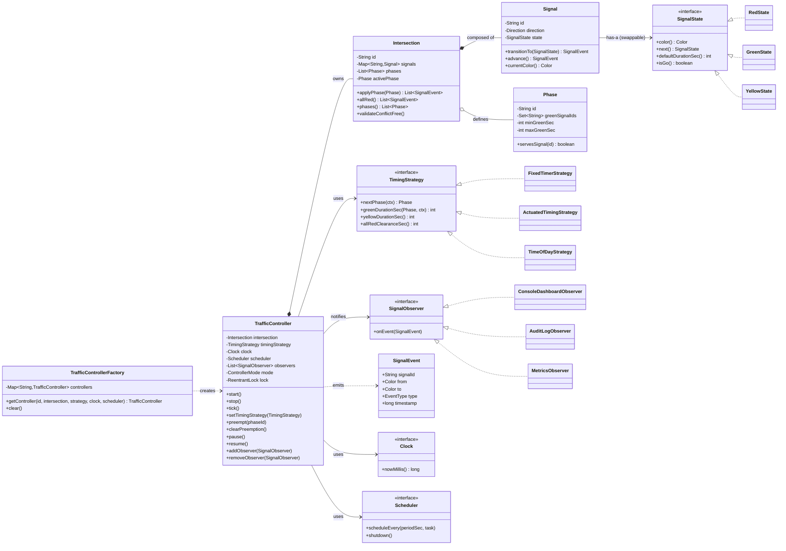
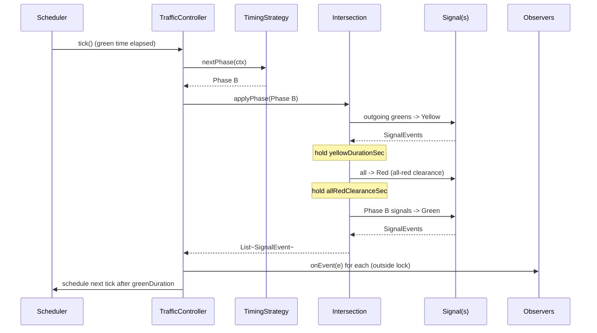

# LLD: Traffic Signal Control System

> A staff-level low-level-design walkthrough + revision artifact. Read **PART A** for the full design, **PART C** for the last-minute cheat-sheet, and `Solution.java` for the complete single-file Java implementation (PART B).

---

# PART A — Design Document

## 1. Problem statement

Design the control software for a **Traffic Signal Control System**. A physical *intersection* is where two or more roads cross. Each approach to the intersection (e.g. North, South, East, West) has a **traffic signal** (a signal head) that shows one of three lamps — **Red**, **Green**, or **Yellow** (amber). A **controller** cycles each signal through its colors on a timed plan so that conflicting flows of traffic are never given Green simultaneously, while observers (dashboards, loggers, simulators) are notified whenever a signal changes.

The system must:

- Model signals that transition through a legal lifecycle: `Green → Yellow → Red → Green …` (never `Green → Red` directly — the Yellow is the safety clearance interval).
- Run a **timing plan** so each phase (the set of signals that are simultaneously allowed to move) lasts a configurable duration.
- **Never** let conflicting directions show Green at the same time (the core safety invariant).
- Notify interested parties (observer screens, audit log) on every change.
- Support different **transition strategies** — fixed-timer, sensor/traffic-actuated, time-of-day plans.
- Support **emergency-vehicle override** (preempt the cycle and force a corridor to Green).
- Be **thread-safe**: a background timer thread drives transitions while API calls (override, reconfigure, query) come from other threads.

This is a *control-logic* design problem, not a distributed-systems problem; we focus on object modelling, state legality, and concurrency within one controller process.

---

## 2. Clarifying / requirements questions to ask first

Lead with these in the interview — *never* start drawing classes. Group them so the interviewer sees structured thinking.

### Functional scope
1. **Granularity:** Are we controlling a *single intersection*, or a *network* of synchronized intersections (a "green wave" corridor)? Single first, network as an extension?
2. **Directions per intersection:** Fixed 4-way (N/S/E/W), or arbitrary N approaches? Are there dedicated left-turn / pedestrian / bicycle signals, or just through-traffic for now?
3. **Phases:** Is opposing traffic grouped into *phases* (e.g. N+S share Green, then E+W share Green), or does every direction get its own independent Green slot?
4. **Color set:** Standard Red/Yellow/Green only, or also flashing-red, flashing-yellow, all-red clearance, pedestrian WALK/DONT-WALK?
5. **Transition trigger:** Pure **time-based** (fixed durations), **sensor/actuated** (extend Green while cars are detected), or **time-of-day** plans (rush-hour vs night)? Do we need all three, pluggable?
6. **Emergency override:** Do we need emergency-vehicle / transit-signal preemption (force a corridor Green, then recover gracefully)?
7. **Manual control:** Should an operator be able to pause, single-step, or force a specific phase?

### Non-functional
8. **Concurrency model:** One controller per process driving a timer thread, with external threads issuing commands? Do we need it to be thread-safe? (Assume **yes**.)
9. **Persistence:** Must timing configuration survive restart, or is in-memory config fine for this round?
10. **Observability:** Who consumes signal-change events — a UI, a logger, a simulator, all of them? (Drives Observer.)
11. **Scale / timing precision:** Sub-second precision needed, or whole-second granularity? Real wall-clock time or a simulated/virtual clock for testability?
12. **Failure modes:** What happens on a fault — fail to **all-flashing-red** (safe default)? Is fault handling in scope?

### Scope-narrowing (state explicit assumptions)
13. *"I'll assume one intersection with configurable directions grouped into phases, pluggable timing strategy, emergency override, an Observer event bus, a virtual-clock-friendly timer, and thread-safety. Network synchronization, pedestrian/turn signals, and persistence are extensions I'll design for but not fully implement. Agreed?"*

> Stating assumption #13 out loud and getting a nod is the single highest-leverage move — it bounds the problem and signals senior judgment.

---

## 3. Finalized requirements & assumptions

**In scope (built in `Solution.java`):**

- A `TrafficController` (Singleton-style, one per process via a factory) that owns one `Intersection`.
- An `Intersection` composed of multiple `Signal`s, organized into **phases** (groups of signals allowed Green together).
- Each `Signal` is a **State machine** over `RedState`, `GreenState`, `YellowState` with the only legal cycle `Green → Yellow → Red → Green`.
- A pluggable **`TimingStrategy`** deciding how long each phase runs and which phase comes next (FixedTimer, Actuated/sensor, TimeOfDay).
- A background timer (driven by an injectable `Clock`/scheduler so tests use a virtual clock) advancing phases.
- **Observer** event bus: `SignalObserver`s (console dashboard, audit logger) are notified on every signal change and phase change.
- **Emergency override**: preempt the running plan, drive a target phase to Green safely (through Yellow/all-red), hold, then resume.
- **Thread-safety**: a single lock per intersection guards phase transitions; observers are notified outside the lock; config is swapped atomically.
- **Safety invariant**: conflicting phases never simultaneously Green; transitions always pass through Yellow + an all-red clearance gap.

**Out of scope (designed-for, not implemented):**
- Multi-intersection network synchronization / green-wave offset coordination.
- Pedestrian, bicycle, and dedicated turn signals (the model generalizes to them).
- Durable persistence of configuration; distributed deployment; hardware I/O drivers.

**Assumptions:**
- Whole-second timing granularity; a virtual clock for deterministic demo/tests.
- Phases are predefined and conflict-free by construction (validated at config time).
- A single controller process per intersection (no leader election).

---

## 4. Problem extensions / follow-up variations

This is where senior candidates separate themselves. For each, name the **design impact** and which seam absorbs it.

| # | Extension | Design impact | Seam that absorbs it |
|---|-----------|---------------|----------------------|
| 1 | **Timed vs sensor-based transitions** | Green duration becomes dynamic (extend while a loop detector sees cars, cap at max-green) | New `ActuatedTimingStrategy` implementing `TimingStrategy`; `Signal`/`Intersection` unchanged. **Open/Closed.** |
| 2 | **Time-of-day plans** | Rush-hour vs night-flash vs weekend timings | `TimeOfDayTimingStrategy` that delegates to a sub-strategy chosen by current time; or hot-swap the strategy via `setTimingStrategy`. |
| 3 | **Multi-direction / N-way intersections** | More than 4 approaches; phases get larger / more numerous | `Intersection` already holds a `List<Signal>` and a `List<Phase>`; no structural change — just more config. |
| 4 | **Pedestrian / turn signals** | New "colors" (WALK / FLASH-DONT-WALK / DONT-WALK; protected-left arrows) | `Signal` is generic over a `LampState` hierarchy; add `WalkState` etc. as new `State` subclasses. **State pattern pays off.** |
| 5 | **Emergency-vehicle override / transit preemption** | Interrupt plan, force a corridor Green safely, then recover | `Command`-style `preempt(phaseId)` on controller + a `PreemptionController`; uses the same safe-transition path. Implemented. |
| 6 | **Configurable timing at runtime** | Operator changes durations live without restart | Strategy is swapped atomically under lock; in-flight phase finishes, new plan applies next cycle. Implemented. |
| 7 | **Synchronization across signals (green wave)** | Adjacent intersections offset their cycles so a platoon hits successive greens | A `CorridorCoordinator` holding multiple controllers, issuing offset start-times; controllers expose `cycleOffset`. Designed. |
| 8 | **Fault handling / fail-safe** | On sensor fault or controller error, fall back to **all-flashing-red** | A `FaultState` / safe-mode flag forcing every signal to flashing red; recover on clear. Designed (hook shown). |
| 9 | **Multiple subscribers (UI + log + metrics)** | Many consumers of change events | Observer list already supports N subscribers; add a `MetricsObserver`. Implemented (2 observers in demo). |
| 10 | **Testability with deterministic time** | Need reproducible tests without sleeping real seconds | Inject a `Clock` + manual `Scheduler`; advance virtual time in tests. Implemented. |

---

## 5. Core entities, responsibilities & relationships

| Entity | Responsibility | Key relationships |
|--------|----------------|-------------------|
| `TrafficController` | Orchestrates one intersection: starts/stops the cycle, drives phase transitions on timer ticks, handles preemption and reconfiguration. Singleton-per-process via factory. | *owns* one `Intersection`; *uses* a `TimingStrategy`; *uses* a `Scheduler`/`Clock`; *holds* `SignalObserver`s. |
| `Intersection` | Holds the signals and the legal `Phase`s; enforces the conflict-free invariant; applies a phase (drives signals to correct states through the safe sequence). | *composed of* many `Signal`; *defines* many `Phase`. |
| `Signal` | A single signal head; a **State machine** that transitions Green→Yellow→Red→Green; notifies on change. | *has-a* current `SignalState`. |
| `SignalState` (interface) | Encapsulates behavior of a color: what it shows, what the legal `next()` is, how long it nominally lasts. | implemented by `RedState`, `GreenState`, `YellowState` (+ extensions). |
| `Phase` | A named set of signal-ids that may be Green together; references the directions it serves. | *references* `Signal` ids. |
| `TimingStrategy` (interface) | Decides phase durations and the next phase to run. | implemented by `FixedTimerStrategy`, `ActuatedTimingStrategy`, `TimeOfDayStrategy`. |
| `SignalObserver` (interface) | Reacts to signal/phase change events. | implemented by `ConsoleDashboardObserver`, `AuditLogObserver`, `MetricsObserver`. |
| `Clock` / `Scheduler` | Abstracts time so tests can use a virtual clock. | injected into controller. |
| `SignalEvent` | Immutable value object describing what changed. | passed to observers. |

**Relationship summary (UML verbs):**
- `TrafficController` **composition** `Intersection` (controller owns it).
- `Intersection` **composition** `Signal` (signals don't outlive the intersection).
- `Signal` **aggregation/association** `SignalState` (state object swapped at runtime; State pattern).
- `TrafficController` **association** `TimingStrategy`, `Scheduler`, `Clock`, `List<SignalObserver>`.
- `RedState`/`GreenState`/`YellowState` **realize** `SignalState`.

---

## 6. Design patterns applied

For each: *where*, *why*, *rejected alternative*, *when NOT to use*.

### 6.1 State — for signal colors
- **Where:** `SignalState` interface with `RedState`/`GreenState`/`YellowState`; `Signal.transition()` delegates to `currentState.next()`.
- **Why:** The legal lifecycle `Green→Yellow→Red→Green` and per-color behavior (display, default duration, what's legal next) belong *with the color*. State pattern makes illegal transitions structurally hard and lets us add `WalkState`/`FlashingState` without touching `Signal`.
- **Rejected alternative:** A single `enum Color` + a giant `switch` in `Signal.transition()`. Fine for 3 fixed colors, but every new color/extension edits the switch (violates Open/Closed) and scatters the "what's next" logic.
- **When NOT to use:** If colors will *never* grow beyond a fixed tiny set and have no per-state behavior, an enum with a `next()` field is simpler — don't over-engineer.

### 6.2 Strategy — for timing plans
- **Where:** `TimingStrategy` interface; `FixedTimerStrategy`, `ActuatedTimingStrategy`, `TimeOfDayStrategy`. Controller asks the strategy for the next phase and its duration.
- **Why:** Timing policy is the most-varied requirement (fixed / sensor / time-of-day). Strategy isolates each policy and lets us hot-swap at runtime (`setTimingStrategy`) — directly serving extensions #1, #2, #6.
- **Rejected alternative:** `if (mode == ACTUATED) … else if …` inside the controller. Couples controller to every policy and makes runtime swapping ugly.
- **When NOT to use:** If there's exactly one timing policy forever, the indirection is dead weight.

### 6.3 Observer — for signal-change notifications
- **Where:** `SignalObserver` notified by the controller on every `SignalEvent` (color change, phase change, preemption).
- **Why:** Multiple unrelated consumers (UI dashboard, audit log, metrics) want change events with no coupling to the control logic. Add/remove subscribers freely (extension #9).
- **Rejected alternative:** Controller directly calls `dashboard.update()` + `logger.log()`. Couples control logic to every sink and breaks Dependency-Inversion.
- **When NOT to use:** If there's a single, fixed consumer that's part of the same module, a direct call is clearer.

### 6.4 Singleton (factory-guarded) — for the controller
- **Where:** `TrafficControllerFactory.getController(intersectionId)` returns one controller instance per intersection id.
- **Why:** There must be exactly one authority driving a given intersection's lights (two controllers = conflicting Greens = crashes). A guarded factory enforces "one per intersection."
- **Rejected alternative:** A classic global `Singleton.getInstance()`. Harder to test (global mutable state), and we actually want *one per intersection*, not one globally. The factory + map is the testable form (you can clear it between tests / inject a clock).
- **When NOT to use:** When you need many independent controllers or want full DI — prefer constructing and injecting controllers explicitly. We use the factory only to *guarantee uniqueness per intersection*, and still allow dependency injection of clock/strategy.

### 6.5 Command — for preemption / operator actions (lightweight)
- **Where:** Emergency preemption and operator pause/resume modeled as discrete operations (`preempt`, `clearPreemption`, `pause`, `resume`) that queue safely against the timer thread.
- **Why:** Encapsulating "force corridor X green" as an action lets us queue, log, and undo it (recover prior plan). 
- **Rejected alternative:** Direct mutation from external threads — races with the timer thread.
- **When NOT to use:** If there were no asynchronous external actions, plain method calls suffice.

### SOLID in play
- **S (Single Responsibility):** `Signal` = state lifecycle; `Intersection` = invariant + phase application; `TimingStrategy` = timing; `Observer` = reaction. Each changes for one reason.
- **O (Open/Closed):** New timing policies, new colors, new observers all add classes, no edits to existing ones.
- **L (Liskov):** Any `SignalState` / `TimingStrategy` / `SignalObserver` is substitutable; the controller never type-checks subclasses.
- **I (Interface Segregation):** Small focused interfaces (`SignalState`, `TimingStrategy`, `SignalObserver`) instead of one fat "TrafficThing".
- **D (Dependency Inversion):** Controller depends on the `TimingStrategy`/`Clock`/`Scheduler`/`SignalObserver` abstractions, injected in, not concretes.

---

## 7. Class diagram



### Brief text UML

```
TrafficControllerFactory ──creates──> TrafficController (one per intersection id)
TrafficController ◆── Intersection ◆── Signal ──> SignalState {Red|Green|Yellow}
TrafficController ──> TimingStrategy {Fixed|Actuated|TimeOfDay}
TrafficController ──> Scheduler, Clock        (injected; virtual clock in tests)
TrafficController ──> *SignalObserver {ConsoleDashboard|AuditLog|Metrics}
Intersection ──o Phase (named set of green signal ids; min/max green)
SignalEvent: immutable {signalId, from, to, type, timestamp}
◆ = composition, ──o = aggregation, ──> = association, {..} = realizations
```

### Key public APIs

```java
// Controller
void start();
void stop();
void setTimingStrategy(TimingStrategy s);   // hot-swap, atomic under lock
void preempt(String phaseId);               // emergency override
void clearPreemption();                     // resume normal plan
void pause(); void resume();
void addObserver(SignalObserver o); void removeObserver(SignalObserver o);
void tick();                                // advance one timer step (also called by Scheduler)

// Signal (State pattern)
SignalEvent advance();                      // delegates to state.next()
Color currentColor();

// Intersection
List<SignalEvent> applyPhase(Phase p);      // safely drive signals: conflicting greens -> yellow -> all-red -> target green
void validateConflictFree();                // throws if two conflicting phases overlap illegally

// Strategy
Phase nextPhase(TimingContext ctx);
int greenDurationSec(Phase p, TimingContext ctx);
```

---

## 8. Key flows

### 8.1 Normal phase transition (the safe sequence)

The core safety rule: **you never go straight from one phase's Green to another phase's Green.** You first drop the outgoing greens to **Yellow**, hold the yellow, then go **all-red** for a short clearance gap, then raise the incoming phase to **Green**.



### 8.2 Emergency-vehicle preemption

1. External thread calls `controller.preempt("NS_PHASE")`.
2. Controller acquires the lock, sets mode = `PREEMPTED`, remembers the current plan position.
3. It runs the **same safe sequence** to drive the target phase to Green (yellow-out the conflicting greens, all-red gap, then target Green).
4. It holds the preempted Green (no auto-advance) until `clearPreemption()`.
5. `clearPreemption()` restores mode = `RUNNING` and lets the strategy pick the next phase from where it makes sense (typically the preempted phase's normal successor), again via the safe sequence.

### 8.3 Runtime reconfiguration
1. `setTimingStrategy(newStrategy)` acquires the lock and swaps the strategy reference atomically.
2. The currently running phase finishes its scheduled green; the **next** `nextPhase`/`greenDurationSec` queries hit the new strategy. No restart, no unsafe mid-phase change.

### 8.4 Signal state lifecycle
```
GreenState.next()  -> YellowState
YellowState.next() -> RedState
RedState.next()    -> GreenState     (only when its phase is selected)
```
`Signal.advance()` calls `state.next()`, swaps the state object, and returns a `SignalEvent`. Illegal jumps (Green→Red) are simply *not expressible* — there's no method for them.

---

## 9. Concurrency, edge cases & extensibility

### Concurrency / thread-safety
- **Two kinds of threads:** (a) the **timer/scheduler thread** firing `tick()`; (b) **external command threads** (`preempt`, `setTimingStrategy`, `pause`). They both mutate the same intersection state, so they race.
- **Strategy:** a single `ReentrantLock` per `TrafficController` guards every state-mutating section (`tick`, `applyPhase`, `preempt`, `setTimingStrategy`, `pause/resume`). Phase application is short and the lock is *coarse* (intersection-level) — correctness over micro-parallelism, which is the right call for safety-critical control.
- **Observer notification happens OUTSIDE the lock:** we collect `SignalEvent`s under the lock, release, then notify. This prevents a slow/blocking observer from stalling the control loop or deadlocking if it calls back in.
- **Virtual clock + manual scheduler** make the whole thing deterministic in tests: we advance time and call `tick()` ourselves, no `Thread.sleep`, no flaky timing. The production scheduler uses a `ScheduledExecutorService`.
- **Atomic strategy swap:** the strategy reference is read under the lock; swapping it mid-cycle never produces a half-applied plan.
- **Idempotent stop:** `stop()` cancels the scheduler and is safe to call twice.

### Edge cases
- **Green→Green forbidden:** always routed through Yellow + all-red; enforced in `applyPhase`, not trusted to callers.
- **Conflict-free validation at config time:** `validateConflictFree()` rejects a phase set where two phases that share no green signals are nonetheless allowed to overlap — fail fast at startup, not on the road.
- **Min/max green (actuated):** `ActuatedTimingStrategy` clamps extensions to `[minGreen, maxGreen]` so a busy direction can't starve cross traffic forever.
- **Preempt during a transition:** preemption itself runs the safe sequence, so preempting mid-yellow still finishes safely.
- **Double preempt / clear without preempt:** guarded — clearing when not preempted is a no-op; preempting an unknown phase id throws.
- **Observer throws:** notification loop catches and logs per-observer so one bad sink can't break the others or the control loop.
- **Fault / fail-safe (designed):** a `safeMode` flag drives every signal to flashing-red and suspends the plan until cleared.

### Extensibility recap (ties back to §4)
- New **timing policy** → new `TimingStrategy` (OCP).
- New **color/lamp** (WALK, arrows, flashing) → new `SignalState` subclass; `Signal`/controller untouched.
- New **event consumer** → new `SignalObserver`.
- **Network/green-wave** → wrap N controllers in a `CorridorCoordinator` that sets per-controller `cycleOffset`s; each controller stays single-intersection-correct.
- **N-way intersections** → just more `Signal`s and `Phase`s in config; no code change.

---

## 10. Likely interview questions

**Q1. Why State for the colors instead of an enum?**  
Because each color owns behavior — its legal successor, default duration, and whether it's a "go" state — and the set of colors grows (pedestrian WALK, flashing, arrows). State localizes that behavior and makes illegal transitions inexpressible. An enum + `switch` works for 3 fixed colors but violates OCP the moment you add a fourth. *Deep probe:* "What if you only ever have 3 colors?" → then an enum with a `next` field is simpler and I'd use it; don't pattern-stuff. *(senior-signal)*

**Q2. How do you guarantee two conflicting directions are never green together?**  
The invariant is enforced in one place — `Intersection.applyPhase` — which always routes a phase change through Yellow → all-red clearance → target Green, and `validateConflictFree()` rejects illegal phase configs at startup. Callers can't bypass it; there's no public "set this signal green" that skips the sequence. *Deep probe:* "What about a bug in a strategy returning a bad phase?" → the strategy only chooses *which* predefined, pre-validated phase, never raw signal states, so it can't create a conflict.

**Q3. Walk me through the threading. Who can mutate state and how do you keep it safe?**  
The scheduler thread fires `tick()`; external threads call `preempt`/`setTimingStrategy`/`pause`. All state-mutating sections take one `ReentrantLock` per controller. Observers are notified *outside* the lock (collect events under lock, notify after) to avoid stalls/deadlocks. Time is abstracted behind `Clock`/`Scheduler` so tests advance a virtual clock deterministically. *Deep probe:* "Why not lock-per-signal?" → the invariant spans signals (a phase touches several), so the consistency boundary is the intersection; finer locks would let a partial phase be observed. *(senior-signal)*

**Q4. How does emergency-vehicle override work without creating an unsafe transition?**  
`preempt(phaseId)` sets mode=PREEMPTED and drives the target phase Green through the *same* safe sequence (yellow-out conflicts, all-red gap, then green), then holds. `clearPreemption()` resumes the normal plan. It reuses the one safe-transition path, so preemption can't skip the clearance interval. *Deep probe:* "Two emergency vehicles from crossing directions?" → preemption requests queue; the controller serves them one safe transition at a time, never both green.

**Q5. Strategy vs a config flag for timing modes — defend Strategy.**  
The timing policies (fixed, actuated, time-of-day) have genuinely different *algorithms*, not just different numbers. Strategy lets each live in its own class, be unit-tested in isolation, and be hot-swapped at runtime via `setTimingStrategy`. A flag-driven `if/else` in the controller couples it to every policy and grows unboundedly. *When not:* if there were one timing policy forever, I'd inline it. *(senior-signal)*

**Q6. Why a factory-guarded singleton rather than a classic Singleton or plain DI?**  
We need exactly one controller *per intersection* (two would fight over the lights), not one globally, and we still want to inject clock/strategy for testing. A factory keyed by intersection-id enforces uniqueness while allowing DI and a `clear()` for test isolation — avoiding the global-mutable-state pain of a textbook Singleton.

**Q7. How would you add pedestrian WALK/DONT-WALK signals?**  
Add `WalkState`, `FlashingDontWalkState`, `DontWalkState` as new `SignalState` subclasses and include pedestrian signals in the relevant phases; `Signal`, `Intersection`, and the controller don't change. That's the payoff of the State pattern + phase model.

**Q8. How do you make this deterministically testable given it's time-driven?**  
Inject a `Clock` and a `Scheduler`. In tests use a `ManualClock` and a manual scheduler where the test calls `tick()` and advances virtual time — no `Thread.sleep`, no flakiness. Production wires a `ScheduledExecutorService` and system clock.

**Q9. Extend this to a coordinated corridor (green wave).**  
Wrap N single-intersection controllers in a `CorridorCoordinator` that assigns each a `cycleOffset` so a platoon travelling at the design speed hits successive greens. Each controller remains independently safe; the coordinator only sets offsets and a common cycle length. No change to the per-intersection safety logic. *Deep probe:* "What if speeds vary by time of day?" → the coordinator recomputes offsets per `TimeOfDayStrategy`. *(senior-signal)*

**Q10. What's your failure/fail-safe behavior?**  
On detected fault (sensor failure, controller exception), enter `safeMode`: drive all signals to flashing-red and suspend the plan until an operator clears it — the universally understood "treat as all-way stop" fallback. The mode flag is checked in `tick()`. *Deep probe:* "Power loss mid-yellow?" → on restart the controller boots into all-red, validates config, then resumes from a known-safe phase rather than guessing the prior state.

---

# PART C — Cheat-sheet & self-test

### Patterns & key decisions (recap)
- **State** → signal colors (`Red/Green/Yellow`, extensible to WALK/flash/arrows); legal cycle `G→Y→R→G`, illegal jumps inexpressible.
- **Strategy** → timing plans (`Fixed / Actuated / TimeOfDay`), hot-swappable at runtime.
- **Observer** → change events to `ConsoleDashboard / AuditLog / Metrics`; notify *outside* the lock.
- **Singleton (factory-guarded)** → one `TrafficController` per intersection id; testable, injectable.
- **Command (light)** → `preempt / clearPreemption / pause / resume` as safe queued actions.
- **Safety invariant** centralized in `Intersection.applyPhase`: always `Yellow → all-red clearance → target Green`; conflicts validated at config time.
- **Concurrency:** one `ReentrantLock` per controller; events collected under lock, fired after; `Clock`/`Scheduler` injected for deterministic tests.
- **SOLID:** SRP per class; OCP via the three abstractions; DIP via injection; ISP via small interfaces; LSP across all realizations.

### Self-test (no answers)
1. Why is the Green→Green transition impossible to express in this design, and which single method enforces it?
2. You must add a *protected left-turn arrow* phase that may run concurrently with the through-Green in the same direction but not the opposing through-Green. What changes — config, classes, or both?
3. Where exactly do observers get notified, and what would break if you moved that inside the lock?
4. Two emergency vehicles approach from N and E within the same second. Trace the sequence of states the intersection passes through.
5. Justify the factory-guarded singleton over (a) a classic global singleton and (b) plain dependency injection — give one concrete failure each alternative would cause.
