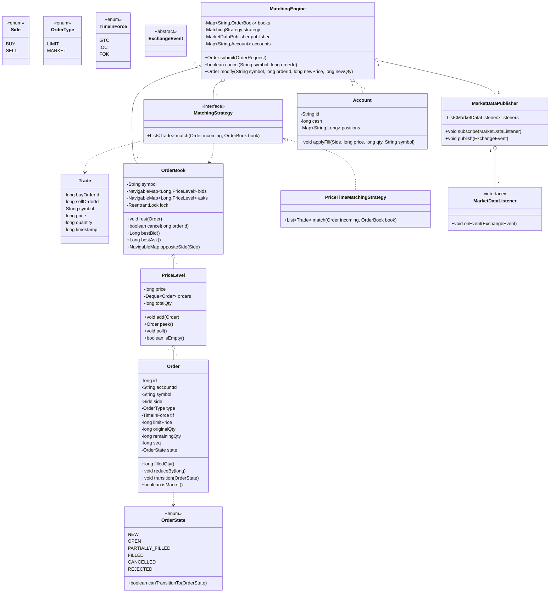
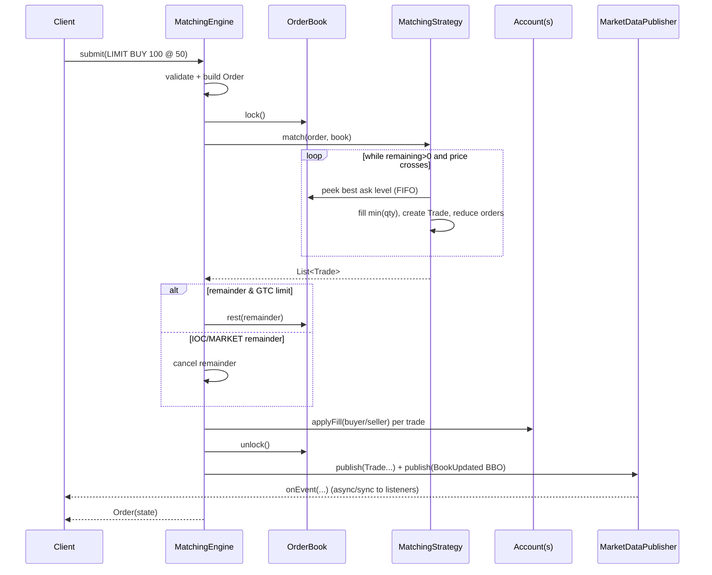

# Stock Exchange / Order Matching Engine — LLD Design Document

> A staff-level low-level-design reference and last-minute revision artifact.
> PART A is the design doc, PART C is the cheat-sheet & self-test. The full
> single-file Java solution lives in `Solution.java` (PART B).

---

# PART A — Design Document

## 1. Problem statement

Design the core of a **stock exchange order matching engine**. The system accepts
**orders** (buy/sell intents for a financial instrument), maintains a per-symbol
**order book** of resting orders, and **matches** incoming orders against the
opposite side according to **price-time priority**. When a buy and sell cross, a
**trade** (a "fill") is executed at an agreed price, balances/positions are
updated, and the result is published to interested parties (market-data feeds,
the traders involved, risk systems).

Concretely the engine must support:

- **Order types**: `LIMIT` (trade only at a price at least as good as the limit)
  and `MARKET` (trade immediately at the best available price).
- **Sides**: `BUY` (bid) and `SELL` (ask/offer).
- **Price-time priority matching**: best price first; within a price level, the
  order that arrived earliest matches first (FIFO).
- **Partial fills**: a large order may be filled in pieces against multiple
  resting orders, leaving a remaining quantity that rests in the book.
- **Order lifecycle**: `NEW → OPEN/PARTIALLY_FILLED → FILLED | CANCELLED | REJECTED`.
- **Cancel / modify (amend)**: a trader can cancel a resting order or modify its
  price/quantity (which generally loses time priority).
- **Market data**: publish the **top of book** (best bid/ask, a.k.a. the BBO) and
  the **trade tape** (stream of executed trades) to subscribers.

> *Adjacent terms (1-line each):*
> - **Order book**: the set of all unexecuted (resting) buy and sell orders for one symbol.
> - **BBO (Best Bid & Offer)**: the highest buy price and lowest sell price currently resting.
> - **Spread**: best ask minus best bid.
> - **Maker / taker**: the *maker* is the resting order that provides liquidity; the *taker* is the incoming order that consumes it.
> - **Aggressive / marketable order**: an incoming order whose price crosses the opposite side and will trade immediately.

This is an LLD round: the deliverable is clean object-oriented code with the right
patterns, correct matching semantics, and a discussion of concurrency, *not* a
distributed-systems whitepaper. I will, however, call out where the design opens
the door to scaling.

---

## 2. Clarifying / requirements questions to ask first

Before writing a single class, I would ask the interviewer:

### Functional scope
1. **Order types** — Just `LIMIT` and `MARKET`? Or also `IOC` (Immediate-Or-Cancel),
   `FOK` (Fill-Or-Kill), `STOP` / `STOP_LIMIT`, iceberg/hidden orders? (These
   strongly affect the design — Strategy/State surface area.)
2. **Matching policy** — Standard **price-time (FIFO)** priority? Or also
   **pro-rata** / size-priority matching used in some futures markets? Should I
   make the policy pluggable?
3. **Multiple symbols** — One instrument or many? (Many ⇒ one order book per symbol,
   sharded by symbol for concurrency.)
4. **Cancel / modify semantics** — On a price change, does the order keep or lose
   time priority? (Industry standard: a price change loses priority; a
   quantity-decrease keeps it.) Do we support amend-by-cancel-replace?
5. **Fill price rule** — When an aggressive order crosses, does the trade execute
   at the **resting (maker) order's price** (standard) or the incoming order's price?
6. **Self-trade prevention (STP)** — Should an account be prevented from matching
   against its own resting orders?
7. **Accounts & balances** — Do we validate buying power / position before
   accepting an order (risk checks), or just match and report?

### Non-functional
8. **Throughput / latency** — Are we targeting an HFT-grade single-threaded
   matching loop (microseconds, deterministic) or a "correct and clean" engine?
   This decides whether matching is lock-free single-threaded or synchronized.
9. **Concurrency model** — Multiple producer threads submitting orders concurrently?
   Must the engine be thread-safe, or is there one inbound thread per symbol?
10. **Ordering guarantee** — Must matching be deterministic and reproducible
    (same input sequence ⇒ same trades)? Critical for exchanges.
11. **Persistence / recovery** — Do we need an event/order journal for crash
    recovery and audit, or is this in-memory only?
12. **Precision** — Prices/quantities as integer ticks/lots (no floating-point
    error) or decimals? (Real exchanges use integer ticks.)

### Scope-narrowing (what's in / out)
13. **In scope**, I'll assume: limit & market orders, price-time matching,
    partial fills, cancel/modify, BBO + trade feed, basic account balance updates,
    thread-safety per symbol.
14. **Out of scope** unless asked: settlement/clearing, persistence, network
    protocol (FIX), authentication, regulatory reporting, stop orders, auctions
    (open/close), circuit breakers.

---

## 3. Finalized requirements & assumptions

**Functional**
- Symbols are independent; each has its own `OrderBook`. Engine routes by symbol.
- Order types: `LIMIT`, `MARKET`. Time-in-force: `GTC` (default), `IOC`, `FOK`.
- Matching: **price-time priority (FIFO)**, pluggable via a `MatchingStrategy`.
- A `BUY` matches a resting `SELL` when `buyPrice >= askPrice`; symmetric for sells.
- **Trades execute at the resting (maker) order's price** (price improvement for the taker).
- **Partial fills** supported; remaining quantity of a `LIMIT` order rests in the book,
  a `MARKET` order's unfilled remainder is cancelled.
- `IOC`: match what you can immediately, cancel the rest. `FOK`: match fully or not at all.
- **Cancel**: remove a resting order. **Modify**: price change ⇒ lose time priority
  (implemented as cancel + re-insert); quantity decrease keeps priority; quantity
  increase loses priority.
- Each `Account` tracks `cash` and `positions` (per-symbol share count); on a fill,
  buyer's cash decreases & position increases, seller's mirror.
- Publish events: `OrderAccepted`, `OrderRejected`, `Trade`, `OrderCancelled`,
  `BookUpdated (BBO)` to `MarketDataListener`s.

**Non-functional / assumptions**
- Prices & quantities are positive `long` integers (ticks / lots) — no floating point.
- Engine is **thread-safe**: concurrent submissions allowed; correctness via a
  per-symbol lock (one `ReentrantLock` per `OrderBook`). Discussed: single-threaded
  ring-buffer alternative for HFT.
- In-memory only; no persistence (but the event stream is the natural journal hook).
- Deterministic given a serialized input order per symbol.
- Self-trade prevention: out of scope for the core, noted as an extension.

---

## 4. Problem extensions / follow-up variations

These are the follow-ups interviewers love; each row notes the **design impact** and
why the chosen patterns absorb it cheaply.

| # | Extension | What changes | How the design absorbs it |
|---|-----------|--------------|----------------------------|
| 1 | **New order types** (STOP, STOP_LIMIT, ICEBERG) | Different triggering / visibility logic | `OrderType` enum + behavior keyed by it; stop orders sit in a separate trigger book and are released into the matching path when the last trade price crosses the stop — added as a new component, not a rewrite. |
| 2 | **Alternate matching algorithms** (pro-rata, size-time) | The rule for *which* resting order matches first | Swap the `MatchingStrategy` implementation per book. **Strategy pattern** is exactly for this; no engine changes. |
| 3 | **IOC / FOK / GTC time-in-force** | What to do with the unfilled remainder | `TimeInForce` enum consulted after matching; FOK does a *dry-run* check first. Localized to the engine's post-match step. |
| 4 | **Self-trade prevention** | Skip/cancel when taker and maker share an account | A pluggable predicate consulted in the match loop; cheap to add as a `BiPredicate<Order,Order>` hook. |
| 5 | **Multiple symbols at scale** | Throughput across instruments | One `OrderBook` (and lock) per symbol ⇒ symbols match in parallel. Engine is a router/`Facade`. Shard symbols across threads/cores. |
| 6 | **Market-data depth (Level 2 / full book)** | Subscribers want aggregated depth, not just BBO | The `Observer` feed already decouples publishing; add a `DepthSnapshot` event type — listeners opt in. |
| 7 | **Persistence / crash recovery** | Durability & audit | The event stream is an append-only journal; replay rebuilds the book. **Observer + event sourcing** synergy; engine logic untouched. |
| 8 | **Risk / buying-power checks** | Reject orders that exceed account limits | A `RiskCheck` Chain-of-Responsibility runs before the order reaches the book. |
| 9 | **Opening / closing auctions** | Single uncrossing price instead of continuous matching | A different `MatchingStrategy` (call auction) activated during the auction window. |
| 10 | **Order modification keeping priority** | Quantity-down keeps queue position | Handled in-place in the price-level list without re-insert; price/qty-up uses cancel+reinsert. |

---

## 5. Core entities, responsibilities & relationships

| Entity | Responsibility |
|--------|----------------|
| **`Order`** | Immutable identity + mutable remaining quantity & state. Holds id, accountId, symbol, side, type, TIF, limit price, original/remaining qty, timestamp, sequence. |
| **`OrderState`** | Enum of lifecycle states (NEW, OPEN, PARTIALLY_FILLED, FILLED, CANCELLED, REJECTED) with legal transitions. |
| **`Side` / `OrderType` / `TimeInForce`** | Enums classifying an order. |
| **`PriceLevel`** | All resting orders at one price, in FIFO arrival order (a queue). Tracks aggregate qty. |
| **`OrderBook`** | One per symbol. Two sorted maps of price → `PriceLevel`: bids (descending), asks (ascending). Knows BBO. Owns the per-symbol lock. |
| **`MatchingStrategy`** | *Strategy* interface: given an incoming order and a book, produce trades + residual handling. `PriceTimeMatchingStrategy` is the default. |
| **`MatchingEngine`** | *Facade* + router. Maps symbol → `OrderBook`. Entry points: `submit`, `cancel`, `modify`. Drives risk checks, matching, account updates, event publishing. |
| **`Trade`** | Immutable record of an execution: buyOrderId, sellOrderId, price, qty, timestamp, symbol. |
| **`Account`** | Cash + per-symbol positions; applies fills atomically. |
| **`MarketDataPublisher` / `MarketDataListener`** | *Observer* hub + subscriber interface. Emits trades, BBO updates, order events. |
| **`ExchangeEvent`** (and subtypes) | The event objects pushed to listeners. |

**Relationships (text UML)**

```
MatchingEngine  ──◇ owns many ──>  OrderBook        (composition, keyed by symbol)
MatchingEngine  ──◇ owns ──>       MatchingStrategy  (strategy, injected)
MatchingEngine  ──◇ owns ──>       MarketDataPublisher (composition)
MatchingEngine  ──◇ owns many ──>  Account           (registry)
OrderBook       ──◇ owns many ──>  PriceLevel        (composition; two sorted maps)
PriceLevel      ──◇ owns many ──>  Order             (FIFO deque)
MatchingStrategy ── uses ──>       OrderBook, Order  (association)
MatchingStrategy ── produces ──>   Trade             (dependency)
MarketDataPublisher ──> notifies ──> MarketDataListener  (observer, 1..*)
Trade            ── references ──> Order ids          (association)
```

- `◇` = composition/aggregation, `──>` = association/dependency.

---

## 6. Design patterns applied

For each: **where**, **why**, **rejected alternative**, **when *not* to use**.

### 6.1 Strategy — matching algorithm & order-type behavior
- **Where**: `MatchingStrategy` interface with `PriceTimeMatchingStrategy` (default).
  Pro-rata / call-auction would be alternate implementations.
- **Why**: The *one* axis most likely to change in a follow-up is *how* orders are
  prioritized. Strategy isolates that policy behind an interface (Open/Closed).
- **Rejected alternative**: `if (policy == PRO_RATA) {...} else {...}` branching
  inside the engine — violates OCP, becomes a god-method, untestable in isolation.
- **When *not* to use**: if matching truly will only ever be price-time, a single
  well-named method is simpler; don't add an interface for an axis that never varies.

### 6.2 State — order lifecycle
- **Where**: `OrderState` enum guarding legal transitions
  (`NEW → OPEN → PARTIALLY_FILLED → FILLED`, plus `CANCELLED/REJECTED`).
- **Why**: prevents illegal transitions (e.g. filling a cancelled order) and makes
  the lifecycle explicit and self-documenting.
- **Rejected alternative**: a full GoF State pattern with one class per state. That
  is overkill here — states carry no per-state *behavior*, only transition rules.
  An enum with a `canTransitionTo` table is the right weight.
- **When *not* to use**: if each state had rich, divergent behavior (e.g. each state
  handles `submit`/`cancel` differently), the class-per-state form would pay off.

### 6.3 Observer — market data & event feeds
- **Where**: `MarketDataPublisher` notifies registered `MarketDataListener`s of
  trades, BBO changes, and order events.
- **Why**: the engine must not know who consumes its output (UI tape, risk system,
  persistence, depth aggregator). Observer decouples producer from consumers and
  lets us add/remove feeds at runtime — directly enables extensions 6 & 7.
- **Rejected alternative**: engine directly calling each consumer — tight coupling,
  recompile to add a consumer, violates DIP.
- **When *not* to use**: if there is exactly one consumer forever, a direct callback
  is simpler. Beware in HFT: synchronous observer notification on the matching
  thread adds latency — there you publish to a queue and notify off-thread.

### 6.4 Facade — `MatchingEngine` as the single entry point
- **Where**: `MatchingEngine.submit/cancel/modify` hides book routing, locking,
  matching, account settlement and publishing behind three methods.
- **Why**: clients (order gateways) get a tiny, stable surface; internals can change.
- **Rejected alternative**: exposing `OrderBook` directly to clients — leaks the
  locking & lifecycle contract, easy to misuse.

### 6.5 Factory (light) / Builder — order construction & validation
- **Where**: a static `Order.builder()` / `Order.limit(...)`, `Order.market(...)`
  factory that validates invariants (positive qty, market orders have no price) and
  assigns id/sequence/timestamp centrally.
- **Why**: one place to enforce construction invariants; avoids invalid orders.

### 6.6 Singleton-ish registry (deliberately avoided as a global)
- We do **not** make the engine a global singleton; it's instantiated and injected.
  Mentioned because interviewers ask "why not Singleton?" — global mutable state
  hurts testability and concurrency reasoning.

### SOLID in play
- **S**RP: `OrderBook` only stores/orders resting orders; `MatchingStrategy` only
  decides matches; `Account` only tracks money/positions; publisher only fans out.
- **O**CP: new order types / matching algos / listeners added without editing the engine.
- **L**SP: any `MatchingStrategy` is substitutable for the default.
- **I**SP: `MarketDataListener` is a small interface; consumers can implement only
  what they care about (or use a no-op adapter).
- **D**IP: engine depends on `MatchingStrategy` and `MarketDataListener`
  abstractions, not concretions; both are injected.

---

## 7. Class diagram

### Mermaid `classDiagram`



### Key public APIs / method signatures

```java
// Engine (Facade) — the only surface clients touch
Order   submit(OrderRequest req);                 // validate → match → rest/settle → publish
boolean cancel(String symbol, long orderId);
Order   modify(String symbol, long orderId, long newPrice, long newQty);

// Strategy — pluggable matching
List<Trade> match(Order incoming, OrderBook book);

// Book
void        rest(Order o);
boolean     cancel(long orderId);
Long        bestBid();   Long bestAsk();
NavigableMap<Long,PriceLevel> oppositeSide(Side takerSide);

// Observer
void subscribe(MarketDataListener l);
void publish(ExchangeEvent e);
```

---

## 8. Key flows

### 8.1 Submit a marketable LIMIT BUY (text steps)
1. Client calls `engine.submit(req)`.
2. Engine validates the request (positive qty; LIMIT has a price; account exists)
   → on failure publish `OrderRejected`, return.
3. Engine builds the immutable `Order` (id/seq/timestamp assigned), routes to the
   `OrderBook` for the symbol, and acquires that book's lock.
4. Engine calls `strategy.match(order, book)`:
   - Walk the **asks** from best (lowest) price up while `order.remaining > 0` and
     `askPrice <= limitPrice` (for a market order, ignore the price check).
   - At each price level, take resting orders FIFO; fill `min(remaining, restingRemaining)`
     at the **resting price**; create a `Trade`; reduce both orders; pop fully-filled
     resting orders; transition states.
5. Post-match residual handling:
   - `FOK`: if not fully filled, *roll back* (engine does a dry-run first, so nothing
     is committed) and reject.
   - `IOC` / `MARKET`: cancel any remainder.
   - `LIMIT GTC`: `book.rest(order)` for the remainder.
6. For each trade, update buyer & seller `Account`s (cash/positions).
7. Release lock. Publish `Trade` events, then a `BookUpdated`(new BBO) event.
8. Return the order (its state reflects FILLED / PARTIALLY_FILLED / OPEN).

### 8.2 Sequence diagram



### 8.3 Cancel / modify
- **Cancel**: lock book → locate order by id (an index map id→Order) → remove from
  its `PriceLevel` → transition to `CANCELLED` → unlock → publish.
- **Modify**: lock → cancel the resting order → re-submit with new price/qty
  (price change or qty increase ⇒ new sequence ⇒ loses time priority). A pure qty
  *decrease* updates remaining in place, keeping priority. Publish.

---

## 9. Concurrency, edge cases & extensibility

### Concurrency / thread-safety
- **Per-symbol locking**: each `OrderBook` owns a `ReentrantLock`. All mutations to
  a book (match, rest, cancel, modify) are done under that lock ⇒ each symbol is a
  serialization domain. Different symbols proceed in parallel — natural sharding.
- **Why not one global lock?** It serializes the whole exchange and kills throughput.
  Per-symbol locks give independence with simple reasoning.
- **Event publishing happens *after* releasing the lock** (snapshot the events under
  lock, fan out after) to avoid holding the matching lock during slow listeners and
  to avoid lock-ordering deadlocks if a listener calls back into the engine.
- **Atomic order ids/sequences**: `AtomicLong` so concurrent submits get unique,
  monotonically increasing sequence numbers (sequence breaks time-priority ties
  deterministically even at equal timestamps).
- **Account updates**: each `Account` guards its own state (synchronized methods),
  so two trades touching the same account don't corrupt cash/positions.
- **HFT alternative (discuss)**: the lowest-latency exchanges use a
  **single-threaded matching loop per symbol fed by a lock-free ring buffer**
  (e.g. LMAX Disruptor): producers enqueue, one consumer thread matches with no
  locks, deterministic and cache-friendly. The Strategy/Observer structure here is
  compatible — you'd just swap the lock for the single-writer discipline. State that
  this is the production answer for ultra-low latency.

### Edge cases
- Market order with an **empty opposite side** ⇒ no fills; remainder cancelled
  (a market order never rests).
- Limit order that **doesn't cross** ⇒ no trades; rests fully.
- **Self-cross / partial across multiple levels** ⇒ walk levels until filled or
  price stops crossing.
- **FOK that can't fully fill** ⇒ reject with zero side-effects (dry-run check first).
- **Cancel of an already-filled or unknown order** ⇒ no-op / false return; never throws.
- **Zero or negative qty/price**, market order *with* a price, missing account ⇒
  reject at validation.
- **Equal prices, equal timestamps** ⇒ tie broken by monotonic sequence number.
- **Integer arithmetic only** ⇒ no floating-point rounding in price math.

### Extensibility (ties back to §4)
- New order type ⇒ extend enums + add a small trigger component (stops) or visibility
  rule (iceberg); engine flow unchanged.
- New matching algorithm ⇒ new `MatchingStrategy`; inject per book.
- New consumer ⇒ implement `MarketDataListener`, subscribe — no engine change.
- Persistence ⇒ a journaling listener appends every event; replay rebuilds books.
- Risk checks ⇒ a Chain-of-Responsibility before matching.

---

## 10. Likely interview questions

**Q1. Why two sorted maps for the book instead of one priority queue?**
A. We need **price levels** with FIFO order *within* a level and fast best-price
access on both sides. `TreeMap<Long,PriceLevel>` gives O(log P) best-price lookup
(P = number of distinct prices) and O(1) FIFO at a level via a `Deque`. A single
`PriorityQueue<Order>` makes **cancel** O(n) (you must scan to remove) and conflates
the two sides. Sorted-map-of-levels is the standard exchange structure; an array of
price buckets is the HFT variant when the price range is bounded.

**Q2. Walk me through price-time priority with a partial fill.**
A. Best price first; ties within a price broken by arrival order (FIFO). An incoming
BUY 100 that finds asks 60@10.00 and 60@10.01 fills 60 at 10.00, then 40 at 10.01,
leaving the 10.01 level with 20 resting and the buyer FILLED.

**Q3. At what price does a crossing trade execute — taker's or maker's?**
A. The **resting (maker) order's** price, giving the aggressor price improvement.
A BUY @ 10.05 hitting a resting ASK @ 10.00 trades at 10.00.

**Q4. Where is the Strategy pattern and what does it buy you?** *(senior signal)*
A. `MatchingStrategy` isolates the prioritization rule. Pro-rata, size-time, or a
call-auction uncross become drop-in implementations without touching the engine
(OCP/DIP). The rejected alternative — branching on a policy enum inside the engine —
turns matching into an untestable god-method.

**Q5. How do you keep it thread-safe without killing throughput?** *(senior signal)*
A. One lock **per symbol** (per `OrderBook`), so symbols match in parallel; events
are published *after* the lock is released to avoid holding it during slow listeners
and to dodge re-entrancy deadlocks. For ultra-low latency I'd move to a
single-threaded matching loop per symbol fed by a lock-free ring buffer (Disruptor),
keeping the same Strategy/Observer structure.

**Q6. Why an enum for order state rather than the GoF State pattern?** *(senior signal)*
A. The states carry transition *rules* but no divergent per-state behavior, so an
enum with a `canTransitionTo` table is the right weight — class-per-state would be
ceremony with no payoff. If submit/cancel behaved differently per state, I'd promote
it to full State classes.

**Q7. How does modify affect time priority?**
A. A **price change** or **quantity increase** loses priority (modeled as
cancel + re-insert with a new sequence). A **quantity decrease** keeps priority
(adjust remaining in place). This mirrors real exchange rules and prevents gaming
the queue.

**Q8. How do you implement FOK correctly?**
A. Do a **dry run**: scan the opposite side computing fillable quantity at acceptable
prices *without mutating*. If it covers the full order, execute; else reject with no
side-effects. IOC differs: it executes whatever it can immediately and cancels the rest.

**Q9. How would you add stop orders?**
A. Hold them in a separate trigger structure keyed by stop price; on each trade,
check whether the last price crosses any stops and release triggered orders into the
normal matching path. New component, no change to core matching — Observer on the
trade feed is a clean trigger.

**Q10. How do you publish Level-2 depth and a trade tape without coupling?**
A. Observer: `MarketDataPublisher` fans events to `MarketDataListener`s. Add a
`DepthSnapshot`/`BookUpdated` event; a depth aggregator listener consumes it; the
tape listener consumes `Trade` events. The engine never knows its consumers.

**Deep-probe follow-ups**
- *"Your per-symbol lock — what about an order that touches two symbols?"* The core
  is single-symbol; a basket/spread order would need a coordinator with consistent
  lock ordering (sort symbols) or a two-phase approach — flag the deadlock risk.
- *"How do you guarantee deterministic replay?"* Serialize inbound orders per symbol
  with monotonic sequence numbers and make matching a pure function of (book state,
  ordered inputs); journal every event so replay reproduces trades exactly.
- *"Floating point for prices?"* No — integer ticks/lots; decimals invite rounding
  drift and break determinism. Convert at the API boundary.

---

# (PART B is delivered separately in `Solution.java`.)

---

# PART C — Cheat-sheet & self-test

### Patterns used (recap)
- **Strategy** → `MatchingStrategy` (price-time default; pro-rata / auction are drop-ins). Isolates the one axis most likely to change.
- **Observer** → `MarketDataPublisher` → `MarketDataListener`s (trade tape, BBO, depth, persistence). Decouples engine from consumers.
- **State (as enum)** → `OrderState` with a legal-transition table. Right weight: rules without divergent behavior.
- **Facade** → `MatchingEngine.submit/cancel/modify` as the only client surface.
- **Factory/Builder (light)** → `Order` construction with invariant validation and central id/seq/timestamp assignment.
- **Deliberately avoided**: global Singleton engine (hurts testability/concurrency); GoF class-per-state (overkill).

### Key design decisions (recap)
- Order book = two `TreeMap<Long,PriceLevel>` (bids desc, asks asc) + `Deque<Order>` per level ⇒ O(log P) best price, O(1) FIFO, O(1) cancel via an id→order index.
- Trades execute at the **maker (resting) price**; partial fills supported; market orders never rest.
- **Price-time priority**; ties broken by a monotonic sequence number.
- TIF: GTC rests remainder, IOC cancels remainder, FOK uses a dry-run all-or-nothing check.
- Modify: price change / qty-up loses priority (cancel+reinsert); qty-down keeps it.
- **Concurrency**: one `ReentrantLock` per symbol; publish events *after* unlock; `AtomicLong` ids/seq; accounts self-synchronized. HFT answer: single-threaded matching loop + lock-free ring buffer.
- **Integer** prices/quantities only (no floating-point drift); deterministic, replayable.

### 5 self-test questions (no answers)
1. Sketch the state transitions of an order and name two transitions the table must *forbid*. Why?
2. Walk a BUY market order of 250 against asks `[100@10.00, 100@10.01, 200@10.03]` — list each trade and the final order state.
3. Where exactly would you hook **self-trade prevention**, and how does it interact with FIFO priority and partial fills?
4. The interviewer asks for **pro-rata** matching at the top price level. Which class changes, what stays untouched, and what new tie-break edge case appears?
5. Justify why event publishing happens *after* the per-symbol lock is released, and describe a concrete deadlock the alternative could cause.

---

