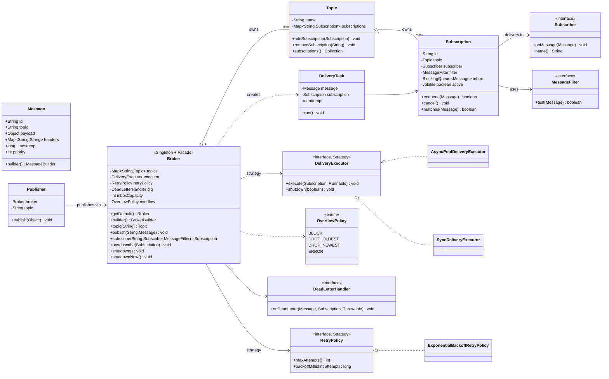
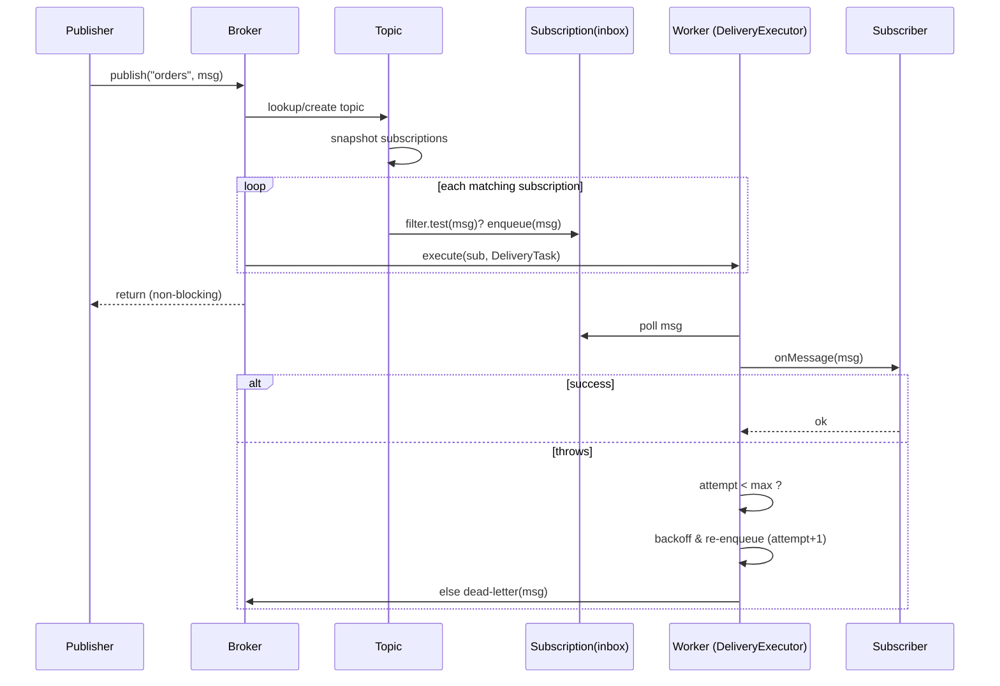

# LLD Design Document — Pub-Sub System (In-Process Message Broker)

> **Audience:** Senior Java engineer revising for an LLD / machine-coding round.
> **Goal of this doc:** Drive a clean, SOLID, pattern-justified design for an in-process Publish-Subscribe message broker, the kind you'd be asked to build in 45–60 minutes, plus the senior-level follow-ups (async delivery, retries, backpressure, filtering).

---

## PART A — Design Document

### 1. Problem statement

Design a **Publish-Subscribe (Pub-Sub) system**: a messaging middleware where **publishers** send messages to named **topics** without knowing who (if anyone) receives them, and **subscribers** register interest in topics and receive every message published to those topics. A central **broker** decouples the two sides — publishers and subscribers never reference each other directly.

> **Pub-Sub vs. point-to-point queue (inline term):** In a *queue*, each message is consumed by exactly one consumer (work distribution). In *pub-sub*, each message is **fan-out** delivered to *every* interested subscriber (broadcast). We are building pub-sub, but we'll note where the design supports queue-style "consumer groups" as an extension.

We want an **in-process / single-JVM** broker (library-style), not a distributed Kafka clone — but the design must be shaped so the distributed version is a natural extension, not a rewrite.

Core capabilities:
- Create / look up topics.
- Publishers publish messages to a topic.
- Subscribers subscribe / unsubscribe to a topic.
- Every subscriber of a topic receives every message published after it subscribed.
- Delivery should be **asynchronous** (publisher does not block on slow subscribers) and **at-least-once** with **retries**.
- Thread-safe under many concurrent publishers and subscribers.

---

### 2. Clarifying / requirements questions to ask first

A real round starts here. I'd ask the interviewer (and state my default if they defer):

**Functional scope**
1. Is this **in-process** (single JVM, library) or **distributed** (network broker like Kafka/RabbitMQ)? → *Default: in-process; design for distribution as extension.*
2. Delivery semantics: **at-most-once**, **at-least-once**, or **exactly-once**? → *Default: at-least-once with retries (exactly-once is a known hard problem; out of scope).*
3. Is **ordering** required? Per-topic total order, per-partition order, or none? → *Default: best-effort per-topic order on the publish path; relaxed once delivery is concurrent.*
4. Should subscribers receive **messages published before they subscribed** (durable / replay) or only **future** messages (live / fan-out)? → *Default: only future messages; no replay (replay is an extension).*
5. **Fan-out only**, or also **consumer-group / queue** semantics (one message → one of N consumers)? → *Default: fan-out; consumer groups are an extension.*
6. Do we need **message filtering** (subscriber only wants a subset of a topic's messages)? → *Default: support optional predicate filter — it's cheap and a common follow-up.*
7. Synchronous (`push`) delivery to subscriber callbacks, or **pull** (subscriber polls)? → *Default: push via callback, executed on broker-managed worker threads.*

**Non-functional**
8. Expected throughput / number of topics / subscribers per topic? Affects threading model and data structures.
9. What happens when a subscriber is **slow** or its inbox fills — drop, block the publisher (backpressure), or buffer unbounded? → *Default: bounded per-subscriber queue + configurable overflow policy (block / drop-oldest / drop-newest).*
10. Latency vs. durability tradeoff — is losing a message on crash acceptable? → *Default: in-memory, may lose on crash (durability is an extension).*
11. Persistence required (survive restart)? → *Default: no.*

**Operational / lifecycle**
12. How are subscriber failures (exceptions in the callback) handled — retry, dead-letter, log-and-drop? → *Default: bounded retries, then dead-letter / log.*
13. Do we need graceful **shutdown** (drain in-flight messages)? → *Default: yes, `shutdown()` drains.*
14. Authentication / authorization on publish/subscribe? → *Default: out of scope.*

**Scope narrowing (what's OUT)**
- Network protocol, serialization, multi-node coordination, exactly-once, persistence, security → **out of scope** unless asked; addressed as extensions in §4.

---

### 3. Finalized requirements & assumptions

**Functional (in scope)**
- `Broker` is the central, single coordinator (one per JVM by default).
- Create-on-demand or explicit topic creation; look up by name.
- `publish(topicName, message)` — non-blocking from the publisher's perspective.
- `subscribe(topicName, subscriber, filter?)` returns a `Subscription` handle used to unsubscribe.
- Each subscriber of a topic receives every matching message published **after** it subscribed.
- **Asynchronous delivery**: a pool of worker threads delivers messages; publishers do not run subscriber code.
- **At-least-once** delivery with bounded **retries** and exponential-ish backoff; exhausted messages go to a **dead-letter** sink.
- Optional **per-subscription filter** (predicate on the message).
- **Backpressure**: bounded per-subscription inbox with a configurable `OverflowPolicy`.
- Thread-safe registry: concurrent subscribe/unsubscribe/publish.
- Graceful `shutdown()` that drains queued messages, and `shutdownNow()` that doesn't.

**Non-functional / assumptions**
- Single JVM, in-memory.
- Messages are immutable.
- Subscriber callbacks may be slow or throw; the broker must isolate the publisher and other subscribers from one slow/bad subscriber (**fault isolation**).
- Best-effort ordering: messages from a single publisher to a single subscription are delivered in publish order *as long as that subscription is processed by one worker*; we use **per-subscription single-threaded executors** to guarantee per-subscriber ordering (see §9).

---

### 4. Problem extensions / follow-up variations

Senior candidates win here. Each row: the follow-up and how *this* design absorbs it.

| # | Follow-up the interviewer adds | Design impact / how we absorb it |
|---|---|---|
| 1 | **Topic-based routing** (you basically have it) | Already core: `Broker` holds `Map<String, Topic>`; routing = topic lookup. Extend to **wildcard / hierarchical topics** (`orders.*`, `orders.#`) by replacing the flat map with a trie/matcher behind the same `Topic` lookup interface. |
| 2 | **Message filtering** (content-based routing) | Each `Subscription` carries a `Predicate<Message>` (Strategy). Broker evaluates filter *before* enqueueing to that subscriber's inbox. No change to publishers. |
| 3 | **Async delivery with worker pool** | Already core: per-subscription queue + worker threads. Tune pool size; swap `DeliveryExecutor` Strategy (sync, shared pool, per-subscriber thread). |
| 4 | **At-least-once + retries / dead-letter** | `RetryPolicy` (Strategy) governs max attempts + backoff. On callback exception, re-enqueue with attempt++; on exhaustion, route to `DeadLetterHandler`. |
| 5 | **Exactly-once / dedup** | Add idempotency: `Message` has a unique id; subscriber side keeps a seen-id set (or broker tracks acks). True exactly-once needs idempotent consumers + dedup window — note it's out of full scope. |
| 6 | **Ordering guarantees** | Use **one worker per subscription** (single-threaded executor) to preserve per-subscriber order. For cross-subscriber total order, you'd need a single dispatch thread (throughput tradeoff). For partition order → key-based routing (extension #9). |
| 7 | **Backpressure / slow consumer** | Bounded `BlockingQueue` per subscription + `OverflowPolicy` (BLOCK publisher, DROP_OLDEST, DROP_NEWEST, or signal publisher). |
| 8 | **Durable / replay / late subscribers** | `Topic` keeps a bounded ring-buffer log; new subscribers can request `replayFrom(offset)`. Moves us toward a Kafka-style **log**; subscriptions track an **offset**. |
| 9 | **Partitioning & consumer groups (queue semantics)** | Introduce `Partition` within a `Topic` (key → partition). A `ConsumerGroup` has N members; each partition assigned to exactly one member → message goes to one consumer (work queue) instead of all. Fan-out becomes a special case (group size 1 per logical subscriber). |
| 10 | **Distributed broker** | The interfaces (`Broker`, `Topic`, `Subscriber`) stay; implementations gain a network transport + serialization + replication. The in-process broker becomes one node. |
| 11 | **Acknowledgements / manual ack** | Subscriber returns an `Ack`/`Nack` (or calls `ack()`); broker only advances offset / stops retry on ack. Lets consumers control at-least-once. |
| 12 | **Priority messages** | Swap per-subscription `LinkedBlockingQueue` for a `PriorityBlockingQueue` keyed on `Message.priority`. |
| 13 | **Metrics / observability** | Decorator around `Subscriber` or a `BrokerListener` (Observer-on-the-broker) emitting publish/deliver/fail counters. |

---

### 5. Core entities, responsibilities & relationships

| Entity | Responsibility |
|---|---|
| **Message** | Immutable value object: id, topic, payload, headers, timestamp, optional key/priority. |
| **Topic** | Named channel. Holds its set of `Subscription`s. Knows how to fan-out a message to matching subscriptions. (Optionally a bounded log for replay.) |
| **Publisher** | Thin client; calls `broker.publish(topic, message)`. Holds no subscriber refs (decoupling). |
| **Subscriber** | Consumer-side callback interface: `onMessage(Message)`. May throw. |
| **Subscription** | Binding of (Subscriber + Topic + filter + inbox + offset/state). The unit the broker manages and the handle returned for `unsubscribe()`. The **Observer registration** record. |
| **Broker** | Central façade & coordinator (Singleton-ish). Owns topics, the delivery executor, retry/overflow policies, dead-letter handler, lifecycle (start/shutdown). |
| **DeliveryExecutor** (Strategy) | How/where delivery runs (sync, per-subscription thread, shared pool). |
| **RetryPolicy** (Strategy) | Attempt count + backoff between retries. |
| **OverflowPolicy** (Strategy/enum) | What to do when a subscription inbox is full. |
| **DeadLetterHandler** | Sink for messages that exhausted retries. |
| **MessageFilter** | `Predicate<Message>` chosen per subscription (Strategy). |

**Relationships (text UML)**

```
Broker  ◇──────>  Topic            (composition: broker owns topics)
Topic   ◇──────>  Subscription     (composition: topic owns its subscriptions)
Subscription ───> Subscriber       (association: holds the consumer callback)
Subscription ───> MessageFilter    (association: predicate, Strategy)
Subscription ◇──> BlockingQueue<Message>  (composition: the inbox / backpressure buffer)
Broker  ───────> DeliveryExecutor  (association, Strategy)
Broker  ───────> RetryPolicy       (association, Strategy)
Broker  ───────> DeadLetterHandler (association)
Publisher ─────> Broker            (association: publishes through broker)
Message            value object passed by reference, immutable
```

- `◇──>` = composition (owner controls lifecycle), `──>` = association.

---

### 6. Design patterns applied

For each: **where**, **why**, **rejected alternative**, **when NOT to use**.

#### Observer — *core pattern*
- **Where:** `Topic` is the *Subject*; `Subscription`/`Subscriber` are *Observers*. `publish` notifies all registered observers.
- **Why:** Pub-sub *is* Observer at scale — it's the canonical decoupling of "something happened" producers from "I care" consumers. Subscribers attach/detach at runtime; publishers stay ignorant of them.
- **Rejected alternative:** Direct method calls / callbacks wired by the publisher → tight coupling, publisher must know every subscriber, no runtime add/remove.
- **When NOT:** If there's exactly one, fixed consumer, Observer is overkill — just call it. Also, naive Observer notifies synchronously on the publisher thread; we deliberately *enhance* it with async delivery (below) because a slow observer must not stall the publisher.

#### Strategy — *delivery, retry, overflow, filtering*
- **Where:** `DeliveryExecutor` (sync vs async pool vs per-subscriber thread), `RetryPolicy` (fixed / exponential backoff), `OverflowPolicy` (block / drop), `MessageFilter` (per-subscription predicate).
- **Why:** These are *policies that vary independently* of the core fan-out. Strategy lets us swap them per-broker or per-subscription without touching `Broker`/`Topic` (Open-Closed).
- **Rejected alternative:** `if/else`/`switch` on a config flag inside the broker → violates OCP, bloats the broker, hard to test each policy in isolation.
- **When NOT:** If you'll only ever have one delivery mode, a Strategy interface is premature abstraction. We justify it because the *explicit follow-ups* (async, retries, backpressure) are all policy variations.

#### Singleton — *the broker (with a caveat)*
- **Where:** A default process-wide `Broker` instance (`Broker.getDefault()`), since a pub-sub bus is usually a shared, single coordination point per process.
- **Why:** One registry of topics/subscriptions; avoids accidental multiple disconnected buses.
- **Rejected alternative:** Plain static methods → not mockable, can't have a second isolated broker for tests. So I make it a **lazily-initialized, thread-safe Singleton** *that is also normally constructable* — i.e., Singleton for convenience, **dependency injection** for testability. This is the senior nuance: "Singleton, but I'd inject it, not hard-depend on the global."
- **When NOT:** In a DI-heavy codebase, prefer container-managed single instance over a hand-rolled Singleton (hidden global state, test pollution, hard to parameterize). I'd flag this tradeoff aloud.

#### Builder — *Message and Broker config*
- **Where:** `Message.builder()` and `Broker.builder()` (set executor, retry, overflow, queue capacity).
- **Why:** Many optional fields (headers, key, priority; broker policies). Builder gives readable, immutable construction without telescoping constructors.
- **Rejected alternative:** Telescoping constructors / setters on a mutable object → unreadable, breaks immutability of `Message`.
- **When NOT:** For 1–2 fields, a constructor is clearer.

#### Factory (method) — *Topic creation*
- **Where:** `broker.topic(name)` get-or-create; internal `Subscription` creation.
- **Why:** Centralizes construction (interning topics by name, wiring inbox + filter + executor) so callers don't assemble parts.
- **Rejected alternative:** `new Topic(...)` scattered at call sites → duplicated wiring, risk of duplicate topics for the same name.

#### Command / Runnable wrapping — *delivery task*
- **Where:** Each delivery attempt is a `DeliveryTask` (a `Runnable`) submitted to the executor, carrying message + subscription + attempt count.
- **Why:** Encapsulates "deliver this message to this subscriber, with retry bookkeeping" as a first-class, re-submittable unit → enables retries (just re-submit) and async hand-off.
- **Rejected alternative:** Inline lambdas with captured retry counters → harder to re-enqueue and reason about.

#### (Optional) Decorator — *cross-cutting subscriber concerns*
- **Where:** Wrap a `Subscriber` with a `LoggingSubscriber` / `MetricsSubscriber`.
- **Why:** Add logging/metrics/dedup without changing the consumer. Mentioned as extension, not central.

**SOLID in play**
- **S (Single Responsibility):** `Topic` routes, `Subscription` buffers+state, `Broker` coordinates, policies are separate classes. Each has one reason to change.
- **O (Open-Closed):** New delivery/retry/overflow/filter behavior via new Strategy implementations — broker untouched.
- **L (Liskov):** Any `DeliveryExecutor`/`RetryPolicy`/`Subscriber` impl is substitutable; the broker depends only on the contracts.
- **I (Interface Segregation):** `Subscriber` exposes only `onMessage`; `Publisher` only publishes. No fat "client" interface.
- **D (Dependency Inversion):** `Broker` depends on `DeliveryExecutor`, `RetryPolicy`, `MessageFilter` *abstractions*, injected via Builder — not concretes.

---

### 7. Class diagram



**Key public APIs**
```java
Broker broker = Broker.builder()
        .inboxCapacity(1000)
        .overflowPolicy(OverflowPolicy.BLOCK)
        .retryPolicy(new ExponentialBackoffRetryPolicy(3, 50))
        .deliveryExecutor(new AsyncPoolDeliveryExecutor(4))
        .deadLetterHandler((m, s, t) -> log(...))
        .build();

Subscription sub = broker.subscribe("orders", msg -> handle(msg),
                                    msg -> "PAID".equals(msg.headers().get("status")));
broker.publish("orders", Message.builder().topic("orders").payload(order).build());
broker.unsubscribe(sub);   // or sub.cancel();
broker.shutdown();
```

---

### 8. Key flows

**Publish flow (steps)**
1. `Publisher.publish(payload)` → `broker.publish("orders", msg)`.
2. Broker looks up (or creates) the `Topic`.
3. Topic iterates its `Subscription`s (snapshot, so concurrent unsubscribe is safe).
4. For each subscription whose `filter.test(msg)` is true → `subscription.enqueue(msg)` honoring `OverflowPolicy`.
5. If the subscription's worker isn't already draining, broker submits a `DeliveryTask` to the `DeliveryExecutor` (routed to that subscription's single-threaded lane to preserve order).
6. `publish` returns immediately (async); publisher never runs subscriber code.

**Delivery + retry flow (steps)**
1. `DeliveryTask.run()` polls the subscription inbox, calls `subscriber.onMessage(msg)`.
2. Success → continue to next queued message.
3. Exception → if `attempt < retryPolicy.maxAttempts()`, schedule re-delivery after `backoffMillis(attempt)` (re-submit task with `attempt+1`).
4. Attempts exhausted → `deadLetterHandler.onDeadLetter(msg, sub, error)`; move on.

**Sequence diagram**


---

### 9. Concurrency, edge cases & extensibility

**Thread-safety**
- **Topic registry:** `ConcurrentHashMap<String,Topic>` + `computeIfAbsent` for atomic get-or-create.
- **Subscription registry per topic:** `ConcurrentHashMap<String,Subscription>`; iteration uses its weakly-consistent view (no `ConcurrentModificationException`) — safe to subscribe/unsubscribe during publish.
- **Per-subscription inbox:** `BlockingQueue` (bounded) — thread-safe producer/consumer hand-off; gives natural backpressure.
- **Ordering:** Each subscription is processed by a **single worker lane** (single-threaded executor keyed by subscription id, or a per-subscription `running` CAS flag that ensures only one thread drains its inbox at a time). This guarantees **per-subscriber FIFO** without locking the whole broker. Cross-subscriber order is *not* guaranteed (acceptable for pub-sub).
- **`active` flag** on subscription is `volatile`; after `cancel()`, the worker stops delivering and the inbox is dropped.
- **Lifecycle:** `shutdown()` stops accepting new publishes, lets workers drain inboxes, then stops the pool; `shutdownNow()` interrupts immediately.
- **Singleton:** lazy holder idiom (initialization-on-demand holder class) → thread-safe without synchronization on the hot path.

**Edge cases**
- Publish to a topic with **no subscribers** → no-op (message dropped; or logged if a `BrokerListener` is set). For replay, would be retained in the topic log.
- **Subscriber throws every time** → retried up to max, then dead-lettered; other subscribers unaffected (fault isolation).
- **Slow subscriber** → its inbox fills; `OverflowPolicy` decides (block publisher / drop). One slow subscriber must not block others (separate inboxes + lanes).
- **Unsubscribe during delivery** → `active=false`; worker checks before each `onMessage`; in-flight message may still be delivered once (at-least-once tolerates this).
- **Duplicate subscribe** (same subscriber, same topic) → allowed as distinct subscriptions, or de-duplicated by subscriber id — decided by requirement; default: distinct subscriptions, distinct handles.
- **Publish after shutdown** → reject with `IllegalStateException`.
- **Null message / unknown topic on publish** → create topic on demand (or reject if topics must be pre-declared — clarify).

**How the design absorbs §4 extensions**
- Filtering, retry, overflow, delivery model are all **Strategy** swaps — no broker change.
- Wildcard topics → swap the topic lookup structure behind `broker.topic(...)`.
- Replay / late subscribers → add a bounded log to `Topic` + an `offset` to `Subscription`.
- Consumer groups → add `Partition` + group assignment; fan-out vs. one-of-N becomes a routing decision in `Topic`.
- Distributed → same interfaces, networked implementations.

---

### 10. Likely interview questions

1. **Why Observer for pub-sub, and how is it different from a plain callback list?**
   Observer decouples subject (topic) from observers (subscribers) and supports runtime attach/detach and broadcast fan-out. A plain callback list wired by the publisher couples the publisher to consumers and can't be reconfigured at runtime. Pub-sub is Observer plus a *broker* indirection and *async* delivery.

2. **How do you keep a slow subscriber from blocking publishers and other subscribers?**
   Each subscription has its **own bounded inbox** and its **own worker lane**. Publishers enqueue and return; a slow subscriber only backs up *its own* queue. Overflow on that queue is handled per `OverflowPolicy` (block only that path, or drop). Other subscribers' lanes are unaffected.

3. **How do you guarantee per-subscriber ordering with a thread pool?**
   Route all of a subscription's deliveries to a **single lane** — either a per-subscription single-threaded executor, or a CAS `running` flag so only one pool thread drains a given inbox at a time. FIFO inbox + single drainer ⇒ per-subscriber order. We accept no cross-subscriber total order (would need a single global dispatch thread, killing throughput).

4. **At-least-once vs exactly-once — what did you implement and why not exactly-once?**
   At-least-once: retry on failure, dead-letter on exhaustion; a redelivery can cause duplicates. Exactly-once requires idempotent consumers + a dedup window + coordinated acks/offsets (or transactional outbox). It's expensive and often better solved by making the consumer idempotent — so I keep it out of core and note the path.

5. **(Senior) Justify Singleton for the broker — isn't that an anti-pattern?**
   A process usually wants one shared bus, so a *default* Singleton is convenient. The anti-pattern is *hard-coding* the global. I expose `Broker.getDefault()` for convenience **and** a public Builder/constructor so it can be injected and isolated in tests. That keeps testability and avoids hidden global state — the tradeoff I'd state explicitly.

6. **(Senior) Where exactly is Strategy, and what did you reject?**
   Delivery (sync/async/per-thread), retry (fixed/exponential), overflow (block/drop), filter (predicate) are independently varying policies. Strategy keeps `Broker` Open-Closed. Rejected `if/else` on config flags inside the broker — it violates OCP, bloats one class, and makes each policy hard to unit-test.

7. **How would you add content-based filtering without touching publishers?**
   Each `Subscription` holds a `Predicate<Message>` evaluated in `Topic.fanout` before enqueue. Publishers are unaware. For server-side efficiency at scale, push filters into the routing index (e.g., per-attribute subscription trees).

8. **How do you handle backpressure precisely?**
   Bounded `BlockingQueue` per subscription. `OverflowPolicy.BLOCK` makes the publishing thread `put()` and wait (true backpressure); `DROP_OLDEST/NEWEST` keep publishers fast at the cost of loss; `ERROR` surfaces it. The policy is per-broker (or extendable per-subscription).

9. **(Senior) How does this evolve into a Kafka-like log / distributed broker without a rewrite?**
   Keep the interfaces (`Broker`, `Topic`, `Subscriber`, `Subscription`). Add a bounded **log** + **offsets** to `Topic`/`Subscription` for replay; add **partitions** + **consumer groups** for scale-out; replace the in-memory executor with a **network transport + replication**. Each is an additive implementation behind existing contracts — the in-process broker is just one node.

10. **What happens on `unsubscribe` while a message is mid-delivery?**
    `active` goes `false` (volatile); the worker checks `active` before each `onMessage`. An already-started delivery may complete (at-least-once tolerates the extra delivery). The inbox is then released for GC. We do not interrupt a running callback (could corrupt consumer state).

**Deep-probe follow-ups**
- *"Your single-threaded-per-subscription lane — what if a topic has 100k subscribers?"* → Don't allocate 100k threads; use a bounded pool with **per-subscription serialization keys** (e.g., a `Map<subId, Executor>` over a shared pool, or a striped/serial executor) so ordering holds without thread-per-subscriber. Discuss the memory of 100k inboxes and consider shared/segmented buffers.
- *"How do you test the retry/backoff deterministically?"* → Inject a fake `RetryPolicy` and a controllable clock / direct (synchronous) `DeliveryExecutor`; assert attempt counts and dead-letter routing without real sleeps.
- *"Two publishers publish to the same topic concurrently — what ordering do subscribers see?"* → Per-publisher order is preserved into the inbox only if a single enqueue path is used per subscription; across publishers, interleaving is allowed. If global order matters, introduce a sequencer/partition key.

---

## PART C — Cheat-sheet & self-test

**Patterns used (recap)**
- **Observer (core):** `Topic` = Subject, `Subscriber`/`Subscription` = Observers; runtime attach/detach + fan-out.
- **Strategy:** `DeliveryExecutor` (sync/async pool), `RetryPolicy` (exponential backoff), `OverflowPolicy` (block/drop), `MessageFilter` (predicate). Keeps `Broker` Open-Closed.
- **Singleton + DI:** `Broker.getDefault()` for the shared bus, but injectable/constructable for tests (avoid hidden global state).
- **Builder:** immutable `Message` and configurable `Broker`.
- **Factory method:** `broker.topic(name)` get-or-create; internal subscription wiring.
- **Command (Runnable):** `DeliveryTask` encapsulates a retriable delivery unit.
- **Decorator (optional):** logging/metrics around a `Subscriber`.

**Key design decisions (recap)**
- Async delivery: publishers never run subscriber code; per-subscription bounded inbox + worker lane.
- **Per-subscriber FIFO** via single drainer per subscription (CAS `running` flag over a shared pool — not thread-per-subscriber).
- **At-least-once** with bounded retries + backoff → **dead-letter** on exhaustion.
- **Fault isolation**: one slow/throwing subscriber never blocks publishers or other subscribers.
- Thread-safe registries via `ConcurrentHashMap` + weakly-consistent iteration; `volatile active` for cancel.
- Extensions (wildcards, replay/offsets, consumer groups, distribution) are additive behind existing contracts.

**5 self-test questions (no answers)**
1. Where exactly does Observer end and Strategy begin in this design, and why isn't the broker a god-object?
2. If a topic has 100k subscribers, what breaks in the naive thread-per-subscription model and how do you fix it while keeping per-subscriber order?
3. Sketch the state changes when `unsubscribe()` races with an in-flight `onMessage()` — what is the guaranteed and the best-effort behavior?
4. How would you add message replay for late subscribers without changing the `Subscriber` interface or any publisher code?
5. Justify or attack the Singleton broker in a Spring-managed service; what would you do instead and what do you lose?

---

