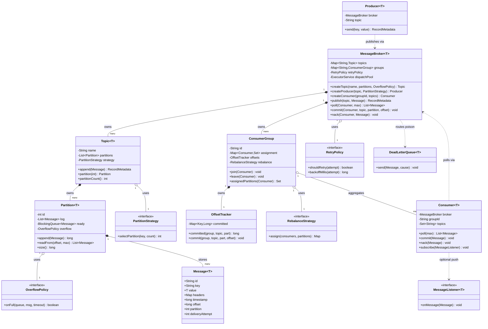

# LLD: In-Memory Message Queue

> Staff-level design + machine-coding revision artifact.
> A single-process, in-memory message broker modeled on Kafka/RabbitMQ semantics:
> topics, partitions, producers, consumers, consumer groups, offsets,
> acknowledgements, at-least-once delivery, retries, DLQ, ordering and backpressure.

---

## PART A — Design Document

### 1. Problem statement

Design an **in-memory message queue** (message broker) that lives inside a single JVM process and lets multiple **producers** publish **messages** and multiple **consumers** read them, reliably and concurrently.

The system must:

- Accept messages from producers and store them durably *in memory* until consumed.
- Let many consumers read the same stream of messages **independently** (pub/sub fan-out) while also letting a set of consumers **share** the work (queue/competing-consumer semantics).
- Track *how far each consumer has read* (an **offset** — a per-reader bookmark/cursor into the log).
- Provide **at-least-once delivery**: a message is redelivered until the consumer explicitly **acknowledges** ( acks) it.
- Support **retries** with a bounded retry count and a **Dead Letter Queue** (DLQ — a side queue where messages that keep failing are parked so they don't block the stream).
- Provide **ordering guarantees** within a partition.
- Be **thread-safe** and apply **backpressure** (slow down or block producers when the buffer is full) instead of growing without bound.

This is the classic broker LLD: think "a tiny Kafka you can hold in your head."

---

### 2. Clarifying / requirements questions to ask first

Lead with these in the room *before* drawing a single class. Group them so the interviewer can steer scope.

**Functional scope**

1. Is this **point-to-point** (one message consumed by exactly one consumer — a work queue) or **publish/subscribe** (every subscriber sees every message), or do we need **both** (Kafka-style consumer groups give you both)?
2. Do we need the concept of **topics**, or a single global queue? Do topics have **partitions** (sub-streams that enable parallelism + ordering)?
3. Should consumers **pull** (poll) or should the broker **push** (callback/listener)? Or both?
4. What **delivery guarantee** is required: at-most-once, **at-least-once**, or exactly-once? (Exactly-once in a single process is feasible with idempotent dedup; across a network it is famously hard.)
5. Are **explicit acknowledgements** required, or is reading == consuming (auto-ack)?
6. Do we need **offset tracking** so a consumer can resume where it left off, replay from the beginning, or seek to an arbitrary position?
7. On failure, do we need **retries** with a max attempt count and a **Dead Letter Queue**?
8. Are **ordering guarantees** required? Global order is expensive; per-key / per-partition order is the usual compromise.
9. Do we need **message TTL / expiry**, **priorities**, or **delayed/scheduled** delivery?

**Non-functional / constraints**

10. **In-memory only**, or must it survive restarts (persistence/WAL)? (Stated: in-memory.)
11. Expected **throughput** and **message size**? Affects whether we copy payloads, pool buffers, etc.
12. How many concurrent **producers / consumers**? Drives lock granularity.
13. What is the **bounded capacity** policy when full: **block** the producer (backpressure), **drop** newest/oldest, or **reject** with an error?
14. **Latency** target — is blocking acceptable, or must publish always be non-blocking?
15. Single JVM (so concurrency = threads, not a distributed cluster), correct?

**Scope-narrowing / out-of-scope**

16. Out of scope: network protocol/serialization, persistence to disk, cross-node replication, exactly-once across the wire, auth/ACLs, admin UI — confirm?
17. Is **fairness** across consumers in a group important, or is best-effort load distribution fine?

> **Assumed answers for this document** are captured in §3. We design the richer Kafka-style model (topics + partitions + consumer groups + offsets + acks + retries + DLQ + backpressure) because it *contains* the simpler queue as a special case and is what senior interviews probe.

---

### 3. Finalized requirements & assumptions

**In scope (what we build):**

- **Topics**, each split into a fixed number of **partitions**. A partition is an append-only, ordered log of messages.
- **Producers** publish a `Message` to a topic; a **PartitionStrategy** decides the target partition (key-hash, round-robin, or explicit).
- **Consumers** belong to a **ConsumerGroup**. Within a group, each partition is assigned to exactly one consumer (competing consumers / work sharing). Different groups each get the **full** stream (fan-out pub/sub).
- **OffsetTracker** stores, per `(group, topic, partition)`, the next offset to read and the last committed offset.
- **At-least-once delivery**: consumer polls a batch, processes, then **commits** (acks). Uncommitted messages are redelivered after a visibility timeout / on restart.
- **Retries + DLQ**: a per-message delivery attempt counter; after `maxRetries`, the message is routed to a `__dlq` topic.
- **Ordering**: total order *within a partition*; no cross-partition order. Keyed messages with the same key land on the same partition → per-key ordering.
- **Backpressure**: each partition has a bounded buffer; producers **block** (configurable timeout) when full — implemented with a `BlockingQueue`.
- **Concurrency**: multiple producer and consumer threads in one JVM; everything thread-safe.

**Assumptions:**

- Single process; "durability" means "kept in memory until consumed/expired," not crash-safe.
- Partition count per topic is fixed at creation (rebalancing across a changing partition count is out of scope, though group rebalancing across consumers is in scope).
- Message payload is an opaque `byte[]` / generic `T`; serialization is the caller's concern.
- Clock is `System.nanoTime`/`currentTimeMillis`; no distributed clock issues.

---

### 4. Problem extensions / follow-up variations

These are the add-ons interviewers tack on. For each: the change and its **design impact**.

| # | Extension | Design impact |
|---|-----------|---------------|
| 1 | **Multiple consumer groups (fan-out)** | Offsets keyed by `(group, topic, partition)`; each group reads the same log independently. No change to storage — only to offset bookkeeping. Already designed in. |
| 2 | **Competing consumers within a group** | Partition→consumer **assignment** map; a `RebalanceStrategy` (Strategy pattern) distributes partitions when consumers join/leave. |
| 3 | **At-least-once + acks** | Add per-record `deliveryAttempt`, an "in-flight / unacked" set with a **visibility timeout**; redeliver on timeout or `nack`. |
| 4 | **Exactly-once (effectively)** | Add an idempotency key + a dedup set per consumer; commit offset and side-effect atomically (here, in one lock). |
| 5 | **Retries + DLQ** | `RetryPolicy` (Strategy) decides delay/backoff; after N attempts route to a DLQ topic. Pluggable without touching the broker core. |
| 6 | **Ordering guarantees** | Per-partition single-consumer assignment preserves order; keyed partitioning preserves per-key order. Global order ⇒ 1 partition (kills parallelism) — call out the tradeoff. |
| 7 | **Priority messages** | Swap partition buffer from FIFO `LinkedBlockingQueue` to `PriorityBlockingQueue` + `Comparator` (Strategy). Note: priority breaks strict FIFO ordering. |
| 8 | **Delayed / scheduled delivery** | A `DelayQueue` or time-wheel holding messages until `visibleAt`; consumers only see ready messages. |
| 9 | **Message TTL / expiry** | Per-message `expiresAt`; a sweeper thread or lazy check on poll drops expired messages (optionally to DLQ). |
| 10 | **Backpressure policies** | Strategy over the bound: `BLOCK`, `DROP_NEWEST`, `DROP_OLDEST`, `REJECT`. Encapsulate in an `OverflowPolicy`. |
| 11 | **Push vs pull delivery** | Add an **Observer/listener** API (`MessageListener`) layered on top of pull; broker dispatches to a thread pool. Both models coexist. |
| 12 | **Persistence / WAL** | Introduce a `LogStore` interface; in-memory impl today, file/WAL impl later. **Open/Closed** — broker depends on the interface. |
| 13 | **Metrics / monitoring** | Decorator around `Producer`/`Consumer`, or an event bus the broker publishes to. |

The recurring senior move: each extension slots behind an **interface/Strategy** so the broker core never changes.

---

### 5. Core entities, responsibilities & relationships

| Entity | Responsibility |
|--------|----------------|
| `Message<T>` | Immutable record: id, key, value, headers, timestamp, plus broker-assigned `offset`, `partition`, `deliveryAttempt`. |
| `Topic<T>` | Named collection of `Partition`s; routes a publish to a partition via `PartitionStrategy`. |
| `Partition<T>` | Append-only ordered log + a bounded buffer; thread-safe append/read by offset; the unit of ordering and parallelism. |
| `MessageBroker<T>` | Facade/registry: create topics, register producers/consumers/groups, orchestrate publish, poll, commit, retry, DLQ. |
| `Producer<T>` | Client handle that publishes to a topic through the broker; applies the partition strategy. |
| `Consumer<T>` | Client handle bound to a group; polls assigned partitions, processes, commits/nacks. |
| `ConsumerGroup` | Set of consumers sharing the workload; owns partition assignment + its own offsets. |
| `OffsetTracker` | Per `(group, topic, partition)` committed + next offsets; durable bookmark. |
| `PartitionStrategy` | **Strategy**: pick partition (keyHash / roundRobin / explicit). |
| `RebalanceStrategy` | **Strategy**: assign partitions to consumers in a group. |
| `RetryPolicy` | **Strategy**: should-retry? + backoff delay; feeds DLQ decision. |
| `OverflowPolicy` | **Strategy**: what to do when a partition buffer is full (backpressure). |
| `MessageListener<T>` | **Observer**: optional push callback for subscribed consumers. |
| `DeadLetterQueue<T>` | Special topic for poison messages. |

**Relationships**

- `MessageBroker` **owns (composition)** `Topic`s and `ConsumerGroup`s.
- `Topic` **owns (composition)** `Partition`s.
- `ConsumerGroup` **owns** an `OffsetTracker` and an assignment map; **aggregates** `Consumer`s (consumers can be created/removed).
- `Producer`/`Consumer` **reference (association)** the `MessageBroker`.
- `MessageBroker` **uses (dependency)** the four Strategy interfaces and the listener.

---

### 6. Design patterns applied

For each: where, why, the rejected alternative, and when *not* to use it.

**1. Strategy — partitioning, rebalancing, retry, overflow, ordering/priority.**
- *Where:* `PartitionStrategy`, `RebalanceStrategy`, `RetryPolicy`, `OverflowPolicy`, partition `Comparator`.
- *Why:* These are exactly the axes interviewers mutate (§4). Pulling each behavior behind an interface keeps the broker **Open/Closed** — add a `PriorityPartitionStrategy` without editing `Topic`.
- *Rejected:* `enum` + `switch` inside the broker. Simpler for 2 fixed options, but every new policy edits the core (OCP violation) and bloats one class.
- *When not:* if the policy will never vary (e.g., exactly one partitioning rule forever), a plain method is enough — don't add an interface for a single implementation.

**2. Producer–Consumer (concurrency pattern) over a `BlockingQueue`.**
- *Where:* each `Partition` holds a bounded `BlockingQueue`; producers `put` (block when full), consumers `poll`.
- *Why:* it *is* the problem. The blocking queue gives thread-safe handoff **and** backpressure for free, decoupling producer and consumer speeds.
- *Rejected:* hand-rolled `wait`/`notify` on an `ArrayList`. Error-prone (lost wakeups, missed signals); `java.util.concurrent` is correct and audited.
- *When not:* if you need offset replay / random access into the log, a pure `BlockingQueue` isn't enough — that's why we *also* keep an indexed append-only list and use the queue only for "ready to deliver" buffering / signaling.

**3. Facade — `MessageBroker`.**
- *Where:* single entry point for create-topic / publish / poll / commit / subscribe.
- *Why:* hides partitions, offset math, assignment, retries from clients; producers/consumers stay thin.
- *Rejected:* clients touching `Partition`/`OffsetTracker` directly — leaks internals, breaks encapsulation, makes thread-safety the client's problem.
- *When not:* trivial systems where the broker has one method; the indirection isn't worth it.

**4. Observer — push delivery via `MessageListener`.**
- *Where:* a consumer may `subscribe(listener)`; the broker pushes ready messages to a dispatch thread pool.
- *Why:* supports event-driven consumers without forcing a poll loop; decouples broker from consumer logic.
- *Rejected:* every consumer spins its own polling thread. Fine, but wastes threads and centralizes nothing; Observer lets the broker batch/dispatch.
- *When not:* if all consumers genuinely want to control their own poll cadence/batch size, pull-only is simpler — keep Observer optional.

**5. Factory (method) — `MessageBroker.createTopic`, `createProducer`, `createConsumer`.**
- *Why:* construction wires strategies, registers in registries, and returns ready handles — clients never `new` internal types.
- *Rejected:* public constructors; would let clients build half-initialized, unregistered objects.

**6. Singleton-ish registry (scoped, not global) — the broker instance is the registry.**
- *Why:* one authority for topics/groups/offsets within a process. We deliberately **avoid** a static global Singleton (testability, multiple brokers in tests) — it's a single shared instance passed by reference, the safer "ambient context via DI" form.

**7. Immutable Value Object — `Message`.**
- *Why:* shared across threads; immutability removes data races on the payload and makes redelivery safe (no torn reads).

**SOLID in play**

- **S**RP: `OffsetTracker` only tracks offsets; `Partition` only stores/serves a log; `Producer` only publishes. Each class has one reason to change.
- **O**CP: new partitioning/retry/overflow strategies add classes, never edit the broker.
- **L**SP: every `PartitionStrategy` is substitutable; the broker treats them uniformly.
- **I**SP: small focused interfaces (`PartitionStrategy`, `RetryPolicy`, `MessageListener`) — no fat "Strategy" god-interface.
- **D**IP: `MessageBroker` depends on strategy **interfaces**, not concrete classes; `LogStore` interface keeps persistence pluggable.

---

### 7. Class diagram



**Text UML (relationships)**

```
MessageBroker ◆── Topic            (composition: broker owns topics)
MessageBroker ◆── ConsumerGroup    (composition)
MessageBroker ──> RetryPolicy      (uses / dependency)
Topic         ◆── Partition        (composition)
Topic         ──> PartitionStrategy(uses)
Partition     ◆── Message          (composition: log)
Partition     ──> OverflowPolicy   (uses)
ConsumerGroup ◆── OffsetTracker    (composition)
ConsumerGroup ──> RebalanceStrategy(uses)
ConsumerGroup ◇── Consumer         (aggregation: consumers join/leave)
Producer      ──> MessageBroker    (association)
Consumer      ──> MessageBroker    (association)
Consumer      ──> MessageListener  (optional Observer)
```

**Key public APIs**

```java
// Broker (Facade + Factory)
Topic<T>        createTopic(String name, int partitions, OverflowPolicy overflow);
Producer<T>     createProducer(String topic, PartitionStrategy strategy);
Consumer<T>     createConsumer(String groupId, Set<String> topics);
RecordMetadata  publish(String topic, Message<T> msg);     // applies backpressure
List<Message<T>> poll(Consumer<T> c, int max);             // at-least-once
void            commit(Consumer<T> c, String topic, int partition, long offset);
void            nack(Consumer<T> c, Message<T> m);          // triggers retry/DLQ

// Producer / Consumer
RecordMetadata  Producer.send(String key, T value);
List<Message<T>> Consumer.poll(int max);
void            Consumer.commit(Message<T> m);
void            Consumer.subscribe(MessageListener<T> l);   // push mode
```

---

### 8. Key flows

**Publish (with backpressure)**

1. `Producer.send(key, value)` → `broker.publish(topic, msg)`.
2. `Topic` asks `PartitionStrategy.selectPartition(key, count)` → partition id.
3. `Partition.append(msg)`: assign next offset under partition lock, append to indexed log, then `ready.put(msg)` (or apply `OverflowPolicy` if full → **block / drop / reject**).
4. Return `RecordMetadata{partition, offset}`.

**Poll → process → commit (at-least-once)**

1. `Consumer.poll(max)` → broker finds the partitions **assigned** to this consumer in its group.
2. For each assigned partition, read from `OffsetTracker.committed(group, topic, part)` forward, mark records **in-flight** with a visibility deadline.
3. Consumer processes the batch.
4. On success → `commit(msg)`: advance committed offset; drop in-flight marks.
5. On failure → `nack(msg)`: `RetryPolicy.shouldRetry(attempt)`? If yes, re-enqueue after backoff with `deliveryAttempt+1`; if no, send to **DLQ**.
6. If neither ack nor nack before visibility timeout → redeliver (at-least-once).

```mermaid
sequenceDiagram
    participant P as Producer
    participant B as Broker
    participant T as Topic
    participant Pt as Partition
    participant C as Consumer
    participant D as DLQ
    P->>B: publish(topic, msg)
    B->>T: append(msg)
    T->>T: strategy.selectPartition(key)
    T->>Pt: append(msg)
    Pt->>Pt: offset=next++; log.add; ready.put (backpressure)
    Pt-->>P: RecordMetadata{partition, offset}
    C->>B: poll(max)
    B->>Pt: readFrom(committedOffset)
    Pt-->>C: [messages] (marked in-flight)
    alt success
        C->>B: commit(offset)
        B->>B: offsetTracker.commit
    else failure
        C->>B: nack(msg)
        B->>B: retryPolicy.shouldRetry?
        alt retry
            B->>Pt: re-enqueue (attempt+1, backoff)
        else exhausted
            B->>D: send(msg, cause)
        end
    end
```

**Rebalance (consumer joins/leaves group)**

1. `ConsumerGroup.join(consumer)` / `leave(consumer)`.
2. `RebalanceStrategy.assign(consumers, partitions)` recomputes the partition→consumer map (e.g., range or round-robin).
3. New assignments take effect on the next poll; committed offsets are preserved (they live in `OffsetTracker`, not on the consumer), so a reassigned partition resumes exactly where the last owner committed.

---

### 9. Concurrency, edge cases & extensibility

**Thread-safety**

- **Partition** is the concurrency unit. Each holds a bounded `LinkedBlockingQueue` (`ready`) for handoff/backpressure and an indexed log guarded by its own lock for offset assignment + replay reads. Offset assignment uses an `AtomicLong` or the partition lock so two producers never get the same offset.
- **OffsetTracker** uses a `ConcurrentHashMap` keyed by `(group,topic,partition)`; commits use `compute`/`merge` for atomic monotonic advance (never move an offset backwards).
- **Group assignment** map is copy-on-write / guarded so a rebalance doesn't tear a concurrent poll.
- **Message** is immutable → safe to share across threads; redelivery clones with `deliveryAttempt+1` rather than mutating.
- **Dispatch pool** (Observer push) is a bounded `ThreadPoolExecutor` so push consumers also get backpressure.
- We prefer `java.util.concurrent` primitives over `synchronized` blocks where contention matters, and keep lock scope to a single partition to maximize parallelism.

**Edge cases**

- **Buffer full** → `OverflowPolicy` (block w/ timeout, drop newest/oldest, reject).
- **Poison message** (always fails) → retries bounded by `RetryPolicy`, then DLQ; never blocks the partition forever.
- **Consumer crash mid-batch** → uncommitted in-flight messages redeliver after visibility timeout (at-least-once).
- **Duplicate delivery** → consumers must be idempotent; optional dedup set keyed by `message.id`.
- **Rebalance during in-flight** → reassigned partition resumes from last *committed* offset; in-flight-but-uncommitted records get redelivered (acceptable under at-least-once).
- **Empty poll** → returns empty list (or blocks up to a timeout) — no busy spin.
- **Offset out of range / topic deleted** → defined error, reset-to-earliest/latest policy.
- **Single-partition global ordering** → correct but serializes throughput; flagged as a tradeoff, not a default.

**Extensibility recap** — every §4 extension lands behind an existing seam: a Strategy (partition/retry/overflow/rebalance/priority), the `MessageListener` Observer (push), or the `LogStore` interface (persistence). The broker core stays closed for modification, open for extension.

---

### 10. Likely interview questions

**Q1. Why partitions instead of one big queue?**
Partitions are the unit of *parallelism and ordering*. One queue forces global order and a single consumer for ordering; partitions let N consumers work in parallel while preserving order *within* each partition (and per-key when you hash the key to a partition).

**Q2. How do you guarantee ordering?**
Within a partition the log is append-only and a partition is assigned to exactly one consumer per group, so order is preserved. Same-key messages hash to the same partition → per-key order. Global order needs a single partition, which sacrifices parallelism — a deliberate tradeoff.
*Follow-up: what breaks ordering?* Priority queues, parallel processing of one partition by multiple threads, and unbounded retries that reinsert messages later all break strict order.

**Q3. At-least-once vs at-most-once vs exactly-once — how do you implement each?**
At-most-once = auto-commit before processing (lose on crash). At-least-once = process then commit, redeliver on timeout (duplicates possible). Exactly-once (effectively) = at-least-once + idempotent consumers / dedup by `message.id`, committing offset and side-effect atomically. We implement at-least-once + optional dedup.
*Follow-up: why is true exactly-once hard?* Across a network you can't atomically "process + ack" without distributed transactions/idempotency; the ack can be lost after the side effect.

**Q4. How does backpressure work here?**
Each partition's `ready` buffer is a bounded `BlockingQueue`. When full, `OverflowPolicy` decides: `BLOCK` (producer waits — true backpressure), `DROP_OLDEST/NEWEST`, or `REJECT`. This bounds memory and slows fast producers to consumer speed without unbounded growth.
*Follow-up: block forever?* No — `put` uses an `offer(timeout)` so producers fail fast or surface an error rather than deadlock.

**Q5. Where is the Strategy pattern and why not an enum+switch?** *(senior signal)*
Partitioning, rebalancing, retry, overflow, and ordering are all Strategies. Enum+switch concentrates every policy in the broker and forces edits to the core for each new behavior (OCP violation). Strategy keeps the broker closed for modification; new policies are new classes. Enum is fine only when the set is truly fixed and tiny.

**Q6. Walk me through a consumer rebalance.** *(senior signal)*
On join/leave, `RebalanceStrategy.assign` recomputes partition→consumer. Because offsets live in `OffsetTracker` (not the consumer), a reassigned partition resumes from the last committed offset; uncommitted in-flight records redeliver. Range vs round-robin vs sticky assignment trade off balance vs movement.

**Q7. How do retries and the DLQ avoid head-of-line blocking?**
A nacked message increments `deliveryAttempt`; `RetryPolicy` applies backoff up to `maxRetries`, then routes to the DLQ topic. The partition keeps flowing because a poison message is parked in the DLQ rather than retried forever in place.

**Q8. What's your locking strategy and where's the contention?** *(senior signal)*
Lock at *partition* granularity so different partitions proceed in parallel; offsets in a `ConcurrentHashMap` with atomic monotonic commit; immutable `Message` removes payload races. The hot path is offset assignment per partition (`AtomicLong`) and the blocking-queue handoff — both lock-light.
*Follow-up: how to scale further?* More partitions, batch commits, lock-free ring buffers (Disruptor-style), or shard the broker.

**Q9. How would you add scheduled/delayed delivery without touching the broker core?**
Back the partition's ready buffer with a `DelayQueue` keyed on `visibleAt`, or add a time-wheel that releases messages when due. It's a swap of the buffer type behind the same `Partition` interface — Open/Closed.

**Q10. Push vs pull — which did you pick and why?**
Pull by default (consumer controls cadence/batch and gets natural backpressure). Push is layered as an optional `MessageListener` (Observer) dispatched on a bounded pool. Pull is the safe default; push is opt-in for event-driven consumers.

**Q11. How do you prevent two consumers in a group from consuming the same partition?** *(senior signal)*
The assignment map enforces partition→single-consumer within a group; poll only returns records for partitions assigned to that consumer. Across groups, the same partition is read independently (fan-out) with separate offsets.

---

## PART C — Cheat-sheet & self-test

**Patterns used**

- **Strategy** — partitioning, rebalancing, retry, overflow, priority/ordering (the variability axes).
- **Producer–Consumer** over bounded `BlockingQueue` — thread-safe handoff + backpressure.
- **Facade** — `MessageBroker` is the single client entry point.
- **Factory method** — broker creates topics/producers/consumers fully wired.
- **Observer** — optional `MessageListener` push delivery.
- **Immutable Value Object** — `Message` safe to share across threads.
- **DIP via interfaces** — `LogStore`/strategies keep core closed for modification.

**Key design decisions**

- Partition = unit of ordering + parallelism + locking.
- Offsets live in `OffsetTracker`, keyed `(group, topic, partition)` → fan-out + resumable + rebalance-safe.
- At-least-once = process→commit + visibility timeout redelivery; dedup optional for effectively-once.
- Retries bounded by `RetryPolicy`, then DLQ → no head-of-line blocking.
- Backpressure = bounded queue + `OverflowPolicy` (BLOCK/DROP/REJECT).
- Lock per partition; `ConcurrentHashMap` + `AtomicLong` for offsets; immutable messages.

**Self-test (no answers)**

1. Where exactly would per-key ordering break, and what minimal change preserves it under priority delivery?
2. A consumer crashes after processing but before committing — trace the message's fate under at-least-once, and what you'd add for effectively-once.
3. Two producers publish to the same partition concurrently — show that no two messages get the same offset, naming the primitive you rely on.
4. Sketch the `OverflowPolicy` implementations and the exact `BlockingQueue` call each uses (BLOCK vs DROP_OLDEST vs REJECT).
5. The interviewer adds disk persistence with crash recovery — which interface absorbs it, what must be flushed on publish vs on commit, and which patterns stay untouched?
