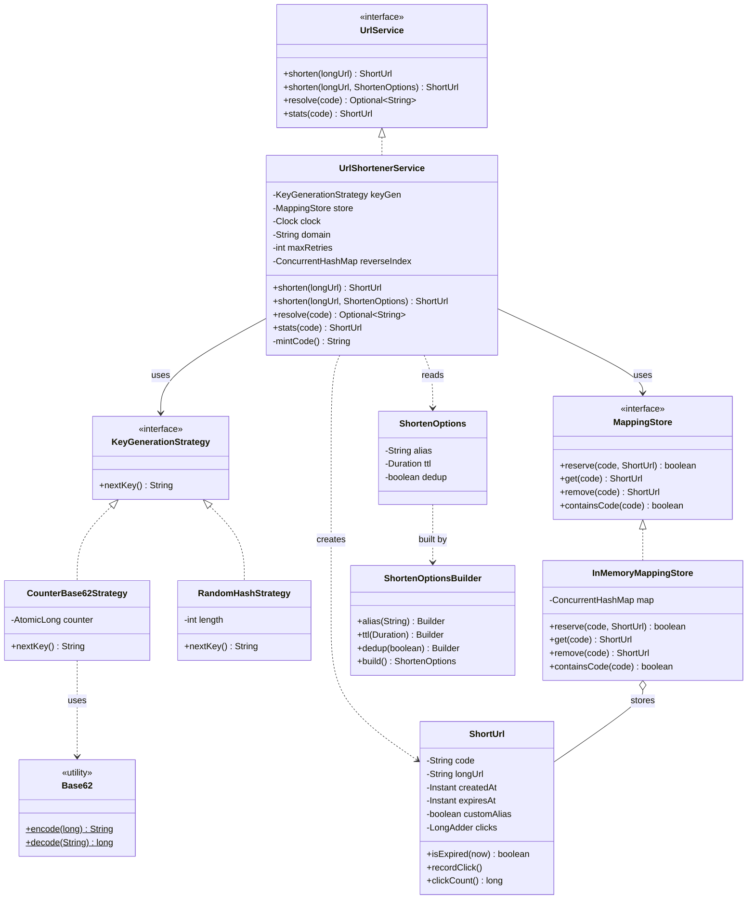
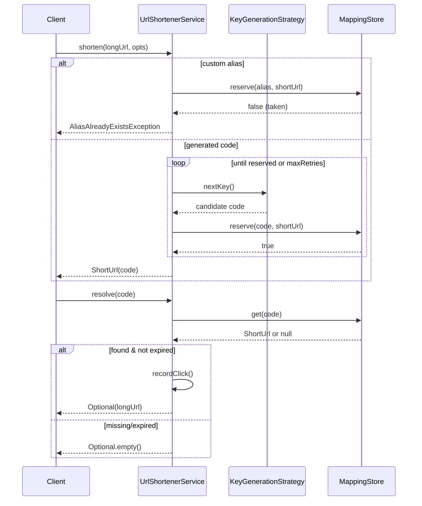

# URL Shortener — Low-Level Design (LLD)

> A staff-level design + machine-coding revision artifact. Read top-to-bottom before an interview, or jump to PART C for a 60-second recap.

---

## PART A — Design Document

### 1. Problem statement

Design the **object model and in-process service** for a URL Shortener (think TinyURL / bit.ly), but scoped to a **machine-coding / LLD round** — i.e., a clean, well-factored, thread-safe, in-memory service with pluggable strategies, *not* a distributed system design (no sharding diagrams, no Kafka).

Concretely, the service must:

- Take a **long URL** and return a **short URL** (e.g., `https://sho.rt/aB3xQ`).
- **Resolve** a short URL back to the original long URL (the "redirect" path).
- Support the realistic add-ons interviewers pile on: **custom aliases**, **expiry / TTL**, **collision handling**, **click analytics**, and a **pluggable key-generation strategy** (counter+Base62 vs. hash).
- Be **correct under concurrency** — many threads shortening and resolving at once.

The deliverable is the *application/domain layer*: the encoding strategies, the mapping store abstraction, the orchestrating service, and the entity (`ShortUrl`). The persistence layer is represented behind an interface so the same design works for an in-memory map today and a database tomorrow.

> **Adjacent term — "LLD / machine-coding round":** an interview where you write real, compilable, well-structured OO code (classes, interfaces, patterns) for a focused problem in ~45–90 minutes. The grader cares about clean abstractions, SOLID, correct edge-case handling, and pattern usage — not about scale numbers.

---

### 2. Clarifying / requirements questions to ask first

Lead with these. The single biggest senior signal is *not designing before scoping*.

**Functional scope**
1. Two core operations — `shorten(longUrl)` and `resolve(shortUrl)` (a.k.a. expand/redirect). Anything else (delete, update target, list-my-urls)?
2. Do we need **custom aliases** (user supplies the short code, e.g. `/my-promo`)? If two users request the same alias, do we reject or version it?
3. **Idempotency:** if the *same* long URL is shortened twice, do we return the *same* short code (dedup) or a *new* one each time? (Affects whether we keep a reverse index.)
4. **Expiry:** do links expire? By TTL (e.g., 24h), by absolute date, by click-count, or never? What happens on access after expiry — 404, or a specific "expired" response?
5. **Analytics:** do we count clicks? Just a total counter, or per-time-bucket / per-referrer / geo? (Changes whether a simple counter suffices or we need an event pipeline.)
6. Do we ever **reuse** codes after expiry/deletion, or are codes permanently burned?

**Non-functional / constraints**
7. **Scale & lifetime:** target QPS for shorten vs. resolve (resolve is usually 10–100× heavier)? Expected total number of URLs over the system lifetime? This drives the **code length** (how many Base62 chars).
8. **Latency:** resolve must be very fast (it's on the redirect hot path). Is shorten allowed to be slower?
9. **Persistence boundary:** is this purely in-memory for the interview, or must it survive restart (DB/cache)? I'll abstract storage behind an interface either way.
10. **Concurrency:** single process multi-threaded, or distributed across nodes? (Distributed changes ID generation — see §4/§9.)
11. **Short code charset & length:** Base62 `[a-zA-Z0-9]`? Any forbidden words / profanity filter? Case-sensitive?
12. **Security:** any auth, rate-limiting, or malicious-URL scanning required, or out of scope?

**Scope-narrowing (state my default if no answer)**
13. I'll assume: in-memory store behind a `MappingStore` interface; Base62 over a thread-safe counter as the default strategy (no collisions by construction), with a hash strategy available as an alternative; custom aliases + TTL expiry + a click counter as features; dedup of identical long URLs is **optional and configurable** (off by default, because dedup conflicts with per-link analytics/expiry). Confirm?

---

### 3. Finalized requirements & assumptions

**Functional**
- `shorten(longUrl)` → unique short code; `shorten(longUrl, opts)` where `opts` may carry a **custom alias** and/or a **TTL**.
- `resolve(shortCode)` → the long URL if present and not expired; otherwise a typed failure (exception/empty Optional). Resolving increments the click counter.
- `stats(shortCode)` → click count, creation time, expiry, alias flag.
- Pluggable **KeyGenerationStrategy**: `CounterBase62Strategy` (default, collision-free) and `RandomHashStrategy` (illustrates collision handling).

**Non-functional**
- **Thread-safe**: concurrent `shorten`/`resolve` must not corrupt state, double-issue a code, or lose clicks.
- **Fast resolve**: O(1) average lookup (hash map / `ConcurrentHashMap`).
- **Extensible**: new key strategy or storage backend = new class, no edits to the service (Open/Closed).

**Assumptions (defaults, stated and confirmable)**
- Single JVM, multi-threaded. Distributed is discussed as an extension, not implemented.
- Base62 charset `0-9 a-z A-Z`, code length grows naturally with the counter (≈7 chars covers ~3.5 trillion URLs).
- Storage is in-memory (`ConcurrentHashMap`) behind a `MappingStore` interface; swapping in a DB is a new implementation.
- Dedup of identical long URLs is **off by default** (each `shorten` mints a fresh code) so per-link expiry/analytics stay independent; can be toggled on.
- Expired links are lazily treated as absent on read; an optional sweeper can evict them.

---

### 4. Problem extensions / follow-up variations

This is where senior candidates separate themselves. For each: what the interviewer asks, and the **design impact**.

| # | Extension / follow-up | Design impact | How this design absorbs it |
|---|---|---|---|
| 1 | **Base62 encoding of a counter** | Need a deterministic, collision-free encoder. | `CounterBase62Strategy` encodes a monotonically increasing `AtomicLong`. No collision possible by construction. |
| 2 | **Collision handling** (for hash/random strategies) | Two inputs may map to same code; must detect + retry/probe. | `RandomHashStrategy` + store's `putIfAbsent` semantics; service retries with a new candidate on conflict (bounded retries). |
| 3 | **Custom aliases** | User-chosen code may already exist; must reject atomically. | `ShortenOptions.alias`; service does an atomic `reserve(alias)` (compare-and-set); throws `AliasAlreadyExistsException` on clash. |
| 4 | **Expiry / TTL** | Each mapping carries an expiry; reads must filter; storage may need eviction. | `ShortUrl.expiresAt`; `isExpired(now)`; lazy filtering on `resolve`; optional `ExpiryPolicy` + background sweeper. **Clock injected** for testability. |
| 5 | **Thread-safe ID generation** | Counter must be atomic; no two callers get the same id. | `AtomicLong.incrementAndGet()`; or a **block-allocator** (each thread/node grabs a range) to cut contention. |
| 6 | **Analytics counter** | Each resolve bumps a count; must not lose updates under concurrency. | `LongAdder` (or `AtomicLong`) per `ShortUrl`. `LongAdder` scales better under high write contention. Extensible to an event sink. |
| 7 | **In-memory vs. persistence boundary** | The service must not depend on *how* data is stored. | `MappingStore` interface (Repository pattern). `InMemoryMappingStore` today; `JdbcMappingStore` / `RedisMappingStore` later — zero service changes. |
| 8 | **Idempotent shorten (dedup)** | Same long URL → same code. Needs reverse index `longUrl → code`. | Optional reverse `ConcurrentHashMap`; `computeIfAbsent` to mint-once. Off by default (conflicts with per-link TTL/analytics). |
| 9 | **Distributed ID generation** | One `AtomicLong` doesn't span nodes. | Swap strategy: range-based allocator (Flickr ticket server), Snowflake-style IDs, or ZooKeeper counter. Strategy interface unchanged. |
| 10 | **Rate limiting / abuse / malicious URL** | Cross-cutting concern. | Decorator around `UrlService` (e.g. `RateLimitingUrlService`) — no change to core. |
| 11 | **Vanity domains / multi-tenant** | Code uniqueness scoped per domain. | Key in store becomes `(domain, code)`; strategy unchanged. |

---

### 5. Core entities, responsibilities & relationships

| Entity | Responsibility | Notes |
|---|---|---|
| `ShortUrl` | Immutable-ish value/entity: short code, long URL, createdAt, expiresAt, alias flag, **click counter**. | The click counter is mutable (`LongAdder`); everything else is final. |
| `KeyGenerationStrategy` *(interface)* | Produce the next short-code candidate. | Strategy pattern seam. Implementations: counter+Base62, random hash. |
| `CounterBase62Strategy` | Encode an atomic counter into Base62. Collision-free. | Default. |
| `RandomHashStrategy` | Produce a random/hash-derived code; may collide → service retries. | Demonstrates collision handling. |
| `Base62` *(utility)* | Pure encode/decode of `long ↔ Base62 string`. | Stateless; no business logic. |
| `MappingStore` *(interface)* | Persist + look up `code → ShortUrl`; atomic reserve. | Repository pattern; persistence boundary. |
| `InMemoryMappingStore` | `ConcurrentHashMap`-backed store with atomic `putIfAbsent`/`reserve`. | Default impl. |
| `UrlService` *(interface)* + `UrlShortenerService` | Orchestrate shorten/resolve/stats; apply expiry, dedup, retries, analytics. | The Facade/entry point; holds strategy + store + clock. |
| `ShortenOptions` | Carries optional alias, TTL, dedup flag. | Built via Builder to avoid telescoping constructors. |
| `Clock` (java.time) | Inject "now" for testable expiry. | Dependency injection of time. |
| Exceptions | `AliasAlreadyExistsException`, `UrlNotFoundException`, `UrlExpiredException`, `CodeGenerationException`. | Typed failures. |

**Relationships**
- `UrlShortenerService` **has-a** `KeyGenerationStrategy` (association — injected, swappable).
- `UrlShortenerService` **has-a** `MappingStore` (association — injected).
- `UrlShortenerService` **has-a** `Clock` (association).
- `MappingStore` **stores** `ShortUrl` (composition of values inside the store map).
- `CounterBase62Strategy` / `RandomHashStrategy` **implement** `KeyGenerationStrategy` (realization).
- `InMemoryMappingStore` **implements** `MappingStore` (realization).
- `ShortenOptions` is built by `ShortenOptions.Builder` (Builder pattern).

---

### 6. Design patterns applied

For each: where, why, the rejected alternative, and when *not* to use it. No pattern-stuffing — each earns its place.

**1. Strategy — key generation.**
- *Where:* `KeyGenerationStrategy` with `CounterBase62Strategy` and `RandomHashStrategy`.
- *Why:* the algorithm for producing codes is the single most "swappable" decision (counter vs hash vs distributed allocator). Strategy lets us switch at construction and add new ones without touching the service. **Open/Closed**.
- *Rejected:* an `if (mode == COUNTER) … else …` switch inside the service — violates OCP, grows unbounded, untestable in isolation.
- *When not:* if there were only ever one fixed algorithm, Strategy is over-engineering — just inline it.

**2. Repository — storage boundary.**
- *Where:* `MappingStore` interface, `InMemoryMappingStore` impl.
- *Why:* isolates the service from persistence. Same service works with map, SQL, or Redis. **Dependency Inversion** (service depends on the abstraction).
- *Rejected:* `ConcurrentHashMap` used directly in the service — couples business logic to storage; can't later add a DB without surgery.
- *When not:* a throwaway script. For an interview that explicitly says "in-memory only forever," you can note the seam but still implement it — graders love the seam.

**3. Facade — `UrlShortenerService` as the single entry point.**
- *Where:* the service exposes `shorten/resolve/stats` and hides strategy/store/clock/retry/expiry coordination.
- *Why:* clients call one simple API; the orchestration complexity stays inside. Clean public surface.
- *Rejected:* making callers wire strategy + store + retry loop themselves — leaks internals.

**4. Builder — `ShortenOptions`.**
- *Where:* optional alias + TTL + dedup flag.
- *Why:* avoids telescoping constructors (`shorten(url, null, ttl, true, …)`) and makes call sites readable.
- *Rejected:* multiple overloaded `shorten(...)` constructors — combinatorial explosion as options grow.
- *When not:* if there were just one optional field, an overload is simpler.

**5. Singleton (scoped, optional) — the service instance.**
- *Where:* the problem hints at a singleton service. We expose a guarded singleton accessor **but keep the constructor injectable** so it's testable.
- *Why:* one shared service/registry per process is natural; callers shouldn't each build their own store.
- *Rejected:* a classic eager static singleton with a hidden `new ConcurrentHashMap()` — untestable, hard to inject a mock clock/store. We use **dependency injection + an optional singleton holder** instead.
- *When not:* whenever testability matters more than convenience — prefer DI. (We do both: DI primary, singleton convenience.)

**6. Decorator (discussed, for extensions) — cross-cutting concerns.**
- *Where:* `RateLimitingUrlService` / `LoggingUrlService` wrapping `UrlService`.
- *Why:* add rate-limiting/auditing without modifying core logic. **Single Responsibility** + **Open/Closed**.
- *Rejected:* sprinkling rate-limit checks inside `UrlShortenerService` — mixes concerns.

**7. Null-safe return via Optional (idiom, not GoF).**
- `resolve` returns `Optional<String>` (or throws typed exceptions for distinct failure modes) rather than returning `null`.

**SOLID in play**
- **S**: `Base62` only encodes; `MappingStore` only stores; strategies only generate; service only orchestrates.
- **O**: new strategy/store/decorator = new class, no edits to existing ones.
- **L**: any `KeyGenerationStrategy` / `MappingStore` is substitutable; service relies only on the contract.
- **I**: small focused interfaces (`KeyGenerationStrategy` has one method; `MappingStore` is narrow).
- **D**: service depends on `KeyGenerationStrategy` + `MappingStore` abstractions, with concretions injected.

---

### 7. Class diagram



**Text UML (quick recall)**
```
interface UrlService { shorten(url); shorten(url,opts); resolve(code):Optional; stats(code) }
  └─ UrlShortenerService [keyGen, store, clock, maxRetries, reverseIndex]

interface KeyGenerationStrategy { nextKey():String }
  ├─ CounterBase62Strategy [AtomicLong]  → uses Base62
  └─ RandomHashStrategy [length]         → may collide → service retries

interface MappingStore { reserve(code,url):boolean; get(code); remove(code); containsCode(code) }
  └─ InMemoryMappingStore [ConcurrentHashMap]  o── ShortUrl

ShortUrl [code, longUrl, createdAt, expiresAt, customAlias, LongAdder clicks]
ShortenOptions(+Builder) [alias, ttl, dedup]
```

**Key public APIs / signatures**
```java
ShortUrl shorten(String longUrl);
ShortUrl shorten(String longUrl, ShortenOptions opts);   // alias, ttl, dedup
Optional<String> resolve(String code);                   // null-safe; records a click
ShortUrl stats(String code);                             // click count, timestamps

String nextKey();                                        // KeyGenerationStrategy
boolean reserve(String code, ShortUrl value);            // MappingStore: atomic CAS
ShortUrl get(String code);
static String Base62.encode(long n);  static long Base62.decode(String s);
boolean ShortUrl.isExpired(Instant now);  void recordClick();  long clickCount();
```

---

### 8. Key flows

**Shorten (default, counter strategy)**
1. Caller invokes `shorten(longUrl)` (or with `ShortenOptions`).
2. Validate `longUrl` (non-null, looks like a URL).
3. If `opts.dedup` and a reverse-index entry exists → return the existing `ShortUrl`.
4. If `opts.alias` present → attempt atomic `store.reserve(alias, shortUrl)`; on failure throw `AliasAlreadyExistsException`.
5. Else loop (bounded by `maxRetries`): `code = keyGen.nextKey()`; build `ShortUrl`; `store.reserve(code, shortUrl)`. Counter strategy succeeds first try; hash strategy may retry on collision.
6. If dedup on, record `longUrl → code` in the reverse index (`putIfAbsent`).
7. Return the `ShortUrl`.

**Resolve (redirect hot path)**
1. Caller invokes `resolve(code)`.
2. `su = store.get(code)`; if null → `Optional.empty()` (or `UrlNotFoundException`).
3. If `su.isExpired(clock.now())` → optionally evict; return empty / `UrlExpiredException`.
4. `su.recordClick()` (atomic increment via `LongAdder`).
5. Return `Optional.of(su.longUrl())`.



---

### 9. Concurrency, edge cases & extensibility

**Concurrency / thread-safety**
- **ID generation:** `AtomicLong.incrementAndGet()` guarantees no two callers get the same counter value → no duplicate codes from the counter strategy. Under extreme contention, a **block allocator** (each thread reserves a range of N ids) reduces CAS contention; for multi-node, swap to range-allocator/Snowflake (Strategy seam absorbs it).
- **Reserve must be atomic:** `InMemoryMappingStore.reserve` uses `ConcurrentHashMap.putIfAbsent` (returns null only if it actually inserted). This is the single source of truth for "did I win this code?" — both alias reservation and collision retry rely on it. No check-then-act race.
- **Click counter:** `LongAdder` (preferred over `AtomicLong` under high write contention because it stripes across cells; `sum()` on read). Clicks are never lost.
- **Dedup reverse index:** `computeIfAbsent` mints-once even if two threads shorten the same URL simultaneously.
- **Expiry + clock:** `Clock`/`Instant` injected so expiry is deterministic in tests; `isExpired` is a pure read.

**Edge cases**
- Null / blank / malformed long URL → `IllegalArgumentException`.
- Custom alias collides → `AliasAlreadyExistsException` (atomic, not racy).
- Hash strategy exhausts `maxRetries` (pathological collisions / saturated space) → `CodeGenerationException`.
- Resolve unknown code → `Optional.empty()`.
- Resolve expired code → treated as absent; optional eviction.
- Alias equal to a reserved/forbidden word → reject (extension point: profanity filter).
- Counter overflow → at `Long.MAX_VALUE` we're far beyond any realistic universe; documented, not handled.
- Same long URL with dedup **off** → independent codes, independent analytics (intended).

**Extensibility recap (ties to §4)**
- New code algorithm → new `KeyGenerationStrategy`.
- New storage → new `MappingStore`.
- Cross-cutting (rate limit, audit, cache) → `Decorator` over `UrlService`.
- Richer analytics → replace `LongAdder` with an event sink behind an `AnalyticsSink` interface (Observer/Strategy).
- Multi-tenant/vanity domains → key becomes `(domain, code)`.

---

### 10. Likely interview questions

**Q1. Why Base62 over a counter instead of a hash of the URL?**
Counter+Base62 is **collision-free by construction** (each id is unique, encoding is a bijection), gives the **shortest** codes for a given URL count, and is trivially ordered. A hash needs collision detection + retries and produces longer codes for the same uniqueness guarantee. Hash wins only when you want **dedup of identical URLs without a reverse index** or stateless/distributed generation without a shared counter.

**Q2. How do you guarantee two concurrent `shorten` calls never get the same code?**
Counter strategy: `AtomicLong.incrementAndGet()` is atomic, so each caller gets a distinct number → distinct code. As a belt-and-suspenders for *any* strategy, the store's `reserve` uses `putIfAbsent` and the service only accepts a code if the insert won. *Deep probe — what about across JVMs?* The single `AtomicLong` no longer works; switch the Strategy to a range allocator (each node leases a block of ids) or Snowflake-style IDs — the service is unchanged because it depends on the interface.

**Q3. Custom alias is requested but already taken — how, with no race?**
`store.reserve(alias, shortUrl)` is a single atomic compare-and-set (`putIfAbsent`). If it returns false, the alias is taken → throw `AliasAlreadyExistsException`. There's no separate "check then put," so two simultaneous identical-alias requests can't both succeed.

**Q4. Walk me through expiry. Lazy or eager eviction?**
Each `ShortUrl` carries `expiresAt`. `resolve` does a **lazy** check (`isExpired(clock.now())`) and treats expired links as absent — O(1), no background cost, correct immediately. For memory reclamation you add an **eager** sweeper (scheduled task scanning/evicting expired entries) or a TTL-native store (Redis). I inject a `Clock` so tests are deterministic. *Deep probe — millions of links?* Lazy alone leaks memory; pair it with a sweeper or a min-heap keyed by `expiresAt`, or push TTL into the storage layer.

**Q5. Why `LongAdder` and not `AtomicLong` for the click counter?**
Both are correct; `LongAdder` scales better under **high write contention** (clicks on a hot link) by striping increments across internal cells and summing on read, avoiding the single-CAS hotspot of `AtomicLong`. For low-traffic links it makes no difference. *Senior signal:* know it's a read/write tradeoff — `sum()` is slightly more expensive and not perfectly atomic point-in-time, which is fine for analytics.

**Q6. Where's the Strategy pattern and what did you reject? (senior-signal)**
`KeyGenerationStrategy` is the seam — the code-generation algorithm is the most volatile decision. I rejected an enum `switch` inside the service (violates Open/Closed, untestable per-algorithm, grows unbounded). Strategy lets me add a distributed allocator later with zero service edits. I did *not* Strategy-ify the storage with the same interface — that's a different concern, handled by the **Repository** pattern (`MappingStore`).

**Q7. How is this not coupled to `ConcurrentHashMap`? (senior-signal — DIP)**
The service depends on the `MappingStore` interface, not the map. `InMemoryMappingStore` is one implementation; a `JdbcMappingStore` or `RedisMappingStore` is a drop-in. This is **Dependency Inversion** — high-level policy (the service) and low-level detail (storage) both depend on the abstraction. *Deep probe — does `reserve` semantics survive a SQL backend?* Yes — `reserve` maps to `INSERT ... ON CONFLICT DO NOTHING` returning affected-rows, preserving the atomic "did I win" contract.

**Q8. The interviewer asks for idempotent shorten (same URL → same code). What changes? (senior-signal)**
Add an optional reverse index `longUrl → code` and mint-once via `computeIfAbsent`. I keep it **off by default** because dedup conflicts with **per-link expiry and analytics** (one code can't have two TTLs/owners). So it's a `ShortenOptions.dedup` flag, not a global behavior — explicitly a product decision, not just a code change.

**Q9. Singleton service — but you said it hurts testability. Reconcile.**
I use **dependency injection as primary** (constructor takes strategy/store/clock) so I can inject mocks/fakes, and expose an *optional* `getInstance()` convenience holder for production wiring. The anti-pattern is a hard-coded singleton that `new`s its own store/clock — unmockable. DI + optional holder gives both convenience and testability.

**Q10. How would you add rate limiting without touching `UrlShortenerService`?**
Wrap it in a `Decorator` (`RateLimitingUrlService implements UrlService`) that checks a token-bucket per client then delegates. Core logic stays untouched (Open/Closed, Single Responsibility). Same pattern handles logging, caching, auth.

**Q11 (follow-up). Resolve is 100× reads vs writes — optimize?**
Reads are already O(1) on a concurrent map. Add a read-through cache (decorator), make the store read-replica aware, and keep the write path (shorten) on the primary. The click increment is the only write on the read path — buffer/batch it via the analytics sink if it becomes hot.

---

*(PART B is the file `Solution.java` in this folder.)*

---

## PART C — Cheat-sheet & self-test

**Patterns used (recap)**
- **Strategy** — `KeyGenerationStrategy` (counter+Base62 vs random-hash). The volatile algorithm; Open/Closed.
- **Repository** — `MappingStore` interface; `InMemoryMappingStore`. Persistence boundary; Dependency Inversion.
- **Facade** — `UrlShortenerService` is the one clean entry point hiding orchestration.
- **Builder** — `ShortenOptions` (alias / ttl / dedup) avoids telescoping constructors.
- **Singleton (scoped, DI-friendly)** — optional `getInstance()` holder, but constructor injection is primary.
- **Decorator (for extensions)** — rate-limit / logging / cache wrappers over `UrlService`.

**Key design decisions (recap)**
- Counter+Base62 is **collision-free**; hash strategy demonstrates retry-on-collision via `reserve`/`putIfAbsent`.
- `AtomicLong` for unique ids; `LongAdder` for click counts; `ConcurrentHashMap.putIfAbsent` for atomic reserve.
- Expiry is **lazy on read** with an injected `Clock`; optional sweeper for reclamation.
- Dedup is an **opt-in flag**, not a default, because it conflicts with per-link TTL/analytics.
- Storage and key-gen are both **injected abstractions** → swap to DB / distributed allocator with no service edits.

**Complexity:** shorten O(1) amortized (counter strategy, no retries); resolve O(1) average; memory O(N) URLs.

**5 self-test questions (no answers)**
1. Sketch the exact race that would occur if `reserve` were implemented as `if(!map.containsKey(c)) map.put(c,v)` instead of `putIfAbsent`, and which two operations interleave.
2. You must support 10 billion total URLs. What Base62 code length do you need, and how does that change the counter strategy (if at all)?
3. Convert the click counter from a simple total into per-hour buckets without changing `UrlService`'s public API. What interface do you introduce and which pattern is it?
4. The product wants identical long URLs to dedup *and* keep independent expiry. Why is that contradictory, and what's your compromise design?
5. Make the whole thing work across 5 stateless nodes with no shared `AtomicLong`. Name two concrete `KeyGenerationStrategy` implementations and the tradeoff between them.
