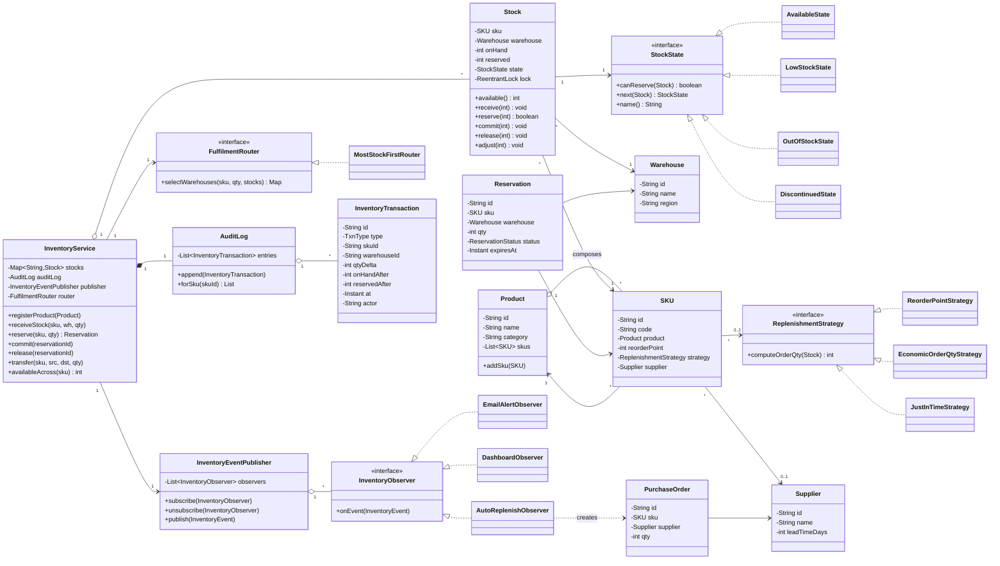

# LLD: Inventory Management System

> A staff-engineer-grade low-level-design walkthrough and last-minute revision artifact.
> Reader profile: senior Java engineer comfortable with OOP + GoF patterns, preparing for an LLD / machine-coding round.

---

## PART A — Design Document

### 1. Problem statement

Design an **Inventory Management System (IMS)** for an e-commerce / warehousing company. The system must track *what* products exist, *where* their physical stock lives (across multiple warehouses), and *how much* of each item is available, reserved, or in-transit. It must support the day-to-day operations of an inventory team:

- Register **products** and their **SKUs** (Stock Keeping Units — the unique, sellable variant identifier; e.g. "T-Shirt, Red, M" is one SKU of the product "T-Shirt").
- Add, remove, and adjust **stock** in specific warehouses.
- **Reserve / hold** stock for an order so it cannot be double-sold, then **commit** (ship) or **release** (cancel) the reservation.
- **Prevent overselling** under concurrent requests (two orders racing for the last unit).
- Fire **low-stock alerts** to interested parties (procurement, dashboards, suppliers) when available quantity crosses a threshold.
- **Replenish** stock automatically using a pluggable strategy (reorder-point, economic-order-quantity, just-in-time, etc.).
- **Transfer** stock between warehouses.
- Maintain an **audit trail** of every stock-changing transaction for traceability and reconciliation.

The deliverable is the *in-memory domain model and service layer* — not a database schema or REST controllers, though the design must be amenable to both.

---

### 2. Clarifying / requirements questions to ask first

Before writing a single class, these are the questions I would put to the interviewer. They split into functional scope, non-functional constraints, and explicit in/out-of-scope cuts.

**Functional scope**

1. **Granularity of tracking** — Do we track stock at the *SKU × warehouse* level, or also at finer granularity (bin / shelf / lot / serial number / batch with expiry)? This decides whether `Stock` is keyed by `(sku, warehouse)` or needs a location hierarchy.
2. **Reservations** — Is there a reserve-then-commit flow (e-commerce checkout holds inventory), or do we only decrement on sale? Do reservations expire (e.g. cart abandonment after 15 min)?
3. **Multi-warehouse** — Single warehouse or many? If many, who decides which warehouse fulfils an order (the IMS, or an upstream order-routing service)? Do we support inter-warehouse transfers?
4. **Replenishment** — Is reordering automatic (system raises POs) or just an alert to a human? How many replenishment policies must we support, and can they differ per SKU?
5. **Suppliers** — Do we model suppliers and purchase orders, or is replenishment an external concern we only *signal*?
6. **Alerts** — Who needs to be notified on low stock (email, dashboard, supplier webhook)? Are there other events (out-of-stock, back-in-stock, expiry-approaching)?
7. **Stock states** — Does a SKU have lifecycle states (AVAILABLE, LOW, OUT_OF_STOCK, DISCONTINUED, RESERVED-heavy)? Should behaviour change by state (e.g. block reservations when DISCONTINUED)?
8. **Returns / RMA** — Do returns flow back into available stock, into a quarantine bucket, or are they out of scope?

**Non-functional**

9. **Concurrency** — Expected QPS on stock mutations? Is this a single-process in-memory service (so `synchronized` / locks suffice) or a distributed system (needing optimistic concurrency / CAS at the DB)? **Oversell prevention is the headline correctness requirement** — confirm the consistency model.
10. **Consistency vs availability** — Must available-quantity be strongly consistent (never oversell), or is eventual consistency with compensation acceptable?
11. **Persistence & audit** — Is the audit trail a hard requirement (regulatory / financial reconciliation)? Append-only?
12. **Scale of catalogue** — Thousands or tens of millions of SKUs? Affects whether we index aggressively.
13. **Latency / throughput targets** for reserve and query operations.

**Scope-narrowing**

14. Are pricing, payments, shipping, and order management **out of scope** (I assume yes — IMS owns *quantities*, not money or fulfilment logistics)?
15. Is a UI/REST layer required, or just the domain + service API?
16. Do we need historical analytics / forecasting, or only the operational state plus an audit log?

**Assumed answers (stated so the design is concrete):** SKU × warehouse granularity; reserve-then-commit with optional expiry; multiple warehouses with transfers; pluggable per-SKU replenishment that *signals* a supplier (PO creation modeled lightly); observer-based alerts; explicit stock states; in-process single JVM with thread-safe mutation and strong consistency on available quantity; append-only audit trail; pricing/payment/shipping out of scope; domain + service API only.

---

### 3. Finalized requirements & assumptions

**Functional**

- **F1** Register products; each product owns one or more SKUs.
- **F2** Maintain `Stock` per `(SKU, Warehouse)` with three buckets: `onHand` (physically present), `reserved` (held for orders), and the derived `available = onHand − reserved`.
- **F3** Inbound: receive stock (purchase received, return-to-stock) → increases `onHand`.
- **F4** Reserve: hold `available` quantity for an order; create a `Reservation` with optional TTL. Fails fast if insufficient available (no oversell).
- **F5** Commit a reservation: physically remove the goods → decreases both `reserved` and `onHand` (the shipment leaves).
- **F6** Release a reservation: cancel the hold → decreases `reserved`, returns to `available`.
- **F7** Transfer stock between warehouses (atomic: deduct source, add destination, or fully roll back).
- **F8** Low-stock detection: when `available` falls to/below a per-SKU `reorderPoint`, fire an event to all observers.
- **F9** Replenishment: a pluggable `ReplenishmentStrategy` decides *whether* and *how much* to reorder; the system can raise a `PurchaseOrder` to a `Supplier`.
- **F10** Stock state machine: `AVAILABLE → LOW → OUT_OF_STOCK` and back; `DISCONTINUED` is terminal-ish. State gates behaviour (e.g. cannot reserve when OUT_OF_STOCK or DISCONTINUED).
- **F11** Every mutating operation appends an immutable `InventoryTransaction` to the audit trail.

**Non-functional**

- **N1** Thread-safe: concurrent reserve/commit/release/transfer must never oversell. Per-`Stock` locking (fine-grained) so unrelated SKUs don't contend.
- **N2** Strong consistency on `available` within a JVM; CAS-style retry described for the distributed extension.
- **N3** Extensible: new alert channels, replenishment policies, and stock states added without touching existing code (OCP).
- **N4** Auditable: append-only, never mutated.
- **N5** Pure JDK; no external libraries.

**Assumptions / out of scope:** pricing, payment, shipping carrier integration, real PO lifecycle with a supplier ERP, forecasting/ML demand prediction, and persistence (modeled as in-memory maps with thread-safe collections). The design is structured so a repository abstraction could be slotted behind the service later.

---

### 4. Problem extensions / follow-up variations

These are the add-ons interviewers commonly bolt on. For each: the ask and the design impact.

| # | Extension | Design impact |
|---|-----------|---------------|
| E1 | **Multi-warehouse stock & routing** | `Stock` keyed by `(sku, warehouseId)`. `InventoryService` aggregates across warehouses for a global `available(sku)`. A `FulfilmentRouter` (Strategy) chooses warehouse(s): nearest, cheapest, most-stock, split-shipment. No change to the core `Stock` invariants. |
| E2 | **Reservations / holds with TTL** | `Reservation` entity with `expiresAt`. A background `ReservationReaper` (ScheduledExecutor) releases expired holds. Reserve path already isolated, so adding expiry is additive. |
| E3 | **Low-stock alerts** | Observer pattern: `InventoryEventPublisher` notifies `InventoryObserver`s (email, dashboard, supplier webhook, auto-replenisher). New channels = new observer; zero changes to `Stock`. |
| E4 | **Pluggable replenishment** | Strategy pattern: `ReplenishmentStrategy.computeOrderQty(stock)` → reorder-point, EOQ, JIT, fixed-lot. Per-SKU strategy reference. The `AutoReplenishObserver` is itself an observer (E3 + E4 compose). |
| E5 | **Concurrency / oversell prevention** | Per-`Stock` `ReentrantLock` (or `synchronized`) guards the read-modify-write of `onHand`/`reserved`. Reserve checks `available` and decrements atomically inside the lock. Distributed variant: optimistic versioned CAS, described in §9. |
| E6 | **Audit trail** | Every mutation goes through a single choke-point that appends an `InventoryTransaction` (type, sku, warehouse, qtyDelta, before/after, actor, timestamp). Append-only `AuditLog`. Could be backed by an event store / Kafka. |
| E7 | **Inter-warehouse transfers** | A `transfer()` operation locking both source and destination stocks in a **consistent global order** (by stock id) to avoid deadlock; deduct-then-add with rollback. Modeled as two linked transactions (TRANSFER_OUT / TRANSFER_IN). |
| E8 | **Batch / lot / expiry (FEFO)** | `Stock` decomposes into a list of `StockBatch(lot, qty, expiry)`. Reserve/commit pick batches First-Expiry-First-Out. Touches only the `Stock` internals behind its API — service layer unchanged. |
| E9 | **Returns / RMA** | New transaction type `RETURN_TO_STOCK` (or `RETURN_TO_QUARANTINE`); reuses inbound path. |
| E10 | **Back-in-stock notifications** | Same Observer bus; emit `BACK_IN_STOCK` event when `available` rises from 0. Subscribers who registered interest get notified. |

The recurring theme: **the core `Stock` invariant (onHand ≥ reserved ≥ 0, available = onHand − reserved) is the protected center**, and every extension hangs off Strategy/Observer/State seams around it — that is the senior signal.

---

### 5. Core entities, responsibilities & relationships

| Entity | Responsibility | Key relationships |
|--------|----------------|-------------------|
| **Product** | Catalogue item; metadata (name, category). Owns SKUs. | composes many `SKU` |
| **SKU** | Unique sellable variant; carries `reorderPoint`, `replenishmentStrategy`, supplier ref. | belongs to one `Product`; referenced by `Stock` |
| **Warehouse** | A physical location holding stock. | referenced by `Stock` |
| **Stock** | The protected aggregate: `onHand`, `reserved`, derived `available`, current `StockState`. Owns the lock and all mutation methods. **The invariant lives here.** | association to `SKU` + `Warehouse`; holds `StockState`; (E8) composes `StockBatch` |
| **StockState** (interface) + **Available/Low/OutOfStock/Discontinued** | State pattern: encapsulates state-specific behaviour and transitions; gates whether reserve/inbound are allowed. | `Stock` delegates to current state |
| **Reservation** | A hold: `sku`, `warehouse`, `qty`, `status`, `expiresAt`. | references `Stock` |
| **InventoryService** | Facade / orchestrator. The public API: register, receive, reserve, commit, release, transfer, query. Routes mutations through audit + events. Owns concurrency orchestration. | uses `Stock`, `AuditLog`, `InventoryEventPublisher`, `FulfilmentRouter` |
| **InventoryEventPublisher** | Observer subject: register/unregister observers, publish events. | notifies many `InventoryObserver` |
| **InventoryObserver** (interface) | Reacts to events. Impls: `EmailAlertObserver`, `DashboardObserver`, `AutoReplenishObserver`. | observes publisher |
| **ReplenishmentStrategy** (interface) | Computes reorder quantity. Impls: `ReorderPointStrategy`, `EconomicOrderQtyStrategy`, `JustInTimeStrategy`. | used by `SKU` / `AutoReplenishObserver` |
| **FulfilmentRouter** (Strategy) | Picks warehouse(s) for a reserve across multiple warehouses. | used by `InventoryService` |
| **Supplier** | Who we reorder from; lead time. | referenced by `SKU`; target of `PurchaseOrder` |
| **PurchaseOrder** | A raised replenishment order. | references `Supplier`, `SKU` |
| **InventoryTransaction** | Immutable audit record of one mutation. | appended to `AuditLog` |
| **AuditLog** | Append-only store of transactions. | composed by `InventoryService` |

**Invariant (the heart of correctness):** for every `Stock`, `0 ≤ reserved ≤ onHand` and `available = onHand − reserved`. All mutations preserve this *inside the per-stock lock*.

---

### 6. Design patterns applied

For each: where, why, the rejected alternative, and when **not** to use it. No pattern-stuffing — each earns its place.

#### 6.1 State — stock lifecycle (`StockState`)
- **Where:** `Stock` delegates `canReserve()` / state transitions to a `StockState` (`AvailableState`, `LowStockState`, `OutOfStockState`, `DiscontinuedState`).
- **Why:** behaviour differs by state (OUT_OF_STOCK and DISCONTINUED reject reservations; LOW additionally triggers replenishment signalling). State pattern replaces sprawling `if (state == …)` conditionals and localizes transition rules.
- **Rejected alternative:** a plain `enum StockState` with `switch` statements in `Stock`. Fine for 2–3 states with no behaviour, but every new state forces edits to every switch (OCP violation) and transition logic scatters.
- **When NOT to use:** if states carry no behaviour and never gate operations — then an enum field is simpler and a State class hierarchy is over-engineering.

#### 6.2 Observer — low-stock & lifecycle alerts (`InventoryEventPublisher` / `InventoryObserver`)
- **Where:** after any mutation that may change availability, `InventoryService` publishes events (`LOW_STOCK`, `OUT_OF_STOCK`, `BACK_IN_STOCK`) to all registered observers.
- **Why:** decouples *detecting* a stock event from *reacting* (email, dashboard, auto-replenish, supplier webhook). New reactions added as new observers (OCP). One event fans out to many listeners.
- **Rejected alternative:** `InventoryService` directly calling `emailService.send(...)` and `replenisher.reorder(...)`. Tightly couples the service to every consumer and forces edits for each new channel.
- **When NOT to use:** if there is exactly one consumer that will never change, or if you need ordered/transactional delivery with guarantees — then a direct call or a message queue with delivery semantics beats an in-process observer list.

#### 6.3 Strategy — replenishment policy & fulfilment routing (`ReplenishmentStrategy`, `FulfilmentRouter`)
- **Where:** `ReplenishmentStrategy.computeOrderQty(stock)` per SKU; `FulfilmentRouter.selectWarehouses(...)` for multi-warehouse reserve.
- **Why:** the *algorithm* for "how much to reorder" or "which warehouse" varies independently of the entities. Swap reorder-point ↔ EOQ ↔ JIT at runtime per SKU without touching `Stock` or the service.
- **Rejected alternative:** conditional logic / inheritance subclasses of `SKU` per policy. Conditionals violate OCP; subclassing `SKU` for behaviour conflates *what a SKU is* with *how it's reordered* and explodes the class count.
- **When NOT to use:** if there is only ever one policy and no realistic prospect of another — an inline method is simpler.

#### 6.4 Facade — `InventoryService`
- **Where:** the single public entry point coordinating `Stock`, `AuditLog`, the event publisher, and routing.
- **Why:** clients call coarse operations (`reserve`, `commit`, `transfer`) without orchestrating locks, audit writes, and event publishing themselves. Centralizes the audit/event choke-point.
- **Rejected alternative:** exposing `Stock` mutation methods directly to clients. That scatters audit/event/locking responsibilities and lets callers break invariants.
- **When NOT to use:** for a trivial subsystem with one class — a facade adds an empty layer.

#### 6.5 Singleton — registry/service access (used judiciously)
- **Where:** the prompt names Singleton (e.g. a single `InventoryService` / registry per process). Implemented via dependency injection of a single instance in `main`, and an *optional* lazy holder shown for the registry. I deliberately **prefer DI over a global Singleton** for testability.
- **Why mentioned:** there is conceptually one inventory service per process.
- **Rejected alternative / when NOT to use:** a classic static `getInstance()` Singleton makes unit testing hard (global mutable state, hidden dependencies) and hurts concurrency reasoning. I therefore use a single injected instance instead and only note the Singleton option — this is the senior-correct call.

#### 6.6 Command-ish audit via Transaction objects (lightweight)
- **Where:** each mutation produces an immutable `InventoryTransaction`. Not a full Command pattern (no execute/undo), but the same value-object discipline that would make undo/redo trivial later.
- **Why:** append-only auditability; trivial to extend to event sourcing.

#### 6.7 Factory (minor) — transaction & event creation
- Static factory methods keep construction of `InventoryTransaction` / events consistent and readable.

**SOLID in play**
- **S**RP — `Stock` owns the invariant; `AuditLog` owns persistence of records; `InventoryEventPublisher` owns fan-out; `InventoryService` orchestrates. Each has one reason to change.
- **O**CP — new observers, strategies, and states added without modifying existing classes.
- **L**SP — every `StockState` / `ReplenishmentStrategy` / `InventoryObserver` is substitutable behind its interface; no caller special-cases a subtype.
- **I**SP — small, focused interfaces (`InventoryObserver` has one method; `ReplenishmentStrategy` one method) rather than a fat "manager" interface.
- **D**IP — `InventoryService` depends on the `ReplenishmentStrategy` / `FulfilmentRouter` / `InventoryObserver` *abstractions*, injected, not concrete classes.

---

### 7. Class diagram



**Text UML (relationships at a glance)**

```
Product  ◆──→ SKU            (composition: product owns its SKUs)
SKU      ──→ ReplenishmentStrategy, Supplier   (association)
Stock    ──→ SKU, Warehouse  (association; Stock keyed by (sku,warehouse))
Stock    ──→ StockState      (State pattern; AvailableState/LowStockState/OutOfStockState/DiscontinuedState implement it)
InventoryService ◆──→ Stock, AuditLog   (composition/aggregation)
InventoryService ──→ InventoryEventPublisher, FulfilmentRouter   (DI)
InventoryEventPublisher  o──→ InventoryObserver*   (Observer; Email/Dashboard/AutoReplenish implement it)
ReplenishmentStrategy ← ReorderPoint / EOQ / JIT   (Strategy)
FulfilmentRouter ← MostStockFirstRouter            (Strategy)
AutoReplenishObserver ┄┄> PurchaseOrder ──→ Supplier
AuditLog ◆──→ InventoryTransaction*  (append-only)
```

**Key public APIs / signatures**

```java
// Facade
Product registerProduct(String name, String category);
SKU     registerSku(Product p, String code, int reorderPoint, ReplenishmentStrategy s, Supplier sup);
void    openStock(SKU sku, Warehouse wh);                 // create the (sku,wh) Stock cell
void    receiveStock(String skuId, String whId, int qty); // inbound
Reservation reserve(String skuId, int qty);               // multi-warehouse, no oversell
void    commit(String reservationId);                     // ship
void    release(String reservationId);                    // cancel hold
void    transfer(String skuId, String srcWhId, String dstWhId, int qty);
int     availableAcross(String skuId);                    // sum over warehouses
List<InventoryTransaction> audit(String skuId);

// Stock (invariant owner) — all guarded by per-stock lock
int  available();
void receive(int qty, String actor);
boolean tryReserve(int qty, String actor);   // false => insufficient, never oversell
void commitReserved(int qty, String actor);
void releaseReserved(int qty, String actor);

// Strategy / Observer / State interfaces — single-method, ISP-friendly
int  ReplenishmentStrategy.computeOrderQty(Stock s);
void InventoryObserver.onEvent(InventoryEvent e);
boolean StockState.canReserve(Stock s);  StockState StockState.recompute(Stock s);  String name();
```

---

### 8. Key flows

#### 8.1 Reserve (oversell-safe) — steps
1. Client calls `InventoryService.reserve(skuId, qty)`.
2. `FulfilmentRouter` ranks warehouses holding the SKU and proposes an allocation map `{wh → qty}` (may split across warehouses).
3. For each chosen `Stock`, acquire its **lock** (acquired in a globally consistent order if multiple, to avoid deadlock).
4. Inside the lock: ask `state.canReserve()`; check `available ≥ qty`; if yes, `reserved += qty` (preserving invariant); recompute state; else **fail fast & roll back** any partial reservations.
5. Append `RESERVE` transaction(s) to `AuditLog`; create `Reservation`.
6. Publish events if availability crossed `reorderPoint` (→ `LOW_STOCK`) or hit zero (→ `OUT_OF_STOCK`).
7. Observers react: email alert, dashboard update, `AutoReplenishObserver` computes reorder qty via Strategy and raises a `PurchaseOrder`.

#### 8.2 Commit / Release
- **Commit (ship):** lock stock → `onHand −= qty; reserved −= qty` → state recompute → `SHIP` txn → mark reservation `COMMITTED`.
- **Release (cancel):** lock stock → `reserved −= qty` → state recompute (may go back to AVAILABLE / fire `BACK_IN_STOCK`) → `RELEASE` txn → reservation `RELEASED`.

#### 8.3 Transfer (deadlock-safe)
1. Identify source and destination `Stock`.
2. Lock **both** in ascending order of stable stock id (lock-ordering avoids deadlock).
3. Verify source `available ≥ qty`; deduct `onHand` at source, add at destination.
4. Append linked `TRANSFER_OUT` + `TRANSFER_IN` transactions; recompute both states; publish events.
5. On any failure, roll back and release locks in reverse.

#### 8.4 Reserve sequence (Mermaid)

```mermaid
sequenceDiagram
    participant C as Client
    participant S as InventoryService
    participant R as FulfilmentRouter
    participant ST as Stock(wh)
    participant A as AuditLog
    participant P as InventoryEventPublisher
    participant O as Observers

    C->>S: reserve(skuId, qty)
    S->>R: selectWarehouses(sku, qty, stocks)
    R-->>S: {wh -> allocQty}
    loop each chosen Stock (locked in id order)
        S->>ST: lock()
        S->>ST: state.canReserve() & available>=q ?
        alt sufficient
            ST->>ST: reserved += q ; recompute state
            S->>A: append RESERVE txn
        else insufficient
            ST-->>S: false
            S->>S: rollback prior allocations
            S-->>C: throw InsufficientStockException
        end
        S->>ST: unlock()
    end
    S->>P: publish(LOW_STOCK / OUT_OF_STOCK if crossed)
    P->>O: onEvent(...)
    O-->>O: email / dashboard / auto-replenish (Strategy -> PurchaseOrder)
    S-->>C: Reservation
```

---

### 9. Concurrency, edge cases & extensibility

**Thread-safety model**
- **Per-`Stock` `ReentrantLock`.** The read-modify-write of `onHand`/`reserved` is the only critical section. Locking *per stock cell* (not a global lock) means unrelated SKUs proceed in parallel — high throughput, no oversell. This is the headline correctness mechanism (N1, E5).
- **Lock ordering for multi-stock ops** (transfer, split reservations across warehouses): always acquire locks in ascending `stockId` order so two concurrent transfers `A→B` and `B→A` cannot deadlock.
- **AuditLog** uses a thread-safe append (e.g. `CopyOnWriteArrayList` or a synchronized list / concurrent queue); it is append-only so readers never block writers materially.
- **Event publication happens *outside* the stock lock** where possible (snapshot the state, release lock, then publish) to avoid observers running under the lock and causing contention/deadlock.
- **Reservation reaper** (E2) runs on a `ScheduledExecutorService`; releasing an expired hold takes the same per-stock lock as any release — uniform path.

**Distributed extension (when it's not one JVM):** replace the in-memory lock with **optimistic concurrency** — `Stock` carries a `version`; reserve does a conditional update `UPDATE stock SET reserved=?, version=version+1 WHERE id=? AND version=?` and **retries** on version mismatch. Or push the decrement into the database as an atomic guarded statement: `UPDATE stock SET reserved = reserved + :q WHERE id=:id AND onHand - reserved >= :q`, treating `rowsAffected == 0` as "insufficient." This moves the invariant enforcement to the single source of truth and prevents oversell across nodes.

**Edge cases handled**
- Reserve more than available → reject, no mutation (`InsufficientStockException`).
- Reserve/commit/release on a SKU not stocked at a warehouse → clear error.
- Negative or zero quantities → validated and rejected.
- Commit/release with qty exceeding `reserved` → rejected (invariant guard).
- Double-commit / double-release of a reservation → idempotency via reservation `status` guard.
- Transfer to same warehouse, or qty exceeding source available → rejected.
- State on a SKU at exactly the reorder point → boundary handled (`available <= reorderPoint` ⇒ LOW; `available == 0` ⇒ OUT_OF_STOCK).
- DISCONTINUED SKU → reservations rejected by state; existing reserved stock can still be committed/released.
- Concurrent last-unit race → exactly one reserve wins inside the lock; the other gets insufficient.

**Extensibility recap (how the design absorbs §4)**
- New alert channel (E3/E10) → implement `InventoryObserver`, subscribe. No edits elsewhere.
- New reorder policy (E4) → implement `ReplenishmentStrategy`, attach to SKU.
- New routing rule (E1) → implement `FulfilmentRouter`.
- New stock state (E1/E8) → implement `StockState`.
- Batch/expiry (E8) → swap `Stock`'s internal storage to `List<StockBatch>` behind unchanged public methods.
- Audit → already a choke-point; redirect `AuditLog.append` to an event store.

---

### 10. Likely interview questions

**Q1. Why per-`Stock` locking instead of a single global lock or `synchronizedMap`?**
A single global lock serializes *all* inventory operations, killing throughput; a `synchronizedMap` only makes the map thread-safe, not the read-modify-write of a stock cell (the check-then-act `available ≥ qty` then `reserved += qty` is a compound action that still races). A lock *per stock cell* makes the compound operation atomic while letting unrelated SKUs proceed concurrently — correct *and* scalable.

**Q2. How exactly do you prevent overselling?**
The `available ≥ qty` check and the `reserved += qty` mutation happen inside the same per-stock lock, so they are one atomic compound action. Two threads racing for the last unit serialize on the lock; the first reserves it, the second re-reads `available == 0` and fails. In a distributed setting, I'd enforce it with a guarded atomic DB update (`WHERE onHand - reserved >= :q`) and treat `rowsAffected==0` as insufficient.

**Q3. Why State pattern for stock status and not just an enum?**
Behaviour differs by state — OUT_OF_STOCK and DISCONTINUED reject reservations, LOW triggers replenishment signalling — and transition rules belong with each state. State pattern localizes that and lets me add a state (e.g. QUARANTINE) without editing switch statements scattered through `Stock` (OCP). If states had *no* behaviour, an enum would be the right, simpler choice — I'd call that out.

**Q4. Why Observer for alerts rather than calling the email service directly?**
The detection of "stock is low" should not know *who* cares. Observer lets procurement email, a dashboard, a supplier webhook, and the auto-replenisher all subscribe independently; adding a channel is a new class, not an edit to `InventoryService` (OCP, SRP). The trade-off: in-process observers give no delivery guarantees — if I needed durable, ordered delivery I'd publish to a message queue instead.

**Q5. Where is Strategy and what would the alternative cost you?**
`ReplenishmentStrategy` (reorder-point / EOQ / JIT) and `FulfilmentRouter` (which warehouse). The alternative — `if (policy==EOQ) … else if …` — violates OCP and concentrates unrelated algorithms in one method; subclassing `SKU` per policy conflates identity with behaviour and explodes the type count. Strategy lets each SKU point at a policy object, swappable at runtime.

**Q6. You mentioned Singleton — did you actually use a global Singleton?**
No, deliberately. There is conceptually one `InventoryService` per process, but a static `getInstance()` introduces global mutable state that hurts testability and hides dependencies. I inject a single instance instead (DI) and only note the Singleton option. That's the senior-correct trade-off.

**Q7. How do transfers avoid deadlock?**
A transfer locks two stock cells. Two concurrent transfers `A→B` and `B→A` could deadlock if each grabbed locks in arrival order. I impose a global lock-ordering: always acquire by ascending stable `stockId`. With a total order on locks, a cycle is impossible, so no deadlock.

**Q8. How do reservations expire, and why does that matter?**
Carts get abandoned; held stock must return to `available`. A `Reservation` carries `expiresAt`; a `ScheduledExecutorService` reaper periodically releases expired holds through the same locked release path. Without expiry, abandoned carts would permanently starve inventory.

**Q9. How is the audit trail kept correct and append-only?**
Every mutation funnels through the `InventoryService` choke-point, which appends an immutable `InventoryTransaction` (type, delta, before/after, actor, timestamp) to an append-only `AuditLog`. Records are never mutated. This gives reconciliation and could be redirected to an event store for event sourcing.

**Q10. Walk me through committing vs releasing a reservation.**
*Commit* = the goods ship: `onHand −= qty; reserved −= qty` (both drop). *Release* = cancel: only `reserved −= qty`, so the units return to `available` and may fire a `BACK_IN_STOCK` event. Both guard against exceeding `reserved`, both are idempotent via the reservation's `status`.

**Deep-probe follow-ups**
- *"What if an observer is slow or throws?"* Publish outside the stock lock; wrap each observer call in try/catch so one bad observer can't break the others or the mutation; for slow consumers, hand off to an async executor or a queue.
- *"How would you support split shipments across 3 warehouses atomically?"* Lock all chosen stocks in id order, reserve in each; if any fails, roll back the earlier reservations before releasing locks — all-or-nothing.
- *"How would expiry/FEFO change `Stock`?"* `Stock` stores `List<StockBatch>` sorted by expiry; reserve/commit consume earliest-expiry first. Public API unchanged, so the service and observers don't change — the seam pays off.

---

## PART C — Cheat-sheet & self-test

**Patterns used (recap)**
- **State** → `StockState` (Available/Low/OutOfStock/Discontinued): state-specific gating of reserve + transition rules. Beats scattered enum switches.
- **Observer** → `InventoryEventPublisher` + `InventoryObserver` (email, dashboard, auto-replenish): decouple detection from reaction; add channels via new classes.
- **Strategy** → `ReplenishmentStrategy` (reorder-point/EOQ/JIT) and `FulfilmentRouter`: swap algorithms per SKU/at runtime.
- **Facade** → `InventoryService`: one coordinated entry point; the audit/event/lock choke-point.
- **Singleton (noted, DI-preferred)** → single service instance injected, not a global `getInstance()`.
- **Value-object / lightweight Command** → immutable `InventoryTransaction` for append-only audit (event-sourcing-ready).

**Key design decisions (recap)**
- Protected center = the `Stock` invariant `0 ≤ reserved ≤ onHand`, `available = onHand − reserved`; all mutations preserve it inside a **per-stock `ReentrantLock`**.
- Oversell prevention = atomic check-then-decrement under the lock (or guarded CAS update in the distributed variant).
- Deadlock avoidance = global lock ordering by stock id for transfers / split reservations.
- Events published outside the lock; observers isolated with try/catch.
- Every extension (multi-warehouse routing, TTL holds, alerts, replenishment, transfers, audit, FEFO) hangs off a Strategy/Observer/State seam — no edits to the core.
- SOLID: SRP (Stock vs AuditLog vs Publisher vs Service), OCP (new observers/strategies/states), LSP/ISP (single-method interfaces), DIP (service depends on abstractions, injected).

**5 self-test questions (no answers)**
1. A customer's cart holds the last 2 units for 15 minutes then abandons. Trace every state/quantity change and every event fired, from reserve to expiry-release.
2. Two transfers run concurrently: SKU-X `WH1→WH2` and SKU-X `WH2→WH1`. Show precisely why your lock-ordering rule prevents deadlock, and what changes if a transfer also touches a third warehouse.
3. You must add an "expiry / FEFO" requirement. Which classes change, which don't, and why is the public API stable?
4. The single-JVM design must become a 5-node distributed service. Rewrite the reserve path to keep the no-oversell guarantee; state the consistency model and the failure modes.
5. Replace email alerts with a durable, ordered, at-least-once notification pipeline. What does Observer no longer give you, and what do you introduce instead?
