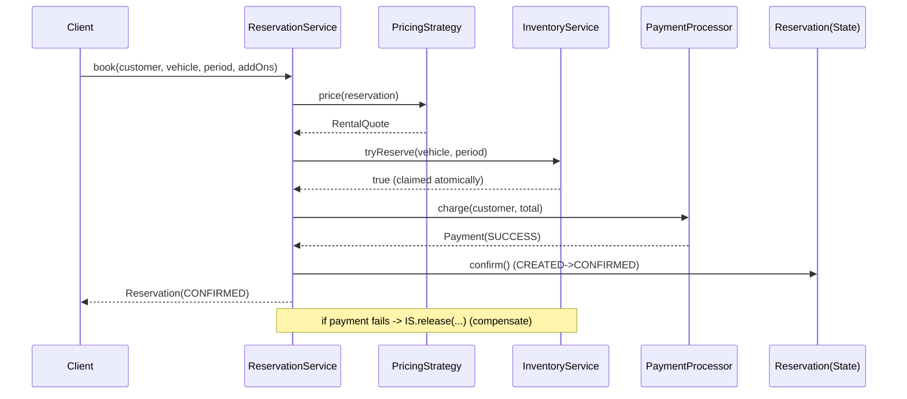

# Car Rental System — Low-Level Design

> A complete OOD / machine-coding reference and last-minute revision artifact for a senior Java engineer. PART A is the design document, PART B (the `Solution.java` file beside this doc) is the single-file Java solution, PART C is a cheat-sheet and self-test.

---

## PART A — Design Document

### 1. Problem statement

Design the backend domain model for a **Car Rental System** (think a single company operating like Hertz / Zoomcar). The system lets customers:

- **Search** for available vehicles by location (store/branch), vehicle type, and a date range.
- **Reserve** a vehicle for a date range, optionally with add-ons (insurance, GPS, child seat).
- **Pick up** and **return** the vehicle, possibly at a different branch (one-way rental).
- **Pay** for the rental using a pluggable pricing scheme, plus **late fees** and **add-on** charges.
- **Cancel** a reservation (subject to a cancellation policy).

The hard parts are: **preventing double-booking** of the same physical vehicle over overlapping date ranges under concurrency, modeling the **rental lifecycle** (a state machine), and keeping **pricing** flexible (daily/weekly/seasonal/membership rates) without rewriting the core.

We are designing the **in-memory domain core** (entities + services), not the REST layer, persistence, or UI — though the design must be cleanly extensible toward those.

---

### 2. Clarifying / requirements questions to ask first

> In a real round, *ask these before writing a single class*. They show you scope the problem rather than pattern-stuff. Group them.

**Functional scope**

1. Is there **one company with many branches**, or a marketplace of many independent owners/hosts (peer-to-peer like Turo)? (Changes ownership, payouts, trust model.)
2. What does **search** key on — branch/location, vehicle type/class (economy, SUV, luxury), transmission, fuel, and a **date-time range**? Is location a discrete store, or geo radius?
3. Do we rent **a specific physical car** or **a vehicle category** (customer gets "some SUV", exact car assigned at pickup)? Real agencies do the latter — this dramatically changes the availability model.
4. Are **one-way rentals** allowed (pick up at branch A, drop at branch B)? If so, is there a relocation/drop-off fee?
5. What is the **reservation lifecycle**? Likely: `CREATED → CONFIRMED → IN_PROGRESS (picked up) → COMPLETED (returned)`, plus `CANCELLED` and `NO_SHOW`.
6. What **add-ons** exist (insurance tiers, GPS, child seat, additional driver)? Are they priced per-day or flat?
7. What **pricing models** must we support — flat daily, weekly discounts, seasonal/surge, membership/loyalty discounts, hourly? Taxes?
8. **Cancellation policy** — free until X hours before pickup, partial refund after, no refund inside the window?
9. **Late return** — flat penalty, per-hour, or per-day with a grace period?
10. Payments: do we just **record** a payment against a pluggable gateway, or actually integrate? Refunds on cancel?

**Non-functional / constraints**

11. **Concurrency**: how many concurrent booking attempts? Single JVM (in-memory locking ok) or distributed (need DB-level constraints / distributed locks)? This is the crux of double-booking prevention.
12. **Scale**: fleet size (hundreds vs millions), branches, expected QPS for search?
13. **Consistency vs availability**: must a confirmed booking *never* double-book (strong consistency), or is eventual reconciliation acceptable?
14. **Persistence**: in-memory for the exercise, or back onto a relational DB? (Affects whether we lean on optimistic/pessimistic DB locks.)
15. **Time zones / clock**: are dates calendar days or precise timestamps? Whose clock?

**Scope narrowing (what's in / out)**

16. In scope: search, availability, reservation lifecycle, pricing strategy, add-ons, cancellation, late fee, payment recording, one-way rentals.
17. Out of scope (state explicitly): auth/identity, real payment gateway integration, notifications, maps/routing, fraud, accounting/ledger, persistence layer details, REST/gRPC API surface.

---

### 3. Finalized requirements & assumptions

To produce a concrete artifact, I commit to these answers (state them aloud in the round):

- **Single company, multiple branches.** Each branch owns an inventory of specific physical `Vehicle`s.
- We rent a **specific physical vehicle** (simpler, exact double-booking semantics). I note the category-level extension in §4.
- **One-way rentals allowed**: a reservation has a pickup branch and a return branch; an optional drop-off fee applies if they differ.
- **Lifecycle**: `CREATED → CONFIRMED → IN_PROGRESS → COMPLETED`, with `CANCELLED` reachable from `CREATED`/`CONFIRMED`, and `NO_SHOW` from `CONFIRMED`. Enforced by a **State** machine.
- **Date range**: half-open interval `[start, end)` at `LocalDateTime` granularity. Overlap check uses `start < other.end && other.start < end`.
- **Pricing** is a pluggable **Strategy**: a base `DailyPricingStrategy`, a `WeekendSurgePricingStrategy`, and a membership-discount decorator. Pricing computes a `Money` total = base + add-ons + fees − discounts + tax.
- **Add-ons** priced per-day (insurance, GPS) or flat (one-time cleaning); modeled as small value objects summed into the quote.
- **Cancellation**: free up to a configurable cutoff before pickup, then a percentage penalty — a pluggable `CancellationPolicy`.
- **Late fee**: per-day overage at a multiple of the daily rate after a grace period — a pluggable `LateFeePolicy`.
- **Payment**: recorded via a `PaymentProcessor` interface (mock gateway). Refund on cancel.
- **Concurrency**: single JVM. We prevent double-booking with **per-vehicle locking** + an in-memory availability index guarded so that the *check-and-reserve* step is atomic. We discuss the distributed extension.
- **Money** is integer minor units (cents) to avoid floating-point drift.

---

### 4. Problem extensions / follow-up variations

> This section is where senior candidates score. For each, name the *design hook* that absorbs it.

| Extension | What changes | Design hook that absorbs it |
|---|---|---|
| **Search by type/location/dates** | Need an index keyed by branch + type, filtered by availability over a range | `InventoryService.search(criteria)` + `SearchCriteria` value object; `AvailabilityIndex` per vehicle |
| **Availability over date ranges** | Must answer "is car X free in `[s,e)`?" fast | Each `Vehicle` holds a sorted set of booked intervals; overlap check is O(log n). Distributed → a `bookings` table with an exclusion constraint |
| **Double-booking prevention** | Two requests reserve the same car for overlapping dates | Atomic check-and-reserve under a **per-vehicle lock** (striped). Distributed → DB unique/exclusion constraint or optimistic version |
| **Category-level rental** (rent "an SUV", not a VIN) | Reserve against a *count* of a category per branch per day, assign physical car at pickup | Swap `AvailabilityIndex` for a per-category daily **counter**; the State/Strategy/Policy layers are untouched — proof the design is decoupled |
| **Pricing & insurance add-ons** | New rate plans, surge, loyalty; add-ons priced per-day/flat | **Strategy** for base pricing + **Decorator** for discounts; add-ons summed in the quote builder |
| **Pickup / drop at different branches** | One-way fee; vehicle inventory moves between branches | `Reservation.returnBranch`; on `COMPLETED`, vehicle re-homes to the return branch; `DropOffFeeStrategy` |
| **Cancellations** | Refund math, state transition guards | **State** pattern rejects illegal cancels; `CancellationPolicy` strategy computes refund |
| **Late fees** | Penalty when returned after `end` | `LateFeePolicy` strategy invoked at return |
| **Damage / inspection at return** | Optional damage charge, vehicle → MAINTENANCE | New `VehicleStatus.MAINTENANCE`; return flow accepts a `DamageReport`; pricing adds a charge |
| **Notifications** (booking confirmed, reminder) | Side-effects on state transitions | **Observer**: `ReservationListener`s subscribe to lifecycle events |
| **Distributed deployment** | In-memory locks don't hold across nodes | Move atomicity to DB (SELECT … FOR UPDATE / unique constraint / optimistic version) or a distributed lock (Redis); the *service interface* stays identical |
| **Loyalty / membership tiers** | Tier-based discounts | Decorator on pricing strategy; membership lives on `Customer` |

---

### 5. Core entities, responsibilities & relationships

**Value objects (immutable)**

- `Money` — minor units + currency; safe add/subtract/scale.
- `DateRange` — half-open `[start, end)`; `overlaps`, `days`, `hours`.
- `SearchCriteria` — branch, vehicle type, date range, requested add-ons.
- `RentalQuote` — itemized: base, add-ons, fees, discount, tax, total.

**Entities**

- `Vehicle` — a physical car: id, `VehicleType`, registration, `VehicleStatus`, current `homeBranch`, and an **availability index** (sorted booked `DateRange`s). Knows how to test/claim/release a range. *Single responsibility: own its own availability.*
- `VehicleType` — enum-like classification (ECONOMY, SEDAN, SUV, LUXURY, VAN) carrying a base daily rate hint.
- `Branch` (Store) — id, location, set of vehicle ids it homes.
- `Customer` — id, name, license, `MembershipTier`.
- `AddOn` — id, name, `pricePerDay` or flat, `perDay` flag.
- `Reservation` — the aggregate root of a booking: customer, vehicle, pickup/return branch, `DateRange`, chosen add-ons, current `ReservationState`, the agreed `RentalQuote`, and `Payment`s. Delegates transitions to its state object.
- `Payment` — amount, status, method, timestamps; produced by `PaymentProcessor`.

**Strategies / policies (behavior, pluggable)**

- `PricingStrategy` — `RentalQuote price(Reservation ctx)`.
- `CancellationPolicy` — `Money refundFor(Reservation, now)`.
- `LateFeePolicy` — `Money lateFee(Reservation, actualReturn)`.
- `DropOffFeeStrategy` — `Money dropOffFee(pickupBranch, returnBranch)`.

**State**

- `ReservationState` interface with concrete `CreatedState`, `ConfirmedState`, `InProgressState`, `CompletedState`, `CancelledState`, `NoShowState`. Each defines which transitions are legal.

**Services (orchestration / use-cases)**

- `InventoryService` — holds branches & vehicles, runs `search`, and performs the **atomic check-and-reserve** and release of vehicle availability. Owns the per-vehicle locks.
- `ReservationService` — the booking use-case façade: build quote → reserve inventory → create reservation → take payment → confirm; plus pickup, return, cancel. Notifies observers.
- `PaymentProcessor` — interface; `MockPaymentProcessor` impl.

**Relationships (text UML)**

```
Reservation  *--1  Customer            (a customer has many reservations)
Reservation  *--1  Vehicle             (booked vehicle)
Reservation  *--1  Branch  (pickup)    (and 1 returnBranch)
Reservation  *--*  AddOn
Reservation  o--1  ReservationState    (current state; State pattern)
Reservation  *--*  Payment
Vehicle      1--1  VehicleType
Vehicle      1--1  AvailabilityIndex   (composition: car owns its bookings)
Branch       1--*  Vehicle             (homes)
ReservationService --> InventoryService, PricingStrategy, PaymentProcessor,
                       CancellationPolicy, LateFeePolicy   (dependencies, injected)
InventoryService o--* Vehicle, Branch
```

`--*` association/aggregation, `*--1` many-to-one, `o--` aggregation, `1--1 (composition)` solid ownership.

---

### 6. Design patterns applied

> Each entry: **where / why / rejected alternative / when *not* to use.**

**1. State — reservation lifecycle (`ReservationState`)**
- *Where:* `Reservation` delegates `confirm/pickup/returnVehicle/cancel/markNoShow` to its current state object.
- *Why:* The legal transitions and the "what happens on this action" logic differ per state and would otherwise become a sprawling `switch(status)` repeated in every method (a smell). State localizes each state's rules into its own class — open for new states, closed for modification of existing ones.
- *Rejected:* a status `enum` + `if/switch` guards. Fine for 2–3 states; here we have 6 states and several actions, and the matrix grows quadratically. Also a plain enum can't carry per-state behavior cleanly.
- *When not:* if transitions are trivial and unlikely to grow, an enum guard is simpler — don't add six classes for a two-state flag.

**2. Strategy — pricing, cancellation, late fee, drop-off fee**
- *Where:* `PricingStrategy`, `CancellationPolicy`, `LateFeePolicy`, `DropOffFeeStrategy` injected into `ReservationService`.
- *Why:* Pricing rules change far more often than the booking flow (seasonal surge, promos, new markets). Strategy lets us swap algorithms at runtime / per-tenant without touching the orchestration — **Open/Closed**. Each policy is independently testable.
- *Rejected:* a giant `calculatePrice()` with flags/parameters. Becomes a parameter-bloated god method that violates SRP and is hard to test in isolation.
- *When not:* if there is exactly one pricing rule that will never change, a method is enough — Strategy adds an interface and a class for no benefit.

**3. Decorator — composable discounts on top of a base price**
- *Where:* `MembershipDiscountPricing` wraps any `PricingStrategy`, applies its base quote, then deducts a tier discount.
- *Why:* Discounts stack and combine orthogonally with the base rate (membership × promo × ...). Decorator composes them at runtime without an explosion of `WeekendSurgeWithGoldDiscount` subclasses.
- *Rejected:* subclass per combination — combinatorial blow-up. Or a list of post-processors inside the strategy — works, but Decorator keeps each concern a separate, swappable object implementing the same interface.
- *When not:* a single fixed discount → just subtract it; don't wrap.

**4. Factory (Simple/Method) — vehicle creation**
- *Where:* `VehicleFactory.create(type, registration, branch)` centralizes setting type-specific defaults (base rate, seat count).
- *Why:* Callers shouldn't know the per-type defaults; centralizing keeps construction consistent and makes adding a `VehicleType` a one-place change.
- *Rejected:* `new Vehicle(...)` scattered everywhere with duplicated defaults; or an over-engineered abstract factory hierarchy when a simple switch suffices.
- *When not:* if `Vehicle` is a trivial POJO with no type-driven defaults, the factory is ceremony.

**5. Observer — lifecycle notifications**
- *Where:* `ReservationService` notifies registered `ReservationListener`s on transitions (e.g., `onConfirmed`, `onCompleted`).
- *Why:* Side-effects (email, SMS, analytics, inventory re-homing) are open-ended and shouldn't be hard-wired into the booking flow — keeps `ReservationService` focused (**SRP / OCP**).
- *Rejected:* inline calls to a NotificationService; couples the core to every side-effect and forces edits when a new one appears.
- *When not:* exactly one fixed, synchronous side-effect that's intrinsic to the operation.

**6. Facade — `ReservationService`**
- *Where:* one entry point coordinating inventory, pricing, payment, policies, and state.
- *Why:* Clients (a controller) get a small, intention-revealing API (`book`, `pickUp`, `returnVehicle`, `cancel`) instead of orchestrating five collaborators themselves.
- *Rejected:* exposing the collaborators directly — leaks orchestration and ordering rules to callers.

**Singleton-ish:** the services are intended as single shared instances (wired by a container), but we **inject** rather than use static singletons — easier to test and to run multi-tenant. Avoid the classic Singleton anti-pattern of global static state.

**SOLID in play**
- **S**RP: `Vehicle` owns availability; `PricingStrategy` only prices; `ReservationState` only governs transitions; services orchestrate.
- **O**CP: new pricing/policies/states/listeners added without editing existing classes.
- **L**SP: every concrete `PricingStrategy`/state honors its interface contract and is substitutable.
- **I**SP: small focused interfaces (`PricingStrategy`, `CancellationPolicy`, `LateFeePolicy`, `PaymentProcessor`) rather than one fat "RentalEngine" interface.
- **D**IP: `ReservationService` depends on abstractions (interfaces) injected in, not concretions.

---

### 7. Class diagram

```mermaid
classDiagram
    class Money {
        +long minorUnits
        +String currency
        +add(Money) Money
        +subtract(Money) Money
        +scale(double) Money
    }
    class DateRange {
        +LocalDateTime start
        +LocalDateTime end
        +overlaps(DateRange) boolean
        +days() long
        +hours() long
    }
    class VehicleType {
        <<enum>>
        ECONOMY
        SEDAN
        SUV
        LUXURY
        VAN
        +baseDailyRate() Money
    }
    class VehicleStatus {
        <<enum>>
        AVAILABLE
        RENTED
        MAINTENANCE
    }
    class Vehicle {
        +String id
        +VehicleType type
        +String registration
        +VehicleStatus status
        +Branch homeBranch
        -TreeSet~DateRange~ booked
        +isAvailable(DateRange) boolean
        +reserve(DateRange) void
        +release(DateRange) void
    }
    class Branch {
        +String id
        +String location
        +Set~String~ vehicleIds
    }
    class Customer {
        +String id
        +String name
        +MembershipTier tier
    }
    class AddOn {
        +String name
        +Money price
        +boolean perDay
    }
    class RentalQuote {
        +Money base
        +Money addOns
        +Money fees
        +Money discount
        +Money tax
        +total() Money
    }
    class Reservation {
        +String id
        +Customer customer
        +Vehicle vehicle
        +Branch pickupBranch
        +Branch returnBranch
        +DateRange period
        +List~AddOn~ addOns
        +RentalQuote quote
        -ReservationState state
        +confirm()
        +pickUp()
        +returnVehicle(LocalDateTime, ReservationService)
        +cancel(ReservationService)
        +markNoShow()
    }
    class ReservationState {
        <<interface>>
        +confirm(Reservation)
        +pickUp(Reservation)
        +returnVehicle(Reservation, LocalDateTime, ReservationService)
        +cancel(Reservation, ReservationService)
        +markNoShow(Reservation)
        +name() ReservationStatus
    }
    class CreatedState
    class ConfirmedState
    class InProgressState
    class CompletedState
    class CancelledState
    class NoShowState
    class PricingStrategy {
        <<interface>>
        +price(Reservation) RentalQuote
    }
    class DailyPricingStrategy
    class WeekendSurgePricingStrategy
    class MembershipDiscountPricing
    class CancellationPolicy {
        <<interface>>
        +refundFor(Reservation, LocalDateTime) Money
    }
    class LateFeePolicy {
        <<interface>>
        +lateFee(Reservation, LocalDateTime) Money
    }
    class PaymentProcessor {
        <<interface>>
        +charge(Customer, Money) Payment
        +refund(Payment, Money) Payment
    }
    class InventoryService {
        +search(SearchCriteria) List~Vehicle~
        +tryReserve(Vehicle, DateRange) boolean
        +release(Vehicle, DateRange) void
    }
    class ReservationService {
        +book(...) Reservation
        +pickUp(String)
        +returnVehicle(String, LocalDateTime)
        +cancel(String)
        +addListener(ReservationListener)
    }
    class ReservationListener {
        <<interface>>
        +onConfirmed(Reservation)
        +onCompleted(Reservation)
        +onCancelled(Reservation)
    }

    ReservationState <|.. CreatedState
    ReservationState <|.. ConfirmedState
    ReservationState <|.. InProgressState
    ReservationState <|.. CompletedState
    ReservationState <|.. CancelledState
    ReservationState <|.. NoShowState
    PricingStrategy <|.. DailyPricingStrategy
    PricingStrategy <|.. WeekendSurgePricingStrategy
    PricingStrategy <|.. MembershipDiscountPricing
    MembershipDiscountPricing o--> PricingStrategy : wraps (Decorator)
    Reservation o--> ReservationState
    Reservation --> Customer
    Reservation --> Vehicle
    Reservation --> Branch
    Reservation --> AddOn
    Reservation --> RentalQuote
    Vehicle --> VehicleType
    Vehicle --> VehicleStatus
    Branch o--> Vehicle
    InventoryService o--> Vehicle
    InventoryService o--> Branch
    ReservationService --> InventoryService
    ReservationService --> PricingStrategy
    ReservationService --> PaymentProcessor
    ReservationService --> CancellationPolicy
    ReservationService --> LateFeePolicy
    ReservationService --> ReservationListener
```



**Key public APIs**

```java
// Inventory
List<Vehicle> InventoryService.search(SearchCriteria c);
boolean       InventoryService.tryReserve(Vehicle v, DateRange when);  // atomic check+claim
void          InventoryService.release(Vehicle v, DateRange when);

// Booking use-cases (Facade)
Reservation ReservationService.book(Customer c, Vehicle v, Branch pickup,
                                    Branch ret, DateRange when, List<AddOn> addOns);
void        ReservationService.pickUp(String reservationId);
void        ReservationService.returnVehicle(String reservationId, LocalDateTime at);
void        ReservationService.cancel(String reservationId);

// Pricing / policies
RentalQuote PricingStrategy.price(Reservation r);
Money       CancellationPolicy.refundFor(Reservation r, LocalDateTime now);
Money       LateFeePolicy.lateFee(Reservation r, LocalDateTime actualReturn);
```

---

### 8. Key flows

**Booking (happy path)**

1. Client calls `ReservationService.book(...)`.
2. Build a draft `Reservation` (state = `CREATED`).
3. `pricingStrategy.price(reservation)` → `RentalQuote` (base + add-ons + drop-off fee − discount + tax).
4. `inventoryService.tryReserve(vehicle, period)` — **atomic check-and-claim under the vehicle's lock**. If it returns false (taken concurrently), abort with a clear error.
5. `paymentProcessor.charge(customer, quote.total())` → `Payment`. If payment fails, **release** the inventory claim (compensating action) and abort.
6. `reservation.confirm()` (State: `CREATED → CONFIRMED`); attach payment; notify listeners `onConfirmed`.



**Pickup:** `CONFIRMED → IN_PROGRESS`; set `vehicle.status = RENTED`.

**Return:** `IN_PROGRESS → COMPLETED`; compute `lateFeePolicy.lateFee(...)` if `actualReturn > period.end`, charge it; release the availability interval; re-home vehicle to `returnBranch` if one-way; set `vehicle.status = AVAILABLE`; notify `onCompleted`.

**Cancel:** legal only from `CREATED`/`CONFIRMED`. `cancellationPolicy.refundFor(...)` → refund payment; release inventory; state → `CANCELLED`; notify `onCancelled`. `InProgressState.cancel` throws (you can't cancel an active rental).

---

### 9. Concurrency, edge cases & extensibility

**Concurrency — the heart of the problem**

- **The race:** two threads search, both see car X free for `[s,e)`, both reserve → double-booking. The check and the claim must be **one atomic step**.
- **Single-JVM solution (this design):** `InventoryService.tryReserve` acquires a **per-vehicle lock** (a `ReentrantLock` from a striped map, or a lock field on the `Vehicle`), then re-checks `isAvailable(period)` *inside* the lock, claims it, and unlocks. Per-vehicle striping keeps contention low — bookings for different cars don't block each other. `Vehicle.booked` is a `TreeSet<DateRange>` so the overlap check is O(log n), guarded by the same lock.
- **Compensation:** if payment fails after claiming inventory, we must `release` the interval — otherwise we leak availability. (Booking is a small saga: claim → pay → confirm, with release as the compensating action.)
- **Distributed solution (extension):** in-memory locks don't span nodes. Options: (a) a `bookings` row with a DB **exclusion constraint** on `(vehicle_id, tstzrange)` so overlapping inserts fail atomically; (b) `SELECT … FOR UPDATE` on the vehicle row (pessimistic); (c) an **optimistic** version column + retry; (d) a distributed lock (Redis Redlock) — simplest but weakest. The service interface stays identical, which is the point of DIP.

**Edge cases**

- Zero/negative date range, `start == end`, start in the past → validate in `DateRange`/`book`.
- Picking up before pickup window / returning early → allowed; early return doesn't reduce charge in our model (state it).
- Returning to a different branch than booked → allowed if one-way; charge drop-off fee at booking, re-home at return.
- Double pickup / double return / cancel-after-complete → State pattern throws `IllegalStateException` with a clear message.
- Payment partial failure / refund of a partially-used rental → out of scope but the saga/compensation hook is there.
- Money rounding → integer minor units; surge/discount scaling rounds half-up once at the end.
- Clock skew on late-fee calc → use a single injected clock source in production.

**Extensibility recap** — see the table in §4: category-level rentals swap only the availability index; new pricing/discounts plug into Strategy/Decorator; new lifecycle states are new `ReservationState` classes; notifications are new `ReservationListener`s; distribution swaps only the inventory atomicity mechanism. The orchestration in `ReservationService` is closed to modification across all of these.

---

### 10. Likely interview questions

1. **How do you prevent double-booking?**
   *Make check-and-reserve atomic under a per-vehicle lock; re-check availability inside the lock before claiming. Single JVM → striped `ReentrantLock`s; distributed → DB exclusion constraint / `SELECT FOR UPDATE` / optimistic version. Always compensate (release) if a later step (payment) fails.*

2. **Why State for the lifecycle instead of an enum + switch?**
   *Six states × several actions = a transition matrix that, as enum guards, gets duplicated across methods and grows quadratically. State puts each state's legal actions in its own class — adding `NO_SHOW` is a new class, not edits to five methods. (Senior signal: OCP.)*

3. **Where's Strategy vs Decorator and why both?**
   *Strategy swaps the base pricing algorithm (daily vs weekend surge). Decorator composes orthogonal discounts (membership, promo) over any base without subclass explosion. Different axes of variation → different patterns.*

4. **How does the design support renting a category ("an SUV") instead of a specific car?**
   *Replace the per-vehicle interval index with a per-branch, per-category, per-day counter; reserve decrements the count, assign a physical car at pickup. The State/Strategy/Policy/Observer layers don't change — that decoupling is the proof of a clean design. (Senior signal: extension justification.)*

5. **A payment succeeds but `confirm()` throws — what happens?**
   *Treat booking as a saga: claim inventory → charge → confirm. On any later failure, run compensations (refund the charge, release the inventory). In production, make confirm idempotent and reconcile via an outbox.*

6. **How do you handle late returns and cancellations cleanly?**
   *Both are pluggable policies (`LateFeePolicy`, `CancellationPolicy`) invoked by the return/cancel flows; the State machine guards *when* they may run (you can't cancel an `IN_PROGRESS` rental).*

7. **Why inject services instead of using Singletons?**
   *DIP + testability + multi-tenancy. Static singletons are global mutable state that's hard to mock and to run per-tenant. We keep "one instance" via the wiring container, not via static fields.*

8. **How would you make search fast at scale?**
   *Index by `(branch, vehicleType)`; for date-range availability, keep an interval structure per vehicle (or per-category daily counters). At large scale push to a search store / DB with range indexes; the `search` API contract is unchanged.*

9. **What does Observer buy you here, concretely?**
   *Confirmation emails, reminders, analytics, and one-way re-homing are open-ended side-effects. As listeners they don't pollute `ReservationService`, and a new one is additive (OCP). Without it, every new notification edits the core flow.*

10. **How do you avoid floating-point money bugs?**
    *Represent money as integer minor units (cents) with a currency; only convert to decimal at the boundary; round half-up exactly once after applying surge/discount factors.*

**Deep-probe follow-ups**
- *“Your striped locks reduce contention — but how do you choose stripe count, and what about lock ordering if a booking touches two cars?”* → size stripes ~ concurrency level; acquire multi-car locks in a consistent (id-sorted) order to avoid deadlock.
- *“Make the booking idempotent so a client retry doesn’t double-charge.”* → idempotency key per booking request; dedupe before claim/charge.
- *“Move this to two data centers — where does the design break first?”* → the atomicity primitive; in-memory locks must become a DB constraint or distributed lock, and the availability index must become the source of truth in the DB.

---

## PART C — Cheat-sheet & self-test

**Patterns used (recap)**
- **State** — reservation lifecycle (`CREATED/CONFIRMED/IN_PROGRESS/COMPLETED/CANCELLED/NO_SHOW`); legal transitions per state class.
- **Strategy** — pricing, cancellation, late-fee, drop-off-fee; swappable algorithms, OCP.
- **Decorator** — stackable discounts (membership) over any base pricing strategy.
- **Factory** — `VehicleFactory` centralizes type-specific defaults.
- **Observer** — `ReservationListener`s for confirmation/return side-effects.
- **Facade** — `ReservationService` as the single booking entry point.

**Key design decisions**
- Specific-vehicle rental; half-open `[start,end)` ranges; `Money` as integer minor units.
- Double-booking prevented by **atomic check-and-reserve under a per-vehicle lock**; payment failure compensated by releasing the claim.
- Behavior (pricing/policies/notifications) is pluggable; orchestration in `ReservationService` stays closed to modification.
- Distribution swaps only the atomicity primitive (DB exclusion constraint / `FOR UPDATE` / optimistic version).

**Self-test (no answers)**
1. Draw the reservation state machine and mark which transitions each policy/late-fee hook fires on.
2. Rewrite `tryReserve` for a distributed deployment using a relational DB — show the schema and the failure mode it relies on.
3. Convert the model from specific-vehicle to category-level rental: which classes change, which don't, and why?
4. Add a "promo code" discount that stacks with membership — which pattern, and where does it slot in?
5. Make `book` idempotent under client retries without double-charging; describe the dedup key and where you check it.
