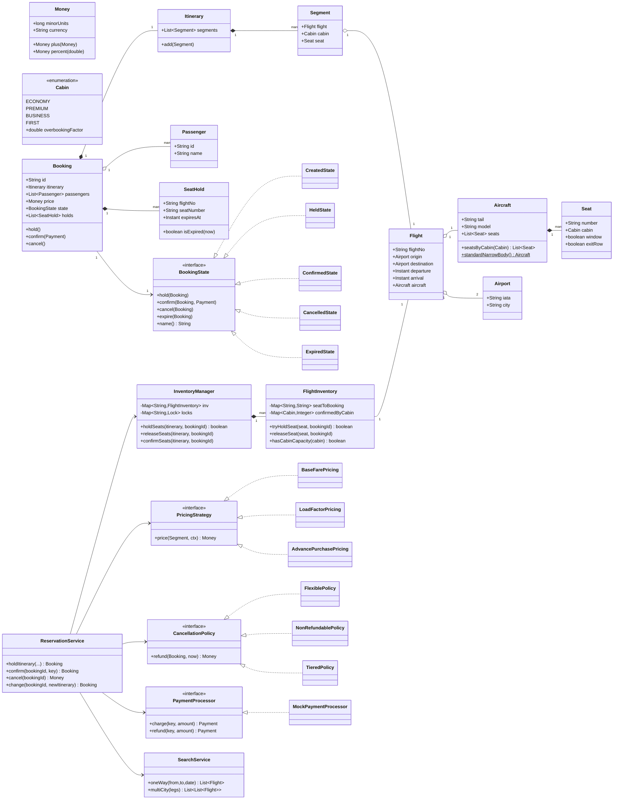

# Airline Reservation System — Low-Level Design

> A staff-engineer-grade LLD / machine-coding reference and last-minute revision artifact.
> Covers requirements gathering, entity modelling, design patterns (with rejected alternatives),
> class diagram, key flows, concurrency / edge cases, and likely interview questions.

---

# PART A — Design Document

## 1. Problem statement

Design the core of an **Airline Reservation System (ARS)**: the backend domain model and service layer that lets a passenger **search** for flights (one-way, round-trip, multi-city), **select seats**, **book an itinerary**, **pay**, and later **cancel or change** that booking — while the airline manages **inventory** (aircraft, flights, seats, fare classes) and policies such as **overbooking**, **pricing**, and **cancellation fees**.

The hard parts are:

- **Concurrency / double-booking prevention** — two passengers must never end up holding the same physical seat on the same flight; this is the canonical "race condition under contention" sub-problem.
- **Lifecycle management** — a booking moves through a well-defined set of states (HELD → CONFIRMED → CANCELLED / EXPIRED), each gating which operations are legal.
- **Pluggable pricing** — fare depends on fare class, demand, advance-purchase window, and promotions; the rules change constantly and must be swappable without touching booking logic.
- **Composability of trips** — an itinerary is a sequence of one or more flight *segments* (legs), so layovers and multi-city are just N segments under one booking.

This is a **machine-coding / LLD** exercise: we model the domain in clean OO Java, apply the right GoF patterns with justification, and make the seat-hold path thread-safe. It is **not** a distributed-systems design — no sharding, GDS integration, or Saga-across-microservices unless raised as an extension (see §4).

> **Adjacent term — GDS (Global Distribution System):** a third-party network (Amadeus, Sabre, Travelport) that aggregates airline inventory and is what travel agents / OTAs query. We treat it as an external dependency, out of core scope.

---

## 2. Clarifying / requirements questions to ask first

Lead with these *before* writing a single class. Group them so the interviewer can steer scope.

### 2.1 Functional scope
1. **Who are the actors?** Passenger (search/book/cancel), Airline admin (define flights/aircraft/fares), Payment provider, maybe Gate/Check-in agent. Which do we model?
2. **What trip types** must search support — one-way only, or round-trip and multi-city too?
3. **Is seat selection** in scope, or do we only sell "a seat in cabin X" and assign at check-in? (Many real systems defer seat assignment.)
4. **Do we model layovers / connections** as a single bookable itinerary, or only direct flights?
5. **Fare classes / cabins** — Economy / Premium / Business / First? Do fare *classes* (booking codes like Y, M, B) matter, or just cabins?
6. **Pricing rules** — fixed price per class, or dynamic (demand-based, advance-purchase, promo codes)? Is dynamic pricing in scope now or a follow-up?
7. **Cancellations & changes** — supported? With refund/penalty rules? Are date-changes a cancel-and-rebook or a first-class operation?
8. **Overbooking** — does the airline deliberately sell more seats than exist (with a bumping policy), or is capacity a hard limit?
9. **Payment** — do we integrate a real gateway or just model success/failure and idempotency?

### 2.2 Non-functional / constraints
10. **Scale** — single in-memory service for the interview, or distributed across nodes? (Drives whether locks suffice or we need a DB/optimistic concurrency / distributed lock.)
11. **Concurrency** — how many concurrent booking attempts on the *same* flight? This determines the locking granularity (per-flight vs per-seat).
12. **Seat-hold timeout** — when a passenger selects a seat, how long is it reserved before payment must complete (e.g., 10 minutes)? Needed for the HELD → EXPIRED transition.
13. **Consistency vs availability** — is it acceptable to occasionally reject a valid booking (false negative) to guarantee no double-booking, or must we never reject? (Almost always: never double-book.)
14. **Persistence** — in-memory for the exercise, or must the model map cleanly to a relational DB later?
15. **Idempotency** — can a client retry a booking/payment request safely (network retries)? 

### 2.3 Scope-narrowing / out-of-scope confirmation
16. Are **search ranking, baggage, meals, loyalty/miles, check-in, boarding passes, refunds-to-original-tender** out of scope? (Usually yes for the core round; good to name as extensions.)
17. Do we need **auth/roles**, or assume an authenticated caller?
18. Currency / multi-currency / taxes — model as a single `Money` value or ignore?

**Default assumption (stated aloud):** "Unless you say otherwise, I'll build an **in-memory single-process** system supporting one-way + round-trip + multi-city via a segment-based itinerary, explicit **seat selection with a hold timeout**, **pluggable pricing**, **cancellation with policy-driven penalty**, **optional overbooking per cabin**, and a **thread-safe** seat-hold path. Payment is mocked but idempotent."

---

## 3. Finalized requirements & assumptions

### Functional
- **Search** flights between origin/destination on a date; support **one-way**, **round-trip** (two searches combined), and **multi-city** (N legs).
- An **Itinerary** is an ordered list of **Segments**; each segment = one `Flight` + a chosen `CabinClass` + (optionally) a specific `Seat`. Layovers are just consecutive segments.
- **Seat selection** with **double-booking prevention**: selecting puts a seat into a time-boxed **HOLD**; only one holder per seat.
- **Booking lifecycle** via a state machine: `CREATED → HELD → CONFIRMED → (CANCELLED | EXPIRED)`.
- **Pricing** is pluggable per cabin/strategy: base fare, dynamic (load-factor), advance-purchase, promo. Total = sum of segment fares + taxes.
- **Payment**: charge on confirm; **idempotent** by a client-supplied key; failure releases holds.
- **Cancellation / change**: cancellation computes a **penalty** via a policy and releases seats; change = cancel-and-rebook helper (and a hook for true rebooking).
- **Overbooking**: per cabin, an `overbookingFactor ≥ 1.0` lets the airline confirm more bookings than physical seats (seat *assignment* may then be deferred / "no specific seat").

### Non-functional / assumptions
- **In-memory, single JVM**; concurrency handled with `java.util.concurrent` primitives. The design notes exactly what changes for a distributed deployment (§9).
- **Never double-book** (correctness over availability). Holds expire after a configurable TTL (default 10 min).
- **Money** modelled as a minimal value object (long minor units + currency); taxes simplified.
- Clean mapping to a relational schema is kept in mind (entities have stable IDs), but no ORM.
- Single currency in core; multi-currency listed as an extension.

---

## 4. Problem extensions / follow-up variations

The senior signal is anticipating these and showing the design *already absorbs* most of them.

| # | Extension | Design impact | Absorbed by |
|---|-----------|---------------|-------------|
| 1 | **Multi-city / round-trip** | Itinerary already a list of segments; round-trip = 2 segments, multi-city = N. No model change. | `Itinerary` composition |
| 2 | **Layovers / connections** | A connection is just consecutive segments with a minimum-connection-time check at search/validation. Add a validator; no entity change. | `Segment` list + `ConnectionValidator` hook |
| 3 | **Dynamic / demand pricing** | New `PricingStrategy` (e.g., `LoadFactorPricing`) plugged in via the `Strategy` pattern; booking code untouched. | `PricingStrategy` |
| 4 | **Overbooking & bumping** | `Cabin` carries `overbookingFactor`; capacity check uses `floor(physical * factor)`; bumping = a policy invoked at gate (out of core). | `Cabin.sellableCapacity()` |
| 5 | **Cancellation/change fees** | New `CancellationPolicy` implementations (flexible / non-refundable / tiered by time-to-departure). | `CancellationPolicy` Strategy |
| 6 | **Seat-hold expiry / TTL** | Holds carry an `expiresAt`; a sweeper (or lazy check) transitions `HELD → EXPIRED` and releases seats. | `SeatHold` + `HoldSweeper` |
| 7 | **Distributed deployment** | Replace in-JVM `ReentrantLock` per flight with optimistic concurrency (version column / `compareAndSet`) or a distributed lock; seat-hold becomes a conditional DB write. | Isolated in `InventoryManager` |
| 8 | **Payment provider integration** | `PaymentProcessor` is an interface; swap mock for Stripe/PayU adapter. Idempotency key already threaded through. | `PaymentProcessor` (Strategy/Adapter) |
| 9 | **Loyalty / miles, baggage, meals** | New ancillary line items on `Booking`; price via additional strategies; no lifecycle change. | `Booking` line items |
| 10 | **Notifications** (email/SMS on state change) | Booking state machine fires events; attach `Observer`s. | Booking `Observer` hook |
| 11 | **Multi-currency & taxes** | `Money` already carries currency; add a `FxService` + `TaxStrategy`. | `Money` + Strategy |
| 12 | **Group bookings / hold-then-name** | One `Booking` with multiple passengers; names filled later. | `Booking` holds `List<Passenger>` |

---

## 5. Core entities, responsibilities & relationships

| Entity | Responsibility | Key relationships |
|--------|----------------|-------------------|
| `Airport` | Value object: IATA code, city. | referenced by `Flight` |
| `Aircraft` | Physical plane: model + seat map (rows × cabins). | composed of `Seat`s grouped by `Cabin` |
| `Cabin` (enum-ish) | A travel cabin (ECONOMY/PREMIUM/BUSINESS/FIRST) with `overbookingFactor`. | used by `Seat`, pricing |
| `Seat` | A physical seat on an aircraft: number, cabin, attributes (window/aisle/exit-row). | belongs to `Aircraft` |
| `Flight` | A scheduled operation of an aircraft on a route at a time. Owns no booking state itself. | has `Aircraft`, origin/dest `Airport`s |
| `FlightInventory` | **Per-flight booking state**: which seats are held/booked, per-cabin counts. The concurrency owner. | 1:1 with `Flight`; guarded by a lock |
| `Segment` | One leg of a trip: a `Flight` + chosen `Cabin` + optional `Seat`. | part of `Itinerary` |
| `Itinerary` | Ordered list of `Segment`s = the whole trip. | composed of `Segment`s |
| `Passenger` | Traveller identity (name, contact, optional loyalty id). | referenced by `Booking` |
| `Booking` | Aggregate root: itinerary + passengers + state + price + holds. Drives the **state machine**. | has `Itinerary`, `Passenger`s, `Payment`, `SeatHold`s |
| `SeatHold` | A time-boxed claim on a seat for a booking. | links `Booking` ↔ `Seat`/`Flight` |
| `BookingState` | State pattern interface; concrete states gate transitions. | held by `Booking` |
| `PricingStrategy` | Computes fare for a segment/cabin. | used by pricing service |
| `CancellationPolicy` | Computes refund/penalty on cancel. | used by `Booking.cancel` |
| `PaymentProcessor` | Charges/refunds idempotently. | used on confirm/cancel |
| `InventoryManager` | Holds `FlightInventory` per flight; **the only place that mutates seat availability**; enforces locking. | manages all `FlightInventory` |
| `SearchService` | Finds flights / builds candidate itineraries. | reads `Flight`s |
| `ReservationService` | Facade orchestrating hold → price → pay → confirm, cancel, change. | uses everything above |
| `EntityFactory` / `Builder`s | Construct aircraft seat maps, flights, itineraries cleanly. | Factory / Builder |

**Relationship summary (text UML):**
- `Aircraft` ◆— `Seat` (composition; seats die with the aircraft definition).
- `Flight` ◇— `Aircraft`, `Airport` (association; a flight *references* an aircraft & airports).
- `FlightInventory` —1:1— `Flight` (the mutable booking ledger for that flight).
- `Booking` ◆— `Itinerary` ◆— `Segment` —*→ `Flight` (booking owns itinerary owns segments which reference flights).
- `Booking` —*→ `Passenger`, ◆— `SeatHold`, —1→ `BookingState`, —0..1→ `Payment`.
- `ReservationService` —uses→ {`InventoryManager`, `PricingStrategy`, `CancellationPolicy`, `PaymentProcessor`}.

---

## 6. Design patterns applied

> Rule we follow: **every pattern earns its place** with a tradeoff and a rejected alternative. No pattern-stuffing.

### 6.1 State — booking lifecycle
- **Where:** `Booking` delegates `hold/confirm/cancel/expire` to a `BookingState` (`CreatedState`, `HeldState`, `ConfirmedState`, `CancelledState`, `ExpiredState`).
- **Why:** Each operation is legal only in certain states (you can't cancel an EXPIRED booking, can't confirm a CREATED one without a hold). Encoding this as polymorphic states removes a sprawling `switch(status)` and makes illegal transitions throw centrally.
- **Rejected alternative:** a single `enum Status` + `if/switch` in `Booking`. **When not to use State:** if the lifecycle were 2 states with trivial rules, an enum guard is simpler and State is over-engineering.
- **SOLID:** **Open/Closed** (add a new state — e.g., `OnHoldPendingPayment` — without editing others) and **SRP** (each state owns its own rules).

### 6.2 Strategy — pricing & cancellation policy
- **Where:** `PricingStrategy` (`BaseFarePricing`, `LoadFactorPricing`, `AdvancePurchasePricing` chained); `CancellationPolicy` (`FlexiblePolicy`, `NonRefundablePolicy`, `TieredPolicy`).
- **Why:** Pricing and refund rules change frequently and independently of booking flow. Strategy lets us swap/compose them at runtime and unit-test each in isolation.
- **Rejected alternative:** hard-coded `if (cabin == BUSINESS) price = ...`. **When not to use:** if there were exactly one pricing rule that never changes, a method is enough.
- **SOLID:** **Open/Closed** + **Dependency Inversion** (services depend on the `PricingStrategy` abstraction, not concretes).

### 6.3 Factory + Builder — entity construction
- **Where:** `EntityFactory`/static factories to build a fully-seated `Aircraft` (e.g., `Aircraft.standardNarrowBody()`), and a fluent `Itinerary.Builder` / `BookingBuilder`.
- **Why:** Constructing a seat map (rows × columns × cabins) or a multi-segment itinerary by hand is error-prone; a factory centralizes valid construction; a builder handles the many-optional-fields itinerary/booking cleanly.
- **Rejected alternative:** telescoping constructors. **When not to use Factory:** trivial value objects (`Airport`) — just use the constructor.
- **SOLID:** **SRP** (construction logic separated from behaviour).

### 6.4 Facade — `ReservationService`
- **Where:** `ReservationService` exposes coarse operations (`searchOneWay`, `holdItinerary`, `confirm`, `cancel`, `change`) hiding the dance between inventory, pricing, payment, and the state machine.
- **Why:** Clients (controllers/CLI) shouldn't orchestrate locks + holds + payment ordering. Facade gives a clean, testable seam.
- **Rejected alternative:** let the controller call each collaborator — leaks ordering/locking rules. **When not to use:** when callers genuinely need fine-grained control.
- **SOLID:** **SRP** and a clean **Interface Segregation** boundary for clients.

### 6.5 Singleton-ish manager (scoped) — `InventoryManager`
- **Where:** one `InventoryManager` instance owns all `FlightInventory` and is the **sole mutator** of seat availability.
- **Why:** Centralizing mutation behind one component is what makes the locking strategy enforceable (you can't double-book if nobody else writes inventory). We inject it (DI) rather than using a global static — easier to test, avoids classic Singleton pitfalls.
- **Rejected alternative:** scattering seat-mutation across services (impossible to reason about races). **When not to use a hard Singleton:** anywhere testability matters — prefer a single injected instance.
- **SOLID:** **SRP** + **DIP**.

### 6.6 Observer (hook, optional) — notifications
- **Where:** `Booking` can notify listeners on state change (email/SMS/audit).
- **Why:** Decouples side-effects from core lifecycle (Extension #10). Shown as a hook so we don't over-build now.
- **Rejected alternative:** calling the notifier inline inside each state — couples comms to lifecycle.

### 6.7 Value Object — `Money`, `Airport`
- Immutable, equality-by-value; prevents float money bugs (store minor units).

**SOLID recap:** SRP (each class one reason to change), OCP (new pricing/policy/state without edits), LSP (states/strategies substitutable), ISP (narrow service interfaces), DIP (services depend on abstractions, inventory injected).

---

## 7. Class diagram

### 7.1 Mermaid `classDiagram`



### 7.2 Brief text UML & key public APIs

```
InventoryManager (sole inventory mutator; per-flight locking)
  + boolean holdSeats(Itinerary, bookingId)        // all-or-nothing across segments
  + void    releaseSeats(Itinerary, bookingId)
  + void    confirmSeats(Itinerary, bookingId)

ReservationService (Facade)
  + Booking holdItinerary(Itinerary, List<Passenger>)   // prices + holds seats, starts TTL
  + Booking confirm(String bookingId, String idempotencyKey)  // charges + confirms
  + Money   cancel(String bookingId)                    // refund per policy + release
  + Booking change(String bookingId, Itinerary newItin) // cancel-and-rebook helper

Booking (State pattern host)
  + void hold(); void confirm(Payment); void cancel(); void expire()
  + BookingState state()

BookingState (interface): hold/confirm/cancel/expire/name
PricingStrategy: Money price(Segment, PricingContext)
CancellationPolicy: Money refund(Booking, Instant now)
PaymentProcessor: Payment charge(String key, Money amt); Payment refund(String key, Money amt)
```

---

## 8. Key flows

### 8.1 Hold → Pay → Confirm (happy path)

1. Client calls `ReservationService.holdItinerary(itinerary, passengers)`.
2. Service **prices** each segment via the composed `PricingStrategy`; sums to `Booking.price`.
3. Service asks `InventoryManager.holdSeats(itinerary, bookingId)` — **all-or-nothing**: under each flight's lock, every requested seat must be free; if any fails, release the ones already taken and return false → booking stays `CREATED` (or we surface "seat unavailable").
4. On success, `Booking` transitions `CREATED → HELD`; `SeatHold`s get `expiresAt = now + TTL`.
5. Client calls `confirm(bookingId, idempotencyKey)`.
6. Service verifies holds are **not expired**; calls `PaymentProcessor.charge(key, price)` (idempotent).
7. On success: `InventoryManager.confirmSeats(...)`, `Booking` `HELD → CONFIRMED`.
8. On payment failure or expired holds: release seats, `HELD → EXPIRED`/back to `CREATED`, surface error.

### 8.2 Sequence diagram (hold + confirm)

```mermaid
sequenceDiagram
    actor Client
    participant RS as ReservationService
    participant PR as PricingStrategy
    participant IM as InventoryManager
    participant B as Booking
    participant PP as PaymentProcessor

    Client->>RS: holdItinerary(itinerary, passengers)
    RS->>PR: price(each segment)
    PR-->>RS: Money total
    RS->>IM: holdSeats(itinerary, bookingId)
    IM->>IM: per-flight lock; check+claim each seat (all-or-nothing)
    IM-->>RS: true / false
    alt all seats held
        RS->>B: hold()  (CREATED->HELD, set TTL)
        RS-->>Client: Booking(HELD, price)
    else seat unavailable
        IM->>IM: release any claimed seats
        RS-->>Client: error: seat unavailable
    end

    Client->>RS: confirm(bookingId, idempotencyKey)
    RS->>B: check holds not expired
    RS->>PP: charge(key, price)
    PP-->>RS: Payment(SUCCESS)
    RS->>IM: confirmSeats(itinerary, bookingId)
    RS->>B: confirm(payment)  (HELD->CONFIRMED)
    RS-->>Client: Booking(CONFIRMED)
```

### 8.3 Cancellation
1. `cancel(bookingId)` → `CancellationPolicy.refund(booking, now)` computes refund (e.g., tiered by time-to-departure).
2. `PaymentProcessor.refund(key, refundAmount)`.
3. `InventoryManager.releaseSeats(...)`; `Booking` `CONFIRMED → CANCELLED`.

### 8.4 Hold expiry
- A `HoldSweeper` (or lazy check on access) finds bookings whose `SeatHold.expiresAt < now` still in `HELD`, calls `expire()` → release seats, `HELD → EXPIRED`. This frees inventory for others.

---

## 9. Concurrency, edge cases & extensibility

### 9.1 Concurrency / thread-safety
The **only** contended mutable state is **seat availability per flight**. Design choices:

- **Locking granularity = per flight.** `InventoryManager` keeps a `ConcurrentHashMap<flightNo, ReentrantLock>`. Holding seats on a flight takes that flight's lock, does the check-and-claim, releases. Per-flight (not global) lock = high concurrency across different flights; per-seat locks would be finer but risk deadlock when one itinerary touches many seats and complicate all-or-nothing.
- **Multi-segment all-or-nothing:** to hold an itinerary spanning several flights, **acquire flight locks in a deterministic order** (sort by flightNo) to avoid deadlock, then claim all seats; if any seat is taken, roll back the claims already made and fail. (In the reference code we lock per-flight sequentially with ordered acquisition.)
- **Atomic claim within a flight:** `FlightInventory` uses a `seatNumber → bookingId` map; the claim is `putIfAbsent`-style under the lock (or a `ConcurrentHashMap.putIfAbsent` for the lock-free fast path). First writer wins; the loser sees the seat taken → no double-booking.
- **Capacity / overbooking check** is done under the same lock so the count can't be exceeded by racing confirmations.
- **State transitions on `Booking`** are guarded (synchronized on the booking) so concurrent confirm/cancel don't corrupt state.
- **Idempotency:** `PaymentProcessor` dedupes by key so a retried `confirm` doesn't double-charge.

> **Adjacent term — optimistic vs pessimistic locking:** *Pessimistic* = take a lock before touching data (what we do in-JVM). *Optimistic* = read a version, write only if the version is unchanged (`compareAndSet`/DB version column) — preferred when **distributed**, because you can't hold a JVM lock across nodes.

**What changes when distributed (Extension #7):** replace the in-JVM lock with either (a) an **optimistic** conditional update on a seat row (`UPDATE seat SET booking=? WHERE flightNo=? AND seat=? AND booking IS NULL`), succeed iff rows-affected = 1; or (b) a **distributed lock** (Redis/Zookeeper) per flight. The rest of the design is untouched because mutation is isolated in `InventoryManager`.

### 9.2 Edge cases
- **Double-book race** → resolved by atomic claim; loser gets "seat unavailable".
- **Hold expires before payment** → `expire()` releases seats; confirm on expired hold rejected.
- **Partial multi-segment hold** → all-or-nothing rollback; never leave a passenger half-held.
- **Payment succeeds but confirm crashes** → idempotency key lets retry resume; or a reconciliation sweep confirms/refunds.
- **Cancel after departure** → policy returns zero refund; seats not re-released into sale.
- **Overbooking beyond physical seats** → cabin sells up to `floor(physical × factor)`; specific-seat selection capped at physical seats, extra sales get "seat assigned at check-in".
- **Same passenger booked twice on same flight** → allowed at model level (could add a guard if required).
- **Minimum connection time violated** on multi-city → `ConnectionValidator` rejects itinerary at build/search time.
- **Idempotent retries** of `holdItinerary` → either reuse the existing booking by client key or create a fresh one (we document choosing reuse).

### 9.3 Extensibility recap
The matrix in §4 maps each extension to the seam that absorbs it: **Strategy** (pricing, cancellation, payment provider), **State** (new lifecycle states), **Itinerary/Segment** composition (multi-city, layovers, group), **InventoryManager** isolation (distributed concurrency), **Observer hook** (notifications). New behaviour is added by *extending*, rarely by *editing* — that's OCP in action.

---

## 10. Likely interview questions

**Q1. How do you prevent double-booking of a seat?**
A: Centralize all seat mutation in `InventoryManager`. To claim a seat, take the flight's lock, check the `seatNumber→bookingId` map, and claim only if absent (`putIfAbsent` semantics). First writer wins; concurrent losers see "taken". For multi-flight itineraries, acquire locks in deterministic flight order and do all-or-nothing with rollback. *Probe — lock-free?* Use `ConcurrentHashMap.putIfAbsent` for the single-seat fast path; still need ordered acquisition for atomic multi-segment holds, or a 2-phase claim.

**Q2. Why the State pattern for bookings instead of an enum + switch?**
A: Transition rules differ per state and there are several states; State localizes "what's legal here" in each class and makes illegal transitions throw centrally, satisfying OCP/SRP. An enum+switch works for 2–3 trivial states but grows into a god-method. *Probe — cost?* More classes; mitigated because each is tiny and the rules would exist anyway.

**Q3. Where does Strategy apply and what did you reject?**
A: Pricing and cancellation policy — both volatile, swappable, independently testable. Rejected hard-coded `if (cabin==...)` branches because they violate OCP and tangle pricing with booking. *Probe — composing strategies?* Chain pricing (base → load-factor → advance-purchase) via a decorator-style list summed in order.

**Q4. How are round-trip and multi-city modelled?**
A: An `Itinerary` is an ordered list of `Segment`s; one-way = 1, round-trip = 2, multi-city = N. No special-casing — search produces candidate segment lists; booking treats them uniformly.

**Q5. Walk the hold → pay → confirm flow and where it can fail.**
A: Price → all-or-nothing seat hold (TTL set) → charge (idempotent) → confirm seats + state to CONFIRMED. Failures: seat unavailable (release + reject), hold expired (reject confirm), payment failure (release + revert). Idempotency key prevents double-charge on retry.

**Q6. What's your locking granularity and why not global or per-seat?**
A: Per-flight. Global serializes all bookings (throughput killer). Per-seat is finest but multiplies lock acquisitions per itinerary and invites deadlock/complexity for all-or-nothing; per-flight is the sweet spot. Distributed → optimistic conditional update or distributed lock; only `InventoryManager` changes. *Probe — deadlock?* Ordered lock acquisition by flightNo.

**Q7. How does overbooking work without breaking seat selection?**
A: `Cabin.overbookingFactor` lets a cabin *sell* `floor(physical×factor)` bookings; *specific-seat* selection is still capped at physical seats, so overbooked sales are "seat at check-in" and bumping is a gate-time policy (out of core).

**Q8. How would you make this distributed / horizontally scalable?**
A: Move inventory to a DB; replace in-JVM lock with optimistic concurrency (version/`WHERE booking IS NULL`) or a distributed lock; make services stateless; payment via an outbox + idempotency; holds enforced with a TTL column + sweeper. The domain model is unchanged because concurrency is isolated.

**Q9. (Senior signal) Which SOLID principles drove the design and show one tradeoff.**
A: OCP/DIP via Strategy & State (extend without editing), SRP via `InventoryManager` as sole mutator and a Facade. Tradeoff: more interfaces/classes vs. simplicity — justified by the volatility of pricing/policy and the safety requirement on inventory; we deliberately *didn't* abstract value objects like `Airport`.

**Q10. (Senior signal) How does cancellation pricing stay flexible, and how do you test it?**
A: `CancellationPolicy` Strategy with `Flexible/NonRefundable/Tiered` implementations selected per fare class; each is a pure function `(booking, now) → refund`, unit-tested in isolation without touching inventory/payment. New policy = new class, zero edits elsewhere.

**Deep-probe follow-ups bank:**
- *"Payment succeeded but the node crashed before confirm — what now?"* → idempotency key + reconciliation sweep; either resume confirm or auto-refund.
- *"Two passengers race for the last seat AND the last overbooking slot simultaneously."* → both checks under the same flight lock, so they serialize; one wins seat, capacity check rejects the other.
- *"Make holds auto-expire without a busy-loop."* → `expiresAt` + lazy check on access plus a scheduled sweeper (`ScheduledExecutorService`), or a delay queue keyed by expiry.

---

# PART C — Cheat-sheet & self-test

### Patterns & key decisions recap
- **State** → `Booking` lifecycle (CREATED/HELD/CONFIRMED/CANCELLED/EXPIRED); legal transitions per state.
- **Strategy** → `PricingStrategy` (base/load-factor/advance-purchase, composable) and `CancellationPolicy` (flexible/non-refundable/tiered); also `PaymentProcessor` is a swappable abstraction.
- **Factory / Builder** → seat-mapped `Aircraft` factory; fluent `Itinerary`/`Booking` builders.
- **Facade** → `ReservationService` orchestrates price → hold → pay → confirm/cancel/change.
- **Single injected `InventoryManager`** → sole mutator of seat availability; **per-flight `ReentrantLock`** + atomic claim = no double-booking; ordered acquisition for multi-segment all-or-nothing.
- **Observer (hook)** → notifications on state change (extension).
- **Value objects** → `Money` (minor units), `Airport`.
- **Concurrency** → contention only on seat availability; isolated so a distributed swap (optimistic / distributed lock) touches one class. Idempotent payments.
- **SOLID** → SRP (one-reason classes), OCP/DIP (Strategy/State extension points), LSP (substitutable states/strategies), ISP (narrow service APIs).

### 5 self-test questions (no answers)
1. If the interviewer adds "**hold-then-add-passenger-names-later** for group bookings," what changes in `Booking`/`Passenger`, and does the state machine need a new state?
2. Sketch the exact lock-acquisition order and rollback for a **3-segment multi-city** hold where the 3rd seat is already taken — what gets released and in what order?
3. How would you support **dynamic pricing that depends on current load factor** without the pricing class reaching into `InventoryManager` directly (avoid a cyclic dependency)?
4. Convert the in-JVM seat claim to a **single SQL statement** that is safe under concurrency, and state how you detect the "lost the race" case.
5. The product wants **auto-refund if a flight is cancelled by the airline**: which entities emit the event, who listens, and which pattern carries it — and what state(s) must `Booking` support?
