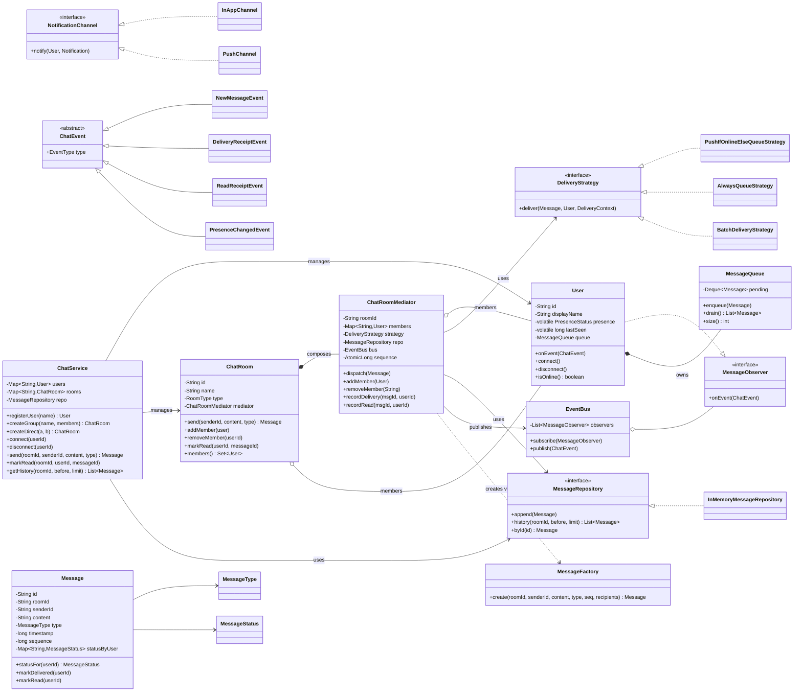
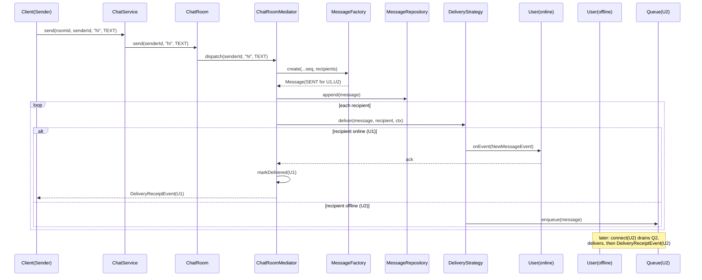

# Chat Application — Low-Level Design

> A staff-engineer-grade LLD / machine-coding reference and last-minute revision artifact.
> Reader: a senior Java engineer who already knows OOP and the GoF patterns and wants to
> see the *right* patterns *applied with justification*, clean SOLID design, and
> production-quality code they can recall under pressure.

---

## PART A — Design Document

### 1. Problem statement

Design the core domain model and in-process engine of a **chat application** (think the
backend object model that powers a WhatsApp / Slack-like product). The system must let
**users** exchange **messages** in **1:1 conversations** and **group chats (rooms)**,
track **delivery and read receipts**, surface **online/offline presence**, persist
**message history**, deliver messages to **online recipients in real time** and **queue
them for offline recipients**, and notify interested observers (UI, push, badge counters)
when messages and status changes occur.

We are designing the **low-level, in-memory object model** — the entities, their
responsibilities, and the interactions between them — not the distributed-systems
plumbing (no Kafka/WebSocket wire protocol, no sharding). Where the distributed concern is
unavoidable (offline delivery, fan-out, ordering), we model the *seam* — the interface
behind which that infrastructure would live — so the design is "production-shaped" without
boiling the ocean.

**Adjacent term — LLD (Low-Level Design):** the class-level design of a single service or
module: entities, interfaces, relationships, and method contracts. Contrast with HLD
(High-Level Design), which is about services, data stores, and network topology.

---

### 2. Clarifying / requirements questions to ask first

A real round opens with questions. I would ask the interviewer the following, grouped, and
*state the assumption I'll proceed with* so the design isn't blocked.

#### Functional scope

1. **Conversation types** — Do we need only 1:1 chat, or also **group chat**? Any
   broadcast/channel (one-to-many, read-only) semantics? → *Assume both 1:1 and group; no
   broadcast channels for now.*
2. **Message types** — Text only, or also media (image/video/file), location, system
   messages ("X joined")? → *Assume a `Message` with a `MessageType` enum so media is a
   payload variation, not a new hierarchy.*
3. **Receipts** — Do we need **delivery receipts** (reached device), **read receipts**
   (opened by recipient), or both? Per-recipient in a group, or aggregate? → *Assume both,
   tracked **per recipient** so group chats show "read by 3 of 5".*
4. **Presence** — Online / offline / away? "Last seen" timestamp? Typing indicators? →
   *Assume Online/Offline/Away + last-seen; typing indicator modeled as a transient event,
   not stored.*
5. **History** — Must we persist and **replay history** when a user opens a conversation?
   Pagination? Search? → *Assume persisted, replayable, paginated by time; full-text search
   out of scope.*
6. **Offline delivery** — If a recipient is offline, do we **queue** and deliver on
   reconnect? Guaranteed delivery / at-least-once? Ordering guarantees? → *Assume per-user
   durable-ish queue with FIFO ordering and at-least-once semantics on reconnect.*
7. **Group management** — Add/remove members, admins, leave group, group metadata
   (name/avatar)? Who can post? → *Assume add/remove/leave, an admin role, all members can
   post.*
8. **Edit / delete / reactions / threads / forwarding?** → *Out of scope for the core;
   listed in extensions (§4) and the design left open to absorb them.*

#### Non-functional

9. **Scale** — Users? Messages/sec? Max group size? (Drives whether fan-out is synchronous
   or via a queue.) → *Assume in-process single node; design the fan-out behind an
   interface so it can move to a broker later.*
10. **Concurrency** — Many threads (connections) reading/writing the same room and user
    inbox concurrently? → *Yes — assume highly concurrent; thread-safety is a first-class
    requirement (see §9).*
11. **Ordering** — Must messages in a conversation be **totally ordered**? → *Assume yes,
    per conversation, via a monotonic sequence + server timestamp.*
12. **Durability** — Is in-memory acceptable for this round, with a `Repository` seam for a
    real DB? → *Assume in-memory store behind a `MessageRepository` interface.*
13. **Latency** — Real-time (push) for online users vs. pull on reconnect? → *Push via
    Observer for online; pull from queue on reconnect.*

#### Scope-narrowing / out of scope

14. Authentication, encryption (E2EE), rate limiting, spam, moderation, multi-device sync,
    and the network/transport layer (WebSocket/HTTP) are **out of scope** but I will note
    the extension seams.

> **Why lead with this:** it demonstrates requirement-driven design, surfaces the
> concurrency and ordering constraints that dominate the data structures, and lets me cut
> scope explicitly rather than silently.

---

### 3. Finalized requirements & assumptions

**In scope (what we build):**

- **Users** with a unique id, display name, and **presence** (ONLINE / OFFLINE / AWAY) +
  last-seen.
- **1:1 conversations** and **group chats**, both modeled as a `ChatRoom` (a 1:1 is just a
  2-member room) coordinated by a **Mediator**.
- **Messages** with id, sender, conversation id, content, type, server timestamp, a
  monotonic per-conversation sequence number, and **per-recipient delivery status**
  (SENT → DELIVERED → READ).
- **Real-time delivery** to online members via an **Observer**-based notification path.
- **Offline delivery** via a **per-user message queue** drained on reconnect (FIFO,
  at-least-once).
- **Delivery & read receipts** tracked per recipient and propagated back to the sender.
- **Message history** persisted in a `MessageRepository` and replayable (paginated).
- **Pluggable delivery strategy** (push-now / queue / batch) chosen at runtime.
- **Thread-safety** for concurrent senders/readers on the same room and user inbox.

**Assumptions:**

- Single JVM, in-memory stores; all infra concerns sit behind interfaces (`Repository`,
  `DeliveryStrategy`, `NotificationChannel`) so they can be swapped for real infra.
- At-least-once delivery; the client de-dupes by message id (idempotent receipts).
- Total ordering is **per conversation**, not global.
- A user is a single logical endpoint (multi-device sync is an extension).

---

### 4. Problem extensions / follow-up variations

These are the realistic follow-ups an interviewer adds. For each: the change and the design
impact. **Senior signal lives here** — show the design *absorbs* change.

| # | Extension | Design impact | Absorbed by |
|---|-----------|---------------|-------------|
| 1 | **Group chat on top of 1:1** | Treat 1:1 as a 2-member room; one `ChatRoom` abstraction. | Already core — the `ChatRoomMediator` coordinates N members; 1:1 is N=2. |
| 2 | **Delivery + read receipts** | Per-recipient status state machine; receipt events flow back to sender. | `MessageStatus` enum + `DeliveryReceipt` events as Observer notifications. |
| 3 | **Online/offline presence** | Presence state + last-seen; affects delivery strategy. | `PresenceStatus` on `User`; `DeliveryStrategy` reads presence to push vs queue. |
| 4 | **Offline delivery / queue drain** | Durable per-user queue; drain on reconnect in FIFO. | `MessageQueue` per user + `connect()` flush; queue behind interface for a real broker. |
| 5 | **Message history + pagination** | Persist every message; replay slices by time/seq. | `MessageRepository.history(roomId, before, limit)`. |
| 6 | **Typing indicators** | Transient, not persisted; fan out to room members. | New `Event` subtype on the same Observer bus; no schema change. |
| 7 | **Edit / delete / unsend** | Messages become mutable or tombstoned; history must reflect edits. | Add `editedAt`/`deleted` flags; emit `MessageEdited` event; repo stores revisions. |
| 8 | **Reactions** | Per-message map of emoji→users. | `Map<emoji, Set<userId>>` on `Message`; `ReactionAdded` event. |
| 9 | **Threads / replies** | `parentMessageId` on `Message`; thread view = filter by parent. | One nullable field; no structural change. |
| 10 | **Push notifications (mobile)** | Notify when recipient offline. | New `NotificationChannel` implementation (push) — Strategy/Observer combo. |
| 11 | **Multi-device sync** | One user, many sessions; deliver to all, sync read state. | `User` owns N `Session`s; fan-out to sessions; read-state CRDT/last-write-wins. |
| 12 | **Encryption (E2EE)** | Server stores ciphertext; receipts unaffected. | `content` becomes opaque bytes; a `MessageEncoder` seam. |
| 13 | **Scale-out fan-out** | Replace in-process Observer dispatch with a broker. | `DeliveryStrategy` / dispatcher interface → Kafka/Redis pub-sub impl. |
| 14 | **Rate limiting / spam** | Pre-send guard. | Chain-of-Responsibility of `SendInterceptor`s before delivery. |

---

### 5. Core entities, responsibilities & relationships

| Entity | Responsibility | Key relationships |
|--------|----------------|-------------------|
| **`User`** | Identity, presence, owns an inbox/queue, observes incoming messages. | Member of many `ChatRoom`s; owns one `MessageQueue`; is a `MessageObserver`. |
| **`ChatRoom`** | A conversation (1:1 or group); holds members & metadata; entry point to send. | Composes a `ChatRoomMediator`; has many `User`s; produces `Message`s. |
| **`ChatRoomMediator`** | **Coordinates** message flow among members so members don't reference each other directly; applies delivery strategy; records history; emits events. | Knows its members (`User`s), a `DeliveryStrategy`, a `MessageRepository`. |
| **`Message`** | Immutable-ish value object: id, sender, room, content, type, timestamp, sequence, per-recipient status map. | Belongs to a `ChatRoom`; references a sender `User`. |
| **`MessageQueue`** | Per-user FIFO buffer of undelivered messages; drained on reconnect. | Owned by a `User`. |
| **`DeliveryStrategy`** | **Decides how** to deliver (push if online, enqueue if offline, batch). | Used by the `ChatRoomMediator`. |
| **`MessageObserver` / event bus** | Push notification of new messages & status changes to subscribers (UI, push). | `User`s and channels subscribe. |
| **`Notification` / `NotificationChannel`** | The thing delivered to an observer (in-app, push, email). | Produced by the delivery path. |
| **`MessageRepository`** | Persist & query message history. | Used by the mediator. |
| **`ChatService` (facade)** | Application entry point: register users, create rooms, connect/disconnect, send, read. | Orchestrates everything above. |

**Relationship summary:**

- `ChatRoom` **composes** a `ChatRoomMediator` (the room can't exist without its
  coordinator).
- `ChatRoom` ↔ `User` is a **many-to-many association** (membership).
- `User` **composes** a `MessageQueue` (lifecycle-bound).
- `Message` **references** a `User` (sender) and a room id (association, not ownership).
- `User` **implements** `MessageObserver` (inheritance/realization of an interface).
- `ChatRoomMediator` **uses** a `DeliveryStrategy` and a `MessageRepository`
  (dependency/aggregation).

---

### 6. Design patterns applied

For each: **where**, **why**, **rejected alternative**, **when *not* to use it.**

#### 6.1 Mediator — group coordination *(primary pattern)*

- **Where:** `ChatRoomMediator` sits between room members. A `User` sends to the room; the
  mediator decides who receives it and how. Members never hold references to each other.
- **Why:** In a group of N members, direct peer references give **N² coupling**. The
  Mediator centralizes the "who talks to whom" logic, so adding a member, changing delivery
  rules, or adding receipts touches one place. This is the canonical chat-room use of
  Mediator (it's literally the GoF motivating example).
- **Rejected alternative:** pure **Observer** with every user subscribed to every other —
  works for broadcast but scatters membership/receipt/ordering logic across users and
  couples them. Mediator keeps coordination cohesive; Observer is still used *inside* it for
  the push notification leg.
- **When *not* to use:** if there's truly no coordination logic (a dumb broadcast bus),
  the Mediator becomes an anemic pass-through — prefer a plain pub/sub. Also beware the
  Mediator turning into a **God object**; we keep it thin by delegating delivery to a
  Strategy and persistence to a Repository.

#### 6.2 Observer — message & status notification

- **Where:** `MessageObserver` (implemented by `User` and notification channels) is notified
  on new messages, delivery receipts, read receipts, and presence changes via an event bus.
- **Why:** The set of things interested in a message (the recipient's UI, a push channel, a
  badge counter, an analytics sink) is **open-ended and decoupled** from sending. Observer
  lets us add subscribers without touching the producer — Open/Closed in action.
- **Rejected alternative:** the mediator directly calling `recipient.deliver(...)` — fine
  for the single in-app case but hard-codes the recipient set and can't fan out to
  push/analytics without edits.
- **When *not* to use:** when there is exactly one, fixed consumer and ordering/back-
  pressure matter — a direct call or an explicit queue is clearer than an event bus.

#### 6.3 Strategy — delivery policy

- **Where:** `DeliveryStrategy` (`PushIfOnlineElseQueueStrategy`, `AlwaysQueueStrategy`,
  `BatchDeliveryStrategy`) chosen by the mediator per message/recipient.
- **Why:** *How* to deliver varies independently of *what* is being delivered: push to
  online users, enqueue for offline, batch for low-priority. Strategy isolates that
  algorithm so we can swap policies (or A/B them) at runtime.
- **Rejected alternative:** `if/else` on presence inside the mediator — works but mixes
  policy with coordination and grows unboundedly as delivery modes multiply (push, queue,
  batch, broker).
- **When *not* to use:** if there's only ever one delivery mode that will never change, a
  Strategy is premature abstraction — inline it.

#### 6.4 Factory (Method) — message & room creation

- **Where:** `MessageFactory` builds `Message`s (assigning id, server timestamp, sequence,
  initializing the per-recipient status map); `ChatRoomFactory` creates 1:1 vs group rooms
  with the right mediator and members.
- **Why:** Construction has invariants (monotonic sequence, immutable timestamp, status map
  seeded for all recipients). Centralizing it prevents half-built messages and keeps the
  sequence generator in one place.
- **Rejected alternative:** public constructors — leak construction invariants to every
  caller and make it easy to forget the status map or sequence.
- **When *not* to use:** for trivial value objects with no invariants, a constructor or
  Builder is enough; don't add a factory just to wrap `new`.

#### 6.5 Facade — `ChatService`

- **Where:** `ChatService` exposes a small surface (`register`, `createRoom`, `connect`,
  `disconnect`, `send`, `markRead`, `getHistory`).
- **Why:** Hides the wiring (mediators, strategies, repos, observers) behind a clean API the
  client (transport layer) calls. Single entry point = single place for cross-cutting guards
  (auth, rate limit) later.
- **Rejected alternative:** clients wiring mediators/strategies themselves — leaks internals
  and couples the transport layer to the domain.
- **When *not* to use:** when the subsystem is already tiny; a facade then just adds a hop.

#### 6.6 State (lightweight) — message lifecycle & presence

- **Where:** `MessageStatus` (SENT → DELIVERED → READ) and `PresenceStatus`
  (ONLINE/AWAY/OFFLINE) are modeled as enums with **legal-transition guards** rather than a
  full State-object hierarchy.
- **Why:** The transitions are few and monotonic; enums with a `canTransitionTo` check give
  the safety of the State pattern without class explosion.
- **Rejected alternative:** a full State pattern (one class per status) — overkill for a
  3-state monotonic machine.
- **When *not* to use:** full State pattern is warranted only when each state has rich,
  divergent behavior.

#### SOLID principles in play

- **SRP:** `ChatRoomMediator` coordinates; `DeliveryStrategy` delivers; `MessageRepository`
  persists; `MessageQueue` buffers. Each has one reason to change.
- **OCP:** new delivery modes (Strategy), new subscribers (Observer), new message types
  (enum + payload), new notification channels — added without modifying existing code.
- **LSP:** every `DeliveryStrategy` and `NotificationChannel` is substitutable behind its
  interface; the mediator never down-casts.
- **ISP:** `MessageObserver` is a narrow interface (just `onEvent`); the repository exposes
  only query/append, not a fat DAO.
- **DIP:** the mediator depends on `DeliveryStrategy`, `MessageRepository`,
  `NotificationChannel` *abstractions* — concrete in-memory/push impls are injected.

---

### 7. Class diagram

#### 7.1 Mermaid `classDiagram`



#### 7.2 Short text UML

```
ChatService (Facade)
 ├─ manages Map<id,User>, Map<id,ChatRoom>
 ├─ uses MessageRepository
 └─ orchestrates connect/disconnect/send/read/history

ChatRoom
 ├─ composes ChatRoomMediator      (1 — composition)
 ├─ associates Users               (* — membership, many-to-many)
 └─ send(...) delegates to mediator.dispatch(...)

ChatRoomMediator (Mediator)
 ├─ members: Map<userId,User>
 ├─ uses DeliveryStrategy          (Strategy)
 ├─ uses MessageRepository         (Repository/DIP)
 ├─ publishes via EventBus         (Observer)
 └─ creates Messages via MessageFactory (Factory)

User  implements MessageObserver
 ├─ owns MessageQueue              (1 — composition)
 ├─ presence: PresenceStatus       (State-lite, volatile)
 └─ onEvent(ChatEvent): render / queue / update badge

Message (value object via MessageFactory)
 └─ statusByUser: Map<userId, MessageStatus>  (per-recipient receipts)

EventBus → fan-out to MessageObserver + NotificationChannel(s)
```

#### 7.3 Key public APIs / method signatures

```java
// Facade
User   registerUser(String displayName);
ChatRoom createGroup(String name, List<String> memberIds);
ChatRoom createDirect(String userA, String userB);
void   connect(String userId);          // flips presence ONLINE + drains queue
void   disconnect(String userId);        // flips presence OFFLINE + last-seen
Message send(String roomId, String senderId, String content, MessageType type);
void   markRead(String roomId, String userId, String messageId);
List<Message> getHistory(String roomId, long beforeTimestamp, int limit);

// Strategy
void deliver(Message msg, User recipient, DeliveryContext ctx);

// Observer
void onEvent(ChatEvent event);

// Repository
void append(Message m);
List<Message> history(String roomId, long before, int limit);
Optional<Message> byId(String id);
```

---

### 8. Key flows

#### 8.1 Send a message (group, mixed online/offline) — steps

1. Transport layer calls `chatService.send(roomId, senderId, content, type)`.
2. `ChatService` resolves the `ChatRoom`; `room.send(...)` delegates to its
   `ChatRoomMediator`.
3. Mediator validates the sender is a member, asks `MessageFactory` to build the `Message`
   (assigns id, server timestamp, **next monotonic sequence**, seeds `statusByUser=SENT` for
   every recipient).
4. Mediator `repo.append(message)` — history persisted *before* fan-out (so history is the
   source of truth even if delivery fails).
5. For each recipient (excluding sender), mediator invokes the `DeliveryStrategy`:
   - **Online** → push a `NewMessageEvent` onto the `EventBus`; recipient's `onEvent`
     renders it and the mediator records **DELIVERED**, emitting a `DeliveryReceiptEvent`
     back to the sender.
   - **Offline** → `recipient.queue.enqueue(message)`; status stays **SENT**.
6. The sender receives delivery receipts as recipients are reached.

#### 8.2 Reconnect & offline drain — steps

1. `chatService.connect(userId)` sets presence ONLINE.
2. The user's `MessageQueue.drain()` returns pending messages in FIFO order.
3. Each is delivered via the Observer path; mediator records **DELIVERED** and emits
   receipts. Ordering preserved by the queue + per-conversation sequence.

#### 8.3 Read receipt — steps

1. UI calls `chatService.markRead(roomId, userId, messageId)`.
2. Mediator transitions that message's status for `userId` SENT/DELIVERED → **READ**
   (guarded; READ is terminal) and emits a `ReadReceiptEvent` to the sender.

#### 8.4 Sequence diagram — send with one online, one offline recipient



---

### 9. Concurrency, edge cases & extensibility

#### 9.1 Concurrency / thread-safety

The dominant concurrency risk: **many threads (connections) send into the same room and
mutate the same user inbox simultaneously.** Decisions:

- **Membership map** in the mediator: `ConcurrentHashMap<String,User>` — safe iteration for
  fan-out while members join/leave.
- **Sequence generator:** `AtomicLong` per mediator → lock-free, gives a **total order per
  conversation** without a global lock.
- **`MessageQueue`:** backed by a thread-safe deque (e.g.
  `ConcurrentLinkedDeque` / a synchronized `ArrayDeque`); `drain()` is atomic-ish — we
  snapshot-and-clear under the queue's lock so a concurrent `enqueue` during reconnect isn't
  lost.
- **Per-recipient status map** on `Message`: `ConcurrentHashMap<String,MessageStatus>`;
  transitions use **`compute`/`merge` with a legal-transition guard** so concurrent
  DELIVERED and READ don't regress state (READ is terminal, never overwritten by DELIVERED).
- **Presence fields** (`presence`, `lastSeen`): `volatile` so a concurrent sender observes
  the latest state when choosing push-vs-queue. There's an inherent **TOCTOU race** (user
  goes offline *after* we read ONLINE) — accepted, because the Observer push will simply
  fail/no-op and we rely on at-least-once + client de-dup; alternatively the strategy can
  re-check and fall back to the queue.
- **EventBus:** observer list is a `CopyOnWriteArrayList` — cheap, safe iteration during
  publish while subscribers come and go (subscriber churn is rare vs. publishes).
- **Repository:** `append` and `history` synchronized per room (or a concurrent structure
  keyed by room) so history reads see a consistent prefix.

We deliberately avoid one global lock; locks are **scoped to the contended structure**
(room map, queue, status map) to preserve throughput.

#### 9.2 Edge cases

- **Send to a room you're not a member of** → reject (membership check in mediator).
- **Send to an empty / single-member room** → message persisted, no recipients to deliver.
- **Recipient goes offline mid-fan-out** → strategy falls back to enqueue (or relies on
  at-least-once retry).
- **Duplicate delivery** (at-least-once) → client de-dups by message id; receipt transitions
  are idempotent.
- **Read before delivered** (out-of-order receipt) → guard allows SENT→READ; we don't
  require passing through DELIVERED.
- **Member removed while message in flight** → message already persisted in history; we stop
  delivering to a removed member; their queue is not drained for that room.
- **Reconnect with thousands of queued messages** → `drain()` returns a batch; deliver in
  order; consider `BatchDeliveryStrategy` to avoid event-storm.
- **Self-message / sending to self** → sender excluded from recipients for receipts;
  optionally echoed for multi-device.
- **Clock skew** → use a server-assigned timestamp + monotonic sequence; ordering relies on
  sequence, not wall-clock.

#### 9.3 Extensibility (how the design absorbs §4)

- New **message types** (image, system) → add an enum value + payload; factory unchanged in
  shape.
- New **delivery mode** (broker fan-out) → new `DeliveryStrategy` impl; mediator untouched
  (OCP).
- New **subscribers** (push, analytics, badge) → new `MessageObserver` /
  `NotificationChannel`; producer untouched (OCP).
- **Typing/reactions/edits** → new `ChatEvent` subtypes on the same bus; no structural
  change to delivery.
- **Multi-device** → `User` gains N `Session`s; fan-out target changes from user→sessions;
  the Observer leg already supports multiple subscribers.
- **Real DB** → swap `InMemoryMessageRepository` for a JDBC/NoSQL impl behind the same
  interface (DIP).

---

### 10. Likely interview questions

> Crisp model answers; **(SR)** = senior-signal. Deep-probe follow-ups indented.

1. **Why Mediator for the chat room rather than Observer everywhere? (SR)**
   Direct peer references give N² coupling and scatter membership/receipt/ordering logic
   across users. The Mediator centralizes coordination (who receives, in what order, with
   what receipts) in one cohesive place; Observer is still used *inside* it for the push
   notification leg. Mediator owns *coordination*; Observer owns *fan-out notification*.
   - *Probe: when does Mediator become an anti-pattern?* When it grows into a God object —
     mitigated by delegating delivery to Strategy and persistence to Repository, keeping it
     thin.
   - *Probe: 1:1 vs group — same abstraction?* Yes; 1:1 is a 2-member room, no special case.

2. **How do you guarantee message ordering?**
   Per-conversation total order via an `AtomicLong` sequence assigned at the mediator at
   send time, plus a server timestamp. Consumers order by sequence, not wall-clock, so clock
   skew and concurrent sends don't reorder.
   - *Probe: global ordering across rooms?* Not provided and rarely needed; would require a
     global sequencer/Lamport clocks — expensive and usually unnecessary.

3. **Walk through offline delivery.**
   On send, the `DeliveryStrategy` checks recipient presence; offline → `MessageQueue.enqueue`,
   status stays SENT. On `connect`, presence flips ONLINE and the queue is **drained FIFO**,
   each message delivered via the Observer path, then DELIVERED receipts emitted.
   - *Probe: durability if the JVM dies?* The queue is behind an interface — back it with a
     durable broker (Kafka/Redis Streams) or DB for at-least-once across restarts.

4. **How are read/delivery receipts modeled, especially in groups?**
   Each `Message` has `statusByUser: Map<userId, MessageStatus>` (SENT→DELIVERED→READ). A
   group "read by 3 of 5" is just counting READ entries. Transitions are guarded
   (READ terminal) and idempotent for at-least-once safety.
   - *Probe: privacy (hide read receipts)?* Per-user setting filters the
     `ReadReceiptEvent` at the mediator before publishing.

5. **Where exactly is the Strategy pattern, and what does it buy you? (SR)**
   `DeliveryStrategy` isolates *how* to deliver (push-if-online-else-queue, always-queue,
   batch) from the mediator's *coordination*. New modes (broker fan-out) are new impls — the
   mediator never changes (OCP). The rejected `if/else` on presence mixes policy with
   coordination and grows unboundedly.
   - *Probe: who chooses the strategy?* Injected per room (or per message via a
     `DeliveryContext`), enabling A/B and per-tier policy.

6. **How is the design thread-safe under heavy concurrency? (SR)**
   Scoped concurrency, not a global lock: `ConcurrentHashMap` membership, `AtomicLong`
   sequence, thread-safe queue with atomic drain, `ConcurrentHashMap` status map with
   guarded `compute` transitions, `volatile` presence, `CopyOnWriteArrayList` observers.
   Locks are scoped to the contended structure to preserve throughput.
   - *Probe: the presence TOCTOU race?* User goes offline after we read ONLINE — accepted
     via at-least-once + client de-dup, or the strategy re-checks and falls back to queue.

7. **How would you add typing indicators / reactions / edits without rework?**
   They become new `ChatEvent` subtypes on the existing Observer bus (typing transient,
   reactions a `Map<emoji,Set<user>>` on `Message`, edits an `editedAt`/tombstone flag).
   Delivery and coordination are unchanged.
   - *Probe: history of edits?* Repository stores revisions; `MessageEdited` event carries
     the new content and a version.

8. **Why a Factory for messages?**
   Construction has invariants: unique id, server timestamp, monotonic sequence, and a
   status map seeded for every recipient. The factory centralizes those so no caller can
   produce a half-built message.
   - *Probe: Factory vs Builder?* Builder fits many optional fields; here the invariants are
     mandatory and computed, so a factory method is cleaner.

9. **How do you scale fan-out from one JVM to millions of users? (SR)**
   The in-process Observer dispatch is behind the `DeliveryStrategy`/dispatcher seam. Swap it
   for a broker (Kafka/Redis pub-sub) and shard rooms; the domain model (Message, receipts,
   ordering by sequence) is unchanged. Presence moves to a presence service; queues become
   durable streams.
   - *Probe: exactly-once?* Practically at-least-once + idempotent receipts and client de-dup;
     exactly-once is prohibitively expensive end-to-end.

10. **What are the main failure modes and how do you handle them?**
    Delivery failure (recipient offline mid-push) → fall back to queue + retry; duplicate
    delivery → idempotent receipts + client de-dup; out-of-order receipts → guarded
    transitions; JVM crash → durable repo/queue seam. History is persisted *before* fan-out so
    it's authoritative even if delivery fails.
    - *Probe: back-pressure on a slow consumer?* Bounded queue + batch strategy; drop-to-push-
      notification when the queue is saturated.

---

## PART C — Cheat-sheet & self-test

### Patterns & key decisions recap

- **Mediator** (`ChatRoomMediator`) — central room coordination; avoids N² peer coupling;
  kept thin by delegating to Strategy/Repository.
- **Observer** (`MessageObserver` + `EventBus`) — decoupled fan-out of messages, receipts,
  and presence to UI/push/analytics (OCP for new subscribers).
- **Strategy** (`DeliveryStrategy`) — push-if-online-else-queue / always-queue / batch;
  delivery policy swappable without touching coordination.
- **Factory** (`MessageFactory`, `ChatRoomFactory`) — enforces construction invariants
  (id, timestamp, sequence, seeded status map).
- **Facade** (`ChatService`) — single clean entry point; home for future cross-cutting
  guards.
- **State-lite** (enums `MessageStatus`, `PresenceStatus` with guarded transitions) — safe
  lifecycle without class explosion.
- **Concurrency:** scoped locking — `ConcurrentHashMap`, `AtomicLong` sequence, thread-safe
  queue with atomic drain, `CopyOnWriteArrayList` observers, `volatile` presence.
- **Seams for scale:** `MessageRepository`, `DeliveryStrategy`, `NotificationChannel`,
  `MessageQueue` are interfaces so in-memory impls swap for DB/broker/push.
- **Ordering:** per-conversation total order via monotonic sequence; consumers order by
  sequence, not wall-clock.

### 5 self-test questions (no answers)

1. Draw the line between the Mediator's responsibilities and the Strategy's — where would
   you put logic that decides *to whom* vs *how* a message is delivered, and why?
2. A group has 50,000 members and one sender posts; the in-process Observer fan-out blocks
   the sender thread. What concretely changes in your design, and which interfaces stay
   intact?
3. Two threads call `markRead` and `markDelivered` for the same (message, user) at the same
   instant. Show the exact code path that prevents the status from regressing.
4. How would you add multi-device support so one user reads on the phone and the laptop
   reflects it within seconds — which entities gain fields, and which patterns absorb it?
5. Your `drain()` on reconnect and a concurrent `enqueue` from a new message race. Describe
   a queue implementation and drain protocol that loses no message and preserves FIFO.
