# Online Auction System — Low-Level Design

> A staff-level LLD / machine-coding reference and last-minute revision artifact.
> Problem: design an **Online Auction System** (eBay-style) supporting items, sellers, bidders, live bidding, real-time notifications, proxy/auto-bidding, anti-snipe extension, reserve prices, winner determination, and payment hand-off.

---

## PART A — Design Document

### 1. Problem statement

Design an **Online Auction System**. Sellers list **items** for auction with a starting price (and optionally a reserve price and a fixed end time). **Bidders** place bids on a live auction; each bid must beat the current highest bid by at least a configured increment. When the auction ends, the system determines the **winner** (highest valid bid at or above the reserve), notifies all interested parties in real time, and hands the result off to a **payment** flow.

The system must:
- Manage the **lifecycle** of an auction (Draft → Open → maybe Extended → Closed → Paid / Cancelled).
- Enforce **bidding rules** (minimum increment, reserve price, self-outbid prevention) via a pluggable strategy.
- Support **proxy / auto-bidding** ("max bid" — the system bids on your behalf up to a ceiling).
- Push **real-time bid updates** to watchers (observers).
- Handle **concurrency**: many bidders racing to be highest on the same auction; only one consistent "current highest" must survive, with no lost updates and no double-winning.
- Support **anti-snipe** auction extension (bids in the final seconds push the end time out).

This is fundamentally a **mutable shared-state-under-contention** problem (the auction's highest bid) wrapped in a **lifecycle state machine**, with **event fan-out** to subscribers — which is why Observer + State + Strategy are the natural pattern trio, plus careful locking.

> *Inline term — "snipe":* placing a winning bid in the final seconds so other bidders have no time to respond. "Anti-snipe" rules extend the auction when a late bid lands, giving everyone a fair chance.

---

### 2. Clarifying / requirements questions to ask first

A senior candidate opens the round by scoping. Ask before writing any class:

**Functional scope**
1. Single auction format, or multiple? (English ascending-price is the default; do we also need Dutch (descending), sealed-bid, or Vickrey/second-price?) → I'll build **English** with the rule engine pluggable so others drop in.
2. Is there a **reserve price** (a secret minimum below which the seller is not obliged to sell)? Should bidders see whether the reserve is met?
3. Do we need **proxy / auto-bidding** (a bidder sets a max and the system bids incrementally on their behalf)?
4. **Anti-snipe**: should a late bid extend the auction end time? By how much, and is there a cap on extensions?
5. **Buy-it-now** price (instantly ends the auction)? In scope?
6. Can a seller **cancel** an auction? Before bids? After bids? Can a bidder **retract** a bid?
7. Winner determination: highest bid at/above reserve. What if reserve not met — no sale, relist, or sell to highest anyway?
8. Is **payment** in scope, or do we just emit a "winner determined" event and hand off to a payment service?

**Non-functional / scale**
9. Expected concurrency on a single hot auction — tens of bids/sec? thousands? (Determines lock granularity / whether we need optimistic concurrency or a queue.)
10. Is this a **single process / in-memory** machine-coding exercise, or distributed (multiple app servers)? → I'll design single-JVM thread-safe, and note the distributed extension (DB row lock / version column / event log).
11. Latency expectations for the "you've been outbid" notification — real-time (push) or eventual (poll)?
12. Durability — must bids survive a crash? (In-memory for the exercise; pluggable repository for persistence.)

**Scope-narrowing / out-of-scope**
13. Auth/identity, catalog search, ratings/reviews, shipping, fraud detection — out of scope unless asked.
14. Money math / currencies — assume a single currency, integer minor units (cents) to avoid floating-point errors.
15. Time source — assume an injectable `Clock` so tests/demos are deterministic.

**Assumed answers (stated so the design is concrete):** English auction; reserve price supported and hidden; proxy bidding supported; anti-snipe with a per-extension window and a max-extension cap; no buy-it-now (noted as an extension); seller may cancel only before the first bid; no bid retraction; reserve-not-met → no sale; payment is an out-of-process hand-off via an event; single-JVM, thread-safe, in-memory with a repository seam.

---

### 3. Finalized requirements & assumptions

**Functional**
- Seller creates an auction for an item with: start price, bid increment, reserve price (optional), start time, end time.
- Auction lifecycle: `DRAFT → OPEN → CLOSED → (SOLD | UNSOLD)`; plus `CANCELLED` from DRAFT/OPEN-with-no-bids. `OPEN` may be **extended** (anti-snipe) without changing state.
- Bidders place bids while `OPEN`. A bid is valid iff: amount ≥ currentHighest + increment (or ≥ startPrice if no bids), bidder ≠ current highest bidder, auction is OPEN, time is within window.
- **Proxy bidding**: a bidder submits a *max* amount; the engine places the minimum bid needed to lead and auto-counters rivals up to that max.
- **Anti-snipe**: a valid bid arriving within `antiSnipeWindow` of end time pushes the end time out by `extensionBy`, up to `maxExtensions`.
- On close: highest valid bid ≥ reserve ⇒ `SOLD` to that bidder; else `UNSOLD`. Emit a domain event either way.
- Observers (watchers, the seller, the leading/outbid bidders, an audit logger) get real-time notifications.

**Non-functional**
- Thread-safe under concurrent bids; **no lost updates, no two winners, no stale highest**.
- Money in integer **cents** (`long`). Time via injectable `Clock`.
- Extensible: new auction types / bid rules / notification channels added without editing core (`OCP`).
- In-memory repositories behind interfaces (persistence seam).

**Out of scope:** auth, search, shipping, real payment rails (only the hand-off event), multi-currency, distributed consensus.

---

### 4. Problem extensions / follow-up variations

Interviewers pile these on. Each row says **what changes**.

| # | Extension | Design impact |
|---|-----------|---------------|
| 1 | **Real-time bid notifications** | Already via Observer. Add channel-specific `BidObserver` impls (WebSocket push, email, SMS). Decouple delivery with an async dispatcher (queue + worker) so a slow channel can't block the bid path. |
| 2 | **Highest-bid concurrency / race handling** | Core concern. Per-auction lock (or `compareAndSet` on an immutable `HighestBid` snapshot via `AtomicReference`) guarantees a single serialized winner per round. Covered in §9. |
| 3 | **Auto-bidding (proxy bids)** | Add a `ProxyBid` (max amount) registry per auction. After any bid, run a **resolution loop**: the highest max wins, placed at (second-highest max + increment), capped at its max. Pure strategy logic, isolated in `ProxyBidResolver`. |
| 4 | **Auction timing / extension (anti-snipe)** | `AntiSnipePolicy` interface invoked on each accepted bid; mutates `endTime` under the same lock. Cap via `maxExtensions`. Swappable (no-extend vs fixed-window vs decaying). |
| 5 | **Reserve price** | Stored on auction, used only at close in winner determination. Bidders see "reserve met / not met" flag, never the value. |
| 6 | **Winner determination** | Strategy at close: English = highest ≥ reserve. Vickrey/second-price = winner is highest bidder but pays second-highest price → swap `WinnerStrategy`. |
| 7 | **Payments** | On `SOLD`, emit `AuctionWonEvent`; a `PaymentObserver`/saga creates an invoice and listens for payment confirmation. Auction → `PAID` or `PAYMENT_FAILED → relist`. Keep payment out of the auction core (SRP). |
| 8 | **Buy-it-now** | Optional price; a buy-now action atomically closes the auction → SOLD. Reuses the lifecycle lock. |
| 9 | **Bid retraction / seller cancel** | Add guarded state transitions; cancel allowed only with zero bids; retraction recomputes highest (expensive — keep a bid history). |
| 10 | **Dutch / sealed-bid auctions** | New `Auction` subtype + `BidValidationStrategy` + `WinnerStrategy`; Observer/State scaffolding unchanged — demonstrates the patterns paying off. |
| 11 | **Distributed (multi-server)** | Replace in-JVM lock with DB optimistic concurrency (`version` column / `WHERE highest_amount < ?`) or a per-auction partition (Kafka key = auctionId → single-writer). Notifications via a real broker. |
| 12 | **Scheduled auto-close** | A `Clock`-driven scheduler (`ScheduledExecutorService`) closes auctions at `endTime`; in the exercise we expose `closeIfDue(now)`. |

---

### 5. Core entities, responsibilities & relationships

| Entity | Responsibility | Notable relationships |
|--------|----------------|-----------------------|
| `Item` | Immutable description of what's sold (id, title, desc). | Owned by an `Auction`. |
| `User` | A person; specialized as `Seller` / `Bidder` by role (we model role via usage, not class hierarchy, to avoid rigid inheritance). | Sellers create auctions; bidders place bids. |
| `Bid` | Immutable value object: who, how much (cents), when. | Belongs to one `Auction`. |
| `ProxyBid` | A bidder's standing max for an auction. | Held by `Auction`'s proxy registry. |
| `Auction` | **Aggregate root.** Holds item, money rules, reserve, time window, current highest, bid history, proxy registry, lifecycle **state**, observers. Enforces all invariants under its lock. | Composes `Item`, `Bid`s, `AuctionState`, strategies, observers. |
| `AuctionState` | State pattern: `DraftState`, `OpenState`, `ClosedState`, `CancelledState`. Each permits/denies transitions and bids. | Owned by `Auction`. |
| `BidValidationStrategy` | Pluggable rule for "is this bid acceptable?" (increment, self-outbid). | Used by `Auction`. |
| `WinnerStrategy` | Decide winner & price at close (English / Vickrey). | Used by `Auction`. |
| `AntiSnipePolicy` | Decide whether/how to extend `endTime` on a late bid. | Used by `Auction`. |
| `ProxyBidResolver` | After a manual bid, resolve standing proxies into the new highest. | Used by `Auction`. |
| `BidObserver` (Observer) | React to `BidEvent` / lifecycle events (push, email, audit, payment). | Registered on `Auction` (or service). |
| `AuctionService` | Facade / application layer: create auction, place bid, register watcher, tick/close. Hides wiring; coordinates repositories. | Uses `AuctionRepository`, `UserRepository`. |
| `*Repository` | Persistence seam (in-memory here). | — |

**Relationships in words:** `AuctionService` *uses* repositories and *coordinates* `Auction`s (association). An `Auction` *composes* one `Item`, many `Bid`s, one current `AuctionState`, and registers many `BidObserver`s (composition / observer registration). `Auction` *uses* `BidValidationStrategy`, `WinnerStrategy`, `AntiSnipePolicy`, `ProxyBidResolver` (strategy association). `AuctionState` subclasses *inherit* the `AuctionState` interface.

---

### 6. Design patterns applied

> Principle: **apply, justify, name the rejected alternative, and say when *not* to use it.** No pattern-stuffing.

**1. State — auction lifecycle (`AuctionState` → Draft/Open/Closed/Cancelled).**
- *Why:* behavior of `placeBid`, `close`, `cancel` differs entirely by lifecycle phase. State localizes "what's legal now" into one class per phase and makes illegal transitions impossible instead of scattering `if (status == ...)` checks across the aggregate.
- *Rejected:* a single `enum status` + giant `switch`. Fine for 2 states; becomes a god-method and violates OCP as states grow (we have 4 + extension states like PAID).
- *When not:* if there are only two states and transitions never grow, an enum guard is simpler — don't gold-plate.

**2. Strategy — bidding rules, winner determination, anti-snipe (`BidValidationStrategy`, `WinnerStrategy`, `AntiSnipePolicy`).**
- *Why:* these are the **variation points** the interviewer attacks (Vickrey, no-extend vs anti-snipe, different increments). Strategy lets us swap an algorithm per auction without touching `Auction` (OCP). Each strategy is independently testable.
- *Rejected:* inheritance — an `EnglishAuction`/`VickreyAuction` subclass per combination. That explodes combinatorially (auction type × extension policy × increment rule) and couples orthogonal concerns. Strategy composes them independently.
- *When not:* if there will only ever be one rule set, a Strategy interface is ceremony; inline the rule.

**3. Observer — real-time bid updates (`BidObserver` / `Auction` as subject).**
- *Why:* watchers, the seller, the outbid bidder, an audit log, and a payment saga all need to react to bid/lifecycle events with no coupling from `Auction` back to them. New channels register without editing the auction (OCP, DIP).
- *Rejected:* `Auction` directly calling `emailService`, `wsService`, … — tight coupling, untestable, violates SRP and DIP.
- *When not:* if there is exactly one consumer and it never changes, a direct call is fine.

**4. Facade — `AuctionService`.**
- *Why:* gives clients (controllers, the demo `main`) one coherent API (create, bid, watch, close) and hides the wiring of repositories, locks, strategies. Reduces coupling to internals.
- *Rejected:* exposing `Auction` internals to callers — leaks invariants and makes refactoring hard.

**5. Factory Method — `AuctionFactory` / builder for auctions.**
- *Why:* constructing an `Auction` needs item, money rules, reserve, window, default strategies, initial `DraftState` — centralizing avoids inconsistent objects and lets us choose subtype/strategy set in one place. (Implemented as a fluent **Builder** to handle many optional params readably — Builder is the chosen variant here because of the optional reserve/anti-snipe params.)
- *Rejected:* telescoping constructors — unreadable and error-prone with 6+ params.

**6. Value Object / Immutability — `Bid`, `Item`, `Money` (cents as `long`).**
- *Why:* immutable `Bid` snapshots are safe to publish to observers and share across threads without defensive copies; immutability is the cheapest concurrency tool.

**(Considered & deliberately NOT used)**
- *Command* for bids: a `PlaceBidCommand` would help if we needed undo/queueing/audit-replay. We note it as the path for **bid retraction / event sourcing**, but plain method calls suffice now — avoid speculative generality (YAGNI).
- *Singleton* for the service: avoided; we inject the service so it's testable. Singletons hide dependencies and fight concurrency tests.

**SOLID in play**
- **S**RP: `Auction` owns invariants; notification lives in observers; persistence in repositories; rules in strategies.
- **O**CP: new auction type / channel / rule = new class, core untouched (State + Strategy + Observer).
- **L**SP: every `AuctionState` and `BidValidationStrategy` is substitutable behind its interface; subtypes never strengthen preconditions.
- **I**SP: small focused interfaces (`BidObserver`, `AntiSnipePolicy`) instead of one fat listener.
- **D**IP: `Auction`/`AuctionService` depend on abstractions (strategies, repositories, observers), not concretes; concretes are injected.

---

### 7. Class diagram

```mermaid
classDiagram
    class AuctionService {
        -AuctionRepository auctionRepo
        -UserRepository userRepo
        -Clock clock
        +createAuction(AuctionSpec) String
        +open(String auctionId)
        +placeBid(String auctionId, String bidderId, long amountCents) BidResult
        +placeProxyBid(String auctionId, String bidderId, long maxCents) BidResult
        +watch(String auctionId, BidObserver obs)
        +closeIfDue(String auctionId) AuctionOutcome
        +forceClose(String auctionId) AuctionOutcome
    }

    class Auction {
        -String id
        -Item item
        -String sellerId
        -long startPriceCents
        -long incrementCents
        -long reserveCents
        -Instant startTime
        -Instant endTime
        -AuctionState state
        -AtomicReference~HighestBid~ highest
        -List~Bid~ history
        -Map~String,ProxyBid~ proxies
        -List~BidObserver~ observers
        -BidValidationStrategy validation
        -WinnerStrategy winnerStrategy
        -AntiSnipePolicy antiSnipe
        -ProxyBidResolver proxyResolver
        -ReentrantLock lock
        +placeBid(String bidderId, long amount, Instant now) BidResult
        +placeProxyBid(String bidderId, long max, Instant now) BidResult
        +close(Instant now) AuctionOutcome
        +cancel()
        +addObserver(BidObserver)
        -notifyAll(AuctionEvent)
    }

    class AuctionState {
        <<interface>>
        +placeBid(Auction, ...) BidResult
        +close(Auction, Instant) AuctionOutcome
        +cancel(Auction)
        +name() String
    }
    class DraftState
    class OpenState
    class ClosedState
    class CancelledState

    class BidValidationStrategy {
        <<interface>>
        +validate(Auction, String bidderId, long amount, Instant now) ValidationResult
    }
    class MinIncrementValidation

    class WinnerStrategy {
        <<interface>>
        +determine(Auction) AuctionOutcome
    }
    class EnglishWinnerStrategy
    class VickreyWinnerStrategy

    class AntiSnipePolicy {
        <<interface>>
        +maybeExtend(Auction, Instant now) Instant
    }
    class NoExtensionPolicy
    class FixedWindowAntiSnipe

    class ProxyBidResolver {
        +resolve(Auction, Instant now) BidResult
    }

    class BidObserver {
        <<interface>>
        +onEvent(AuctionEvent)
    }
    class ConsoleAuditObserver
    class OutbidNotifier
    class PaymentObserver

    class Bid {
        +String bidderId
        +long amountCents
        +Instant time
    }
    class ProxyBid {
        +String bidderId
        +long maxCents
        +Instant time
    }
    class Item {
        +String id
        +String title
    }
    class HighestBid {
        +String bidderId
        +long amountCents
    }

    class AuctionRepository {
        <<interface>>
    }
    class UserRepository {
        <<interface>>
    }

    AuctionService --> AuctionRepository
    AuctionService --> UserRepository
    AuctionService ..> Auction : coordinates
    Auction *-- Item
    Auction *-- Bid : history
    Auction *-- ProxyBid : registry
    Auction *-- AuctionState
    Auction o-- BidObserver
    Auction --> BidValidationStrategy
    Auction --> WinnerStrategy
    Auction --> AntiSnipePolicy
    Auction --> ProxyBidResolver
    Auction --> HighestBid
    AuctionState <|.. DraftState
    AuctionState <|.. OpenState
    AuctionState <|.. ClosedState
    AuctionState <|.. CancelledState
    BidValidationStrategy <|.. MinIncrementValidation
    WinnerStrategy <|.. EnglishWinnerStrategy
    WinnerStrategy <|.. VickreyWinnerStrategy
    AntiSnipePolicy <|.. NoExtensionPolicy
    AntiSnipePolicy <|.. FixedWindowAntiSnipe
    BidObserver <|.. ConsoleAuditObserver
    BidObserver <|.. OutbidNotifier
    BidObserver <|.. PaymentObserver
```



**Brief text UML**
- `AuctionService` ──uses──▷ `AuctionRepository`, `UserRepository`; coordinates `Auction`.
- `Auction` ◆──composes──▷ `Item`, `Bid[]` (history), `ProxyBid[]`, current `AuctionState`, registered `BidObserver[]`.
- `Auction` ──uses (strategy)──▷ `BidValidationStrategy`, `WinnerStrategy`, `AntiSnipePolicy`, `ProxyBidResolver`.
- `AuctionState` ◁──implements── `Draft/Open/Closed/Cancelled`.
- `BidObserver` ◁──implements── `ConsoleAudit/OutbidNotifier/Payment`.

**Key public APIs**
```java
String createAuction(AuctionSpec spec);
void   open(String auctionId);
BidResult placeBid(String auctionId, String bidderId, long amountCents);
BidResult placeProxyBid(String auctionId, String bidderId, long maxCents);
void   watch(String auctionId, BidObserver observer);
AuctionOutcome closeIfDue(String auctionId);   // closes only if now >= endTime
AuctionOutcome forceClose(String auctionId);   // admin/scheduler close
```

---

### 8. Key flows

**Flow A — place a (manual) bid (the hot path):**
1. `AuctionService.placeBid` looks up the `Auction` (repo) and the bidder (repo); rejects unknowns.
2. Delegates to `auction.placeBid(...)`, which **acquires the auction lock** (per-auction `ReentrantLock`).
3. Current `AuctionState.placeBid` runs. `OpenState`:
   a. Checks time window (`now` within `[start,end]`); if past end → triggers `close`.
   b. Runs `BidValidationStrategy.validate` (≥ highest+increment, not self-outbid).
   c. On success: appends to history, **atomically** sets new `HighestBid`.
   d. Runs `ProxyBidResolver.resolve` — standing proxies may immediately counter, looping until a stable highest.
   e. Runs `AntiSnipePolicy.maybeExtend` — if `now` within window of `endTime`, push `endTime` out (capped).
   f. `notifyAll(BidPlacedEvent)` → observers (audit, outbid notifier, payment-saga ignores).
4. Lock released; returns `BidResult` (accepted + new highest, or rejected + reason).

**Flow B — close & winner determination:**
1. `closeIfDue` (scheduler/poll) or `forceClose` → `auction.close(now)` under lock.
2. `OpenState.close` transitions to `ClosedState`, runs `WinnerStrategy.determine`.
3. English: highest bid present and `amount ≥ reserve` ⇒ `SOLD(winner, price=amount)`; else `UNSOLD`.
4. Emit `AuctionClosedEvent` then (if sold) `AuctionWonEvent`. `PaymentObserver` reacts → invoice.

```mermaid
sequenceDiagram
    participant B as Bidder
    participant S as AuctionService
    participant A as Auction (locked)
    participant V as ValidationStrategy
    participant P as ProxyResolver
    participant N as Anti-SnipePolicy
    participant O as Observers
    B->>S: placeBid(auctionId, bidderId, amount)
    S->>A: placeBid(bidderId, amount, now)
    A->>A: lock()
    A->>V: validate(...)
    V-->>A: OK / reject(reason)
    A->>A: history.add; highest.set(new)
    A->>P: resolve(now)  %% proxies may counter
    P-->>A: possibly new highest
    A->>N: maybeExtend(now)
    N-->>A: new endTime (maybe extended)
    A->>O: onEvent(BidPlacedEvent)
    A->>A: unlock()
    A-->>S: BidResult(accepted, highest)
    S-->>B: BidResult
```

---

### 9. Concurrency, edge cases & extensibility

**Concurrency — the heart of this problem.**
- **Unit of contention** = a single `Auction`'s highest bid. Different auctions are independent, so we lock **per auction** (a `ReentrantLock` field, not a global lock) → maximal parallelism across auctions.
- The whole "validate → append → set highest → resolve proxies → maybe extend → notify" sequence runs **inside the lock**. This makes each bid a **serialized critical section**, so:
  - **No lost updates:** two bids of the same amount can't both win; the second sees the first's highest and is rejected (or must exceed it).
  - **No two winners:** close also takes the lock, so it can't interleave mid-bid.
  - **No stale read:** `highest` is published via `AtomicReference<HighestBid>` (immutable snapshot) so even reads outside the lock see a consistent object, never a torn one.
- **Why not just `AtomicReference.compareAndSet` and skip the lock?** A bid isn't a single CAS — it must validate, append history, resolve proxies, and extend time *atomically together*. A lone CAS on the amount can't keep those in sync; you'd get a higher `highest` with history/proxy state lagging. The lock keeps the *compound* invariant. (For a pure highest-only model with no proxies/history, a CAS-retry loop would be the lighter choice — call that out.)
- **Notification off the hot path:** doing email/WebSocket I/O inside the lock would serialize and slow every bid. Production fix: observers enqueue to an async dispatcher (`BlockingQueue` + worker pool); the lock only publishes the event object. Noted in code comments.
- **Distributed version:** replace the JVM lock with (a) DB optimistic concurrency — `UPDATE ... SET highest=? , version=version+1 WHERE id=? AND version=?` retried on miss; or (b) single-writer per auction via a partitioned log (Kafka key = auctionId). Same invariants, different enforcement layer.

**Edge cases handled**
- Bid below start price / below highest+increment → rejected with reason.
- Self-outbid (you're already highest) → rejected (no point, prevents accidental ratcheting).
- Bid after `endTime` → auction auto-closes; bid rejected as "auction closed".
- Bid on `DRAFT`/`CLOSED`/`CANCELLED` → rejected by the State object.
- Reserve not met at close → `UNSOLD` even with bids.
- Proxy ties (two bidders with equal max) → earlier proxy (by timestamp) wins at its max; rival can't beat an equal amount due to increment rule.
- Anti-snipe extension cap → after `maxExtensions`, late bids no longer extend.
- Unknown auction / bidder → service-level rejection.
- Money: integer cents avoids float drift; negative/zero amounts rejected.

**Extensibility recap (maps to §4):** new channel = new `BidObserver`; new auction format = new `WinnerStrategy` (+ maybe `BidValidationStrategy`); different snipe behavior = new `AntiSnipePolicy`; buy-it-now = a guarded close action; persistence = implement the `*Repository` interfaces; distribution = swap the lock for DB/optimistic concurrency. Core `Auction`/`AuctionState` untouched in every case — that's OCP earning its keep.

---

### 10. Likely interview questions

**Q1. Why State for the lifecycle instead of an enum + switch?**
Because behavior (legal bids, legal transitions) varies per phase and grows (PAID, EXTENDED). State puts each phase's rules in one cohesive class, makes illegal transitions impossible, and adding a phase doesn't edit existing methods (OCP). An enum-switch is fine for ≤2 stable states.
*Probe — how do you prevent invalid transitions?* Each `AuctionState` only implements the legal actions and throws/rejects the rest; the `Auction` always delegates to its current state, so there's no global guard to forget.

**Q2. How do you guarantee only one winner under heavy concurrent bidding?**
Per-auction lock wraps the compound critical section (validate→append→set highest→resolve proxies→extend→notify). Close takes the same lock. So bids serialize per auction; the highest is always consistent and close can't interleave. `highest` is an immutable `AtomicReference` snapshot for safe lock-free reads.
*Probe — why not a lock-free CAS?* Because a bid mutates several fields atomically together (history, proxies, end time), not just one number; a single CAS can't keep them consistent.
*Probe — distributed?* DB optimistic concurrency (`version` column) or single-writer partition by auctionId.

**Q3. Walk through proxy / auto-bidding.**
Bidder submits a max. After every manual bid, `ProxyBidResolver` finds the highest standing max; it's placed at `min(max, secondHighestMax + increment)`. If a rival's manual bid is below my max, my proxy auto-counters to one increment above it. All inside the auction lock so the resolved highest is consistent.
*Probe — two equal maxes?* Earliest proxy (timestamp) leads at its max; the increment rule blocks the equal rival.

**Q4. Where does Strategy buy you the most, and where would you NOT use it?**
Most: winner determination (English vs Vickrey/second-price) and anti-snipe policy — true algorithmic variation the interviewer swaps. Not: if there's exactly one rule forever, a Strategy interface is needless ceremony; inline it (YAGNI).

**Q5. How do real-time notifications work without coupling the auction to email/WebSocket?**
Observer: `Auction` publishes immutable `AuctionEvent`s to registered `BidObserver`s; concrete observers (WS push, email, audit, payment saga) own delivery. Auction has no compile-time dependency on any channel (DIP/OCP).
*Probe — slow observer?* Don't do I/O in the lock; observers enqueue to an async dispatcher (queue + workers) so a slow channel can't stall the bid path.

**Q6. How does anti-snipe avoid being abused to extend forever?**
`FixedWindowAntiSnipe` extends only if a bid lands within `antiSnipeWindow` of end, by `extensionBy`, capped at `maxExtensions`. After the cap, late bids stop extending. It runs under the lock so the new end time is consistent with the accepted bid.

**Q7. Reserve price — how is it modeled and kept secret?**
Stored on the auction, never serialized to bidders (only a derived `reserveMet` boolean is exposed). Used solely by `WinnerStrategy` at close: highest ≥ reserve ⇒ SOLD, else UNSOLD.

**Q8. How would you add payments without polluting the auction?**
On SOLD, emit `AuctionWonEvent`; a `PaymentObserver` (or saga) creates an invoice and listens for confirmation, then drives the auction to PAID or PAYMENT_FAILED→relist. Payment stays out of the auction core (SRP); the auction only knows "won".

**Q9. (Senior signal) How do your patterns combine to absorb a Vickrey-auction follow-up?**
Swap `WinnerStrategy` to `VickreyWinnerStrategy` (winner = highest bidder, price = second-highest). Possibly a different `BidValidationStrategy` for sealed bids. State, Observer, locking, repositories, service — all unchanged. That orthogonality is exactly why Strategy was chosen over auction-type inheritance.

**Q10. (Senior signal) What did you deliberately NOT build, and why?**
No Command/event-sourcing for bids (no undo/replay requirement yet — YAGNI; but it's the clean path for bid retraction). No Singleton service (hides deps, hurts testability/concurrency tests — inject instead). No global lock (kills cross-auction parallelism — per-auction lock instead). Showing restraint is a senior signal.

*Deep-probe set (any of the above):* (a) prove your locking has no deadlock — single lock per auction, no nested cross-auction locking, lock ordering not needed; (b) how do you test the race — spawn N threads bidding, assert exactly one highest and a monotonic non-decreasing winning amount; (c) memory/GC of bid history on a million-bid auction — cap/stream history, keep only top-K in memory, page the rest.

---

## PART C — Cheat-sheet & self-test

**Patterns used (recap)**
- **State** — `AuctionState` (Draft/Open/Closed/Cancelled): lifecycle-specific behavior, no scattered status checks.
- **Strategy** — `BidValidationStrategy`, `WinnerStrategy`, `AntiSnipePolicy`: swap rules/algorithms per auction (English vs Vickrey, snipe vs no-snipe).
- **Observer** — `BidObserver`: decoupled real-time fan-out (audit, outbid, payment, push).
- **Facade** — `AuctionService`: one clean entry point, hides wiring.
- **Builder/Factory** — `AuctionSpec`/builder: safe construction of an auction with many optional params.
- **Value Object / Immutability** — `Bid`, `Item`, `HighestBid`, `Money` (cents): thread-safe sharing.

**Key design decisions (recap)**
- Per-auction `ReentrantLock` guards the compound bid critical section ⇒ one winner, no lost updates; `AtomicReference<HighestBid>` for lock-free consistent reads.
- Money in integer **cents** (`long`); time via injectable `Clock`.
- Notifications publish immutable events; production = async dispatcher off the lock.
- Reserve stored, never exposed; used only at close.
- Repositories are interfaces (persistence seam); distribution swaps the lock for DB optimistic concurrency / partitioned single-writer.

**5 self-test questions (no answers)**
1. Re-implement `placeBid` using a lock-free `AtomicReference` CAS-retry loop instead of a `ReentrantLock`. What invariant becomes hard to keep, and why?
2. Add a **buy-it-now** feature end-to-end: which classes change, which don't, and how do you keep it atomic with concurrent bids?
3. Convert this to a **distributed** design across 3 app servers sharing a database — specify exactly how you prevent two winners.
4. Implement **bid retraction**: what new state must you keep, how do you recompute the highest, and which pattern would you introduce?
5. Two bidders set identical proxy maxima at nearly the same instant — trace exactly who leads and at what price, and prove it's deterministic.
