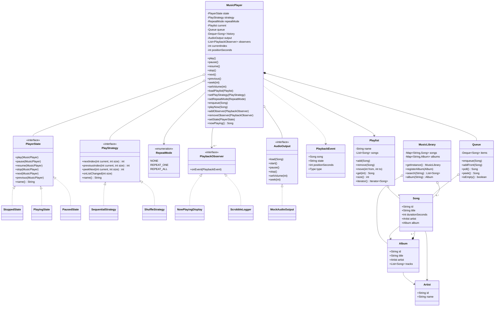

# LLD: Jukebox / Music Player

> Staff-level Low-Level-Design walkthrough and machine-coding revision artifact.
> Reader profile: senior Java engineer prepping for an LLD / OOD / machine-coding round.
> This document is **PART A** (design) + **PART C** (cheat-sheet & self-test).
> The companion `Solution.java` is **PART B** — a single-file, read-and-revise implementation.

---

## PART A — Design Document

### 1. Problem statement

Design the in-memory engine for a **music player / jukebox**. The system manages a **library of songs** (organised into albums/artists), lets the user build and manage **playlists**, and **plays** audio with familiar transport controls — **play / pause / stop / next / previous / seek**. Playback obeys a configurable **play order** (sequential, shuffle, repeat-one, repeat-all). The player exposes a **now-playing** notion that UI components (lyrics widget, scrobbler, mini-player, equalizer) can subscribe to, and supports a separate **up-next queue** that takes priority over the active playlist.

We are designing the **domain + control core**, not the codec/DSP layer. Actual decoding and the OS audio sink are abstracted behind an interface so the core logic is testable without sound hardware.

Two framings of "jukebox" exist:
- **Personal music player** (Spotify/iTunes-style): library, playlists, queue, shuffle/repeat, now-playing observers. **This is the framing we build** — it is what the prompt's entities (Player, Playlist, Song, Album, PlayStrategy, Queue) describe.
- **Coin-operated arcade jukebox**: insert coin → select track → enqueue. We treat this as an **extension** (Section 4), since it mostly adds a payment/selection front-end on top of the same playback engine.

---

### 2. Clarifying / requirements questions to ask first

Lead with these in the room. The interviewer's answers prune scope and reveal which patterns matter.

**Functional scope**
1. Transport controls required: just **play/pause/stop/next/prev**, or also **seek**, **fast-forward/rewind**, **volume**? (Determines the `State` surface area.)
2. Play orders to support: **sequential, shuffle, repeat-one, repeat-all** — anything else (e.g., "smart radio", "crossfade")? Can shuffle + repeat-all be **combined**? (Combination affects whether order is one Strategy or two orthogonal flags.)
3. What does **previous** mean under shuffle — go back in *play history*, or back in *list order*? (History-aware "previous" is a senior-signal detail.)
4. Is there a separate **up-next queue** distinct from the playlist? Does the queue take **priority** over the playlist? Does "play album/song now" clear or prepend the queue?
5. Playlist management ops: create/rename/delete, add/remove/reorder songs, dedupe? Are playlists **ordered**?
6. Library/search: search by title/artist/album, browse by album/artist, "play this album"? Is search **substring**, **prefix**, or **ranked**?
7. Is there a concept of **users/accounts** (per-user playlists, history), or single-user device?

**Non-functional**
8. **Concurrency model**: single UI thread issuing commands while a **playback thread** advances tracks and fires "track ended"? Or fully single-threaded simulation? (Decides whether we need thread-safety on the player core.)
9. Persistence: in-memory only, or load/save library + playlists? (We assume in-memory; persistence is an extension.)
10. Scale: thousands of songs (in-memory maps fine) vs. millions (needs an index / external store)?
11. Should observers be notified **synchronously** on the caller thread, or **asynchronously**? Must a slow/throwing observer not stall playback?

**Scope-narrowing / out-of-scope**
12. Out of scope: real audio decoding, networking/streaming, DRM, gapless/crossfade DSP, recommendations, UI rendering — **assumed yes** unless told otherwise.
13. Do we need an **undo** of playlist edits, or **equalizer/effects**? (Likely out, but cheap to mention as extensions.)

**Assumed answers (so we can build):** single device, single user; in-memory; sequential/shuffle/repeat-one/repeat-all with shuffle and repeat treated as **orthogonal** (combinable); a priority **up-next queue**; substring search; a background **playback clock thread** plus a UI command thread → the player core **must be thread-safe**; observers notified **synchronously but defensively** (a throwing observer cannot crash playback). Audio output is mocked behind an `AudioOutput` interface.

---

### 3. Finalized requirements & assumptions

**Functional**
- **Library**: register `Song`s; each belongs to an `Album` and `Artist`. Search by substring across title/artist/album; browse an album's tracks.
- **Playlist**: ordered collection of songs; create, add, remove, reorder, rename; iterate.
- **Queue (up-next)**: FIFO of songs that **takes priority** over the playlist's natural next track. "Play now" prepends.
- **Transport**: `play`, `pause`, `resume`, `stop`, `next`, `previous`, `seek(seconds)`, `setVolume`.
- **Play order**: pluggable strategy producing the next/previous index. Built-ins: **Sequential**, **Shuffle**. **Repeat mode** (`NONE`, `REPEAT_ONE`, `REPEAT_ALL`) is an orthogonal flag the player applies on top of the strategy.
- **Now-playing**: observers are notified on track change, state change, and position ticks.

**Non-functional**
- **Thread-safe** core: a playback thread advances tracks; UI thread issues commands; both mutate player state.
- **Observer isolation**: exceptions in one observer don't break others or the engine.
- **Extensible**: new play strategies, new states, new output sinks, new observers without touching existing code (OCP).
- Pure JDK, in-memory, O(1)/O(log n) library lookups via hash maps.

**Out of scope**: codecs/DSP, streaming, DRM, persistence, recommendations, UI.

---

### 4. Problem extensions / follow-up variations

The senior signal is anticipating these and showing the design *absorbs* them.

| # | Extension / follow-up | Design impact | Absorbed by |
|---|---|---|---|
| 1 | **History-aware Previous** under shuffle | `previous` must replay the last *actually played* track, not list-order predecessor | Add a `Deque<Song> history`; strategy consulted only when history is empty. Low impact — already designed in. |
| 2 | **Combine shuffle + repeat-all** | Order and looping are independent | Already orthogonal: `PlayStrategy` decides *which* track, `RepeatMode` decides *whether to loop at the ends*. No change. |
| 3 | **Gapless / crossfade** | Need look-ahead (peek next) + overlap | `PlayStrategy.peekNext()` already exposes look-ahead; crossfade is an `AudioOutput` concern, not core logic. |
| 4 | **Coin-operated jukebox** (arcade) | Add payment + selection front-end; queueing is paid | New `CreditManager` + a façade method `insertCoinAndQueue(song)`; reuses `Queue` + engine unchanged. |
| 5 | **Multi-device / cast** (play here, control there) | Output sink becomes remote; commands arrive over the network | `AudioOutput` is already an interface → swap for `CastAudioOutput`. Commands map to the same `Player` API. |
| 6 | **Persistence / sync** | Save & restore library + playlists | Add a `Repository` port (DAO) behind interfaces; entities are POJOs already. |
| 7 | **Smart radio / recommendations** | Endless auto-generated order | New `PlayStrategy` (`RadioStrategy`) that fetches the next track from a recommender. Plug-in, no core change. |
| 8 | **Equalizer / effects** | Per-output audio processing | Decorate `AudioOutput` (Decorator pattern) — `EqualizerOutput` wraps the base sink. |
| 9 | **Multi-user accounts** | Per-user playlists/history | Introduce `User`; `Library` shared, `Playlist`/history per user. Player instance per session. |
| 10 | **Undo playlist edits** | Reversible mutations | Command pattern on playlist ops with an undo stack. Mention; don't over-build. |
| 11 | **Async / non-blocking notifications** | Slow observer must not stall ticks | Swap synchronous dispatch for an `ExecutorService`-backed dispatcher behind the same `Observer` contract. |

---

### 5. Core entities, responsibilities & relationships

**Value / domain entities (immutable where possible):**
- **`Song`** — id, title, durationSeconds, `Artist`, `Album`. Immutable.
- **`Album`** — id, title, `Artist`, ordered list of `Song`. Mostly immutable (tracks fixed at registration in our scope).
- **`Artist`** — id, name.

**Collections / control:**
- **`Playlist`** — named, ordered, mutable list of songs; supports add/remove/reorder and exposes an **Iterator**.
- **`Queue`** (up-next) — FIFO of songs that overrides the playlist's next track. Thread-safe.
- **`MusicLibrary`** — **Singleton** catalog: register songs/albums, search, browse. The single source of truth for the catalog.

**Engine:**
- **`MusicPlayer`** — the orchestrator (context). Holds current `PlayerState`, current `PlayStrategy`, `RepeatMode`, the active `Playlist`, the `Queue`, play `history`, the `AudioOutput`, and the observer registry. Exposes transport API. **Thread-safe.**
- **`PlayerState`** (interface) + `StoppedState`, `PlayingState`, `PausedState` — **State pattern**: each handles the transport verbs differently and decides legal transitions.
- **`PlayStrategy`** (interface) + `SequentialStrategy`, `ShuffleStrategy` — **Strategy pattern**: compute next/previous index over the current track set.
- **`RepeatMode`** (enum) — `NONE`, `REPEAT_ONE`, `REPEAT_ALL`; applied by the player at list boundaries.
- **`AudioOutput`** (interface) + `MockAudioOutput` — abstracts the sink (testable; swappable for cast/equalizer).
- **`PlaybackObserver`** (interface) + e.g. `NowPlayingDisplay`, `ScrobbleLogger` — **Observer pattern** for now-playing/state/position events.
- **`PlaybackEvent`** — small immutable payload pushed to observers (song, state, positionSeconds).

**Relationships (text UML):**
```
Artist  1 ──< Album        (an artist has many albums)
Album   1 ──< Song         (an album has many tracks)         [composition of track list]
Song    *  ── 1 Album / 1 Artist
MusicLibrary 1 ──◆ Song/Album/Artist   (Singleton catalog; aggregates the domain)
Playlist 1 ──> *  Song      (ordered; iterable)
Queue    1 ──> *  Song      (FIFO, priority over playlist)
MusicPlayer ◆── PlayerState (current state; State pattern)
MusicPlayer ◆── PlayStrategy (current strategy; Strategy pattern)
MusicPlayer ◆── Queue, history(Deque)
MusicPlayer ──> Playlist     (association: the active playlist)
MusicPlayer ◇── AudioOutput  (delegated; swappable)
MusicPlayer 1 ──< PlaybackObserver  (Observer: 0..* subscribers)
```
Legend: `◆` composition (owns lifecycle), `◇` aggregation (holds, doesn't own), `──>` association, `──<` one-to-many.

---

### 6. Design patterns applied

For each: **where**, **why**, **rejected alternative**, **when *not* to use**.

#### 6.1 State — player transport lifecycle
- **Where:** `PlayerState` with `StoppedState` / `PlayingState` / `PausedState`; `MusicPlayer` delegates `play/pause/resume/stop/next/previous` to the current state.
- **Why:** transport verbs are **state-dependent** — `pause` is valid only when playing; `resume` only when paused; `next` from stopped should start playback. State pattern localises "what's legal and what transition happens" in each state object instead of scattering `if (state == ...)` across the player. New states (e.g., `BufferingState`, `SeekingState`) are added without editing existing ones (**OCP**).
- **Rejected alternative:** a single `enum State` + big `switch` in each method. Fine for 2 states; with 3+ states × 6 verbs it becomes a 18-cell conditional matrix that's error-prone and violates OCP.
- **When *not* to use:** if there are only two states and transitions are trivial, an enum/boolean is simpler — don't add classes for ceremony.

#### 6.2 Strategy — play order (sequential vs shuffle)
- **Where:** `PlayStrategy.nextIndex()/previousIndex()/peekNext()`; `SequentialStrategy`, `ShuffleStrategy`. Swappable at runtime via `player.setPlayStrategy(...)`.
- **Why:** play order is an **interchangeable algorithm**. Strategy lets us add `RadioStrategy`, `WeightedShuffle`, etc. without touching the player (**OCP, DIP** — player depends on the abstraction).
- **Rejected alternative:** a `boolean shuffle` flag with branching inside `next()`. Doesn't scale past two orders and tangles ordering logic into the engine.
- **When *not* to use:** if order will *forever* be sequential-only, a flag is enough.
- **Orthogonality note:** **Repeat** is deliberately an enum applied by the player at boundaries, *not* a strategy — because repeat composes with *any* order (shuffle + repeat-all). Folding repeat into Strategy would force a combinatorial explosion of strategy subclasses (the classic Strategy-vs-flags tradeoff).

#### 6.3 Iterator — traversing a playlist
- **Where:** `Playlist implements Iterable<Song>`; iteration over tracks decoupled from internal storage (`ArrayList` today, could be a linked structure tomorrow).
- **Why:** lets clients (and the engine's debugging/printing) traverse without exposing internals (**encapsulation, OCP**). Java's `Iterator` is the language-blessed form.
- **Rejected alternative:** expose the backing `List` directly. Leaks representation; callers could mutate it, breaking invariants (dedupe, ordering).
- **When *not* to use:** for a tiny fixed array you might just return an unmodifiable view; full custom iterators are overkill unless traversal logic is non-trivial.

#### 6.4 Observer — now-playing / state notifications
- **Where:** `MusicPlayer` is the subject; `PlaybackObserver`s subscribe and receive `PlaybackEvent`s on track change, state change, position tick.
- **Why:** multiple independent UI/back-end components (mini-player, lyrics, scrobbler, analytics) must react to playback without the player knowing them (**loose coupling, OCP, DIP**).
- **Rejected alternative:** the player directly calls each UI component. Tight coupling; adding a consumer edits the player.
- **When *not* to use:** if there's exactly one consumer that never changes, a direct call is simpler. Also beware sync notification of slow observers (see concurrency).

#### 6.5 Singleton — the music library
- **Where:** `MusicLibrary.getInstance()` — one shared catalog.
- **Why:** there is conceptually one device catalog; multiple players/playlists reference the same songs. Singleton gives a single access point and avoids passing the catalog everywhere.
- **Rejected alternative:** plain dependency injection of a `MusicLibrary` instance. **Honestly preferred in production** (testability, no global state) — Singleton is included because the prompt lists it and it's idiomatic for a "device-wide catalog," but we implement it **thread-safely (holder idiom)** and note DI as the cleaner choice. *This is the right thing to say in the room: name the tradeoff rather than pattern-stuff.*
- **When *not* to use:** anywhere you need multiple instances or want to mock the catalog in unit tests — prefer DI.

#### 6.6 (Mentioned, not built) Decorator & Command
- **Decorator** for `AudioOutput` (equalizer/effects wrap the sink) — Extension 8.
- **Command** for reversible playlist edits / mapping remote control messages to operations — Extensions 4 & 10. We mention these to show we know *when* to reach for them without bloating the core.

**SOLID recap**
- **SRP:** `MusicLibrary` (catalog), `Playlist` (ordering), `Queue` (priority next), `PlayStrategy` (order math), `PlayerState` (legality/transition), `AudioOutput` (sink). Each has one reason to change.
- **OCP:** new strategies/states/outputs/observers add classes, don't edit existing ones.
- **LSP:** every `PlayStrategy`/`PlayerState`/`AudioOutput` honours its contract and is substitutable.
- **ISP:** small focused interfaces (`PlayStrategy`, `PlaybackObserver`, `AudioOutput`) — no fat "do-everything" interface.
- **DIP:** `MusicPlayer` depends on abstractions (`PlayStrategy`, `AudioOutput`, `PlaybackObserver`), not concretions.

---

### 7. Class diagram



**Key public APIs (signatures):**
```java
// Engine
void play(); void pause(); void resume(); void stop();
void next(); void previous(); void seek(int seconds); void setVolume(int v);
void loadPlaylist(Playlist p);
void setPlayStrategy(PlayStrategy s);
void setRepeatMode(RepeatMode m);
void enqueue(Song s);            // up-next, low priority append
void playNow(Song s);            // jump-the-queue
void addObserver(PlaybackObserver o); void removeObserver(PlaybackObserver o);
Song nowPlaying();

// Strategy
int nextIndex(int current, int size);
int previousIndex(int current, int size);
int peekNext(int current, int size);
void onListChanged(int size);

// State (each verb takes the player as context)
void play(MusicPlayer p); void pause(MusicPlayer p); ... 

// Library (Singleton)
static MusicLibrary getInstance();
List<Song> search(String q);
```

---

### 8. Key flows

**8.1 Pressing "Next" (the central flow)**
1. UI calls `player.next()`.
2. Player delegates to `state.next(player)` (State pattern decides legality; from Stopped it starts playing).
3. Player computes the next song:
   - If the **Queue** is non-empty → poll it (queue has priority).
   - Else if `RepeatMode == REPEAT_ONE` → same song.
   - Else ask `strategy.nextIndex(currentIndex, size)`.
     - Sequential: `current+1`; at the end → `-1` (no next) unless `REPEAT_ALL` → wrap to `0`.
     - Shuffle: next unplayed random index; when exhausted → `-1` unless `REPEAT_ALL` → reshuffle.
4. Push the *current* song onto **history** (for history-aware `previous`).
5. `output.load(song); output.start();` set state to `PlayingState`, reset position.
6. Notify observers with a `TRACK_CHANGED` event.

**8.2 Track ends naturally (playback thread)**
1. Background clock ticks `positionSeconds++`; on tick, notify observers `POSITION` (throttled).
2. When `position >= duration`, the clock calls `player.next()` (same flow as 8.1). If `next()` returns "no next," transition to `StoppedState` and fire `STATE_CHANGED`.

**8.3 Sequence diagram — play then auto-advance**
```mermaid
sequenceDiagram
    actor UI
    participant P as MusicPlayer
    participant S as PlayerState
    participant Q as Queue
    participant ST as PlayStrategy
    participant O as AudioOutput
    participant OB as Observers

    UI->>P: play()
    P->>S: play(this)  (Stopped→Playing)
    S->>P: setState(Playing); startSong(idx0)
    P->>O: load(song0); start()
    P->>OB: onEvent(TRACK_CHANGED)
    Note over P: clock thread ticks position
    P->>OB: onEvent(POSITION) (each second)
    Note over P: position == duration
    P->>P: next()
    P->>Q: isEmpty()?  (no → poll)
    P->>ST: nextIndex(cur,size)
    P->>O: load(next); start()
    P->>OB: onEvent(TRACK_CHANGED)
```

**8.4 Shuffle + Repeat-All interplay**
- Strategy decides *which* index; Repeat decides what happens at the *boundary*. `ShuffleStrategy` tracks a per-cycle permutation; when exhausted it returns `-1`. The player, seeing `REPEAT_ALL`, calls `strategy.onListChanged(size)` (reshuffle) and restarts the cycle. This keeps "order" and "looping" cleanly separated.

---

### 9. Concurrency, edge cases & extensibility

**Concurrency / thread-safety**
- Two threads touch the player: the **UI command thread** (play/pause/next…) and the **playback clock thread** (auto-advance + ticks). The player core must be safe.
- **Approach:** guard all state-mutating transport methods with a single intrinsic lock (`synchronized` on the player, or a `ReentrantLock`). The transport critical sections are short (index math + a couple of output calls), so a coarse lock is simplest and correct; lock contention is negligible for a single playhead. We explicitly note this beats fine-grained locking here (avoids deadlock between "state" and "queue" locks).
- **`Queue`** uses a `ConcurrentLinkedDeque` / synchronized deque so the UI can enqueue while the clock polls.
- **Observer dispatch:** notifications happen **outside** the lock (snapshot the observer list under lock, iterate after release) to avoid holding the lock during slow/foreign code and to prevent re-entrancy deadlock (an observer calling back into the player). Each observer call is wrapped in try/catch so one bad observer can't break the loop or the engine — **observer isolation**.
- **`MusicLibrary` Singleton:** initialised via the **static holder idiom** (lazy, thread-safe, no synchronization cost). Internal maps are `ConcurrentHashMap`.
- **Volatile/atomic position:** `positionSeconds` is updated by the clock and read by observers; we keep it under the same lock or make it `volatile`/`AtomicInteger`.

**Edge cases**
- `next()`/`play()` with an **empty playlist and empty queue** → no-op (stay/return to Stopped); fire nothing or a no-op event.
- `previous()` at the **start** with empty history → stay on current (or wrap if `REPEAT_ALL`).
- `pause()` when already paused / `resume()` when not paused → State pattern makes these safe no-ops.
- **Seek** past `duration` → clamp to `duration` (triggers natural end); seek below 0 → clamp to 0.
- **Removing the now-playing song** from the playlist → clamp/recompute `currentIndex`; if it was playing, advance to the new track at that index.
- **Shuffle with 1 song** → repeats that song (or no-next under `NONE`).
- **Reordering** the playlist mid-play → keep playing the *same Song* (re-find its index), don't jump by index.
- **Duplicate enqueue / dedupe in playlist** → decide per requirements; we allow duplicates in queue, dedupe optional in playlist.
- **Concurrent stop while clock is advancing** → lock serialises them; whichever wins leaves a consistent state.

**Extensibility (how the design absorbs Section 4)**
- New play order → new `PlayStrategy` (OCP).
- New state (Buffering/Seeking) → new `PlayerState` (OCP).
- Remote/cast or equalizer → new/decorated `AudioOutput` (DIP + Decorator).
- New now-playing consumer → new `PlaybackObserver` (OCP).
- Async notifications → swap the dispatch internals (executor) behind the same `addObserver` API.
- Coin-op jukebox → `CreditManager` + façade method; reuses `Queue` + engine untouched.

---

### 10. Likely interview questions

**Q1. Why State for transport instead of an enum + switch?**
With 3 states × ~6 verbs, an enum forces a large conditional matrix duplicated across methods, easy to get wrong and violating OCP. State localises "legal verbs + transition" per class; adding `Buffering` doesn't touch existing code. For only 2 trivial states, an enum is fine — match the tool to the complexity.

**Q2. Why is Repeat an enum and not a Strategy?**
Order ("which track next") and looping ("what at the ends") are **orthogonal**. Folding repeat into Strategy yields a combinatorial blow-up (`ShuffleRepeatAll`, `SequentialRepeatOne`, …). Keeping Strategy for order and a `RepeatMode` flag applied by the player lets shuffle + repeat-all compose freely.
- *Deep probe:* "How does shuffle know when a cycle ends?" → it tracks a per-cycle permutation/visited-set; returns `-1` when exhausted; player reshuffles on `REPEAT_ALL`.

**Q3. How does Previous behave under shuffle?**
We keep a `Deque<Song> history` of actually-played tracks. `previous()` pops history first; only if empty do we ask the strategy. This makes "back" mean "the song I just heard," which is what users expect under shuffle.

**Q4. How do you keep the playhead correct when the playlist is edited mid-play?**
We track the **current Song**, not just an index. On add/remove/reorder we re-derive `currentIndex` by locating that Song; removing the now-playing song advances to whatever now sits at that position. This avoids "jumped to a random track after editing."

**Q5. Walk me through thread-safety.** *(senior signal)*
UI thread and clock thread both mutate the player → guard transport with one lock (coarse but the critical sections are tiny and there's a single playhead, so contention is nil and there's no multi-lock deadlock risk). The queue is a concurrent deque. Observers are snapshotted under the lock and **notified outside it**, each in try/catch, so a slow or throwing observer can't stall playback or deadlock via re-entrancy.

**Q6. Why Observer for now-playing, and what's the failure mode?** *(senior signal)*
Multiple independent consumers (mini-player, scrobbler, lyrics) react without the player knowing them → loose coupling + OCP. Failure mode: a slow/throwing observer. Mitigation: dispatch outside the lock, isolate exceptions, and (extension) move to an async executor so playback never blocks on a consumer.

**Q7. You used Singleton for the library — defend it.** *(senior signal)*
There's conceptually one device catalog, so a single access point is natural; I implemented it with the thread-safe holder idiom. But I'd flag that **DI of a single instance is cleaner** for testing and avoids global state — I'd use Singleton only if the framework/requirements push for it. Naming that tradeoff matters more than the pattern.

**Q8. How would you add a "smart radio" endless mode?**
Add a `RadioStrategy implements PlayStrategy` whose `nextIndex/peekNext` consult a recommender to append the next track; the player loop is unchanged. Pure OCP win.

**Q9. How do you support an up-next queue with priority and "play now"?**
A `Queue` (deque) checked *before* the strategy in `next()`. `enqueue` appends (low priority), `playNow`/`addFront` prepends (jump the line). The engine asks the queue first; only when empty does it fall back to the playlist + strategy.

**Q10. How would you make notifications non-blocking without changing observers?**
Keep the `PlaybackObserver` contract; replace synchronous iteration with an `ExecutorService` that submits each observer call. Optionally coalesce rapid POSITION ticks. Observers don't change — only the player's dispatch internals.
- *Deep probe:* "Ordering guarantees?" → use a single-threaded executor per-subject if observers need ordered delivery.

**Q11. Where would Decorator and Command fit?**
Decorator: wrap `AudioOutput` with `EqualizerOutput`/`VolumeNormalizerOutput` to layer effects. Command: reversible playlist edits (undo stack) and mapping remote-control messages to player operations. Mentioning *when* (not forcing them in) is the senior move.

---

(PART B is delivered in the companion `Solution.java`.)

---

## PART C — Cheat-sheet & self-test

**Patterns used (recap):**
- **State** → `PlayerState`/Stopped/Playing/Paused: per-state legal verbs + transitions; OCP for new states.
- **Strategy** → `PlayStrategy`/Sequential/Shuffle: pluggable play order; Repeat kept orthogonal as an enum.
- **Iterator** → `Playlist implements Iterable<Song>`: traverse without leaking storage.
- **Observer** → `PlaybackObserver` + `MusicPlayer` subject: now-playing/state/position, isolated + dispatched outside the lock.
- **Singleton** → `MusicLibrary` (holder idiom); noted DI as the cleaner production choice.
- **(Mentioned)** Decorator (`AudioOutput` effects), Command (undo / remote control).

**Key design decisions (recap):**
- Track the **current Song**, not just an index → survives playlist edits.
- **History deque** → correct "previous" under shuffle.
- **Queue checked before strategy** → priority up-next + "play now."
- **Coarse lock** on transport + **observer dispatch outside the lock** → simple, deadlock-free, non-stalling.
- `AudioOutput` interface → testable core, swappable for cast/equalizer.
- Repeat as enum, not strategy → shuffle + repeat-all compose without subclass explosion.

**SOLID:** SRP per class; OCP via Strategy/State/Observer/Output; LSP across all strategy/state/output impls; ISP small interfaces; DIP player→abstractions.

**5 self-test questions (no answers):**
1. The interviewer adds **crossfade**: which existing seam handles it, and what does `peekNext()` enable? Where does the actual fade live, and why *not* in `MusicPlayer`?
2. A user reports that after **reordering** their playlist while a song plays, playback jumped to a different track. What invariant did the buggy code violate, and how does tracking the current `Song` fix it?
3. Under **shuffle + REPEAT_ALL**, describe exactly what `ShuffleStrategy` and the player each do at the end of a cycle. Whose responsibility is the reshuffle?
4. Convert the synchronous observer dispatch to **async** without changing any observer class. What new failure modes (ordering, back-pressure, stale events) appear, and how do you bound them?
5. Justify keeping `MusicLibrary` as a Singleton vs. injecting it. Give one concrete unit-testing scenario where the Singleton hurts and how DI would fix it.
