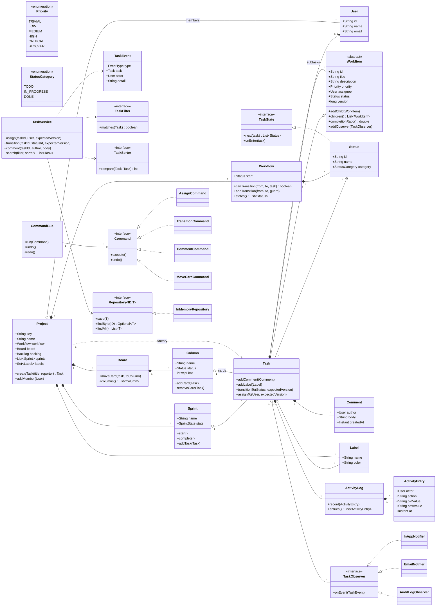

# Task Management System (Jira / Trello) — Low-Level Design

> A staff-level LLD / machine-coding reference and last-minute revision artifact.
> Reader profile: senior Java engineer who knows core OOP and the GoF patterns — the focus here is *applying* the right patterns with justification, clean SOLID design, and production-quality code that can be recalled under pressure.

---

# PART A — Design Document

## 1. Problem statement

Design the core domain model and service layer for a **Task Management System** in the spirit of Jira / Trello. The system lets users organize work into **projects**, break work into **tasks** (and nested **subtasks**), move tasks through a configurable **workflow** (e.g. To Do → In Progress → Done), organize tasks on **boards** with **columns** and into time-boxed **sprints**, attach metadata such as **priority**, **labels**, **comments**, and **assignees**, and lets interested parties **subscribe to changes** (assignment, status transitions, comments). It must keep a per-task **activity log** and behave correctly when **many users update the same task concurrently**.

This is a domain-modeling / machine-coding problem: the deliverable is an in-memory, single-process object model with clean APIs — *not* a distributed system. We will, however, design so that the same model could be wrapped by a persistence layer and an HTTP API with minimal churn.

> **Adjacent terms (1–2 line gloss for newcomers):**
> - **Board**: a visual surface (Kanban/Scrum) showing tasks grouped into **columns**.
> - **Column**: a vertical lane on a board, usually mapped to a workflow status (e.g. "In Progress").
> - **Sprint**: a fixed-length, time-boxed iteration (commonly 1–4 weeks) into which tasks are pulled and committed.
> - **Workflow**: the set of allowed task **states** and the legal **transitions** between them.
> - **Backlog**: the ordered list of not-yet-scheduled tasks for a project.
> - **Epic / Story / Subtask**: a hierarchy — an epic contains stories, a story contains subtasks. We model this generically as a **composite** of work items.

---

## 2. Clarifying / requirements questions to ask first

A real round starts here. I would ask these *before* writing a single class. They are grouped so I can narrow scope fast.

### 2.1 Functional scope
1. **Hierarchy depth** — Do we need arbitrary nesting (epic → story → subtask → …) or is it strictly two levels (task → subtask)? This decides whether **Composite** is justified or overkill.
2. **Workflow** — Is the workflow fixed (To Do / In Progress / Done) or **configurable per project** (custom states, custom transitions, validation rules on transitions)?
3. **Boards vs. sprints** — Do we need both **Kanban boards** (continuous flow, columns) and **Scrum sprints** (time-boxed), or just one? Are columns 1:1 with workflow states, or can a column hold multiple states?
4. **Assignment** — Single assignee per task, or multiple? Can tasks be unassigned? Do we enforce that an assignee is a project member?
5. **Notifications** — What channels (in-app, email, push)? Who gets notified — assignee, reporter, watchers, @mentions? Is delivery best-effort or guaranteed?
6. **Comments** — Flat comments or threaded? Edit/delete? @mentions trigger notifications?
7. **Labels & priority** — Are labels free-form per project or from a controlled vocabulary? Is priority an ordered enum (Low…Blocker)?
8. **Search / filter / sort** — What filter dimensions (assignee, status, label, priority, sprint, text)? What sort orders (priority, due date, created, rank)? Do we need saved filters?
9. **Activity log** — Per-task only, or a project-wide audit feed? Do we need to *replay* or just *display* history?

### 2.2 Non-functional / constraints
10. **Scale** — In-memory single process for this round, or must I design the storage seam for a DB? Expected #tasks / #concurrent users? (Drives whether we worry about lock granularity.)
11. **Concurrency** — Multiple users editing the same task simultaneously — **last-write-wins**, **optimistic locking (version check)**, or **pessimistic locking**? This is the single most important NFR for this problem.
12. **Consistency of notifications** — Must observers be notified synchronously (inside the update) or asynchronously (after commit)? Can a slow/failing observer block the writer?
13. **Persistence & transactions** — Out of scope today, but should the design leave a clean repository seam?
14. **Auth / permissions** — Is RBAC (who can transition, who can delete) in scope, or assume all project members may do everything?

### 2.3 Scope-narrowing (what's in / out)
15. Out of scope confirmation: real persistence, network/API layer, authN/Z, time-tracking/worklogs, attachments, full-text search engine, multi-tenant isolation. I will **stub the repository** and keep everything in memory.

> For this document I will state explicit answers in §3 so the design is concrete, then show in §4/§9 how each clarifier flips the design.

---

## 3. Finalized requirements & assumptions

**Functional (in scope):**
- **Users** belong to one or more projects (project membership).
- **Projects** own a **board**, a set of **workflow** states/transitions, a **backlog**, **sprints**, and a **label** vocabulary.
- **Tasks** (a.k.a. work items / issues) have: title, description, **status**, **priority** (ordered enum), **assignee** (0 or 1, must be a member), **reporter**, **labels**, **comments**, **subtasks** (Composite, arbitrary depth), **due date**, monotonically increasing **version** (for optimistic concurrency), and an **activity log**.
- **Workflow** is **configurable per project**: a state machine of statuses + allowed transitions. Transitions can have **guards** (e.g. "cannot move to Done while subtasks are open").
- **Boards** have ordered **columns**; each column maps to one workflow status. Moving a card across columns triggers a status transition.
- **Sprints** are time-boxed; tasks can be added/removed; a sprint can be started and completed (incomplete tasks roll back to backlog).
- **Observers** (watchers) subscribe to a task and are notified on assignment changes, status transitions, and new comments.
- **Filtering / sorting / searching** of tasks via pluggable predicates and comparators.
- **Activity log** per task records every mutation (who, what, when, old→new).
- **Commands** wrap user actions (assign, transition, comment, move) to enable **undo** and a uniform audit trail.

**Non-functional (assumed answers):**
- **In-memory**, single JVM; thread-safe under concurrent updates.
- **Concurrency policy: optimistic locking** via a per-task version. A mutation must present the version it read; a mismatch throws `ConcurrentModificationException` (our own typed variant) so the caller can retry. Per-task operations are additionally guarded by a per-task lock to make read-modify-write atomic.
- **Notifications are best-effort and isolated**: a failing observer must not break the write or other observers; notification happens *after* the state change commits.
- **Repository is an interface** with an in-memory implementation, so a DB can slot in later.

**Out of scope:** persistence durability, network API, authN/Z, attachments, worklogs, distributed coordination.

---

## 4. Problem extensions / follow-up variations

These are the follow-ups interviewers add. For each: the ask and the **design impact** — and how the chosen patterns absorb it.

| # | Extension / follow-up | Design impact | Absorbed by |
|---|---|---|---|
| 1 | **Configurable workflow per project** (custom states + transitions + guards) | Status can't be a hard enum-with-if-else; needs a data-driven state machine with guard predicates. | **State pattern** (or table-driven FSM) + guard functions. The FSM lives in `Workflow`, owned by the project. |
| 2 | **Arbitrary nesting** (epic→story→subtask) + roll-up (e.g. "% done") | Need uniform treatment of leaf and composite; aggregate over children. | **Composite pattern** — `WorkItem` with `Task` (leaf+composite). Roll-ups via recursive traversal / **Visitor** if many aggregates. |
| 3 | **More notification channels** (email, push, Slack) + @mention routing | Observer list grows; need per-channel formatting/routing without touching subjects. | **Observer** + **Strategy** per channel; observers are channel adapters. Async dispatch via an executor. |
| 4 | **New sort/filter dimensions, saved filters, compound queries** | Hard-coded sort/filter branches explode (OCP violation). | **Strategy** for `Comparator<Task>` and `Predicate<Task>`; compose with `and/or`. Saved filter = stored predicate+comparator. |
| 5 | **Undo / redo of actions, audit trail** | Need to reify actions as objects with do/undo and history. | **Command pattern** — each action is a `Command` with `execute()`/`undo()`; `CommandBus` keeps history stacks. |
| 6 | **Optimistic vs. pessimistic concurrency**, retries | Version fields, conflict detection, retry policy. | Per-task `version` + per-task `ReentrantLock`; typed conflict exception; service retries or surfaces to caller. |
| 7 | **Bulk operations** (move 50 tasks, reassign sprint) | Need atomicity-ish semantics and ordering; lock ordering to avoid deadlock. | Acquire task locks in a **canonical order** (by id); wrap each as a Command for partial-failure reporting. |
| 8 | **Permissions / RBAC** (who may transition/delete) | A cross-cutting guard before mutations. | Guard at the **service** boundary (or a `PermissionStrategy`); Command checks authorization in `execute()`. |
| 9 | **Persistence / multi-node** | Need repository + transactions; observers become a durable outbox; locks become DB row locks / version columns. | `Repository` interface already abstracts storage; Observer dispatch swappable for outbox; optimistic version maps cleanly to a DB version column. |
| 10 | **SLA / due-date escalation, recurring tasks** | Time-driven triggers. | A scheduler emits events into the same Observer pipeline; recurrence is a **Factory**-built template task. |
| 11 | **Custom fields per project** | Tasks need a flexible attribute bag. | Add a typed `Map<FieldDef,Value>`; validate via field definitions (avoids subclass explosion). |
| 12 | **WIP limits per column** (Kanban) | Column rejects a card when full. | Guard inside `Column.addCard` / the move Command; configurable limit. |

---

## 5. Core entities, responsibilities & relationships

**Entities and their single responsibilities (SRP):**

- **User** — identity (id, name, email). Pure value/holder; no behavior beyond identity.
- **Project** — aggregate root for a workspace: owns members, the `Workflow`, the `Board`, the `Backlog`, sprints, and the label vocabulary. Factory for tasks (assigns task keys like `PROJ-12`).
- **WorkItem** *(abstract)* — the **Composite** node: common task behavior (id, title, status, assignee, version, observers, activity log). 
- **Task** — concrete `WorkItem`; can hold child `WorkItem`s (subtasks). Roll-up of completion. (We use a single concrete class acting as both leaf and composite, which is the pragmatic Composite for this domain.)
- **Workflow** — the **State machine**: set of `Status` states and allowed transitions with optional guards. Validates `canTransition(from,to,task)`.
- **Status** — a workflow state (id, name, category: TODO/IN_PROGRESS/DONE). With State pattern, each status is a `TaskState` object knowing its legal next states.
- **Board** — ordered list of **Column**s; maps columns ↔ statuses; supports moving a card (which delegates to a status transition).
- **Column** — a lane bound to a status; ordered cards; optional WIP limit.
- **Sprint** — time-boxed bag of tasks with lifecycle (PLANNED→ACTIVE→COMPLETED).
- **Comment** — author, body, timestamp; lives under a task.
- **Label** — project-scoped tag (name, color).
- **Priority** — ordered enum (TRIVIAL < LOW < MEDIUM < HIGH < CRITICAL < BLOCKER).
- **ActivityLog / ActivityEntry** — append-only history of mutations on a task.
- **Observer (TaskObserver)** — notified on task events; concrete: in-app, email, push, audit.
- **Command** — reified user action (`AssignCommand`, `TransitionCommand`, `CommentCommand`, `MoveCardCommand`) with `execute`/`undo`; `CommandBus` runs and records them.
- **Repository<T>** — storage seam; `InMemoryRepository` impl.
- **TaskFilter / TaskSorter (Strategy)** — `Predicate<Task>` / `Comparator<Task>` building blocks.
- **TaskService** — application façade orchestrating the above with concurrency control.

**Relationships (at a glance):**
- `Project` **composes** `Board`, `Workflow`, `Backlog`, `Sprint`s, `Label`s; **aggregates** `User` members.
- `Board` **composes** `Column`s; `Column` **references** (associates) `Task`s (cards).
- `WorkItem`/`Task` **composes** child `WorkItem`s (subtasks), `Comment`s, `ActivityLog`; **references** `Status`, `Assignee`(User), `Label`s; **holds** `TaskObserver`s.
- `Sprint` **aggregates** `Task`s.
- `CommandBus` **uses** `TaskService`; `Command`s **act on** `Task`/`Board`.

---

## 6. Design patterns applied

Each entry: **where / why / rejected alternative / when *not* to use**. No pattern-stuffing — every choice maps to an extension in §4.

### 6.1 State — task workflow
- **Where:** `TaskState` interface with `Todo`, `InProgress`, `InReview`, `Done` (and a data-driven `Workflow` that wires transitions). `task.transitionTo(target)` delegates to the current state which validates the move.
- **Why:** the legal next-states and guard logic differ per state; encapsulating each state removes a brittle `switch(status)` and satisfies **OCP** — adding a state adds a class, doesn't edit existing ones.
- **Rejected alternative:** a status enum + big `if/switch` in the service. Simpler for a *fixed* 3-state flow, but every new state/guard edits central code (OCP violation) and guards get tangled.
- **When *not* to use:** if the workflow is truly fixed and tiny and will never change, an enum + transition `Set` (table-driven FSM) is lighter. I show the **State objects** for the configurable requirement (§3) and keep a table-driven `Workflow` as the registry so both views coexist.

### 6.2 Composite — subtasks / hierarchy
- **Where:** `WorkItem` (component) with `Task` acting as leaf *and* composite (`addChild`, `getChildren`, recursive `completionRatio()`).
- **Why:** clients (boards, roll-up reports) treat a single task and a task-with-subtasks **uniformly**; aggregates compute recursively. Directly serves Extension #2.
- **Rejected alternative:** separate `Task` and `SubTask` classes with special-casing in callers. Causes duplicated traversal logic and type checks (LSP/OCP smell).
- **When *not* to use:** if nesting is strictly one level and you never aggregate, a plain `List<SubTask>` on `Task` is simpler and avoids the abstraction. We adopt Composite because §3 allows arbitrary depth + roll-ups.

### 6.3 Observer — assignment / status / comment notifications
- **Where:** `Task` is the subject; `TaskObserver` implementations (`InAppNotifier`, `EmailNotifier`, `AuditLogObserver`) subscribe. Events fire **after commit**, dispatched on an executor.
- **Why:** decouples "something changed" from "who cares" — add channels without touching the task (OCP, DIP). Serves Extensions #3 and #10.
- **Rejected alternative:** the service directly calls each notifier. Tight coupling; the subject must know every channel; adding a channel edits the writer.
- **When *not* to use:** if there is exactly one, never-changing sink, a direct call is fine. With multiple, pluggable channels and @mention routing, Observer wins. **Caveat:** notify *outside* the lock / after commit and isolate failures so a bad observer can't break the write.

### 6.4 Strategy — filtering, sorting, notification routing, permissions
- **Where:** `TaskFilter` (`Predicate<Task>`), `TaskSorter` (`Comparator<Task>`), composed via `and/or/then`; also per-channel `NotificationFormatter`.
- **Why:** sort/filter dimensions multiply (Extension #4); Strategy keeps each rule a small object, composable and testable, satisfying **OCP**.
- **Rejected alternative:** boolean-flag-laden methods (`findTasks(byAssignee, byLabel, sortByPriority…)`). Combinatorial explosion; impossible to extend cleanly.
- **When *not* to use:** a single fixed sort with no foreseeable variation — just inline a comparator.

### 6.5 Command — user actions, undo/redo, uniform audit
- **Where:** `Command{execute(); undo();}` with `AssignCommand`, `TransitionCommand`, `CommentCommand`, `MoveCardCommand`; `CommandBus` executes and pushes onto undo/redo stacks.
- **Why:** reifies actions so we get **undo/redo** (Extension #5), a consistent audit hook, and a place to enforce permissions (Extension #8) and concurrency (capture version in the command). 
- **Rejected alternative:** service methods that mutate directly. Fine until you need undo/audit/queueing — then you're retrofitting. Command pays for itself once any of those appear.
- **When *not* to use:** trivial CRUD with no undo/audit/queue requirement; the Command ceremony is then overhead.

### 6.6 Factory (Method) — task / id creation
- **Where:** `Project.createTask(...)` mints task keys (`PROJ-N`), wires the default status, reporter, observers.
- **Why:** centralizes invariants of a valid new task; callers can't forget to set the workflow's start state. Supports recurring-task templates (Extension #10).
- **Rejected alternative:** public `new Task(...)` everywhere — invariants leak and duplicate.

### 6.7 Repository — storage seam
- **Where:** `Repository<ID,T>` with `InMemoryRepository`.
- **Why:** **DIP** — services depend on the abstraction, so persistence (Extension #9) slots in without touching domain/service logic.

### 6.8 Singleton-ish application root (used sparingly)
- **Where:** `TaskManagementSystem` as a configured composition root (we inject it, not a global static) — so it's really a **composition root**, not a classic Singleton, avoiding global-state testing pain.

### SOLID scorecard
- **S**RP: each class one reason to change (e.g. `Workflow` validates transitions; `ActivityLog` records history; `Board` arranges columns).
- **O**CP: State/Strategy/Observer/Command let us add states, sorts, channels, actions without editing existing code.
- **L**SP: `Task` substitutes for `WorkItem` anywhere; observers are interchangeable.
- **I**SP: small interfaces (`TaskObserver`, `Command`, `TaskFilter`) — clients depend only on what they use.
- **D**IP: services depend on `Repository`, `TaskObserver`, `TaskState` abstractions, not concretes.

---

## 7. Class diagram

### 7.1 Mermaid `classDiagram`



### 7.2 Short text UML

```
User (value: id, name, email)

Project  ──composes──▶ Workflow, Board, Backlog, Sprint*, Label*
         ──aggregates▶ User* (members)
         ──factory───▶ Task (createTask -> mints PROJ-N, sets start status)

WorkItem (abstract)  ◀── Task (extends; leaf + composite)
   composes: WorkItem* (subtasks), Comment*, ActivityLog
   references: Status (1), User assignee (0..1), Label*
   holds: TaskObserver*
   fields: id, title, desc, priority, version

Workflow  composes Status*; canTransition(from,to,task) consults guards
Status implements TaskState (next states, onEnter)

Board composes Column*;  Column (bound to a Status, WIP limit) aggregates Task* (cards)
Sprint aggregates Task*; lifecycle PLANNED→ACTIVE→COMPLETED

TaskObserver (iface) ◀ InAppNotifier, EmailNotifier, AuditLogObserver  (fired on TaskEvent)
TaskFilter (Predicate<Task>) / TaskSorter (Comparator<Task>)  — composable strategies
Command (iface) ◀ Assign/Transition/Comment/MoveCard ; CommandBus keeps undo/redo stacks
Repository<ID,T> (iface) ◀ InMemoryRepository  — storage seam
TaskService — façade: concurrency control + orchestration over the above
```

### 7.3 Key public APIs / signatures

```java
// Project (Factory)
Task createTask(String title, User reporter);
void addMember(User u);

// Task (State + Observer subject + optimistic concurrency)
void transitionTo(Status target, long expectedVersion);   // throws StaleVersionException / IllegalTransitionException
void assignTo(User assignee, long expectedVersion);
Comment addComment(User author, String body);
void addChild(WorkItem child);
double completionRatio();           // recursive roll-up (Composite)
void addObserver(TaskObserver o);

// Workflow (FSM)
boolean canTransition(Status from, Status to, Task t);
void addTransition(Status from, Status to, TransitionGuard guard);

// Board / Column
void moveCard(Task t, Column toColumn);   // triggers transitionTo(column.status)
boolean addCard(Task t);                  // false if WIP limit exceeded

// Service (façade)
List<Task> search(TaskFilter filter, TaskSorter sorter);
void transition(String taskId, String statusId, long expectedVersion);

// Strategies
TaskFilter byAssignee(User u); TaskFilter byStatus(StatusCategory c); TaskFilter and(TaskFilter...);
TaskSorter byPriorityDesc(); TaskSorter byDueDate();

// Command / Bus
void run(Command c);   void undo();   void redo();
```

---

## 8. Key flows

### 8.1 Transition a task (status change) with optimistic concurrency + notifications

Steps:
1. Caller reads the task, notes its `version` (say `v`).
2. Caller issues `TransitionCommand(taskId, targetStatusId, expectedVersion=v)` via `CommandBus`.
3. Command asks `TaskService.transition(...)`.
4. Service acquires the **per-task lock** (makes read-modify-write atomic).
5. Service re-reads the task; if `task.version != expectedVersion` → throw `StaleVersionException` (caller retries with fresh version).
6. Service calls `task.transitionTo(target, expectedVersion)`:
   - `Workflow.canTransition(current, target, task)` runs guards (e.g. "no open subtasks for Done").
   - On success: set status, **increment version**, append an `ActivityEntry`.
7. Lock released. Service builds a `TaskEvent(STATUS_CHANGED)` and **dispatches to observers asynchronously** (failures isolated).
8. Command stores the inverse (old status, old version) for `undo()`.

### 8.2 Mermaid sequence diagram (transition + notify)

```mermaid
sequenceDiagram
    actor U as User
    participant Bus as CommandBus
    participant Cmd as TransitionCommand
    participant Svc as TaskService
    participant T as Task
    participant WF as Workflow
    participant Log as ActivityLog
    participant Disp as ObserverDispatcher

    U->>Bus: run(TransitionCommand(taskId, "DONE", v))
    Bus->>Cmd: execute()
    Cmd->>Svc: transition(taskId, "DONE", v)
    Svc->>Svc: lock(taskId)
    Svc->>T: read version
    alt version mismatch
        Svc-->>Cmd: throw StaleVersionException
    else version ok
        Svc->>WF: canTransition(IN_PROGRESS, DONE, task)?
        WF-->>Svc: true (guards pass)
        Svc->>T: status=DONE; version++
        Svc->>Log: record(actor, "status", "IN_PROGRESS", "DONE")
        Svc->>Svc: unlock(taskId)
        Svc->>Disp: dispatch(TaskEvent STATUS_CHANGED)
        Disp-->>U: in-app + email (async, failures isolated)
    end
    Cmd->>Bus: push inverse for undo
```

### 8.3 Move card across columns (Board → status transition + WIP)
1. `Board.moveCard(task, toColumn)`.
2. Check `toColumn.wipLimit` — reject if full (Extension #12).
3. Delegate to `transition(task, toColumn.status)` (reuses §8.1, including guards/version/notify).
4. On success, remove from old column, add to new column.

### 8.4 Search/filter/sort
1. Caller composes strategies: `filter = byStatus(IN_PROGRESS).and(byAssignee(alice))`, `sorter = byPriorityDesc().then(byDueDate())`.
2. `TaskService.search(filter, sorter)` streams the repository, applies `filter.matches`, sorts by the comparator, returns the list.

### 8.5 Subtask roll-up (Composite)
- `parent.completionRatio()` = (sum of children done) / (count of children), recursing into nested children; a leaf returns 1.0 if DONE else 0.0. Guard "cannot move parent to Done while any child open" reads this.

---

## 9. Concurrency, edge cases & extensibility

### 9.1 Concurrency / thread-safety
- **Optimistic locking:** every `WorkItem` carries a `long version`. Mutating APIs take `expectedVersion`; a mismatch throws `StaleVersionException`. This is the classic Jira "someone else changed this issue" behavior and maps 1:1 to a DB version column later (Extension #9).
- **Per-task lock:** a `ConcurrentHashMap<taskId, ReentrantLock>` makes the *check-version → mutate → bump-version* sequence atomic, so two threads with the same `expectedVersion` can't both win.
- **Collections:** observer lists and card lists use thread-safe collections (`CopyOnWriteArrayList`) — cheap because reads (notification fan-out, board render) dominate writes.
- **Notifications off the critical path:** observers are invoked **after** releasing the lock, on an `ExecutorService`, each wrapped in try/catch so one failing channel can't poison the write or other channels. Ordering within a task is preserved by dispatching sequentially per task (or a single-thread executor) if required.
- **Deadlock avoidance for bulk ops (Extension #7):** when locking multiple tasks, sort task ids and acquire in canonical order.
- **CommandBus undo/redo:** stacks guarded; undo re-validates version to avoid clobbering newer state.

### 9.2 Edge cases
- Transition to the same status → no-op (or reject) without bumping version.
- Illegal transition (no edge / failed guard) → `IllegalTransitionException`; version untouched.
- Moving to **Done** while subtasks open → blocked by guard; surface a clear message.
- Assigning a non-member → rejected at service boundary.
- WIP limit exceeded on a column → `addCard` returns false / move rejected.
- Deleting a label still referenced → either cascade-remove from tasks or reject; we de-reference defensively.
- Sprint completion with unfinished tasks → roll incomplete tasks back to backlog.
- @mention of unknown user → ignored (no crash), logged.
- Undo of a transition whose target was since changed by another user → version check fails, undo aborts with a clear error rather than corrupting state.
- Self-cycle in subtasks (adding an ancestor as a child) → reject to prevent infinite recursion in roll-ups.

### 9.3 Extensibility (how the design absorbs §4)
- **New workflow/state** → add a `Status` (+ optional `TaskState`) and transitions; no edits to services (OCP).
- **New channel** → add a `TaskObserver`; register it. Nothing else changes.
- **New sort/filter** → add a `Predicate`/`Comparator`; compose at call site.
- **New action / undo** → add a `Command`; the bus handles it uniformly.
- **Persistence** → implement `Repository` against a DB; version field becomes the optimistic column.
- **Custom fields** → attribute map on `Task` validated by field defs; no subclass explosion.
- **RBAC** → a `PermissionStrategy` checked inside Commands / service boundary.

---

## 10. Likely interview questions (with model answers)

**Q1. Why State pattern for the workflow instead of a status enum + switch?**
A status enum with a central switch violates OCP — every new state or guard edits that switch and risks regressions. Encapsulating each state (or, since the requirement is *configurable* workflows, a data-driven `Workflow` FSM plus guard predicates) means adding a state adds a class/row, not an edit. *Deep-probe:* "When would the enum approach be fine?" → fixed, tiny, never-changing flows; the State ceremony then isn't worth it. *Deep-probe:* "How do guards fit?" → each transition carries a `TransitionGuard` predicate (e.g. no open subtasks), evaluated in `canTransition`.

**Q2. How do you handle two users updating the same task at once?**
Optimistic locking: each task has a `version`; mutations carry the `expectedVersion`. A per-task `ReentrantLock` makes check-then-write atomic; on version mismatch we throw `StaleVersionException` and the caller retries with fresh state. *Deep-probe:* "Why not pessimistic locks everywhere?" → they hurt throughput and risk deadlocks under contention; optimistic fits low-contention edit patterns and maps to a DB version column. *Deep-probe:* "Bulk updates?" → lock task ids in canonical (sorted) order to avoid deadlock.

**Q3. (Senior signal) Justify Composite for subtasks — and when is it overkill?**
Composite lets boards, roll-up reports, and guards treat a single task and a task-with-subtasks uniformly, computing `completionRatio()` recursively. It's justified because §3 allows arbitrary nesting + aggregation. It's overkill if nesting is strictly one level with no roll-ups — then a plain `List<SubTask>` is simpler and avoids the abstraction tax.

**Q4. Why are notifications Observer + async, and what could go wrong?**
Observer decouples "task changed" from "who's interested," so adding email/Slack doesn't touch the task (OCP/DIP). They run after commit on an executor with per-observer try/catch so a slow/failing channel can't block the write or starve other channels. *Deep-probe:* "Ordering / at-least-once?" → use a per-task single-thread executor for ordering; for durability, replace in-memory dispatch with a transactional outbox (Extension #9).

**Q5. (Senior signal) Where does Command earn its keep vs. plain service calls?**
Command reifies actions, unlocking undo/redo, a uniform audit hook, queueing/bulk, and a natural place to enforce permissions and capture the optimistic version. If none of those are needed, direct service methods are simpler and Command is overhead — so I'd introduce it exactly when undo/audit/bulk appears.

**Q6. How do filtering and sorting stay clean as dimensions grow?**
Strategy: filters are composable `Predicate<Task>` and sorts are `Comparator<Task>` combined with `and/or/then`. New dimensions are new small objects, not new boolean parameters — avoiding the combinatorial method explosion and respecting OCP. Saved filters are just stored predicate+comparator pairs.

**Q7. How does moving a card on the board relate to the workflow?**
A `Column` is bound to a `Status`; `Board.moveCard` checks the column's WIP limit then delegates to the same `transition(...)` path (guards + version + notify). This keeps one source of truth for status changes whether the user drags a card or uses a status dropdown.

**Q8. (Senior signal) How would you evolve this to a persistent, multi-node service with minimal change?**
The `Repository` seam already isolates storage (DIP) — implement it over a DB; the optimistic `version` becomes a DB version column for conflict detection; observer dispatch becomes a transactional outbox consumed by workers; per-task in-process locks give way to row-level/optimistic DB locks. The domain model and Command layer are untouched, which is the payoff of the seams.

**Q9. What are the trickiest edge cases and how do you handle them?**
Done-with-open-subtasks (guard blocks), illegal transitions (typed exception, version untouched), non-member assignment (service-boundary reject), WIP overflow (column rejects), sprint completion with unfinished work (roll back to backlog), and undo against newer state (version re-check aborts cleanly). Each fails loudly and leaves state consistent.

**Q10. Is `TaskManagementSystem` a Singleton?**
No — it's a **composition root** we inject, not a global static, so tests can build isolated instances. Classic Singletons create hidden global state and make testing/concurrency harder; we avoid that deliberately.

---

# PART C — Cheat-sheet & self-test

## Patterns used + key design decisions (recap)

- **State** → task workflow. Configurable per project via a data-driven `Workflow` FSM + `TaskState` objects + `TransitionGuard`s. Adding a state = adding a class/row, not editing a switch (OCP).
- **Composite** → subtasks. `WorkItem` component, `Task` is leaf+composite; recursive `completionRatio()` roll-up; guard blocks "Done while children open."
- **Observer** → notifications (in-app / email / audit). Subject = `Task`; fired **after commit**, **async**, failures **isolated**; add channels without touching the subject.
- **Strategy** → `TaskFilter` (`Predicate<Task>`) and `TaskSorter` (`Comparator<Task>`), composable via `and/or/then`; also per-channel formatting and pluggable permissions.
- **Command** → `Assign/Transition/Comment/MoveCard` with `execute()/undo()`; `CommandBus` keeps undo/redo stacks and is the audit + permission seam.
- **Factory Method** → `Project.createTask` mints `PROJ-N` keys and sets the workflow start state, centralizing new-task invariants.
- **Repository** → storage seam (`InMemoryRepository` now, DB later) — DIP.
- **Composition root** (not Singleton) → `TaskManagementSystem` is injected, not global, to keep tests/concurrency clean.

**Concurrency decisions:** optimistic locking via per-task `version` + `expectedVersion` on mutations; per-task `ReentrantLock` makes check-then-write atomic; `StaleVersionException` on conflict for caller retry; thread-safe (`CopyOnWriteArrayList`) collections for read-heavy lists; notifications off the critical path; canonical lock ordering for bulk ops.

**SOLID:** SRP per class; OCP via State/Strategy/Observer/Command; LSP (`Task` ↔ `WorkItem`, interchangeable observers); ISP (small interfaces); DIP (depend on `Repository`/`TaskObserver`/`TaskState`).

**Rejected alternatives (one-liners):** enum+switch workflow (OCP), `Task`/`SubTask` split (duplication), direct-call notifications (coupling), boolean-flag query methods (combinatorial), direct service mutation (no undo/audit), public `new Task` (leaked invariants), classic Singleton (global state).

## 5 self-test questions (no answers)

1. The interviewer makes the workflow fully user-configurable at runtime (admins draw the state graph). Which of your classes change, and how do you keep guards data-driven without recompiling?
2. Two users drag the same card to different columns within milliseconds. Walk through exactly what each thread observes and which one fails — then design the retry UX.
3. You must add Slack notifications *and* @mention routing where only mentioned users in a comment are notified. What changes, and what stays untouched? Where do you risk breaking the "failures isolated" guarantee?
4. Implement `undo()` for a `TransitionCommand` when another user has since changed the task's status. What does correct behavior look like, and how does the version field make it safe?
5. Product wants WIP limits per column *and* a roll-up "% complete" on epics that ignores subtasks in a "Cancelled" status. Which patterns absorb each requirement, and where would a naive implementation violate OCP or SRP?

