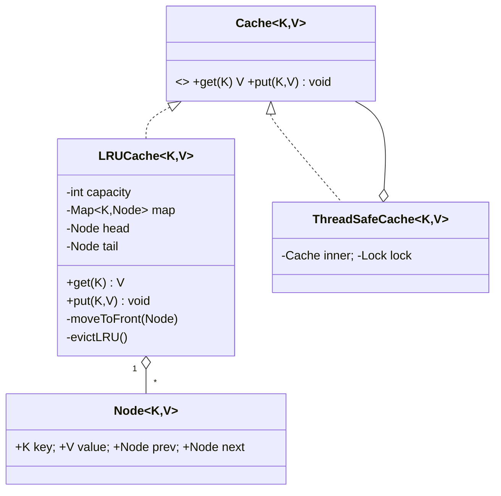

# LRU Cache — LLD Design Doc

> Example output from running `14-lru-cache/PROMPT.md` (PART A + C). Companion code: `_EXAMPLE-lru-cache-Solution.java` (PART B). Kept at the library top level as a quality reference; practice folders contain only `PROMPT.md`. The solution is a **review/revision artifact** — read it, don't compile it.

## 1. Problem statement
Design an in-memory cache with a fixed capacity that evicts the **least-recently-used** entry when full. `get` and `put` must both be **O(1)**.

## 2. Clarifying / requirements questions to ask first
- **Capacity** fixed at construction, or resizable at runtime?
- **O(1)** required for both get and put? (Assume yes — that dictates the data structure.)
- **Does `get` count as a use** (promote to most-recent)? (Assume yes.)
- **Thread-safe?** Single-threaded or concurrent access? (Design for both; show a thread-safe variant.)
- **TTL / expiry** needed, or pure recency? (Pure LRU for v1; TTL as an extension.)
- **Generic keys/values?** Null keys/values allowed? (Generic K/V; disallow null key.)
- **Eviction hook / stats** (notify on eviction, hit ratio)? (Extension.)

## 3. Finalized requirements & assumptions
Fixed capacity set at construction; `get(k)` returns value or "absent" and marks k most-recently-used; `put(k,v)` inserts/updates and evicts the LRU entry when over capacity; both O(1); generic; a single-threaded core plus a thread-safe wrapper.

## 4. Problem extensions / follow-up variations
| Extension | Design impact |
|---|---|
| **LFU** instead of LRU | Swap the eviction policy → motivates a `EvictionPolicy` Strategy interface |
| **TTL / expiry** | Store `expireAt` per node; lazy-expire on access + optional active sweeper |
| **Thread-safe / high-concurrency** | Wrap with a lock; for scale, shard into N segments each with its own lock (like `ConcurrentHashMap`) |
| **Eviction callback / stats** | Observer hook on eviction; counters for hits/misses |
| **Write-through / write-back** | Delegate to a backing store on miss/evict (Strategy) |

## 5. Core entities & responsibilities
- `Node<K,V>` — holds key, value, prev/next pointers (doubly-linked list node).
- **Doubly-linked list** — maintains recency order (head = most-recently-used, tail = least). O(1) move/remove.
- **HashMap<K,Node>** — O(1) lookup from key to its list node.
- `LRUCache<K,V>` — orchestrates the map + list; exposes get/put.
- (Extension) `EvictionPolicy` strategy; `ThreadSafeCache` decorator.

## 6. Design patterns applied
- **Composition of HashMap + doubly-linked list** is the crux: the map gives O(1) find; the list gives O(1) recency reordering. Neither alone is O(1) for both. *(Why not LinkedHashMap? It's the JDK's built-in answer — mention it — but interviewers want the hand-rolled version to prove you understand the mechanism.)*
- **Strategy** (extension) — `EvictionPolicy` so LRU/LFU/FIFO are swappable (OCP).
- **Decorator** (extension) — `ThreadSafeCache` wraps a plain cache to add locking without changing it (SRP/OCP).
- **SOLID:** SRP (list = order, map = lookup, cache = policy), OCP (pluggable eviction), DIP (cache depends on a `Cache` interface).

## 7. Class diagram

## 8. Key flows
**get(k):** map.get(k) → miss? return absent. hit? unlink node + insert at head (most-recent) → return value.
**put(k,v):** exists? update value + move to head. new? create node, insert at head, map.put; if size > capacity → remove tail node + map.remove(tail.key) (evict LRU).
Sentinel head/tail dummy nodes remove all null-edge checks.

## 9. Concurrency, edge cases & extensibility
- **Edge cases:** capacity 0 or 1; update existing key (no size change); evicting while inserting; null key rejected; `get` on miss.
- **Thread-safety:** the core mutates both the map and the list per operation, so a single coarse lock (or `ThreadSafeCache` decorator) is correct and simple. For high concurrency, **segment/shard** the cache by `hash(key) % N`, each segment an independent locked LRU — bounds contention (the production approach; Caffeine goes further with lock-free reads + TinyLFU).
- Extensions (LFU/TTL) plug in behind the `EvictionPolicy`/node fields without touching callers.

## 10. Interview Q&A
- **Why HashMap + doubly-linked list?** Map → O(1) key lookup; DLL → O(1) move-to-front and remove-tail. A singly-linked list can't remove a node in O(1) (no prev pointer). *(senior-signal)*
- *Probe: why sentinel head/tail nodes?* They eliminate null/empty special-cases in insert/remove, reducing bugs.
- **How do you make it thread-safe, and what's the scaling problem?** One lock is correct but serializes all ops; shard into N locked segments to scale, trading exact global LRU for per-segment LRU. *(senior-signal)*
- **How would you switch to LFU?** Extract an `EvictionPolicy` strategy; LFU needs frequency counts + a min-freq structure (O(1) LFU uses freq buckets of DLLs).
- *Probe: add TTL?* Per-node `expireAt`; lazy-expire on access, optional background sweeper; eviction considers expiry before recency.
- **Isn't `LinkedHashMap(accessOrder=true)` enough?** Yes in real code (override `removeEldestEntry`), but interviewers want the underlying mechanism — say both. *(senior-signal)*

## C. Cheat-sheet & self-test
**Recap:** HashMap (O(1) find) + doubly-linked list (O(1) recency) + sentinels. head = MRU, tail = LRU. Evict from tail on overflow. Thread-safe = one lock (correct) or sharded segments (scalable). Extensions via `EvictionPolicy` Strategy. JDK shortcut: `LinkedHashMap` access-order + `removeEldestEntry`.

**Self-test (no answers)**
1. Why can't a singly-linked list give O(1) `put` eviction, and what exactly do prev pointers buy you?
2. Walk the pointer surgery for `put` that updates an existing key vs inserts a new one at capacity.
3. Sharding into segments breaks global LRU — when is that acceptable, and when not?
4. Sketch O(1) LFU and where it differs structurally from this LRU.
5. Add TTL with minimal change to the get/put paths — what do you store and when do you check it?
